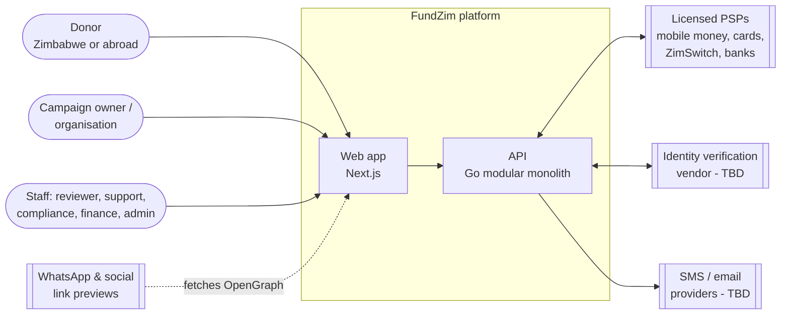
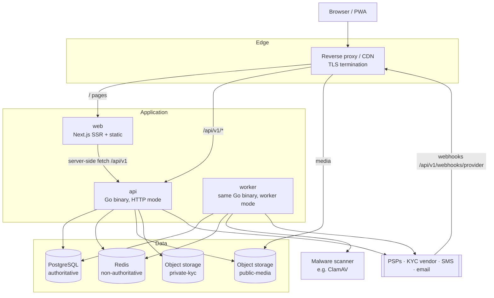
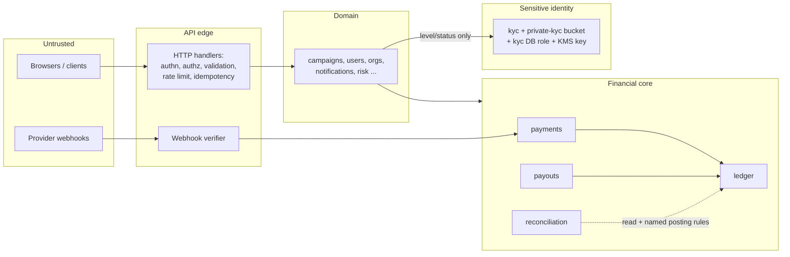

# FundZim — High-Level Architecture

> Status: Stage 0 baseline. This document describes the **target** architecture that all later stages build
> towards. Almost nothing here is implemented yet. Where a choice is deferred, the stage that decides it is
> named. Significant changes require an ADR (see [`docs/adr/`](adr/)).

> **Stage 4 implementation status.** In code: Go binaries `api`, `worker` (River on PostgreSQL, outbox relay
> and delivery, purge jobs) and `fundzimctl` (config, migrations, health, `bootstrap-admins`); `internal/app`
> (composition root), `internal/platform` (config, logging, errors, HTTP middleware incl. trusted client IP,
> distributed rate limiting, idempotency, health, db, cache, storage, metrics, money, ids, crypto, outbox,
> jobs, authz, clock) and the first domain modules `users`, `auth`, `organisations`, `audit`,
> `notifications`; identity, RBAC and organisation migrations; the Next.js app with authentication pages,
> protected routes and a nonce CSP. Module boundaries are enforced by `internal/archtest`. **Not yet built:**
> every financial module (payments, ledger, payouts, fees), KYC/KYB, campaigns, tracing export. Details:
> [stage-4/implementation.md](stage-4/implementation.md) (Stage 3: [stage-3/implementation.md](stage-3/implementation.md)).

Related: [MONEY.md](MONEY.md) · [LEDGER.md](LEDGER.md) · [PAYMENTS.md](PAYMENTS.md) · [SECURITY.md](SECURITY.md) ·
[THREAT-MODEL.md](THREAT-MODEL.md) · [DATABASE.md](DATABASE.md) · [AUDIT.md](AUDIT.md) ·
[OBSERVABILITY.md](OBSERVABILITY.md) · [DATA-CLASSIFICATION.md](DATA-CLASSIFICATION.md) · [COMPLIANCE.md](COMPLIANCE.md)

---

## 1. Architectural drivers

In priority order, when they conflict:

1. **Financial integrity.** Money is never created, lost, duplicated or silently changed. Every movement is
   explainable from append-only records.
2. **Security and privacy of sensitive data.** KYC and payout data sit behind stronger boundaries than
   everything else.
3. **Regulatory adaptability.** FundZim's legal position (custody, licensing, exchange control, AML) is not
   settled (see [COMPLIANCE.md](COMPLIANCE.md)). The architecture must not hard-code an assumption that later
   proves unlawful. The default flow sends money **through licensed payment service providers (PSPs)**, and
   FundZim orchestrates and records.
4. **Operability by a small team.** Boring, proven technology, one deployable unit, few moving parts.
5. **Mobile-first, low-bandwidth users.** Fast server-rendered pages, small payloads, and graceful handling
   of intermittent connectivity.
6. **Room to grow** into other markets and currencies without a rewrite.

## 2. System context



FundZim never holds card data and never moves money itself. PSPs collect funds from donors and settle or pay
out to beneficiaries under approved flows. FundZim initiates, tracks, records, reconciles and controls those
flows.

## 3. Containers



| Container | Responsibility | Notes |
|---|---|---|
| **web** (`apps/web`) | Server-rendered public pages (campaigns, sharing previews), authenticated UI, PWA shell. | Presentation only. It has **no database access, no business or financial logic, and no secrets** beyond public configuration. It calls the API like any other client. |
| **api** (`apps/api`, `internal/`) | All business logic and the system of record. REST `/api/v1/`. | One Go binary. |
| **worker** | Background jobs: webhook processing, outbox dispatch, provider polling, reconciliation, notifications, media processing, malware-scan orchestration. | The **same binary** as api, started in worker mode. It shares modules and has no separate codebase. |
| **PostgreSQL** | The only authoritative store: domain data, ledger, idempotency keys, webhook inbox, outbox, job queue, audit events. | See [DATABASE.md](DATABASE.md). |
| **Redis** | Rate limiting, caching, short-lived coordination. | Optional and **never authoritative** (§8.2). |
| **public-media bucket** | Processed campaign images, served via CDN. | C0 data. |
| **private-kyc bucket** | KYC and compliance documents. | C3 data. Separate credentials and key (§8.3, ADR-009). |
| **Reverse proxy / CDN** | TLS, routing `/api/v1/*` to api (same origin), static caching, coarse rate limiting. | Product chosen at deployment (Stage 18/20). |

### Same-origin API

The browser calls the API at `https://<host>/api/v1/...` through the reverse proxy, **on the same origin as
the web app**. Consequences:

- There is no CORS surface for the main app. Session cookies are first-party, `__Host-` prefixed, and
  `SameSite=Lax`.
- Next.js server components call the API over the internal network. They forward the user's session cookie
  only where needed, and they never mint or hold sessions themselves.
- Webhooks from PSPs arrive at `/api/v1/webhooks/{provider}` and are routed to the api container.

## 4. Modular monolith

One Go module at the repository root (`go.mod`, created in Stage 3) contains `apps/api/cmd/api` (entrypoint)
and `internal/<module>`. See [ADR-001](adr/ADR-001-modular-monolith.md) and [ADR-002](adr/ADR-002-go-backend.md).

### 4.1 Module rules

1. Each module exposes a **public service API**: a Go interface plus types in the module's root package. All
   implementation lives in sub-packages that other modules may not import.
2. A module **owns its tables**. No other module reads or writes them directly, not even "just a quick join".
   Cross-module data is fetched through the owning module's service or through read models it publishes.
3. **No circular dependencies.** The allowed-dependency table below is the contract. From Stage 3 an
   architecture test (import-graph check in CI) enforces it.
4. Modules communicate synchronously through service calls **within one database transaction** when atomicity
   is required, for example a confirmed payment posting to the ledger. Otherwise they communicate
   asynchronously through domain events written to the **outbox**.
5. Only `ledger` writes ledger tables. Only `kyc` reads or writes KYC tables and `private-kyc` objects.
   Only `audit` writes audit events, and every module calls `audit.Record`.
6. `platform` is the shared kernel. It depends on nothing else in `internal/`.

### 4.2 Module catalogue

> **Refined in Stage 2 ([ADR-021](adr/ADR-021-module-boundaries-and-ownership.md)).** The authoritative module
> list, dependency graph and table ownership are in [stage-2/design-baseline.md](stage-2/design-baseline.md)
> §2–§6 and [architecture/dependency-matrix.md](architecture/dependency-matrix.md). Changes since this table:
> new modules `psp` (provider registry, capabilities, adapters, webhook inbox) and `beneficiaries`;
> holds and limits owned by `risk`; evidence records by `audit`; `organisations` no longer imports `kyc`
> (projection fed by events). Table names below are Stage 0 working names; final names are in the baseline §5.

| Module | Responsibility | Owns (data) | May depend on |
|---|---|---|---|
| `platform` | Shared kernel: config, DB pool and transaction helper, logging, IDs (UUIDv7), `money` type, `clock`, HTTP envelope/errors, request context, outbox writer, job queue client, crypto helpers (envelope encryption, HMAC). | `outbox`, `jobs` (queue), `currencies` registry | — |
| `audit` | Append-only audit event recording and query for authorised staff. | `audit_events` | platform |
| `auth` | Sign-in (OTP, optional password), sessions, MFA for staff, CSRF, permission evaluation (RBAC + ownership checks). | `sessions`, `otp_challenges`, `mfa_factors`, `role_assignments`, `permissions` | platform, audit, users |
| `users` | User accounts and profiles (non-KYC), contact points, preferences. | `users`, `user_contacts` | platform, audit |
| `organisations` | Organisations, membership and org roles, link to org verification. | `organisations`, `organisation_members` | platform, audit, users, kyc (status query only) |
| `kyc` | Individual and organisation verification workflows, verification levels, document custody, vendor integration. | schema `kyc.*`, `private-kyc` bucket | platform, audit, storage |
| `storage` | Object storage abstraction, upload sessions, quarantine → scan → promote pipeline, presigned URLs. Bucket policy is per caller class. | `objects`, `upload_sessions` | platform, audit |
| `campaigns` | Campaign content, lifecycle state machine, categories, beneficiaries, updates, media references, payout destination reference. | `campaigns`, `campaign_state_transitions`, `campaign_updates`, `beneficiaries` | platform, audit, users, organisations, kyc (level query), storage, risk (scores, holds — query only) |
| `fees` | Fee schedules and fee calculation (integer basis points, see [MONEY.md](MONEY.md)). Calculation only; never posts. | `fee_schedules` | platform, audit |
| `payments` | Payment intents, provider abstraction and adapters, routing, webhook inbox processing, refunds, disputes. | `payments`, `payment_events`, `refunds`, `disputes`, `webhook_inbox`, `webhook_dead_letters`, `idempotency_keys` | platform, audit, campaigns (eligibility query), fees, ledger, risk |
| `ledger` | Double-entry ledger: accounts, transactions, entries, balances, invariant checks. | `ledger_accounts`, `ledger_transactions`, `ledger_entries`, `ledger_balances` (projection) | platform, audit |
| `payouts` | Withdrawal requests, approvals (maker-checker), payout execution via provider interface, payout holds. | `payout_requests`, `payout_approvals`, `payout_destinations`, `payout_holds` | platform, audit, ledger, payments (provider interface for payouts), campaigns, kyc (level query), risk |
| `risk` | Risk signals, scoring, velocity rules, holds/flags, case creation. | `risk_signals`, `risk_scores`, `risk_cases` | platform, audit |
| `compliance` | Compliance cases, sanctions/PEP screening orchestration, regulatory report preparation, investigation tooling. | `compliance_cases`, `screening_results` | platform, audit, kyc, risk |
| `reconciliation` | Import of provider settlement/transaction reports, matching against payments, payouts and ledger, mismatch cases. | `recon_runs`, `recon_items`, `recon_mismatches` | platform, audit, ledger (reads, and posts only through the ledger service's named posting rules, e.g. settlement received, unmatched funds to suspense), payments (read), payouts (read) |
| `notifications` | Email/SMS (later push/WhatsApp) delivery with templates, preferences, dispatch from outbox. | `notifications`, `notification_templates` | platform, audit, users |
| `admin` | Staff-facing HTTP handlers and workflows composed from other modules' services. It holds no business rules of its own. | — (none) | any module's public service API |

Event consumers (for example `notifications` reacting to `payment.succeeded`) subscribe through the outbox and
do **not** create compile-time dependencies on the producer.

Some dependency directions are deliberately **forbidden**:

- `ledger` depends on nothing domain-specific. It doesn't know what a campaign is; it knows accounts. Callers
  pass account references and source references.
- `payments` must not call `payouts`, and `payouts` must not reach into `payments` tables. They share only the
  provider interface package.
- No module other than `kyc` imports KYC types that contain identity data. Other modules see only
  `kyc.Level` and verification status.
- `fees` never touches the ledger. The caller (payments/payouts) posts the computed amounts.

### 4.3 Trust boundaries



- **T0 → T1:** Every input is untrusted. Webhook payloads are untrusted until signature and replay checks pass
  (and, for weak providers, until confirmed by a server-to-server status call). See
  [PAYMENTS.md §9](PAYMENTS.md#9-webhook-pipeline).
- **T2 → T3 (financial core):** Only through `payments`, `payouts` and `ledger` service methods. Those methods
  require an idempotency key, validate `money.Money` (never raw ints), and record audit events. Financial
  state changes happen inside database transactions with constraints enforced in PostgreSQL as well as in Go.
- **T4 (KYC):** A separate Postgres schema and DB role, a separate bucket, a separate encryption key, and
  application-level encryption of identity numbers. Every read of a document or identity number is
  permission-checked, justified and audited. Other modules learn only verification *levels*.

## 5. Request flow

A typical authenticated mutating request, for example "submit campaign for review":

1. The reverse proxy terminates TLS, applies coarse rate limits and forwards it to api.
2. Middleware chain (order matters; implemented in `internal/app/routes.go`, Stage 4):
   1. request ID (accept a valid inbound `X-Request-ID` only from trusted proxies, otherwise generate one;
      always echo it — see [OBSERVABILITY.md](OBSERVABILITY.md));
   2. client IP resolution (`X-Forwarded-For` honoured only from `TRUSTED_PROXY_CIDRS`);
   3. structured access log (wraps recovery so recovered panics are logged with their 500);
   4. panic recovery;
   5. security headers; CORS (off by default);
   6. body size limit; request timeout;
   7. global per-IP rate limit (Valkey GCRA, protective local fallback);
   8. session resolution (a database failure makes protected routes answer 503);
   9. CSRF check (Origin/Fetch-Metadata + session-bound token) for unsafe methods;
   10. router: route policy authorisation (deny by default), then per-route options such as
       `Idempotency-Key` handling. Account-keyed limits (login per email, OTP per number) run in handlers.
3. Handler: decode into a typed request (unknown fields rejected), validate, and call the module service.
4. Service: authorisation (permission + ownership), then business rules, then a DB transaction that writes
   domain rows + audit event + outbox events **atomically**.
5. Response in the standard envelope. Outbox events are dispatched asynchronously by the worker.

## 6. API conventions

- **Versioning:** URL prefix `/api/v1/`. Breaking changes require `/api/v2/` for the affected resources.
  Additive changes (new optional fields, new endpoints) stay in v1. Clients must ignore unknown response fields.
- **Format:** JSON, UTF-8, `snake_case` field names, RFC 3339 UTC timestamps with `Z`
  (`"2026-10-08T07:30:00Z"`).
- **Envelope:**

  ```json
  { "data": { ... }, "meta": { "request_id": "01JABC..." } }
  ```

  ```json
  {
    "error": {
      "code": "CAMPAIGN_NOT_FOUND",
      "message": "Campaign not found.",
      "details": [ { "field": "goal.amount_minor", "code": "MUST_BE_POSITIVE" } ]
    },
    "meta": { "request_id": "01JABC..." }
  }
  ```

  `code` is a stable `UPPER_SNAKE` identifier that clients branch on. `message` is human-readable, safe to
  display, and never contains internals, SQL or stack traces.
- **Status codes:**

  | Status | Meaning |
  |---|---|
  | 400 | Malformed request |
  | 401 | Unauthenticated |
  | 403 | Authenticated but not permitted |
  | 404 | Resource not found. Also returned instead of 403 where existence itself is sensitive (IDOR hardening). |
  | 409 | State conflict or idempotency-key reuse |
  | 422 | Validation error |
  | 429 | Rate limited, with `Retry-After` |
  | 500 / 503 | Server error / unavailable |
- **Money:** always `{"amount_minor": "10000", "currency": "USD"}`, with `amount_minor` as a string
  ([MONEY.md](MONEY.md)).
- **IDs:** UUIDv7 strings. Public campaign URLs use `slug-shortid`. Authorisation never depends on an ID being
  unguessable.
- **Pagination:** cursor-based: `?limit=20&cursor=<opaque>` → `meta.next_cursor`. The default limit is 20,
  and the server enforces a maximum (100). Offset pagination is not offered on large or financial tables.
- **Idempotency:** mutating financial endpoints (create payment/donation, refund, payout request, payout
  approval, ledger adjustment) **require** an `Idempotency-Key: <uuid>` header. Without it the request fails
  with `400 IDEMPOTENCY_KEY_REQUIRED`. Other mutating endpoints accept it optionally. Semantics are in
  [PAYMENTS.md §10](PAYMENTS.md#10-idempotency).
- **Webhooks in:** `/api/v1/webhooks/{provider}`. These routes are exempt from session auth and CSRF and are
  authenticated by provider signature instead.
- **Health:** `/healthz` (liveness, no dependencies) and `/readyz` (DB reachable, migrations current). Both
  are outside `/api/v1`. See [OBSERVABILITY.md](OBSERVABILITY.md).

## 7. Background processing

All background work runs in the worker process using a **PostgreSQL-backed job queue**
(`FOR UPDATE SKIP LOCKED`; library such as River or equivalent, chosen in Stage 2/3).

| Pattern | Purpose |
|---|---|
| **Transactional outbox** (`outbox` table) | A domain change and "something must happen next" are committed atomically. A dispatcher turns outbox rows into jobs or notifications. This avoids "DB committed but message lost" and "message sent but DB rolled back". |
| **Webhook inbox** (`webhook_inbox`) | Verified provider events are persisted first and acknowledged fast, then processed asynchronously and idempotently. |
| **Scheduled jobs** | Provider status polling for `PENDING` payments, reconciliation runs, ledger balance verification, campaign end-date completion, idempotency key expiry, data retention tasks. |
| **Dead-letter** | Jobs or webhooks that exhaust retries go to a dead-letter table with alerting. They are never silently dropped. |

Jobs must be **idempotent** (at-least-once delivery is assumed). Retries use exponential backoff with jitter
and a maximum attempt count per job type.

## 8. Data stores

### 8.1 PostgreSQL (authoritative)

PostgreSQL is the system of record for everything, including the ledger, idempotency, inbox, outbox and jobs,
so that **financial state and its bookkeeping commit in one ACID transaction**. Database standards, roles and
migration policy are in [DATABASE.md](DATABASE.md) and [ADR-004](adr/ADR-004-postgresql.md).

Database roles (summary):

| Role | Can do |
|---|---|
| `fundzim_migrator` | Sole owner of all schemas and objects; runs DDL. Used only by migrations. |
| `fundzim_app` | DML on its tables. `INSERT`/`SELECT` only on `ledger_entries`, `ledger_transactions` and `audit_events`; `UPDATE` only on the `ledger_balances` projection. No access to `kyc.*`. |
| `fundzim_kyc` | Used only by the kyc module's connection pool. DML on `kyc` tables; does not own the schema. |
| `fundzim_readonly` | Reporting and analytics on approved views. No `kyc` schema access. |

### 8.2 Redis (non-authoritative)

Allowed uses:

- rate-limit counters;
- short-TTL caches of public data (for example rendered campaign summaries);
- ephemeral coordination such as best-effort locks that exist **only to reduce duplicate work**.

Forbidden uses:

- balances, ledger data, payment state, idempotency records, the job queue for financial work, sessions as the
  only copy, or any lock whose loss could cause a double payment.

**Correctness never depends on Redis.** Database constraints and transactions are the real guards. If Redis
is unavailable, the platform degrades: rate limiting falls back to a conservative in-process limiter, and
cache misses go to Postgres. Redis is introduced only when a concrete need is demonstrated (Stage 3+).

### 8.3 Object storage

See [ADR-008](adr/ADR-008-s3-object-storage.md) and [ADR-009](adr/ADR-009-kyc-storage-separation.md).

| Bucket | Contents | Access |
|---|---|---|
| `public-media` | Processed campaign images (re-encoded, EXIF/GPS stripped, resized variants). | Public read via CDN. Write only by the worker after processing. |
| `private-kyc` | ID documents, selfies, organisation registration documents, compliance evidence. | No public access. Server-side encryption with a **dedicated KMS key**. Separate credentials, used only by `kyc`. Staff view via ≤5-minute presigned GETs issued after permission check + justification, every issuance audited. |

All uploads land in a **quarantine** prefix and are size-limited and content-type sniffed (magic bytes, not
the client's `Content-Type`). They are malware-scanned (for example ClamAV) and only then promoted. Images
destined for public display are re-encoded server-side; originals are not published.

## 9. Configuration and secrets

- Configuration comes from environment variables (12-factor), parsed once at startup into a typed config
  struct. Startup fails on missing or invalid required values. Groups are listed in `.env.example`: APP,
  DATABASE, REDIS, STORAGE, AUTH, EMAIL, SMS, PAYMENTS, OBSERVABILITY, SECURITY.
- **Secrets** (DB passwords, provider API keys, webhook signing secrets, encryption keys) are injected from a
  secret manager in non-local environments and are never committed. `.env` is git-ignored; only
  `.env.example` with placeholders is tracked. Config structs implement redacting `String()`/`LogValue()` so
  secrets cannot be logged accidentally.
- Feature flags for incomplete or risky capabilities (for example enabling a payment method) live in config
  or a DB table and are audited when changed.

## 10. Technology stack

| Concern | Choice | Rationale | ADR |
|---|---|---|---|
| Backend language | Go | Static typing, simple concurrency, single static binary, strong stdlib (`net/http`, `log/slog`, `crypto`), good fit for a small team building a financial core. | [ADR-002](adr/ADR-002-go-backend.md) |
| Backend shape | Modular monolith | One deployable and one database transaction boundary for financial consistency. Module boundaries keep the option to extract later. | [ADR-001](adr/ADR-001-modular-monolith.md) |
| Frontend | Next.js (App Router), React, TypeScript, Tailwind CSS | SSR for fast, previewable campaign pages (WhatsApp/OpenGraph), PWA capability, large ecosystem. | [ADR-003](adr/ADR-003-nextjs-frontend.md) |
| Database | PostgreSQL | ACID, rich constraints (CHECK, deferred triggers, exclusion), mature tooling, single authoritative store. | [ADR-004](adr/ADR-004-postgresql.md) |
| Money | int64 minor units + ISO 4217 currency | Exactness. No floating point anywhere. | [ADR-005](adr/ADR-005-exact-money-representation.md), [ADR-010](adr/ADR-010-multi-currency.md) |
| Accounting | Double-entry ledger in Postgres | Auditable, self-balancing, append-only. | [ADR-006](adr/ADR-006-double-entry-ledger.md) |
| Payments | Provider interface + adapters + sandbox | Provider-neutral. No PSP chosen yet. | [ADR-007](adr/ADR-007-payment-provider-abstraction.md) |
| Object storage | S3-compatible (MinIO locally) | Portable across clouds and local hosting. | [ADR-008](adr/ADR-008-s3-object-storage.md), [ADR-009](adr/ADR-009-kyc-storage-separation.md) |
| Jobs | Postgres-backed queue | Jobs commit atomically with domain changes, so there is no second authoritative store. | — (Stage 2/3) |
| Cache / rate limit | Redis (optional) | Fast counters. Strictly non-authoritative. | — |
| Time | UTC everywhere, injected clock | Deterministic tests, no local-time bugs. | [ADR-011](adr/ADR-011-utc-time.md) |
| Packaging | Containers, Docker Compose locally | Reproducible environments. | [ADR-012](adr/ADR-012-container-first.md) |
| Observability | `slog` JSON logs, OpenTelemetry traces/metrics, Prometheus-compatible | Vendor-neutral. See [OBSERVABILITY.md](OBSERVABILITY.md). | — |

Explicitly **not** used without a demonstrated need and an ADR: microservices, Kubernetes, Kafka or other
message brokers, GraphQL, NoSQL primary stores, event sourcing of the whole domain.

## 11. Scalability path

Expected early load is modest: thousands of campaigns, with spikes when a campaign goes viral on WhatsApp.
The path, in order, with each step taken only when measurements justify it:

1. **Cache public reads:** CDN caching of public campaign pages and images (short TTL + revalidation), and
   Redis or in-process caching of campaign summaries.
2. **Scale out api and worker horizontally.** They are stateless; sessions and jobs live in Postgres.
3. **Database:** connection pooling (PgBouncer), indexes and query tuning, read replicas for reporting and
   public reads (never for financial decisions).
4. **Hot-spot handling:** if a single viral campaign's ledger accounts contend, use per-currency sub-ledgers or
   batched balance projection updates. The ledger design allows this without changing invariants
   ([LEDGER.md §9](LEDGER.md#9-concurrency)).
5. **Extract a module into a service** only with an ADR showing a specific need (independent scaling,
   isolation, team boundary) that the steps above cannot meet. Clean module boundaries keep this possible but
   unplanned.

## 12. Multi-market readiness

Currency, country, phone-number format, payment method availability, KYC requirements and fee schedules are
**data/configuration keyed by market and currency**, not hard-coded Zimbabwe constants. Zimbabwe (`ZW`, USD
and ZWG) is the first and only market for now. Default display timezone `Africa/Harare` is a per-market
setting.

## 13. Architecture Decision Records

| ADR | Title |
|---|---|
| [ADR-001](adr/ADR-001-modular-monolith.md) | Modular Monolith Architecture |
| [ADR-002](adr/ADR-002-go-backend.md) | Go Backend |
| [ADR-003](adr/ADR-003-nextjs-frontend.md) | Next.js Frontend |
| [ADR-004](adr/ADR-004-postgresql.md) | PostgreSQL as Authoritative Database |
| [ADR-005](adr/ADR-005-exact-money-representation.md) | Integer/Exact Money Representation |
| [ADR-006](adr/ADR-006-double-entry-ledger.md) | Double-Entry Ledger Requirement |
| [ADR-007](adr/ADR-007-payment-provider-abstraction.md) | Payment Provider Abstraction |
| [ADR-008](adr/ADR-008-s3-object-storage.md) | S3-Compatible Object Storage |
| [ADR-009](adr/ADR-009-kyc-storage-separation.md) | Sensitive KYC Storage Separation |
| [ADR-010](adr/ADR-010-multi-currency.md) | Multi-Currency Architecture |
| [ADR-011](adr/ADR-011-utc-time.md) | UTC Internal Time |
| [ADR-012](adr/ADR-012-container-first.md) | Container-First Development |
| ADR-013 – ADR-020 | Stage 1 regulatory and financial decisions (see [adr/README.md](adr/README.md)) |
| ADR-021 – ADR-031 | Stage 2 system architecture decisions (see [adr/README.md](adr/README.md)) |

## 14. Decisions deferred

| Decision | Stage |
|---|---|
| Migration tool | **Decided Stage 2: goose** ([ADR-028](adr/ADR-028-migration-strategy.md)) |
| Job queue library | **Decided Stage 2: River** ([ADR-025](adr/ADR-025-outbox-inbox-job-queue.md)) |
| HTTP router | **Decided Stage 2: stdlib `ServeMux`** ([ADR-031](adr/ADR-031-data-access-and-http-stack.md)) |
| Go module path | 3 |
| Identity verification vendor | 5 |
| PSP selection (criteria + shortlist; contract + sandbox integration; live acceptance) | 1; 9; 20 |
| Production hosting/topology, CDN, KMS, secret manager | 18/20 |
| Whether the staff portal is a separate host/app | 14 |
| Whether FundZim's ledger balances are on its own balance sheet (custody question) | 1, LEGAL_REVIEW_REQUIRED (LR-001, LR-002) |
