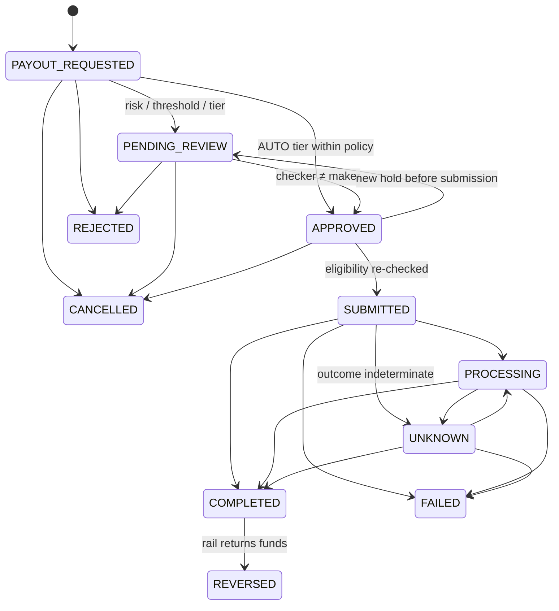

# FundZim — Payments Architecture

> Status: Stage 0 specification, amended in Stage 1 (§6, §8, §13 superseded by
> [ADR-020](adr/ADR-020-payment-payout-state-model-revision.md); Stage 1 detail in [payments/](payments/)).
> **No payment provider is selected and none is integrated.**
>
> | Stage | Delivers |
> |---|---|
> | 8 | Payment abstraction + sandbox provider |
> | 9 | Real Zimbabwean rails |
> | 10 | Ledger |
> | 11 | Payouts |
> | 17 | Reconciliation |
>
> Code samples here are design sketches, not implementations.
>
> Related: [MONEY.md](MONEY.md) · [LEDGER.md](LEDGER.md) · [SECURITY.md](SECURITY.md) ·
> [THREAT-MODEL.md](THREAT-MODEL.md) · [COMPLIANCE.md](COMPLIANCE.md) ·
> [ADR-007](adr/ADR-007-payment-provider-abstraction.md)

---

## 1. Principles

1. **FundZim orchestrates, licensed PSPs move money.** The default flow is *Donor → licensed PSP → approved
   settlement/payout flow → beneficiary*. FundZim does not hold funds, operate a wallet or act as a payment
   provider unless and until legal review concludes otherwise. Custody and licensing are
   `LEGAL_REVIEW_REQUIRED` (LR-001, LR-003, LR-004 in [COMPLIANCE.md](COMPLIANCE.md)).
2. **Provider-neutral core.** Nothing outside `internal/payments/providers/*` knows a PSP's name, API shape,
   status vocabulary or signature scheme.
3. **Only authoritative provider state confirms money.** That means a verified webhook, an authenticated
   server-to-server status query, or reconciliation. **A browser redirect, a return URL hit, a client-side
   SDK callback or a user saying "I paid" confirms nothing.**
4. **Idempotent everywhere, backed by database uniqueness.**
5. **Unknown is a state.** A timed-out request has an unknown outcome until resolved. It is never assumed
   failed, and it is never blindly retried without the same idempotency reference.
6. **No raw card data, ever.** Hosted/tokenised flows only (§16).

## 2. Layering

```
campaigns / donation HTTP handlers
        │
        ▼
payments.Service            ← intents, state machine, idempotency, routing, ledger posting trigger
        │
        ▼
payments.Provider (interface) + Capabilities
        │
        ├── providers/sandbox      (deterministic fake, Stage 8)
        ├── providers/<psp-a>      (Stage 9, TBD)
        └── providers/<psp-b>      (Stage 9, TBD)
```

The payouts module uses the **same provider interface package** for payout operations, but owns its own
tables and state machine (§13).

## 3. Provider interface (sketch)

```go
package payments

type Method string // ECOCASH, ONEMONEY, INNBUCKS, OMARI, ZIMSWITCH, BANK_TRANSFER, CARD

type Provider interface {
    ID() ProviderID                                   // stable, e.g. "sandbox"
    Capabilities() Capabilities

    CreatePayment(ctx context.Context, req CreatePaymentRequest) (CreatePaymentResult, error)
    GetPayment(ctx context.Context, ref ProviderRef) (ProviderPaymentStatus, error)   // a.k.a. GetTransactionStatus
    CancelPayment(ctx context.Context, ref ProviderRef) error
    RefundPayment(ctx context.Context, req RefundRequest) (RefundResult, error)

    VerifyWebhook(ctx context.Context, r InboundWebhook) error                     // signature + replay window
    ParseWebhook(ctx context.Context, r InboundWebhook) ([]ProviderEvent, error)   // normalised events

    CreatePayout(ctx context.Context, req PayoutRequest) (PayoutResult, error)
    GetPayoutStatus(ctx context.Context, ref ProviderRef) (ProviderPayoutStatus, error)
}

type CreatePaymentRequest struct {
    PaymentID      uuid.UUID     // our id; sent to provider as merchant reference
    IdempotencyKey string        // = PaymentID. Never includes an attempt counter: every retry reuses it
    Amount         money.Money
    Method         Method
    Payer          PayerDetails  // e.g. MSISDN for mobile money; minimal data
    ReturnURL      string        // UX only — never confirmation
    Description    string
}

type CreatePaymentResult struct {
    ProviderRef  ProviderRef     // provider transaction id (may be empty if provider assigns later)
    Next         NextAction      // NONE | REDIRECT(url) | AWAIT_HANDSET_APPROVAL | SHOW_INSTRUCTIONS(...)
    Status       NormalisedStatus
}
```

Rules for adapters:

- Adapters translate. They contain **no business rules** (no fee logic, no eligibility checks).
- Adapters map provider statuses to `NormalisedStatus`. When a provider status is unmapped, the adapter maps
  it to `UNKNOWN`, logs it and raises an alert. It never guesses.
- Adapters must not log secrets, full MSISDNs, card data or raw signed payloads. They emit structured fields
  `provider`, `provider_reference` and `payment_id`.
- Every outbound call has an explicit timeout and a context deadline. Network errors are classified as
  `ErrDefinitelyNotSent`, `ErrOutcomeUnknown` or `ErrRejected`, because the service treats them differently
  (§8).
- Unsupported operations return `ErrNotSupported`. They never return a silent no-op.

## 4. Capability model

```go
type Capabilities struct {
    Methods             []Method
    Currencies          []money.CurrencyCode             // e.g. USD, ZWG
    PerMethodCurrency   map[Method][]money.CurrencyCode
    MinAmount, MaxAmount map[money.CurrencyCode]int64     // minor units, per provider limits
    SupportsCancel      bool
    Refunds             RefundSupport                    // NONE | FULL | FULL_AND_PARTIAL
    Payouts             []PayoutRail                     // e.g. ECOCASH, BANK_ZIMSWITCH; empty = none
    ConfirmationMode    ConfirmationMode                 // WEBHOOK_SIGNED | WEBHOOK_UNSIGNED_VERIFY_BY_API | POLL_ONLY
    WebhookReplayWindow time.Duration                    // 0 = provider sends no timestamp
    SettlementCurrency  map[money.CurrencyCode]money.CurrencyCode // what we get settled in
    SettlementReports   bool                             // supports downloadable recon reports
}
```

- Capabilities come from code (what the adapter implements), **intersected with configuration** (what is
  enabled in this environment and contract). A provider can be disabled per method or currency without a
  deploy.
- The UI asks the API which methods are available for a given campaign, currency and amount. It never
  hard-codes rails.

## 5. Routing

`payments.Router.Select(method, currency, amount, context) → ProviderID`:

1. Filter enabled providers whose capabilities include the method + currency and whose amount limits
   contain the amount.
2. Apply a configured priority list per (method, currency). Fallback to the next provider is allowed **only
   before** `CreatePayment` has been attempted. Once a request may have reached a provider, the payment is
   bound to that provider for its lifetime.
3. Record the chosen provider and the routing reason on the payment row.
4. If no provider qualifies, return `422 PAYMENT_METHOD_UNAVAILABLE`.

## 6. Payment intent state machine

> **Superseded by [ADR-020](adr/ADR-020-payment-payout-state-model-revision.md) (Stage 1).** The authoritative
> state model, transition table (P1–P20), rank table and out-of-order rules are in
> [payments/transaction-lifecycle.md](payments/transaction-lifecycle.md). This section is a summary only;
> if the two differ, the lifecycle document wins.

States: `CREATED`, `PENDING`, `REQUIRES_ACTION`, `AUTHORISED` (only for providers that separate authorisation
from capture), `UNKNOWN`, `SUCCEEDED` (= captured/confirmed), `FAILED`, `CANCELLED`, `EXPIRED`,
`PARTIALLY_REFUNDED`, `REFUNDED`, `DISPUTED`, `CHARGED_BACK`.

- `UNKNOWN` replaces the Stage 0 `outcome_unknown` flag. It means FundZim cannot tell whether the provider
  received or processed a request (timeout, connection reset after send, 5xx, malformed response). It is
  resolved **only** by an authoritative status query, webhook or reconciliation. **A timeout never means
  `FAILED`.**
- Settlement is **not** a payment status. It is tracked on settlement/reconciliation records and in the
  ledger ([ledger/settlement-and-custody-model.md](ledger/settlement-and-custody-model.md)).
- `CHARGED_BACK` covers any involuntary reversal (card chargeback or provider-initiated reversal), with a
  `reversal_kind` attribute. It is never recorded as `REFUNDED`.

### 6.1 Precedence (out-of-order protection)

Each status has a rank (`CREATED` 0, `UNKNOWN` 5, `PENDING` 10, `REQUIRES_ACTION` 20, `AUTHORISED` 30,
`FAILED`/`CANCELLED`/`EXPIRED` 50, `SUCCEEDED` 60, then the post-success statuses). An inbound event may move
a payment only if the target has a **higher rank AND** the move is an edge in the state graph. Rank alone is
never sufficient. Events whose prerequisite state has not been reached are **parked** and reprocessed later
(TESTING.md scenario F3). Explicit exceptions (`DISPUTED → SUCCEEDED` when a dispute is won; late
authoritative success after `FAILED`/`EXPIRED`/`CANCELLED`) are listed in the lifecycle document §5.

Every transition is written to `payment_events` (append-only). The transition and its ledger posting happen
in **one DB transaction**; a transition to `SUCCEEDED` without its ledger posting cannot commit.

> **Stage sequencing.** The payment abstraction (Stage 8) is built before the ledger (Stage 10). In Stage 8,
> `payments` posts through the `ledger.Post` interface backed by an explicit **test-only stub** that records
> the requested posting and enforces the idempotency key, but is not a ledger and cannot be enabled outside
> test builds. Stage 10 replaces the stub with the real ledger and adds the ledger-level assertions.

## 7. Donation flow

```mermaid
sequenceDiagram
    autonumber
    participant D as Donor browser
    participant W as web (Next.js)
    participant A as api (payments)
    participant P as PSP
    participant Q as worker
    participant L as ledger

    D->>A: POST /api/v1/campaigns/{id}/donations<br/>Idempotency-Key: k1 {amount, method, payer}
    A->>A: validate, risk pre-check, fee quote, eligibility (campaign ACTIVE)
    A->>A: BEGIN; INSERT payment (CREATED) + idempotency record; COMMIT
    Note over A,P: Provider is called only after the intent row is committed,<br/>never inside a DB transaction
    A->>P: CreatePayment(ref=payment_id, idem=payment_id)
    P-->>A: provider_ref, next_action (e.g. await handset / redirect)
    A->>A: payment → PENDING / REQUIRES_ACTION
    A-->>D: 201 {payment_id, status: PENDING, next_action}
    Note over D,P: Donor approves on phone / hosted page
    P-->>D: redirect to return_url
    D->>W: GET /donate/{payment_id}/return
    W->>A: GET /api/v1/payments/{payment_id}
    A-->>W: status still PENDING
    W-->>D: "Processing — we'll confirm shortly"
    Note over D,W: Redirect is UX only. It confirms NOTHING.
    P->>A: POST /api/v1/webhooks/{provider} (signed)
    A->>A: verify signature + replay window
    A->>A: INSERT webhook_inbox (UNIQUE provider,event_id)
    A-->>P: 200 OK (fast)
    Q->>A: process inbox item
    Q->>P: (if provider weakly signed) GetPayment(provider_ref) to confirm
    Q->>A: BEGIN; payment → SUCCEEDED; ledger.Post(capture + psp_fee, idem="payment:{id}:capture" / ":psp_fee"); outbox(payment.succeeded); COMMIT
    A->>L: (inside same tx)
    Q-->>D: receipt notification (via outbox)
```

The donor's browser polls `GET /api/v1/payments/{id}` with backoff, or later uses server-sent events, to show
the final state. Polling is read-only and never triggers confirmation by itself.

## 8. Timeouts and unknown outcomes

> **Superseded by [ADR-020](adr/ADR-020-payment-payout-state-model-revision.md).** Authoritative procedure:
> [payments/transaction-lifecycle.md](payments/transaction-lifecycle.md) (Flow 6). Summary:

| Situation | Handling |
|---|---|
| `CreatePayment` fails with `ErrDefinitelyNotSent` (e.g. DNS failure, connection refused before write) | Safe to retry with the **same** provider reference (`payment_id`), or fall back to another provider (payment not yet bound). |
| `CreatePayment` times out / `ErrOutcomeUnknown` | The payment moves to **`UNKNOWN`**. The donor is told "We're confirming your payment — don't pay again". A status-poll job queries `GetPayment(payment_id)` with backoff. Creation is retried **only** with the same reference and only if the provider documents idempotent creation (PCR-009); otherwise poll only. |
| No webhook within the provider's expected window | Poll `GetPayment`. Poll results go through the same precedence rules as webhooks (source `POLL`). |
| Still unresolved after the poll horizon | → `EXPIRED` only if the provider confirms expiry or documents a hard expiry (PCR-010). Otherwise the payment stays `UNKNOWN`/`PENDING`, is flagged `needs_reconciliation`, and goes to FINANCE review. **Never mark failed on silence alone.** |
| Success arrives after the client gave up / after `EXPIRED` | Accepted as a late authoritative success (transition P15). The ledger posts and the donor is notified. |

## 9. Webhook pipeline

```
HTTP POST /api/v1/webhooks/{provider}
  1. Size limit, content-type check; read raw body (verification needs exact bytes).
  2. provider.VerifyWebhook: signature (HMAC-SHA256 / RSA / Ed25519 per provider) with constant-time compare;
     timestamp within replay window if the provider supplies one; optional IP allow-list as defence in depth only.
     Fail → 401, log (no payload), metric webhook_verification_failed{provider}; nothing stored.
  3. provider.ParseWebhook → normalised events with provider_event_id.
  4. INSERT INTO webhook_inbox (provider, provider_event_id, received_at, payload_redacted, headers_subset,
     signature_valid, status='RECEIVED') ON CONFLICT (provider, provider_event_id) DO NOTHING.
     Duplicate → still 200 (provider stops retrying).
  5. Respond 2xx immediately. No business processing in the request path.
Worker:
  6. Claim inbox row (SKIP LOCKED). If ConfirmationMode = WEBHOOK_UNSIGNED_VERIFY_BY_API → GetPayment first and
     use the API result, not the payload, as the source of truth.
  7. In one DB transaction: apply state transition with precedence rules; post ledger (idempotent key);
     write payment_event; write outbox events; mark inbox row PROCESSED.
  8. Transient failure → retry with exponential backoff + jitter (e.g. 30s → ~6h, max N attempts).
     Permanent failure / max attempts → move to webhook_dead_letters, alert (paging for financial events).
```

- **Replay protection** comes from three layers: the timestamp window (where supported), the
  `(provider, provider_event_id)` uniqueness, and state precedence, which makes replays no-ops.
- **Duplicate delivery** is a normal case and is tested as such.
- **Out-of-order events** are handled by §6.1.
- **Secrets:**
  - Webhook signing secrets are per provider per environment and stored in the secret manager.
  - Rotation supports two active secrets during the overlap period.
- **Redaction:**
  - The stored payload excludes anything the provider sends that we must not hold (for example card BINs
    beyond what is needed, or full MSISDN). Those values are masked before insert.
  - The raw body is never logged.
- **Dead-letter handling:**
  - An ops tool (Stage 14) lets staff inspect a dead-lettered item and **re-queue** it.
  - Staff can never edit a dead-lettered item.
  - Every re-queue is audited.

## 10. Idempotency

### 10.1 Client → API

- Required header `Idempotency-Key` (UUID) on:
  - `POST` donations/payments;
  - refunds;
  - payout requests;
  - payout approvals;
  - ledger adjustments.
- Table `idempotency_keys`:

  ```sql
  CREATE TABLE idempotency_keys (
    scope         TEXT        NOT NULL,          -- actor id (or anonymous session id) + route template
    key           UUID        NOT NULL,
    request_hash  BYTEA       NOT NULL,          -- SHA-256 of canonicalised method+path+body
    status        TEXT        NOT NULL CHECK (status IN ('IN_PROGRESS','COMPLETED')),
    response_code SMALLINT,
    response_body JSONB,                         -- no secrets; replayed verbatim
    resource_id   UUID,
    created_at    TIMESTAMPTZ NOT NULL DEFAULT now(),
    expires_at    TIMESTAMPTZ NOT NULL,
    PRIMARY KEY (scope, key)
  );
  ```

- Semantics:

  | Request | Response |
  |---|---|
  | First request | Insert `IN_PROGRESS` (in its own short transaction), process, then store the response as `COMPLETED`. |
  | Same key, same hash, `COMPLETED` | Replay the stored response. |
  | Same key, same hash, `IN_PROGRESS` | `409 IDEMPOTENCY_REQUEST_IN_PROGRESS` with `Retry-After`. |
  | Same key, **different** hash | `409 IDEMPOTENCY_KEY_REUSED`. |

- Retention is at least 24 h (configurable), cleaned by a job. Financial uniqueness does **not** depend on
  this table alone (§10.3).

### 10.2 FundZim → provider

- Our `payment_id` (UUIDv7) is the merchant reference and idempotency reference for creation. Refunds use
  `refund_id` and payouts use `payout_id`. Retries reuse the same reference, so the provider can dedupe.
- Where a provider does not support idempotent creation, the adapter documents it in Capabilities, and the
  service never auto-retries creation after an unknown outcome (§8).

### 10.3 Database uniqueness (last line of defence)

| Constraint | Prevents |
|---|---|
| `UNIQUE (provider, provider_transaction_id)` on `payments` (where not null) | Two payments bound to one provider transaction |
| `UNIQUE (provider, provider_event_id)` on `webhook_inbox` | Double processing of an event |
| `UNIQUE (idempotency_key)` on `ledger_transactions` | Double posting (e.g. `payment:{id}:capture`) |
| `UNIQUE (provider, provider_refund_id)`, `UNIQUE (refund_id)` | Double refunds |
| `UNIQUE (idempotency_key)` on `payout_requests`; `UNIQUE (provider, provider_payout_id)` | Double payouts |

## 11. Refunds

> Stage 1 detail: [payments/refund-and-reversal-flows.md](payments/refund-and-reversal-flows.md) (Flow 4,
> journals) and [payments/refund-and-dispute-architecture.md](payments/refund-and-dispute-architecture.md)
> (refund-request and refund state machines, roles). Those documents are authoritative; this is a summary.

- Who initiates:
  - staff: SUPPORT or COMPLIANCE may only **request** a refund; FINANCE **approves** (maker-checker: the
    requester can never approve);
  - system-initiated for campaign cancellation or fraud outcomes, still with approval.
- Preconditions:
  - the payment is `SUCCEEDED` or `PARTIALLY_REFUNDED`;
  - the refundable remaining amount is ≥ the request, computed from refund records and ledger, not a mutable
    counter;
  - the provider supports refunds;
  - the campaign payable balance can cover it, or the shortfall is handled per policy (open question, for
    example when funds were already paid out).
- Flow:
  1. Create a refund request (`REQUESTED` → `PENDING_APPROVAL`).
  2. FINANCE approval (`APPROVED`), or `REJECTED` / `ON_HOLD`.
  3. `RefundPayment(ref=refund_id)`; the refund entity tracks provider processing, including an `UNKNOWN`
     outcome resolved by status query (PCR-006).
  4. Authoritative confirmation → refund `SUCCEEDED`/`FAILED`.
  5. The ledger follows [LEDGER.md](LEDGER.md) §6.3: a **reservation** is posted on approval (moving the amount
     out of `campaign_payable` into `refund_payable`, so it cannot be paid out concurrently), the
     **settlement** is posted on authoritative confirmation, and a failed refund posts the exact **reversal**
     of the reservation. The payment status updates to PARTIALLY_REFUNDED/REFUNDED on confirmation.
- Providers without refund support (some mobile-money rails): refunds become **manual refund payouts** via the
  payout flow to the original payer, with stronger verification. This is an open item per provider.

## 12. Disputes and chargebacks (cards)

> Stage 1 detail: [payments/refund-and-reversal-flows.md](payments/refund-and-reversal-flows.md) (Flow 5) and
> the dispute case state machine in
> [payments/refund-and-dispute-architecture.md](payments/refund-and-dispute-architecture.md).

- A dispute notification moves the payment to `DISPUTED` and creates a `dispute` record (reason, deadline,
  amount). It raises a risk signal and may place a **payout hold** on the campaign.
- Ledger treatment is defined in [LEDGER.md](LEDGER.md) §6.4, which is authoritative. In summary:
  - when the provider debits the funds (dispute opened), the amount is debited from `campaign_payable`
    (shortfall to `asset:chargeback_recoverable`, with a payout hold) and credited to `psp_clearing` or `psp_settled` (whichever holds the funds at the time; see
    [ledger/settlement-and-custody-model.md](ledger/settlement-and-custody-model.md));
  - won: the exact inverse is posted;
  - lost: no further movement for the disputed amount; recovery or approved write-off follows LEDGER §6.4;
  - for providers that debit only on loss, the amount is moved to `campaign_held` when the dispute opens.
- Payment state: won → `SUCCEEDED`; lost or accepted → `CHARGED_BACK` (terminal). A provider-initiated reversal without a dispute phase also ends
  in `CHARGED_BACK` (`reversal_kind = PROVIDER_REVERSAL`). A chargeback is never recorded as
  `REFUNDED`, so refund and chargeback reporting stay distinct.
- Evidence submission is an ops workflow (Stage 14). Chargeback liability allocation between FundZim, the PSP
  and the campaign owner is a contract/legal question (`LEGAL_REVIEW_REQUIRED`, LR-020).

## 13. Payouts (withdrawals)

> **Superseded by [ADR-020](adr/ADR-020-payment-payout-state-model-revision.md) (state names) and the Stage 1
> payout documents.** Authoritative: [payments/payout-lifecycle.md](payments/payout-lifecycle.md) (states,
> transitions Y1–Y14, ledger effects) and
> [payments/payout-eligibility-and-controls.md](payments/payout-eligibility-and-controls.md) (checks
> EC-01–EC-22, limits, holds, approval tiers). This section is a summary.

Payout states: `PAYOUT_REQUESTED`, `PENDING_REVIEW`, `APPROVED`, `SUBMITTED`, `PROCESSING`, `COMPLETED`,
`FAILED`, `REJECTED`, `CANCELLED`, `UNKNOWN`, `REVERSED`. (Stage 0 names `REQUESTED`, `UNDER_REVIEW`, `PAID`
and `RETURNED` became `PAYOUT_REQUESTED`, `PENDING_REVIEW`, `COMPLETED` and `REVERSED`.)



Key rules (detail in the payout documents):

- Preconditions include `PAYOUT_VERIFIED` owner or organisation, a verified beneficiary
  ([ADR-016](adr/ADR-016-beneficiary-verification-before-payout.md)), a payout-eligible campaign (not
  `SUSPENDED`/`FROZEN`), no active hold, amount ≤ **available** (settled and released) balance in that
  currency, verified destination ownership, elapsed cooling-off after destination changes, valid fundraising
  authority where required, and passing risk checks (Stage 11 minimal rule-based hook, extended in Stage 13).
  Eligibility is re-checked immediately before `SUBMITTED`.
- Every payout passes automated policy checks. Approval tiers are AUTO / SINGLE / DUAL; the pilot has no AUTO
  tier (PD-24). Payouts above configurable thresholds (LR-030) or flagged by risk need maker-checker by
  FINANCE, with approver ≠ requester ≠ initiator
  ([ADR-017](adr/ADR-017-payout-approval-segregation-of-duties.md)).
- Funds are reserved at `PAYOUT_REQUESTED` (payable → payout-pending), moved to `payout_in_transit` at
  `SUBMITTED`, and settled at `COMPLETED` from authoritative provider state only.
- `payout_id` is the provider reference on every attempt. A payout in `UNKNOWN` is **never resubmitted**; it is
  resolved by status query (PCR-026) or reconciliation. A retry after an authoritative `FAILED` is a **new**
  payout request with a new id.
- Holds can stop a payout up to `APPROVED`; after `SUBMITTED` only a provider-supported cancel or recall
  (PCR-014) applies.
- Payout destination changes trigger a payout hold, notification to all contact points, and a cooling-off
  period (duration is a policy decision).

## 14. Sandbox provider (Stage 8)

A first-class provider (`providers/sandbox`), enabled only in non-production environments. **Startup
refuses to enable it when `APP_ENV=production`.**

- Implements the full interface with configurable capabilities (simulate mobile money, card or bank).
- Behaviour is **scriptable per request**: by payer MSISDN/test card pattern, by an amount suffix, or by an
  explicit scenario header honoured only in test environments.
- Signs its webhooks with a test secret, using the same verification path as real providers.
- Has a controllable clock, and a test API to deliver, duplicate, reorder, delay or drop events on demand.

Required scenarios:

| Scenario | Behaviour |
|---|---|
| `success` | Pending → webhook SUCCEEDED |
| `success_handset` | REQUIRES_ACTION, then SUCCEEDED after delay |
| `decline` | FAILED with reason |
| `insufficient_funds` | FAILED |
| `user_cancel` | CANCELLED |
| `expire` | EXPIRED after timeout |
| `create_timeout` | `CreatePayment` hangs past client deadline; payment is actually created |
| `create_timeout_not_created` | Timeout, nothing created |
| `success_after_timeout` | Client sees timeout, provider later reports SUCCEEDED |
| `duplicate_webhook` | Same event delivered N times |
| `out_of_order` | SUCCEEDED delivered before PENDING |
| `failed_then_succeeded` | FAILED event then authoritative SUCCEEDED |
| `bad_signature` | Webhook with invalid signature |
| `replayed_old` | Valid signature, timestamp outside window |
| `webhook_never` | No webhook; only polling reveals state |
| `refund_success` / `refund_fail` / `partial_refund` | Refund outcomes |
| `dispute_won` / `dispute_lost` | Chargeback lifecycle |
| `payout_paid` / `payout_failed` / `payout_returned` / `payout_timeout` | Payout outcomes |
| `settlement_report_mismatch` | Recon report disagrees with webhooks |

## 15. Candidate rails (targets only — none integrated)

| Rail | Typical use | Notes / unknowns |
|---|---|---|
| EcoCash | Local donors, payouts | Integration likely via an aggregator/PSP. USD/ZWG support, limits and payout APIs to be confirmed. |
| OneMoney | Local donors | Same as EcoCash. |
| InnBucks | Local donors | Same as EcoCash. |
| O'Mari | Local donors | Same as EcoCash. |
| ZimSwitch (cards, instant transfers) | Local bank customers | Via an acquiring/aggregating PSP. |
| Zimbabwean bank transfer (RTGS/instant) | Payouts, larger donations | Reconciliation of manual transfers is hard. Prefer PSP-mediated references. |
| Visa / Mastercard | International and diaspora donors | **Only via a PSP's hosted/tokenised checkout.** Cross-border receipt is subject to exchange-control review (LEGAL_REVIEW_REQUIRED, LR-005). |

No provider has been chosen. No real credentials exist in this repository. Stage 1 researched candidate
providers per rail: see [payments/provider-capability-matrix.md](payments/provider-capability-matrix.md) and
[payments/provider-comparison.md](payments/provider-comparison.md). Open provider questions are numbered
`PCR-xxx` in [payments/provider-questions.md](payments/provider-questions.md).

## 16. Card data and PCI DSS scope stance

- FundZim never receives, transmits or stores PAN, CVV/CVC, track data or PIN. Card entry happens in a PSP-hosted
  page or a PSP-hosted iframe/field set. FundZim stores only PSP tokens/references and non-sensitive display
  data (brand, last 4, if the PSP provides it).
- The intent is to keep FundZim's environment out of cardholder-data scope as far as the chosen integration
  allows. The applicable PCI DSS validation type depends on the integration method and the acquirer, and must
  be confirmed in Stage 9. **No PCI DSS compliance is claimed.**
- CSP on donation pages restricts script/frame sources to the PSP domains needed. Pages hosting PSP fields
  receive extra integrity attention because script injection on those pages is a skimming risk.

## 17. Provider selection criteria (Stage 1 shortlist, Stage 9 integration)

> **Stage 1 outcome.** These criteria were applied in
> [payments/provider-comparison.md](payments/provider-comparison.md) (weighted scoring, must-pass gates) and
> [payments/provider-due-diligence-checklist.md](payments/provider-due-diligence-checklist.md). Selection is
> **PENDING**: no candidate yet has verified RBZ licensing evidence, contract fit for crowdfunding, or a
> verified Model A custody arrangement (PCR-001 – PCR-003). The operating model the provider must support is
> set by [ADR-013](adr/ADR-013-regulatory-operating-model.md).

These criteria are applied in **Stage 1** to produce a PSP shortlist alongside the regulatory work. The chosen
provider(s) are contracted and integrated against their **sandbox** in Stage 9. Live acceptance of real donor
money happens only at Stage 20 (see [ROADMAP.md](ROADMAP.md)).


1. Licensing/authorisation status in Zimbabwe for the services used, verified by counsel
   (`LEGAL_REVIEW_REQUIRED`, LR-004).
2. Rails, currencies (USD, ZWG) and directions (collection **and** payout) supported.
3. Settlement model: who holds funds and for how long, settlement currency and timing, and whether funds can
   go to beneficiaries directly or must pass through a FundZim-named account (custody implications).
4. Webhook quality: signatures, timestamps, event IDs, retry policy, documented ordering guarantees.
5. Idempotent create/refund/payout APIs. Status query API.
6. Sandbox quality and test tooling.
7. Downloadable settlement/transaction reports with stable references (for reconciliation).
8. Refund and dispute support.
9. Fees, limits, reserves and rolling holds.
10. Security posture: API auth (mTLS/OAuth/HMAC), key rotation, IP allow-listing, incident history, SOC/PCI
    attestations (to be reviewed, not assumed).
11. Uptime/SLA, support responsiveness, contractual terms (liability, chargebacks, termination).
12. AML/KYC obligations the provider imposes on FundZim and on campaign owners.

## 18. Open questions

| # | Question | Owner |
|---|---|---|
| P-1 | Which PSP(s)? Can one aggregator cover mobile money + ZimSwitch + international cards? | Business: shortlist Stage 1, contract/integration Stage 9 |
| P-2 | Do funds settle to beneficiaries directly, or to a FundZim-controlled account first? | Custody (LEGAL_REVIEW_REQUIRED, LR-001) |
| P-3 | Donor-covers-fees vs fees deducted from donation vs optional tip model | Business, Stage 12 (LR-028) |
| P-4 | ZWG minor units in practice on each rail | Stage 9 |
| P-5 | Refund path for rails without refund APIs | Stage 9/11 |
| P-6 | Chargeback liability allocation | Legal/contract (LR-020) |
| P-7 | Exchange-control treatment of foreign-card donations and USD payouts | LEGAL_REVIEW_REQUIRED (LR-005) |
| P-8 | Accept non-goal currencies on a campaign? | Product (see [MONEY.md §9](MONEY.md#9-campaign-goal-and-multi-currency-display)) |
| P-9 | Payout thresholds, cooling-off periods, auto-approval limits | Risk/Finance, Stage 11/13 (LR-030) |
| P-10 | Donation limits per donor/method (AML thresholds) | Compliance, LEGAL_REVIEW_REQUIRED (LR-007) |
