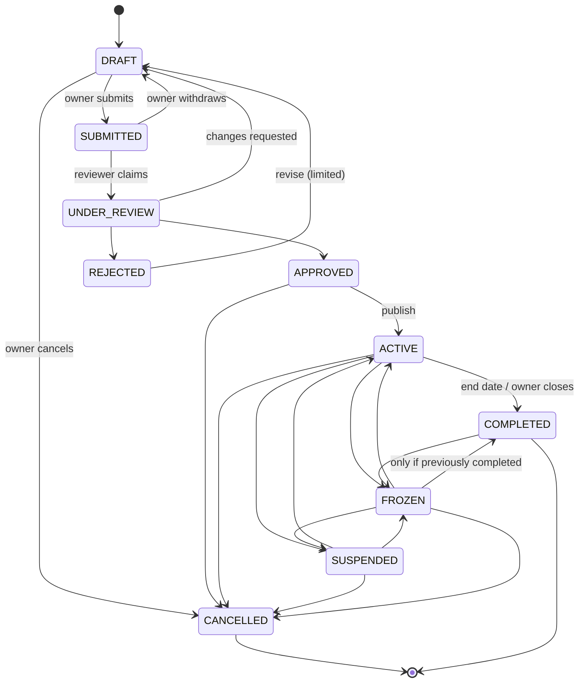

# FundZim — Product Specification

| | |
|---|---|
| Status | Stage 0 baseline — living document |
| Owner | Product / Technical Lead |
| Related | [ARCHITECTURE.md](ARCHITECTURE.md), [PAYMENTS.md](PAYMENTS.md), [LEDGER.md](LEDGER.md), [MONEY.md](MONEY.md), [COMPLIANCE.md](COMPLIANCE.md), [PRIVACY.md](PRIVACY.md), [ROADMAP.md](ROADMAP.md) |

This document defines **what FundZim is, who it serves, and how it should behave**. It is the product
reference for every later stage. Technical detail lives in the linked documents; where this document and a
technical document disagree, raise it and fix one of them — do not silently pick one.

Anything that depends on Zimbabwean law or regulation is marked **LEGAL_REVIEW_REQUIRED** and is tracked in
the compliance assumptions register in [COMPLIANCE.md](COMPLIANCE.md). Nothing in this document is a legal
conclusion.

---

## 1. Vision

> **Fund anyone in Zimbabwe, from anywhere.**

FundZim is a Zimbabwe-first donation crowdfunding platform. It lets individuals and verified organisations in
Zimbabwe raise money for causes such as medical bills, school fees, funerals and community projects. Donors in
Zimbabwe and abroad (especially the diaspora) can contribute using payment methods that suit them: mobile
money, local bank and card rails, and international cards.

GoFundMe and similar platforms assume card payments, a single currency, bank accounts for everyone, and
reliable broadband. Zimbabwe has none of these by default:

- Much day-to-day money movement happens through **mobile money** (EcoCash, OneMoney, InnBucks, O'Mari) and
  **ZimSwitch**-connected bank rails.
- Two currencies are in everyday use: **USD** and **ZiG** (ISO 4217 `ZWG`). They must never be blended.
- Much of the funding comes from the **diaspora**: South Africa, the UK, the US, Australia and elsewhere.
- Campaigns spread mostly through **WhatsApp**, usually opened on low- to mid-range Android phones over
  metered, intermittent connections.
- Trust is fragile, because fraudulent appeals are common. Verification has to be visible and meaningful.

## 2. What FundZim is — and is not

### FundZim is

- A **donation-based** crowdfunding platform. Donors give money and receive nothing of financial value in
  return.
- A **campaign management, payment orchestration, record-keeping and payout orchestration** service working
  with **licensed payment service providers (PSPs)**.
- A **trust layer**: identity and organisation verification, campaign review, fraud and risk controls, audit
  trails, and reconciliation.

### FundZim is not

| Out of scope | Why |
|---|---|
| Equity / investment crowdfunding (shares, securities, ownership interests) | Likely engages securities regulation and a separate licensing regime — out of scope regardless; **LEGAL_REVIEW_REQUIRED** (LR-025) if ever reconsidered |
| Lending / debt crowdfunding, interest-bearing products | Likely engages credit/lending regulation — out of scope; **LEGAL_REVIEW_REQUIRED** (LR-025) if ever reconsidered |
| Profit-sharing or revenue-sharing | Possible collective-investment / securities characterisation — out of scope; **LEGAL_REVIEW_REQUIRED** (LR-025) if ever reconsidered |
| Reward-based crowdfunding (pre-orders, perks) | Consumer-protection and fulfilment liability; not in the initial product |
| A bank, wallet or stored-value product | FundZim does **not** assume it may hold customer funds or issue e-money — **LEGAL_REVIEW_REQUIRED** (LR-001, LR-003) |
| A payment service provider | FundZim initiates and orchestrates payments through licensed PSPs; it is not itself assumed to be licensed — **LEGAL_REVIEW_REQUIRED** (LR-004) |
| A marketplace for goods or services | Not a crowdfunding use case |

Adding any of these later requires a new product decision, legal review and new ADRs. It is never "just a
feature".

### Intended flow of funds

```
DONOR → LICENSED PSP → APPROVED SETTLEMENT / PAYOUT FLOW → BENEFICIARY
                  ▲
                  └── FundZim: campaign management, payment initiation, transaction records, ledger,
                      fees, risk, KYC workflow, payout orchestration, reconciliation, reporting
```

The settlement model itself (who holds funds between donation and payout, and in whose name) is still open:
**LEGAL_REVIEW_REQUIRED** (LR-001, LR-004). The architecture must work under several plausible models, for example PSP-held
funds paid out on FundZim's instruction, or split settlement direct to the beneficiary.

## 3. Product principles

### 3.1 Zimbabwe first

- Local payment rails are first-class. Cards are not the default and mobile money is not an afterthought.
- USD and ZiG are both supported from the data model up. They are never converted or combined implicitly
  (see [MONEY.md](MONEY.md)).
- Phone number (MSISDN, E.164 `+263…`) is a primary identifier alongside email.
- Copy is in plain English first. The architecture supports localisation; **Shona** and **Ndebele** are
  candidates for later stages.
- Times are shown in Africa/Harare (CAT, UTC+2) by default and stored in UTC.
- Local identity documents (Zimbabwe national ID, passport) and local organisation types (trusts, PVOs,
  churches, community-based organisations, companies) are modelled explicitly.
- Nothing should block expansion into other African markets later. Countries, currencies, rails and
  identity-document types are data, not hard-coded assumptions.

### 3.2 Mobile first

- Design for small Android screens first, then scale up.
- Campaign pages must load fast on 3G-class connections. Set a performance budget (Stage 7), serve
  responsive, compressed images, and render the page server-side so the first view does not depend on heavy
  client JavaScript.
- PWA-ready: installable, with an offline fallback page and resilient form state (drafts survive a dropped
  connection).
- Keep the donation flow to the fewest possible steps. Mobile-money flows involve an approval on the donor's
  handset (USSD or push prompt), so the UI must handle "waiting for approval on your phone" gracefully.
- Accessibility target: WCAG 2.2 AA where reasonably achievable (see [FRONTEND.md](FRONTEND.md)).

### 3.3 Trust first

Crowdfunding only works if donors believe money reaches the stated cause. Trust features are core product,
not later add-ons:

- Visible verification badges, backed by real verification states.
- Every campaign is reviewed before it goes public.
- Beneficiary relationship is declared, and evidenced where risk requires it.
- Anyone can report a campaign.
- Risk scoring with payout holds.
- Staff can suspend or freeze a campaign quickly, and every such action is audited.
- Donations and payouts are traceable end to end in the ledger and the audit log.

## 4. User types and permission architecture

The full RBAC/ABAC model is implemented in Stages 4 and 14. Stage 0 fixes the shape.

| Role | Who | Typical capabilities | Explicitly NOT allowed by default |
|---|---|---|---|
| `DONOR` | Anyone giving money; may be a guest (no account) | Donate, view receipts, manage own donation visibility | — |
| `CAMPAIGN_OWNER` | Individual who creates campaigns | Draft/submit/edit own campaigns, post updates, request withdrawals (when verified) | Act on others' campaigns |
| `ORGANISATION` | Verified organisation; members carry `ORG_ADMIN` or `ORG_MEMBER` | Run campaigns on behalf of the organisation; org admins manage members and payout accounts | Members cannot change payout accounts unless `ORG_ADMIN` |
| `REVIEWER` | Trust & safety staff | Review submitted campaigns, request changes, approve/reject, suspend/unsuspend | View KYC documents (needs a separate grant), touch money |
| `SUPPORT` | Customer support staff | View account/campaign status, assist users, see masked PII, **request** refunds | View KYC documents, unmask donor identities, approve refunds or otherwise move money |
| `COMPLIANCE` | Compliance / AML staff | KYC decisions, investigations, suspend/freeze, view KYC docs (with justification), prepare regulatory reports, **request** refunds | Approve payouts or refunds, post ledger adjustments |
| `FINANCE` | Finance / operations staff | Approve payouts above threshold (maker-checker), approve refunds, reconciliation, ledger adjustments (dual control) | Approve their own requests, view KYC documents |
| `KYC_REVIEWER` | Identity-verification staff (added in Stage 1, [ADR-017](adr/ADR-017-payout-approval-segregation-of-duties.md)) | Review KYC/KYB cases and decide verification outcomes; view KYC documents with justification | Approve payouts or refunds, change campaign state, post ledger entries |
| `SECURITY_ADMIN` | Security administration (added in Stage 1, [ADR-017](adr/ADR-017-payout-approval-segregation-of-duties.md)) | Access reviews, key and secret rotation, incident tooling, security configuration | Access financial records, KYC documents or donor identities; approve any financial action |
| `ADMIN` | Platform operations admin | Configuration, content moderation, staff support tasks | Implicit KYC document access, ledger adjustments, payout approval |
| `SUPER_ADMIN` | Very small number of named people | Assign and revoke roles, emergency configuration | Bypass sensitive-access controls; still needs the specific permission + justification + audit |

Principles:

1. **Least privilege.** Permissions are granular (`campaign.review`, `kyc.document.view`, `payout.approve`,
   `ledger.adjustment.create`, `donor.identity.unmask`, …). Roles are bundles of permissions, and no role is
   "allow all".
2. **Ownership checks always apply.** A campaign owner can act only on their own campaigns, and an org member
   only within their organisation. Authorisation never relies on an ID being hard to guess.
3. **Separation of duties.** Every payout passes automated policy checks; payouts **above configurable
   thresholds** (or flagged by risk), all refunds, ledger adjustments and role grants require
   **maker-checker**: the approver must be a different person from the initiator. Threshold values are a
   policy decision subject to legal review (`LEGAL_REVIEW_REQUIRED`, LR-030).
4. **Sensitive access is justified and audited.** Viewing KYC documents, unmasking anonymous donors and
   exporting financial data require a stated reason and produce an audit event. A user can hold more than
   one staff role, but each sensitive action still needs its own permission.
5. **Staff security.** Staff accounts require MFA (WebAuthn preferred, TOTP as fallback) and shorter sessions.
   Break-glass access is time-boxed, alerts on use, and is reviewed afterwards.

## 5. Campaign categories

Initial categories (configurable data, not an enum hard-coded in UI):

| Category | Notes / extra checks (risk-driven) |
|---|---|
| Medical | Evidence such as a quotation or medical letter may be requested; health data is sensitive, see [PRIVACY.md](PRIVACY.md) |
| Education | School fees, uniforms, tuition; the institution may be the payee where supported |
| Funeral | Time-critical; needs a fast-track review path with risk controls |
| Emergency | Disaster or urgent need; time-critical |
| Community | Boreholes, schools, clinics, local projects |
| Charity | Usually organisation-run; organisation verification required |
| Religious / community organisation | Churches and faith-based organisations; organisation verification required |
| Sports | Teams, tournaments, travel |
| Personal causes | Broad; higher review scrutiny |
| Other approved causes | Reviewer must classify or justify |

Prohibited purposes (non-exhaustive, policy owned by Compliance): investment schemes, lending, political
campaign financing (**LEGAL_REVIEW_REQUIRED** (LR-025)), illegal activity, sanctioned persons or entities, hate or
violence, and funds for legal defence of certain crimes (policy decision).

## 6. Campaign lifecycle

### 6.1 States

| State | Meaning | Public? | Accepts donations? | Payouts allowed? |
|---|---|---|---|---|
| `DRAFT` | Being written by owner | No | No | No |
| `SUBMITTED` | Owner submitted for review; waiting in queue | No | No | No |
| `UNDER_REVIEW` | A reviewer has claimed it | No | No | No |
| `APPROVED` | Passed review, not yet published | No (preview link for owner) | No | No |
| `ACTIVE` | Live and fundraising | Yes | Yes | Yes, subject to KYC, holds, risk |
| `COMPLETED` | Fundraising ended (end date or owner closed) | Yes (read-only) | No | Yes, subject to KYC, holds, risk |
| `REJECTED` | Failed review | No | No | No |
| `SUSPENDED` | Temporarily paused by staff (trust/compliance) | Yes, with notice, or hidden by policy | No | No (paused) |
| `FROZEN` | Serious concern; under investigation | Yes, with notice, or hidden by policy | No | **No — all payouts frozen** |
| `CANCELLED` | Ended permanently before completion | Notice page | No | Per resolution policy |

Reaching the goal does **not** complete a campaign automatically. Many campaigns keep raising past their goal,
and the owner may choose to close.

### 6.2 Transitions

| From | To | Actor | Conditions / effects |
|---|---|---|---|
| DRAFT | SUBMITTED | Owner | Owner ≥ `IDENTITY_VERIFIED`; required fields complete; policy acknowledgements accepted |
| DRAFT | CANCELLED | Owner | No funds involved |
| SUBMITTED | UNDER_REVIEW | Reviewer | Reviewer claims; a reviewer must not review campaigns they have a conflict with |
| SUBMITTED | DRAFT | Owner | Owner withdraws to edit |
| UNDER_REVIEW | APPROVED | Reviewer | Checklist complete; risk score within threshold or escalation resolved |
| UNDER_REVIEW | REJECTED | Reviewer | Reason code + text sent to owner |
| UNDER_REVIEW | DRAFT | Reviewer | "Changes requested" with reasons |
| APPROVED | ACTIVE | Owner (publish) or system (auto-publish) | Payout destination may still be pending verification |
| APPROVED | CANCELLED | Owner / staff | No funds involved |
| ACTIVE | COMPLETED | System (end date) / Owner | Donations stop; existing pending payments still settle |
| ACTIVE | SUSPENDED | Reviewer / Compliance | Reason required; donations paused; payouts paused; owner notified |
| ACTIVE | FROZEN | Compliance / Finance | Reason required; donations stopped; all payouts frozen; funds held pending investigation |
| ACTIVE | CANCELLED | Owner (staff review required if any funds raised) / Staff | Resolution of raised funds per policy — **LEGAL_REVIEW_REQUIRED** (LR-019) |
| SUSPENDED | ACTIVE | Reviewer / Compliance | Concern resolved; reason recorded |
| SUSPENDED | FROZEN | Compliance / Finance | Escalation |
| SUSPENDED | CANCELLED | Compliance | Funds resolution per policy |
| COMPLETED | FROZEN | Compliance / Finance | Post-completion investigation (e.g. before final payout) |
| FROZEN | ACTIVE | Compliance (+ second approver) | Investigation cleared |
| FROZEN | SUSPENDED | Compliance | De-escalation |
| FROZEN | COMPLETED | Compliance (+ second approver) | Only if the campaign was `COMPLETED` before being frozen |
| FROZEN | CANCELLED | Compliance (+ second approver) | May lead to donor refunds |
| REJECTED | DRAFT | Owner | Revise and resubmit; resubmissions limited (configurable) |

`CANCELLED` is terminal. `COMPLETED` is terminal except for `→ FROZEN`. `REJECTED` is terminal except for the
limited `→ DRAFT` path.



### 6.3 Lifecycle rules

- **Every transition** records actor, actor role, from/to state, reason, timestamp and request ID, and emits
  an audit event (see [AUDIT.md](AUDIT.md)). Staff-initiated transitions require reason text.
- Transitions are enforced by a single state-machine function in the `campaigns` module **and** in the
  database: a check constraint on the allowed state values plus a trigger that rejects any transition not in
  the table above (see [DATABASE.md](DATABASE.md)). Illegal transitions must be impossible via the API and
  via direct SQL. Ad-hoc `UPDATE campaigns SET state = …` is forbidden.
- **Material edits to an ACTIVE campaign** set a re-review flag without taking the campaign offline. Material
  edits include a change of beneficiary, payout destination or goal currency, or a substantial rewrite of the
  story. Risk policy decides whether payouts pause until re-review completes.
- **Payout destination changes** always trigger a payout hold plus a cooling-off period, and notify the owner
  over a second channel.
- `SUSPENDED` and `FROZEN` are separate from account-level and payout-level holds. A campaign can be `ACTIVE`
  while a specific payout is held by risk.
- **Fundraising authority (Stage 1 finding).** The Private Voluntary Organisations Act as amended in 2025
  appears to restrict collecting contributions from the public for charitable purposes to registered PVOs,
  excluded bodies and holders of a temporary (s8) authority ([regulatory-landscape.md](compliance/regulatory-landscape.md)).
  Until counsel answers LR-046 – LR-048 and LR-050, every campaign records a `fundraising_authority`
  (self-fundraising, registered PVO, excluded body or s8 authority, with evidence), its end date may not
  exceed the authority's validity, and payouts require valid authority evidence where one is required.
  Campaigns where an individual raises money **for someone else** are disabled by the policy flag
  `campaign.individual_for_others.enabled = false` until LR-046 – LR-048 (LR-068 is a duplicate) and PD-27 are
  decided. See [kyb-architecture.md](compliance/kyb-architecture.md),
  [beneficiary-verification.md](compliance/beneficiary-verification.md) and
  [campaign-approval-policy.md](compliance/campaign-approval-policy.md). **LEGAL_REVIEW_REQUIRED.**
- What happens to funds on a cancelled or frozen-then-cancelled campaign (refund donors, pay out to the
  verified beneficiary, or redirect with consent) is a business and legal decision:
  **LEGAL_REVIEW_REQUIRED** (LR-019).

## 7. Verification (KYC / KYB)

Implementation is Stage 5. The verification vendor has not been chosen.

### 7.1 Individual verification levels

| Level | Requirements | Unlocks (default policy) |
|---|---|---|
| `UNVERIFIED` | None (guest or new account) | Donating, within risk limits |
| `BASIC_VERIFIED` | Email and phone verified by OTP | Creating campaign drafts |
| `IDENTITY_VERIFIED` | Legal name, date of birth, national ID or passport, document capture, liveness or manual review, sanctions screening | Submitting and publishing campaigns |
| `PAYOUT_VERIFIED` | Above + payout account (mobile-money wallet or bank account) ownership verified, with name match | Requesting withdrawals |

Alongside the level, every account carries a **verification status** overlay: `ACTIVE`, `PENDING_REVIEW`,
`REJECTED` or `SUSPENDED`. `REJECTED` and `SUSPENDED` block every level-gated action without erasing the
level history ([ADR-015](adr/ADR-015-risk-based-identity-verification.md)). Checks, evidence, review outcomes
and re-verification triggers are specified in [kyc-architecture.md](compliance/kyc-architecture.md).

Thresholds, limits and the exact evidence required at each level are configurable policy and
**LEGAL_REVIEW_REQUIRED** (LR-007, LR-008) (AML/CFT obligations). Donor verification above certain amounts or risk levels may
become necessary: **LEGAL_REVIEW_REQUIRED** (LR-007).

### 7.2 Organisation verification

Organisation name, type (trust, PVO, church or faith-based organisation, company, community-based
organisation, school, other), registration details and documents, directors or trustees, beneficial owners
where applicable, authorised representative (who must be `IDENTITY_VERIFIED`), and a payout account in the
organisation's name. Which organisation types may fundraise for which purposes is **LEGAL_REVIEW_REQUIRED** (LR-013)
(e.g. obligations under the Private Voluntary Organisations Act as amended).

Organisation levels (`ORG_UNVERIFIED`, `ORG_REGISTERED_VERIFIED`, `ORG_KYB_VERIFIED`, `ORG_PAYOUT_VERIFIED`),
the beneficial-ownership test and the fundraising-authority evidence (PVO registration, excluded-body basis or
s8 temporary authority) are specified in [kyb-architecture.md](compliance/kyb-architecture.md). The
beneficiary is modelled separately from the campaign owner, and no payout is made before the beneficiary is
verified ([beneficiary-verification.md](compliance/beneficiary-verification.md),
[ADR-016](adr/ADR-016-beneficiary-verification-before-payout.md)).

### 7.3 Data handling

KYC documents and identity numbers are classified **C3 RESTRICTED** (see
[DATA-CLASSIFICATION.md](DATA-CLASSIFICATION.md)). They are stored in a separate database schema and a
separate private object-storage bucket, never alongside campaign media, and are viewable only by roles granted
`kyc.document.view`, with justification and audit.

## 8. Donor experience

Target flow, phone-first:

1. The donor opens a campaign link, usually from WhatsApp.
2. They see the story, the verification badges, the raised amount per currency, and the goal.
3. They tap **Donate**, choose an amount (in the campaign's accepted currency) and a payment method
   (mobile money, card, bank). Only methods available for that currency and provider configuration are
   shown.
4. Optional: name/display preference, message, anonymity choice, "cover the fees" (if the business adopts
   donor-covers-fees).
5. The donor is redirected to the PSP's hosted page, or prompted on their handset to approve the mobile-money
   transaction.
6. The status page shows "waiting for confirmation". **The donation counts only when FundZim receives
   authoritative provider confirmation** (verified webhook or authenticated status check), never on browser
   redirect.
7. They receive a receipt by email and/or SMS. The receipt states the amount, currency, campaign, date (CAT)
   and reference. Whether donations attract any tax treatment is **LEGAL_REVIEW_REQUIRED** (LR-017), so receipts make
   no tax claims.

Guest donation is allowed. Accounts are optional, for donation history and receipts.

### 8.1 Donor anonymity

| Visibility choice | Public page | Campaign owner | Support | Compliance / Finance |
|---|---|---|---|---|
| Public | Name + amount | Name + contact as consented | Masked contact | Full |
| Amount hidden | Name only | Name + amount + contact as consented | Masked contact | Full |
| Anonymous | "Anonymous" | "Anonymous" | Masked | Full (AML/CFT, disputes, refunds) |

Anonymity is anonymity **towards the public and the campaign owner**. It is never anonymity towards FundZim,
which must be able to meet record-keeping, refund and investigation obligations
(retention is **LEGAL_REVIEW_REQUIRED**, LR-012; anonymity above thresholds, LR-026). Donor contact details are never shared with campaign owners without
explicit consent.

## 9. Multi-currency behaviour

Full rules are in [MONEY.md](MONEY.md). The product-level consequences:

- Each campaign has **one goal currency**: USD or ZiG (`ZWG`).
- MVP default: a campaign accepts donations **only in its goal currency**. Whether a campaign can accept more
  than one currency is an open product decision.
- If more than one currency is accepted, raised amounts are displayed **per currency**
  ("USD 1,240.00 · ZiG 3,500.00"). The progress bar uses only the goal-currency amount.
- There is **no automatic FX**. FundZim never presents USD and ZiG as a single total. A future "approximate
  total" display, if ever built, must be labelled indicative, show its rate source and timestamp, and never
  feed accounting, fees or payouts.
- Payouts are made in the currency the funds were raised in, unless a licensed provider performs an explicit,
  recorded conversion that the beneficiary has agreed to. Such conversions are **LEGAL_REVIEW_REQUIRED** (LR-005, LR-006)
  (exchange control).
- International donors paying by card are charged in a currency the PSP supports. FundZim records exactly what
  the PSP confirms settled; any card-scheme FX is the PSP's and is recorded, not computed.

## 10. WhatsApp-first sharing

Sharing is a first-class feature. It is implemented in Stage 7 (basics) and Stage 16 (optimisation), and does
**not** use WhatsApp messaging APIs in early stages.

- **OpenGraph and Twitter card metadata** are server-rendered on every public campaign page: title, short
  description, `og:image` (pre-generated 1200×630 JPEG, small file size), canonical URL. WhatsApp caches
  previews, so the image URL is versioned when the cover changes.
- **Short, clean URLs**: `/c/{slug}-{shortid}`. The link must stay readable inside a WhatsApp message.
- **Share actions**: native share sheet (Web Share API), a "Share on WhatsApp" deep link (`wa.me/?text=…` with
  prefilled message + link), copy-link with confirmation, Facebook and X links.
- **QR codes** per campaign, downloadable as PNG/SVG, for posters, church notices and funerals.
- **Printable poster** (later stage) with QR and short URL.
- **Campaign updates** produce their own shareable link.
- **Referral attribution**: optional `?ref=` share codes record *which share link* led to a donation, so owners
  see aggregated "shares that raised the most". Privacy rules:
  - Attribution is aggregated. Owners never see which individual donor arrived via which sharer.
  - No third-party tracking pixels on donation pages.
  - Ref codes are random, not derived from phone numbers or emails.
  - Retention of attribution data follows [PRIVACY.md](PRIVACY.md).
- Pages degrade gracefully: the link preview and the first view work without JavaScript.

## 11. Trust & safety features

| Feature | Stage | Notes |
|---|---|---|
| Identity & organisation verification | 5 | Levels in §7 |
| Campaign review queue with checklist | 6 / 14 | Reviewer tooling; conflict-of-interest rules |
| Beneficiary declaration and evidence | 6 | Relationship of owner to beneficiary; evidence on risk |
| Public "report this campaign" | 7 / 13 | Rate-limited; routed to trust & safety queue |
| Risk scoring (campaign, user, donation, payout) | 13 | Rules engine first; explainable scores |
| Payout holds and velocity limits | 11 / 13 | Automatic holds on risk signals, destination changes |
| Suspend / freeze | 6 / 14 | State machine §6; reason + audit |
| Dispute & chargeback handling | 9 / 11 / 17 | Card disputes; mobile-money reversals per provider |
| Sanctions / watch-list screening | 5 / 13 | Provider not chosen; **LEGAL_REVIEW_REQUIRED** (LR-009) on obligations |
| Suspicious transaction reporting workflow | 13 / 14 | Compliance tooling; **LEGAL_REVIEW_REQUIRED** (LR-008) |
| Campaign updates & spend transparency | 7 / 16 | Owner posts updates; optional receipts |
| Audit logging of all sensitive actions | 3 onward | See [AUDIT.md](AUDIT.md) |
| Reconciliation against provider statements | 17 | See [LEDGER.md](LEDGER.md) |

## 12. MVP scope vs later

"MVP" means the first pilot-eligible product at Stage 20. It does not mean an early demo.

**In MVP (pilot)**

- Individual campaign owners; organisation campaigns if organisation verification is ready (Stage 5)
- Categories in §5; full campaign lifecycle §6
- USD campaigns; ZiG campaigns, subject to PSP support and **LEGAL_REVIEW_REQUIRED** (LR-006)
- At least one mobile-money rail and one card rail, through a licensed PSP (shortlisted in Stage 1, contracted and integrated in Stage 9, live only from Stage 20)
- Guest donations, receipts, donor anonymity
- Double-entry ledger, payouts with maker-checker, reconciliation
- Review queue, risk rules, suspend/freeze, audit
- WhatsApp-friendly sharing, QR codes
- Email and SMS notifications

**Later**

- Multi-currency acceptance per campaign (decision pending)
- Recurring donations
- Team / peer-to-peer fundraising (fundraise on behalf of an organisation's campaign)
- Localisation (Shona, Ndebele)
- WhatsApp Business API notifications
- Native mobile apps (PWA first)
- Other African markets
- Public API for partners

**Never (without a new product decision and legal review)**: anything in the "is not" table in §2.

## 13. Open product decisions

| # | Decision | Notes |
|---|---|---|
| PD-01 | Fee model: platform fee % vs tips vs donor-covers-fees vs combination | Ledger supports both deducted and added-on fees; tax treatment **LEGAL_REVIEW_REQUIRED** (LR-016, LR-028) |
| PD-02 | Multi-currency acceptance per campaign | MVP default: goal currency only |
| PD-03 | Auto-publish on approval vs owner publishes | Default: owner publishes |
| PD-04 | Funds resolution on cancellation (refund vs pay out vs redirect) | **LEGAL_REVIEW_REQUIRED** (LR-019) |
| PD-05 | Whether goal-less campaigns are allowed | Default: goal required |
| PD-06 | Minimum / maximum donation amounts per currency and rail | Depends on PSP limits and AML policy |
| PD-07 | Whether campaign owners can see donor contact details (with consent) | Default: no, aggregated only |
| PD-08 | Funeral / emergency fast-track review SLA and its risk limits | Speed vs fraud trade-off |
| PD-09 | Payout cadence (on demand vs scheduled vs end-of-campaign) | Affects risk exposure and PSP costs |
| PD-10 | Public display of donation amounts | Owner and donor preference interplay |
| PD-11 | Initial launch currency set (USD only vs USD + ZiG) | PSP support + **LEGAL_REVIEW_REQUIRED** (LR-006) |
| PD-12 | Which organisation types can fundraise at launch | **LEGAL_REVIEW_REQUIRED** (LR-013) |
| PD-13 | Brand, domain names, licence for the codebase | Owner decision |
| PD-14 | Release timing: funds available at settlement match, or settlement match plus an N-day hold per risk tier | Provisional: settlement match + configurable hold per risk tier; pilot hold set by FINANCE. Approver: Founders + FINANCE. Source: [settlement-and-custody-model.md](ledger/settlement-and-custody-model.md) |
| PD-15 | Settlement SLA before automatic FINANCE escalation, per provider and method | Provisional: provider's published timeline + 2 business days, configured per provider. Approver: FINANCE. Source: [funds-flow-architecture.md](payments/funds-flow-architecture.md) |
| PD-16 | IMTT and rail-cost disclosure at checkout; who bears them | Provisional: disclose that bank/wallet taxes and fees may apply; FundZim does not compute IMTT; revisit after LR-059. Approver: Founders. Source: [currency-and-fx-policy.md](payments/currency-and-fx-policy.md) |
| PD-17 | Operating-model criteria weights and launch provider strategy (single PSP vs separate collection and payout providers) | Provisional: single provider if it meets conditions C-2–C-7, otherwise two providers, both on Model A terms. Approver: Founders. Source: [operating-model-decision.md](compliance/operating-model-decision.md) |
| PD-18 | Accept foreign-issued card donations at the pilot | Provisional: not at the pilot unless LR-044 is resolved favourably and the provider verifies foreign-card acceptance. Approver: Founders. Source: [currency-and-fx-policy.md](payments/currency-and-fx-policy.md) |
| PD-19 | Platform-fee collection mechanism and cadence | Provisional: split at source where supported, otherwise remittance per settlement batch. Approver: Founders + FINANCE. Source: [settlement-and-custody-model.md](ledger/settlement-and-custody-model.md) |
| PD-20 | Fee treatment on refunds and chargebacks (platform fee reversed? who bears unrecovered PSP and dispute fees?) | Provisional: platform fee reversed; campaign bears PSP and dispute fees. **Conflicts with PD-32's recommendation; decide together.** Approver: Founders. Source: [refund-and-reversal-flows.md](payments/refund-and-reversal-flows.md) |
| PD-21 | Donor refund window and eligibility; auto-approval of duplicate-payment refunds below a limit | Provisional: donor-initiated refunds before payout only, subject to review; duplicates auto-approved below an internal limit. Approver: Founders. Source: [refund-and-reversal-flows.md](payments/refund-and-reversal-flows.md) |
| PD-22 | Recovery order across campaign accounts; set-off against later donations | Provisional: recovery order per refund-and-reversal-flows §5.2; set-off only after LR-082. Approver: Founders + FINANCE. Source: [refund-and-reversal-flows.md](payments/refund-and-reversal-flows.md) |
| PD-23 | Payout mechanics: in-flight payouts per campaign and currency, minimum payout, who bears payout fees | Provisional: one in flight; minimum and fee bearer set with provider pricing. Approver: Founders + FINANCE. Source: [payout-eligibility-and-controls.md](payments/payout-eligibility-and-controls.md) |
| PD-24 | Pilot approval policy: whether AUTO approval exists, SINGLE/DUAL thresholds | Provisional: no AUTO at the pilot; every payout at least SINGLE; DUAL above the LR-030 threshold. Approver: Founders + FINANCE. Source: [payout-eligibility-and-controls.md](payments/payout-eligibility-and-controls.md) |
| PD-25 | Identity verification approach for the pilot (vendor vs manual) and vendor choice | Provisional: manual-only review acceptable at pilot scale; choose a vendor before scaling. Approver: Founders + COMPLIANCE lead. Source: [kyc-architecture.md](compliance/kyc-architecture.md) |
| PD-26 | Donor verification policy: unverified-donor caps, identity threshold, anonymous donations to PVO campaigns | Provisional: caps configured as INTERNAL_RISK limits pending LR-007. Approver: Founders + COMPLIANCE lead. Source: [aml-risk-framework.md](compliance/aml-risk-framework.md) |
| PD-27 | Launch scope for individual "for others" campaigns; surplus over a confirmed institution invoice | Provisional: disabled (`campaign.individual_for_others.enabled = false`) until counsel answers LR-046 – LR-048. Approver: Founders on counsel's advice. Source: [beneficiary-verification.md](compliance/beneficiary-verification.md) |
| PD-28 | Named compliance officer and DPO; case SLAs and staffing at launch | Provisional: both named before the pilot. Approver: Founders. Source: [aml-risk-framework.md](compliance/aml-risk-framework.md) |
| PD-29 | Screening vendor and list provider, rescreen frequency, match thresholds | Provisional: select in Stage 5. Approver: Founders + COMPLIANCE lead. Source: [sanctions-screening.md](compliance/sanctions-screening.md) |
| PD-30 | Donor refund window and discretionary refund policy | **Duplicate of PD-21** (same recommendation: before payout only). Kept for reference. Source: [donor-protection-policy.md](compliance/donor-protection-policy.md) |
| PD-31 | Review and complaint SLAs per risk tier | Provisional: fast-track for funeral/emergency with tighter payout controls. Overlaps PD-08; decide together. Approver: Founders. Source: [donor-protection-policy.md](compliance/donor-protection-policy.md) |
| PD-32 | Platform-fee treatment on refunds and chargebacks | **Duplicate of PD-20, with a different recommendation:** refund the platform fee on duplicate and fraud refunds, retain it on discretionary refunds. Decide together with PD-20. Source: [donor-protection-policy.md](compliance/donor-protection-policy.md) |
| PD-33 | Payout reserve or delay for high-risk tiers and card-heavy campaigns | Provisional: percentage or time-based holdback per tier (uses `campaign_reserve`), value TBD. Approver: Founders + FINANCE. Source: [donor-protection-policy.md](compliance/donor-protection-policy.md) |
| PD-34 | Loss allocation after payout; whether to offer a donor guarantee | Provisional: no guarantee in MVP; FundZim bears unrecoverable chargebacks; recovery pursued (LR-080). Approver: Founders. Source: [donor-protection-policy.md](compliance/donor-protection-policy.md) |
| PD-35 | Policy for individual "fundraising for others" campaigns until PVO Act advice | **Duplicate of PD-27.** Its recommended option (b), allow only with s8 authority or registered-PVO sponsorship, is one of PD-27's options. Source: [open-legal-questions.md](compliance/open-legal-questions.md) §7 |
| PD-36 | Operating entity: jurisdiction and structure | Provisional: Zimbabwe-resident operating company as the contracting party, subject to tax and legal advice. Approver: Founders. Source: [open-legal-questions.md](compliance/open-legal-questions.md) §7 |
| PD-37 | Approach the RBZ before the pilot (comfort letter, sandbox)? | Provisional: decide after counsel's LR-041 view; default approach with counsel. Approver: Founders. Source: [open-legal-questions.md](compliance/open-legal-questions.md) §7 |
| PD-38 | Hosting region for personal and KYC data | Provisional: defer until LR-011/LR-057; design must allow in-country KYC hosting. Approver: Founders + DPO. Source: [open-legal-questions.md](compliance/open-legal-questions.md) §7 |
| PD-39 | Default public visibility of beneficiary identity, medical detail and minors' images | Provisional: hide medical detail and minors' identifying details by default; no minors' faces unless guardian consent is verified. Approver: Founders + DPO. Source: [open-legal-questions.md](compliance/open-legal-questions.md) §7 |

PD-14 – PD-39 were raised in Stage 1. Each is a business-owner decision; the provisional recommendation
applies until it is approved. The Stage 2 handover lists them with their impact on design.
