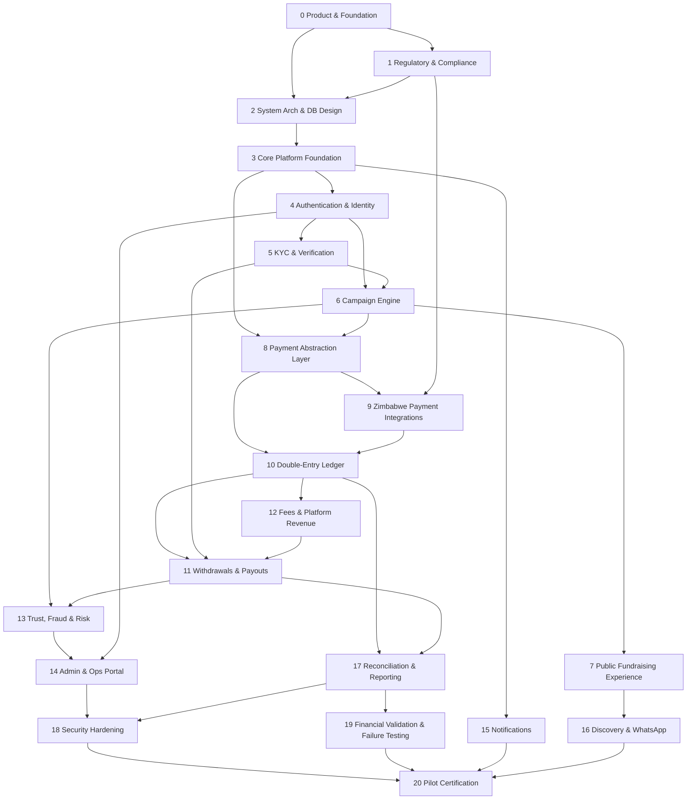

# FundZim — Development Roadmap (Stages 0–20)

| | |
|---|---|
| Status | Stage 0 baseline |
| Rule | One stage at a time. Each stage ends with a completion report (template in [DEVELOPMENT.md](DEVELOPMENT.md)) and stops for explicit acceptance before the next begins. |
| Related | [PRODUCT.md](PRODUCT.md), [ARCHITECTURE.md](ARCHITECTURE.md), [TESTING.md](TESTING.md), [COMPLIANCE.md](COMPLIANCE.md) |

The roadmap is ordered so that **no real money reaches a beneficiary until the ledger, payouts,
reconciliation and security hardening exist and have been tested.** Stages can be refined through ADRs, but
these gates stay in place:

- **Gate A — ledger posting in non-production only.** Stages 8 and 9 run against the sandbox provider and PSP
  test environments only. From Stage 10, confirmed payments post to the real ledger, but still only in
  non-production / PSP test environments. Gate A never authorises accepting real donor money; that is
  governed by Gate C.
- **Gate B — no live payouts** before Stage 11 has passed acceptance with maker-checker controls, and Stage 17
  reconciliation exists for the rails in use.
- **Gate C — no real users with real money** (pilot) before Stage 20 certification, which depends on Stages 15,
  18 and 19 and on the outcome of legal review. **Gate C takes precedence:** no live donation acceptance and no
  live payout happens before Stage 20, whatever Gates A and B allow technically, and no feature goes live while
  a blocking `LR-xxx` item is open (see [COMPLIANCE.md](COMPLIANCE.md)).

## Dependency overview

Notes on ordering:

- **Stage 12 (fees) before Stage 11 (payouts) is acceptable** and is shown as a dependency. Payouts need fee
  postings to compute available balances correctly. The stage numbers are kept as in the master plan. If
  Stage 11 work starts first, fee handling must be stubbed explicitly and Stage 11 acceptance waits for
  Stage 12.
- **Stage 9 depends on Stage 1** because choosing a PSP and settlement model depends on regulatory findings.
  Stage 1 produces the PSP selection criteria and shortlist; Stage 9 contracts and integrates (sandbox only).
- **Stage 8 before Stage 10:** payments are built against the `ledger.Post` interface backed by an explicit
  test-only stub; ledger-level assertions are added in Stage 10.
- **Stage 11 before Stage 13:** Stage 11 ships a minimal rule-based risk/hold hook; Stage 13 extends it.
- **Stage 4 before Stage 15:** Stage 4 delivers OTPs through the `log` SMS fake and Mailpit only; real SMS and
  email providers are chosen in Stage 15, which is a prerequisite of Stage 20.
- Stages 13–16 can partially overlap once their dependencies are met, but they are accepted one at a time.

---

## Stage 0 — Product Definition & Engineering Foundation

- **Objective:** Establish the product specification, architecture principles, financial and security rules,
  documentation, ADRs, repository structure and developer tooling that every later stage follows.
- **Dependencies:** None.
- **Major deliverables:** `CLAUDE.md`, `README.md`, `docs/*` (product, architecture, money, database,
  payments, ledger, security, threat model, audit, compliance register, data classification, privacy,
  observability, frontend, testing, development, roadmap), ADR-001…012, `.env.example`, `.gitignore`,
  `.editorconfig`, `Makefile`, `scripts/check-secrets.sh`, Next.js scaffold in `apps/web`.
- **Security considerations:** No secrets in the repo; secret scanning script; security baseline and threat
  model documented.
- **Testing expectations:** Documentation consistency review; secret scan; existing web scaffold builds and
  lints. No application tests exist yet, and none are claimed.
- **Acceptance criteria:** All deliverables present and consistent; financial rules appear consistently;
  every regulatory assumption is marked `LEGAL_REVIEW_REQUIRED`; no premature implementation; completion
  report delivered.

## Stage 1 — Regulatory & Compliance Architecture

- **Objective:** Turn the compliance assumptions register into a researched position with qualified
  Zimbabwean counsel, and define the operating model the law allows.
- **Dependencies:** Stage 0.
- **Major deliverables:** Legal memo inputs (questions list) and recorded answers per `LR-xxx` item; funds-flow
  / settlement model decision (who holds funds, in whose name); PSP shortlist and selection criteria; AML/CFT
  programme outline (KYC thresholds, monitoring, suspicious-transaction reporting, record-keeping); data
  protection position (controller registration, cross-border transfers, retention periods); exchange-control
  position for diaspora donations and USD/ZiG; tax position for fees; terms of service and privacy notice
  outlines (for counsel to draft); updates to COMPLIANCE.md, PRIVACY.md and affected ADRs.
- **Security considerations:** Legal documents and correspondence are confidential. Regulatory requirements
  become security requirements (e.g. data residency, retention).
- **Testing expectations:** No code. Review that each `LR-xxx` item is resolved, deferred with owner and date,
  or blocking a named stage.
- **Acceptance criteria:** Every `LR-xxx` has a status; the settlement model is chosen or explicitly blocked;
  items blocking Stages 5, 9, 11 and 20 are identified; no unverified legal claims in docs.

## Stage 2 — System Architecture & Database Design

- **Objective:** Turn the Stage 0 architecture into concrete designs: module boundaries, API conventions,
  schema, job/outbox model and local infrastructure.
- **Dependencies:** Stages 0, 1 (settlement model affects ledger accounts and payouts).
- **Major deliverables:** Detailed module interface sketches; ERD for all core domains (users, organisations,
  campaigns, payments, ledger, payouts, fees, kyc, audit, idempotency, webhook inbox, outbox, jobs); migration
  tool and job-queue library decisions (ADRs); API style guide (envelope, errors, pagination,
  idempotency headers); DB role and grant matrix; local Docker Compose design.
- **Security considerations:** Data classification mapped to every table and column; KYC schema separation;
  DB role design; encryption-at-rest decisions; key management design (KMS, envelope encryption).
- **Testing expectations:** Design reviews; schema reviewed against invariants in LEDGER.md and MONEY.md;
  threat model updated.
- **Acceptance criteria:** ERD and ADRs approved; every financial invariant has a planned DB-level
  enforcement; no unresolved circular module dependencies.

## Stage 3 — Core Platform Foundation

- **Objective:** Stand up the runnable skeleton: Go API, worker mode, database, migrations, config,
  logging, errors, health checks, local dev environment and CI.
- **Dependencies:** Stage 2.
- **Major deliverables:** `go.mod` at the repo root (module path decided here); `apps/api/cmd/api`; `internal/platform` (config, db pool,
  clock, IDs (UUIDv7), money type, HTTP envelope, error codes, structured logging with redaction, request and
  correlation IDs); `/healthz`, `/readyz`; migration tooling and first migrations (currencies, audit_events,
  idempotency_keys, outbox, job tables); Postgres-backed job runner; Docker Compose (Postgres, Redis, MinIO,
  Mailpit, ClamAV); CI pipeline (lint, test, build, govulncheck, npm audit, gitleaks, Trivy); architecture
  test preventing forbidden imports; Next.js → API same-origin proxy in dev.
- **Security considerations:** Least-privilege DB roles from day one; secrets only from environment;
  security headers baseline; redaction tests; non-root containers.
- **Testing expectations:** Unit tests for money, IDs, envelope and redaction; integration tests against real
  Postgres (testcontainers or Compose); migration up tests; audit append-only enforcement tests.
- **Acceptance criteria:** `make dev`, `make test`, `make lint` and `make build` work; CI green; money type has
  property-based tests; audit table rejects UPDATE/DELETE/TRUNCATE from the app role.

## Stage 4 — Authentication & Identity

- **Objective:** Secure user and staff authentication, sessions and the authorisation framework.
- **Dependencies:** Stage 3.
- **Major deliverables:** User accounts (phone/email); OTP login (hashed, short TTL, rate-limited); optional
  password (Argon2id); server-side sessions (`__Host-` cookies, rotation, idle and absolute timeouts); CSRF
  protection; staff accounts with mandatory MFA (WebAuthn, TOTP fallback); permission model (roles →
  permissions, ownership checks); account recovery; device/session management; auth audit events. OTP
  delivery uses only the `log` SMS fake and Mailpit; real SMS/email providers are chosen in Stage 15.
- **Security considerations:** Brute force and credential stuffing; SMS pumping / toll fraud on OTP; session
  fixation; account takeover via SIM swap or phone-number recycling (a risk-policy decision is needed);
  enumeration-safe responses.
- **Testing expectations:** Auth flow integration tests; rate-limit tests; CSRF tests; authorisation matrix
  tests (every role × permission); session expiry tests.
- **Acceptance criteria:** No endpoint reachable without an explicit authorisation decision; staff cannot log
  in without MFA; security tests pass.

## Stage 5 — KYC & Verification

- **Objective:** Individual and organisation verification workflows with segregated, protected storage.
- **Dependencies:** Stage 4; Stage 1 (KYC thresholds, vendor/legal constraints).
- **Major deliverables:** Verification levels (UNVERIFIED → BASIC → IDENTITY → PAYOUT); `kyc` schema + DB role;
  application-level encryption of identity numbers with blind index; `private-kyc` bucket; upload quarantine
  + malware scanning; verification vendor adapter (vendor chosen in this stage, behind an interface) + fake
  vendor for tests; manual review workflow; organisation verification (KYB); sanctions screening hook;
  re-verification and expiry rules.
- **Security considerations:** C3 data separation; justified, audited document access; short-lived presigned
  URLs; no KYC data in logs or analytics; retention per Stage 1 outcome.
- **Testing expectations:** Access-control tests (roles without `kyc.document.view` are denied); encryption
  round-trip and key-rotation tests; malware-scan path tests (EICAR); audit-on-access tests.
- **Acceptance criteria:** KYC data unreachable outside the `kyc` module; every document view audited;
  level gates enforced by policy.

## Stage 6 — Campaign Engine

- **Objective:** Campaign creation, editing, review and the full lifecycle state machine.
- **Dependencies:** Stages 4, 5.
- **Major deliverables:** Campaign model (goal currency, categories, beneficiary declaration, story, media
  references); state machine per PRODUCT.md §6 with DB constraints; review queue and checklists;
  re-review on material edits; suspend/freeze/cancel with reasons; campaign updates; public media pipeline
  (quarantine, scan, re-encode, EXIF strip).
- **Security considerations:** Ownership checks (IDOR); stored-XSS-safe rich text (sanitised subset); upload
  security; reviewer conflict-of-interest.
- **Testing expectations:** Exhaustive transition tests (all allowed and all forbidden transitions);
  concurrency tests on simultaneous transitions; IDOR tests.
- **Acceptance criteria:** Illegal transitions impossible via API and via DB; every transition audited.

## Stage 7 — Public Fundraising Experience

- **Objective:** Fast, accessible, mobile-first public campaign pages and the donation flow UI, built against
  **API mocks** of the payments endpoints (the sandbox provider arrives in Stage 8, where the donation flow is
  exercised end to end).
- **Dependencies:** Stage 6.
- **Major deliverables:** Server-rendered campaign pages; OpenGraph/WhatsApp previews; share actions and QR
  codes; donation flow UI with "awaiting confirmation" states; receipts UI; PWA manifest + offline fallback;
  performance budget; accessibility pass; report-a-campaign.
- **Security considerations:** CSP with nonces; no third-party trackers on donation pages; donor anonymity in
  rendering; rate-limited reporting.
- **Testing expectations:** E2E tests (Playwright) on mobile viewports; Lighthouse/performance budget checks;
  automated accessibility checks (axe) plus manual screen-reader checks.
- **Acceptance criteria:** WCAG 2.2 AA checks pass for core flows; performance budget met on a throttled
  mobile profile; no donation shown as confirmed without server confirmation.

## Stage 8 — Payment Abstraction Layer

- **Objective:** The provider-neutral payments module, with sandbox provider, webhook inbox, idempotency and
  payment state machine.
- **Dependencies:** Stages 3, 6.
- **Major deliverables:** `payments.Service`; `Provider` interface with capabilities; sandbox provider
  (scriptable: decline, timeout, duplicate/out-of-order webhooks, late success); payment intent state
  machine with precedence rules; `Idempotency-Key` handling; webhook inbox + async processing + DLQ;
  provider routing by method/currency/capability; test-only `ledger.Post` stub (replaced in Stage 10).
- **Security considerations:** Webhook signature + replay protection; idempotency on all mutating endpoints;
  no card data; provider secrets via secret manager.
- **Testing expectations:** Every payment-state failure scenario in TESTING.md driven through the sandbox
  provider (ledger assertions against the test-only stub; real-ledger assertions follow in Stage 10);
  idempotency and duplicate-delivery tests; concurrency tests; donation-flow E2E (Stage 7 UI) against the
  sandbox provider.
- **Acceptance criteria:** Duplicate requests and webhooks cannot create duplicate payments; out-of-order
  events cannot regress state; unknown outcomes remain pending until resolved.

## Stage 9 — Zimbabwe Payment Integrations

- **Objective:** Contract and integrate the PSP(s) chosen from the Stage 1 shortlist for target rails (mobile money, ZimSwitch / bank,
  cards) **in test/sandbox environments**.
- **Dependencies:** Stage 8; Stage 1 (PSP selection, settlement model, contracts).
- **Major deliverables:** Provider adapter(s); capability declarations; webhook verification per provider;
  status polling where webhooks are weak; settlement report ingestion format; provider-specific runbooks.
- **Security considerations:** Credential scoping per environment; IP allow-listing where offered; verifying
  weak-signature providers via authenticated status API; no live credentials in non-production.
- **Testing expectations:** Contract tests against provider sandboxes; recorded-fixture tests; failure
  injection (timeouts, malformed callbacks).
- **Acceptance criteria:** Adapters pass the shared provider conformance suite; **no live payment acceptance**
  (Gates A and C): live acceptance happens only at Stage 20.

## Stage 10 — Double-Entry Financial Ledger

- **Objective:** Implement the authoritative double-entry ledger and connect payment confirmation to ledger
  posting.
- **Dependencies:** Stages 8, 9; Stage 1 (account model under the chosen settlement model).
- **Major deliverables:** Chart of accounts per currency; `ledger_accounts`, `ledger_transactions`,
  `ledger_entries`; posting API (idempotent); DB-level balance enforcement (deferred constraint trigger);
  append-only enforcement; reversal/adjustment flows (dual control); balance projections + recompute job;
  posting rules for donations, fees, refunds, chargebacks.
- **Security considerations:** Only the `ledger` module writes ledger tables; app role cannot UPDATE/DELETE/TRUNCATE ledger entries or transactions;
  adjustments require maker-checker and audit.
- **Testing expectations:** Property-based tests (random postings always balance); concurrency tests; invariant
  checks after every integration test; recompute-equals-projection tests.
- **Acceptance criteria:** Imbalanced journals impossible at the DB level; every confirmed payment produces
  exactly one posting; ledger posting enabled in non-production / PSP test environments (Gate A). Live donor
  money still waits for Stage 20 (Gate C).

## Stage 11 — Withdrawals & Payouts

- **Objective:** Safe payout requests, approval and execution to verified beneficiaries.
- **Dependencies:** Stages 10, 12, 5 (PAYOUT_VERIFIED).
- **Major deliverables:** Payout request flow; available-balance computation from the ledger (per currency,
  less holds/reserves); payout state machine (REQUESTED → UNDER_REVIEW → APPROVED → PROCESSING → PAID |
  FAILED | CANCELLED, + RETURNED); automated policy checks on every payout and maker-checker approval above
  configurable thresholds (LR-030); destination verification + cooling-off; minimal rule-based risk/hold hook
  (extended in Stage 13); provider payout adapters; payout failure and return handling.
- **Security considerations:** Account takeover → payout redirection; insider fraud (dual control);
  idempotent payout execution; holds honoured under concurrency.
- **Testing expectations:** Concurrent withdrawal tests (no overdraw); duplicate payout request tests; payout
  failure/return tests; approval segregation tests.
- **Acceptance criteria:** Overdraw impossible under concurrency; no self-approval; every payout reconciles to
  ledger entries. Gate B lifts only after Stage 17 reconciliation covers the rails in use, and then only in
  non-production until Stage 20 (Gate C).

## Stage 12 — Fees & Platform Revenue

- **Objective:** Configurable, exact fee calculation and accounting.
- **Dependencies:** Stage 10; product decision PD-01; Stage 1 tax position.
- **Major deliverables:** Fee schedules (versioned, effective-dated) per currency/rail/category; basis-point
  calculations with documented rounding; donor-covers-fees option if adopted; fee postings; PSP fee
  recording from provider data; fee disclosure in UI.
- **Security considerations:** Fee configuration changes audited and dual-controlled.
- **Testing expectations:** Exhaustive rounding tests; allocation sums exactly; historical transactions keep
  the fee schedule version in force when they occurred.
- **Acceptance criteria:** Fees reproducible from stored inputs; no float anywhere; disclosures match ledger.

## Stage 13 — Trust, Fraud & Risk Engine

- **Objective:** Detect and act on fraud and abuse across users, campaigns, donations and payouts.
- **Dependencies:** Stages 6, 11 (extends the Stage 11 risk/hold hook).
- **Major deliverables:** Rules engine with explainable risk scores; velocity limits; device/IP signals (where
  lawful); automatic holds; investigation cases; sanctions/watch-list integration; suspicious-transaction
  workflow (**LEGAL_REVIEW_REQUIRED**, LR-008: reporting obligations); card-testing defences.
- **Security considerations:** Risk data is C3; rules config audited; avoid unfair or discriminatory signals.
- **Testing expectations:** Scenario tests for known fraud patterns; false-positive review on fixture data.
- **Acceptance criteria:** High-risk payouts are held automatically; every automated action is explainable and
  audited.

## Stage 14 — Administration & Operations Portal

- **Objective:** Staff tooling for review, support, compliance, finance and administration.
- **Dependencies:** Stages 4, 13 (and the modules it operates on).
- **Major deliverables:** Separate staff portal (hostname and session separation); review queues; user and
  campaign search with masked PII; KYC review UI (justified access); payout approval UI; investigation
  case management; role management (SUPER_ADMIN, dual-controlled); audit log viewer.
- **Security considerations:** Staff MFA; least privilege per screen and action; break-glass; no bulk export
  without approval; staff action audit.
- **Testing expectations:** Permission matrix E2E tests; maker-checker tests via UI; audit coverage tests.
- **Acceptance criteria:** Every staff action authorised and audited; no role has implicit KYC or ledger
  powers.

## Stage 15 — Notifications & Communications

- **Objective:** Reliable, consented email and SMS notifications.
- **Dependencies:** Stage 3 (outbox, jobs); providers chosen in this stage.
- **Major deliverables:** Notification module fed from the outbox; email and SMS provider adapters + fakes;
  templates (receipts, campaign status, payout status, security alerts); preferences and opt-outs; delivery
  tracking; rate limits.
- **Security considerations:** No sensitive data in messages (masking); anti-phishing conventions; SMS cost
  abuse limits; provider credentials scoped.
- **Testing expectations:** Template rendering tests; idempotent send tests (no duplicate receipts);
  failure/retry tests.
- **Acceptance criteria:** Each financial event produces exactly one receipt/notification; opt-outs honoured
  except for mandatory security/transactional messages.

## Stage 16 — Discovery, Sharing & WhatsApp Optimisation

- **Objective:** Help campaigns get found and shared, especially through WhatsApp.
- **Dependencies:** Stage 7.
- **Major deliverables:** Search and category browsing; featured/trending (with abuse controls); improved
  OG images; QR posters; privacy-preserving referral attribution; optional WhatsApp Business integration
  (separate ADR + legal review).
- **Security considerations:** Ranking manipulation; scraping limits; attribution privacy.
- **Testing expectations:** Preview rendering tests (OG validators); search relevance fixtures; E2E share
  flows.
- **Acceptance criteria:** Link previews render correctly in WhatsApp; attribution reveals no individual
  donor paths.

## Stage 17 — Financial Reconciliation & Reporting

- **Objective:** Prove that FundZim's records match provider and settlement reality, and produce financial
  reports.
- **Dependencies:** Stages 10, 11.
- **Major deliverables:** Provider statement / settlement-file ingestion; automated matching (payments,
  refunds, payouts, fees) by provider reference; mismatch classification and case workflow; daily
  reconciliation reports; ledger trial balance per currency; campaign statements; regulatory/report exports
  (formats per Stage 1).
- **Security considerations:** Statement files are C2/C3; ingestion integrity (checksums, provenance);
  reports access-controlled and audited.
- **Testing expectations:** Fixture statements with every mismatch type; idempotent re-ingestion tests.
- **Acceptance criteria:** Every provider transaction is matched or in a tracked exception; unmatched items
  raise alerts; Gate B lifts for reconciled rails.

## Stage 18 — Security Hardening

- **Objective:** Bring the platform to a standard where an independent security review and penetration test
  can be done.
- **Dependencies:** Stages 14, 17 (feature-complete surface).
- **Major deliverables:** Threat model refresh; OWASP ASVS-guided review; CSP and headers finalised; rate limits
  tuned; secrets management in production; key rotation procedures; production infrastructure design and
  IaC; WAF/DDoS posture; backup encryption and restore drills; incident response plan; audit hash-chain
  verification; external penetration test arranged.
- **Security considerations:** This stage *is* the security consideration; findings are tracked to closure.
- **Testing expectations:** DAST, SAST, dependency and container scans clean or risk-accepted; pen-test findings
  remediated or risk-accepted with owner.
- **Acceptance criteria:** No open critical/high findings; DR restore tested; incident runbooks exist.
  No security certification is claimed.

## Stage 19 — Financial Validation, Concurrency & Failure Testing

- **Objective:** Demonstrate financial correctness under adversarial timing, failures and load.
- **Dependencies:** Stage 17 (and all financial stages).
- **Major deliverables:** Full failure-injection suite (TESTING.md list); concurrency stress tests;
  performance and load tests on donation spikes (viral funeral campaign); chaos tests on Redis/DB failover;
  reconciliation end-to-end tests; invariant monitors in staging.
- **Security considerations:** Test data only; no production credentials in test environments.
- **Testing expectations:** Every scenario passes repeatedly; ledger invariant holds after every run.
- **Acceptance criteria:** Zero invariant violations across runs; documented capacity limits; alerting
  verified.

## Stage 20 — Production/Pilot Certification

- **Objective:** Decide, with evidence, whether FundZim may run a limited pilot with real users and money.
- **Dependencies:** Stages 18, 19, 15, 16; legal/regulatory sign-off on all blocking `LR-xxx` items.
- **Major deliverables:** Operational readiness review; legal readiness confirmation (by counsel);
  production deployment; monitoring, on-call and runbooks; pilot limits (users, amounts, rails); go/no-go
  record; post-pilot review plan.
- **Security considerations:** Production access controls; break-glass procedures tested; data protection
  obligations met per counsel's advice.
- **Testing expectations:** Production smoke tests with controlled small-value transactions; DR drill on
  production-like environment.
- **Acceptance criteria:** Signed go/no-go with named approvers; all blocking legal items resolved; no
  compliance or certification claims beyond what counsel and auditors have confirmed.
