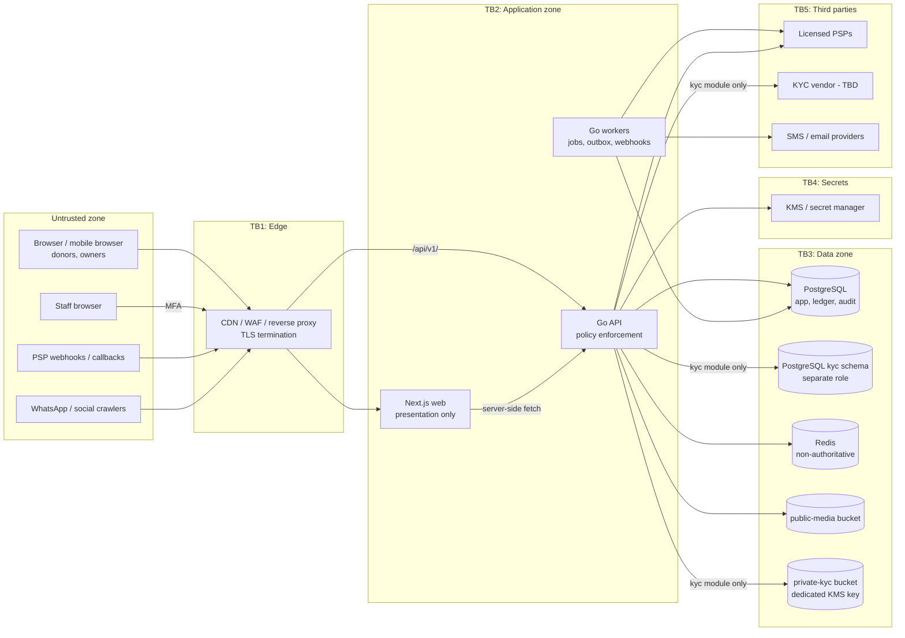

# FundZim Initial Threat Model

Status: Stage 0 initial model. Method: STRIDE per trust boundary, plus crowdfunding-specific abuse cases.
Review: updated at the end of every stage that changes a trust boundary (see §9).
Related: [SECURITY.md](SECURITY.md) (controls), [PAYMENTS.md](PAYMENTS.md), [LEDGER.md](LEDGER.md),
[AUDIT.md](AUDIT.md), [DATA-CLASSIFICATION.md](DATA-CLASSIFICATION.md), [COMPLIANCE.md](COMPLIANCE.md).

Likelihood and impact ratings are initial engineering estimates (High / Medium / Low), not measured data.
They must be revisited once real traffic, PSP choice and fraud data exist.

---

## 1. Scope

In scope: the planned FundZim web app (Next.js), Go API and workers, PostgreSQL, Redis, object storage,
KMS/secret manager, PSP integrations (abstract — no PSP chosen), SMS/email providers, KYC verification
vendor (abstract — not chosen), staff admin surface, CI/CD.

Out of scope for Stage 0: PSP-internal security, mobile network operator security (beyond SIM-swap
implications), physical security of hosting (provider responsibility; hosting not chosen).

## 2. Assets

| ID | Asset | Class | Why it matters |
|---|---|---|---|
| A1 | Ledger transactions and entries | C2 | Source of truth for who is owed what; tampering = theft or misreporting |
| A2 | Payment and payout records, provider references | C2 | Basis for confirmation, reconciliation, disputes |
| A3 | Payout destinations (bank/wallet numbers) | C3 | Changing one redirects money |
| A4 | KYC documents, identity numbers, DOB, liveness media | C3 | Identity theft, legal exposure, irreversible harm |
| A5 | Staff accounts and permissions | C2/C4 | Privileged actions on money and KYC |
| A6 | User accounts (phone/email, sessions) | C2/C4 | Account takeover → payout hijack |
| A7 | PSP credentials, webhook secrets, KMS keys, signing keys | C4 | Forge confirmations, initiate payouts, decrypt KYC |
| A8 | Campaign content and trust signals (verification badges) | C0 | Donor trust; fraudulent campaigns harm donors and the platform |
| A9 | Audit log | C2 | Accountability, investigations, regulatory evidence |
| A10 | Donor identity (incl. anonymous donors) | C2 | Privacy, safety of donors to sensitive causes |
| A11 | Beneficiary data in stories (medical, minors) | C0–C3 | Highly sensitive personal data published by third parties |
| A12 | Platform availability during emergencies (funerals, medical) | — | Time-critical fundraising |

## 3. Actors

| Actor | Motivation / capability |
|---|---|
| Honest donor | — (privacy and correct receipts) |
| **Fraudulent donor / card tester** | Validates stolen cards with small donations; launders via donate-then-refund; chargeback fraud |
| Honest campaign owner | — (fast payouts, low friction) |
| **Malicious campaign owner** | Fake causes (fake medical, fake funeral), impersonation of real beneficiaries, money mule collection, laundering, sanctions evasion |
| **Account-takeover attacker** | Phishing, credential stuffing, **SIM swap** to hijack phone-OTP accounts, then change payout destination |
| **Insider staff** | Curious access to KYC, collusion with campaign owners, self-approving payouts, editing records to hide fraud |
| **Compromised / spoofed PSP webhook** | Forged “payment succeeded”, replayed events, out-of-order events; or a genuinely compromised provider endpoint |
| External attacker | Web exploitation (IDOR, XSS, SQLi, SSRF), DoS, SMS pumping, scraping donor lists |
| Supply-chain attacker | Malicious npm/Go dependency, compromised CI, poisoned base image |
| Compromised vendor | KYC vendor, SMS provider, email provider breach |
| Regulator / law enforcement | Legitimate access requests — must be handled by process, not ad hoc (LEGAL_REVIEW_REQUIRED, LR-032) |

## 4. Trust boundaries

Key boundaries: **TB1** (internet → edge), **TB2** (edge → app; Next.js is not trusted to make policy
decisions), **TB3** (app → data; enforced by DB roles), **TB3-KYC** (only the kyc module crosses into
`kyc` schema / `private-kyc`), **TB4** (secrets), **TB5** (third parties; their inputs are untrusted until
verified).

## 5. STRIDE threats

Stage = the roadmap stage that implements the primary mitigation.

| ID | STRIDE | Threat | Impact | Likelihood | Mitigations | Stage |
|---|---|---|---|---|---|---|
| T-01 | S | Forged PSP webhook marks unpaid donation as succeeded | High | High (public endpoint) | Signature verification on raw body; timestamp window; server-to-server status confirmation where signing weak; ledger posts only from verified state | 8, 9 |
| T-02 | S/T | Replayed genuine webhook causes double credit | High | Medium | `UNIQUE(provider, provider_event_id)`; idempotent processing; ledger `idempotency_key` UNIQUE | 8, 10 |
| T-03 | T | Out-of-order webhook moves SUCCEEDED back to PENDING/FAILED | Medium | Medium | Monotonic state precedence table; late events recorded but ignored for state | 8 |
| T-04 | S | Browser redirect / client claims payment success | High | High | Redirect is UX only; never changes state | 7, 8 |
| T-05 | S | Account takeover via **SIM swap** → OTP login → payout destination change | High | Medium–High (known regional pattern) | Payout destination change: step-up, cooling-off, payout hold, notify old channels; risk signals on recent SIM/phone change where PSP/MNO provides; optional second factor for owners with funds; staff never use SMS MFA | 4, 11, 13 |
| T-06 | S | Credential stuffing / OTP brute force | Medium | High | Rate limits per IP/account/phone; attempt caps; lockout; breached-password checks | 4 |
| T-07 | D/$ | SMS pumping via OTP endpoint (toll fraud) | Medium (cost) | High | Per-phone/IP/global budgets, prefix allow-list, challenge after threshold, anomaly alerts | 4 |
| T-08 | E | IDOR: user reads/edits another’s campaign, donation, payout | High | Medium | Repository-level scoping; per-object authz; IDOR test per route | 3, 6 |
| T-09 | E | Mass assignment sets `status`, `owner_id`, `amount_minor` | High | Medium | Explicit input DTOs; unknown fields rejected | 3 |
| T-10 | T | SQL injection alters ledger/KYC | High | Low | Parameterised queries; app role cannot UPDATE/DELETE/TRUNCATE ledger; no kyc schema access from app role | 2, 3, 10 |
| T-11 | I | Stored XSS in campaign story steals sessions / injects fake payment instructions | High | Medium | Sanitised constrained story format; CSP with nonces; HttpOnly cookies | 6, 7 |
| T-12 | I | SSRF via image/link import reaches cloud metadata | High | Low | No arbitrary fetch; allow-listed fetcher blocking private ranges | 3, 6 |
| T-13 | I | KYC document exfiltration by external attacker | High | Low–Medium | Private bucket, dedicated KMS key, short presigned URLs via kyc module only, no public ACLs, access audited | 5 |
| T-14 | I | **Insider** browses KYC documents without need | High | Medium | `kyc.document.view` only for COMPLIANCE; justification required; per-access audit; access anomaly alerts; periodic access review | 5, 14 |
| T-15 | E/T | **Insider** self-approves payout or ledger adjustment | High | Medium | Maker-checker in code + DB check `approved_by <> requested_by`; FINANCE role separation | 10, 11, 14 |
| T-16 | R | Insider edits records then denies it | High | Medium | Append-only ledger/audit with triggers; hash-chained audit events; staff actions require reason | 3, 10 |
| T-17 | E | SUPER_ADMIN grants self sensitive permissions | High | Low | No self-grant; role grants maker-checker; alerts on grants | 4, 14 |
| T-18 | T | Payout destination swapped by attacker or insider | High | Medium | Destination ownership verification (name match); change → hold + cooling-off + notifications; staff override is maker-checker | 11 |
| T-19 | D | Double payout from retry after timeout | High | Medium | Payout idempotency key to provider; unknown outcome moves the payout to `UNKNOWN` (ADR-020) and it is never resubmitted; it is resolved by status query or reconciliation; UNIQUE payout request key | 11 |
| T-20 | T | Race: two concurrent withdrawals exceed available balance | High | Medium | Serialised balance check + ledger hold posting in one DB transaction (row lock or serializable); concurrency tests | 10, 11, 19 |
| T-21 | I | Logs/error reports leak OTPs, tokens, ID numbers | High | Medium | Allow-list logging; redaction tests; scrubbing in error reporter | 3 |
| T-22 | I | Anonymous donor de-anonymised via API or campaign owner exports | Medium | Medium | Per-audience DTOs; owner exports exclude anonymous donor identity | 6, 7 |
| T-23 | I | Scraping donor names/amounts from public pages | Low–Medium | High | Only opted-in public donor display; rate limits; no bulk donor API | 7 |
| T-24 | T | Malicious upload (malware, polyglot, decompression bomb) | Medium | Medium | Quarantine, magic-byte checks, ClamAV, re-encode, size limits | 5, 6 |
| T-25 | S | Phishing site imitates FundZim / campaign; fake “FundZim agent” on WhatsApp asks for mobile-money PIN | High | High | Clear user education; never request PINs; official domains; DMARC; takedown process | 15, 16 |
| T-26 | T | Compromised dependency or CI injects code | High | Low–Medium | Lockfiles, pinned versions, audit/govulncheck, protected branches, review, SBOM | 3, 18 |
| T-27 | I | Leaked PSP or KMS credentials | High | Low–Medium | Secret manager; per-env credentials; rotation; secret scanning; boot-time placeholder checks | 3, 9, 18 |
| T-28 | D | DoS of donation pages during high-profile emergency campaign | Medium | Medium | CDN caching of public pages; rate limits; static fallbacks; capacity tests | 7, 18, 19 |
| T-29 | T | Redis loss/compromise corrupts financial state | High | Low | Redis non-authoritative by design; Postgres-backed financial jobs | 2, 3 |
| T-30 | R | PSP disputes a transaction FundZim recorded | Medium | Medium | Store provider references, redacted raw webhook payloads, status responses; daily reconciliation | 9, 17 |
| T-31 | I | Restore of backup into wrong environment exposes production PII | High | Low | No prod data outside prod; restore tests in isolated env; access controls on backups | 18 |
| T-32 | T | Fee configuration tampered to divert revenue | Medium | Low | Fee config versioned, maker-checker, audited; fees recorded per transaction | 12 |

## 6. Crowdfunding-specific fraud and abuse cases

These overlap with STRIDE but are where most real losses in crowdfunding occur. Primary home: Stage 13
(Trust, Fraud & Risk Engine), with structural controls earlier.

| ID | Scenario | Signals | Controls | Stage |
|---|---|---|---|---|
| F-01 | **Fake medical campaign** — invented illness, stolen photos, forged hospital letters | Reused images (perceptual hash), new account, urgent large goal, story template reuse, external reports | IDENTITY_VERIFIED to publish; review queue with supporting documents for medical/funeral categories; beneficiary verification; reverse-image checks; donor reporting; SUSPENDED/FROZEN states; payouts preferably direct to institution (hospital/school/funeral parlour) where feasible | 5, 6, 13 |
| F-02 | **Impersonation** — campaign for a real person without their consent | Beneficiary ≠ owner without relationship evidence; complaints from family | Beneficiary consent/relationship capture; takedown/report flow; payout to beneficiary or verified institution | 6, 13 |
| F-03 | **Money mule** — campaign used to receive and move illicit funds | Donations from few donors with large amounts, rapid withdrawal, donor ≈ owner device/IP, cross-border patterns | Risk scoring; donor/owner linkage checks; payout delays for anomalous patterns; STR process (LEGAL_REVIEW_REQUIRED (LR-008), FIU) | 13, 17 |
| F-04 | **Payout destination hijack** (ATO or insider) | Destination change shortly before payout; new device; SIM-change signals | Cooling-off, holds, step-up, notifications, name-match ownership verification | 11 |
| F-05 | **Refund abuse** — donate with stolen card, request refund to a different instrument | Refund requests soon after donation, mismatched instrument | Refunds only to original instrument via PSP; maker-checker over threshold; refund velocity limits | 8, 11 |
| F-06 | **Chargeback fraud** — donor disputes after payout already sent | Card donations to new campaigns, high-risk BINs (as PSP exposes) | Payout holding period for card-funded balances (policy Stage 11/12, business decision); reserve logic; DISPUTED state; ledger reversal path; clawback policy (LEGAL_REVIEW_REQUIRED, LR-020) | 8, 10, 11 |
| F-07 | **Card testing** using small donations | Many small attempts, failures, varied cards from one device/IP | Minimum amounts, velocity limits, CAPTCHA after threshold, PSP fraud tooling | 8, 13 |
| F-08 | **Sanctioned persons / entities** as owners, beneficiaries or donors | Name/ID screening hits | Sanctions screening at IDENTITY_VERIFIED and before payouts; lists and obligations LEGAL_REVIEW_REQUIRED (LR-009) | 5, 13 |
| F-09 | **Self-donation to fake traction** or to launder | Donor identity/device = owner | Linkage detection; exclude from trust signals; investigate | 13 |
| F-10 | **Campaign switching** — approved campaign later edited to a different cause/beneficiary | Material edits after approval | Material edit → re-review flag; beneficiary/payout change → payout hold | 6, 11 |
| F-11 | **Collusion with reviewer** | Same reviewer repeatedly approves linked risky campaigns | Reviewer assignment rotation, second review for high-risk categories/amounts, audit analytics | 13, 14 |
| F-12 | **Fake organisation / charity** | Unverifiable registration, mismatched directors | Organisation verification (registration, directors/trustees, beneficial owners, authorised rep); PVO-related obligations LEGAL_REVIEW_REQUIRED (LR-013) | 5 |

## 7. Residual risks (accepted or open at Stage 0)

| ID | Residual risk | Why it remains | Owner / next step |
|---|---|---|---|
| R-01 | SIM swap remains possible for users whose only factor is phone OTP | Mobile-first users may lack other factors | Stage 4/11: payout-time controls compensate; evaluate optional passkeys |
| R-02 | Chargebacks after payout may create losses | Depends on PSP terms and holding policy | Stage 11/12 business decision; LEGAL_REVIEW_REQUIRED (LR-020) for clawback |
| R-03 | Fraudulent but well-documented campaigns may pass review | Human review is imperfect | Stage 13 risk engine, post-publication monitoring, reporting |
| R-04 | Third-party vendors (KYC, SMS, PSP) may be breached | Outside FundZim control | Vendor due diligence, minimisation, contracts (LEGAL_REVIEW_REQUIRED, LR-033) |
| R-05 | PSPs with weak webhook signing | Market reality unknown until PSP selection | Server-to-server confirmation requirement (PAYMENTS) |
| R-06 | Regulatory obligations unknown (AML reporting, data localisation) | Legal review not yet done | Stage 1 |
| R-07 | Development-only `npm audit` findings (braces via eslint-config-next) | Upstream dependency | Track; update when upstream fixes |

## 8. Assumptions

- A licensed PSP will hold and settle funds; FundZim does not custody funds (LEGAL_REVIEW_REQUIRED (LR-001), see
  COMPLIANCE).
- Card payments use hosted/tokenised PSP flows, so FundZim never receives PAN/CVV.
- Staff count is small at launch; maker-checker requires at least two FINANCE-capable people before payouts
  go live (operational dependency for Stage 11/20).

## 9. Review cadence

- Updated at the end of every stage that adds or changes a trust boundary (notably 4, 5, 8, 9, 10, 11, 14, 16).
- Full review before Stage 18 penetration test and again at Stage 20.
- Ad hoc after any SEV1/SEV2 incident or a new fraud pattern.
- Each update records date, author, changed threats, and links to resulting ADRs or tickets.
