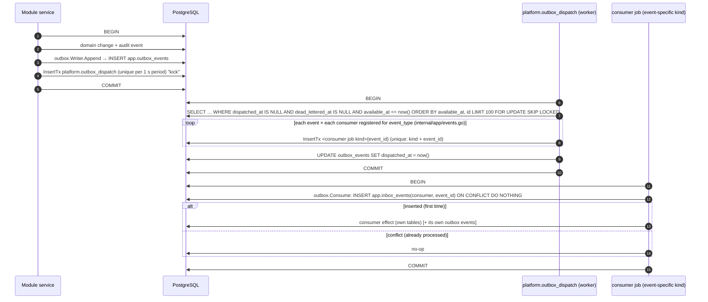

# Background Processing: Jobs, Outbox, Inbox and Webhooks

> **Status:** Stage 2 design. Nothing here is implemented. Stage 3 builds the queue, outbox dispatcher, inbox
> dedupe and the first maintenance jobs. Every other job kind is built by the stage named in the catalogue.
> Numbers marked **[default]** are starting points to be tuned with measurements. They are not commitments
> or claims.

Related: [design-baseline.md](../stage-2/design-baseline.md) (contract: §2 modules, §5 tables, §9 River) ·
ADR-025 (outbox, inbox and River) · [ARCHITECTURE.md §7](../ARCHITECTURE.md) ·
[DATABASE.md §12](../DATABASE.md) · [PAYMENTS.md §9–§10](../PAYMENTS.md) ·
[transaction-lifecycle.md §7](../payments/transaction-lifecycle.md) ·
[payout-lifecycle.md §5](../payments/payout-lifecycle.md) ·
[payout-eligibility-and-controls.md §3, §7](../payments/payout-eligibility-and-controls.md) ·
[settlement-and-custody-model.md §4](../ledger/settlement-and-custody-model.md) ·
[observability.md](observability.md) · [performance-capacity.md](performance-capacity.md) ·
[payment-state-machine.md](payment-state-machine.md) · [payout-state-machine.md](payout-state-machine.md) ·
[ledger-invariants.md](ledger-invariants.md) · [payment-provider-interfaces.md](payment-provider-interfaces.md) ·
[docs/database/schema-overview.md](../database/schema-overview.md)

---

## 1. Principles (binding)

| # | Rule | Why |
|---|---|---|
| BP-1 | **PostgreSQL is the only queue for financial work.** The queue is River, in schema `queue`, on the same database as domain data. Redis never holds jobs, locks that guard money, or "processed" markers. | A job and the state change that caused it commit atomically. Redis loss cannot lose or duplicate money work (ARCHITECTURE §8.2). |
| BP-2 | **At-least-once delivery is assumed everywhere.** Every handler is idempotent and backed by a database unique constraint, not by "we checked first". | River, the outbox and providers all redeliver. Crashes happen between "did it" and "recorded it". |
| BP-3 | **Never call a provider (or any external system) inside an open database transaction.** The pattern is always: **record intent (commit) → call outside any transaction → record result (new transaction)**. | DATABASE §12. Holding locks across network calls causes contention, and a rollback after a successful call loses the evidence that money moved. |
| BP-4 | **Unknown outcome ≠ failure.** A provider call whose outcome is indeterminate puts the aggregate in `UNKNOWN`. The handler then polls and reconciles. It never marks the aggregate `FAILED` by assumption. | CLAUDE.md rule 9, ADR-020. |
| BP-5 | **A payout (or refund) in `UNKNOWN` is never resubmitted.** It is never resubmitted with a new reference, and with the same reference only where the provider documents idempotent creation (PCR-013). | [payout-lifecycle.md §5.2](../payments/payout-lifecycle.md). |
| BP-6 | **The domain row is the schedule of record, and River is only the executor.** For example `payment_intents.next_poll_at`, `poll_horizon_at` and `needs_reconciliation` say what must happen. A periodic **sweeper** re-enqueues any work whose job was lost. | A lost or discarded job can never strand a payment silently. |
| BP-7 | **Jobs are never silently dropped.** Exhausted retries move a job to River's `discarded` state, and the owning domain row records a dead-letter status. Both raise metrics and alerts ([observability.md §8](observability.md)). Staff can inspect and re-queue, but can never edit. | ARCHITECTURE §7, PAYMENTS §9. |
| BP-8 | **Job arguments carry identifiers, not data.** Args hold IDs plus `correlation_id`, `trace_parent` and `actor`. They never hold amounts, PII, KYC values, account numbers or secrets. Handlers load current state from the database. | `queue.river_job.args` is visible to anyone with queue access. Stale args must not drive money decisions. |
| BP-9 | **A module enqueues only its own job kinds.** Cross-module work travels through the outbox (§4) or through an interface injected by the composition root (§5.3). Neither creates a compile-time dependency (baseline §3). | Keeps the import graph acyclic. |

## 2. Components

```mermaid
flowchart LR
    subgraph API[api process]
        H[HTTP handlers] -->|tx: domain rows + audit + outbox_events + optional InsertTx job| DB
        WH[Webhook endpoint<br/>/api/v1/webhooks/provider] -->|verify, then tx: inbox row + InsertTx classify job| DB
    end
    subgraph DB[(PostgreSQL)]
        D[(domain tables<br/>app / ledger / audit / ...)]
        OB[(app.outbox_events)]
        IB[(app.inbox_events)]
        WI[(app.provider_webhook_inbox)]
        Q[(queue.river_job ...)]
    end
    subgraph WK[worker process]
        R[River client<br/>per-queue workers]
        P[Periodic jobs<br/>leader-elected]
        DSP[platform.outbox_dispatch]
    end
    R -->|claim FOR UPDATE SKIP LOCKED| Q
    DSP -->|claim unpublished FOR UPDATE SKIP LOCKED| OB
    DSP -->|InsertTx one consumer job per subscriber| Q
    R -->|consumer tx: inbox_events dedupe + effect| IB
    R -.->|outside tx| EXT[[PSPs, SMS, email, scanner, KYC vendor]]
```

| Component | Lives in | Notes |
|---|---|---|
| River client (insert-only) | api and worker | The api only inserts jobs (`InsertTx`) and never works them. |
| River client (workers) | worker only | One process can serve all queues. Queues can be split across worker deployments later with `WORKER_QUEUES` (proposal, [local-environment-design.md §5](../development/local-environment-design.md)). |
| Periodic jobs | worker (River leader only) | River's periodic-job scheduler runs on the elected leader, so one instance enqueues each tick. Every periodic job is also uniquely keyed by period (§6), so a leader handover cannot double-schedule. |
| Outbox writer | `platform` (`internal/platform/outbox`) | `outbox.Writer.Append(ctx, tx, evts...)` is the only way to emit a domain event. |
| Outbox dispatcher | `platform`, executed as a River job (§4.3) | Fans each event out to subscribed consumers. |
| Inbox (consumer dedupe) | `platform` (`app.inbox_events`) | `outbox.Consume(ctx, tx, consumer, delivered, fn)` is called in the consumer's transaction ([go-module-design.md §3.4](go-module-design.md)). |
| Webhook inbox | `psp` (`app.provider_webhook_inbox`) | Verified provider events, redacted (§5) |

### 2.1 River configuration (Stage 3, pin exact version)

River is pinned to an exact version in `go.mod` at Stage 3. Before pinning, verify that the release supports
each item below. If a release lacks one, record the workaround in ADR-025.

| Setting | Value [default] | Reason |
|---|---|---|
| Schema | `queue` (River's configurable schema option, applied to both client and migrator) | Baseline §4. If the pinned version lacks schema support, the River pool sets `search_path=queue` instead. |
| River migrations | Run by `fundzimctl migrate` as `fundzim_migrator`, **after** goose migration `0001` creates schema `queue`. The pinned River migration version is recorded in the goose migration that calls it ([migration-strategy.md](../database/migration-strategy.md)). | The migrator owns every object (DATABASE §13). |
| `JobTimeout` (global) | 60 s, overridden per kind (§6). No kind may exceed 10 min (§9.2). | Default upper bound. |
| `RescueStuckJobsAfter` | 15 min. It must exceed the largest per-kind timeout (10 min) plus margin. | Recovers jobs whose worker died (§9). |
| `CompletedJobRetentionPeriod` | 24 h | Completed jobs are noise, because the domain tables hold the history. |
| `CancelledJobRetentionPeriod` | 7 d | |
| `DiscardedJobRetentionPeriod` | **90 d** (River's default is shorter) | Discarded jobs form part of the dead-letter record. The durable record is the domain row's status (BP-7), so this is a convenience window, not the system of record. |
| `FetchPollInterval` / LISTEN | LISTEN/NOTIFY enabled with direct connections. Use `PollOnly` mode if PgBouncer transaction pooling is introduced ([performance-capacity.md §7](performance-capacity.md)). | |
| Default `MaxAttempts` | Set explicitly per kind (§6). Never rely on the library default. | |
| Retry policy | Custom per kind via `NextRetry`: `delay = min(cap, base × 2^(attempt−1))`, multiplied by a jitter factor drawn uniformly from [0.8, 1.2] | Exponential backoff with jitter (ARCHITECTURE §7). |
| Error handler | Records `error_class` on the domain row where one exists, increments `fundzim_job_failures_total`, and redacts error text (§10) | |

## 3. Queues and worker concurrency

Concurrency is set **per worker process**. Totals scale with the number of worker replicas, and the DB pool
must scale with them ([performance-capacity.md §7](performance-capacity.md)).

| Queue | `MaxWorkers` per process [default] | Contents | Why this limit |
|---|---|---|---|
| `webhooks` | 8 | Webhook classification and apply jobs (all classes) | Short DB-bound jobs. Fast drain after provider retry storms matters. |
| `payments` | 8 | Payment status polls, expiry, UNKNOWN escalation | Mostly waiting on provider I/O. Capped to respect provider rate limits. |
| `refunds` | 2 | Refund submit and status poll | Money out. Low volume, kept serial-ish for operability. |
| `payouts` | 2 | Payout submit and status poll | Money out. Low volume. Provider limits and human review dominate. |
| `outbox` | 1 | `platform.outbox_dispatch` | One dispatcher at a time is enough. `SKIP LOCKED` makes more safe if needed. |
| `events` | 8 | Outbox consumer jobs (`<module>.on_<event>`, for example `notifications.on_payment_succeeded`) | Fan-out work |
| `notifications` | 4 | `notifications.send` | Bounded by SMS and email provider rate limits and cost |
| `ledger` | 1 | Invariant verification | Heavy `REPEATABLE READ` scans. One at a time, ideally on a replica later (§6.6). |
| `reconciliation` | 2 | Imports, match runs, ageing | Large batches |
| `compliance` | 2 | Screening and rescreening | Vendor rate limits |
| `media` | 2 | Scan, re-encode, promote | CPU- and memory-heavy (image decode) |
| `maintenance` | 2 | Expiry, retention, campaign completion, sweepers, reports, health probes | Low priority |
| **Total** | **42** | | The worker DB pool is sized from this (§9.3). |

A job holds a DB connection only while it is inside a transaction. Provider calls happen with no transaction
and no held connection (BP-3), so 42 workers do **not** need 42 connections.

## 4. Transactional outbox

### 4.1 Why both an outbox and River?

River's `InsertTx` already gives a transactional enqueue. The outbox adds what a job table does not:

- **Producer ignorance of consumers.** `payments` emits `payment.succeeded` (version 1) without knowing that
  `notifications`, `campaigns` (totals projection) or `risk` care about it. This avoids compile-time
  dependencies (baseline §3).
- **A durable, replayable event log** with per-event fan-out status.
- **One audit-friendly place** to see "what happened next" for an aggregate.

**Rule:** a module uses `InsertTx` directly for **commands to itself** (for example `payments` scheduling its
own status poll). It uses the outbox for **facts other modules may react to**.

### 4.2 Outbox row (`app.outbox_events`)

The authoritative DDL is `design/sql/0002_platform.sql` (owner `platform`). This section uses its column names.

| Column | Use in the dispatcher and consumers |
|---|---|
| `id` (UUIDv7) | The event id, which is also the dedupe key in `app.inbox_events`. Time-ordered, so it gives approximate global order. |
| `aggregate_type`, `aggregate_id` | Per-aggregate lookups (`ix_outbox_events_aggregate`) and optional ordered delivery (§4.5) |
| `event_type` (`payment.succeeded`), `event_version` | Routing key (`internal/app/events.go`) and payload decoder version ([dependency-rules.md §4.1](dependency-rules.md)) |
| `payload` (jsonb object) | The envelope fields listed in dependency-rules §4.1 (`request_id`, `actor_*`, `recorded_at` …) plus IDs and enums. **No PII, no KYC, no secrets.** Amounts appear only as `{amount_minor: "…", currency}` where a consumer needs them (receipts). |
| `correlation_id` | From the business flow ([observability.md §3](observability.md)) |
| `occurred_at`, `created_at` | Business and write time |
| `available_at` | Not dispatched before this. The dispatcher uses it for its own backoff on failures. |
| `dispatched_at` | Set when every consumer delivery job has been inserted |
| `attempts`, `last_error` | Dispatcher bookkeeping. The error is redacted. |
| `dead_lettered_at` | The dispatcher gave up on this event (poison event, §4.6) |

Dispatcher hot path: `ix_outbox_events_undispatched (available_at, id) WHERE dispatched_at IS NULL AND
dead_lettered_at IS NULL`. Event content is immutable (`app.allow_only_column_changes`). Undispatched rows can
never be deleted (draft triggers).

**Proposed additions** (concern BPC-3): `trace_parent text` (W3C context at write time, so a job can link its
span to the producer span; otherwise carried in `payload`) and `aggregate_version bigint` (needed only for
strictly ordered subscriptions, §4.5).

### 4.3 Write and dispatch



- **Dispatcher trigger:** a River periodic job `platform.outbox_dispatch` every 2 s [default], plus a "kick"
  inserted by the producer's transaction (unique per 1-second period). A dispatch run loops in batches of 100
  until it finds no pending rows or reaches a 10 s time budget.
- **Routing table:** `internal/app/events.go` maps `event_type` to consumer job kinds
  ([dependency-rules.md §4.1](dependency-rules.md)). Neither producer nor consumer imports the other. Consumer
  names (`notifications.payment_receipt`) are stable, because they are part of the dedupe key, so a rename is a
  migration.
- **Fan-out atomicity:** setting `dispatched_at` and inserting every delivery job happen in one transaction,
  so an event is never half-dispatched.
- **At-least-once:** a crash after the commit but before River records completion re-runs the dispatcher. The
  delivery job's uniqueness (`kind + event_id`) and the consumer's `inbox_events` row prevent a double effect.
- **Pools:** producers on the `kyc` or `compliance` pool need `INSERT` on `app.outbox_events` (dependency-rules
  §7 C-4). The dispatcher runs on the `app` pool.

### 4.4 Consumer dedupe (`app.inbox_events`)

`UNIQUE (consumer, event_id)` (draft `uq_inbox_events_consumer_event_id`). `platform/outbox.Consume` inserts it
`ON CONFLICT DO NOTHING` **inside the consumer's effect transaction**. If the effect rolls back, the inbox row
rolls back too, and the retry runs the effect. A consumer whose effect is an **external call** (for example
`notifications.send`) uses the inbox row only to create its own durable work item (a `notification_jobs`
row). That work item then follows record intent → call → record result (§6.5).

Retention of `inbox_events` must exceed the longest possible redelivery window (outbox retention + River
discarded retention). The proposal is to keep them ≥ 180 days. Values stay pending LR-012 (§6.8).

### 4.5 Ordering

- **No global ordering guarantee.** Delivery jobs for different events run in parallel and can complete in
  any order.
- **Per aggregate:** consumers must be **order-tolerant**. They apply state precedence (payment precedence,
  [payment-state-machine.md](payment-state-machine.md)), or compare a version carried in the payload with the
  last version they applied, and ignore older ones. This is the default for every subscription.
- **Strictly ordered delivery** is opt-in per subscription (`Ordered: true`). The delivery job checks that the
  consumer has already processed the aggregate's previous event (found through `ix_outbox_events_aggregate`
  and `app.inbox_events`). If not, it **snoozes** (River `JobSnooze`, 5 s, up to 10 times) and then fails into
  normal retry. Nothing needs this in Stage 3. A candidate later is the search projection (Stage 16).

### 4.6 Poison events

| Failure | Handling |
|---|---|
| The **dispatcher** cannot route an event (unknown `event_type`/`event_version`, payload not an object) | `attempts++`, `available_at` backed off. After 10 attempts, `dead_lettered_at` is set. Alert ALR-Q03. The row is kept forever until an operator re-queues it (audited). |
| A **consumer** job fails deterministically (decode error, consumer bug) | The delivery job exhausts `MaxAttempts` (8 [default]) and River **discards** it. Alert ALR-Q02 (SEV2 if the consumer is flagged `financial`, SEV3 otherwise). Other consumers of the same event are unaffected. |
| Recovery | Fix the code, deploy, then `fundzimctl jobs retry --kind <consumer kind> [--event <id>]` (Stage 3 CLI, audited). The inbox dedupe makes replays safe. |

**No financial transition depends on the outbox alone.** Every money-relevant consumer has a live re-check or a
domain sweeper (BP-6). Dependency-rules §4.2 states the safety net per event, so a poisoned notification can
never block a payment state.

## 5. Webhook inbox flow

The authoritative DDL is `app.provider_webhook_inbox` in `design/sql/0007_fees_psp.sql`. Its `status` is a
guarded machine: `RECEIVED → DISPATCHED → PROCESSED`, with `IGNORED`, `PARKED`, `FAILED_RETRYING` and
`DEAD_LETTERED`. Raw columns are immutable, and only the processing group may change.

### 5.1 Ingest (HTTP path, `psp` module)

This follows [PAYMENTS.md §9](../PAYMENTS.md), refined by baseline §5.8.

```mermaid
sequenceDiagram
    autonumber
    participant P as Provider
    participant A as api: POST /api/v1/webhooks/{provider}
    participant V as psp adapter
    participant DB as PostgreSQL

    P->>A: event (raw body)
    A->>A: size limit (64 KiB [default]), content-type, read raw bytes
    A->>V: VerifyWebhook(headers, raw): signature (constant time, CURRENT then PREVIOUS key slot), timestamp window (PAYMENTS_WEBHOOK_TOLERANCE)
    alt verification fails
        A-->>P: 401 (nothing stored; fundzim_webhook_received_total{result="rejected",reason})
    else verified (or provider mode STATUS_API_CONFIRM)
        A->>V: ParseWebhook → provider_event_id, event_class (PAYMENT/REFUND/DISPUTE/PAYOUT/OTHER), references, redacted payload
        A->>DB: BEGIN; INSERT provider_webhook_inbox (RECEIVED) ON CONFLICT (provider_id, provider_event_id) DO NOTHING
        A->>DB: if inserted: InsertTx psp.webhook_dispatch{inbox_id}; COMMIT
        A-->>P: 200 (duplicate also 200)
    end
```

- No business processing happens in the request path. The p95 ack target is < 200 ms [default]
  ([performance-capacity.md §4](performance-capacity.md)).
- Providers in `STATUS_API_CONFIRM` mode are stored with `signature_verified = false`. The owning module's
  apply job **must** confirm with the provider's authenticated status API, and uses the API answer, not the
  payload, as the truth.
- Each adapter keeps a list of **known-ignorable** event types. A type the adapter does not recognise at all is
  classed `OTHER`, but it is counted separately (`fundzim_webhook_received_total{result="stored",reason="unknown_type"}`)
  and raises ALR-W03. A provider adding a new event type must never be silently ignored.

### 5.2 Dispatch (`psp.webhook_dispatch`)

| Step | Action |
|---|---|
| 1 | Load the inbox row `FOR UPDATE`. If its status is not `RECEIVED` or `FAILED_RETRYING`, stop (idempotent). |
| 2 | `event_class = OTHER` → `IGNORED`. Commit. |
| 3 | Otherwise call the injected **`psp.WebhookEventSink`** for the class, **in the same transaction**. The sink implementation lives in the owning module (`payments` for PAYMENT/REFUND/DISPUTE, `payouts` for PAYOUT) and is wired by `internal/app`. It does `InsertTx` of its own apply job. `psp` imports neither module (BP-9). |
| 4 | `status = 'DISPATCHED'`, `dispatched_to = 'payments' \| 'payouts'`. Commit. |

The outbox was rejected for this hop because it would add dispatch latency to every payment confirmation. An
injected sink keeps the hop atomic and lets the apply job read the event through `psp`'s public service
(`psp.Inbox.Get`), never through `psp` tables.

### 5.3 Apply (owning module)

| Kind | Owner | Effect (one DB transaction, after any provider confirmation call made outside the tx) |
|---|---|---|
| `payments.webhook_apply` | payments | Load the intent by `payment_provider_references` / `our_reference`. Lock the intent row. Apply the transition with precedence (`applyEvent`, source `WEBHOOK`). Append `payment_events`. Post the ledger through named rules (key `payment:{id}:capture` …, Stage 10+). Write the outbox event. Then `psp.Inbox.MarkProcessed(inbox_id)`, which sets the row to `PROCESSED`. |
| `payments.refund_webhook_apply` | payments | Same pattern on `refund_transactions` |
| `payments.dispute_webhook_apply` | payments | Same pattern on `payment_disputes` / `chargebacks`. The dispute hold is placed through `risk` in the same tx (TX-08). |
| `payouts.webhook_apply` | payouts | Same pattern on `payout_requests`. Moves `SUBMITTED/PROCESSING/UNKNOWN → COMPLETED/FAILED/REVERSED` only on authoritative evidence. A completion after `FAILED` raises a SEV1 incident ([payout-lifecycle.md §5.3](../payments/payout-lifecycle.md)) and changes no state. |

**Early events** (a refund event before the refund row exists, `refunded` before `succeeded`) go to `PARKED`
with `parked_subject_id`, `parked_until_status` and `park_deadline_at` (default 72 h [default]). When the
subject reaches the awaited status, its transition re-dispatches the parked rows (`PARKED → DISPATCHED`) in
order of `provider_occurred_at`. A sweeper re-checks parked rows every 5 min. Past the deadline the row **stays
`PARKED`**, a SEV2 reconciliation case is opened, and ALR-W04 fires. **It is never discarded** (TESTING F3).

**Failures:** a transient failure sets `FAILED_RETRYING` (`attempts`, `next_attempt_at` mirror River's
schedule, so the inbox row is self-describing). After max attempts the row becomes `DEAD_LETTERED` and the job
is discarded. A staff re-queue is `DEAD_LETTERED → DISPATCHED` (audited, never an edit).

**Replay window:** signatures whose timestamps fall outside `PAYMENTS_WEBHOOK_TOLERANCE` (5 m) are rejected at
ingest. Inside the window, a byte-identical replay is deduped by `UNIQUE(provider_id, provider_event_id)`. A
replay carrying a new event id but an old state is neutralised by state precedence.

### 5.4 Dead-letter record

Stage 0's `webhook_dead_letters` table is **not** created (baseline §5.8 has none). The dead-letter record is
the inbox row in `DEAD_LETTERED`, plus River's discarded job. The inbox row is durable, and the job is a
convenience view.

## 6. Job catalogue

Conventions:

- **Kind** names are `module.verb_noun`, stable once shipped (River matches workers by kind string).
- **Unique key** means River unique options: by kind plus the listed args fields, over the listed states.
  "Active" means `available, scheduled, running, retryable` (plus `pending` where River uses it).
  **Uniqueness is an optimisation, never the safety guarantee.** The DB constraint in the "Idempotency" column
  is the guarantee.
- **Backoff** is `base → cap`, exponential with ±20 % jitter (§2.1).
- **Timeout** is the per-job context deadline. Provider HTTP timeouts sit inside it and are shorter
  ([payment-provider-interfaces.md](payment-provider-interfaces.md)).
- **DLQ** is what happens when `MaxAttempts` is exhausted. Alert IDs refer to [observability.md §8](observability.md).

### 6.1 Webhooks (Stage 8 payments; Stage 11 payouts)

| Kind | Trigger | Queue | Unique key | Idempotency | Max attempts | Backoff | Timeout | DLQ behaviour |
|---|---|---|---|---|---|---|---|---|
| `psp.webhook_dispatch` | `InsertTx` at ingest | webhooks | `inbox_id`, active | Inbox `status` check under row lock + guarded transition | 10 | 5 s → 10 min | 15 s | Inbox → `DEAD_LETTERED`. ALR-W02 (SEV2; SEV1 if `event_class` is PAYMENT or PAYOUT and the row is older than 30 min). |
| `payments.webhook_apply` | Sink `InsertTx` | webhooks | `inbox_id`, active | Precedence rules + `payment_events` + ledger `UNIQUE(idempotency_key)` + `UNIQUE(provider, provider_event_id)` | 12 | 10 s → 6 h (≈ 24 h total) | 30 s (+ provider confirm call ≤ 10 s, outside tx) | Inbox `DEAD_LETTERED`. ALR-W02 **SEV2 paging**. Polling (§6.2) still resolves the payment, because the payment never depends on the webhook alone. |
| `payments.refund_webhook_apply` | Sink | webhooks | `inbox_id` | as above on `refund_transactions` | 12 | 10 s → 6 h | 30 s | as above |
| `payments.dispute_webhook_apply` | Sink | webhooks | `inbox_id` | as above on `payment_disputes` | 12 | 10 s → 6 h | 30 s | as above, plus FINANCE queue item |
| `payouts.webhook_apply` | Sink | webhooks | `inbox_id` | Transition guard + `payout_events` + ledger keys `payout:{id}:completed\|failed\|reversed` | 12 | 10 s → 6 h | 30 s | ALR-W02 **SEV1** (payout state unknown to us while the provider knows it) |
| Early events (`PARKED`) | Subject reaches awaited status; sweeper every 5 min | webhooks | — | Re-dispatch `PARKED → DISPATCHED` | — | — | — | Past `park_deadline_at` (72 h [default]): stays `PARKED`, reconciliation case, ALR-W04 |

### 6.2 Payments (Stage 8)

| Kind | Trigger | Queue | Unique key | Idempotency | Max attempts | Backoff | Timeout | DLQ / alert |
|---|---|---|---|---|---|---|---|---|
| `payments.status_poll` | Entering `PENDING`, `REQUIRES_ACTION`, `AUTHORISED` or `UNKNOWN` (`InsertTx` in the transition tx); re-scheduled by itself; sweeper | payments | `payment_id`, active | Poll result applied via `applyEvent` (source `POLL`), which is idempotent through precedence. Each poll writes a `payment_attempts` row (kind `GET_STATUS`). | 6 per poll step (provider errors) | 15 s → 5 min within a step | 20 s | Step failure is not a payment failure. The sweeper re-enqueues. ALR-P03 if provider errors persist. |
| `payments.unknown_sweep` | Periodic, every 5 min | maintenance | period | Re-enqueues `status_poll` for intents with `next_poll_at < now() − 2 min` and no active job. Marks `needs_reconciliation = true` when `now() > poll_horizon_at`. | 3 | 30 s → 5 min | 60 s | ALR-Q01 |
| `payments.intent_expiry` | Periodic, every 5 min | maintenance | period | Moves to `EXPIRED` **only** on provider-confirmed expiry or a *documented hard expiry* (P11). Otherwise it ensures a poll is scheduled. Guarded by the `UPDATE … WHERE status = $expected` row count. | 3 | 30 s → 5 min | 60 s | ALR-Q01 |
| `payments.create_retry` | Only after `ErrDefinitelyNotSent` on the synchronous create (intent still `CREATED`) | payments | `payment_id`, active | Same `payment_id` reference. Allowed only because nothing reached the provider ([transaction-lifecycle.md §7.2](../payments/transaction-lifecycle.md)). | 3 | 2 s → 30 s | 20 s | After exhaustion the intent → `FAILED` (`PROVIDER_UNREACHABLE`, pre-submit, so legitimately definitive). Donor told to retry. |

**Poll schedule** (from [transaction-lifecycle.md §7.3](../payments/transaction-lifecycle.md)): 15 s, 30 s,
1 m, 2 m, 5 m, 10 m, 30 m, then hourly until the horizon `H_provider_method`. `H` is a `risk.limits` record
with `limit_type = PROVIDER` sourced from PCR-010. **If unconfigured, H defaults to 72 h [default], flagged for
review.** The intent is never auto-failed because `H` is missing. The schedule lives in
`payment_intents.next_poll_at / poll_attempts / poll_horizon_at`. Each run computes the next step and inserts
the next job with `ScheduledAt` in the same transaction that records the poll result.

**UNKNOWN resolution path:** poll until `H`, then `needs_reconciliation = true` (ALR-P02), then reconciliation
match (Stage 17), then FINANCE ops review with provider evidence. This follows
[transaction-lifecycle.md §7.3](../payments/transaction-lifecycle.md) steps 1–8 exactly. Re-sending
`CreatePayment` after UNKNOWN is allowed only where PCR-009 documents idempotent creation keyed by our
reference. The capability flag defaults to `false`.

### 6.3 Refunds (Stage 8 design; executes when refunds ship, Stage 8/10)

| Kind | Trigger | Queue | Unique key | Idempotency | Max attempts | Backoff | Timeout | Notes |
|---|---|---|---|---|---|---|---|---|
| `payments.refund_submit` | `refund_requests` → `APPROVED` (`InsertTx`) | refunds | `refund_transaction_id`, active | **Tx1:** lock, re-check (payment refundable, refund reservation posted `refund:{id}:reserved`), create the `refund_transactions` row `CREATED` and a `payment_attempts`-style attempt row `STARTED`, commit. **Call** the provider with `refund_id` as reference. **Tx2:** record the classified result. | 5 (pre-call failures only) | 30 s → 30 min | 45 s | **Crash rule:** an attempt row in `STARTED` with no result on retry means the call may have happened, so → `UNKNOWN` + poll. Never call again unless the attempt is provably `NOT_SENT`. |
| `payments.refund_status_poll` | `refund_transactions` `PENDING`/`UNKNOWN` | refunds | `refund_transaction_id` | `applyRefundEvent` precedence | 6 per step | as payments | 20 s | Horizon from PCR (default 72 h) → `needs_reconciliation` |

A refund in `UNKNOWN` is **never** re-created with a new `refund_id` (BP-5).

### 6.4 Payouts (Stage 11)

| Kind | Trigger | Queue | Unique key | Idempotency | Max attempts | Backoff | Timeout | Notes |
|---|---|---|---|---|---|---|---|---|
| `payouts.submit` | `PENDING_REVIEW/PAYOUT_REQUESTED → APPROVED` (`InsertTx` in the approval tx); sweeper for `APPROVED` rows with no job | payouts | `payout_id`, active | See the sequence below. The `APPROVED → SUBMITTED` transition is the claim (`UPDATE … WHERE status='APPROVED'`, row count 1). Ledger key `payout:{id}:submitted`. `UNIQUE(provider, provider_payout_ref)`. | 5 for pre-call steps; **0 resubmissions after a call may have happened** | 1 min → 30 min | 60 s | Kill switches (global / provider / campaign payout freeze) are checked in Tx1. |
| `payouts.status_poll` | Entering `SUBMITTED` (after the call), `PROCESSING` or `UNKNOWN` | payouts | `payout_id` | `applyPayoutEvent` + transition guard + ledger keys | 6 per step | 1 m, 2 m, 5 m, 15 m, 30 m, hourly | 20 s | Horizon `H_payout` from PCR-026, **default 72 h [default]**. Then `needs_reconciliation` → FINANCE case (ALR-PO2). |
| `payouts.unknown_sweep` | Periodic, every 5 min | maintenance | period | Re-enqueues lost polls and submits. Flags overdue rows. | 3 | 30 s → 5 min | 60 s | |

```mermaid
sequenceDiagram
    autonumber
    participant J as payouts.submit
    participant DB as PostgreSQL
    participant P as PSP

    J->>DB: Tx1 BEGIN; SELECT payout FOR UPDATE
    alt status = SUBMITTED and latest attempt STARTED with no result
        J->>DB: → UNKNOWN (reason CRASH_AFTER_CLAIM); InsertTx payouts.status_poll; COMMIT
        Note over J: never call the provider again (BP-5)
    else status = APPROVED
        J->>DB: kill switches + pre-submission eligibility re-check (payout-eligibility §3.2) — fail ⇒ PENDING_REVIEW/REJECTED path
        J->>DB: EC-19 live pool-integrity (SC-2) check for (provider,currency) + no PROVIDER_HOLD + latest L9 run passed (§6.6) — fail ⇒ stay APPROVED + alert
        J->>DB: post payout:{id}:submitted (payout_pending → payout_in_transit)
        J->>DB: APPROVED → SUBMITTED; INSERT payout_attempts (STARTED, attempt_no)
        J->>DB: COMMIT
        J->>P: CreatePayout(ref = payout_id) — outside any tx
        P-->>J: result / timeout
        J->>DB: Tx2: record classified result
        Note over J,DB: Accepted → PROCESSING · Rejected(documented) → FAILED (+ payout:{id}:failed) · ErrDefinitelyNotSent → attempt NOT_SENT, stay SUBMITTED, retry same payout_id · ErrOutcomeUnknown → UNKNOWN + status_poll
    else any other status
        J->>DB: ROLLBACK (no-op; idempotent)
    end
```

**Financial safety notes (payouts):**

- The provider is called only after Tx1 commits. If Tx2 fails to commit, the retry finds `STARTED` with no
  result and goes to `UNKNOWN`. It never makes a second call.
- `ErrDefinitelyNotSent` is the **only** retry-the-call path. It reuses the same `payout_id`, and after 5
  such attempts the job alerts FINANCE (ALR-PO3) and leaves the payout `SUBMITTED`.
- The unique index "one in-flight payout per (campaign, currency)"
  ([payout-eligibility-and-controls.md §8](../payments/payout-eligibility-and-controls.md)) means a stuck
  `UNKNOWN` payout blocks further payouts for that pair (EC-11). This is intended.

### 6.5 Outbox, events, notifications (Stage 3 dispatcher; Stage 15 notifications)

| Kind | Trigger | Queue | Unique key | Idempotency | Max attempts | Backoff | Timeout | DLQ / alert |
|---|---|---|---|---|---|---|---|---|
| `platform.outbox_dispatch` | Periodic every 2 s + producer kick | outbox | 1 s period | `FOR UPDATE SKIP LOCKED`, status flip, unique delivery jobs | 5 | 1 s → 30 s | 15 s | Outbox lag alert ALR-Q03 covers it |
| Consumer jobs `<module>.on_<event>` | Dispatcher | events | `kind + event_id`, **all states** (lifetime) | `app.inbox_events(consumer, event_id)` | 8 | 5 s → 1 h | 30 s | Discarded → ALR-Q02 (SEV2 if the consumer is flagged `financial`, else SEV3) |
| `notifications.send` | `notification_jobs` row created by a consumer (`InsertTx`) | notifications | `notification_job_id`, active | `notification_attempts` row before the call (record intent). Provider idempotency key = `notification_job_id` where supported. On **unknown** outcome for a transactional receipt: do not resend blindly; query delivery status where the provider supports it, otherwise mark `UNKNOWN_DELIVERY` and do not resend (prefer a missed receipt over a duplicate, which is the Stage 15 "exactly one receipt" rule). Security/OTP messages may resend because they are user-initiated. | 6 | 30 s → 2 h | 20 s | `notification_jobs.status = 'FAILED'`, ALR-N01 (SEV3; SEV2 for security alerts) |

### 6.6 Ledger invariant verification (Stage 10; SC-2 Stage 11)

| Kind | Trigger | Queue | Unique key | Idempotency | Max attempts | Backoff | Timeout | On failure |
|---|---|---|---|---|---|---|---|---|
| `ledger.invariant_verify{scope=L9}` | Periodic nightly 01:00 UTC + on demand (`fundzimctl ledger verify`) | ledger | scope + day | Writes one `ledger.ledger_invariant_runs` row per run (append-only). A rerun is a new row. Chunked per currency (§9.2). | 3 | 5 min → 30 min | 10 min per chunk | **SEV1** ALR-L01. Emits `ledger.invariant_failed`. The payout gate fails closed (below). |
| `ledger.invariant_verify{scope=L10}` | Nightly 01:30 UTC + on demand | ledger | scope + day | Recompute per account in a `REPEATABLE READ` snapshot, compared against `ledger_balances`. **Never rewrites the projection automatically.** A rebuild is a separate, maker-checker-approved `fundzimctl ledger rebuild-projection`. Chunked per account-id range. | 3 | 5 min → 30 min | 10 min per chunk | **SEV1** ALR-L02 |
| `ledger.invariant_verify{scope=SC2, provider, currency}` | Outbox consumer of every refund, reversal and payout journal event + daily 02:00 UTC for all pairs | ledger | scope + provider + currency, active (coalesces bursts) | Run row as above | 3 | 1 min → 15 min | 5 min | **SEV1** ALR-L03. **Stops automated payouts for that provider/currency.** |

**Payout gate (fail closed).** The **primary** control is EC-19: `payouts.submit` Tx1 runs the pool-integrity
(SC-2) check **live** for the payout's (provider, currency) before every submission
([dependency-rules.md §4.2](dependency-rules.md), [payout-eligibility-and-controls.md](../payments/payout-eligibility-and-controls.md)).
The scheduled jobs above are the backstop. On failure they emit `ledger.invariant_failed` /
`ledger.pool_integrity_breached`, and `risk` places a `PROVIDER_HOLD` for the provider and currency, which
EC-12 then honours. **Proposal (BPC-4):** Tx1 also refuses submission while the latest **L9** run has failed or
is older than 26 h [default]. A global imbalance makes every per-pool figure untrustworthy, and this rule can
only delay payouts, never release one.

Invariant jobs run as `fundzim_app` with `SET TRANSACTION ISOLATION LEVEL REPEATABLE READ, READ ONLY`. They
move to a read replica only when one exists **and** its replay lag is included in the run record (Stage 18+).

### 6.7 Reconciliation (Stage 17)

| Kind | Trigger | Queue | Unique key | Idempotency | Max attempts | Backoff | Timeout | Notes |
|---|---|---|---|---|---|---|---|---|
| `reconciliation.import` | Staff upload (Stage 17) or scheduled fetch per source | reconciliation | `import_id` | `UNIQUE(content_sha256)` on `recon.reconciliation_imports` (a statement file is imported once, globally). Re-import of the same file is a no-op. Items carry `UNIQUE(import_id, line_no)`. Chunked by line range. | 3 | 5 min → 1 h | 10 min per chunk | Parse errors → import `FAILED`, ALR-R03 |
| `reconciliation.match_run` | After import + daily 03:00 UTC | reconciliation | `source_id + period` | A run row per execution. Matches are `UNIQUE` per item. Ledger postings (T3/T3′) via named rules with keys `settlement:{batch}:{payment}`. | 3 | 5 min → 1 h | 30 min | Discrepancies → `recon.reconciliation_discrepancies` + ALR-R01/R02. **Never auto-fixes the ledger.** |
| `reconciliation.discrepancy_ageing` (SC-4) | Daily 06:00 UTC | reconciliation | day | Read-only + escalation rows | 3 | 5 min | 5 min | Escalates suspense items older than the configured age to the FINANCE queue |
| `reconciliation.daily_report` | Daily 05:00 UTC | maintenance | day | Report artefact keyed by (report, date). Uses the `fundzim_readonly` pool. | 3 | 10 min | 15 min | Trial balance per currency, unmatched list |

### 6.8 Compliance, media, campaigns and other domains

| Kind | Stage | Trigger | Queue | Unique key | Idempotency | Max attempts | Backoff | Timeout | DLQ / notes |
|---|---|---|---|---|---|---|---|---|---|
| `compliance.screening_run` | 5/13 | Outbox: subject created or changed (user verified, org person added, beneficiary added, payout destination added) | compliance | `subject_type + subject_id + list_version` | `screening_requests` row (record intent) → vendor call → `sanctions_screening_results` + `screening_hits` | 6 | 1 min → 2 h | 60 s | **Fail closed:** an unscreened subject blocks payout eligibility (EC-check). ALR-C01. Runs on the `fundzim_compliance` pool. |
| `compliance.rescreen_schedule` | 13 | Periodic daily + list-update event | compliance | day / list_version | Enqueues `screening_run` per due subject in batches of 500 | 3 | 5 min | 10 min | |
| `storage.object_scan` | 5/6 | Upload session completed (`InsertTx`) | media | `object_id` | `stored_objects.scan_status` transition guard (`PENDING → CLEAN \| INFECTED \| ERROR`) | 5 | 30 s → 30 min | 120 s | Never promotes on scanner error (fail closed). `ERROR` after retries → ALR-U01. If the scanner is unavailable, the object stays quarantined. |
| `storage.media_reencode` | 6 | Scan `CLEAN` for public-media class | media | `object_id` | Variant keys deterministic (`{object_id}/{variant}.webp`). Overwrite is harmless. | 3 | 1 min → 30 min | 120 s | Strips EXIF/GPS. Originals never published. |
| `storage.object_promote` | 5/6 | Re-encode done (public) or scan clean (private) | media | `object_id` | Copy then status transition. Delete quarantine copy after commit. | 5 | 30 s → 30 min | 60 s | **The credential follows the object's bucket class (baseline §12 I-19):** public media → public-media credential; KYC documents → the private-kyc credential (`kyc/` prefix), used through `kyc` only; evidence and statements → the private-evidence credential (`compliance/`, `reports/`). **The KYC credential is never used for evidence**, and the evidence credential never for `kyc/`. A class/credential mismatch is a programming error that fails closed. |
| `storage.cleanup_orphans` | 5 | Periodic hourly | media | period | Lists quarantine/promoted prefixes per bucket class (each with its own credential) and deletes objects older than 24 h [default] that have no committed `stored_objects` row (crash between object write and metadata commit, TX-28 in [go-module-design.md](go-module-design.md) §5.4). Never deletes an object with a metadata row or under an evidence hold. Batches of 500. | 3 | 5 min → 30 min | 10 min | Deletion counts are logged and metered. Unexpectedly high counts → ALR-U01. |
| `campaigns.end_date_complete` | 6 | Periodic every 5 min | maintenance | period | `UPDATE … WHERE status='ACTIVE' AND ends_at <= now()` through the transition guard. Batches of 200. Outbox `campaign.completed`. | 3 | 30 s → 5 min | 60 s | |
| `risk.hold_expiry` | 11 | Periodic every 5 min | maintenance | period | Releases expired holds via `hold_events`. Never deletes. | 3 | 30 s → 5 min | 60 s | Compliance restriction expiry: same pattern in `compliance` |
| `platform.idempotency_expire` | 3 | Periodic hourly | maintenance | period | `DELETE FROM app.idempotency_keys WHERE expires_at < now() AND status='COMPLETED'` in batches of 1 000 (the table is mutable, not financial history; retention ≥ 24 h, PAYMENTS §10.1) | 3 | 1 min → 15 min | 5 min | `IN_PROGRESS` rows older than 1 h → ALR-Q04 (stuck request) instead of deletion |
| `platform.retention_apply` | 18 | Periodic daily | maintenance | day | **Disabled until LR-012 values exist.** Driven by a retention-policy table keyed by `retention_class`. Respects `audit.evidence_holds` / legal hold. Never touches ledger, audit or payment-event history without an approved policy and ADR. | 3 | 10 min | 30 min | Every run audited. Dry-run mode first. |
| `auth.session_prune` | 4 | Periodic hourly | maintenance | period | Deletes expired sessions and OTP challenges past TTL. `security_events` retention pending LR-012. | 3 | 1 min | 5 min | |
| `psp.provider_health_probe` | 8/9 | Periodic every 60 s per enabled provider | maintenance | provider + minute | Writes `provider_health_events`. Feeds circuit-breaker state ([observability.md §5](observability.md)). | 1 | — | 10 s | Never sends money-moving calls |

## 7. Retry, backoff and timeout reference

| Class | Base | Cap | Max attempts | Rationale |
|---|---|---|---|---|
| Inbound processing (webhook apply) | 10 s | 6 h | 12 (≈ 24 h) | Matches typical provider redelivery horizons. Polling covers beyond. |
| Provider status poll step | 15 s | 5 min | 6 per step | Schedule continues regardless. Step errors are not state. |
| Money-out submit (pre-call) | 1 min | 30 min | 5 | Few, deliberate retries. Humans notified. |
| Event delivery | 5 s | 1 h | 8 | |
| Notifications | 30 s | 2 h | 6 | Cost-bounded |
| Batch (recon, invariants, retention) | 5 min | 1 h | 3 | Heavy. Repeat failures need humans. |

**Errors that must not be retried** (the handler returns `river.JobCancel`, which records a terminal state on
the domain row and fires an alert): validation errors on immutable inputs, unknown kind/version, "aggregate in
terminal state" (a no-op success instead), and permission errors.

**Transient DB errors** (`40001` serialization failure, `40P01` deadlock, `55P03` lock timeout) are retried
inside the job up to 3 times with 50–200 ms jitter before the job fails into River retry (DATABASE §12).

## 8. Financial safety checklist for every job handler (code review gate)

1. Loads state from the DB by ID. Never trusts job args for amounts, status or destinations (BP-8).
2. Takes row locks in the documented order (accounts by ascending `account_id`, then aggregate rows).
3. Never holds a transaction or connection across a provider call (BP-3).
4. Records intent (attempt row `STARTED`) before any external call. Records the result after it.
5. On retry, treats `STARTED` with no result as **possibly executed**, which means `UNKNOWN` for money movement
   (BP-4, BP-5).
6. Uses the same provider reference (`payment_id`, `refund_id`, `payout_id`) on every attempt.
7. Writes domain change + `*_events` + audit + outbox in **one** transaction.
8. Every ledger posting has a deterministic idempotency key (`payment:{id}:capture` …).
9. Uses transition guards (`UPDATE … WHERE status = $expected`, check the row count) in addition to the DB
   trigger.
10. Has tests for duplicate delivery, crash-after-call (inject a failure between call and Tx2) and concurrent
    execution ([test-architecture.md §3.8](../testing/test-architecture.md)).

## 9. Crash recovery and consistency

### 9.1 Failure matrix

| Crash point | State after restart | Recovery |
|---|---|---|
| API crashes before commit of the request tx | Nothing persisted | The client retries with the same `Idempotency-Key` |
| API commits the intent, then crashes before or during the provider call | Intent `CREATED` with its first `payment_attempts` row `STARTED` (both written in the same tx before the call) and no result | `payments.unknown_sweep` treats a `CREATED` intent older than 2 min whose latest attempt is `STARTED` without a result as **possibly sent**: → `UNKNOWN` (reason `CRASH_DURING_CREATE`) + poll. An attempt recorded `NOT_SENT` (from `ErrDefinitelyNotSent`) instead goes to `payments.create_retry`. |
| Worker dies mid-job | River row stuck `running` | River's rescuer moves it to `retryable` after `RescueStuckJobsAfter` (15 min). The handler is idempotent. |
| Worker dies between provider call and Tx2 | Attempt `STARTED` with no result | Retry → `UNKNOWN` + poll (§6.4). Never a second call. |
| DB failover | In-flight transactions roll back | Jobs retry. The outbox and inbox dedupe make replays safe. Run invariant checks after any restore (DATABASE §14). |
| Redis lost | No effect on correctness | Rate limiting degrades to the in-process conservative limiter (F15) |
| Leader worker dies | Periodic jobs pause until re-election | Unique-by-period keys prevent double ticks. Sweepers catch up. |

### 9.2 Lease and timeouts

River has no per-job lease heartbeat. A job is rescued only after `RescueStuckJobsAfter`. Therefore:

- every handler **must** honour `ctx` cancellation (the per-kind timeout in §6 is enforced through `ctx`);
- **every per-kind timeout is ≤ 10 min**, so that `RescueStuckJobsAfter` (15 min) is always longer than any
  legitimate run. Otherwise River would rescue and re-run a job that is still executing. Heavy work (L9/L10
  verification, reconciliation import and matching, retention) is therefore **chunked**: one job per
  (currency, account-id range) or per import slice, each ≤ 10 min, plus a coordinating run row that completes
  when every chunk has reported;
- a startup check in the worker refuses to boot if any registered kind declares a timeout ≥
  `RescueStuckJobsAfter`. Stage 3 adds this as a unit test over the job registry.

### 9.3 Pools

Per worker process [default]: `fundzim_worker` pool **25** (role `fundzim_worker`: app privileges plus worker-only routines, baseline §12 I-15; `DATABASE_WORKER_URL`) (42 workers mostly wait on I/O, plus River's
producer, notifier and leader connections), `fundzim_kyc` pool **3**, `fundzim_compliance` pool **3**. The
River notifier needs one dedicated, non-pooled session connection for LISTEN. See
[performance-capacity.md §7](performance-capacity.md) for totals and PgBouncer caveats.

### 9.4 Graceful shutdown

On `SIGTERM`: stop fetching, let running jobs finish up to `SHUTDOWN_GRACE_PERIOD` (30 s [default]), then
cancel contexts. Jobs cancelled mid-provider-call follow the crash rule (§9.1). The container stop timeout must
be ≥ the grace period + 5 s.

## 10. Observability hooks

Every job execution carries `job_kind`, `job_id`, `queue`, `attempt`, `correlation_id` and `trace_parent`
(restored from args), and starts a span `job <kind>`. Metrics, logs and alerts are defined in
[observability.md](observability.md) (§3.2 propagation, §6 metrics `fundzim_job_*`, `fundzim_outbox_*`,
`fundzim_webhook_*`, §8 alerts ALR-Q*, ALR-W*, ALR-P*, ALR-PO*, ALR-L*, ALR-R*). Job errors are logged through
the redacting logger. Provider response bodies are never logged.

## 11. Redis — what it may do here

| Allowed | Forbidden |
|---|---|
| Best-effort "skip duplicate work" hints (for example skipping a re-encode already done) that are **also** safe without Redis | Holding jobs, locks guarding money, idempotency records, inbox/outbox state, poll schedules |
| Provider rate-limit token buckets (fallback: in-process limiter per worker) | Any state whose loss changes a financial outcome |

`REDIS_REQUIRED=false`: the worker starts and runs every job kind without Redis.

## 12. Open points and concerns

| # | Point | Proposed handling |
|---|---|---|
| BPC-1 | River feature availability (custom schema, snooze attempt accounting, retention periods, unique-by-state options) varies by version. | Verify in the pinned version at Stage 3. Record deviations in ADR-025. Add a Stage 3 test that inserts and works a job in schema `queue` as `fundzim_app`. |
| BPC-2 | Stage 0 named `webhook_dead_letters`. Baseline §5.8 has no such table. | Resolved: inbox status `DEAD_LETTERED` (already in the `0007` draft) + River discarded job (§5.4). |
| BPC-3 | `app.outbox_events` (0002 draft) has no `trace_parent` or `aggregate_version` | Optional additions (§4.2). Until they exist, trace context and versions travel inside `payload`. Strictly ordered delivery (§4.5) uses `ix_outbox_events_aggregate`. |
| BPC-4 | The "latest L9 passed and is fresh" submission precondition (§6.6) is new; EC-19 covers only SC-2 | Needs acceptance in [ledger-invariants.md](ledger-invariants.md) / [payout-state-machine.md](payout-state-machine.md). It fails closed. |
| BPC-5 | Retention values for `inbox_events`, completed outbox rows, `security_events` and `provider_webhook_inbox` | Pending LR-012. `platform.retention_apply` ships disabled. |
| BPC-6 | Notification "exactly one receipt" vs SMS providers without idempotency | Prefer at-most-once for receipts on unknown outcome (§6.5). PD needed in Stage 15. |
| BPC-7 | `CRASH_DURING_CREATE` (§9.1) is not in the Stage 1 `unknown_reason` list ([transaction-lifecycle.md §3.2](../payments/transaction-lifecycle.md)) | Add it to the payments schema CHECK list |
| BPC-8 | Unknown provider event types are classed `OTHER` → `IGNORED` by the `0007` draft | §5.1: an unknown type must alert (ALR-W03), and adapters keep an explicit known-ignorable list |
