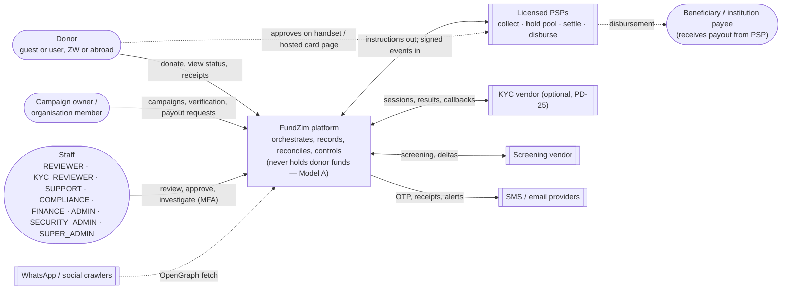
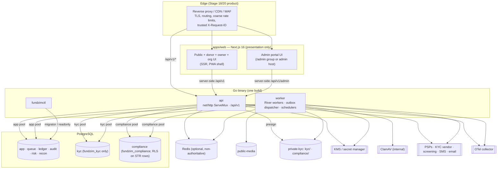
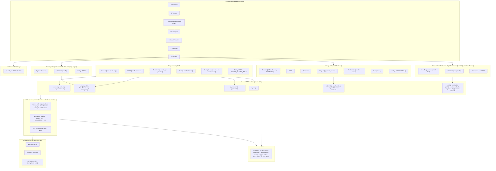
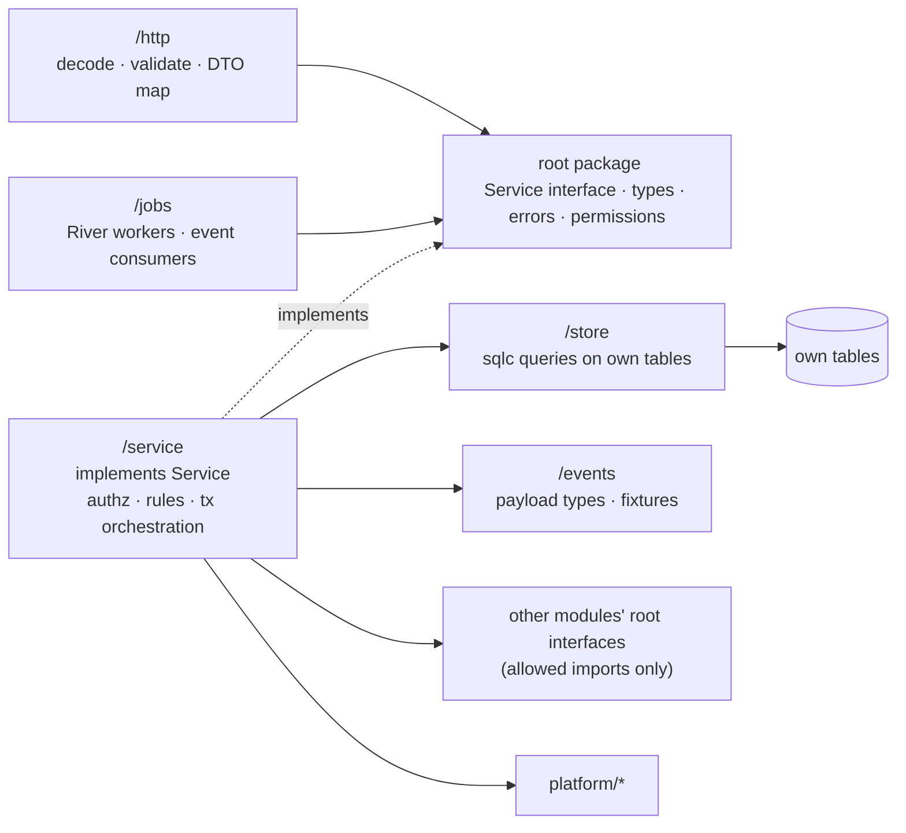
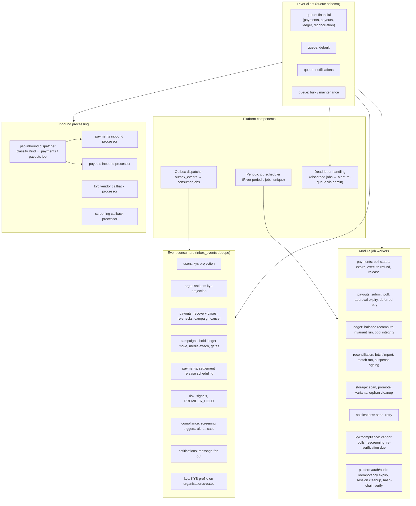

# Component Diagrams (C4)

**Stage 2 — design only.** C4-style views of FundZim: system context, containers, and components inside the
API process and the worker process. Mermaid `flowchart` is used (rather than Mermaid's experimental C4
syntax) so the diagrams render in GitHub and in IDE previews.

Related: [system-overview.md](system-overview.md) · [go-module-design.md](go-module-design.md) ·
[background-processing.md](background-processing.md) · [api-design.md](../api/api-design.md) ·
[authentication-authorization.md](../security/authentication-authorization.md) ·
[observability.md](observability.md)

---

## 1. Level 1 — System context



## 2. Level 2 — Containers



| Container | Technology | Scales by | Notes |
|---|---|---|---|
| api | Go, stdlib `net/http` ServeMux (ADR-031) | Replicas behind the proxy | Stateless; health on `/healthz`, `/readyz`; metrics on an internal port |
| worker | Same binary, River (ADR-025) | Replicas; per-queue concurrency | Leader-only schedulers use River's periodic jobs with unique keys (no Redis lock) |
| fundzimctl | Same codebase | — | Runs migrations with `fundzim_migrator`; invariant checks with `fundzim_readonly` |
| PostgreSQL | One cluster, 8 schemas, 3 runtime roles + migrator + readonly (ADR-022) | Vertical, then read replicas for reporting only | Never a read replica for financial decisions |

## 3. Level 3 — Components of the `api` process

### 3.1 Overview



### 3.2 Middleware chain in detail

Order matters; it follows ARCHITECTURE §5 with the Stage 2 additions (route groups, step-up, justification).

| # | Middleware | Package | Groups | Behaviour | Failure response |
|---|---|---|---|---|---|
| 1 | RequestID | `platform/httpx` | all | Accept `X-Request-ID` only from trusted proxies and only if it is a valid UUID/ULID; else generate UUIDv7; echo in response and in `meta.request_id` | — |
| 2 | Recover | `platform/httpx` | all | Recover panics, log with stack (redacted), count | 500 `INTERNAL_ERROR` |
| 3 | AccessLog | `platform/log` | all | Method, route pattern (not raw path with IDs), status, latency, principal kind, request ID; never bodies, query strings with tokens, cookies | — |
| 4 | Trace | observability | all | OTel span per request; route pattern as span name | — |
| 5 | SecurityHeaders | `platform/httpx` | all | HSTS, `nosniff`, `Referrer-Policy`, `Cache-Control: no-store` on non-public responses | — |
| 6 | BodyLimit | `platform/httpx` | all | Per group: default 64 KiB JSON; webhooks per provider config (e.g. 256 KiB); uploads never go through the API body (presigned) | 413 `PAYLOAD_TOO_LARGE` |
| 7 | Deadline | `platform/httpx` | all | Context deadline per route class (default 10 s; webhooks 5 s) | 503 `SERVICE_UNAVAILABLE` |
| 8 | Session | `auth` (implements `platform/httpx.Authenticator`) | user, staff, public(optional) | Opaque session lookup (hashed token), idle/absolute expiry, rotation; places `actor.Principal` (user id, account kind, roles → permission set, org memberships digest, `mfa_at`, `step_up_at`, session id) on the context | 401 `UNAUTHENTICATED` |
| 9 | CSRF | `auth` | user, staff | Unsafe methods: `Origin`/`Sec-Fetch-Site` check + synchroniser token | 403 `CSRF_FAILED` |
| 10 | RateLimit | `platform/httpx` (Redis-backed, in-process fallback) | all except health | Keys per route class: IP, principal, phone (OTP), provider (webhooks). Sensitive routes fail closed or fall back to a conservative in-process limit if Redis is down | 429 `RATE_LIMITED` + `Retry-After` |
| 11 | StepUp | `auth` | routes marked `StepUp` | `now − principal.step_up_at ≤ STEP_UP_MAX_AGE` | 401 `STEP_UP_REQUIRED` |
| 12 | Justification | `platform/httpx` | staff routes marked `Justified` | Requires `justification` (and case id where case-bound); attached to context for audit | 422 `JUSTIFICATION_REQUIRED` |
| 13 | Idempotency | `platform/idempotency` | routes marked `Idempotent` (required on money routes) | Claim `(scope, key)`; same hash → replay stored response; different hash → conflict; in-flight → conflict | 400 `IDEMPOTENCY_KEY_REQUIRED`, 409 `IDEMPOTENCY_KEY_REUSED`, 409 `IDEMPOTENCY_REQUEST_IN_PROGRESS` |
| 14 | Policy | `platform/httpx` | all | Route-declared policy: `Public`, `User`, `Permission(p)`, `StaffPermission(p)`. Coarse gate only; services re-check permission **and** object ownership | 403 `FORBIDDEN` (or 404 where existence is sensitive) |

Every route is registered with a declaration (sketch, not compiled):

```go
r.Handle("POST /api/v1/campaigns/{campaign_id}/payouts", h.RequestPayout,
    httpx.Policy(httpx.User()), httpx.StepUp(), httpx.Idempotent(httpx.Required),
    httpx.RateClass("payout.request"))
```

`TestEveryRouteHasPolicy` fails the build if a route lacks `Policy`.

### 3.3 Route groups to modules

| Path prefix (indicative; [api-design.md](../api/api-design.md) and the OpenAPI file are authoritative) | Module handler package |
|---|---|
| `/api/v1/auth/*` (OTP start/verify, sessions, MFA) | `auth/http` |
| `/api/v1/me`, `/api/v1/me/*` (profile, contacts) | `users/http` |
| `/api/v1/organisations/*` | `organisations/http` |
| `/api/v1/verification/*` (KYC/KYB sessions, document upload intents, consents) | `kyc/http` |
| `/api/v1/uploads/*` (upload sessions) | `storage/http` |
| `/api/v1/campaigns/*`, `/api/v1/public/campaigns/*` | `campaigns/http` |
| `/api/v1/campaigns/{id}/beneficiaries/*` | `campaigns/http` (checks ownership, then calls `beneficiaries`; go-module-design §5.13) |
| `/api/v1/institution-payees/*` | `beneficiaries/http` |
| `/api/v1/donations`, `/api/v1/payments/*`, `/api/v1/payment-methods` | `payments/http` |
| `/api/v1/campaigns/{id}/payouts`, `/api/v1/payouts/*`, `/api/v1/payout-destinations/*` | `payouts/http` |
| `/api/v1/webhooks/{provider}` | `psp/http` |
| `/api/v1/callbacks/kyc/{vendor}` (proposed), `/api/v1/webhooks/screening/{vendor}` (WHK-03, baseline §12 I-25) | `kyc/http`, `compliance/http` |
| `/api/v1/admin/*` | `admin/http` (calls root services of all modules) |

`admin` handlers are thin: decode, call one or more root-interface methods, map to staff DTOs. When one staff
action must change two modules atomically, the **owning** module exposes a single method that does it (for
example `campaigns.Freeze` places the hold and posts the journal); `admin` never opens a transaction.

### 3.4 Inside one module (pattern)



## 4. Level 3 — Components of the `worker` process

### 4.1 Overview



### 4.2 Job kinds

[background-processing.md §6](background-processing.md) is the **authoritative** job catalogue (kinds,
queues, uniqueness, retries, timeouts, dead-letter behaviour). The table below is the per-module view used for
wiring, using the same kind names. Event-consumer kinds follow the `<module>.on_<event>` convention
(background-processing §3); kinds marked *(proposed)* are needed by this design and not yet in that catalogue.

| Kind | Owner | Trigger | Effect (transaction) |
|---|---|---|---|
| `platform.outbox_dispatch` | platform | Periodic (2 s) + producer kick | TX-26 |
| `psp.webhook_dispatch` | psp | Enqueued in TX-01 | Classify `Kind`, enqueue the registered apply job |
| `payments.webhook_apply`, `payments.refund_webhook_apply`, `payments.dispute_webhook_apply` | payments | `psp.webhook_dispatch` | TX-04 / TX-05 / TX-06 / TX-08 / TX-11 |
| `payments.status_poll`, `payments.unknown_sweep`, `payments.intent_expiry`, `payments.create_retry` | payments | Transition txs, periodic sweeper | Status query (P5) then transition; never assumes failure |
| `payments.refund_submit`, `payments.refund_status_poll` | payments | TX-10 / refund `PENDING`/`UNKNOWN` | P5 refund call; TX-11 |
| `payments.on_settlement_matched` → `payments.release_funds` *(proposed)* | payments | `settlement.matched`; release scheduled at hold-period end | TX-07 |
| `payouts.webhook_apply` | payouts | `psp.webhook_dispatch` | TX-15 / TX-16 |
| `payouts.submit`, `payouts.status_poll`, `payouts.unknown_sweep` | payouts | Approval tx, sweeper | TX-14 → call → TX-15; `UNKNOWN` never resubmitted |
| `payouts.approval_expiry` *(proposed)* | payouts | Periodic | Approvals past validity → `PENDING_REVIEW` |
| `payouts.on_risk_hold_placed`, `payouts.on_kyc_status_changed`, `payouts.on_compliance_case_blocking_changed`, `payouts.on_campaign_frozen`, `payouts.on_campaign_cancelled` *(proposed)* | payouts | Events | Re-check in-flight payouts (Y7) or cancel pre-submit (Y5) |
| `payouts.on_dispute_shortfall`, `payouts.on_refund_shortfall` *(proposed)* | payouts | Events | TX-25 (recovery case + `RECOVERY_HOLD`) |
| `ledger.invariant_verify` | ledger | Nightly + on demand | Recompute vs `ledger_balances`, SC checks; failure → `ledger.invariant_failed` / `ledger.pool_integrity_breached` |
| `reconciliation.import`, `reconciliation.match_run`, `reconciliation.discrepancy_ageing`, `reconciliation.daily_report` | reconciliation | Staff upload / schedule | Import; TX-24 per match; SC-4 escalation; reports |
| `storage.object_scan`, `storage.media_reencode`, `storage.object_promote` | storage | TX-28 | Quarantine → scan → (re-encode) → promote |
| `notifications.on_<event>` → `notifications.send` | notifications | Events | `notification_jobs` row, then channel send |
| `users.on_kyc_level_changed`, `organisations.on_kyb_level_changed` *(proposed)* | users / organisations | Events | Projection update (version-ordered) |
| `campaigns.on_risk_hold_placed` *(proposed)*, `campaigns.end_date_complete` | campaigns | Event / periodic | `hold:{id}:applied` journal for campaign-scope `COMPLIANCE_HOLD`; lifecycle completion |
| `compliance.screening_run`, `compliance.rescreen_schedule`, `compliance.on_risk_alert_raised` *(proposed)* | compliance | Events, schedule | Screening; alert → case |
| `risk.hold_expiry`, `risk.on_<event>` | risk | Periodic, events | Hold expiry via `hold_events`; signals; `PROVIDER_HOLD` on SEV1 / pool breach |
| `kyc.on_organisation_created`, `kyc.vendor_poll`, `kyc.reverification_due`, `kyc.profile_snapshot` *(proposed)* | kyc | Events, schedule | KYB profile creation; vendor results; expiry triggers; projection convergence |
| `psp.provider_health_probe` | psp | Periodic | `provider_health_events` |
| `auth.session_prune`, `platform.idempotency_expire`, `platform.retention_apply` (disabled until LR-012), `audit.chain_verify` *(proposed)* | auth / platform / audit | Periodic | Maintenance; chain break → SEV1 |

### 4.3 Composition root wiring (internal/app)

Construction follows the topological order in [dependency-matrix.md §3](dependency-matrix.md), so each service
receives only already-built dependencies:

1. `config.Load` → `log`, `clock`, `ids`, `crypto.Keyring` (KMS), `db.Open` (app, kyc, compliance pools),
   `jobs.Client` (River on the app pool), `outbox.Writer`, `idempotency.Store`.
2. Services: audit → users, storage, ledger, fees, psp (+ adapters from config), risk → organisations, notifications
   → auth, kyc (+ vendor adapter) → beneficiaries, compliance (+ screener) → campaigns → payments,
   payouts → reconciliation → admin.
3. Ports: only `httpx.Authenticator` (implemented by `auth`, needed because `platform` cannot import `auth`),
   in `internal/app/ports.go`. The former C-1/C-3/C-7 interim ports were removed when the baseline was amended.
4. HTTP: `httpx.NewRouter`; each module's `http.Register(r, svc)`; admin group; webhook group.
5. Worker: register job workers per module (`jobs.Register(...)`), the event routing table
   (`internal/app/events.go`: event name → consumer kinds), periodic schedules, inbound kind routing for `psp`.
6. Mode switch: `api` starts the HTTP server; `worker` starts River (and a health/metrics listener).
