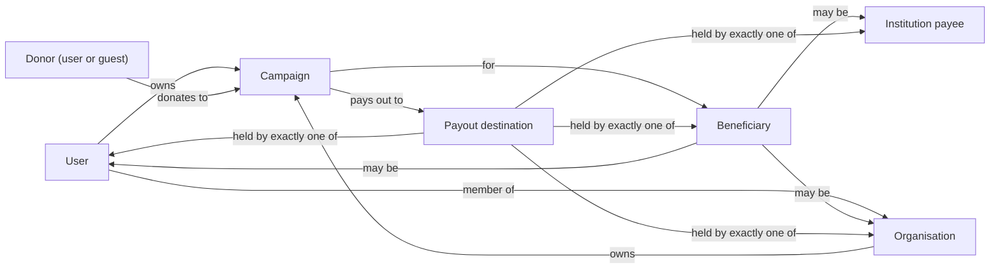

# Domain Boundaries

**Stage 2 — design only.** This document maps FundZim's bounded contexts, says which module is the source of
truth for every important concept and piece of state, and defines the projections, the anti-corruption layers
at external boundaries and the shared kernel. Module list, imports and table ownership come from
[design-baseline.md](../stage-2/design-baseline.md) and are not repeated in full.

Related: [dependency-rules.md](dependency-rules.md) · [dependency-matrix.md](dependency-matrix.md) ·
[go-module-design.md](go-module-design.md) · [system-overview.md](system-overview.md) ·
[schema-overview.md](../database/schema-overview.md) · [payment-provider-interfaces.md](payment-provider-interfaces.md)

---

## 1. Bounded contexts

A bounded context here is a group of modules that share a vocabulary. Modules are the unit of ownership and
enforcement; contexts are the unit of language.

```mermaid
flowchart TB
    subgraph SK["Shared kernel"]
        platform["platform<br/>money · ids · clock · db · outbox · crypto · actor"]
    end
    subgraph REC["Record keeping"]
        audit["audit<br/>audit events · evidence"]
    end
    subgraph IAM["Identity & access"]
        users["users"]
        auth["auth"]
    end
    subgraph VER["Verification (C3 zone)"]
        kyc["kyc<br/>KYC · KYB · consents ·<br/>fundraising authority"]
    end
    subgraph ORG["Organisations"]
        organisations["organisations"]
    end
    subgraph FUND["Fundraising"]
        campaigns["campaigns"]
        beneficiaries["beneficiaries"]
    end
    subgraph MOVE["Money movement"]
        payments["payments"]
        payouts["payouts"]
        psp["psp<br/>(anti-corruption layer)"]
    end
    subgraph ACC["Accounting"]
        ledger["ledger"]
        fees["fees"]
        reconciliation["reconciliation"]
    end
    subgraph TS["Trust & safety"]
        risk["risk<br/>holds · limits · signals"]
        compliance["compliance<br/>cases · screening · STR (restricted)"]
    end
    subgraph SUP["Supporting services"]
        storage["storage"]
        notifications["notifications"]
    end
    subgraph STAFF["Staff operations"]
        admin["admin (no tables)"]
    end

    EXT1[["PSPs"]] -. ACL .- psp
    EXT2[["KYC vendor"]] -. ACL .- kyc
    EXT3[["Screening vendor"]] -. ACL .- compliance
    EXT4[["SMS / email"]] -. ACL .- notifications
    EXT5[["Object store / scanner"]] -. ACL .- storage

    campaigns -->|customer of| kyc
    campaigns -->|customer of| beneficiaries
    campaigns -->|restriction check| compliance
    payments -->|restriction check| compliance
    campaigns -->|posts freeze journals| ledger
    payments -->|customer of| campaigns
    payments -->|named posting rules| ledger
    payouts -->|named posting rules| ledger
    payouts -->|live gates| kyc
    payouts -->|live gates| compliance
    payments --> psp
    payouts --> psp
    reconciliation --> payments
    reconciliation --> payouts
    reconciliation --> ledger
    compliance --> risk
    campaigns --> risk
    payments --> risk
    payouts --> risk
    kyc -. "published language: kyc.* / kyb.* events" .-> users
    kyc -. events .-> organisations
    payments -. "dispute.shortfall / refund.shortfall" .-> payouts
    reconciliation -. settlement.matched .-> payments
```

| Relationship | Pattern | Notes |
|---|---|---|
| All modules ↔ `platform` | **Shared kernel** | Small, generic, no domain concepts (§7). Changes need technical-lead review. |
| `payments`/`payouts`/`reconciliation` ↔ PSPs | **Anti-corruption layer** in `psp` | §5 |
| `kyc` ↔ KYC vendor; `compliance` ↔ screening vendor; `notifications` ↔ SMS/email; `storage` ↔ object store and scanner | ACL inside the owning module (`kyc/vendor`, `compliance/screening`, `notifications/channels`, `storage/objectstore`, `storage/scanner`) | Vendor types never leave those sub-packages |
| `campaigns`, `payouts` → `kyc` | **Customer / supplier** (synchronous, live) | `kyc` publishes levels and statuses only; never identity attributes |
| `users`, `organisations` ← `kyc` | **Published language** (events) + local projection | Display and filtering only |
| `payments`, `payouts`, `campaigns`, `reconciliation` → `ledger` | **Conformist** to the ledger's named posting rules | Callers cannot assemble arbitrary lines (LEDGER §5) |
| `payments` ⇢ `payouts` | **Events only** | Two financial state machines never call each other |
| Everyone → `audit`, `risk` | Downstream **open host service** | Both are low-layer so every module can use them |

## 2. Ownership of the people-and-money concepts

The most common modelling error in crowdfunding is collapsing these roles into one "user". They are separate
concepts with separate owners, and one person can hold several of them for the same campaign.

| Concept | Definition | Owning module (table) | How others refer to it |
|---|---|---|---|
| **User** | A FundZim account (`account_kind` `USER` or `STAFF`). | `users` (`users`) | `user_id` |
| **Staff member** | A `STAFF` account bound to a verified person record. Never the same account as a personal one. | `users` (account), `auth` (roles, MFA) | `user_id` + `actor_type=staff` |
| **Campaign owner** | The party accountable for a campaign: **either** an individual user **or** an organisation (exactly one). Requests payouts. | `campaigns` (`campaigns.owner_user_id` / `owner_organisation_id`) | `campaign_id`; ownership checks call `campaigns` |
| **Organisation** | A legal entity running campaigns. | `organisations` (`organisations`) | `organisation_id` |
| **Organisation member** | A user with an org role (`ORG_ADMIN`, `ORG_MEMBER`) in an organisation. Platform authorisation. | `organisations` (`organisation_members`, `organisation_roles`) | membership query on `organisations` |
| **Organisation representative / controller / beneficial owner** | Individuals verified as acting for or controlling the organisation (legal facts, C3). Not the same as membership. | `kyc` (`organisation_persons`, `beneficial_owners`, `representative_authorities`) | Opaque `kyc` refs; levels only outside `kyc` |
| **Beneficiary** | Who the campaign is for (self, another person, an institution, the organisation itself). Never assumed to be the owner. | `beneficiaries` (`beneficiaries`, `beneficiary_relationships`, `beneficiary_verifications`) | `beneficiary_id`; campaign link in `campaigns.campaign_beneficiaries` |
| **Beneficiary evidence** | Consent, relationship proof, medical/funeral documents (C3). | `kyc` (`beneficiary_evidence`, `consents`) | Opaque `evidence_ref` held by `beneficiaries` |
| **Institution payee** | A hospital, school, funeral parlour etc. that can receive a payout directly (KYB-lite). | `beneficiaries` (`institution_payees`) | `institution_payee_id` |
| **Fundraising authority** | Legal authority to collect for others (PVO Act gate). | `kyc` (`fundraising_authorities`) | Opaque ref + validity window via `kyc` |
| **Payout destination** | A versioned rail account (wallet or bank) that money can be sent to, with a holder who must be the owner, the verified beneficiary or a verified institution payee. Account number is C3, encrypted (key class `payout-destination`). | `payouts` (`payout_destinations`, `payout_destination_verifications`) | `destination_id` + `destination_version`; masked display only |
| **Payout requester / approver** | The user who requests (owner or `ORG_ADMIN`) and the staff who approve (FINANCE). Must be distinct people. | `payouts` (`payout_requests.requested_by`, `payout_approvals`) | — |
| **Donor** | Whoever pays: a user or a guest. May be anonymous to the public and to the owner. | `payments` (`donations`) | `donation_id`; identity never leaves `payments` for anonymous donations except to permitted staff |
| **Provider** | A PSP and its accounts and capabilities. | `psp` | `provider_id` (stable code, e.g. `sandbox`) |



Invariants owned by these boundaries (enforced in the owner's service **and** by DB constraints, see
[campaign-schema.md](../database/campaign-schema.md), [payout-schema.md](../database/payout-schema.md) and
[organisation-beneficiary-schema.md](../database/organisation-beneficiary-schema.md)):

- a campaign has exactly one owner reference (user **xor** organisation);
- a payout destination has exactly one payee reference, matching `payee_type` (beneficiary-verification §8);
- a payout's destination holder ∈ {owner, verified beneficiary, verified institution payee, owning
  organisation} — checked by EC-05 at request and submit;
- a staff approver is never the requester, never the person who changed the destination within the
  cooling-off period, and never connected to the campaign (operational-controls §2).

## 3. Source of truth for each piece of state

"Copies" are projections or caches. A copy may be used for display, search and filtering. **A decision that
moves money, publishes a campaign or grants access always reads the source of truth.**

| State | Source of truth | Copies | Copy consistency | Decisions that must read the source |
|---|---|---|---|---|
| Individual KYC level and status | `kyc.verification_profiles` | `users` verification mirror columns (written by the `users` consumer of `kyc.level_changed` / `kyc.status_changed`) | Eventual (seconds) | EC-03, campaign submission gates, donation limits by level |
| Organisation KYB level and status | `kyc.kyb_organisations` (+ `kyb_cases`) | `organisations.organisation_verifications` | Eventual (seconds) | EC-03 (organisation), org campaign submission |
| Fundraising authority validity | `kyc.fundraising_authorities` | none | — | Campaign approval, EC-04 |
| Beneficiary verification decision | `beneficiaries.beneficiary_verifications` | none | — | EC-04, campaign approval |
| Campaign lifecycle status and visibility | `campaigns.campaigns` (+ `campaign_status_history`) | Public read cache (CDN, Redis): non-authoritative | Short TTL + purge on `campaign.status_changed` | Donation creation (payments calls `campaigns.CanAcceptDonation` live), EC-01 |
| Payment intent status | `payments.payment_intents` (+ `payment_events`) | Donor status page polls the API | — | Ledger posting, refunds, disputes |
| Provider-reported transaction status | `payments.payment_transactions` (`raw_status`, `mapped_status`) | — | — | Payment status transition (after precedence rules) |
| Refund / dispute status | `payments.refund_requests`, `refund_transactions`, `payment_disputes` | — | — | — |
| Payout status | `payouts.payout_requests` (+ `payout_events`) | — | — | Everything payout-related |
| Money states (unsettled, available, reserved, held, in transit, paid) | `ledger.ledger_entries` | `ledger.ledger_balances` (projection, **same transaction** as the posting, verifiable by full recompute) | Strong (synchronous) | EC-09, EC-14, EC-19 read `ledger_balances` under lock |
| Holds (all types) | `risk.holds` (+ `hold_events`) | none (notifications get a reason-less message) | — | EC-12, EC-18, donation acceptance for `CAMPAIGN_FREEZE`/`ACCOUNT_HOLD` |
| Limits | `risk.limits` (versioned) | In-process cache keyed by `(limit_key, scope, version)` with short TTL; version recorded in each decision | Eventual (≤ cache TTL); decision stores the version used | EC-10, EC-17, EC-21 |
| Compliance cases, restrictions, screening | `compliance.*` (restricted) | `v_payout_blocking_cases`, `v_screening_status`, `v_active_restrictions` (views, not copies) | Strong (views) | EC-13, EC-15; `CREATE_CAMPAIGN`/`DONATE` checks inside the caller's transaction |
| Provider capabilities and health | `psp.provider_capabilities` (versioned, intersected with configuration), `psp.provider_health_events` | In-process capability cache, invalidated on version change | Eventual (≤ TTL); routing records capability version | Routing, EC-08, EC-18, EC-20 |
| Fee schedule in force | `fees.fee_schedule_versions` | none; the version used is stored on each journal (`fee_schedule_version`) | — | Capture posting |
| Settlement matches | `recon.reconciliation_matches`, `settlement_items` | Release scheduling in `payments` (a job, not a copy) | Event-driven | Release (T4). `payments` may not import `reconciliation`, so the release job is triggered by `settlement.matched` and then verifies in the ledger that the T3 journal for that payment exists (`ledger.HasSettlementFor(payment_id)`) before posting. |
| Session and roles | `auth.sessions`, `auth.role_assignments` | `platform/actor.Principal` on the request context (per request, not cached across requests) | Per request | All authorisation |
| Audit trail and evidence | `audit.*` | none | — | — |

### 3.1 The verification projections in detail

`organisations.organisation_verifications` and the users mirror exist because listing pages, search filters
and badges must not call `kyc` per row (and the `kyc` pool is deliberately small). Rules:

1. Written **only** by the owning module's event consumer (`organisations` / `users`), from `kyb.*` / `kyc.*`
   events, with `source_event_id` and `source_version` (the `kyc` profile version) stored; an older version
   never overwrites a newer one.
2. Never read by `payouts`, never used for payout eligibility, campaign approval, or donation limits.
3. A nightly job in `kyc` emits a `kyc.profile_snapshot` event per changed profile in the last 48 h so that a
   lost or failed consumer converges (consumers are idempotent by version).
4. The projection carries level and status only, never risk rating, PEP status or review reasons.

This refines [kyc-architecture.md §11](../compliance/kyc-architecture.md), which says the mirror is "written
only by the `kyc` module's service": in Stage 2 the `kyc` module *produces* the change and the `users` module
applies it, because `kyc` runs on a different pool and `users` owns the table.

## 4. Who decides what (decision rights)

| Decision | Decided by (module) | Inputs from (via interface) |
|---|---|---|
| Can this campaign be submitted / approved / published? | `campaigns` | `kyc` (owner level, fundraising authority), `beneficiaries` (verification), `risk` (holds, assessment), `compliance` (`CREATE_CAMPAIGN` restriction, read-only) |
| Can this donation be accepted, through which provider? | `payments` (routing) | `campaigns` (status, accepted currencies, settlement model), `psp` (capabilities, custody model, health), `risk` (holds, limits), `fees` (preview), `compliance` (`DONATE` restriction, read-only) |
| Is this payment succeeded? | `payments` | `psp` (verified webhook or authenticated status query); reconciliation for `UNKNOWN` |
| Is this payout eligible / which approval tier? | `payouts` (eligibility engine) | `campaigns`, `users`, `organisations`, `kyc`, `beneficiaries`, `compliance`, `risk`, `ledger`, `psp`, `fees` |
| Does this movement balance and which accounts? | `ledger` (named posting rules) | Caller supplies amounts and references |
| What fee applies? | `fees` | Caller supplies amount, currency, method, campaign category |
| Should a hold be placed / released? | The module that detects the cause (`campaigns`, `payments`, `payouts`, `compliance`, `risk` itself); `risk` records it and enforces release authority per hold type | — |
| Is this subject sanctioned / PEP? | `compliance` | `kyc` (identity attributes for screening, through a justified, case-bound call) |
| Who may do what? | `auth` (evaluated into the principal) + owning module (object-level ownership) | `organisations` (membership), `campaigns` (ownership) |

## 5. Anti-corruption layer at the provider boundary (`psp`)

The PSP market is unsettled (no provider selected; provider-comparison §5). Provider vocabulary must never
leak into domain code. `psp` is the only place that knows provider names, status strings, signature schemes or
payload formats. Interface signatures are specified in
[payment-provider-interfaces.md](payment-provider-interfaces.md); this section fixes the boundary rules.

| Concern | Outside `psp` (domain language) | Inside `psp/adapters/<provider>` (provider language) |
|---|---|---|
| Identity of an operation | `payment_id`, `refund_id`, `payout_id` (FundZim UUIDv7, used as the provider idempotency/merchant reference and never changed on retry) | Provider transaction ids, poll URLs, merchant refs |
| Status | Canonical vocabularies of baseline §8 (`PENDING`, `REQUIRES_ACTION`, `SUCCEEDED`, `UNKNOWN`, …) | Raw status strings, kept verbatim in `payment_transactions.raw_status` and in the inbox payload |
| Unmapped status | `UNKNOWN` + alert; never guessed | Mapping table per adapter, versioned |
| Errors | `psp.ErrDefinitelyNotSent`, `psp.ErrOutcomeUnknown`, `psp.ErrRejected{Code}`, `psp.ErrNotSupported` | HTTP codes, timeouts, provider error bodies |
| Money | `money.Money` (int64 minor + currency) | Provider decimal strings, converted exactly in the adapter with a currency-aware parser (no floats) |
| Capabilities | `psp.Capabilities` incl. `custody_model`, settlement currency per method × currency; unverified = absent | Contract terms, docs |
| Webhooks | `psp.VerifiedEvent{Class: PAYMENT \| REFUND \| DISPUTE \| PAYOUT \| OTHER, ProviderRef, FundZimRef, OccurredAt, MappedStatus}` (reversals are DISPUTE class) | Signature, timestamp, raw bytes (verified on the raw body; stored redacted) |
| Custody | Routing **refuses** `MERCHANT_SETTLEMENT` for campaign donations (handover D1) | — |

Three further rules:

1. **No business rules in adapters.** No fees, eligibility, limits or state precedence (PAYMENTS §3). Those
   are in `payments` / `payouts`.
2. **Classification, then dispatch.** `psp` verifies, parses and classifies an inbound event by `Kind`, writes
   it to `provider_webhook_inbox`, and enqueues the consumer job registered for that kind
   (`payments` for PAYMENT/REFUND/DISPUTE, `payouts` for PAYOUT). The registration is done in
   `internal/app`, so `psp` names no consumer module. A payout event never reaches `payments` and vice versa;
   an event whose FundZim reference cannot be resolved is `PARKED` and surfaces in reconciliation; an unknown
   event type alerts (it is never silently `IGNORED`).
3. **Weak providers.** Where a provider's callbacks are unsigned or lack replay protection, the adapter
   reports `ConfirmationMode = WEBHOOK_UNSIGNED_VERIFY_BY_API` and the consuming module must perform an
   authenticated status query before any money state changes.

The same ACL shape applies to the KYC vendor (`kyc/vendor`: vendor check names map to FundZim check codes;
"REJECT" is never a vendor outcome), the screening vendor (`compliance/screening`), SMS/email
(`notifications/channels`) and storage back-ends (`storage/objectstore`, `storage/scanner`).

## 6. Read models and projections catalogue

| Read model | Owner | Fed by | Consistency | Rebuild |
|---|---|---|---|---|
| `ledger.ledger_balances` | ledger | Every posting, same transaction | Strong | `fundzimctl ledger recompute` (full recompute and compare; mismatch = SEV1) |
| Users verification mirror | users | `kyc.level_changed`, `kyc.status_changed`, `kyc.profile_snapshot` | Eventual | Replay snapshot events |
| `organisations.organisation_verifications` | organisations | `kyb.*` events | Eventual | Replay snapshot events |
| Campaign public summary (raised per currency, donor count, status) | campaigns (computed from `ledger` balances + own tables) | Request time; CDN/Redis cache in front | Cache TTL; never used for decisions | Cache purge |
| Risk linkage graph | risk | `user.*`, `auth.*`, `payment.*`, `payout_destination.changed` events (fingerprints only) | Eventual | Replay from retained events (Stage 13) |
| Owner dashboard money states | campaigns via `ledger` projections, payouts via own tables | Request time | Strong per query, per currency | — |
| Staff queues (reviews, approvals, cases) | owning module | Own tables | Strong | — |

No module keeps a copy of another module's mutable financial state. `payouts` never caches campaign balances;
it locks `ledger_balances` rows through `ledger` inside its transaction.

## 7. Shared kernel (`platform`) content

**In the kernel** (generic, no domain meaning): `config`, `db` (pools, `WithTx`, retry), `money`
(`Money`, `Currency`, allocation by largest remainder), `ids` (UUIDv7, public codes), `clock`, `httpx`
(envelope, error rendering, middleware, router helpers), `log` (redacting slog), `errs` (coded domain error
type), `actor` (principal and system actors on the context), `crypto` (envelope encryption by key class, HMAC,
blind index), `outbox`, `jobs` (River wrapper), `idempotency`, `makerchecker` (helper library for SoD checks;
no table — a deliberate deviation from the Stage 1 handover's generic `approval_requests` table: each
module keeps its own request table with its own DB check, dependency-rules §7 C-8), `blob` (opaque object reference type), `featureflags`, `httpclient` (outbound client with
deadlines, SSRF guard, tx-open guard), `market` (currencies and markets registry).

**Not in the kernel**, ever: domain enums (payment status, KYC level), domain IDs with meaning (`CampaignID`
lives in `campaigns`), permission catalogues (each module declares its own permission names in its root
package; `auth` collects them), posting rules, fee rules, provider types. Putting a domain concept in
`platform` would let every module depend on it without appearing in the graph.

Typed IDs: each module defines its own ID types in its root package (`campaigns.ID`). A module that cannot
import the owner (for example `payouts` receiving a `payment_id` in an event) carries `ids.UUID` and never
dereferences it except through an allowed call.
