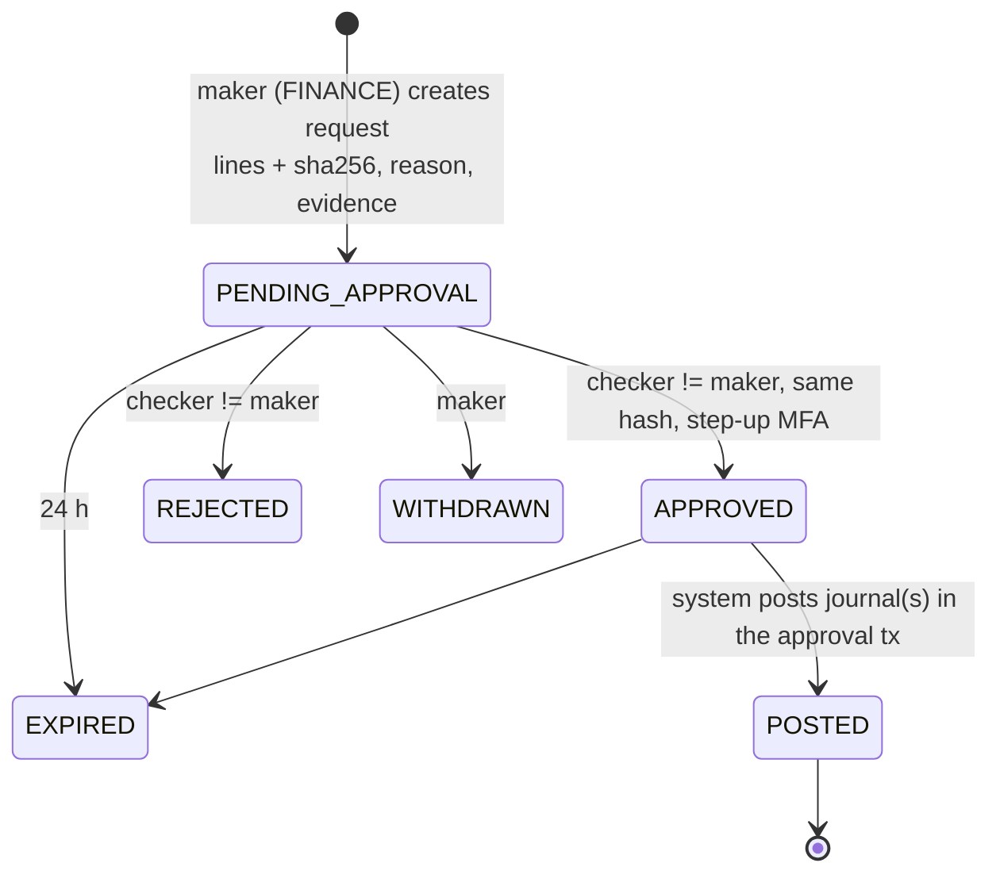

# Ledger Posting Model

**Stage 2 — design only.** Implementation is Stage 10 ([ROADMAP](../ROADMAP.md)); nothing posts money yet.
Decision record: [ADR-023](../adr/ADR-023-ledger-posting-architecture.md). Schema:
[ledger-schema.md](../database/ledger-schema.md) and the draft [`design/sql/0006_ledger.sql`](../../design/sql/0006_ledger.sql).
Invariants: [ledger-invariants.md](ledger-invariants.md). Inputs: [LEDGER.md](../LEDGER.md) (L1–L10, posting API §5),
[settlement-and-custody-model.md](../ledger/settlement-and-custody-model.md) (chart, SC-1 – SC-6, journals §5),
[refund-and-reversal-flows.md](../payments/refund-and-reversal-flows.md) (§3.3, §6, §7),
[payout-lifecycle.md](../payments/payout-lifecycle.md) §3, [operational-controls.md](../compliance/operational-controls.md) §3.

> **Custody caveat — LEGAL_REVIEW_REQUIRED (LR-001, LR-002, LR-003, LR-076).** Under the provisional Model A
> ([ADR-013](../adr/ADR-013-regulatory-operating-model.md)) a licensed PSP collects, holds and disburses. The
> ledger records FundZim's claims on the provider and its obligations to campaigns and donors. It is not
> FundZim's cash and not stored value. Whether these balances belong on FundZim's balance sheet is LR-002.

---

## 1. Principles

1. **Named rules only.** Every business event has one rule in `ledger.ledger_posting_rules`. Go exposes one
   function per rule (`PostDonationCaptured`, `PostPayoutReserved`, …). Callers never assemble free lines.
2. **The database re-checks everything** Go checks: balance, line count, currency, the rule's allowed accounts,
   approvals, periods and non-negative obligations ([ledger-invariants.md](ledger-invariants.md)).
3. **Posting is inside the caller's DB transaction.** A payment state change, its journals, the audit event and
   the outbox message commit together or not at all (DATABASE §12). Providers are never called inside it.
4. **One journal = one business event = one currency** with a deterministic idempotency key.
5. **Corrections never edit history.** They are reversals (exact mirrors) plus replacements, under maker-checker.
6. **Separate money states stay in separate accounts** (captured ≠ settled ≠ available ≠ reserved ≠ paid out).

## 2. Account semantics under Model A

The ledger is not a custody statement. Each account says *what FundZim believes about money held elsewhere*:

| Kind | Accounts | Real-world meaning | Who holds the money |
|---|---|---|---|
| Claim on provider | `asset:psp_clearing:{p}` | The PSP confirmed the donor paid; it owes this into the pool but has not settled it | PSP (in collection) |
| Provider-held pool | `asset:psp_settled:{p}` | Settled per the PSP's statement, held by the PSP in its own trust/settlement arrangement for campaigns. A memorandum/control account | PSP |
| FundZim's own cash | `asset:fundzim_operating_bank` | FundZim's bank account: only platform-fee income and FundZim's own funding/recovery movements (SC-5) | FundZim |
| Obligations | `liability:campaign_*`, `liability:payout_in_transit:{p}`, `liability:refund_payable` | What is owed onward to beneficiaries or donors, split by money state | — (claims against the pool) |
| Result | `revenue:*`, `expense:*`, `equity:platform` | FundZim's income and costs | — |
| Recoverables | `asset:chargeback_recoverable`, `asset:refund_recoverable:{c}` | Shortfalls FundZim funded and seeks back | — |
| Suspense | `suspense:settlement_discrepancy:{p}` | Unexplained reconciliation differences; must trend to zero | — |

Pool integrity (SC-2): the obligations owed from a provider's pool never exceed what the provider owes or holds
(`psp_clearing + psp_settled`). A breach means one campaign's reversal is being paid from another campaign's
money.

### 2.1 Mapping the Stage 2 brief's account types to the Stage 1 chart

| Brief account type | Stage 1 chart account(s) | Notes |
|---|---|---|
| PSP clearing | `asset:psp_clearing:{p}` | Claim on provider, captured not settled |
| (PSP settled pool) | `asset:psp_settled:{p}` | Not in the brief; required by ADR-014 |
| Campaign payable | `liability:campaign_unsettled:{c}` (captured), `liability:campaign_payable:{c}` (released = available) | The brief's single "payable" is split by money state |
| Platform revenue | `revenue:platform_fees` | Recognised at capture; cash arrives via fee remittance |
| Processing fee payable | **None** | See below |
| Payouts in transit | `liability:campaign_payout_pending:{c}` (requested), `liability:payout_in_transit:{p}` (submitted, incl. UNKNOWN) | Two states |
| Refund liabilities | `liability:refund_payable` | Approved refunds in flight |
| Chargeback exposure | `asset:chargeback_recoverable` (+ `liability:campaign_held:{c}` for debit-on-loss providers) | Exposure FundZim funded; the campaign's share is debited from its own accounts |
| Reserves | `liability:campaign_reserve:{c}` | Holdback (PD-33) |
| Reconciliation suspense | `suspense:settlement_discrepancy:{p}` | Per provider, either sign |

**Why there is no "processing fee payable".** Under Model A the PSP deducts its processing fee **at source**:
it settles the net amount and keeps the fee. FundZim never holds the fee and never pays it to the provider
later, so FundZim owes the provider nothing and there is no liability to record. T2 instead *reduces the claim*
on the provider (`Cr psp_clearing`) and charges the bearer (`Dr campaign_unsettled` or
`Dr expense:psp_processing_fees`). A payable would appear only if a provider invoiced fees separately (a
Model-B-like or invoice arrangement; PCR-016); that would need a new account class and an ADR-014 amendment.

### 2.2 How auditability is preserved when the PSP holds the money

FundZim never sees the account where the money sits. The ledger is made auditable by **evidence matching, not
self-trust** (custody model §7):

1. Every posting is triggered by authoritative provider state (verified webhook, authenticated status API or
   reconciliation), stored first in the webhook inbox / `payment_events` with the raw redacted payload.
2. Provider statements and settlement reports are imported as hash-verified evidence records
   ([reconciliation-schema.md](../database/reconciliation-schema.md)); duplicate imports are impossible.
3. Three-way match: payment/payout record ↔ provider line ↔ ledger journal, stored as
   `recon.reconciliation_matches` rows pointing at the journal (`ledger_transaction_id`).
4. `asset:psp_settled:{p}` is compared with the provider's own pool balance after each run (SC-3); differences
   go to suspense and become discrepancy cases, never silent edits.
5. Journals are append-only, sealed at commit, balanced per currency and posted only through named rules; any
   correction is a maker-checker reversal with reason and evidence; verification runs (L9, L10, SC-2) are stored.

An auditor can therefore start from a provider statement line and reach the journal and the payment record, or
start from a campaign balance and reach each provider line behind it.

## 3. Posting API (Go sketch, not compiled)

```go
package ledger // internal/ledger

type Direction string // "DEBIT" | "CREDIT"

type AccountRef struct {
    Class   string     // e.g. "liability:campaign_payable"
    OwnerID *uuid.UUID // campaign or provider id; nil for platform accounts
}

type Line struct {
    Account   AccountRef
    Direction Direction
    Amount    money.Money // int64 minor units + currency; must equal Posting.Currency
}

type Posting struct {
    Rule           RuleCode   // "DONATION_CAPTURED", ...
    IdempotencyKey string     // deterministic, e.g. "payment:{id}:capture"
    Currency       money.Currency
    OccurredAt     time.Time  // UTC, from the injected clock or the provider
    Source         SourceRef  // type, id, provider code, provider reference
    FeeScheduleVersionID *uuid.UUID
    BatchID        *uuid.UUID
    AdjustmentID   *uuid.UUID // required for rules with requires_approval
    Reverses       *TxID      // REVERSAL only
    Reason         string
    Actor          Actor      // SYSTEM component or STAFF user id
    Lines          []Line
}

var (
    ErrIdempotencyConflict = errors.New("LEDGER_IDEMPOTENCY_CONFLICT") // same key, different journal
    ErrInsufficientFunds   = errors.New("LEDGER_INSUFFICIENT_FUNDS")   // a SYNC account would go negative
    ErrRuleViolation       = errors.New("LEDGER_RULE_VIOLATION")       // line not allowed by the rule
    ErrPeriodClosed        = errors.New("LEDGER_PERIOD_CLOSED")
    ErrUnbalanced          = errors.New("LEDGER_UNBALANCED")
)

// Post writes one journal inside the caller's transaction. It never commits.
func (s *Service) Post(ctx context.Context, tx pgx.Tx, p Posting) (TxID, error) {
    if err := s.validate(p); err != nil { // L1 L2 L3 SC-6, rule lines (cached registry), owners
        return TxID{}, err
    }
    // 1. Idempotency: same key + identical journal -> existing id; different -> conflict.
    if existing, found, err := s.q.GetJournalByKey(ctx, tx, p.IdempotencyKey); err != nil {
        return TxID{}, err
    } else if found {
        if !existing.Equivalent(p) { // rule, currency, source, multiset of (account code, direction, amount)
            s.alerts.Page("ledger.idempotency_conflict", p.IdempotencyKey)
            return TxID{}, ErrIdempotencyConflict
        }
        return existing.ID, nil
    }
    // 2. Resolve accounts lazily (INSERT ... ON CONFLICT DO NOTHING; then SELECT), sorted by account id.
    accts, err := s.ensureAccounts(ctx, tx, p.Currency, p.Lines)
    if err != nil { return TxID{}, err }
    // 3. Lock SYNC rows that this journal decreases, in ascending account id (deadlock-free), and check.
    if err := s.lockAndCheckDecreases(ctx, tx, accts, p.Lines); err != nil { return TxID{}, err }
    // 4. Insert the header, then the entries sorted by account id (same order as the locks).
    id := ids.NewV7()
    if err := s.q.InsertJournal(ctx, tx, id, p); err != nil {
        if isUniqueViolation(err, "uq_ledger_transactions_idempotency_key") {
            // Concurrent writer won the race: our tx is aborted. Caller retries the whole business
            // operation; the retry takes the "found" path above and returns the winner's id.
            return TxID{}, ErrRetryTransaction
        }
        return TxID{}, mapPgError(err)
    }
    if err := s.q.InsertEntries(ctx, tx, id, accts, p.Lines); err != nil { return TxID{}, mapPgError(err) }
    // 5. Audit event ledger.transaction.posted (rule, key; amounts live only in the ledger) in the same tx.
    return TxID(id), s.audit.Record(ctx, tx, auditPosted(id, p))
}
```

Named wrappers build the lines, so callers cannot get them wrong:

```go
func (s *Service) PostDonationCaptured(ctx context.Context, tx pgx.Tx, c Capture) (TxID, error) {
    return s.Post(ctx, tx, Posting{
        Rule: RuleDonationCaptured, IdempotencyKey: "payment:" + c.PaymentID.String() + ":capture",
        Currency: c.Gross.Currency(), OccurredAt: c.ConfirmedAt,
        Source: SourceRef{Type: "payment", ID: c.PaymentID, Provider: c.Provider, ProviderRef: c.ProviderRef},
        FeeScheduleVersionID: &c.FeeVersionID, Actor: SystemActor("payments.capture"),
        Lines: []Line{
            Dr(Clearing(c.ProviderID), c.Gross),
            Cr(Unsettled(c.CampaignID), c.Gross.MustSub(c.PlatformFee)),
            Cr(PlatformFees(), c.PlatformFee), // omitted when zero (amounts must be > 0)
        },
    })
}
```

### 3.1 Idempotency

- The key is derived from the business event (`payment:{id}:capture`, `settlement:{batch}:{payment}`,
  `payout:{id}:reserved` …). It never contains a timestamp or random part.
- Replay with an **equivalent** journal (same rule, currency, source and the same multiset of
  `(account code, direction, amount)`) returns the stored id. That makes webhook redelivery, job retries and
  "crash after commit" safe.
- Replay with a **different** journal is `ErrIdempotencyConflict`: a SEV1-class alert (`ledger.idempotency_conflict`),
  nothing is written, and the caller stops. It means two code paths derived the same key for different events,
  or the event data changed. It is never "fixed" by choosing a new key automatically.
- Concurrency: two workers posting the same key race on `uq_ledger_transactions_idempotency_key`. The loser's
  transaction aborts (unique violation) and its retry finds the winner's journal. Required test (LEDGER §9).

### 3.2 Posting inside the caller's transaction

```mermaid
sequenceDiagram
    autonumber
    participant W as payments.webhook_apply (worker)
    participant DB as PostgreSQL (one tx)
    participant L as ledger.Post
    W->>DB: BEGIN; lock payment_intent FOR UPDATE; apply transition -> SUCCEEDED
    W->>L: PostDonationCaptured(tx, ...) and PostPspFee(tx, ...)
    L->>DB: ensure accounts; INSERT header (trigger: rule, source, period); INSERT entries (trigger: seal; SYNC projection UPDATE + CHECK)
    W->>DB: INSERT payment_events, audit event, outbox event; mark inbox processed
    W->>DB: COMMIT -> deferred check per journal (L1 L2 L12 L7 L14)
    Note over DB: any failure rolls back the status change and the journals together
```

### 3.3 Lock ordering

1. Domain row first (payment intent, payout request, refund request, campaign for freeze) — the owning
   module's own lock.
2. Then SYNC projection rows touched by decreasing lines, `SELECT … FOR UPDATE` in ascending `account_id`.
3. Then insert entries sorted by `account_id`, so the trigger's row updates follow the same order.
4. DEFERRED accounts take no locks; the period row is read `FOR SHARE`.

Two concurrent payouts on the same campaign serialise on `campaign_payable:{c}`; the second sees the reduced
balance and fails with `ErrInsufficientFunds` (or the CHECK). Statement and lock timeouts are set per
connection (DATABASE §12).

### 3.4 Projections

| Figure | Source |
|---|---|
| Available to withdraw | `ledger_balances` row of `campaign_payable:{c}` (SYNC, exact) |
| Pending settlement / reserved / held / withdrawal in progress | SYNC rows of `campaign_unsettled`, `campaign_reserve`, `campaign_held`, `campaign_payout_pending` (+ payout records for in-transit) |
| Platform revenue, provider clearing/pool, suspense | `ledger.v_balances_current` (DEFERRED projection + unfolded tail) |
| Raised (gross) | Σ `DONATION_CAPTURED` `psp_clearing` debit legs for the campaign − refunded − charged back (query, cached by `campaigns` from ledger events) |

Never summed across currencies. Projections are verified nightly (L10) and rebuilt only from entries.

## 4. Posting-rule registry

`R` = required line. "held" alternatives apply when the campaign is FROZEN. All rules have
`single_owner_per_type` except `ADJUSTMENT` and `REVERSAL`. "Approval" = requires an `APPROVED`
`ledger_adjustments` row (maker-checker). "Prior" = allowed when `occurred_at` is in a CLOSED period.

| Rule | Key | Debit classes | Credit classes | Approval | Prior |
|---|---|---|---|---|---|
| `DONATION_CAPTURED` | `payment:{id}:capture` | psp_clearing R | campaign_unsettled R, platform_fees | — | ✔ |
| `PSP_FEE` | `payment:{id}:psp_fee` | campaign_unsettled, psp_processing_fees | psp_clearing R | — | ✔ |
| `SETTLEMENT_MATCHED` | `settlement:{batch}:{payment}` | psp_settled R | psp_clearing R | — | ✔ |
| `SETTLEMENT_DISCREPANCY` | `settlement:{batch}:{payment}` / `…:unmatched:{item}` | psp_settled, suspense | psp_clearing, suspense | — | ✔ |
| `SETTLEMENT_DISCREPANCY_RESOLVED` | `discrepancy:{id}:resolved` | psp_settled, psp_clearing, campaign_unsettled, psp_processing_fees, suspense | suspense, psp_settled, psp_clearing | ✔ | ✔ |
| `SETTLEMENT_DIRECT` (Model C) | `settlement:{batch}:{payment}:direct` | campaign_unsettled R, fundzim_operating_bank | psp_clearing R | — | ✔ |
| `RELEASE` | `payment:{id}:release` | campaign_unsettled R | campaign_payable / campaign_held | — | — |
| `RELEASE_WITH_RESERVE` | `payment:{id}:release` | campaign_unsettled R | campaign_payable / held, campaign_reserve R | — | — |
| `RESERVE_RELEASE` | `reserve:{c}:{n}:released` | campaign_reserve R | campaign_payable / held | — | — |
| `FEE_REMITTANCE` | `fee_remittance:{p}:{batch}` | fundzim_operating_bank R | psp_settled R | — | ✔ |
| `PAYOUT_RESERVED` | `payout:{id}:reserved` | **campaign_payable R only (SC-1)** | campaign_payout_pending R | — | — |
| `PAYOUT_SUBMITTED` | `payout:{id}:submitted` | campaign_payout_pending R | payout_in_transit R | — | — |
| `PAYOUT_COMPLETED` | `payout:{id}:completed` | payout_in_transit R | psp_settled R | — | ✔ |
| `PAYOUT_FAILED` | `payout:{id}:failed` | payout_in_transit R | campaign_payable / held | — | ✔ |
| `PAYOUT_RELEASED` | `payout:{id}:released` | campaign_payout_pending R | campaign_payable / held | — | — |
| `PAYOUT_REVERSED` | `payout:{id}:reversed` | psp_settled R | campaign_payable / held | — | ✔ |
| `PAYOUT_FEE` | `payout:{id}:fee` | psp_processing_fees R | psp_settled R | — | ✔ |
| `REFUND_RESERVED` | `refund:{id}:reserved` | campaign_unsettled, campaign_payable, campaign_reserve, campaign_held, refund_recoverable, platform_fees | refund_payable R | — (refund approval is maker-checker in `payments`) | — |
| `REFUND_SETTLED` | `refund:{id}:settled` | refund_payable R | psp_clearing, psp_settled | — | ✔ |
| `REFUND_FAILED` | `refund:{id}:failed` | refund_payable R | the reservation's debit classes | — | ✔ |
| `REFUND_FEE_TRUE_UP` | `refund:{id}:fee_true_up` | psp_settled R | fundzim_operating_bank R | — | — |
| `REFUND_FEE_TRUE_UP_REVERSED` | `refund:{id}:fee_true_up_reversed` | fundzim_operating_bank R | psp_settled R | — | ✔ |
| `REFUND_FUND_SHORTFALL` | `refund:{id}:funding` | psp_settled R | fundzim_operating_bank R | ✔ | — |
| `DISPUTE_OPENED` | `dispute:{id}:opened` / `reversal:{payment}:{event}` | campaign_held, campaign_payable, campaign_reserve, campaign_unsettled, chargeback_recoverable, platform_fees | psp_settled, psp_clearing | — | ✔ |
| `DISPUTE_HELD` | `dispute:{id}:held` | campaign_payable R | campaign_held R | — | — |
| `DISPUTE_RELEASED` | `dispute:{id}:released` | campaign_held R | campaign_payable R | — | ✔ |
| `DISPUTE_WON` | `dispute:{id}:won` | psp_settled, psp_clearing | inverse of `DISPUTE_OPENED` | — | ✔ |
| `DISPUTE_LOST` | `dispute:{id}:lost` | as `DISPUTE_OPENED` | psp_settled, psp_clearing | — | ✔ |
| `DISPUTE_FEE` | `dispute:{id}:fee` | psp_processing_fees, campaign_payable | psp_settled R | — | ✔ |
| `DISPUTE_FUNDING` | `dispute:{id}:funding` | psp_settled R | fundzim_operating_bank R | ✔ | — |
| `DISPUTE_FUNDING_RETURNED` | `dispute:{id}:funding_returned` | fundzim_operating_bank R | psp_settled R | — | ✔ |
| `CAMPAIGN_FROZEN` | `campaign:{id}:freeze:{n}` | campaign_payable R | campaign_held R | — | — |
| `CAMPAIGN_UNFROZEN` | `campaign:{id}:unfreeze:{n}` | campaign_held R | campaign_payable R | — (second approver enforced by `campaigns`) | — |
| `RECOVERY_RECEIVED` | `recovery:{case}:{n}` | fundzim_operating_bank, campaign_payable (set-off, LR-082) | chargeback_recoverable, refund_recoverable | — | ✔ |
| `WRITE_OFF` | `dispute:{id}:written_off` / `recovery:{case}:written_off` | chargeback_losses, refund_losses | chargeback_recoverable, refund_recoverable | ✔ | ✔ |
| `ADJUSTMENT` | `adjustment:{adjustment_id}` | every class except operating bank and payout float | same | ✔ | ✔ |
| `REVERSAL` | `reversal:{original_id}` | exact mirror of the original (checked) | | ✔ | ✔ |

SC-5 allow-list (rules that may touch `asset:fundzim_operating_bank`): `FEE_REMITTANCE`, `REFUND_FEE_TRUE_UP`,
`REFUND_FEE_TRUE_UP_REVERSED`, `REFUND_FUND_SHORTFALL`, `DISPUTE_FUNDING`, `DISPUTE_FUNDING_RETURNED`,
`RECOVERY_RECEIVED`, `SETTLEMENT_DIRECT` (Model C fee share) — plus `REVERSAL` of one of these. Pool funding by
FundZim is LR-076.

Approval semantics: refund, payout, unfreeze and fee approvals are maker-checker in their owning modules
(`payments`, `payouts`, `campaigns`, `fees`) and the resulting journals are posted by the system. Ledger-level
approval (`ledger_adjustments`) is used where the *journal itself* is the judgement: adjustments, reversals,
corrections, write-offs, discrepancy resolutions and FundZim pool funding.

## 5. The ten required accounting examples

Canonical numbers (custody model §5): donation US$50.00 = `5000`, platform fee 5% = `250`, PSP fee `175`,
**campaign bears the PSP fee** (illustrative; PD-01 / LR-028). USD minor units; ZWG is identical on ZWG accounts
and never mixed. `{c}` campaign, `{p}` provider. Every example is posted by
`design/sql/tests/ledger_test.sql` and passes the database checks.

### 5.1 Successful donation (T1, `DONATION_CAPTURED`, `payment:{id}:capture`)

Posted only on authoritative `SUCCEEDED`, in the same transaction as the status change.

| Account | Dr | Cr |
|---|---|---|
| asset:psp_clearing:{p} | 5000 | |
| liability:campaign_unsettled:{c} | | 4750 |
| revenue:platform_fees | | 250 |
| **Σ** | **5000** | **5000** ✔ |

### 5.2 Platform fee

**Recognition** is the `revenue:platform_fees` line of T1 (250, at capture). There is no "fee payable to
FundZim" account (custody model §3.3): until remitted, the fee physically sits in the provider pool, which is why
`psp_settled` includes it. **Collection** (`FEE_REMITTANCE`, `fee_remittance:{p}:{batch}`) when the PSP pays
FundZim its share (split at source or periodic remittance, PD-19):

| Account | Dr | Cr |
|---|---|---|
| asset:fundzim_operating_bank | 250 | |
| asset:psp_settled:{p} | | 250 |
| **Σ** | **250** | **250** ✔ |

### 5.3 Gateway (PSP processing) fee (T2, `PSP_FEE`, `payment:{id}:psp_fee`)

Campaign bears it:

| Account | Dr | Cr |
|---|---|---|
| liability:campaign_unsettled:{c} | 175 | |
| asset:psp_clearing:{p} | | 175 |
| **Σ** | **175** | **175** ✔ |

FundZim bears it: Dr `expense:psp_processing_fees` 175 · Cr `asset:psp_clearing:{p}` 175 ✔. After T1 + T2:
clearing 4825, unsettled 4575, revenue 250.

### 5.4 Settlement (T3, `SETTLEMENT_MATCHED`, `settlement:{batch}:{payment}`) and release (T4)

Posted by reconciliation when the settlement line matches:

| Account | Dr | Cr |
|---|---|---|
| asset:psp_settled:{p} | 4825 | |
| asset:psp_clearing:{p} | | 4825 |
| **Σ** | **4825** | **4825** ✔ |

Short settlement (PSP settles 4800; `SETTLEMENT_DISCREPANCY`): Dr `psp_settled` 4800 · Dr `suspense:settlement_discrepancy:{p}` 25 ·
Cr `psp_clearing` 4825 (Σ 4825 = 4825 ✔) plus a discrepancy case.

Release once PD-14 rules hold (`RELEASE`, `payment:{id}:release`):

| Account | Dr | Cr |
|---|---|---|
| liability:campaign_unsettled:{c} | 4575 | |
| liability:campaign_payable:{c} | | 4575 |
| **Σ** | **4575** | **4575** ✔ |

After T1–T4 and the remittance: clearing 0, settled 4575, payable 4575, revenue 250, operating bank 250.
SC-2: obligations 4575 ≤ 0 + 4575 ✔ (equality).

### 5.5 Payout reservation (`PAYOUT_RESERVED`, `payout:{id}:reserved`)

The owner requests US$40.00 (`4000`) of the 4575 available. (The custody model's US$4,000.00 example assumes a
larger balance; the shape is identical.) Posted with the `PAYOUT_REQUESTED` transition, under the
`campaign_payable:{c}` row lock. Only `campaign_payable` may be debited (SC-1).

| Account | Dr | Cr |
|---|---|---|
| liability:campaign_payable:{c} | 4000 | |
| liability:campaign_payout_pending:{c} | | 4000 |
| **Σ** | **4000** | **4000** ✔ |

A request for 4576 fails: `campaign_payable` would be −1 (`ck_ledger_balances_non_negative`, L8).

### 5.6 Completed payout

Submit (`PAYOUT_SUBMITTED`, `payout:{id}:submitted`, at `APPROVED → SUBMITTED`):

| Account | Dr | Cr |
|---|---|---|
| liability:campaign_payout_pending:{c} | 4000 | |
| liability:payout_in_transit:{p} | | 4000 |
| **Σ** | **4000** | **4000** ✔ |

`UNKNOWN` posts nothing. Complete on authoritative confirmation (`PAYOUT_COMPLETED`, `payout:{id}:completed`):

| Account | Dr | Cr |
|---|---|---|
| liability:payout_in_transit:{p} | 4000 | |
| asset:psp_settled:{p} | | 4000 |
| **Σ** | **4000** | **4000** ✔ |

Final: payable 575, pending 0, in transit 0, settled 575, clearing 0 → SC-2 575 ≤ 575 ✔ (asserted in the test).

### 5.7 Failed payout (`PAYOUT_FAILED`, `payout:{id}:failed`)

Authoritative final failure after submission returns the money to available (`campaign_held` if FROZEN):

| Account | Dr | Cr |
|---|---|---|
| liability:payout_in_transit:{p} | 4000 | |
| liability:campaign_payable:{c} | | 4000 |
| **Σ** | **4000** | **4000** ✔ |

Rejected or cancelled before submission (`PAYOUT_RELEASED`, `payout:{id}:released`): Dr
`campaign_payout_pending:{c}` 4000 · Cr `campaign_payable:{c}` 4000 ✔. A timeout is `UNKNOWN`, never `FAILED`.

### 5.8 Refund (after settlement, before payout; refund flows §3.3 B)

Reservation on FINANCE approval (`REFUND_RESERVED`, `refund:{id}:reserved`); platform fee reversed, PSP fee
borne by the campaign (PD-20):

| Account | Dr | Cr |
|---|---|---|
| liability:campaign_payable:{c} | 4750 | |
| revenue:platform_fees | 250 | |
| liability:refund_payable | | 5000 |
| **Σ** | **5000** | **5000** ✔ |

The campaign's 4750 exceeds the 4575 this donation released by the 175 PSP fee, so it needs ≥ 175 of other
available funds; otherwise L8 rejects and the refund goes to FINANCE (§3.5 of the refund flows).

Fee true-up, only if the 250 was already remitted (`REFUND_FEE_TRUE_UP`, `refund:{id}:fee_true_up`):

| Account | Dr | Cr |
|---|---|---|
| asset:psp_settled:{p} | 250 | |
| asset:fundzim_operating_bank | | 250 |
| **Σ** | **250** | **250** ✔ |

Provider confirms (`REFUND_SETTLED`, `refund:{id}:settled`):

| Account | Dr | Cr |
|---|---|---|
| liability:refund_payable | 5000 | |
| asset:psp_settled:{p} | | 5000 |
| **Σ** | **5000** | **5000** ✔ |

Refund before settlement: same reservation from `campaign_unsettled`; settlement credits `psp_clearing`.
Failure: exact inverse of the reservation (`REFUND_FAILED`).

### 5.9 Chargeback (after payout; refund flows §6 B)

The provider debits 5000 from the pool when the dispute opens. The campaign has only `payable` 1000 left (no
reserve in this example). `DISPUTE_OPENED`, `dispute:{id}:opened`:

| Account | Dr | Cr |
|---|---|---|
| liability:campaign_payable:{c} | 1000 | |
| asset:chargeback_recoverable | 3750 | |
| revenue:platform_fees | 250 | |
| asset:psp_settled:{p} | | 5000 |
| **Σ** | **5000** | **5000** ✔ |

Pool-integrity funding by FundZim, maker-checker (`DISPUTE_FUNDING`, `dispute:{id}:funding`; LR-076): 3750
shortfall + 250 remitted fee.

| Account | Dr | Cr |
|---|---|---|
| asset:psp_settled:{p} | 4000 | |
| asset:fundzim_operating_bank | | 4000 |
| **Σ** | **4000** | **4000** ✔ |

If lost and unrecovered, write-off under maker-checker (`WRITE_OFF`, `dispute:{id}:written_off`): Dr
`expense:chargeback_losses` 3750 · Cr `asset:chargeback_recoverable` 3750 ✔. Won: `DISPUTE_WON`, the exact inverse
of the opening journal, then `DISPUTE_FUNDING_RETURNED`. A payout hold (`risk`) is placed in the same transaction
as the opening journal.

### 5.10 Accounting correction (reversal + replacement)

T2 was posted with a fee of 175; the provider statement shows 150. FINANCE (maker) creates a `CORRECTION`
adjustment targeting T2 with the replacement lines; a different FINANCE user (checker) approves the same lines
hash; the system posts both journals and marks the adjustment `POSTED`.

Reversal (`REVERSAL`, `reversal:{T2 id}`, `reverses_transaction_id = T2`) — exact mirror:

| Account | Dr | Cr |
|---|---|---|
| asset:psp_clearing:{p} | 175 | |
| liability:campaign_unsettled:{c} | | 175 |
| **Σ** | **175** | **175** ✔ |

Replacement (`PSP_FEE`, `payment:{id}:psp_fee:corrected:{adjustment_id}`, `adjustment_id` set):

| Account | Dr | Cr |
|---|---|---|
| liability:campaign_unsettled:{c} | 150 | |
| asset:psp_clearing:{p} | | 150 |
| **Σ** | **150** | **150** ✔ |

Net effect: unsettled 4750 − 150 = 4600, clearing 4850 (asserted in the test). The original T2 is untouched; a
second reversal of T2 is impossible (`uq_ledger_transactions_reverses`); the journals must equal the approved
lines (L14).

## 6. Corrections, adjustments and approvals



- The approval UI shows the balanced preview, the linked discrepancy/case and the evidence.
- Audit events `ledger.adjustment.requested` / `ledger.adjustment.approved` (audit-evidence-model §4.9).
- `ADJUSTMENT` can never touch FundZim's operating bank (SC-5); bank corrections are reversals of the allow-listed
  journal.

## 7. Failure behaviour

| Failure | Behaviour |
|---|---|
| Go validation fails | Typed error, nothing written; the business operation fails with a stable code |
| DB constraint/trigger rejects | Whole transaction rolls back (status change included); error mapped to the same codes; **SEV2 alert** because Go should have caught it first |
| `ErrIdempotencyConflict` | Stop, page, no retry |
| L9/L10/SC-2 verification failure | SEV1, payout gate fails closed for the scope ([background-processing.md §6.6](background-processing.md)) |

## 8. Open questions

Business/legal items are referenced by their register ids; ledger-design questions are listed here for the lead
to number into the registers.

| Id | Question | Default in this design |
|---|---|---|
| LQ-1 | Should late provider facts post into the current open period (as designed) or require reopening a period? (G-5, Stage 17, accountant) | Current period with `is_prior_period = true` |
| LQ-2 | Are all OBLIGATION accounts non-negative (L13), or only those listed in ADR-023 (payable, payout pending, held, reserve)? `campaign_unsettled` non-negativity blocks a before-settlement refund that the campaign's other unsettled funds cannot cover | All obligations and recoverables non-negative |
| LQ-3 | Sharding `campaign_unsettled:{c}` for viral campaigns: decreasing paths (PSP fee, refund before settlement, release) would need to lock all shards | Not sharded; revisit with Stage 10 load tests |
| LQ-4 | Per-provider SC-2 needs campaign obligations attributed to providers (campaign accounts are per campaign, not per provider) | Aggregate per-currency view in SQL; per-provider attribution computed by the SC-2 job from payment/payout records |
| — | Fee bearer, fee model, fee reversal | PD-01, PD-19, PD-20, LR-028 |
| — | Pool funding by FundZim | LR-076 |
| — | Set-off recovery | LR-082, PD-22 |
| — | Balance-sheet presentation | LR-002 |
