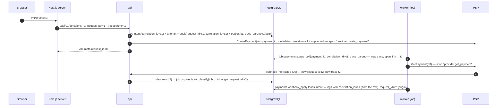

# Observability Architecture (Stage 2 design)

> **Status:** Stage 2 design. It refines [OBSERVABILITY.md](../OBSERVABILITY.md) (Stage 0 standard), which still
> applies. Where this document is more specific, it wins. Stage 3 implements logging, request and correlation
> IDs, health and readiness, the metrics skeleton and the tracing plumbing. Each later stage adds the metrics
> and alerts listed against it. Thresholds marked **[default]** are starting points to be tuned with data.

Related: [background-processing.md](background-processing.md) (job kinds, alert hooks) ·
[performance-capacity.md](performance-capacity.md) (latency budgets) · [SECURITY.md §15](../SECURITY.md) ·
[AUDIT.md](../AUDIT.md) · [incident-response-workflows.md](../compliance/incident-response-workflows.md) ·
[ledger-invariants.md](ledger-invariants.md) · [docs/security/](../security/) ·
[design-baseline.md](../stage-2/design-baseline.md)

---

## 1. Signals and what each is for

| Signal | Store | Contains | Never contains | Authoritative for |
|---|---|---|---|---|
| **Audit events** | `audit.audit_events`, `audit.security_audit_events` (append-only, hash-chained, DB tx with the change) | Who did what to which resource, why, with evidence refs | KYC values, documents, secrets (ADR-019) | Accountability. Legal retention (LR-012). |
| **Domain history** | `*_events` tables (`payment_events`, `payout_events` …) | State transitions with source and reason | Same as audit | Financial and state history |
| **Application logs** | Log pipeline (vendor TBD, LR-011) | Operational events, errors, allow-listed IDs | Anything on the §2.3 deny list | Nothing. Logs are never the only copy of anything. |
| **Metrics** | Prometheus-compatible TSDB | Aggregates with low-cardinality labels | IDs of people, campaigns or payments; amounts as labels | Alerting, capacity |
| **Traces** | OTLP backend (TBD) | Causality and latency, allow-listed attributes | SQL parameters, bodies, PII | Debugging latency |
| **Security events** | `app.security_events` (auth telemetry, high volume, shorter retention) | Login/OTP outcomes, device signals | OTP codes, passwords, tokens | Abuse detection input |

**Rule:** if an action must be accountable, it is an audit event written **in the same DB transaction** as the
change. A log line is never a substitute (OBSERVABILITY §1).

## 2. Structured logging (`internal/platform/log`)

### 2.1 Handler

- `log/slog` with the JSON handler (`LOG_FORMAT=json`) in every deployed environment, and the text handler locally.
- Wrapped by `log.RedactingHandler`, which (a) drops any attribute whose key is not on the allow-list
  (§2.2), (b) masks values of known-sensitive keys as defence in depth, and (c) truncates strings longer
  than 512 bytes and error chains longer than 2 KiB.
- Loggers are derived from the request or job context: `log.From(ctx)` returns a logger carrying the
  context fields (§2.2 "context" rows). Modules add `module` once at construction.
- A lint rule (Stage 3: `forbidigo` in golangci-lint) forbids `fmt.Print*`, `log.Print*`, `slog.Any` on
  request/response structs, and `%+v` of domain structs in log calls.

### 2.2 Field allow-list

| Field | Type | When | Source |
|---|---|---|---|
| `ts`, `level`, `msg` | — | always | `msg` is a stable constant string (`"payment status changed"`) |
| `service` | `fundzim-api` \| `fundzim-worker` \| `fundzim-web` \| `fundzimctl` | always | build |
| `env`, `version`, `commit` | string | always | build/config |
| `module` | baseline §2 module name | always (in module code) | constructor |
| `request_id` | string | HTTP context | middleware (§3) |
| `correlation_id` | UUID | business flows | domain record / job args |
| `trace_id`, `span_id` | hex | when tracing is on | OTel |
| `actor_type` | `user` \| `staff` \| `system` \| `provider` \| `anonymous` | authenticated / job | session / job |
| `actor_id` | UUID | authenticated | session. **Internal UUID only.** |
| `staff_role` | role code | staff actions | session |
| `http.method`, `http.route` (template), `http.status`, `duration_ms`, `bytes_out` | — | access log | middleware |
| `job_kind`, `job_id`, `queue`, `attempt` | — | jobs | River middleware |
| `event_type`, `event_id`, `consumer` | — | outbox | dispatcher/consumer |
| `payment_id`, `refund_id`, `payout_id`, `donation_id`, `campaign_id`, `organisation_id`, `ledger_transaction_id`, `inbox_id` | UUID | when relevant | domain |
| `provider`, `provider_reference`, `provider_transaction_id`, `provider_event_id`, `event_class` | string | provider calls / webhooks | adapter |
| `from_status`, `to_status`, `status_source`, `reason_code` | enum | transitions | domain |
| `amount_minor`, `currency` | string, ISO code | **always together**, money flows only | domain |
| `error_code` (UPPER_SNAKE), `error_class` (`TRANSIENT`, `PERMANENT`, `OUTCOME_UNKNOWN`, `NOT_SENT`, …), `error` (redacted chain) | — | errors | error mapper |
| `masked_msisdn` (`+26377****123`), `masked_account` (`****1234`) | string | only where ops need them | `platform/mask` helpers only |

Adding a field means changing the allow-list in code, which requires review by the security owner
(CODEOWNERS, Stage 3).

### 2.3 Deny list (never in logs, traces, metrics or error reports)

Passwords, OTP codes, magic-link/reset tokens, session tokens, CSRF tokens, cookies, `Authorization`
headers, API keys, webhook secrets and signatures, private/KMS/HMAC keys, card PAN/CVV/expiry/PIN, mobile-money
PIN, national ID/passport numbers, identity document images or extracted text, liveness media, full payout
account or wallet numbers, raw KYC vendor responses, raw webhook bodies, request/response bodies, SQL
parameter values, email addresses, phone numbers (unmasked), names, free-text campaign stories or medical
details, IP addresses beyond `/24` truncation in general logs (full IPs only in `security_events`, which has
its own retention and access) (SECURITY §15).

### 2.4 Redaction tests (Stage 3, extended per stage)

- A table test feeds every deny-list key (and common variants: `Password`, `x-api-key`, `national_id_number`)
  through the handler and asserts that the output contains neither the value nor the key's value pattern.
- Golden-log tests for the access log and job log lines.
- The config struct's `LogValue()` is asserted to emit `"[REDACTED]"` for every `secret`-tagged field.

## 3. Identifier propagation

### 3.1 Request ID and correlation ID

| ID | Created | Accepted from inbound? | Carried in |
|---|---|---|---|
| `request_id` | First middleware (UUIDv7) | `X-Request-ID` only if the peer is in `TRUSTED_PROXY_CIDRS` (which includes the Next.js server in deployed topologies) and it matches `^[A-Za-z0-9._-]{1,128}$` | Response header `X-Request-ID`, envelope `meta.request_id`, every log line, every audit event, job args (`origin_request_id`) |
| `correlation_id` | The service that **starts a business flow** (donation create, payout request, refund request, campaign submit). Stored on the aggregate row. | **Never** from clients. It is server-generated only. | Outbox events, job args, `payment_attempts`/`payout_attempts`, ledger transaction metadata, audit events, provider metadata field where the provider supports one (our reference only) |
| `trace_id` | OTel | `traceparent` from the Next.js server (trusted) is honoured for parenting. Browser-supplied `traceparent` is ignored for sampling (OBSERVABILITY §5). | Spans; `trace_parent` column on outbox rows; job args |

### 3.2 Propagation path

- Jobs start a **new trace** with a **span link** to the producer span (`trace_parent` from args or the outbox
  row). Queue delays can be hours, and one long trace would be misleading and unsampleable.
- Webhook processing obtains `correlation_id` from the **domain row it loads**, never from the payload.
- **Outbound to third parties:** `traceparent`/`baggage` headers are **stripped** from requests to PSPs, the
  KYC vendor and SMS/email providers. They receive only our business reference. This keeps internal topology
  and IDs private and avoids accidental baggage leaks.
- `fundzimctl` commands generate a `request_id` per invocation and record it in audit events.

### 3.3 Lookup guarantee

Given any one of `payment_id`, `payout_id`, `correlation_id`, `provider_transaction_id`, `provider_event_id` or
`request_id`, an operator can retrieve the chain (OBSERVABILITY §9). Domain tables index these. Logs are a
secondary aid.

## 4. Tracing (OpenTelemetry)

| Span | Name | Kind | Attributes (allow-list) |
|---|---|---|---|
| HTTP server | `HTTP {method} {route}` | server | `http.request.method`, `http.route`, `http.response.status_code`, `fundzim.request_id` |
| DB query | `db {sqlc query name}` (for example `db payments.GetIntentForUpdate`) | client | `db.system=postgresql`, `db.operation.name`, `db.collection.name` (table), `fundzim.db.pool` (`app`/`kyc`/`compliance`/`readonly`). **No `db.query.text` with parameters**: statement text is the static sqlc name only. |
| DB transaction | `tx {service method}` | internal | `fundzim.tx.isolation`, `fundzim.tx.retries` |
| Provider call | `provider.{operation}` (`provider.create_payment`, `provider.get_payout`) | client | `fundzim.provider`, `fundzim.provider.operation`, `fundzim.provider.outcome_class` (`ACCEPTED`/`REJECTED`/`NOT_SENT`/`OUTCOME_UNKNOWN`), `http.response.status_code`, `server.address` |
| Job | `job {kind}` | consumer | `fundzim.job.kind`, `fundzim.job.queue`, `fundzim.job.attempt`, `fundzim.correlation_id` |
| Outbox dispatch | `outbox.dispatch` | internal | `fundzim.outbox.batch_size` |
| Webhook ingest | `webhook.ingest` | server | `fundzim.provider`, `fundzim.webhook.result` (`stored`/`duplicate`/`rejected`), `fundzim.webhook.reason` |
| Ledger post | `ledger.post {rule}` | internal | `fundzim.ledger.rule`, `fundzim.ledger.entries`, `fundzim.currency` |
| Object storage | `storage {op}` | client | `fundzim.bucket_class` (`public-media`/`private-kyc`). **Never object keys for private-kyc.** |

- **Span attribute allow-list** is enforced by a custom `SpanProcessor` that drops attributes not on the list
  (defence in depth, the same idea as logs). Span **events** for errors carry `error_code`/`error_class`, never
  raw provider bodies.
- Payment, payout and refund **domain IDs** are allowed as span attributes (`fundzim.payment_id` …) because
  they are needed for lookup. They are **never** allowed as metric labels.
- **Sampling** (parent-based): 100 % for `/api/v1/webhooks/*`, payment/payout/refund/ledger routes and all
  jobs in queues `webhooks`, `payments`, `refunds`, `payouts`, `ledger`, `reconciliation`; 100 % for errors
  (tail rule in the collector); 5 % [default] for public page/API reads.
- Exporter is disabled when `OTEL_EXPORTER_OTLP_ENDPOINT` is empty. Locally, an optional Jaeger/OTel
  collector profile is available ([local-environment-design.md §2](../development/local-environment-design.md)).
- **Next.js server** uses the OTel SDK through the `instrumentation.ts` file convention (Next 16, see
  `apps/web/node_modules/next/dist/docs/` before implementing). It propagates `traceparent` to the API and
  never forwards browser-supplied trace headers unchanged.

## 5. Provider health and circuit breaker

Each adapter call goes through `psp.callGuard` (Stage 8):

| State | Entered when [default] | Effect |
|---|---|---|
| `CLOSED` | Normal | Calls flow |
| `OPEN` | ≥ 50 % of calls `OUTCOME_UNKNOWN`/5xx/timeout over ≥ 20 calls in 2 min, or 5 consecutive connect failures | **Collections:** new donations for that provider/method are refused with `PROVIDER_UNAVAILABLE` (donor offered other methods). **Status polls continue** at their normal schedule, because polling is how outcomes are resolved. **Payout submissions are held** at `APPROVED` (incident workflow §9). |
| `HALF_OPEN` | After 60 s in OPEN | 1 probe call per 10 s (`psp.provider_health_probe` uses a read-only operation). Success ×3 → CLOSED. |

The breaker never changes the state of an existing payment or payout. State is per process. A
`provider_health_events` row is written on every transition, which gives a durable timeline. The gauge
`fundzim_provider_circuit_state` feeds alerts.

## 6. Metrics catalogue

Exposed on the **internal** listener only (`METRICS_LISTEN_ADDR`; the worker uses `WORKER_METRICS_LISTEN_ADDR`,
proposal). Prefix `fundzim_`. Stage 0 names (`http_requests_total` …) map to the names below.

### 6.1 Label rules

- Allowed label values are **closed enums**: `route` (template), `method`, `status_class` (`2xx`…), `provider`
  (registry code), `method_type` (payment method), `currency` (ISO), `kind`, `queue`, `state`/`from`/`to`
  (state-machine enums), `reason` (enum), `result` (enum), `module`, `pool`, `consumer`, `scope`.
- **Never** user IDs, campaign IDs, payment IDs, emails, phones, IPs, amounts, provider references or raw
  error strings.
- Cardinality budget: ≤ 2 000 series per metric family, ≤ 50 000 total per process [default]. A Stage 3 unit
  test asserts that every registered metric declares its labels from the enum set. A runtime guard drops
  unknown label values into `other`.
- Amount metrics are **per currency only** and never summed across currencies (MONEY, ADR-018). Amount-valued
  gauges are emitted as integer minor units in a metric whose name ends in `_minor`.

### 6.2 Catalogue

| Metric | Type | Labels | Stage | Notes |
|---|---|---|---|---|
| `fundzim_http_requests_total` | counter | `route`, `method`, `status_class` | 3 | |
| `fundzim_http_request_duration_seconds` | histogram | `route`, `method` | 3 | Buckets 5 ms … 10 s |
| `fundzim_http_in_flight_requests` | gauge | — | 3 | |
| `fundzim_panics_recovered_total` | counter | `service` | 3 | Alert on > 0 |
| `fundzim_db_pool_acquired_conns` / `_idle_conns` / `_max_conns` | gauge | `pool` | 3 | From `pgxpool.Stat()` |
| `fundzim_db_pool_acquire_wait_seconds` | histogram | `pool` | 3 | Saturation signal |
| `fundzim_db_query_duration_seconds` | histogram | `module`, `query` (sqlc name, bounded set) | 3 | |
| `fundzim_db_tx_retries_total` | counter | `module`, `sqlstate` (`40001`, `40P01`, `55P03`) | 3 | |
| `fundzim_readiness_check_status` | gauge 0/1 | `check` | 3 | |
| `fundzim_schema_version_current` / `_expected` | gauge | — | 3 | goose version |
| `fundzim_jobs_total` | counter | `kind`, `queue`, `result` (`completed`, `retried`, `discarded`, `cancelled`, `snoozed`) | 3 | |
| `fundzim_job_duration_seconds` | histogram | `kind` | 3 | |
| `fundzim_queue_jobs` | gauge | `queue`, `state` | 3 | Periodic query on `queue.river_job` (every 30 s, leader only) |
| `fundzim_queue_oldest_available_age_seconds` | gauge | `queue` | 3 | Backlog |
| `fundzim_jobs_discarded_current` | gauge | `kind` | 3 | **DLQ size** (discarded within retention) |
| `fundzim_outbox_pending` | gauge | — | 3 | |
| `fundzim_outbox_oldest_pending_age_seconds` | gauge | — | 3 | **Outbox lag** |
| `fundzim_outbox_dead_events` | gauge | — | 3 | |
| `fundzim_event_deliveries_total` | counter | `consumer`, `result` | 3 | |
| `fundzim_idempotency_requests_total` | counter | `route`, `result` (`new`, `replayed`, `in_progress`, `key_reused`, `missing`) | 3 | |
| `fundzim_webhook_received_total` | counter | `provider`, `result` (`stored`, `duplicate`, `rejected`), `reason` | 8 | `reason` ∈ `signature`, `timestamp`, `size`, `parse` |
| `fundzim_webhook_inbox_rows` | gauge | `provider`, `status` | 8 | |
| `fundzim_webhook_inbox_oldest_unprocessed_age_seconds` | gauge | `provider` | 8 | **Webhook backlog** (status `RECEIVED`, `FAILED_RETRYING` or `DISPATCHED`) |
| `fundzim_webhook_processing_lag_seconds` | histogram | `provider`, `event_class` | 8 | received → processed |
| `fundzim_provider_requests_total` | counter | `provider`, `operation`, `outcome_class` | 8 | |
| `fundzim_provider_request_duration_seconds` | histogram | `provider`, `operation` | 8 | |
| `fundzim_provider_circuit_state` | gauge (0 closed, 1 half, 2 open) | `provider` | 8 | |
| `fundzim_payments_created_total` | counter | `provider`, `method_type`, `currency` | 8 | |
| `fundzim_payment_transitions_total` | counter | `from`, `to`, `source`, `provider` | 8 | |
| `fundzim_payments_in_state` | gauge | `state`, `provider`, `currency` | 8 | Non-terminal states only |
| `fundzim_payments_unknown_over_horizon` | gauge | `provider`, `currency` | 8 | `needs_reconciliation = true` |
| `fundzim_payments_pending_oldest_age_seconds` | gauge | `provider`, `method_type` | 8 | |
| `fundzim_refunds_in_state` | gauge | `state`, `provider`, `currency` | 8 | |
| `fundzim_ledger_transactions_posted_total` | counter | `rule`, `currency` | 10 | |
| `fundzim_ledger_post_failures_total` | counter | `rule`, `reason` (`unbalanced`, `insufficient`, `duplicate`, `other`) | 10 | `unbalanced` > 0 → investigate |
| `fundzim_ledger_invariant_run_status` | gauge (1 pass, 0 fail) | `scope` (`L9`, `L10`, `SC2`), `currency`, `provider` (SC2 only) | 10/11 | |
| `fundzim_ledger_invariant_last_success_timestamp` | gauge | `scope`, `currency` | 10 | Staleness |
| `fundzim_ledger_projection_lock_wait_seconds` | histogram | `account_class` (`campaign_unsettled`, `psp_clearing`, …) | 10 | Hot-row signal ([performance-capacity.md §6](performance-capacity.md)) |
| `fundzim_payouts_requested_total` / `_completed_total` / `_failed_total` | counter | `provider`, `currency` | 11 | |
| `fundzim_payouts_in_state` | gauge | `state`, `provider`, `currency` | 11 | |
| `fundzim_payouts_unknown_over_horizon` | gauge | `provider`, `currency` | 11 | |
| `fundzim_payout_approval_queue_oldest_age_seconds` | gauge | — | 11 | |
| `fundzim_payout_gate_blocked_total` | counter | `reason` (`ec19_pool_integrity`, `provider_hold`, `l9_failed_or_stale`, `kill_switch`, `eligibility`) | 11 | |
| `fundzim_recon_runs_total` | counter | `source`, `result` | 17 | |
| `fundzim_recon_discrepancies_open` | gauge | `source`, `type`, `currency` | 17 | |
| `fundzim_recon_discrepancy_oldest_age_seconds` | gauge | `source`, `currency` | 17 | |
| `fundzim_recon_discrepancy_amount_minor` | gauge | `source`, `currency` | 17 | Absolute sum per currency |
| `fundzim_auth_login_attempts_total` | counter | `result`, `factor` | 4 | |
| `fundzim_auth_otp_sent_total` | counter | `channel`, `country_prefix` (allow-listed enum of dialling codes + `other`) | 4 | SMS pumping |
| `fundzim_auth_otp_verify_total` | counter | `result` (`ok`, `wrong`, `expired`, `locked`) | 4 | |
| `fundzim_rate_limit_hits_total` | counter | `policy`, `backend` (`redis`, `local`) | 3/4 | |
| `fundzim_authz_denials_total` | counter | `route`, `reason` (`unauthenticated`, `forbidden`, `not_found_masked`) | 4 | IDOR probing |
| `fundzim_kyc_document_access_total` | counter | `staff_role`, `purpose` | 5 | Per-staff spikes are detected from `security_audit_events` (§8), not from labels |
| `fundzim_breakglass_activations_total` | counter | — | 14 | |
| `fundzim_uploads_total` | counter | `bucket_class`, `result` (`clean`, `infected`, `rejected_type`, `error`) | 5/6 | |
| `fundzim_upload_quarantine_oldest_age_seconds` | gauge | `bucket_class` | 5/6 | |
| `fundzim_notifications_total` | counter | `channel`, `template`, `result` | 15 | |
| `fundzim_screening_backlog` | gauge | — | 13 | |
| `fundzim_redis_available` | gauge 0/1 | — | 3 | Degraded, not down |

Domain gauges (`*_in_state`, backlog ages) are computed by a leader-only collector every 30 s [default]
using indexed `count(*) … WHERE status IN (non-terminal)` queries. They are never computed per scrape.

## 7. Health and readiness

| Endpoint | Listener | Process | Checks | Response |
|---|---|---|---|---|
| `GET /healthz` | main (`API_LISTEN_ADDR`) and internal | api, worker (internal only) | None (process alive, event loop responsive) | `200 {"status":"ok"}` |
| `GET /readyz` | main and internal | api | (1) `app` pool `SELECT 1` ≤ 1 s; (2) **schema current**: goose version table max applied version == version embedded at build (`migrations.ExpectedVersion`); (3) **queue reachable**: River migration table present at the expected version and `SELECT 1 FROM queue.river_job LIMIT 1` permitted; (4) `kyc` and `compliance` pools `SELECT 1`; (5) config validated at boot (static) | `200 {"status":"ready"}` or `503 {"status":"not_ready"}`. **No detail on the main listener.** |
| `GET /readyz` | internal | worker | (1)–(4) as the api, using the `fundzim_worker` pool for (1), plus (6) River client started and producers running | same |
| `GET /internal/health` | internal only | both | Per-check status, latency, schema versions (current/expected), Redis status (`ok`/`degraded`/`disabled`), build version | JSON, detailed |

- **Redis is not a readiness check.** If it is unavailable, readiness stays `ready`, the internal report says
  `degraded`, `fundzim_redis_available = 0`, and rate limiting uses the local fallback (ARCHITECTURE §8.2, F15).
- Checks are cached for 2 s [default] so load-balancer probes cannot hammer the DB.
- A schema **ahead** of the binary (expand/contract window) is ready if the binary's expected version ≤ current
  and the gap only contains migrations tagged backward-compatible. Stage 3 starts with strict equality. The
  relaxation comes with the first expand/contract migration ([migration-strategy.md](../database/migration-strategy.md)).
- The reverse proxy does not route `/healthz`/`/readyz` from the internet (deploy config, Stage 18).
- Distroless images have no `curl`. Container health checks therefore use `fundzimctl health --url
  http://127.0.0.1:8080/readyz` ([local-environment-design.md §4](../development/local-environment-design.md)).

## 8. Alerts catalogue

Severity follows SECURITY §22 and [incident-response-workflows.md §1](../compliance/incident-response-workflows.md):
**SEV1** = page immediately, **SEV2** = page (business hours pre-pilot; 24/7 for financial events once in
pilot), **SEV3** = ticket. Every alert has a runbook (`docs/runbooks/<alert-id>.md`, written with the feature,
part of the Definition of Done). Thresholds are **[default]**.

### 8.1 Financial integrity (stop-the-line)

| ID | Alert | Condition | Sev | Automatic containment | Playbook |
|---|---|---|---|---|---|
| ALR-L01 | Ledger global imbalance (L9) or per-transaction imbalance detected (L1) | `fundzim_ledger_invariant_run_status{scope="L9"} == 0`, or any verification finding of an unbalanced transaction | **SEV1** | Payout gate fails closed for all providers (background-processing §6.6) | §11 Ledger imbalance |
| ALR-L02 | Projection ≠ recompute (L10) | `…{scope="L10"} == 0` | **SEV1** | Payout gate fails closed for the affected currency | §11 |
| ALR-L03 | Pool integrity breach (SC-2, scheduled run or live EC-19 check) **or** SC-2 run stale | `…{scope="SC2"} == 0`; or `time() − fundzim_ledger_invariant_last_success_timestamp{scope="SC2"} > 26h` | **SEV1** (breach) / SEV2 (stale) | `risk` places a `PROVIDER_HOLD` for the provider/currency, so automated payouts stop | §11, refund-and-reversal-flows §7 |
| ALR-L04 | Ledger guard rejected an unbalanced posting | `increase(fundzim_ledger_post_failures_total{reason="unbalanced"}[5m]) > 0` | SEV2 (the DB guard worked, but code is wrong) | None. The posting failed atomically. | §11 (investigate) |
| ALR-L05 | Negative payable detected (L8) | Invariant run finding | **SEV1** | Payout gate closed for the campaign's currency | §11 |
| ALR-L06 | Invariant run missing | No L9/L10 success in 26 h | SEV2 | Payout gate closed after 26 h | — |
| ALR-PO4 | Payout completion after FAILED (late completion) | Domain event `payout.late_completion` | **SEV1** | Payout hold on campaign | §6 Unauthorised payout / §8 Duplicate |
| ALR-R02 | Reconciliation amount discrepancy above threshold | `fundzim_recon_discrepancy_amount_minor{currency} > T_currency` (T is a configured INTERNAL_RISK limit per currency, never summed across currencies) | **SEV1** above T, SEV2 below | — | §7 Missing settlement |
| ALR-R05 | Double-matched or unmatched disbursement line | Recon finding type `PAYOUT_UNMATCHED`/`PAYOUT_DOUBLE_MATCH` | **SEV1** | Per-provider payout freeze (manual, Stage 14) | §6 / §8 |

### 8.2 Provider, payment and payout health

| ID | Alert | Condition | Sev |
|---|---|---|---|
| ALR-P01 | Pending payments ageing | `fundzim_payments_pending_oldest_age_seconds{provider,method_type} > SLA` (SLA = PCR-010 window; default 30 min) | SEV2 |
| ALR-P02 | Payments UNKNOWN beyond horizon | `fundzim_payments_unknown_over_horizon > 0` for 15 min | SEV2 (SEV1 if > 20 [default] for one provider) |
| ALR-P03 | Provider outage: error/latency | `outcome_class` in (`OUTCOME_UNKNOWN`,`NOT_SENT`) ratio > 20 % over 10 min, **or** p95 latency > 3× 7-day baseline, **or** `fundzim_provider_circuit_state == 2` for 2 min | SEV2 (SEV1 if payouts are UNKNOWN at scale, incident §9) |
| ALR-P04 | UNKNOWN spike | `increase(fundzim_payment_transitions_total{to="UNKNOWN"}[10m]) > 10` per provider | SEV2 |
| ALR-PO1 | Payout failure rate | `failed / (completed + failed) > 10 %` over 1 h with ≥ 5 payouts, per provider/currency | SEV2 |
| ALR-PO2 | Payouts UNKNOWN beyond horizon | `fundzim_payouts_unknown_over_horizon > 0` | **SEV2 paging** (SEV1 if > 3) |
| ALR-PO3 | Payout not-sent retries exhausted | Domain event | SEV2 |
| ALR-PO5 | Approval queue ageing | `fundzim_payout_approval_queue_oldest_age_seconds > 24h` | SEV3 |
| ALR-R01 | Reconciliation discrepancy count/age | `fundzim_recon_discrepancies_open > 0` with oldest age > 48 h (per source/currency) | SEV2 |
| ALR-R03 | Statement import failed or missing | Import `FAILED_PARSE`, or no import for a source within its expected cadence + 24 h | SEV2 |
| ALR-R04 | Missing settlement | Captured payments older than the provider settlement window without a settlement match | SEV2 (SEV1 above amount threshold) |

### 8.3 Pipelines

| ID | Alert | Condition | Sev |
|---|---|---|---|
| ALR-W01 | Webhook backlog | `fundzim_webhook_inbox_oldest_unprocessed_age_seconds > 120` for 5 min | SEV2 |
| ALR-W02 | Webhook dead-lettered | Inbox rows `DEAD_LETTERED` > 0 | SEV2; **SEV1** if the class is PAYOUT, or a PAYMENT success older than 30 min (incident §10) |
| ALR-W03 | Unknown provider event type | An event type not in the adapter's known list (stored as `OTHER` with processing status `UNRECOGNISED`) | SEV3 (SEV2 for live providers) |
| ALR-W04 | Parked webhook past deadline | Inbox `PARKED` rows with `park_deadline_at < now()` | SEV2 |
| ALR-W05 | Signature failure spike | `rate(fundzim_webhook_received_total{result="rejected",reason="signature"}[5m])` > 5× 1-day baseline and > 10 | SEV2 (possible forgery or rotation mismatch) |
| ALR-W06 | Webhook silence | No stored webhooks for a provider for 1 h while payments to it were created | SEV2 |
| ALR-Q01 | Job backlog | `fundzim_queue_oldest_available_age_seconds{queue} > threshold` (webhooks 120 s, payments/payouts/refunds 300 s, events 300 s, others 3 600 s) | SEV2 (SEV3 for maintenance/media) |
| ALR-Q02 | **DLQ non-empty** | `fundzim_jobs_discarded_current{kind} > 0` | SEV2 for financial kinds (`payments.*`, `payouts.*`, `psp.*`, `ledger.*`, `reconciliation.*`, financial consumers); SEV3 otherwise |
| ALR-Q03 | Outbox lag | `fundzim_outbox_oldest_pending_age_seconds > 60` for 5 min, or `fundzim_outbox_dead_events > 0` | SEV2 |
| ALR-Q04 | Stuck idempotent request | `IN_PROGRESS` idempotency rows older than 1 h | SEV3 |
| ALR-U01 | Malware scanner failing or quarantine ageing | Scan `ERROR` > 0, or quarantine oldest age > 30 min | SEV3 (SEV2 if KYC uploads are blocked > 4 h) |
| ALR-N01 | Notification failures | Failure ratio > 20 % over 30 min per channel | SEV3 (SEV2 for security notifications) |
| ALR-C01 | Screening backlog/failure | Screening jobs discarded, or backlog older than 24 h | SEV2 (payouts fail closed meanwhile) |

### 8.4 Security and abuse

| ID | Alert | Condition | Sev |
|---|---|---|---|
| ALR-A01 | OTP verification failure spike | `wrong+locked` rate > 5× baseline over 10 min | SEV2 |
| ALR-A02 | SMS pumping | `fundzim_auth_otp_sent_total{country_prefix}` > budget per prefix per hour, or any send to a non-allow-listed prefix | SEV2 (auto: prefix sends throttled by the rate-limit policy) |
| ALR-A03 | Credential stuffing | Login failures > 5× baseline across > 50 distinct IP /24s in 10 min | SEV2 |
| ALR-A04 | Authorisation denial spike (IDOR probing) | `fundzim_authz_denials_total{reason="not_found_masked"}` > 5× baseline | SEV2 |
| ALR-A05 | Break-glass activation | Any | SEV2 (notify compliance) |
| ALR-K01 | KYC document access spike | Per staff member, document views from `audit.security_audit_events` > 3× their 30-day p95 per day, or > 50/day [default], or access outside an assigned case | SEV2 (notify compliance). Computed by a scheduled query, not by metric labels. |
| ALR-K02 | KYC bulk access attempt | > 10 presigned URL issuances by one staff member in 5 min | SEV2 |

### 8.5 Availability

| ID | Alert | Condition | Sev |
|---|---|---|---|
| ALR-S01 | Not ready | `/readyz` failing on all instances for 2 min | SEV1 |
| ALR-S02 | 5xx rate | > 2 % of requests for 5 min (excluding `/api/v1/webhooks/*` 401s) | SEV2 (SEV1 if > 10 %) |
| ALR-S03 | Latency budget breach | p95 above the budgets in [performance-capacity.md §4](performance-capacity.md) for 15 min | SEV3 (SEV2 for donation create/webhook ingest) |
| ALR-S04 | DB pool saturation | `acquire_wait p95 > 100 ms` for 10 min | SEV2 |
| ALR-S05 | Backups | Backup failed, or restore drill overdue | SEV2 |
| ALR-S06 | Panics | `increase(fundzim_panics_recovered_total[10m]) > 0` | SEV3 |

## 9. Dashboards

| Dashboard | Audience | Panels |
|---|---|---|
| **Financial integrity** | FINANCE + on-call | Invariant run status per scope/currency, last success, payout gate blocks, SC-2 per provider/currency, recon discrepancies (count/age/amount per currency), late completions |
| **Payments** | On-call | Creates by provider/method/currency, transitions, non-terminal states, UNKNOWN over horizon, pending age, provider outcome classes, circuit state |
| **Payouts** | FINANCE | Requests, approvals queue age, in-state counts, UNKNOWN, failure rate, gate blocks |
| **Webhooks & queues** | On-call | Received/stored/rejected, inbox backlog age, processing lag, queue depth and oldest age per queue, discarded per kind, outbox lag |
| **Provider health** | On-call | Latency p50/p95/p99, error classes, circuit state timeline (from `provider_health_events`) |
| **API RED** | Engineering | Rate, errors, duration per route, in-flight, panics |
| **Database** | Engineering | Pool usage/wait per pool, query latency by sqlc name, tx retries by SQLSTATE, projection lock wait by account class, replication lag (later) |
| **Security & abuse** | Security owner | Login/OTP outcomes, OTP sends by prefix, rate-limit hits, authz denials, break-glass, KYC access (aggregated, no names) |
| **Uploads & media** | Engineering | Scan results, quarantine age, re-encode durations |
| **Capacity** | Engineering | Donations/min, checkout concurrency (Little's law estimate), hot-campaign indicators ([performance-capacity.md §6](performance-capacity.md)) |

Dashboards display money per currency only, never a cross-currency total.

## 10. Error reporting

As OBSERVABILITY §7. In addition, the Go reporter receives only the error chain after redaction, the
`error_code`, the route template and allow-listed IDs. Breadcrumbs are disabled for HTTP client calls to
providers. `ERROR_REPORTING_DSN` empty = disabled.

## 11. Concerns

| # | Concern | Handling |
|---|---|---|
| OBC-1 | Stage 0 metric names lack a prefix | Superseded by §6 names. OBSERVABILITY.md should point here (doc update proposed, not done in this change). |
| OBC-2 | `WORKER_METRICS_LISTEN_ADDR` and other new variables are not in `.env.example` | Proposed in [local-environment-design.md §5](../development/local-environment-design.md). Stage 3 adds them. |
| OBC-3 | Per-staff KYC access detection needs `security_audit_events` to record `actor_id` + document class | Requirement on the audit schema ([schema-overview.md](../database/schema-overview.md)) |
| OBC-4 | Telemetry vendor hosting location | LR-011, unchanged |
| OBC-5 | The goose version table name/schema must be readable by `fundzim_app` for `/readyz` | Proposal: `app.goose_db_version` with `GRANT SELECT` to `fundzim_app`. [migration-strategy.md](../database/migration-strategy.md) decides. |
