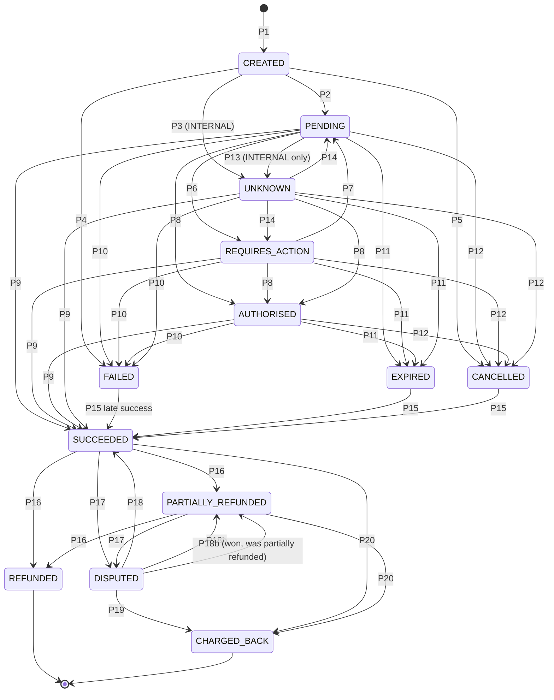
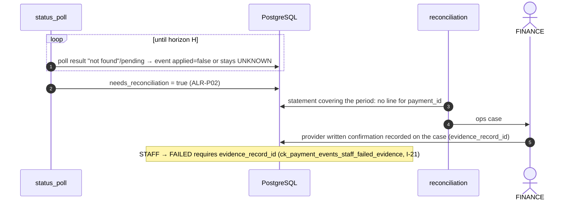
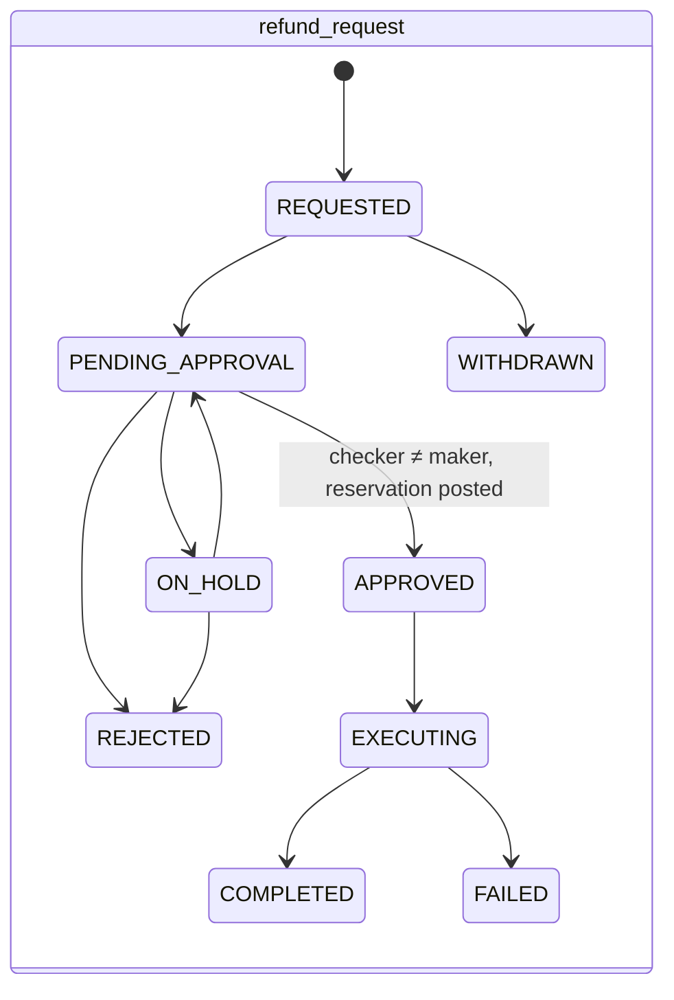
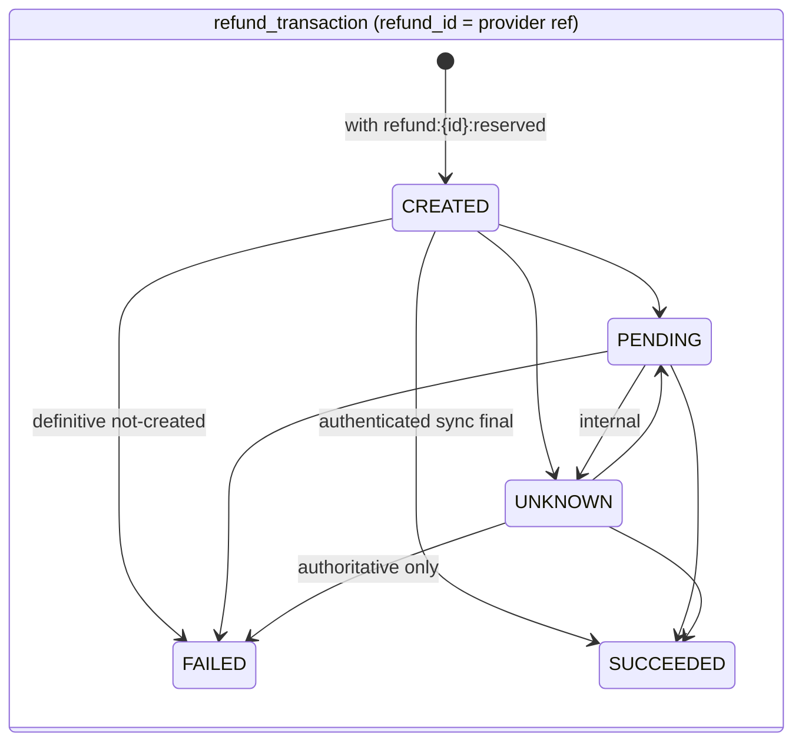

# Payment State Machine (intent, provider transaction, refunds, disputes)

> **Status:** Stage 2 design. Nothing here is implemented (payments abstraction: Stage 8; ledger: Stage 10).
> Authoritative behaviour: [transaction-lifecycle.md](../payments/transaction-lifecycle.md) (P1–P20, ranks,
> Flow 6), [refund-and-dispute-architecture.md](../payments/refund-and-dispute-architecture.md), ADR-020, ADR-024
> (baseline §8). This document turns them into an implementable design and maps every rule to its database
> enforcement in [`0015_payments.sql`](../../design/sql/0015_payments.sql) (schema:
> [payment-schema.md](../database/payment-schema.md)).

Related: [payment-provider-interfaces.md](payment-provider-interfaces.md) ·
[background-processing.md](background-processing.md) (jobs `psp.webhook_dispatch`, `payments.webhook_apply`,
`payments.status_poll`) · [payout-state-machine.md](payout-state-machine.md) ·
[settlement-and-custody-model.md](../ledger/settlement-and-custody-model.md) (posting keys).

---

## 1. Two records, two meanings

| | `payment_intents` (the **payment**) | `payment_transactions` (the **provider transaction**) |
|---|---|---|
| Meaning | FundZim's canonical view: what we accept as true about the donor's payment | The latest authoritative observation of the provider's own transaction |
| Status | `status` — 13 canonical states, **guarded** by `app.guard_transition('payment_intent')` | `mapped_status` (same vocabulary) + `raw_status` **verbatim** — **not** guarded |
| Moves when | `payments.applyEvent` decides (rank **and** edge) | Every authoritative observation (webhook, poll, recon, authenticated sync response) |
| May contradict? | Never contradicts its own history | Yes — e.g. provider reports `FAILED` after `SUCCEEDED`: recorded on the transaction and in `payment_events` (`applied=false`, `ANOMALY`), intent unchanged, alert |
| Ledger | Transitions post journals (T1/T2 on → SUCCEEDED) | Never posts |

Why separate (ADR-024): the provider's vocabulary and its anomalies must be kept without letting them corrupt the
canonical state that drives the ledger. A provider status the adapter cannot map is never guessed: it maps to
`UNKNOWN` and raises an alert; the inbox row is kept as `UNRECOGNISED` if the event type itself is unknown.

## 2. Canonical states and why there is no `PROCESSING`

States (baseline §8): `CREATED, PENDING, REQUIRES_ACTION, AUTHORISED, UNKNOWN, SUCCEEDED, FAILED, EXPIRED, CANCELLED,
PARTIALLY_REFUNDED, REFUNDED, DISPUTED, CHARGED_BACK`.

**The Stage 2 brief's `PROCESSING` payment state is mapped to `PENDING`.** "Provider acknowledged, outcome not
final" is exactly `PENDING` (ADR-020); when the donor must act it is `REQUIRES_ACTION`. A synonym would give two
names to one meaning, split queries and metrics ("show pending payments" would silently miss half) and add rank
ambiguity. Adapters therefore map provider values such as `processing`, `initiated`, `sent` to `PENDING`.
`PROCESSING` exists for **payouts** only.



The 42 edges (P1–P20 plus P18b, ADR-024) are exactly the `app.status_transitions` rows for machine `payment_intent`. The Go edge list in
`internal/payments` must be **identical** (a Stage 8 test diffs them). `PARTIALLY_REFUNDED → PARTIALLY_REFUNDED`
is a self-update (status unchanged, the guard returns early) and is recorded as an event.

## 3. Rules and where each is enforced

| Rule | Application (`payments.applyEvent`) | Database |
|---|---|---|
| Only graph edges | Edge table lookup | `trg_payment_intents_guard_status` |
| Rank higher **and** edge (except listed exceptions) | Rank compare via `app.payment_status_rank` | `ck_payment_intents_status_rank` keeps rank = status |
| SUCCEEDED only from authoritative sources (never redirect/client) | Source check; browser input never reaches `applyEvent` | `ck_payment_events_success_source` |
| UNKNOWN only from our own indeterminate call | Source check | `ck_payment_events_unknown_internal` |
| Timeout never FAILED | Adapter classification (§6) | `ck_payment_events_failed_source` (I-21): FAILED only from WEBHOOK/POLL/RECON/SYNC, INTERNAL from CREATED, or STAFF with provider evidence |
| Transition + event (+ ledger) in one transaction | One DB tx | Deferred `trg_payment_intents_require_event` |
| Amount, currency, campaign, method fixed | Immutable domain object | `trg_payment_intents_immutable` |
| Bound to provider once a request may have reached it | Router | same trigger (checks `payment_attempts`) |
| Never route to MERCHANT_SETTLEMENT / unverified | Router (`psp.Registry`) | Composite FK `fk_payment_intents_capability` + checks |
| Over-refund impossible | Refundable computation | `trg_refund_requests_check_refundable`, `trg_refund_transactions_check` |

### 3.1 `applyEvent` algorithm (one function for every source)

```text
applyEvent(tx, paymentID, ev{target, source, raw_status, provider_event_id, inbox_id, occurred_at}):
  p := SELECT … FROM payment_intents WHERE id = paymentID FOR UPDATE          -- serialises webhook vs poll
  upsert payment_transactions (raw_status verbatim, mapped_status = ev.target)
  if ev is a duplicate (same provider_event_id already applied)       → record applied=false DUPLICATE; return
  if edge(p.status, ev.target) and (rank(ev.target) > rank(p.status) or exception(p.status, ev.target, source)):
        INSERT payment_events(applied=true, …); UPDATE payment_intents(status, rank, version+1, …)
        if ev.target = SUCCEEDED: ledger.Post(T1 'payment:{id}:capture', T2 'payment:{id}:psp_fee') in tx
        if P15 late success: outbox(payment.late_success) + risk signal
        outbox(payment.status_changed); release parked events for this payment (§5)
  elif prerequisite not reached (refund/dispute/chargeback before SUCCEEDED):
        INSERT payment_events(applied=false, PARKED); psp.Inbox.Park(inbox_id, paymentID, 'SUCCEEDED')
  elif rank(ev.target) <= rank(p.status):   INSERT payment_events(applied=false, LOWER_RANK)
  else:                                       INSERT payment_events(applied=false, ANOMALY); alert
```

Exceptions (lower-or-equal rank moves): `PENDING → UNKNOWN` (INTERNAL only), `REQUIRES_ACTION → PENDING`,
`DISPUTED → SUCCEEDED`, `DISPUTED → PARTIALLY_REFUNDED` (P18b, when refunds preceded the dispute),
`PARTIALLY_REFUNDED → PARTIALLY_REFUNDED`. A synchronous provider answer that implies
several steps (e.g. `CREATED` and the response says "action required") is applied as successive edges in the same
transaction (`CREATED → PENDING → REQUIRES_ACTION`), each with its own event.

## 4. Mapping provider states without losing raw events

Each adapter owns a **versioned mapping table** (Go constant, `mapping_version` e.g. `sandbox-map-v1`) from
`(event_type_raw | status_raw)` to a canonical target. The adapter returns **both**:

```go
type ProviderObservation struct {
    RawStatus      string            // verbatim, stored in payment_transactions.raw_status and payment_events.raw_status
    Canonical      payments.Status   // mapped, or StatusUnknown if unmapped
    MappingVersion string
    Mapped         bool              // false ⇒ alert ALR-W03 / unmapped-status metric
    ProviderRef    string
    OccurredAt     *time.Time
    Amount         *money.Money      // as reported (mismatch ⇒ ANOMALY, never applied as SUCCEEDED)
    Fee            *money.Money
}
```

Nothing is lost: the inbox row keeps the redacted payload and the hash of the exact verified bytes;
`payment_transactions` keeps the latest raw status; `payment_events` keeps **every** observation (applied or not)
with `raw_status`, `inbox_event_id` and `provider_event_id`. A reported amount or currency that differs from the
intent is an anomaly: recorded, not applied, alerted (amount mismatch is a reconciliation case).

## 5. Out-of-order events and parking

| Situation | Handling |
|---|---|
| Lower-rank event after a higher state (e.g. `pending` after SUCCEEDED) | `applied=false, LOWER_RANK`; inbox `PROCESSED` |
| Higher-rank event whose prerequisite is not reached (e.g. `refunded`/`disputed` while PENDING/UNKNOWN) | `applied=false, PARKED`; inbox `PARKED` with `parked_subject_id`, `parked_until_status = SUCCEEDED`, `park_deadline_at` (72 h [default], per provider limit) |
| Payment reaches the prerequisite | In the same transaction, parked inbox rows for the payment are re-dispatched (`PARKED → DISPATCHED`) in `provider_occurred_at`, then `provider_event_id`, then receipt order |
| Parked past deadline | Stays `PARKED`, SEV2 reconciliation case, ALR-W04. **Never discarded** |
| Non-edge from a higher state (e.g. SUCCEEDED → FAILED) | `applied=false, ANOMALY`, reconciliation anomaly alert |

## 6. UNKNOWN: entry and resolution

Entry is always **our own** call: `CreatePayment`/`Cancel`/`Capture` returned `ErrOutcomeUnknown`
(`TIMEOUT, CONN_RESET_AFTER_SEND, HTTP_5XX, MALFORMED_RESPONSE, SIGNATURE_INVALID_RESPONSE`) or the process
crashed after the attempt row was committed but before the result was recorded (`CRASH_DURING_CREATE`, set by the
in-flight attempt sweeper). Resolution follows transaction-lifecycle §7.3: poll by `payment_id` with backoff up to
horizon `H` (PROVIDER limit, PCR-010; unconfigured ⇒ 72 h default flagged), re-create only if the capability says
`idempotent_create` (PCR-009) and always with the same reference, then `needs_reconciliation`, then statement
matching, then FINANCE review with provider written evidence. **Note (I-21, amended):** the database accepts payment
`FAILED` only from `WEBHOOK/POLL/RECON/SYNC`, `INTERNAL` from `CREATED`, or `STAFF` with a provider-evidence
record (FINANCE, maker-checker, as transaction-lifecycle §7.3 step 6 requires). A `SYSTEM`/timeout handler can
never write FAILED.

```mermaid
sequenceDiagram
    autonumber
    participant API as payments (API)
    participant DB as PostgreSQL
    participant A as psp adapter
    participant P as PSP
    participant J as payments.status_poll
    participant W as webhook pipeline
    API->>DB: tx1: INSERT intent CREATED + event P1 + attempt(CREATE, IN_FLIGHT); COMMIT
    API->>A: CreatePayment(ref = payment_id)
    A->>P: HTTPS request written
    Note over A,P: timeout after write
    A-->>API: ErrOutcomeUnknown(TIMEOUT)
    API->>DB: tx2: attempt → OUTCOME_UNKNOWN; intent CREATED → UNKNOWN (INTERNAL); enqueue poll (InsertTx); COMMIT
    par poll and webhook race
        J->>A: GetPayment(payment_id)
        A->>P: status query
        P-->>A: paid
        J->>DB: tx: lock intent; UNKNOWN → SUCCEEDED (POLL); T1+T2; events; COMMIT
    and
        P->>W: webhook "paid" (verified, inbox dedupe)
        W->>DB: tx: lock intent (waits); already SUCCEEDED → event applied=false LOWER_RANK; ledger keys unique
    end
```



## 7. Webhook ingestion pipeline (idempotent)

1. `POST /api/v1/webhooks/{provider}`: size/content-type limits, read raw bytes.
2. `ProviderWebhookVerifier.Verify` (signature with current then previous secret ref, replay window). Failure →
   401, metric, **nothing stored** (ALR-W05 on spikes).
3. `ParseWebhook` → `provider_event_id`, `event_class`, `event_type_raw`, references.
4. One transaction: `INSERT provider_webhook_inbox … ON CONFLICT (provider_id, provider_event_id) DO NOTHING`
   plus `InsertTx(psp.webhook_dispatch)`. Duplicate ⇒ 2xx, no job.
5. Respond 2xx.
6. `psp.webhook_dispatch`: lock row; `RECEIVED → DISPATCHED`; route by `event_class` to `payments.webhook_apply`
   or `payouts.webhook_apply`. Unknown class/type → `UNRECOGNISED` + ALR-W03 (kept, re-dispatchable).
   Unsigned providers: an authenticated status query is made **before** applying, and its result (not the
   payload) is the source of truth.
7. `payments.webhook_apply`: one transaction: `applyEvent` + ledger + outbox; then `psp.Inbox.MarkProcessed`
   (through the psp interface, same transaction).
8. Transient failure → `FAILED_RETRYING` with backoff; exhausted → `DEAD_LETTERED` (ALR-W02); staff re-queue only.

Replay safety comes from three layers: replay window, `uq_provider_webhook_inbox_event`, and precedence (a replayed
event is a lower-rank/duplicate no-op). Ledger keys make a double posting impossible even if a lock were bypassed.

## 8. Refund request, refund transaction and dispute machines





Baseline §8 refund-transaction states (`CREATED, PENDING, UNKNOWN, SUCCEEDED, FAILED`) replace the Stage 1 list
(`APPROVED, SUBMITTED, PROCESSING, …, CANCELLED`): `CREATED` = approved and reserved, not yet acknowledged;
`PENDING` = provider acknowledged. A refund in UNKNOWN is resubmitted only with the same `refund_id` and only if
the capability says `idempotent_refund` (PCR-006); otherwise poll only.

| Refund event | Journal (key) | Payment effect |
|---|---|---|
| Request → APPROVED (+ transaction CREATED) | `refund:{id}:reserved` (REFUND_RESERVED) | none |
| Transaction → SUCCEEDED | `refund:{id}:settled` | → PARTIALLY_REFUNDED / REFUNDED (P16) |
| Transaction → FAILED | `refund:{id}:failed` (exact inverse) | none; request → FAILED |

Dispute machine (`payment_dispute`): `OPENED → EVIDENCE_REQUIRED | ACCEPTED (maker-checker) | LOST`;
`EVIDENCE_REQUIRED → EVIDENCE_SUBMITTED | EXPIRED`; `EVIDENCE_SUBMITTED → UNDER_PROVIDER_REVIEW → WON | LOST`.
`ACCEPTED, EXPIRED, LOST` ⇒ a `chargebacks` row and payment `CHARGED_BACK` (P19); `WON` ⇒ payment `SUCCEEDED`
(P18) or `PARTIALLY_REFUNDED` (P18b) and `dispute:{id}:won`. Journals: `dispute:{id}:opened|held|released|won|lost|funding`,
`reversal:{payment_id}:{provider_event_id}` (provider reversal, P20). A lost dispute that leaves a shortfall emits
`payment.dispute_shortfall` through the outbox; `payouts` opens the recovery case (payments never imports payouts).

## 9. Donor retries and duplicate payments (baseline §12 I-7)

A retry is always a **new** payment with a new `payment_id`. While the same donor (user id, or guest contact
fingerprint) has a payment for the same campaign and amount in `UNKNOWN`, `POST /api/v1/donations` returns
**`409 PAYMENT_OUTCOME_UNKNOWN`** with the message "We're confirming your earlier payment — please don't pay
again". The donor may override explicitly only after a configurable delay (INTERNAL_RISK limit
`payment.unknown_retry_delay`, unconfigured ⇒ no override offered); the new intent then records
`possible_duplicate_of`. In `PENDING`/`REQUIRES_ACTION` the UI warns but does not block. If both succeed, the
duplicate-payment refund rule applies (refund-and-reversal-flows §3.1). This guard is an application rule (it reads
donor identity across intents); the database backstop is the per-request idempotency unique.

## 10. Ledger effects summary

| Transition | Journal key | Rule |
|---|---|---|
| → SUCCEEDED (P9, P15) | `payment:{id}:capture`, `payment:{id}:psp_fee` | DONATION_CAPTURED, PSP_FEE |
| (settlement) | `settlement:{batch}:{payment_id}` | SETTLEMENT_MATCHED (reconciliation) |
| (release) | `payment:{id}:release` | RELEASE / RELEASE_WITH_RESERVE |
| Everything else before SUCCEEDED | none | — |

## 11. Test requirements

Implemented as DB invariants in `payments_test.sql` (see [payment-schema.md §8](../database/payment-schema.md)).
Stage 8 adds, against the sandbox provider: every edge reachable and every non-edge rejected **in Go and SQL**
(edge lists diffed); property test "no code path maps a timeout to FAILED"; UNKNOWN resolved via poll, webhook
and recon each posting T1/T2 exactly once; webhook/poll race (real PostgreSQL, two sessions); parked
`refunded` before `paid` applied in order; late success ⇒ posting + risk signal; SUCCEEDED → FAILED event ⇒
anomaly; "not found" with and without documented finality; unmapped raw status ⇒ UNKNOWN + alert; second payment while one is UNKNOWN ⇒ 409 `PAYMENT_OUTCOME_UNKNOWN`
(and allowed after the configured delay with `possible_duplicate_of`).
