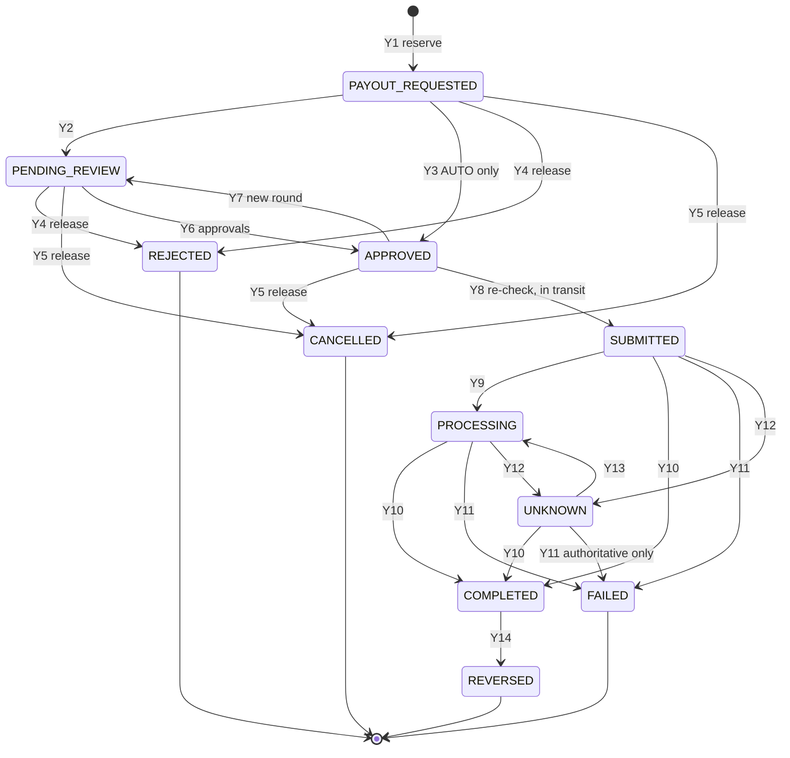

# Payout State Machine

> **Status:** Stage 2 design. Nothing here is implemented (payouts: Stage 11; no live payouts before Stage 20,
> Gate C). Authoritative behaviour: [payout-lifecycle.md](../payments/payout-lifecycle.md) (Y1–Y14),
> [payout-eligibility-and-controls.md](../payments/payout-eligibility-and-controls.md), ADR-017, ADR-020. Database
> enforcement: [`0016_payouts.sql`](../../design/sql/0016_payouts.sql) ([payout-schema.md](../database/payout-schema.md)).
> Ledger rules: `0006_ledger.sql` (`PAYOUT_*` posting rules), keys from
> [settlement-and-custody-model.md §5.8](../ledger/settlement-and-custody-model.md).

Related: [payment-state-machine.md](payment-state-machine.md) · [payment-provider-interfaces.md](payment-provider-interfaces.md) ·
[background-processing.md](background-processing.md) (`payouts.submit`, `payouts.status_poll`, `payouts.webhook_apply`).

---

## 1. States



The 22 edges are exactly the `app.status_transitions` rows for machine `payout`; the Go list must match.
**`UNKNOWN → SUBMITTED` does not exist**, so a payout in UNKNOWN can never be resubmitted, whatever the
application does. Ranks (`app.payout_status_rank`): PAYOUT_REQUESTED 0, PENDING_REVIEW 10, APPROVED 20,
SUBMITTED 30, UNKNOWN 35, PROCESSING 40, FAILED/REJECTED/CANCELLED 50, COMPLETED 60, REVERSED 70; inbound provider
events use rank + edge like payments, with internal-only exceptions `APPROVED → PENDING_REVIEW` and
`PROCESSING → UNKNOWN`.

## 2. Transitions, guards and journals

| # | Transition | Guard (application → database) | Source | Journal key (rule) | Reservation |
|---|---|---|---|---|---|
| Y1 | → PAYOUT_REQUESTED | All REQUEST-phase checks non-FAIL; amount ≤ available (ledger L8); single in-flight; idempotency | OWNER | `payout:{id}:reserved` (PAYOUT_RESERVED: Dr `campaign_payable:{c}` Cr `campaign_payout_pending:{c}`) | RESERVED |
| Y2 | → PENDING_REVIEW | Tier SINGLE/DUAL or any REVIEW/DEFER | SYSTEM | — | — |
| Y3 | → APPROVED | Tier AUTO (disabled for the pilot, PD-24) — DB rejects skip for non-AUTO | SYSTEM | — | — |
| Y4 | → REJECTED | Blocking check failed or reviewer reject (reason) | SYSTEM/STAFF | `payout:{id}:released` (PAYOUT_RELEASED → `campaign_payable` or `campaign_held` if frozen) | RELEASED |
| Y5 | → CANCELLED | Owner/staff before submission | OWNER/STAFF | `payout:{id}:released` | RELEASED |
| Y6 | PENDING_REVIEW → APPROVED | FINANCE approvals only (I-20) in the current round: SINGLE ≥ 1, DUAL ≥ 2 distinct FINANCE, unexpired, none REJECT; each ≠ requester, ≠ destination changer/verifier | STAFF | — | — |
| Y7 | APPROVED → PENDING_REVIEW | New hold/flag/destination change; **approval_round + 1** (DB-enforced) | SYSTEM | — | — |
| Y8 | APPROVED → SUBMITTED | Approvals re-checked (EC-22) **and** an ELIGIBLE PRE_SUBMIT decision written in the same tx | SYSTEM | `payout:{id}:submitted` (Dr `campaign_payout_pending:{c}` Cr `payout_in_transit:{p}`) | RESERVED (+ submit link) |
| Y9 | SUBMITTED → PROCESSING | Provider acknowledged | SYNC/WEBHOOK/POLL | — | — |
| Y10 | → COMPLETED | Authoritative confirmation; an authoritative synchronous response counts (I-22, ADR-024 point 7, refines Stage 1 Y10) | SYNC/WEBHOOK/POLL/RECON | `payout:{id}:completed` (Dr `payout_in_transit:{p}` Cr `psp_settled:{p}`) | CONSUMED |
| Y11 | → FAILED | Authoritative **final** failure; STAFF only with provider evidence; never SYSTEM (`ck_payout_events_failed_source`, I-21) | SYNC/WEBHOOK/POLL/RECON/STAFF | `payout:{id}:failed` (Dr `payout_in_transit:{p}` Cr `campaign_payable`/`campaign_held`) | RELEASED |
| Y12 | → UNKNOWN | Our call/query indeterminate (incl. `CRASH_DURING_CREATE`) | SYSTEM only | none — money stays in transit | — |
| Y13 | UNKNOWN → PROCESSING | Status query/webhook shows in progress | POLL/WEBHOOK | — | — |
| Y14 | COMPLETED → REVERSED | Rail returned funds | WEBHOOK/POLL/RECON | `payout:{id}:reversed` (Dr `psp_settled:{p}` Cr `campaign_payable`/`campaign_held`) + `payout_reversals` row | stays CONSUMED |

Extra journals: `payout:{id}:fee` (PAYOUT_FEE, FundZim bears, PD-23); `payout:{id}:late_completion` (manual, SEV1,
§4.4). Every transition writes `payout_events` (deferred same-transaction check) and an audit event.

## 3. Maker-checker and segregation of duties

```mermaid
sequenceDiagram
    autonumber
    actor O as Owner (maker)
    participant API as payouts API
    participant DB as PostgreSQL
    actor F1 as FINANCE
    actor F2 as FINANCE 2
    O->>API: POST /api/v1/campaigns/{c}/payouts (Idempotency-Key)
    API->>DB: tx: REQUEST decision; ledger payout:{id}:reserved; payout PAYOUT_REQUESTED→PENDING_REVIEW; reservation; events
    F1->>API: approve (step-up MFA, reason, conflict attestation)
    API->>DB: INSERT payout_approvals (trigger: ≠ requester, ≠ destination changer/verifier, PENDING_REVIEW, current round)
    alt policy DUAL
        F2->>API: approve (distinct FINANCE)
        API->>DB: second approval (unique per approver per round)
    end
    API->>DB: PENDING_REVIEW → APPROVED (guard counts distinct approvers, ≥1 FINANCE, unexpired)
```

Approvals expire (`expires_at`, approval-validity limit); an expired approval does not count at Y8, so the payout
must return to review (Y7, new round). Staff destination overrides use `payout_destination_override_requests`
(maker ≠ checker) and make the maker the destination's `last_changed_by`, which bars them from approving payouts to
it.

## 4. Submission, timeouts, ambiguous results and duplicate prevention

### 4.1 Submission (outside any DB transaction)

```mermaid
sequenceDiagram
    autonumber
    participant S as payouts.submit worker
    participant DB as PostgreSQL
    participant A as PayoutProvider adapter
    participant P as PSP
    S->>DB: tx1: lock payout FOR UPDATE; PRE_SUBMIT decision; ledger payout:{id}:submitted;<br/>APPROVED→SUBMITTED; attempt#1 CREATE_PAYOUT IN_FLIGHT; COMMIT
    S->>A: CreatePayout(ref = payout_id, destination snapshot, amount, currency)
    alt Accepted(ref)
        A-->>S: provider_payout_ref
        S->>DB: tx2: attempt ACCEPTED; SUBMITTED→PROCESSING; provider ref
    else ErrDefinitelyNotSent
        S->>DB: tx2: attempt DEFINITELY_NOT_SENT (stays SUBMITTED)
        S->>A: retry with SAME payout_id (attempt#2 allowed by DB only because #1 was not sent)
    else Rejected(not created)
        S->>DB: tx2: attempt REJECTED; payout_failures; ledger payout:{id}:failed; →FAILED; destination NEEDS_REVERIFICATION if bad destination
    else ErrOutcomeUnknown / timeout / 5xx
        S->>DB: tx2: attempt OUTCOME_UNKNOWN; SUBMITTED→UNKNOWN (SYSTEM); enqueue status_poll
    end
```

If the process dies between tx1 and tx2, the attempt stays `IN_FLIGHT`; the sweeper marks it
`OUTCOME_UNKNOWN / CRASH_DURING_CREATE` and moves the payout to UNKNOWN. It is **never** resubmitted: the
`payout_attempts` trigger refuses any `CREATE_PAYOUT` unless the payout is `SUBMITTED` and every earlier create was
`DEFINITELY_NOT_SENT`.

### 4.2 Resolving UNKNOWN

```mermaid
sequenceDiagram
    autonumber
    participant J as payouts.status_poll
    participant A as adapter
    participant DB as PostgreSQL
    participant R as reconciliation
    actor F as FINANCE
    loop backoff until H_payout (PCR-026; default 72 h, flagged)
        J->>A: GetPayoutStatus(payout_id)
        alt completed
            J->>DB: lock; ledger payout:{id}:completed; reservation CONSUMED; UNKNOWN→COMPLETED
        else processing
            J->>DB: UNKNOWN→PROCESSING
        else final failure (documented finality)
            J->>DB: ledger payout:{id}:failed; reservation RELEASED; UNKNOWN→FAILED
        else not found / indeterminate
            J->>DB: stays UNKNOWN (attempt GET_STATUS recorded)
        end
    end
    J->>DB: needs_reconciliation = true (ALR-PO2, paging)
    R->>DB: disbursement statement match → COMPLETED (RECON) or case
    F->>DB: FAILED only with provider written confirmation (evidence_record_id; CHECK enforced)
```

While UNKNOWN the money stays in `payout_in_transit:{p}` (neither available nor paid) and the in-flight index blocks
any new payout for that campaign + currency.

### 4.3 Duplicate prevention layers

| Layer | Mechanism | Where |
|---|---|---|
| Client | `Idempotency-Key`; `uq_payout_requests_idempotency` | API + DB |
| Domain | One non-terminal payout per (campaign, currency) | `uq_payout_requests_one_inflight` |
| Balance | Reservation under the balance row lock; L8 non-negative | ledger |
| Ledger | Unique keys `payout:{id}:reserved\|submitted\|completed\|failed\|released\|reversed` | ledger |
| State | `APPROVED → SUBMITTED` under `FOR UPDATE` is the single claim; no `UNKNOWN → SUBMITTED` edge | guard |
| Provider call | Attempts trigger: create only once unless definitely not sent; `our_reference = payout_id` | `payout_attempts` |
| Provider ref | `uq_payout_requests_provider_ref`, `uq_payout_provider_references` | DB |
| Reconciliation | Each disbursement line matches exactly one COMPLETED payout | Stage 17 |

### 4.4 Late completion after FAILED

FAILED is terminal. If an authoritative completion arrives later, the event is stored `applied=false, ANOMALY`, a
`payout_failures` row `LATE_COMPLETION_AFTER_FAILED` is written, ALR-PO4 (SEV1) fires, a payout hold is placed via
`risk`, and FINANCE posts `payout:{id}:late_completion` under maker-checker and opens a `recovery_cases` row
(`PAYOUT_LATE_COMPLETION`) if the released funds were paid out again. Recovery write-offs go through
`WRITE_OFF_PENDING` (maker FINANCE; checker second FINANCE below the limit-record threshold, `BUSINESS_APPROVER`
above; baseline §12 I-9).

## 5. Retries

- `ErrDefinitelyNotSent`: same `payout_id`, bounded attempts with backoff; then ALR-PO3 and FINANCE (stays SUBMITTED).
- Status queries: unlimited within the poll schedule (they never move money).
- After authoritative FAILED: a **new** payout request with a new id, re-evaluated from scratch.
- Never: a new reference for the same payout; a create after an indeterminate create; FAILED from a timeout.

## 6. Timeouts

| Timeout | Value | Source |
|---|---|---|
| Provider call deadline | adapter config (e.g. 20 s [default]) | adapter |
| Poll horizon `H_payout` | provider documented window; unconfigured ⇒ 72 h [default], flagged | PCR-026, PROVIDER limit |
| Approval validity | INTERNAL_RISK limit `approval.validity` | risk.limits |
| Override request expiry | 24 h | operational-controls §3 |

## 7. Test requirements

DB invariants: `payouts_test.sql` (74 cases; list in [payout-schema.md §5](../database/payout-schema.md)). Stage 11
(sandbox, real PostgreSQL): every edge and non-edge in Go and SQL; N concurrent requests over the balance; two
submission workers ⇒ one provider call; crash after tx1 ⇒ UNKNOWN, no second create; timeout ⇒ UNKNOWN resolved by
poll and by reconciliation; `ErrDefinitelyNotSent` ⇒ same-reference retry; freeze during review ⇒ release to
`campaign_held`; reversal ⇒ funds back, destination `NEEDS_REVERIFICATION`, `DESTINATION_HOLD`; late completion ⇒
SEV1 + correcting journal; every journal balances per currency; L8 holds throughout.
