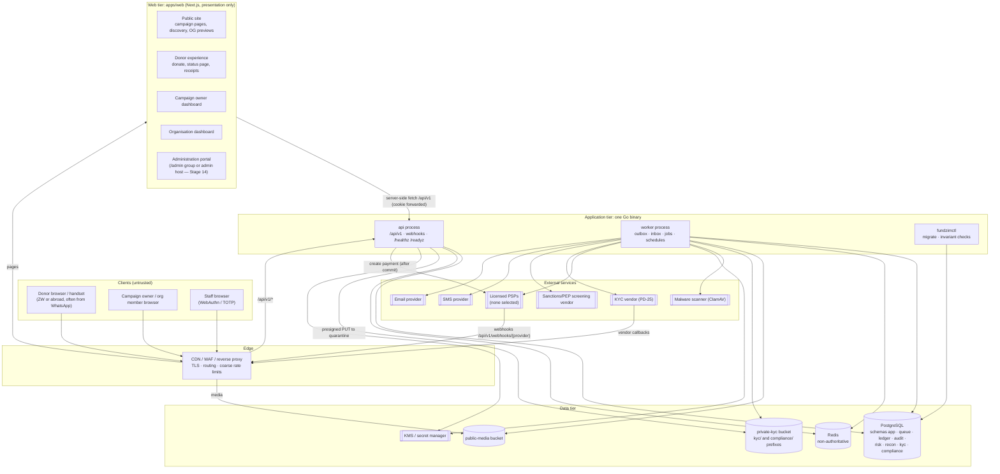
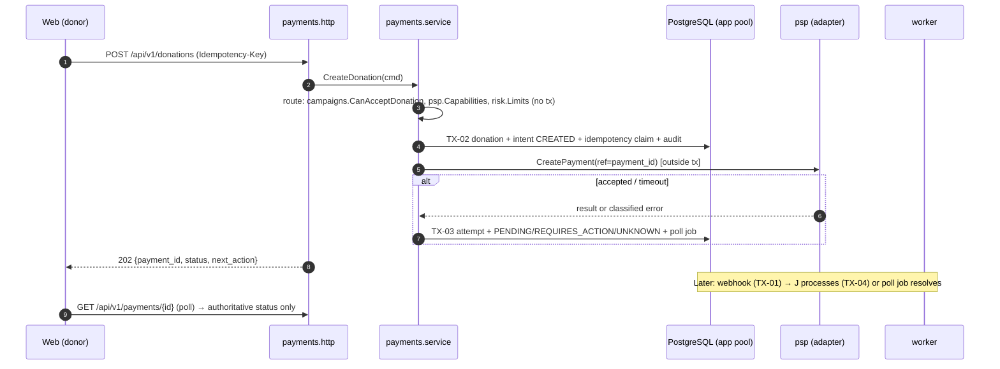
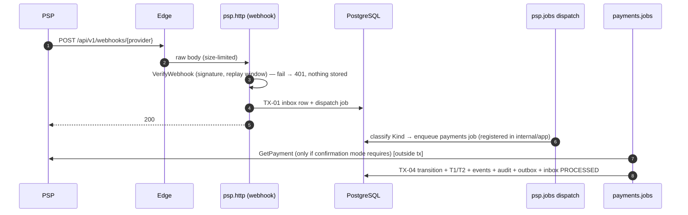
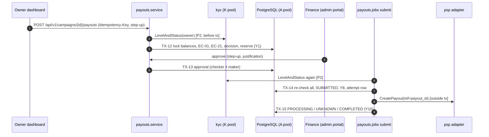

# System Overview

**Stage 2 — design only.** This document describes FundZim's logical components, how they communicate, which
operations form one database transaction, and where the external integration boundaries are. It refines
[ARCHITECTURE.md §2–§8](../ARCHITECTURE.md) for Stage 1 and Stage 2 decisions and follows
[design-baseline.md](../stage-2/design-baseline.md) for every name.

Related: [component-diagram.md](component-diagram.md) (C4 views) · [trust-boundaries.md](trust-boundaries.md) ·
[domain-boundaries.md](domain-boundaries.md) · [dependency-rules.md](dependency-rules.md) ·
[go-module-design.md](go-module-design.md) · [background-processing.md](background-processing.md) ·
[payment-state-machine.md](payment-state-machine.md) · [payout-state-machine.md](payout-state-machine.md) ·
[ledger-posting-model.md](ledger-posting-model.md) · [payment-provider-interfaces.md](payment-provider-interfaces.md) ·
[observability.md](observability.md) · [api-design.md](../api/api-design.md) ·
[authentication-authorization.md](../security/authentication-authorization.md)

---

## 1. Logical components

| Component | Responsibility | Talks to | Never does |
|---|---|---|---|
| **Public site** | SSR campaign pages and discovery; OpenGraph/WhatsApp previews; per-currency raised amounts as returned by the API | API (public endpoints) | Compute money, cache user-specific responses |
| **Donor experience** | Amount → method → confirm → provider step → status page (polls API); receipts; donation visibility | API (`/donations`, `/payments/{id}`) | Treat a redirect as success (CLAUDE.md rule 6); queue donations offline |
| **Campaign owner dashboard** | Draft/submit/edit campaigns, updates, beneficiary and destination setup, money-state view per currency, payout request/cancel | API (`/me/*`, `/campaigns/*`, `/payouts/*`) | Show a single "balance"; change payout status after submission |
| **Organisation dashboard** | Org profile, members and invitations, KYB progress, org campaigns, org payout destinations (`ORG_ADMIN` only) | API (`/organisations/*`) | Bypass org role checks (API enforces) |
| **Administration portal** | Staff queues: campaign review, KYC/KYB review, compliance cases, payout approvals, refunds, reconciliation, ledger adjustments, role management, kill switches | API `/api/v1/admin/*` only | Hold any privilege of its own; every decision is the API's |
| **api** | All business logic and authorisation; REST `/api/v1`; webhook ingest; health | PostgreSQL (3 pools), Redis, KMS, object storage (presign), PSPs (create/cancel payment after commit) | Process webhooks inline; call PSPs inside a DB transaction |
| **worker** | Outbox dispatch, event consumers, provider inbox processing, polling, payout submission, reconciliation, notifications, media/scan pipeline, schedules | Same as api plus vendors | Serve HTTP (except health/metrics) |
| **fundzimctl** | Migrations (goose), invariant checks, ledger recompute, audit chain verification | PostgreSQL (migrator or read-only role per command) | Modify financial history |
| **PostgreSQL** | The only authoritative store, including queue, inbox, outbox, audit, ledger | — | — |
| **Redis** | Rate-limit counters, short-TTL public caches, best-effort de-duplication locks | — | Hold anything whose loss changes money or access (ARCHITECTURE §8.2) |
| **public-media** | Re-encoded campaign images (C0) behind the CDN | — | Hold originals or documents |
| **private-kyc** | `kyc/` prefix: identity and beneficiary documents (C3, `private-kyc` credential, `kyc` only); `compliance/` and `reports/` prefixes: non-KYC evidence and statement files (`private-evidence` credential, `storage` only). Neither credential can read the other's prefix (I-19) | — | Public ACLs; long-lived URLs |

Process model: **api** and **worker** are the same binary built once, started by different `main` packages
(`apps/api/cmd/api`, `apps/api/cmd/worker`). Both are stateless and scale horizontally; River coordinates
workers through PostgreSQL. Each process opens up to three pools (§3.3).

### 1.1 Web surfaces and the administration boundary

The Stage 14 decision is whether the administration portal is the same Next.js app under `/admin` or a
separate host (`admin.<domain>`, same or separate build). The API is designed so that the choice only changes
edge and Next.js configuration, never API code:

| Concern | Rule (holds for both options) |
|---|---|
| API surface | Staff endpoints live only under `/api/v1/admin/*`, registered on a separate route group with its own middleware chain ([component-diagram.md §3](component-diagram.md)). No staff capability is reachable through a user route. |
| Session separation | Staff sign in through a staff-only flow and receive a distinct cookie (`__Host-fz_staff`); users receive `__Host-fz_session`. The staff chain accepts only staff sessions (`account_kind = STAFF`, MFA satisfied); the user chain rejects staff sessions. A staff member's personal account is a different user. |
| Session policy | Staff sessions: shorter idle/absolute lifetime, step-up (fresh MFA within `STEP_UP_MAX_AGE`) for approvals and sensitive reads, optional IP/device restrictions for FINANCE and SUPER_ADMIN (SECURITY §4.2). |
| Edge | Option B allows an edge rule restricting `/api/v1/admin/*` to the admin host (and optionally to an allow-listed network). Option A keeps the same API rule but cannot use host-bound cookie isolation, so the API's session-kind check is the only separation. **Stage 2 recommends option B**, because `__Host-` cookies are host-bound and the admin CSP can be stricter without affecting public pages. |
| Rendering | Admin pages are dynamically rendered, `Cache-Control: no-store`, never behind CDN caching, never in the service worker cache (FRONTEND §3). |
| CSP | Admin CSP: no third-party origins at all (no PSP hosted pages), `frame-ancestors 'none'`, nonce-only scripts. |
| Masking | The API returns staff DTOs that mask C3 by default; unmasking is a separate, justified, audited endpoint (`kyc.identity_number.reveal`, `donor.identity.unmask`). The UI cannot unmask by itself. |

## 2. Communication patterns

| Pattern | When | Mechanism | Guarantees |
|---|---|---|---|
| **P1 Tx-joining call** | Atomicity across modules is required: state transition + ledger journal + hold + audit + outbox | Caller opens `db.WithTx`; passes `tx` to `ledger.Post*`, `risk.Holds.Place`, `audit.Recorder.Record`, `outbox.Append` | All-or-nothing. Callee must be on the same pool (R4). |
| **P2 Plain synchronous call** | A read or a decision input that does not need to commit with the caller (KYC level, capability lookup, fee preview) | Root-interface method without `tx` | Read-committed snapshot at call time; decisions record the version/ID they used |
| **P3 Outbox event** | Another module must react, but not atomically; anything that leaves the process | `outbox.Append` in the producer's tx → dispatcher → consumer job with inbox dedupe | At-least-once delivery, idempotent consumers, per-aggregate ordering not guaranteed (consumers use versions) |
| **P4 Job** | Deferred or scheduled work owned by one module (polling, submission, expiry, imports) | River job enqueued transactionally (`jobs.Enqueue(ctx, tx, args)`) or by schedule | At-least-once; jobs idempotent; unique-job keys for singletons |
| **P5 Two-phase external call** | Any call to a PSP, vendor or channel | Tx1 commits intent/attempt row → call outside tx → Tx2 records classified result | No external call inside a tx (R5). Crash between steps leaves an attempt row that a poller resolves (`UNKNOWN`, never assumed failed). |
| **P6 Inbound callback** | PSP webhook, KYC/screening vendor callback | Verify on raw body → inbox insert (+ processing job) in one tx → 2xx | Durable before acknowledgement; dedupe by `(provider, provider_event_id)` |
| **P7 Server-side fetch** | Next.js renders a page | HTTP to `/api/v1` on the internal network, forwarding the session cookie and `X-Request-ID` | Same authorisation as a browser call |

Choosing between P1 and P3 is governed by [dependency-rules.md §4.3](dependency-rules.md).

## 3. Transaction boundaries

### 3.1 General rules

1. **One business operation = one transaction** on one pool, opened by the **owning** module's service with
   `platform/db.WithTx`. Callees join; they never open nested transactions (`WithTx` panics if a tx is
   already on the context, unless the callee asked for `db.Join`).
2. Every transaction that changes a mutable aggregate also writes, in the same tx: its append-only history
   row (`*_events` / `*_history`), the audit event, and any outbox events.
3. **No external I/O inside** (R5). A transaction may enqueue River jobs and outbox rows (both in PostgreSQL).
4. Locks are taken in a global order to avoid deadlocks: (a) the aggregate row (`SELECT … FOR UPDATE` by id),
   (b) `ledger_balances` rows in ascending account id (done inside `ledger`), (c) `risk.holds` rows. `WithTx`
   retries the whole closure on `40001` (serialization failure) and `40P01` (deadlock) with jittered backoff,
   at most 3 times; closures must therefore be side-effect-free outside the tx (true by rule 3).
5. Isolation: `READ COMMITTED` with explicit row locks by default; operations that read a set to make a
   decision without a natural lock target (for example EC-11 single in-flight is a unique index, so not
   needed) use the database constraint instead of a stronger isolation level. Ledger-specific isolation and
   lock rules are in [ledger-posting-model.md](ledger-posting-model.md) and win for postings.
6. Optimistic concurrency on aggregates updated by humans (campaign edits, review decisions): `version`
   column, `UPDATE … WHERE id = $1 AND version = $2`; zero rows → `CONCURRENT_MODIFICATION` (409).

### 3.2 Catalogue

Pool: **A** = app (`fundzim_app`), **K** = kyc (`fundzim_kyc`), **C** = compliance (`fundzim_compliance`).
"Outbox" lists the events appended ([dependency-rules.md §4.2](dependency-rules.md)). Ledger keys follow
[settlement-and-custody-model.md §5](../ledger/settlement-and-custody-model.md) and
[ledger-posting-model.md](ledger-posting-model.md).

| ID | Operation | Owner | Pool | Writes in the one transaction | Outside the transaction |
|---|---|---|---|---|---|
| TX-01 | Webhook ingest | psp | A | `provider_webhook_inbox` row (`ON CONFLICT DO NOTHING`) + River job `psp.webhook_dispatch` | Signature/replay verification **before** BEGIN; 2xx after COMMIT. **No domain writes.** |
| TX-02 | Create donation | payments | A | `idempotency_keys` (claim, `IN_PROGRESS`), `donations`, `payment_intents` (`CREATED`), `payment_events`, first `payment_attempts` row (`STARTED`, so a crash during the call is detectable — background-processing §9.1), `DONATE` restriction check via `compliance.Restrictions.ActiveTx` (view `v_active_restrictions`), audit | Routing reads (`psp` capabilities, `campaigns` status, `risk` holds/limits) **before** BEGIN, re-validated inside where they are rows |
| TX-03 | Record provider create-payment result | payments | A | `payment_attempts` result (classified), `payment_transactions`, `payment_provider_references`, intent → `PENDING` / `REQUIRES_ACTION` / `UNKNOWN` (or `FAILED` only for a definitive rejection), `payment_events`, `payments.status_poll` enqueued, audit, idempotency key → `COMPLETED` with the stored response | The `CreatePayment` call (between TX-02 and TX-03; P5) |
| TX-04 | Process inbound payment event → `SUCCEEDED` | payments | A | inbox row claimed → `PROCESSED` (via `psp`), `payment_transactions` update, intent → `SUCCEEDED` (precedence + graph check), `payment_events`, ledger **T1 capture** (gross, platform fee per `fee_schedule_version`) and **T2 PSP fee** (if reported), `ledger_balances`, audit, outbox `payment.succeeded` | Authenticated status query for weak providers (before BEGIN) |
| TX-05 | Payment → `FAILED` / `EXPIRED` / `CANCELLED` | payments | A | intent transition, `payment_events`, audit, outbox `payment.status_changed`. **No ledger.** | — |
| TX-06 | Parked out-of-order event | payments | A | `payment_events` (parked), inbox row → `PARKED` with re-check job | — |
| TX-07 | Release funds (T4) | payments | A | Lock intent; assert `SUCCEEDED`, no open dispute, T3 exists, hold period elapsed; `campaigns.SettlementTarget` (FROZEN → `campaign_held`), ledger `payment:{id}:release` (+ reserve split), audit | Triggered by `settlement.matched` → scheduled job |
| TX-08 | Dispute opened / reversal reported | payments | A | `payment_disputes` (or `chargebacks`), intent → `DISPUTED` / `CHARGED_BACK`, `payment_events`, ledger `dispute:{id}:opened` or `:held` (+ `:funding` for pool shortfall), **`risk` hold `DISPUTE_HOLD`**, audit, outbox `dispute.opened` and, on shortfall, `dispute.shortfall` | Recovery case creation is a separate tx in `payouts` (TX-25) |
| TX-09 | Refund request created | payments | A | `refund_requests` (`REQUESTED` → `PENDING_APPROVAL` or `ON_HOLD`), audit, outbox | — |
| TX-10 | Refund approved | payments | A | Maker-checker check (approver ≠ requester, step-up fresh), `refund_requests` → `APPROVED`, ledger `refund:{id}:reserved`, `refund_transactions` (`CREATED`), job `payments.refund_submit`, audit | — |
| TX-11 | Refund execution result | payments | A | `refund_transactions` → `PENDING`/`SUCCEEDED`/`FAILED`/`UNKNOWN`, on success ledger `refund:{id}:settled`, intent → `PARTIALLY_REFUNDED`/`REFUNDED`, `payment_events`, audit, outbox (`refund.completed`, `refund.shortfall` when after payout) | `RefundPayment` call between TX-10 and TX-11 |
| TX-12 | Payout request | payouts | A | Lock campaign balance projections (via `ledger`), run eligibility (live reads: kyc K-pool read **before** BEGIN, snapshot recorded), `payout_eligibility_decisions` (always), and if no FAIL: `payout_requests`, `payout_reservations`, ledger `payout:{id}:reserved` (Y1), `payout_events`, audit, outbox `payout.requested`. **On FAIL the tx still commits the decision row and audit, without a payout.** | Step-up auth verified by middleware before BEGIN |
| TX-13 | Payout approval | payouts | A | `payout_approvals` (checker ≠ requester, ≠ recent destination changer, DUAL distinct — DB trigger), status → `APPROVED` when tier satisfied, `payout_events`, audit | — |
| TX-14 | Payout pre-submission | payouts | A | Lock payout + projections; re-run **all** checks (EC-01…EC-22); decision row; on PASS: → `SUBMITTED`, ledger `payout:{id}:submitted` (Y8), `payout_attempts` (intent to call, destination snapshot hash), audit | `CreatePayout` call after COMMIT (P5) |
| TX-15 | Payout provider result | payouts | A | `payout_attempts` classified, `payout_provider_references`, → `PROCESSING` / `UNKNOWN` / `COMPLETED` / `FAILED` (final only), ledger Y10/Y11 where applicable, `payout_failures`, `payout_events`, audit, outbox | — |
| TX-16 | Payout reversed after completion | payouts | A | `payout_reversals`, → `REVERSED`, ledger `payout:{id}:reversed`, `risk` `DESTINATION_HOLD`, audit, outbox | — |
| TX-17 | Campaign freeze | campaigns | A | campaign → `FROZEN`, `campaign_status_history`, `campaign_moderation_actions`, **`risk` hold `CAMPAIGN_FREEZE`**, **ledger `campaign:{id}:freeze:{n}`** (payable → held), audit, outbox `campaign.frozen` | — |
| TX-18 | Campaign unfreeze (checker step) | campaigns | A | Maker-checker (approver ≠ freezer ≠ requester), campaign → previous status, hold released (`hold_events`), ledger `campaign:{id}:unfreeze:{n}`, audit, outbox | — |
| TX-19 | Payout destination add/change | payouts | A | `payout_destinations` new version (ciphertext + blind index), `payout_destination_verifications` (pending), **`risk` hold `DESTINATION_HOLD`**, invalidate approvals of in-flight payouts (Y7), audit, outbox `payout_destination.changed` | Name-match/ownership check with provider (P5) |
| TX-20 | Ledger adjustment approve | ledger | A | `ledger_adjustments` → approved (checker ≠ maker), balanced journal with `reverses_transaction_id` where applicable, `ledger_balances`, audit | — |
| TX-21 | KYC decision | kyc | K | `kyc_decisions`, `kyc_cases` transition, `verification_profiles` (level/status, version+1), `profile_events`, audit (+ security audit for document views), outbox `kyc.level_changed` / `kyc.status_changed` | Vendor calls (P5); projection updates in `users` / `organisations` are separate A-pool txs |
| TX-22 | Compliance restriction `RECEIVE_PAYOUT` | compliance | C | `compliance_restrictions` (maker-checker, expiry), `compliance_case_events`, **`risk` hold `COMPLIANCE_HOLD`** (grants in `0018_grants.sql`), audit, outbox `compliance.restriction_applied`, `compliance.case_blocking_changed` | Ledger move for campaign scope via `risk.hold_placed` → campaigns (async; EC-12 already blocks) |
| TX-23 | Role grant (checker step) | auth | A | `role_assignment_requests` → approved (approver ≠ proposer, no self-grant, SoD role combinations), `role_assignments`, `security_audit_events`, outbox `auth.role_granted` | Alert delivery (event) |
| TX-24 | Settlement line matched | reconciliation | A | `reconciliation_matches`, `settlement_items` status, ledger **T3** `settlement:{batch}:{payment}` (or T3′ with suspense), audit, outbox `settlement.matched` | Statement fetch (`psp` reconciliation source) before BEGIN |
| TX-25 | Recovery case from shortfall event | payouts | A | `inbox_events` (dedupe), `recovery_cases`, `recovery_case_events`, `risk` hold `RECOVERY_HOLD`, audit | — |
| TX-26 | Outbox dispatch | platform (worker) | A | Claim `outbox_events` batch (`SKIP LOCKED`), insert River jobs per consumer, mark dispatched | — |
| TX-27 | Event consumer | consumer module | A/K/C | `inbox_events (consumer, event_id)` + the consumer's own writes | — |
| TX-28 | Upload finalised / promoted | storage | A | `upload_sessions` → `UPLOADED`, `stored_objects` (`QUARANTINED`), scan job; later tx → `CLEAN`/`REJECTED`, outbox `storage.object_promoted` / `_rejected` | Object PUT (presigned, before), scan and copy to final prefix (between txs) |
| TX-29 | Fee schedule version activation (checker) | fees | A | `fee_schedule_change_requests` approved, `fee_schedule_versions` new row with future `effective_from`, audit | — |
| TX-30 | Limit change (checker) | risk | A | `limit_change_requests` approved, `limits` new version, audit | — |

### 3.3 Pools and cross-pool operations

| Pool | Role | Used by | Max size (initial guidance; tuned in [performance-capacity.md](performance-capacity.md)) |
|---|---|---|---|
| app | `fundzim_app` | all modules except the `kyc` and `compliance` stores; also `compliance` reads of the narrow views | largest |
| kyc | `fundzim_kyc` | `internal/kyc/store` only | small (KYC traffic is low; isolation over throughput) |
| compliance | `fundzim_compliance` | `internal/compliance/store` only | small |

A business operation that spans pools is **never one transaction**. Where it needs effects in both, the
pattern is: commit in the owner's pool with an outbox event, then the other side applies its effect in its own
transaction (for example TX-21 then the `users` projection). Reads across pools (payouts reading a KYC level)
are P2 calls made **before** the main transaction, and the value used is recorded in the decision row; the
pre-submission re-check (TX-14) narrows the window to seconds, and `kyc.status_changed` triggers a re-check of
in-flight payouts.

## 4. Representative flows

### 4.1 Donation (two-phase provider call)

### 4.2 Webhook to ledger

### 4.3 Payout

## 5. External integration boundaries

| External system | Direction | Owning module (sub-package) | Transport and authentication | Data sent (class) | Timeouts, retries, failure mode |
|---|---|---|---|---|---|
| PSPs (collection) | Out: create/status/cancel/refund. In: webhooks | `psp/adapters/
`; called by `payments` | HTTPS with per-provider, per-environment credentials from the secret manager; inbound signature + replay window + dedupe | Amount, currency, method, `payment_id`, minimal payer data (MSISDN for mobile money) — C2 | Explicit per-call deadline; errors classified `DefinitelyNotSent` / `OutcomeUnknown` / `Rejected`; unknown → `UNKNOWN` + poll; circuit breaker feeds provider health |
| PSPs (payout) | Out: create payout, status. In: webhooks | `psp/adapters/
`; called by `payouts` | As above | `payout_id`, amount, currency, rail, decrypted destination (C3, decrypted in memory just before the call, never logged) | Never resubmitted from `UNKNOWN`; status query or reconciliation only |
| PSPs (statements) | Out: pull statements / balances where an API exists | `psp` (`ProviderReconciliationSource`); called by `reconciliation` | As above | — | Scheduled; missing statement → freshness lapses → EC-20 `DEFER` |
| PSP merchant portal (human) | Staff → PSP directly | — (outside FundZim) | PSP portal MFA | — | Portal-initiated payouts bypass FundZim: detected by reconciliation as unmatched outgoing (SEV1) |
| KYC vendor (PD-25, not chosen) | Out: start session, get result, delete data. In: callbacks | `kyc/vendor` | HTTPS, vendor credentials (C4); callbacks verified + deduped | Identity attributes and documents (C3), only under contract (LR-011, LR-033) | Manual-only pilot mode is a valid configuration |
| Screening vendor | Out: screen person/entity. In: delta callbacks | `compliance/screening` | HTTPS, vendor credentials | Name, DOB, nationality (minimised) | Unavailable → EC-15 `DEFER`, never pass |
| SMS provider | Out | `notifications/channels/sms` | HTTPS API key | Phone number, message text. OTP codes are never logged and never written to the outbox or job tables; OTP delivery is a synchronous call after the challenge row commits (`auth` → `notifications`, baseline §3; flow in [authentication-authorization.md](../security/authentication-authorization.md)) | Retry with backoff; per-phone/global budgets (T-07) |
| Email provider | Out | `notifications/channels/email` | API key; SPF/DKIM/DMARC on the sending domain | Email address, message (no C3) | Retry; suppression list |
| Malware scanner (ClamAV) | Out (internal network) | `storage/scanner` | Internal-only, no internet exposure | File bytes from quarantine | Scanner down → objects stay quarantined (fail closed) |
| Object storage | Out | `storage/objectstore` (public-media, `compliance/` prefix), `kyc` (`kyc/` prefix) | Per-bucket/prefix credentials | Files | Orphan cleanup for objects without committed metadata |
| CDN / edge | In (all traffic) | Edge configuration (Stage 18/20) | TLS; trusted-proxy list for `X-Forwarded-For` / `X-Request-ID` | Public pages and media | Purge on campaign status change; never caches `/api/v1/*` except public GETs explicitly marked |
| KMS / secret manager | Out | `platform/crypto`, `platform/config` | Workload identity | Wrapped data keys | Startup fails closed if keys are unavailable |
| OpenTelemetry collector | Out | `platform/log`, observability | Internal | Redacted logs, traces, metrics | Drop on overload; never blocks requests |
