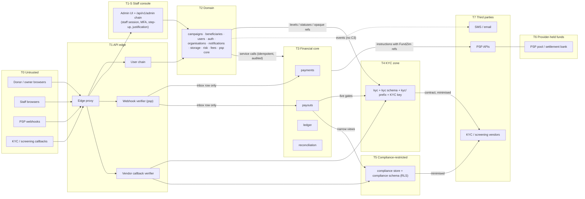

# Trust Boundaries

**Stage 2 — design only.** This document defines FundZim's trust zones and boundaries after Stage 1 and
Stage 2, what crosses each boundary, the controls applied at each crossing and the data classes allowed
across it. Section 6 is the **THREAT-MODEL addendum** required by the Stage 1 handover (§2, §14): it maps the
Stage 1/2 changes to existing threat IDs and adds new threats. [THREAT-MODEL.md](../THREAT-MODEL.md) itself is
not edited in Stage 2; the addendum is merged into it when the project owner accepts Stage 2.

Inputs: ARCHITECTURE §4.3 (T0–T4), THREAT-MODEL §4 (TB1–TB5), SECURITY §2, funds-flow-architecture §1,
Stage 1 handover §2, ADR-021, ADR-022. Data classes C0–C4: [DATA-CLASSIFICATION.md §1](../DATA-CLASSIFICATION.md).

Related: [system-overview.md](system-overview.md) · [component-diagram.md](component-diagram.md) ·
[data-protection-architecture.md](../security/data-protection-architecture.md) ·
[authentication-authorization.md](../security/authentication-authorization.md) ·
[authorization-matrix.md](../api/authorization-matrix.md) · [payment-provider-interfaces.md](payment-provider-interfaces.md)

---

## 1. Zones

The Stage 0 architectural zones (T0–T4) are kept and refined; Stage 2 adds four.

| Zone | Name | Contains | Trust level | Stage |
|---|---|---|---|---|
| **T0** | Untrusted | Donor/owner browsers, staff browsers (before authentication), PSP and vendor callers, crawlers, the internet | None | 0 |
| **T1** | API edge | Edge proxy, middleware chain, HTTP handlers, webhook and callback verifiers | Authenticates and validates; makes no business decision | 0 |
| **T1-S** | Staff console | Admin portal UI and the `/api/v1/admin/*` route group with its staff-only chain | Authenticated staff with MFA; still untrusted for *intent* (insider threat) | **2** (refines SECURITY §2 "admin surface") |
| **T2** | Domain | campaigns, beneficiaries, users, auth, organisations, notifications, storage, risk, fees, psp (non-adapter code), admin | Trusted code, untrusted inputs | 0 |
| **T3** | Financial core | payments, payouts, ledger, reconciliation (+ `psp` adapters on the outbound side) | Highest integrity requirements | 0 |
| **T4** | Sensitive identity (KYC zone) | `kyc` module, `kyc` schema, `fundzim_kyc` pool, `private-kyc` `kyc/` prefix, KYC key class; `payout-destination` key class (C3 in `payouts`) | Highest confidentiality | 0 (extended in 2) |
| **T5** | Compliance-restricted zone | `compliance` module's store, `compliance` schema, `fundzim_compliance` pool, RLS-protected STR rows, `private-kyc` `compliance/` prefix | Restricted confidentiality (tipping-off, LR-008) | **2** (ADR-022) |
| **T6** | Provider-held funds | The PSP's pool and settlement bank (Model A): money FundZim records but never holds | External custody; FundZim has instructions and evidence only | **1** (funds-flow §1) |
| **T7** | Third-party processors | PSP APIs, KYC vendor, screening vendor, SMS/email, CDN | External; inputs untrusted until verified | 0 (TB5) |
| **T8** | Secrets | KMS, secret manager, signing and encryption keys | C4 | 0 (TB4) |
| **TD** | Data tier | PostgreSQL schemas and roles, Redis, buckets | Enforced by roles, grants, RLS, bucket credentials | 0 (TB3) |

## 2. Boundary catalogue

Each row is one boundary crossing. "Max class" is the most sensitive data class allowed to cross in that
direction.

### B1 — T0 → T1: browser to API (users)

| Aspect | Design |
|---|---|
| What crosses | HTTPS requests to `/api/v1/*` (same origin), session cookie `__Host-fz_session`, CSRF token, `Idempotency-Key` |
| Max class inbound | C3 for specific endpoints only (KYC uploads go to presigned quarantine URLs, not through the API body; payout destination numbers in `POST /payout-destinations`); C4 for OTP codes on verify endpoints |
| Controls | TLS; body limits; strict JSON decoding (unknown fields rejected — T-09); session lookup by token hash; CSRF (Origin/Fetch-Metadata + token); per-route rate limits (fail closed on OTP, login, payment creation); idempotency keys on money routes; route policy + service-level object authorisation (T-08); per-audience DTOs (T-22) |
| Trust rule | Nothing the browser says about payment status is trusted (T-04). Amounts, currencies and IDs are validated against server state. |

### B2 — T0 → T1-S: staff browser to staff console

| Aspect | Design |
|---|---|
| What crosses | Staff session cookie `__Host-fz_staff` (separate host recommended — system-overview §1.1), WebAuthn/TOTP assertions, approvals with justifications |
| Max class | C3 inbound and outbound only through explicit reveal endpoints (`kyc.document.view`, `kyc.identity_number.reveal`, `donor.identity.unmask`), each justified, case-bound and audited in `security_audit_events` |
| Controls | Staff-only session kind; mandatory MFA (no SMS factor); short sessions; step-up for approvals; justification middleware; maker-checker with DB checks (`approved_by <> requested_by`, DUAL distinctness); SoD role-combination rejection at grant time; object-level conflict checks at action time (operational-controls §2); break-glass time-boxed and alerted; admin pages `no-store` |
| Trust rule | A staff member is authenticated, **not** trusted: every sensitive action needs a second person or leaves an alerting audit trail (T-14, T-15, T-17). |

### B3 — T0 → T1: PSP inbound (webhooks)

| Aspect | Design |
|---|---|
| What crosses | `POST /api/v1/webhooks/{provider}` raw body + provider headers |
| Max class | C2 (payment facts, masked payer data). Anything the provider sends that FundZim must not hold (full MSISDN, BIN beyond need) is masked **before** the inbox insert |
| Controls | Exempt from session/CSRF; per-provider body limit and rate limit; signature verification on raw bytes with constant-time compare, two active secrets during rotation; timestamp window where supported; inbox dedupe `UNIQUE(provider, provider_event_id)`; respond 2xx only after the inbox commit; **no business processing in the request path** (TX-01); failures → 401 with no payload stored and a metric |
| Trust rule | A verified webhook is still only a *claim* for providers in `WEBHOOK_UNSIGNED_VERIFY_BY_API` mode: an authenticated status query decides (T-01, R-05). State precedence makes replays and late events no-ops (T-02, T-03). Classification by `Kind` keeps payout events away from `payments` and vice versa (T-35). |

### B4 — T0 → T1: vendor callbacks (KYC, screening)

Same controls as B3, routed to `kyc` (T4) or `compliance` (T5) processors. Payload class C3: stored only in the
owning restricted schema, never in `app`. Vendor outcomes never decide alone: `REJECT` is always a human
decision (kyc-architecture §10). Stored in `kyc.vendor_callback_inbox` / `compliance.screening_callback_inbox` (baseline §5.11, §5.14).

### B5 — T1 → T2/T3: handlers to services

| Aspect | Design |
|---|---|
| What crosses | Typed command structs + `actor.Principal` on the context |
| Controls | Services re-check permission **and** ownership (deny by default, SECURITY §5.1) so jobs and admin calls get the same answer; `money.Money` only (never raw ints) into financial services; every financial command carries an idempotency key; audit inside the business transaction |

### B6 — T2 → T3: domain to financial core

| Aspect | Design |
|---|---|
| What crosses | Root-interface calls to `payments`, `payouts`, `ledger` (named posting rules only); events from T3 back to T2 |
| Controls | Only `ledger` writes ledger tables (grants: INSERT/SELECT; UPDATE only `ledger_balances`); posting rules validate balance and single currency in Go and in a deferred DB trigger; idempotency keys `UNIQUE` on journals; holds checked live; DB transition guards on every financial state machine |
| Trust rule | No caller can assemble arbitrary journal lines; free-form postings exist only as maker-checker adjustments (T-15, T-16). |

### B7 — T2/T3 → T4: anything to the KYC zone

| Aspect | Design |
|---|---|
| What crosses inbound | Uploads (via presigned quarantine), vendor results, requests for level/status |
| What crosses outbound | **Levels, statuses, opaque references, validity windows only.** Never names, numbers, DOB or documents, except via the justified reveal endpoints to authorised staff |
| Controls | Separate pool and role (`fundzim_kyc`), separate schema with no `fundzim_app` grants, separate bucket prefix credentials and KMS key class; application-level encryption with blind index; every document view and number reveal audited in the security chain; `kyc` events carry no C3 (R11) |
| Note | `payout_destinations` account numbers are C3 but live in `app` under key class `payout-destination` (baseline §5.17). They form a **T4 enclave inside T3**: decrypted only in `payouts/service` immediately before the provider call and for masked display (last 3–4 digits), never logged, never in events. |

### B8 — T2/T3 → T5: anything to the compliance-restricted zone

| Aspect | Design |
|---|---|
| What crosses | Case creation from alerts/events; restriction and hold decisions; **outbound to `payouts` only via narrow views** `v_payout_blocking_cases` (subject, case id, flag), `v_screening_status` (subject, latest result, time, list version) and `v_active_restrictions` (subject, capability, expiry; read by `campaigns`/`payments`), never case type, notes, hit details or STR status |
| Controls | `fundzim_compliance` role; RLS on STR-restricted rows using a session setting the module sets only after its permission check (limits in [data-protection-architecture.md](../security/data-protection-architecture.md)); events from `compliance` carry no reasons; owner-facing errors use coarse codes (`PAYOUT_NOT_ELIGIBLE` with category `UNDER_REVIEW`) — tipping-off control (LR-008) |
| Trust rule | Holds placed by compliance live in `risk.holds` with a `confidential` flag; owner DTOs never show their reason. |

### B9 — T3 → T7: FundZim to PSP APIs (outbound instructions)

| Aspect | Design |
|---|---|
| What crosses | CreatePayment / Refund / CreatePayout / status queries / statement pulls |
| Max class | C3 for payout destinations (decrypted in memory), C2 otherwise |
| Controls | Only `psp/adapters` call providers (D5); base URLs from configuration only (SSRF, ADR-007); per-provider credentials from the secret manager; explicit deadlines; FundZim reference (`payment_id`/`refund_id`/`payout_id`) as idempotency key, never with an attempt counter; calls never inside a DB transaction; classified outcomes (`UNKNOWN` never treated as failure); routing refuses `MERCHANT_SETTLEMENT` custody (Model B in substance); destination snapshot hash must match the approved snapshot at submit |

### B10 — T6: provider-held funds boundary

| Aspect | Design |
|---|---|
| What crosses | **Money never crosses into FundZim.** Donor funds move donor → PSP pool → beneficiary. Only platform-fee remittance (and FundZim's own funding/recovery movements) cross to FundZim's operating bank (SC-5) |
| What FundZim holds | Instructions, provider events, statements and ledger records (claims and obligations, ADR-014) |
| Controls | Ledger accounts mirror the boundary (`psp_clearing`, `psp_settled` are claims on the provider); three-way match (payment ↔ provider report ↔ ledger); pool integrity SC-2 after every relevant journal and daily → `PROVIDER_HOLD` on breach; settlement freshness EC-20 (C-2) gates payouts; portal-initiated payouts detected as unmatched outgoing lines (SEV1); provider capability `custody_model` recorded and enforced |
| Trust rule | FundZim cannot verify the pool directly (no bank access in Model A). Evidence matching is the control; a statement gap fails closed for payouts. |

### B11 — T2 → T7: messages and vendors

| Crossing | Max class | Controls |
|---|---|---|
| notifications → SMS/email | C2 (contact details, neutral message text); C4 only for OTP codes, passed in memory by `auth` through `notifications.Transactional.SendNow` (baseline §3), never stored | Templates with escaped variables (template injection tests, Stage 15); no C3 or confidential reasons in messages; sender authentication (SPF/DKIM/DMARC); budgets against SMS pumping |
| kyc → KYC vendor | C3 under contract only (LR-011, LR-033) | Vendor-agnostic interface; minimisation; manual-only mode available; `DeleteSubjectData` where supported |
| compliance → screening vendor | C2/C3 minimised (name, DOB, nationality) | Vendor unavailable → `DEFER` |
| storage → scanner | Files (any class) | Internal network only; scanner has no internet egress |

### B12 — T1/T2/T3 → TD: application to data tier

| Aspect | Design |
|---|---|
| Controls | Three runtime roles (`fundzim_app`, `fundzim_kyc`, `fundzim_compliance`), no `public` schema, append-only tables protected by grants **and** `app.forbid_mutation()`; transition guards; module ownership by sqlc ownership test; cross-pool writes limited to the explicit grant set in `0018_grants.sql`; Redis holds nothing authoritative (T-29) |

### B13 — any → T8: secrets

Keys are referenced by key class and key id (`*_key_id` columns), never stored in the database. Workload
identity to KMS; config structs redact secrets; startup fails if a required key is missing.

## 3. Crossing summary

| From → To | Allowed max class | Primary control | Owner |
|---|---|---|---|
| T0 → T1 (user) | C3 on designated endpoints; C4 OTP | Session + CSRF + validation + rate limit | auth, platform/httpx |
| T0 → T1-S | C3 via reveal endpoints | Staff session + MFA + step-up + maker-checker | auth, admin |
| T0 → T1 (PSP) | C2 (masked) | Signature + replay + dedupe → inbox | psp |
| T0 → T1 (vendors) | C3 into T4/T5 only | Signature + dedupe → restricted inbox | kyc, compliance |
| T2 → T3 | C2 | Named services, idempotency, ledger rules | payments, payouts, ledger |
| T2/T3 → T4 | C3 inbound; levels only outbound | Role, schema, key class, audit | kyc |
| T2/T3 → T5 | C3 inbound; booleans/refs outbound | Role, RLS, narrow views | compliance |
| T3 → T7 (PSP) | C3 (payout destination) | Adapter confinement, idempotent refs, no-tx calls | psp |
| T3 ↔ T6 | — (no money) | Evidence matching, SC-2, EC-20 | reconciliation, ledger |
| T2 → T7 (messages) | C2 | Templates, no C3, budgets | notifications |
| Events (any → any) | C2, IDs and non-sensitive facts | Payload allow-list (R11) | producer |

## 4. Outbox events and job payloads as a boundary

The outbox and the River tables are readable by every app-pool module and are retained for operations, so
they are treated as a C2 boundary:

- event and job payloads carry IDs, money, statuses and non-sensitive facts only;
- never C3 (no identity values, account numbers, medical detail, case notes), never C4 (no OTPs, tokens);
- confidential hold and case reasons never appear; consumers needing them call the owner with permission;
- `kyc` and `compliance` events carry subject references and levels/booleans only.

`TestEventPayloadClassification` enforces this (dependency-rules §5.4).

## 5. Data classification of stores by zone

| Store | Zone | Classes held |
|---|---|---|
| `app` schema | T2/T3 | C0–C2; C3 only as ciphertext (`payout_destinations`) and as credential hashes handled as C3 (`password_credentials`, `otp_challenges`, session token hashes in `sessions`, `recovery_codes`) |
| `ledger` schema | T3 | C2 |
| `audit` schema | T2 (write-only for modules) | C2; references to evidence, never embedded C3 (ADR-019) |
| `risk` schema | T2 | C2; confidential reasons flagged |
| `recon` schema | T3 | C2 |
| `queue` schema | T2 | C2 (IDs only) |
| `kyc` schema | T4 | C3 |
| `compliance` schema | T5 | C3 |
| `private-kyc` bucket | T4 (`kyc/`), T5 (`compliance/`) | C3 |
| `public-media` bucket | T0-readable | C0 |
| Redis | T2 | C0–C1 caches, rate-limit counters (hashed keys for phone numbers) |

## 6. THREAT-MODEL addendum (Stage 1 and Stage 2)

To be merged into [THREAT-MODEL.md](../THREAT-MODEL.md) §4–§7 on Stage 2 acceptance (review cadence §9:
"updated at the end of every stage that adds or changes a trust boundary").

### 6.1 Boundary changes

| Change | Source | THREAT-MODEL boundary affected |
|---|---|---|
| Staff console becomes an explicit zone (T1-S) with its own session kind, route group and recommended host | Stage 2 (system-overview §1.1) | TB1/TB2 (staff browser path) |
| Compliance-restricted zone (T5) with its own DB role and RLS | ADR-022 | TB3 (new TB3-CMP alongside TB3-KYC) |
| Provider-held funds boundary (T6): FundZim never holds donor money | ADR-013, ADR-014, funds-flow §1 | New: not in Stage 0 model |
| Webhook inbox moves to `psp`; one inbox for payment, refund, dispute and payout events, classified then dispatched | ADR-021, baseline §5.8 | TB1 → TB2 webhook path |
| Payout destinations encrypted in `app` (T4 enclave in T3), not in `kyc` | Baseline §5.17 | TB3-KYC |
| Holds unified in `risk`; evidence in `audit` | ADR-021 | — (integrity of controls) |
| Three DB pools; cross-pool operations are never one transaction | ADR-022, system-overview §3.3 | TB3 |
| Vendor callbacks (KYC, screening) as inbound boundaries | kyc-architecture §10, sanctions-screening §8 | TB5 inbound |

### 6.2 Existing threats: effect of Stage 1/2 design

| Threat | Stage 1/2 design element | Effect |
|---|---|---|
| T-01 forged webhook | `psp` verifier on raw body; `ConfirmationMode` with mandatory status query for unsigned providers (Paynow/Pesepay patterns in funds-flow §1) | Mitigation specified per provider capability |
| T-02 replayed webhook | `provider_webhook_inbox` unique key; ledger idempotency key unique; consumer `inbox_events` | Three layers specified |
| T-03 out-of-order | Rank + graph check, parking (TX-06); DB transition guard | Now also enforced in SQL |
| T-05 SIM swap → destination change | `user.contact_changed` → session/OTP revocation + risk hold; `DESTINATION_HOLD` in the same tx as the change (TX-19); EC-06 cooling-off; notifications to old and new channels | Strengthened; still R-01 |
| T-08 IDOR | Repository-level scoping per module; per-audience DTOs; route policy test | Specified |
| T-10 SQLi on ledger/KYC | sqlc only, no dynamic SQL (vet check); ledger grants; `kyc` and `compliance` roles | Strengthened (two restricted roles) |
| T-13/T-14 KYC exfiltration / insider browsing | T4 role/prefix/key separation; reveal endpoints justified and case-bound; security audit chain readable by SECURITY_ADMIN | Specified |
| T-15 self-approval | DB triggers for approver ≠ requester and DUAL distinctness on `payout_approvals`, `refund_requests`, `ledger_adjustments`, `role_assignment_requests`, `limit_change_requests`, `fee_schedule_change_requests` | Enforced in SQL |
| T-16 repudiation | Append-only triggers + grants; separate security audit hash chain | Strengthened |
| T-18 destination swap | Versioned destinations; snapshot hash at approval must match at submit (EC-07) | Specified |
| T-19 double payout | `UNKNOWN` never resubmitted; `payout_id` as provider key; EC-11 partial unique index | Specified |
| T-20 concurrent withdrawals | Balance rows locked in account-id order inside `ledger`; reservation journal in the same tx (TX-12) | Specified |
| T-21 log leaks | Allow-list access log; route patterns not raw paths; events with no C3/C4 | Extended to events and jobs |
| T-29 Redis | Rate limiting falls back in-process; no queue in Redis (River in PostgreSQL) | Closed by design |
| T-30 provider disputes FundZim's record | Raw (redacted) payloads in inbox; `payment_transactions.raw_status` verbatim; three-way match | Specified |
| T-32 fee tampering | `fee_schedule_change_requests` maker-checker; version stored per journal | Specified |
| F-04 destination hijack | As T-05/T-18 | — |
| F-06 chargeback after payout | `DISPUTE_HOLD` in dispute tx; recovery case via event; SC-2 pool funding journal | Specified; R-02 remains |
| F-10 campaign switching | Material edit → `campaign_versions` + re-review; beneficiary change → payout re-check | Specified |

### 6.3 New threats

| ID | STRIDE | Threat | Boundary | Impact | Likelihood | Mitigations | Stage |
|---|---|---|---|---|---|---|---|
| T-33 | I/E | App-pool code reaches C3 because a `kyc` or `compliance` store is wired to the wrong pool, or a grant is broader than designed | B12 | High | Low | Distinct pool handle types (D10); store asserts pool identity (R4); grant tests with `SET ROLE` in design/sql and Stage 3 integration tests | 2, 3 |
| T-34 | I | Outbox/job payload leaks C3 or a confidential hold/case reason to a consumer (e.g. notifications tips off an STR subject) | §4 | High | Medium | Payload allow-lists (R11), confidential flag on holds, reason-less owner messages, payload classification test | 3, 13, 15 |
| T-35 | T | Inbound provider event misclassified: payout event processed as payment (or provider reference collision across kinds) changes the wrong aggregate | B3 | High | Low | `psp` classifies by `Kind` from the verified payload; reference lookup scoped by kind (`payment_provider_references` vs `payout_provider_references`); unresolvable reference → `PARKED` and surfaced to reconciliation, unknown type → alert; never guessed | 8, 9 |
| T-36 | E | A stale verification projection (`organisation_verifications`, users mirror) is used to approve a payout or campaign after KYB/KYC suspension | B7 | High | Medium | Projections are display-only; payouts and campaign gates call `kyc` live; version-ordered projection updates; architecture review rule | 5, 11 |
| T-37 | T | Duplicate event delivery creates duplicate effects (two recovery cases, two hold journals) | §4 | Medium | Medium | `inbox_events (consumer, event_id)` in the effect's tx; deterministic ledger keys (`hold:{id}:applied`) | 3, 8 |
| T-38 | E/S | Staff capability reached with a user session (or staff session used on user routes to act as an owner) | B1/B2 | High | Low | Separate cookies and session kinds; group-level session-kind check; separate host recommended; route policy test includes the group | 4, 14 |
| T-39 | I | STR-restricted rows read because the RLS session setting is missing or set before the permission check | B8 | High | Low | Compliance store sets the setting only through one function called after authorisation; RLS default-deny; tests for every query with and without the setting | 2, 13 |
| T-40 | T | Payout initiated from the PSP merchant portal bypasses maker-checker and eligibility | B10 | High | Medium | Portal access restricted to named FINANCE staff with MFA (PCR-021); reconciliation flags unmatched outgoing lines as SEV1; `PROVIDER_HOLD` | 9, 17 |
| T-41 | T/D | Pool shortfall at the provider (reversals, provider insolvency or error) leaves obligations uncovered | B10 | High | Low–Medium | SC-2 after every relevant journal and daily; breach → `PROVIDER_HOLD`; funding journals; LR-001 custody review | 10, 17 |
| T-42 | T | Payouts released against stale or missing settlement data | B10 | High | Medium | EC-20 reads `psp` settlement freshness (C-2) and fails closed when absent | 11, 17 |
| T-43 | T/D | Job queue tampering or poisoning (jobs inserted with crafted args, or a poison job blocking a queue) | B12 | Medium | Low | Only app-pool code enqueues; args carry IDs, workers reload state and re-authorise as a system actor; per-kind max attempts and dead-letter alerting; separate financial queue | 3, 8 |
| T-44 | E | One person controls two staff accounts and acts as maker and checker | B2 | High | Low | Staff accounts bound to a verified person record; checker ≠ maker compared on person id; access reviews (operational-controls §3, §6); LR-089 vetting | 4, 14 |
| T-45 | S | Forged KYC/screening vendor callback upgrades a verification or clears a hit | B4 | High | Low | Signature + replay + dedupe; vendor outcomes never final for REJECT/clear on HIGH risk; result re-fetched by authenticated `GetResult` before a level is granted | 5, 13 |
| T-46 | T | Object promoted before scan completes (race) or scanner bypass | B11 | Medium | Low | State machine `QUARANTINED → CLEAN → PROMOTED` in `stored_objects`; scanner down → stays quarantined; promotion copies by server, not client | 3, 6 |
| T-47 | I | OTP code persisted in outbox, jobs or notification attempts | B11 | High | Low | Synchronous in-memory delivery (`auth` → `notifications`, baseline §3); attempts store template id and status only; log redaction tests | 4, 15 |

### 6.4 New abuse cases

| ID | Scenario | Signals | Controls | Stage |
|---|---|---|---|---|
| F-13 | **Beneficiary substitution** after approval: owner swaps the beneficiary or institution payee to divert a payout | Beneficiary edit after `ACTIVE`; new destination for a different holder | Beneficiary change = material edit → re-review and `PAYOUT_HOLD`; EC-04/EC-05 at request and submit; destination holder must match the verified beneficiary | 6, 11 |
| F-14 | **Recovery race**: owner withdraws remaining funds between a dispute opening and recovery-case creation (event lag) | Payout request within minutes of `dispute.opened` | `DISPUTE_HOLD` placed in the dispute transaction (TX-08), so the gap is closed synchronously; recovery case follows by event | 8, 11 |
| F-15 | **Restriction evasion**: restricted subject creates a new account or uses an organisation they control | Blind-index ID match, linkage graph, same destination fingerprint | Duplicate-ID partial unique index in `kyc`; risk linkage; restriction scope can include organisation and destination | 5, 13 |
| F-16 | **Settlement-model abuse**: provider configured with `MERCHANT_SETTLEMENT` so donor funds land in FundZim's account (Model B in substance) | Capability record change | Routing refuses it for donations; capability changes are versioned and audited | 8, 9 |

### 6.5 Residual risks added

| ID | Residual risk | Why it remains | Owner / next step |
|---|---|---|---|
| R-08 | Event-driven effects lag (projections, recovery cases, campaign-scope hold journals) | Deliberate decoupling (ADR-021) | Every money decision reads the source live; lag metrics and alerts ([observability.md](observability.md)) |
| R-09 | Cross-pool reads (payout reading KYC level) are not in the payout transaction | Separate roles by design | Pre-submit re-check + event-triggered re-check; decision records the level used |
| R-10 | FundZim cannot see the PSP pool directly in Model A | External custody | Statement evidence, SC-2, EC-20; contract terms (PCR-007) |
| R-11 | Restricted edges (`auth` → `notifications`, `campaigns`/`payments` → `compliance`) could be widened to other methods over time | Convenience | Method allow-list test D11 ([dependency-rules.md](dependency-rules.md)) |
