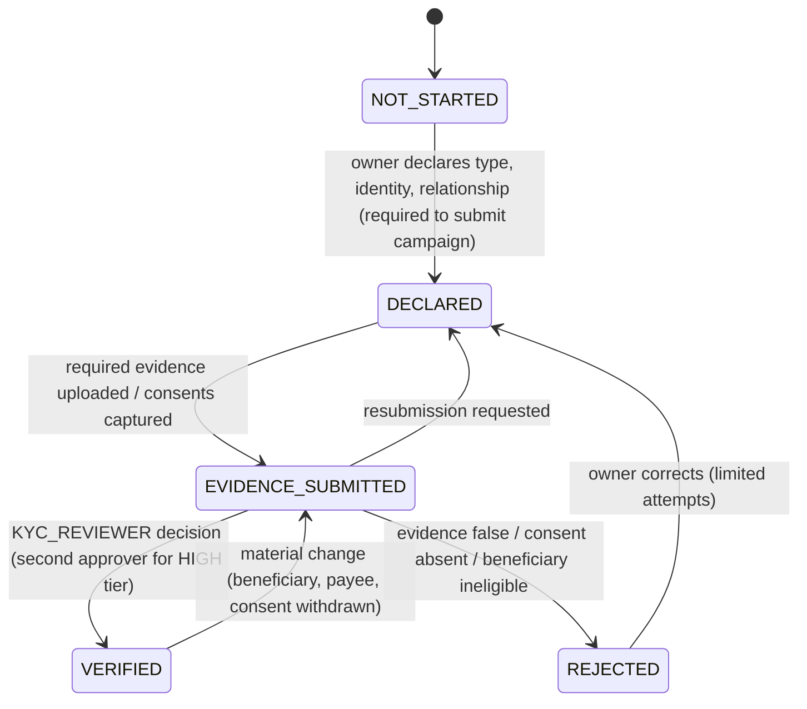

# FundZim Beneficiary Verification (Stage 1 design)

> **Status:** Stage 1 design. Stages 5 and 6 implement it, and Stage 11 enforces it at payout.
> This document is not legal advice. Where it mentions legal requirements, it records what the cited source
> says; how that applies to FundZim is `LEGAL_REVIEW_REQUIRED`.
>
> **Related:** [ADR-016](../adr/ADR-016-beneficiary-verification-before-payout.md),
> [kyc-architecture.md](kyc-architecture.md), [kyb-architecture.md](kyb-architecture.md),
> [campaign-approval-policy.md](campaign-approval-policy.md) (`BENEFICIARY_DECLARED`,
> `BENEFICIARY_RELATIONSHIP`), [payout-eligibility-and-controls.md](../payments/payout-eligibility-and-controls.md)
> (EC-04, EC-05), [data-protection-assessment.md](data-protection-assessment.md),
> [identity-data-protection.md](../security/identity-data-protection.md).

---

## 1. Core principle

The **campaign owner** is the person or organisation that creates and runs the campaign. The **beneficiary**
is who the money is for. They are often different people, and FundZim models them as **separate entities**:

- a parent raises money for a child's operation;
- a school raises fees for a named student;
- a community organiser raises money for a hospital patient's bill;
- a family member raises money for a funeral.

The binding rule, per ADR-016, is that **no payout is made unless the campaign's beneficiary is `VERIFIED`**,
or the beneficiary is the verified owner (`SELF`). Any exception needs COMPLIANCE approval with maker-checker,
a recorded reason, and an LR-024 position.

Verifying the owner proves who is asking. Verifying the beneficiary proves that:

1. the beneficiary exists;
2. the need is real;
3. the owner has the authority, or the beneficiary's consent, to raise on their behalf;
4. the money will reach the beneficiary or the institution serving them.

## 2. Beneficiary types

| `beneficiary_type` | Who receives the payout (default) | Owner's required authority | Example |
|---|---|---|---|
| `SELF` | Owner (`PAYOUT_VERIFIED`) | n/a | "Help me pay my own hospital bill" |
| `INDIVIDUAL_OTHER` | The beneficiary (verified individual), **or** a verified institution payee | Beneficiary's written consent | Friend raises money for a neighbour's medical bill |
| `MINOR` | Verified institution payee (school, hospital) preferred; otherwise the parent or guardian owner | Verified parent or legal guardian status; the owner must be the parent or guardian, or act with their written consent | Parent for a child's surgery; school for a student's fees |
| `INCAPACITATED_ADULT` | Verified institution payee, or the legal representative | Legal representative evidence (court order, power of attorney) or next-of-kin declaration plus institution confirmation (LR-015) | Relative raises money for an unconscious patient's ICU costs |
| `DECEASED_ESTATE_OR_FAMILY` | Funeral parlour (verified institution payee), the estate representative, or the verified family member owner | Relationship to the deceased + death evidence | Funeral costs |
| `INSTITUTION` | The institution's verified account | Institution confirmation of the need (invoice, quotation, fee statement) | Raise money directly for a hospital, school or funeral parlour invoice |
| `ORGANISATION` | Organisation's verified account (KYB) | Representative authority ([kyb-architecture.md §3](kyb-architecture.md)) | A charity's programme campaign |
| `COMMUNITY_GROUP` | A verified organisation account, or a verified individual treasurer acting for a documented group | Group constitution or minutes naming a treasurer; fundraising authority (§7) | A borehole for a village |

`beneficiary_verification` ∈ `NOT_STARTED`, `DECLARED`, `EVIDENCE_SUBMITTED`, `VERIFIED`, `REJECTED`.



When verification is required:

- A campaign can be **published** while the beneficiary is `EVIDENCE_SUBMITTED`, if the policy for its
  category and tier allows it ([campaign-approval-policy.md §4](campaign-approval-policy.md)). This lets
  urgent funeral and medical campaigns start collecting.
- **Payouts always require `VERIFIED`** (EC-04).

## 3. Evidence and authorisation per beneficiary type

Every item below is stored as an `evidence_records` row
([audit-evidence-model.md §2](audit-evidence-model.md)). Health and identity evidence is classified C3.

| Type | Beneficiary identity | Need evidence (category-specific) | Authority / consent evidence | Institution confirmation |
|---|---|---|---|---|
| `SELF` | Owner's KYC | Per category ([campaign-approval-policy.md §4](campaign-approval-policy.md)) | n/a | Where the payee is an institution |
| `INDIVIDUAL_OTHER` | Name, DOB, ID number (KYB-person standard), plus the beneficiary's phone, verified by OTP where possible | Per category | **Beneficiary's written consent** to the campaign, to publishing their story and data, and to any health data (§4); captured by OTP-confirmed e-consent on the beneficiary's own phone, or a signed form | Required if paid to an institution |
| `MINOR` | Child's name and date of birth. The ID number is optional; the birth certificate number is stored C3. | Per category | **Guardianship evidence** (birth certificate, adoption, custody or guardianship order) linking the owner, or the consenting parent, to the child. Verified parental or guardian **consent** (§4). | Strongly preferred (school or hospital) |
| `INCAPACITATED_ADULT` | As for `INDIVIDUAL_OTHER` | Medical confirmation of the incapacity and the need | Court order or power of attorney, or next-of-kin declaration + institution confirmation (LR-015) | Required |
| `DECEASED_ESTATE_OR_FAMILY` | Deceased's name; owner's relationship | Death certificate or burial order, or a funeral parlour or hospital letter (urgent path: the parlour quotation first, the death certificate within `funeral.docs_grace` days) | Relationship declaration; another family member's confirmation for HIGH tier | Funeral parlour quotation (preferred payee) |
| `INSTITUTION` | Institution KYB-lite (§6) | Invoice, quotation or fee statement in the beneficiary's name | Owner's relationship to the person served (if a person is named) | **Required:** independent confirmation (§6) |
| `ORGANISATION` | Organisation KYB | Programme description | Representative authority | n/a |
| `COMMUNITY_GROUP` | Group details; treasurer KYC | Project quotation | Constitution or minutes; fundraising authority (§7) | Supplier quotation |

Review is done by `KYC_REVIEWER`, using `beneficiary.verification.decide`
([operational-controls.md §1](operational-controls.md)). For `HIGH`-tier categories such as medical, and for
any `MINOR` campaign, `VERIFIED` requires a second reviewer.

## 4. Consent, including minors and health data

The applicable rules are in the CDPA [Chapter 12:07] and SI 155 of 2024. These were Veritas copies, accessed
2026-10-08, confidence HIGH (research R2-21, R2-22):

- Health information is "sensitive data". Processing sensitive data requires the data subject's
  **consent in writing** (s 11(1)). For health data, s 12(1) and (4) add that, absent written consent, it may
  only be processed "under the responsibility of a health-care professional".
- A "child" is any person under 18 (s 3). A child's rights are exercised by "his or her parents or legal
  guardian" (s 26). The controller must not process a child's data "without the consent of the parent or
  legal guardian", and must make "reasonable efforts to verify that consent is given or authorised by the
  parent or legal guardian" (SI 155 s 10(5)).
- The POTRAZ children's guideline suggests verifying guardianship with "birth certificates, adoption orders,
  custody orders, or guardianship orders". It also suggests prior POTRAZ authorisation for cross-border
  transfer of minors' data to countries without adequate protection. (R2-21; HIGH-MEDIUM, because guidelines
  "do not have the force of law".)

Provisional design rules (LR-070):

1. **A campaign organiser's consent is not the beneficiary's consent.** Unless the owner is the beneficiary,
   or the beneficiary's legal representative or guardian, the beneficiary's own written consent is required
   before health data is published or stored. This follows the R2-21 interpretation.
2. **Consent records.** Each consent is recorded in `kyc.consents`:
   - consent type: `CAMPAIGN_PUBLICATION`, `HEALTH_DATA`, `MINOR_DATA`, or `DATA_SHARING_INSTITUTION`;
   - who consented, and in what capacity: `SELF`, `PARENT`, `GUARDIAN`, or `LEGAL_REP`;
   - the method: `OTP_ECONSENT` or `SIGNED_FORM`;
   - the text version, a timestamp, and the evidence id.

   Withdrawal is recorded as a new row and triggers the material-change path (§2 state diagram). Whether
   OTP e-consent counts as "in writing" is LR-063 (→ LR-058)/LR-070.
3. **Minimisation for minors.** The public campaign page:
   - shows only a first name or a chosen display name, never the child's full name, school name or exact
     location;
   - never shows birth certificate or ID numbers.

   Photos of a minor need explicit guardian consent and are flagged for a privacy review (`PRIVACY_REVIEW`
   check). Medical detail is summarised, not shown as raw documents. Documents always stay in
   `private-kyc` and are never shown publicly.
4. **Data residency.** Minors' data is processed in-region where possible. Any vendor or CDN path outside
   Zimbabwe that carries a minor's personal data needs the LR-070 position on prior POTRAZ authorisation.
   Public campaign pages are served via CDN, so this has to be decided before Stage 7.
5. **Withdrawal of consent.** If the beneficiary or guardian withdraws consent, the campaign is unpublished
   (moved to `SUSPENDED`) pending review. Funds are handled under the cancelled-campaign policy (LR-019/PD-04).
   Financial records are retained per legal obligations, not deleted ([identity-data-protection.md §7](../security/identity-data-protection.md)).

## 5. Payout destination types

Every payout goes to exactly one `payout_destination`, with a `payee_type`:

| `payee_type` | Allowed for beneficiary types | Ownership verification | Notes |
|---|---|---|---|
| `OWNER` | `SELF`; `MINOR` (owner is the guardian); `DECEASED_ESTATE_OR_FAMILY` (owner is family); `COMMUNITY_GROUP` (owner is the treasurer) | Name match to the owner's KYC (`PAYOUT_DESTINATION_OWNERSHIP`) | Owner must be `PAYOUT_VERIFIED` |
| `BENEFICIARY` | `INDIVIDUAL_OTHER`; `INCAPACITATED_ADULT` (legal representative's account) | Beneficiary verified to IDENTITY standard + name match | The beneficiary needs a personal account, or a KYB-person record with a verified destination |
| `INSTITUTION` | Any; preferred for `MINOR`, `INCAPACITATED_ADULT`, medical and funeral | §6 | Third-party payee: LR-024 |
| `ORGANISATION` | `ORGANISATION`, `COMMUNITY_GROUP` | `ORG_PAYOUT_ACCOUNT` ([kyb-architecture.md](kyb-architecture.md)) | Bank account in the organisation's name |

Never allowed:

- a destination in the name of a person who is neither the owner, the verified beneficiary, nor a verified
  institution;
- "my cousin's EcoCash number because mine is blocked".

Changing a destination always triggers `DESTINATION_HOLD`, cooling-off and re-verification (EC-05, EC-06).

## 6. Institution payee verification (KYB-lite)

Institutions such as hospitals, clinics, schools, universities and funeral parlours are verified once, then
reused across campaigns (`institution_payees` registry):

1. **Identity.**
   - Legal name and registration (health institution registration, school registration, or company
     registration for a funeral parlour).
   - Physical address.
   - Independent contact details, obtained from a public source and **not** from the campaign owner.
2. **Account.**
   - A bank account in the institution's exact registered name, confirmed by a bank letter or a provider
     name enquiry (PCR).
   - Wallets are allowed only for small institutions, by policy.
3. **Need confirmation per campaign.**
   - A FundZim reviewer contacts the institution through the independent contact details.
   - The reviewer confirms the patient, student or deceased, the amount, and the account reference to quote
     on the payout.
   - The confirmation is recorded as an evidence record (call log or email).
4. **Payment reference.** The payout carries the institution's invoice or student number as the reference, so
   the institution can match it.
5. **Overpayment.** When raised funds exceed the confirmed invoice:
   - pay the invoice amount only;
   - the surplus stays in the campaign;
   - its disposition is per policy (pay to the owner if verified, refund, or a further confirmed invoice):
     **PD-27** (see also LR-019).

Paying a third party (the institution) rather than the person raising the money is the preferred pattern for
risk reasons, because the money reaches the need directly. Whether it is lawful and what the payee
requirements are is **LR-024**.

## 7. Fundraising authority for individual "for others" campaigns

The PVO Act as amended by Act 1/2025 contains these provisions (Veritas consolidation, accessed 2026-10-08;
HIGH for the text; validity disputed, MEDIUM; R2-34):

- s 6(3) and s 23(1): collecting contributions from the public for PVO objects (including the needs of
  "persons or families", and charity to those "in distress") is an offence, unless it is done for a
  registered PVO, for an excluded body, or under a s 8 temporary authority.
- s 8: temporary authority lasts up to 90 days, plus one extension of up to 90 days.

**Interpretation, not a conclusion.** An individual raising money for **another person's** medical bills
appears to be within scope. Raising money for **oneself** is less clear. This is **LR-068** (→ LR-046–LR-048), a
**potential launch blocker** for `INDIVIDUAL_OTHER`, `MINOR`, `INCAPACITATED_ADULT` and `COMMUNITY_GROUP`
campaigns by individuals.

Provisional design, which keeps every option open until counsel answers:

- Every campaign records a `fundraising_authority` ([kyb-architecture.md §4](kyb-architecture.md)). For
  individual campaigns the basis is one of:
  - `SELF_FUNDRAISING`: raising money for oneself. "No authority needed" is **UNCONFIRMED**.
  - `SECTION_8_AUTHORITY`: Registrar's number and validity window. The campaign end date must not be later
    than the authority's expiry. The payout account must match any account disclosed to the Registrar.
  - `REGISTERED_PVO` (fiscal sponsor model): a registered PVO partner authorises the campaign. The payee is
    then the PVO or its verified institution payee, and the PVO's own SI 98 duties apply.
- Policy switch `campaign.individual_for_others.enabled` defaults to **false** until LR-068 (→ LR-046–LR-048) is answered.
  It is a business decision under **PD-27**. Possible launch configurations:
  - (a) `SELF` and organisation campaigns only;
  - (b) for-others campaigns allowed only with a s 8 authority;
  - (c) for-others campaigns via a PVO fiscal sponsor.
- The s 8 conditions are mapped to controls:

  | Condition (R2-34) | Control |
  |---|---|
  | Funds paid into a disclosed bank account | Payout destination must match the account disclosed to the Registrar (EC-05) |
  | Receipts and donation lists | FundZim can generate the donation list (subject to LR-069 (→ LR-049) for donor data) |
  | Spend within 60 days of expiry | Payout reminders, plus a `fundraising_authority_expiry` monitoring alert |

## 8. Data model (conceptual)

```sql
-- public.campaign_beneficiaries — id, campaign_id UNIQUE (one primary beneficiary per campaign at launch),
--   beneficiary_type, display_name (public, minimised), beneficiary_verification, verified_at, verified_by,
--   second_verifier_id, kyc_person_ref uuid NULL (→ kyc.identities, C3), institution_payee_id NULL,
--   organisation_id NULL, relationship_code, fundraising_authority_id NOT NULL, policy_version
-- kyc.beneficiary_evidence — id, campaign_beneficiary_id, evidence_type, evidence_record_id, submitted_at
-- kyc.consents (shared with kyc-architecture §11) — includes subject (beneficiary) and grantor (guardian/self)
-- public.institution_payees — id, legal_name, institution_type, registration_ref, independent_contact (C2),
--   verification_status, verified_at, payout_destination_id
-- public.payout_destinations — id, payee_type, owner_user_id / beneficiary_id / institution_payee_id / organisation_id,
--   rail, account_ref_enc (C3), account_name, status, verified_at, version
```

Constraints:

- Exactly one payee-reference column is non-null, matching `payee_type`.
- `campaign_beneficiaries.beneficiary_verification = 'VERIFIED'` is required by the payout eligibility check
  EC-04. It is enforced in the service and backed by a constraint trigger on `payouts` insert
  ([payout-eligibility-and-controls.md §8](../payments/payout-eligibility-and-controls.md)).

## 9. New legal questions and decisions

Register: [open-legal-questions.md](open-legal-questions.md).

| ID | Question / decision | Blocks |
|---|---|---|
| **LR-070** | Consent for minors' data and beneficiaries' health data in public campaigns. Questions: what amounts to verified parental or guardian consent, and does OTP e-consent count; whether a parent may publish a child's medical details; whether the beneficiary's own written consent is required when the organiser is not their representative; minors' data on foreign CDNs or vendors and prior POTRAZ authorisation; Children's Act limits on publishing a child's identity (research checklist U27). Extends LR-014 and LR-015. | Publishing `MINOR` and medical campaigns; Stage 7 CDN design |
| **PD-27** | Launch scope for individual campaigns raising for others, given LR-068 (→ LR-046–LR-048): options (a), (b) or (c) in §7. Also the disposition of surplus funds above a confirmed institution invoice. Approving authority: founders, on counsel's advice. | Campaign types at launch |

LR-024 (third-party payees), LR-015 (consent and authority) and LR-019 (surplus or cancelled funds) remain
the main existing references.

## 10. Sources cited (accessed 2026-10-08; research file R2)

| Ref | Source | URL | Confidence |
|---|---|---|---|
| R2-21, R2-22 | Cyber and Data Protection Act [Chapter 12:07] (Veritas) | `https://www.veritaszim.net/sites/veritas_d/files/Cyber%20%26%20Data%20Protection%20Act%20Cap1207%20No%205%20of%202021%20gaz%202022-03-11.pdf` | HIGH |
| R2-21 | S.I. 155 of 2024 (Veritas) | `https://www.veritaszim.net/sites/veritas_d/files/SI%202024-155%20Cyber%20and%20Data%20Protection%20(Licensing%20of%20Data%20Controllers%20and%20Appointment%20of%20Data%20Protection%20Officers)%20Regulations,%202024.pdf` | HIGH |
| R2-21 | POTRAZ guideline on processing children's personal information (Veritas) | `https://www.veritaszim.net/sites/veritas_d/files/02%20Processing%20of%20Children%27s%20Personal%20Information.pdf` | HIGH-MEDIUM |
| R2-40 | Children's Amendment Act 2023 | `https://commons.laws.africa/akn/zw/act/2023/8/media/publication/zw-act-2023-8-publication-document.pdf` | HIGH |
| R2-33, R2-34 | PVO Act [Chapter 17:05], Veritas consolidation to 11 Apr 2025 | `https://www.veritaszim.net/sites/veritas_d/files/Private%20Voluntary%20Organisations%20Act%20Cap%2017,05%20(Consolidated%20to%202025.04.11).pdf` | HIGH (text) / MEDIUM (validity) |
| R2-34 | S.I. 97 of 2026, PVO (Board and General) Regulations, s 16 | `https://www.fiu.co.zw/wp-content/uploads/2025/05/SI-97of2026-PVO-Board-General.pdf` | HIGH |
