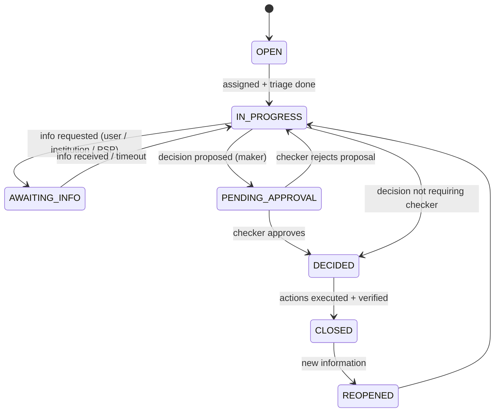
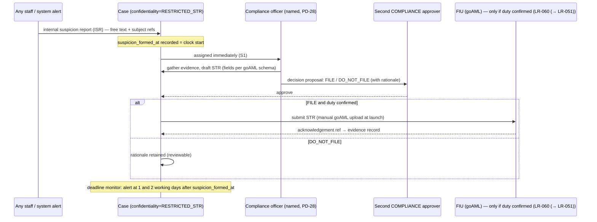

# FundZim Compliance Case Management (Stage 1 design)

> **Status:** Stage 1 design. Stage 13 builds the case engine and Stage 14 builds the admin portal UI.
> Stage 5 and Stage 11 need a minimal version for KYC reviews and payout holds. Whether FundZim has statutory
> reporting duties (STR, CTR, sanctions) depends on **LR-060** (→ LR-051). This design supports internal escalation in
> every case, and external filing where a duty is confirmed.
>
> **Related:** [aml-risk-framework.md](aml-risk-framework.md), [transaction-monitoring.md](transaction-monitoring.md),
> [sanctions-screening.md](sanctions-screening.md), [kyc-architecture.md](kyc-architecture.md),
> [operational-controls.md](operational-controls.md), [audit-evidence-model.md](audit-evidence-model.md),
> [incident-response-workflows.md](incident-response-workflows.md),
> [payout-eligibility-and-controls.md](../payments/payout-eligibility-and-controls.md) (holds §5, EC-12/EC-13),
> [refund-and-dispute-architecture.md](../payments/refund-and-dispute-architecture.md),
> [identity-data-protection.md](../security/identity-data-protection.md).

---

## 1. Purpose

A **case** is the single place where FundZim investigates and decides a compliance, fraud or risk concern
about one or more subjects. Cases provide:

- one owner, one SLA clock and one evidence trail per concern;
- a controlled way to place and release **holds** and **freezes**. These are new records plus ledger moves,
  and history is never edited;
- maker-checker on consequential decisions;
- confidential handling of suspicious-transaction work, with tipping-off controls;
- metrics and QA.

Cases are separate from **disputes and chargebacks**, which are provider-driven financial processes
([refund-and-dispute-architecture.md](../payments/refund-and-dispute-architecture.md)) and from **incidents**,
which are operational and security events ([incident-response-workflows.md](incident-response-workflows.md)).
These can link to each other: a dispute pattern can open a fraud case, and a data breach can open cases on
affected accounts.

## 2. Case entity

```sql
-- compliance.cases
id uuid PK,                                    -- UUIDv7
case_number text UNIQUE NOT NULL,              -- human-friendly, e.g. CMP-2026-000123 (non-sequential exposure is internal only)
case_type text NOT NULL,                       -- §3
severity text NOT NULL CHECK (severity IN ('S1','S2','S3')),
state text NOT NULL,                           -- §4
confidentiality text NOT NULL CHECK (confidentiality IN ('STANDARD','RESTRICTED_STR')),  -- §6
opened_at timestamptz NOT NULL, opened_by_type text, opened_by_id uuid, source text,      -- 'alert'|'screening'|'kyc_review'|'report'|'staff'|'regulator_request'|'provider'
assigned_to uuid, assigned_at timestamptz, team text,                                     -- COMPLIANCE | KYC_REVIEWER | FINANCE
sla_due_at timestamptz,                        -- from PD-28 policy per type/severity
blocks_payouts boolean NOT NULL DEFAULT false, -- read by EC-13
decision text, decision_reason_code text, decided_by uuid, second_approver_id uuid, decided_at timestamptz,
closed_at timestamptz, closed_by uuid,
qa_sampled boolean NOT NULL DEFAULT false, qa_result text
-- compliance.case_subjects — case_id, subject_type ('user'|'organisation'|'campaign'|'beneficiary'|'payout_destination'|'payment'|'payout'|'donor_guest'), subject_id, role ('primary'|'related')
-- compliance.case_events — append-only timeline: id, case_id, event_type, actor, occurred_at, payload (no C3), evidence_ids uuid[]
-- compliance.case_notes — append-only; C3 (RESTRICTED); corrections are new notes referencing the old one
-- compliance.case_links — case_id, linked_type ('alert'|'hold'|'dispute'|'incident'|'refund'|'str_record'|'regulator_request'), linked_id
```

All case tables are append-only in substance. Only `state`, `assigned_*`, `decision*`, `closed_*` and the QA
fields change, through service methods that also write `case_events`. Each change emits an audit event
(`case.*`), consistent with [audit-evidence-model.md](audit-evidence-model.md).

## 3. Case types

| `case_type` | Opened by | Default severity | Default `blocks_payouts` | Typical decisions |
|---|---|---|---|---|
| `KYC_REVIEW` | Verification attempt routed to review; re-verification trigger | S3 | Only for the paused scope | Approve, approve with conditions, resubmit, reject, escalate |
| `BENEFICIARY_REVIEW` | Beneficiary evidence needs review | S3 (S2 for HIGH tier) | yes (EC-04 already blocks) | Verify / reject |
| `SANCTIONS` | Screening `POTENTIAL_MATCH` | S1 | yes | False positive / confirmed match ([sanctions-screening.md §6](sanctions-screening.md)) |
| `PEP_EDD` | PEP determined | S2 | yes until EDD complete | Approve with conditions / decline |
| `FRAUD_CAMPAIGN` | TM-15, reviewer, institution denial, donor reports | S1/S2 | yes | Clear; request evidence; suspend; freeze; cancel + refunds (LR-019) |
| `ACCOUNT_TAKEOVER` | TM-16, user report | S1 | yes (`ACCOUNT_HOLD`) | Recover account; reverse unauthorised changes; restore |
| `AML_MONITORING` | TM rules (velocity, round-tripping, structuring, high-risk jurisdiction) | S2 | per rule | Clear; EDD; restrict; offboard; STR consideration |
| `PAYOUT_REVIEW` | Payout routed to `PENDING_REVIEW` with a flag that needs investigation, beyond plain approval | S2 | yes (that payout) | Approve via payout approval; reject; hold |
| `REFUND_ABUSE` / `DISPUTE_PATTERN` | TM-12, TM-13 | S1/S2 | yes | Restrict refunds; freeze; recovery (with FINANCE) |
| `FUNDRAISING_AUTHORITY` | Authority expired or invalid; PVO status concern ([kyb-architecture.md §4](kyb-architecture.md)) | S2 | yes | Renew evidence; complete campaign; suspend |
| `REGULATOR_REQUEST` | FIU, Registrar, POTRAZ, police, court request | S1/S2 | per request | Respond via evidence export (maker-checker, LR-032) |
| `DATA_SUBJECT_REQUEST_RESTRICTED` | A data-subject request (CDPA s 14) touching a subject with `RESTRICTED_STR` confidentiality | S2 | n/a | Respond per counsel (LR-072) |

## 4. States



- **Triage** (OPEN → IN_PROGRESS): confirm type and severity, link subjects, decide on protective holds
  (§5), and set confidentiality.
- **Decisions requiring a checker:**
  - freeze, unfreeze;
  - offboard or reject for fraud;
  - confirmed sanctions match, or a sanctions false positive at S1;
  - STR filing decision;
  - releasing a compliance hold above `<case.hold_release.dual_min>`;
  - any decision that moves money (refund disposition, recovery write-off).

  The checker must be a different person from the maker, with no conflict
  ([operational-controls.md §3](operational-controls.md)).
- **Closure** requires a closure memo, the reason code, confirmation that all linked holds are resolved or
  deliberately kept with an owner, and evidence of executed actions (holds, ledger journals, notifications).

## 5. Holds and freezes: preserving financial history

Case decisions act on money **only** through existing mechanisms that add records:

| Action | Mechanism | Ledger effect | Reversal |
|---|---|---|---|
| Pause payouts for a subject | `PAYOUT_HOLD` / `COMPLIANCE_HOLD` record ([payout-eligibility-and-controls.md §5](../payments/payout-eligibility-and-controls.md)) | None, or for campaign-scope `COMPLIANCE_HOLD`: `campaign_payable → campaign_held` (`hold:{id}:applied`) | Release event (new row) + inverse journal if applied |
| Freeze a campaign | Campaign transition → `FROZEN` ([PRODUCT.md §6](../PRODUCT.md)) | `campaign_payable → campaign_held` (`campaign:{id}:freeze:{n}`, [LEDGER.md §6.8](../LEDGER.md)) | Unfreeze (maker-checker) → inverse journal (`…:unfreeze:{n}`) |
| Stop an approved payout | Hold before `SUBMITTED` returns it to `PENDING_REVIEW`. After `SUBMITTED`, only provider-supported cancel is possible ([payout-lifecycle.md](../payments/payout-lifecycle.md)). | Per payout state journals | — |
| Ask the PSP to block funds | Provider instruction (PCR-027 — freeze or block capability) recorded as `case_links` + evidence | None until the provider reports the movement | Provider instruction to release |
| Refund donors after confirmed fraud | Refund requests through [refund-and-dispute-architecture.md](../payments/refund-and-dispute-architecture.md) with FINANCE approval | Refund journals | — |

Absolute rules:

- **No case action edits or deletes** a payment, ledger entry, payout, audit event or evidence record.
- **The ledger never shows money that disappeared without a journal.** Every hold or freeze that changes
  availability posts a balanced journal per currency.
- A **hold always names its case.** A hold without a case raises an alert, unless it is an automatic system
  hold with an `alert_id`, which must be attached to a case within `<case.auto_hold_attach_max>`.

Owner-facing communication during holds uses neutral templates ("Your payouts are paused while we complete a
review"), consistent with [payout-eligibility-and-controls.md §5](../payments/payout-eligibility-and-controls.md).
How long a hold may last without a decision is LR-084.

## 6. Suspicious transaction reporting workflow and tipping-off controls

What the law says. MLPC Act, FIU-hosted consolidation, accessed 2026-10-08, HIGH (R2-06, R2-07):

- s 30(1): institutions in scope and their staff must report suspicions "promptly, but not later than three
  working days after forming the suspicion", including for attempted transactions.
- s 31(2): no one may disclose to the customer or a third party that a report "will be, is being or has been
  submitted", or that an investigation is under way.
- s 32 protects the reporter's identity. s 33 protects good-faith reporters.
- Penalties under s 34 go up to USD 100,000 and/or 3 years' imprisonment.

PVOs have their own deadlines under S.I. 98 of 2026: 3 working days in s 29, but "within 72 hours" for TF
red flags in the Second Schedule, an internal inconsistency (R2-38, HIGH).

Whether FundZim files reports itself is **LR-060** (→ LR-051). The workflow below runs in every case. Until LR-060 (→ LR-051) is
answered, its output is an **internal decision record**, plus escalation to the PSP where the contract
provides for it (PCR).



Controls:

1. **Restricted confidentiality.** A case flagged `RESTRICTED_STR` is visible only to holders of
   `str.prepare` / `str.approve` (named COMPLIANCE staff). Every other role sees the subject's holds as
   "compliance review" with no reason. Support tooling shows no case details. List views exclude these cases
   for everyone else, and their existence is hidden.
2. **Deadline clock.** `suspicion_formed_at` is captured when the internal suspicion report is created or
   when COMPLIANCE marks a case as suspicious. Working days are computed against a Zimbabwe public-holiday
   calendar, which is configuration. Alerts fire at day 1 and day 2. A breach is an S1 compliance incident.
3. **Tipping-off.**
   - Templates for owners, donors and beneficiaries are pre-approved, neutral and reason-free.
   - Staff may not use free-text messaging to subjects of `RESTRICTED_STR` cases. The system disables
     free-text replies on those tickets.
   - Data-subject access requests touching such subjects route to `DATA_SUBJECT_REQUEST_RESTRICTED`. They
     never auto-export case notes, screening hits or STR records.
   - The interaction between CDPA access rights and MLPC s 31 is **LR-072**.
4. **STR records are C3**, stored in the private bucket under `reports/` with their own access policy. They
   are never in general audit metadata ([audit-evidence-model.md §5](audit-evidence-model.md)). Their
   retention class is `CASE`, and MLPC s 24(2)(d) gives at least 5 years for STR copies (R2-08) if in scope;
   the period is pending LR-012.
5. **No influence by the subject's status.** Holds placed on a `RESTRICTED_STR` subject are not released
   just because the STR was filed. Release follows the case decision. FundZim does not wait for FIU "consent"
   unless counsel confirms such a mechanism exists.
6. **CTR returns.** If LR-060 (→ LR-051) and LR-073 (→ LR-052) confirm a duty, monthly CTR or nil returns are produced from ledger
   and payment data. This report is defined in Stage 17.

## 7. Assignment, SLAs and workload

- **Queues** by team and type. Assignment is round-robin, or claimed with a cap per reviewer.
- **Conflict checks** on assignment: the reviewer must not be the subject, linked to the subject, a donor
  above `<conflict.donor_min>` to the campaign, or the maker of the decision under review.
- **SLA targets** per (type, severity) are policy configuration and a business decision, **PD-28**. Two
  timing constraints are fixed by design:
  - sanctions potential matches must be reviewed fast enough to meet the ≤ 24-hour freeze design target
    ([sanctions-screening.md §6](sanctions-screening.md));
  - STR decisions must meet the 3-working-day limit if LR-060 (→ LR-051) applies.
- **Escalation.** SLA breach goes to the COMPLIANCE lead. S1 with no assignee within
  `<case.s1_unassigned_max>` pages the on-call COMPLIANCE contact.

## 8. Evidence

- Evidence is captured as `evidence_records` ([audit-evidence-model.md §2](audit-evidence-model.md)) and
  linked through `case_events.evidence_ids`. Examples:
  - documents;
  - call logs with institutions;
  - PSP statements;
  - screening results;
  - alert facts snapshots;
  - correspondence;
  - goAML acknowledgements.
- Opening a case of type `SANCTIONS`, `FRAUD_CAMPAIGN`, `AML_MONITORING` or `REGULATOR_REQUEST` places
  **legal hold** on the linked subjects' evidence automatically. The hold is maker-checker to release
  (`evidence_holds`).
- **Exports to authorities** use `evidence.exported`, require maker-checker, and are packaged with a manifest
  of hashes. The legal basis for the request is recorded (LR-032).

## 9. Quality assurance and metrics

QA:

- A random sample of closed cases per reviewer per month (`<case.qa_sample_bp>`) is reviewed by another
  COMPLIANCE officer, along with **every** closed S1 and every false-positive sanctions disposition.
- Findings feed training and rule tuning.

Metrics, reported monthly:

| Metric | Use |
|---|---|
| Open cases by type and severity; age distribution | Capacity |
| SLA attainment by type | PD-28 tracking |
| Holds active, average hold age, holds without case (should be 0) | Customer impact, control health |
| Decisions overturned at QA | Quality |
| STR considerations, filed vs not filed, deadline breaches (should be 0) | Regulatory risk |
| Time from potential sanctions match to decision | 24-hour design target |
| Fraud cases detected before vs after first payout | Effectiveness |

## 10. New legal questions

Register: [open-legal-questions.md](open-legal-questions.md).

| ID | Question | Blocks |
|---|---|---|
| **LR-072** | How should data-subject rights under the CDPA (s 14: access, objection, correction; R2-23) be reconciled with the MLPC Act s 31 tipping-off prohibition and with investigation confidentiality? What may a user be told about holds, suspensions or account closures linked to a suspicion? | DSAR handling for restricted cases; user messaging templates |

LR-060 (→ LR-051) (accountable status), LR-032 (regulator requests), LR-084 (hold duration and communication) and LR-012
(retention) remain the main existing references.

## 11. Sources cited (accessed 2026-10-08; research file R2)

| Ref | Source | URL | Confidence |
|---|---|---|---|
| R2-06–R2-08 | MLPC Act s 24, s 30–34 (FIU-hosted consolidation) | `https://www.fiu.co.zw/wp-content/uploads/2025/05/MLPCAct0924updated.pdf` | HIGH |
| R2-23 | CDPA s 14 (Veritas) | `https://www.veritaszim.net/sites/veritas_d/files/Cyber%20%26%20Data%20Protection%20Act%20Cap1207%20No%205%20of%202021%20gaz%202022-03-11.pdf` | HIGH |
| R2-38 | S.I. 98 of 2026 s 29 and Second Schedule | `https://www.fiu.co.zw/wp-content/uploads/2025/05/SI-98of2026-PVO-Risk-Based-Supervision.pdf` | HIGH |
