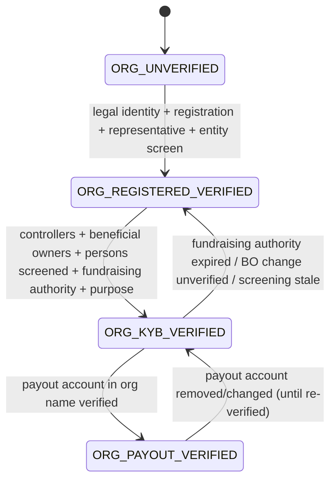

# FundZim KYB Architecture: Organisation Verification (Stage 1 design)

> **Status:** Stage 1 design; Stage 5 implements it. This is not legal advice. Cited sources state what the
> law says; how each applies to FundZim and its organisation users is `LEGAL_REVIEW_REQUIRED`. The register of
> open legal questions is [open-legal-questions.md](open-legal-questions.md).
>
> **Related documents:** [kyc-architecture.md](kyc-architecture.md) (representatives are individuals),
> [beneficiary-verification.md](beneficiary-verification.md), [campaign-approval-policy.md](campaign-approval-policy.md)
> (`KYB_COMPLETE`), [aml-risk-framework.md](aml-risk-framework.md), [sanctions-screening.md](sanctions-screening.md),
> [identity-data-protection.md](../security/identity-data-protection.md),
> [payout-eligibility-and-controls.md](../payments/payout-eligibility-and-controls.md) (EC-03),
> [ADR-015](../adr/ADR-015-risk-based-identity-verification.md).

---

## 1. Scope

"Organisation" means any non-individual campaign owner. The organisation types at launch are:

- company
- trust
- private voluntary organisation (PVO)
- church or faith-based organisation
- school (state or private)
- health institution
- community-based organisation or association
- sports club
- other

Which types may fundraise, and for which purposes, is **PD-12** together with **LR-013** and **LR-068** (→ LR-046–LR-048).
Launch enables a type only after its review policy (§5) and legal position are recorded.

KYB must establish five things:

1. The organisation exists and is what it claims to be (legal identity, registration).
2. Who controls it: directors, trustees, office bearers, beneficial owners, controllers.
3. Who may act for it on FundZim (authorised representatives).
4. Whether it may lawfully collect contributions from the public for the campaign's purpose (fundraising
   authority, §4).
5. Where its money goes: payout accounts held in the organisation's name.

## 2. Organisation verification levels and status overlay

These parallel the individual model ([kyc-architecture.md §3](kyc-architecture.md)). Level and status are
separate fields.

| `org_verification_level` | Checks that must PASS and be current | Unlocks (default policy) |
|---|---|---|
| `ORG_UNVERIFIED` | Organisation profile created by an `IDENTITY_VERIFIED` individual | Draft campaigns under the organisation's name. They cannot be submitted. |
| `ORG_REGISTERED_VERIFIED` | `ORG_LEGAL_IDENTITY`, `ORG_REGISTRATION` (registry or registrar evidence), `ORG_REPRESENTATIVE_AUTHORITY` for the submitting representative, `ORG_SCREEN_ENTITY` CLEAR | Submit campaigns in `STANDARD`-tier categories, if the type's policy allows it |
| `ORG_KYB_VERIFIED` | All of the above, plus: `ORG_CONTROLLERS` (directors, trustees and office bearers identified), `ORG_BENEFICIAL_OWNERS` (identified and verified to the threshold in §3.3), every controller and BO screened (`ORG_SCREEN_PERSONS` CLEAR or CLEARED_BY_REVIEW), `ORG_FUNDRAISING_AUTHORITY` (§4) valid for the campaign, `ORG_PURPOSE` (constitution or objects consistent with the campaign) | Submit or publish campaigns in any enabled tier |
| `ORG_PAYOUT_VERIFIED` | All of the above, plus `ORG_PAYOUT_ACCOUNT` (a bank or wallet account in the organisation's registered name, ownership verified), and the payout-requesting representative holds `PAYOUT_VERIFIED` individually and has `org.payout.request` | Request withdrawals (EC-03) |

The status overlay is `ACTIVE | PENDING_REVIEW | REJECTED | SUSPENDED`. Its semantics are the same as for
individuals. An organisation in `SUSPENDED` blocks every campaign it owns: no new donations, no payouts.
Existing campaigns move to `SUSPENDED` or `FROZEN` under the campaign lifecycle ([PRODUCT.md §6](../PRODUCT.md)).



## 3. Checks and evidence

### 3.1 Check catalogue

| Code | What it establishes | Evidence (stored in evidence_records, mostly C3) | Validity / re-check |
|---|---|---|---|
| `ORG_LEGAL_IDENTITY` | Name, type, registration number, registered address, date of formation | Registration certificate, or the certificate for the relevant registry: companies registry; PVO Registrar; High Court or Deeds Registry for trusts; ministry approval for educational trusts; health institution registration | Until change notification |
| `ORG_REGISTRATION` | Registration is current and the organisation is in good standing | Registry extract or confirmation, recent annual return, PVO registration certificate. A registry lookup is used where an online registry is available (to be confirmed per registry). | `kyb.registration_max_age` (INTERNAL_RISK) |
| `ORG_PURPOSE` | Objects or constitution cover the campaign purpose | Constitution, trust deed, memorandum | Per campaign |
| `ORG_CONTROLLERS` | Directors, trustees, office bearers and executive committee | Register of directors, trustee list, latest office-bearer return. SI 97 of 2026 s 19 requires PVOs to file office-bearer returns within 21 days of elections (R2-37, HIGH). | Re-check on change notification and periodically |
| `ORG_BENEFICIAL_OWNERS` | Natural persons who own or control the organisation, at or above the configured threshold (§3.3) | Beneficial ownership declaration, registry beneficial-ownership extract where available (COBE Act s 72), shareholding structure chart | On change; periodic |
| `ORG_REPRESENTATIVE_AUTHORITY` | The individual acting on FundZim is authorised | Board resolution or letter of authority naming the person and FundZim. The representative must be `IDENTITY_VERIFIED`. | Expiry date on the authority, or `kyb.authority_max_age` |
| `ORG_SCREEN_ENTITY` | The entity is not designated | Screening result ([sanctions-screening.md](sanctions-screening.md)) | `screening.freshness` |
| `ORG_SCREEN_PERSONS` | Controllers, beneficial owners and representatives are not designated, and their PEP status is known | Screening result per person | `screening.freshness` |
| `ORG_FUNDRAISING_AUTHORITY` | The organisation may lawfully collect contributions from the public for the campaign purpose | §4 | Its own validity window |
| `ORG_PAYOUT_ACCOUNT` | The account is held in the organisation's registered name | Bank confirmation letter, provider name lookup (PCR-013 — name enquiry), cancelled cheque or statement | Until change; changes trigger `DESTINATION_HOLD` + cooling-off |
| `ORG_TAX_STATUS` (optional) | Tax registration or exemption, where the organisation claims it | ZIMRA documents | Informational only. FundZim does not issue tax receipts (LR-017). |

### 3.2 Controllers and representatives are individuals

Every controller, beneficial owner and representative has a person record in the `kyc` schema.

- **Representatives** must reach `IDENTITY_VERIFIED`, which requires their own personal account.
- **Controllers and beneficial owners who never log in** are verified at a **KYB-person** standard:
  - identity data, a document copy and screening;
  - no liveness check, because they are not interacting.

  Whether a document copy is enough without the person being present is part of LR-062.

### 3.3 Beneficial ownership thresholds: configurable REGULATORY limits

The sources use **different thresholds**. Each is a limit record (§5 of [aml-risk-framework.md](aml-risk-framework.md)).
The engine applies the **strictest** threshold that applies to the organisation's type.

| Limit key | Value | Applies to | Source (accessed 2026-10-08) | Confidence | Status |
|---|---|---|---|---|---|
| `kyb.bo_threshold.company` | holds **more than 20%** of shares or voting rights, or can appoint or remove the majority of directors, or exercises significant influence or control | Companies | COBE Act [Chapter 24:31] definition of "beneficial owner" and s 72 (Veritas consolidation to Act 8/2020), R2-16 | MEDIUM-HIGH (post-2020 amendments not checked) | REGULATORY, `LEGAL_REVIEW_REQUIRED` (LR-067 (→ LR-054)) |
| `kyb.bo_threshold.mlpc` | **25% or more** of shares or voting rights, or other control of management | Any legal person, if FundZim is an MLPC institution | MLPC Act s 2(2), s 13 (FIU-hosted consolidation), R2-05 | HIGH | REGULATORY, conditional on LR-060 (→ LR-051) |
| `kyb.bo_threshold.pvo` | a "significant or preponderant voice", including control of **25% or more** of the votes in the governing body. "Controller" includes influence "by virtue of the size of that person's contributions". | PVOs | PVO Act s 2(1), s 2(3) (Veritas consolidation to 11 Apr 2025), R2-17 | HIGH (text); Act 1/2025 validity disputed | REGULATORY, LR-067 (→ LR-054), LR-068 (→ LR-046–LR-048) |
| `kyb.trust_parties` | trustees, settlor and beneficiaries identified | Trusts | MLPC Act s 17 (particulars for trusts), R2-03 | HIGH | REGULATORY, conditional on LR-060 (→ LR-051) |

Rules:

- These values are seeded as **proposed** limit records (`approval_state = PROPOSED`) with source citations.
  They take effect only when the approval owner, COMPLIANCE (with a counsel reference), approves them.
  Until then, EC-21 (limits configured) fails closed and organisation payouts go to manual review.
- **Fallback when no natural person meets the threshold.** The senior managing official (chair, CEO or
  principal officer) is recorded as the controlling person. This is a common AML practice, not a cited
  Zimbabwean rule, and is marked as such.
- **Nominee structures and layered ownership.** These are a risk factor ([aml-risk-framework.md](aml-risk-framework.md)).
  The COBE Act s 73 prohibits concealing beneficial ownership through nominees above 20% (R2-16).
- **Registry beneficial-ownership data.** The COBE Act s 72(6) makes the Registrar-held information "public
  information" and accessible to financial institutions and DNFBPs (R2-16). Using it as corroborating evidence
  is preferred over relying only on self-declaration. Access mechanics are to be confirmed.

### 3.4 Change notifications

Organisations must notify FundZim of material changes:

- controllers
- beneficial owners
- registration status
- constitution
- bank account

Each notification triggers re-verification of the affected checks. PVO law separately requires PVOs to notify
the Registrar of material changes in beneficial ownership or control within one month (PVO Act s 13A;
SI 97 of 2026 s 14; R2-17, R2-37, HIGH). FundZim may ask for evidence that this was done when a change is
reported.

## 4. Fundraising authority (PVO Act): the organisation-side gate

Per the research brief (§16) and R2-33/R2-34 (PVO Act consolidation, accessed 2026-10-08, confidence HIGH for
the text):

- Section 6(2), as substituted by Act 1/2025: a body with PVO objects that seeks financial assistance or
  "collects contributions from the public" must not operate unless registered.
- Section 6(3): "No person shall collect contributions from the public except in terms of this Act."
- Section 23(1): collecting, or instructing another person to collect, contributions for PVO objects is an
  offence. This applies unless the collection is on behalf of a registered PVO, for an excluded body, or
  authorised under s 8.
- Exclusions include, among others:
  - "any religious body in respect of activities confined to religious work";
  - educational trusts approved by the Minister;
  - registered health institutions;
  - bodies whose benefits are exclusively for members (s 2(1)).
- SI 97 of 2026 s 12(2) adds that membership organisations must register if they solicit funds from
  non-members, or if foreign donations make up at least 20% of their funds.
- The validity of Act 1/2025 is disputed (R2-32, MEDIUM). FundZim's design neither assumes validity nor
  ignores the Act.

Each organisation campaign records one `fundraising_authority`:

| `authority_basis` | Evidence | Validation rules (provisional; LR-068 (→ LR-046–LR-048)) |
|---|---|---|
| `REGISTERED_PVO` | PVO registration number + certificate; Registrar confirmation where obtainable | Registration current; campaign purpose within registered objects (`ORG_PURPOSE`) |
| `EXCLUDED_BODY` | Declared exclusion ground from a controlled list (religious work only; state institution; approved educational trust; registered health institution; members-only body; statutory trust; other prescribed) + supporting evidence (ministerial approval, health registration) | Reviewer confirms the exclusion fits **this** campaign. Example: a church campaign for a feeding scheme is probably **not** "confined to religious work" (R2-33 interpretation), so it needs `REGISTERED_PVO` or `SECTION_8_AUTHORITY`. |
| `SECTION_8_AUTHORITY` | Registrar's written temporary authority: number, holder, purpose, start date, expiry date, conditions | Campaign `end_at` ≤ authority expiry. Section 8 authority lasts at most 90 days, extendable once by up to 90 days. SI 97 of 2026 s 16 conditions may include spending within 60 days of expiry, a bank account disclosed to the Registrar, and keeping receipts and donation lists (R2-34, HIGH). The authority holder must match the organisation, and the payout account must match any account disclosed under the conditions. |
| `NOT_REQUIRED_OTHER` | Reasoned reviewer note + COMPLIANCE approval | Exceptional; maker-checker; must cite counsel guidance once LR-068 (→ LR-046–LR-048) is answered |

Enforcement points:

- Campaign submission (`KYB_COMPLETE` in [campaign-approval-policy.md](campaign-approval-policy.md)).
- Payout eligibility: authority still valid on the payout date, or within any permitted post-expiry
  disbursement window, which is to be confirmed (LR-068 (→ LR-046–LR-048)) (EC-03/EC-12).
- Scheduled expiry monitoring:
  - **T-14 days:** warn the owner.
  - **On expiry:** stop new donations by moving the campaign to `COMPLETED` (or `SUSPENDED` for review).
    Payouts go to `PENDING_REVIEW`.

Individual "for others" campaigns use the same `fundraising_authority` structure. They are covered in
[beneficiary-verification.md §7](beneficiary-verification.md).

## 5. Review policy by organisation type (provisional)

| Type | Minimum level to publish | Extra checks | Default risk |
|---|---|---|---|
| PVO | `ORG_KYB_VERIFIED` | Registrar registration evidence; latest annual report or return where due (SI 97 of 2026 s 19); foreign-funding exposure flag for SI 98 duties (§6) | STANDARD, or HIGH if the PVO is classified high-risk under SI 98 |
| Church / faith-based organisation | `ORG_KYB_VERIFIED` | Exclusion fit or PVO registration for non-religious purposes. The FIU's 2024 NPO risk assessment rated faith-based organisations the highest-risk NPO subset for terrorist-financing abuse, although the overall sector was rated low (R2-14, HIGH). | ELEVATED |
| School | `ORG_KYB_VERIFIED` | State school (exclusion: state institution) or private school (educational trust approval or PVO registration); bursar contact verified | STANDARD |
| Health institution | `ORG_KYB_VERIFIED` | Health institution registration; payout account name equals the institution's name | STANDARD |
| Company | `ORG_KYB_VERIFIED` | Beneficial owners per the COBE threshold; purpose check (a donation campaign by a company is unusual and is reviewed for disguised commercial fundraising, which is prohibited: [PRODUCT.md](../PRODUCT.md) excludes investment and rewards) | ELEVATED |
| Community-based organisation / association | `ORG_KYB_VERIFIED` | Constitution; office bearers; fundraising authority (often `SECTION_8_AUTHORITY` or `REGISTERED_PVO`) | ELEVATED |
| Trust | `ORG_KYB_VERIFIED` | Trustees, settlor and beneficiaries (MLPC Act s 17 particulars); High Court or Deeds Registry registration. The PVO Act notes that registered trusts may still need PVO registration under s 6(2) (R2-33). | ELEVATED |

Risk tiers align with [campaign-approval-policy.md §4](campaign-approval-policy.md). Organisation risk feeds
the AML risk score ([aml-risk-framework.md §3](aml-risk-framework.md)).

## 6. PVO-specific obligations FundZim's clients may have (and what FundZim must enable)

SI 98 of 2026 (PVO Risk-Based Supervision and Protection from Terrorist Financing Abuse Regulations; Gazette
5 Jun 2026; R2-38, HIGH) places duties on **PVOs**, not on FundZim. These include:

- Know Your Donor and Know Your Beneficiary;
- foreign-funding disclosure to the FIU when receipts from a high-risk jurisdiction exceed the scheduled
  threshold;
- EDD triggers for large single foreign donations;
- beneficiary records above scheduled amounts;
- 5-year and 7-year record-keeping.

PVO Act s 20A also asks PVOs to "endeavour" to identify donors and use formal channels (R2-35, HIGH).

FundZim design implications, provisional:

- **Donor data for PVO owners.** PVO campaign owners can request a donor report containing donor identity,
  country and amount, so they can meet their own duties. Sharing this is a disclosure of donor personal data
  to a third-party controller, which needs a lawful basis and donor notice. That is **LR-069** (→ LR-049). Until LR-069 (→ LR-049)
  is resolved, a donor who gives to a PVO campaign is told, before paying, that their identity, country and
  amount are shared with the organisation. Anonymous donation to PVO campaigns may be restricted by policy
  (**PD-26**).
- **Foreign-donation flags.** The ledger and payment records carry the issuing country (where the PSP
  reports it) and donor country. FundZim provides PVO owners with aggregates per jurisdiction and per donor,
  so they can see when they approach their SI 98 thresholds. FundZim never computes their legal obligation
  for them.
- **Formal channels.** Payouts to PVOs only go to bank accounts in the PVO's name. This is consistent with
  SI 97 constitutional requirements that "financial transactions shall be conducted by means of an account
  with a registered banking institution" (R2-37, HIGH). Wallet payouts to PVOs are disabled by default.

## 7. Data model (conceptual; `kyc` schema)

```sql
-- kyc.organisations — id, legal_name, trading_name, org_type, registration_number, registry, registered_address_enc,
--   formed_on, org_verification_level, org_verification_status, risk_rating, policy_version, created_at, updated_at
-- kyc.org_persons — id, organisation_id, person_ref (kyc.identities for KYB-persons or users.id), roles text[]
--   CHECK (roles <@ ARRAY['DIRECTOR','TRUSTEE','OFFICE_BEARER','BENEFICIAL_OWNER','CONTROLLER','SETTLOR','REPRESENTATIVE']),
--   ownership_bp integer NULL CHECK (ownership_bp BETWEEN 0 AND 10000),  -- basis points, never float
--   control_basis text, valid_from, valid_to
-- kyc.org_representative_authorities — id, organisation_id, user_id, permissions text[], evidence_id, valid_from, valid_to,
--   revoked_at, revoked_by
-- kyc.fundraising_authorities — id, organisation_id NULL, user_id NULL (individual campaigns), campaign_id NULL,
--   authority_basis text CHECK (IN ('SELF_FUNDRAISING','REGISTERED_PVO','EXCLUDED_BODY','SECTION_8_AUTHORITY','NOT_REQUIRED_OTHER')),
--   reference_number, issuer, purpose, valid_from date, valid_to date NULL, conditions jsonb, evidence_ids uuid[],
--   verified_by, verified_at, status ACTIVE|EXPIRED|REVOKED|SUPERSEDED   (append-only history; supersede, never edit)
-- kyc.org_check_results — like kyc.check_results with organisation_id (append-only)
-- public.organisations mirror: id, display_name, org_type, org_verification_level, org_verification_status
```

Constraints:

- `CHECK (num_nonnulls(organisation_id, user_id) = 1)` on `fundraising_authorities`.
- `SECTION_8_AUTHORITY` requires `valid_to IS NOT NULL`. A check constraint enforces
  `valid_to - valid_from <= 180 days`, the outer bound of 90 + 90 days. The configured value is a limit record
  (`pvo.s8_max_days`) so it can follow the law if counsel confirms a different reading.
- `ownership_bp` is an integer in basis points, consistent with the money and percentages rules
  ([MONEY.md](../MONEY.md)).

## 8. New legal questions

Register: [open-legal-questions.md](open-legal-questions.md).

| ID | Question | Blocks |
|---|---|---|
| **LR-067** (→ LR-054) | Which beneficial-ownership threshold and test must FundZim apply to each organisation type: COBE Act more than 20% for companies; MLPC Act 25% if FundZim is in scope; PVO Act 25% of votes plus "controller" by contributions? Can FundZim access the Registrar's beneficial-ownership information (COBE s 72(6)) as a non-financial institution? | Approving the `kyb.bo_threshold.*` limit records; organisation payouts |
| **LR-068** (→ LR-046–LR-048) | Fundraising authority under the PVO Act as amended in 2025 (s 6(3), s 8, s 23, s 26): (a) Do individuals raising for themselves, or for named relatives or friends, need s 8 authority? (b) Is FundZim itself a person who "collects" or "instructs another person to collect"? (c) Can every individual campaign be fiscally sponsored by a registered PVO partner instead? (d) How do the 90 + 90-day authority limit and the 60-day disposal condition fit campaign durations and payout timing? (e) How do the exclusions apply (religious work, educational trusts, health institutions)? (f) What is the effect of the dispute over the validity of Act 1/2025? Extends LR-013. | **Potential launch blocker** for individual "for others" campaigns and for organisation types relying on exclusions; campaign approval; payouts |
| **LR-069** (→ LR-049) | Lawful basis and notice requirements (CDPA) for giving donor identity, country and amount to PVO campaign owners so they can meet SI 98 of 2026 and PVO Act s 20A duties. Does this conflict with donor anonymity (LR-026)? | Donor reports for PVOs; anonymous donations to PVO campaigns |

## 9. Sources cited (accessed 2026-10-08; research file R2)

| Ref | Source | URL | Confidence |
|---|---|---|---|
| R2-16 | Companies and Other Business Entities Act [Chapter 24:31], Veritas consolidation to Act 8/2020 | `https://www.veritaszim.net/sites/veritas_d/files/Companies%20&%20Other%20Business%20Entities%20Act%20Cap%2024,31.pdf` | MEDIUM-HIGH |
| R2-03, R2-05 | MLPC Act [Chapter 9:24], FIU-hosted consolidation | `https://www.fiu.co.zw/wp-content/uploads/2025/05/MLPCAct0924updated.pdf` | HIGH |
| R2-17, R2-32–R2-35 | PVO Act [Chapter 17:05], Veritas consolidation to 11 Apr 2025 | `https://www.veritaszim.net/sites/veritas_d/files/Private%20Voluntary%20Organisations%20Act%20Cap%2017,05%20(Consolidated%20to%202025.04.11).pdf` | HIGH (text) / MEDIUM (validity) |
| R2-34, R2-37 | S.I. 97 of 2026, PVO (Board and General) Regulations, Gazette 5 Jun 2026 | `https://www.fiu.co.zw/wp-content/uploads/2025/05/SI-97of2026-PVO-Board-General.pdf` | HIGH |
| R2-38 | S.I. 98 of 2026, PVO (Risk-Based Supervision and Protection from TF Abuse) Regulations, Gazette 5 Jun 2026 | `https://www.fiu.co.zw/wp-content/uploads/2025/05/SI-98of2026-PVO-Risk-Based-Supervision.pdf` | HIGH |
| R2-14 | FIU 2024 Zimbabwe NPO Risk Assessment | `https://www.fiu.co.zw/wp-content/uploads/2025/05/2024-Zimbabwe-NPO-Risk-Assessment.pdf` | HIGH |
