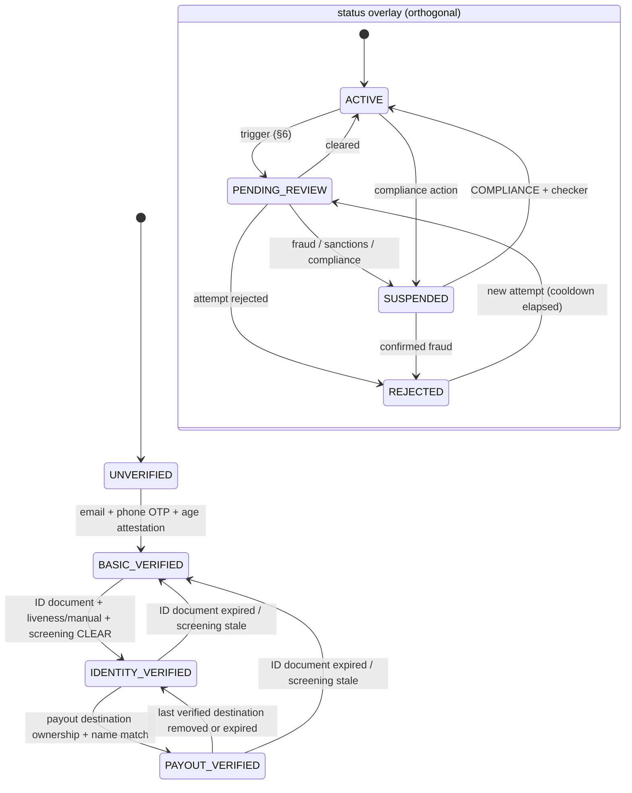

# FundZim KYC Architecture: Individual Identity Verification (Stage 1 design)

> **Status:** Stage 1 design. Stage 5 implements it. No verification vendor has been chosen and no KYC is
> live. Nothing here is a legal conclusion. Where a legal source is cited, the citation says what the source
> says; how it applies to FundZim is `LEGAL_REVIEW_REQUIRED` unless counsel confirms it. The register of
> legal questions is [open-legal-questions.md](open-legal-questions.md).
>
> **Related:** [ADR-015](../adr/ADR-015-risk-based-identity-verification.md) (risk-based verification),
> [ADR-009](../adr/ADR-009-kyc-storage-separation.md) (KYC storage separation),
> [kyb-architecture.md](kyb-architecture.md), [beneficiary-verification.md](beneficiary-verification.md),
> [aml-risk-framework.md](aml-risk-framework.md), [sanctions-screening.md](sanctions-screening.md),
> [identity-data-protection.md](../security/identity-data-protection.md),
> [payout-eligibility-and-controls.md](../payments/payout-eligibility-and-controls.md),
> [campaign-approval-policy.md](campaign-approval-policy.md), [PRODUCT.md §7](../PRODUCT.md).

---

## 1. Purpose and scope

This document defines how FundZim verifies **individual** users: donors, campaign owners, organisation
representatives and individual beneficiaries who receive payouts. It covers:

- the verification levels and the status overlay;
- the checks and evidence required at each level;
- review outcomes and re-verification triggers;
- PEP handling and the remote-onboarding standard;
- the vendor-agnostic verification interface;
- the data model.

Organisations are covered in [kyb-architecture.md](kyb-architecture.md), and the owner-versus-beneficiary model
in [beneficiary-verification.md](beneficiary-verification.md).

Design goals:

1. **Risk-based.** Verification effort scales with what the user can do: donate, publish, or receive money.
   Nobody is asked for an identity document just to browse or make a small donation, unless policy or law
   requires it.
2. **Gates, not one-way doors.** A level unlocks capabilities. A status overlay (`SUSPENDED`, `REJECTED`) can
   block them again without erasing the verification history.
3. **Configurable, sourced limits.** Every threshold is a limit record with a type, a source, an owner and a
   review date ([aml-risk-framework.md §5](aml-risk-framework.md)). No legal threshold is hard-coded.
4. **Vendor-agnostic.** Document capture, liveness and database checks go through an interface. A vendor
   can be swapped, or a manual review used instead, without changing the domain model.
5. **Minimal and separated data.** KYC data is C3 RESTRICTED. It lives only in the `kyc` schema and the
   `private-kyc` bucket, and only the `kyc` module touches it
   ([identity-data-protection.md](../security/identity-data-protection.md)).

## 2. Why FundZim verifies identity even before its legal status is settled

FundZim's own status under the Money Laundering and Proceeds of Crime Act [Chapter 9:24] (MLPC Act) is
**unresolved**:

- The Act defines a "financial institution" as "any person who conducts as a business" activities including
  "the transfer of money or value" (s 2(1)(d)), "safekeeping and administration of cash … on behalf of other
  persons" (s 2(1)(j)), and "investing, administering or managing funds or money on behalf of other persons"
  (s 2(1)(k)).
- Crowdfunding platforms are not listed as designated non-financial businesses or professions (DNFBPs) in
  s 13. The Minister can add DNFBPs under s 101, and declare a financial institution under s 2(3). No such
  designation was found.
- Source for both points: FIU-hosted consolidation of the MLPC Act, current to Act 7/2025, accessed
  2026-10-08, confidence HIGH (research R2-01, R2-02).
- Whether FundZim is in scope under the PSP-mediated model ([operating-model-decision.md](operating-model-decision.md))
  is **LR-060** (→ LR-051).

FundZim still verifies identity, regardless of the answer:

- **PSP requirements.** PSPs will impose CDD on the merchant's payees and on high-value flows under their own
  obligations (R2-03 interpretation).
- **Fraud prevention.** Fake campaigns are the core trust risk ([THREAT-MODEL.md](../THREAT-MODEL.md)).
- **FIU information requests.** The FIU can demand information from any company under s 6E(1)(f), whatever
  its accountable-institution status (R2-10, HIGH).
- **Lower cost of a later answer.** If counsel concludes FundZim is accountable, an architecture already shaped
  to the MLPC Act's CDD content (s 15–22) avoids a redesign.

The design is therefore **shaped to** MLPC Act CDD. It does **not claim** compliance with it.

## 3. Verification levels and status overlay

Two independent attributes are stored on the verification profile, which lives in the `kyc` schema. A
read-only mirror of level and status is kept on `users` for gating.

| Attribute | Values | Meaning |
|---|---|---|
| `verification_level` | `UNVERIFIED`, `BASIC_VERIFIED`, `IDENTITY_VERIFIED`, `PAYOUT_VERIFIED` | The highest level whose checks have passed and are still current |
| `verification_status` | `ACTIVE`, `PENDING_REVIEW`, `REJECTED`, `SUSPENDED` | Whether the level may currently be relied on |

### 3.1 Level definitions

| Level | Checks that must be PASS and current | Unlocks (default policy; configurable) |
|---|---|---|
| `UNVERIFIED` | None. A guest or new account. | Browse; donate within `donor.unverified.*` INTERNAL_RISK limits ([aml-risk-framework.md §5](aml-risk-framework.md)) |
| `BASIC_VERIFIED` | `EMAIL_OTP`, `PHONE_OTP`; `AGE_ATTESTATION`; device and IP risk is not `BLOCK` | Create campaign drafts; donate above the unverified limit up to `donor.basic.*` |
| `IDENTITY_VERIFIED` | All BASIC checks plus: `IDENTITY_DATA` (legal name, date of birth, nationality, ID type and number); `ID_DOCUMENT` (capture and authenticity); `FACE_MATCH_LIVENESS` **or** `MANUAL_IDENTITY_REVIEW`; `AGE_18_PLUS` from the document's date of birth; `SANCTIONS_PEP_SCREEN` with result `CLEAR` or `CLEARED_BY_REVIEW`; `DUPLICATE_IDENTITY` (blind-index match against other profiles) resolved | Submit and publish campaigns (as owner); act as an organisation representative; donate above `donor.identity_required_min` if that limit is configured |
| `PAYOUT_VERIFIED` | All IDENTITY checks plus: at least one `PAYOUT_DESTINATION_OWNERSHIP` check passed (wallet or bank account name match to the verified legal name); `ADDRESS` where a REGULATORY or PROVIDER limit requires it; `PURPOSE_OF_RELATIONSHIP` declaration recorded | Request withdrawals ([payout-eligibility-and-controls.md](../payments/payout-eligibility-and-controls.md) EC-03) |

Rules:

- Levels are **cumulative**. A level is held only if every lower level's checks are also current.
- A check result carries `valid_until` where it can go stale (documents, screening, address). When a required
  check expires, the effective level drops automatically to the highest level still fully satisfied. The
  history is kept, and a `kyc.level.downgraded` audit event is emitted.
- Default gates match Stage 0 ([PRODUCT.md §7.1](../PRODUCT.md)):
  - donate = `UNVERIFIED` within risk limits;
  - draft = `BASIC_VERIFIED`;
  - submit or publish = `IDENTITY_VERIFIED`;
  - withdraw = `PAYOUT_VERIFIED`.

  These gates are policy configuration (`kyc_gate_policy`). Raising a gate needs no code change. Lowering a
  gate below the Stage 0 defaults requires an ADR.
- **Minors.** A person under 18 cannot reach `BASIC_VERIFIED`. FundZim does not offer accounts to minors at
  launch:
  - the Children's Amendment Act 2023 defines a child as a person under 18 (R2-40, HIGH);
  - the CDPA requires verified parental consent to process a child's data (SI 155 of 2024 s 10(5), R2-21, HIGH);
  - the POTRAZ children's guideline says children "do not have the capacity to contract" (R2-40, MEDIUM).

  `AGE_ATTESTATION` at BASIC level is a self-declaration. `AGE_18_PLUS` at IDENTITY level is checked against
  the document. Minor beneficiaries are handled through a guardian owner
  ([beneficiary-verification.md](beneficiary-verification.md)). The age policy itself is LR-021.

### 3.2 Status overlay

| Status | Entered when | Effect on gates | Exit |
|---|---|---|---|
| `ACTIVE` | Default once a level is granted | Level gates apply normally | → any other status |
| `PENDING_REVIEW` | Re-verification triggered (§6); screening potential match; risk flag; vendor result `REVIEW` | Capabilities **above** the last unaffected level are paused. Example: a payout destination change pauses withdrawals but not drafting. The paused scope is recorded on the review. | Reviewer decision → `ACTIVE` (with or without a level change), `REJECTED` or `SUSPENDED` |
| `REJECTED` | A verification attempt is rejected (forged document, mismatch, ineligible person, confirmed sanctions match) | Blocks every action gated at or above the **attempted** level. Lower levels stay usable unless the reason is fraud, which escalates to `SUSPENDED`. | New attempt allowed after `kyc.retry_cooldown` (INTERNAL_RISK) and within `kyc.max_attempts`. Fraud-reason rejections need COMPLIANCE to allow a retry. |
| `SUSPENDED` | Compliance action: suspected fraud, account takeover, a sanctions or STR-related case, or a court or regulator request | Blocks all gated actions, including donating, logging-in-dependent actions and payouts. Read access to the user's own data stays, subject to LR-072 (tipping-off). | COMPLIANCE decision with maker-checker ([operational-controls.md §3](operational-controls.md)) |

The account's lifecycle state (active or closed) is separate from verification and lives in `users`.
`SUSPENDED` here suspends verification-dependent capability. Account-level security holds use
`ACCOUNT_HOLD` ([payout-eligibility-and-controls.md §5](../payments/payout-eligibility-and-controls.md)).

### 3.3 State diagram



Downgrades are computed from check validity. They are not a staff action. Upgrades happen only when a
verification attempt completes with every required check `PASS`.

## 4. Checks catalogue

Each check is a configured, versioned rule. Results are stored as `kyc_check_results` rows and are never
updated. A new attempt creates new rows.

| Code | What it establishes | Method (vendor-agnostic) | Evidence produced (evidence_records) | Default validity | Failure result |
|---|---|---|---|---|---|
| `EMAIL_OTP` | Control of an email address | One-time code ([SECURITY.md §4](../SECURITY.md)) | none (audit event only) | until the email changes | retry |
| `PHONE_OTP` | Control of a phone number | SMS or USSD one-time code | none (audit event only) | until the number changes; re-checked on SIM-swap signal (§6) | retry |
| `AGE_ATTESTATION` | User declares they are 18 or over | Checkbox + date of birth entry | consent/attestation record (`CONSENT` retention class) | until `AGE_18_PLUS` replaces it | block BASIC |
| `IDENTITY_DATA` | Legal name, date of birth, place of birth if a REGULATORY limit requires it, nationality, ID type and number | User entry, cross-checked with the document | `kyc_identity` row (C3, number encrypted + blind index) | follows document | `REVIEW` on mismatch |
| `ID_DOCUMENT` | A genuine, unexpired document belonging to the user. Accepted types at launch: Zimbabwe national ID, Zimbabwe passport, foreign passport. Others need a policy change. | Capture front/back or photo page → vendor or manual authenticity checks (template, MRZ checksum, tamper signals) | document images in `private-kyc` (C3); vendor report | document expiry date, or `kyc.document_max_age` if the document has no expiry | `REVIEW` / `REJECT` |
| `FACE_MATCH_LIVENESS` | The person present is the document holder | Vendor liveness + face match | liveness media/report (C3, **biometric**) | per attempt | `REVIEW` |
| `MANUAL_IDENTITY_REVIEW` | Alternative to biometrics: a KYC_REVIEWER verifies the document and a live interaction (video call or in-person agent, if used) | `KYC_REVIEWER` workflow | reviewer decision record + checklist | as `ID_DOCUMENT` | `REJECT` / `REVIEW` |
| `AGE_18_PLUS` | Date of birth on the document ≥ 18 years before today (Africa/Harare calendar date) | Computed | none (derived) | permanent | `REJECT` (ineligible) |
| `SANCTIONS_PEP_SCREEN` | Not a designated person; PEP status determined | [sanctions-screening.md](sanctions-screening.md) | screening result record | `screening.freshness` (INTERNAL_RISK; must also satisfy any REGULATORY rescreen rule) | potential match → `PENDING_REVIEW`; confirmed → `REJECTED` + case |
| `DUPLICATE_IDENTITY` | One identity, one personal account | HMAC blind index on (ID type, normalised number) and fuzzy name + date of birth | match record | per attempt | `REVIEW` (legitimate cases, e.g. recovery, are merged by COMPLIANCE) |
| `PAYOUT_DESTINATION_OWNERSHIP` | The wallet or bank account belongs to the verified person | Provider account-name lookup where supported (PCR-013 — name-enquiry API), micro-deposit or verification payment where supported (PCR), or document (bank letter or statement) review | name-match result; document | until destination change | `REVIEW` |
| `ADDRESS` | Residential address | Declared; document (utility bill or bank letter) where required | address record (C3); document | `kyc.address_max_age` | `REVIEW` |
| `PURPOSE_OF_RELATIONSHIP` | Why the user is receiving funds: campaign purpose, relationship to beneficiary | Structured declaration. The MLPC Act s 17 asks for "the purpose and nature of the relationship" (R2-03). | declaration record | per campaign | block payout until present |

Name matching (`IDENTITY_DATA` vs document vs payout destination) uses a deterministic normaliser:

- case-folding and diacritics removal;
- token order insensitivity;
- tolerance for initials and middle names;
- a configurable similarity threshold.

A score below `name_match.auto_pass` goes to review. It is never auto-rejected, because Zimbabwean names
are often recorded differently across systems.

## 5. Evidence required per level and accepted alternatives

| Level | Minimum evidence | Accepted alternatives | Never accepted |
|---|---|---|---|
| BASIC | Verified email; verified phone | None. Phone is required because mobile money and OTP depend on it. | Virtual or VoIP numbers flagged by the SMS provider's lookup (SMS-vendor question, decided at Stage 15 vendor selection: SMS provider number intelligence) |
| IDENTITY | Government photo ID + liveness | Government photo ID + `MANUAL_IDENTITY_REVIEW` (for users who decline biometric processing, or where liveness fails for technical reasons) | Photos of photos or screenshots flagged by authenticity checks; documents expired beyond `kyc.document_grace` |
| PAYOUT | Ownership verification of a destination in the user's legal name | Bank confirmation letter; provider name lookup | A destination in another person's name for a personal payout. Third-party payees follow [beneficiary-verification.md §6](beneficiary-verification.md) and LR-024. |

**Biometrics.**

- The Cyber and Data Protection Act requires the data subject's written consent to process biometric data.
  It prohibits genetic, biometric and health data processing "unless the data subject has given consent in
  writing" (CDPA s 12(1)). SI 155 of 2024 defines biometric data to include face recognition (s 2), and
  requires the controller to notify POTRAZ of "any processing which involves biometric and genetic data"
  (s 10(2)(d)). Sources: Veritas copies of the CDPA and SI 155, accessed 2026-10-08, HIGH (R2-21).
- Therefore `FACE_MATCH_LIVENESS` runs only after a specific, separate biometric consent is recorded.
- The non-biometric alternative (`MANUAL_IDENTITY_REVIEW`) must always exist.
- Whether an electronic click-through counts as "consent in writing", and the POTRAZ notification itself, are
  **LR-063** (→ LR-058).

## 6. Re-verification triggers

A trigger creates a `kyc_review` with a scope: the capabilities paused while it is open. Triggers are
configuration. The minimum set:

| Trigger | Detected by | Scope paused | Required re-check |
|---|---|---|---|
| Legal name change request | Profile change | publish, withdraw | `IDENTITY_DATA` + `ID_DOCUMENT` (new document) + destination name re-match |
| Phone number change | Profile change | withdraw; publish if SIM-swap signal | `PHONE_OTP` on the new number + step-up; cooling-off before next payout ([payout-eligibility-and-controls.md](../payments/payout-eligibility-and-controls.md) EC-06) |
| SIM-swap or porting signal (where the provider or operator exposes it — PCR) | Provider or SMS signal | withdraw | Step-up + `MANUAL_IDENTITY_REVIEW` callback |
| Payout destination added or changed | Destination change | withdraw (`DESTINATION_HOLD`) | `PAYOUT_DESTINATION_OWNERSHIP` for the new destination |
| ID document expiry | Scheduled job (`valid_until`) | per level computation (§3.1) | `ID_DOCUMENT` (and liveness if policy requires) |
| Screening staleness or list update hit | Rescreen job ([sanctions-screening.md §5](sanctions-screening.md)) | publish, withdraw | `SANCTIONS_PEP_SCREEN` review |
| PEP determination | Screening | withdraw above `pep.edd_required_min` | EDD (§7) |
| Risk signal: account linkage, device reuse across identities, velocity, chargebacks, fraud report | [transaction-monitoring.md](transaction-monitoring.md) | per alert severity | as decided by the case |
| Account recovery or suspected takeover | Security workflow | all | step-up + `FACE_MATCH_LIVENESS` or `MANUAL_IDENTITY_REVIEW` |
| Periodic refresh | `kyc.periodic_refresh` per risk rating (INTERNAL_RISK; REGULATORY if counsel confirms one applies) | none until due; then withdraw | screening + data confirmation |
| Doubt about previously obtained documents | Reviewer or case | per case | full IDENTITY re-check. The MLPC Act s 15(1)(d) lists "doubts about identity documents previously obtained" as a CDD trigger (R2-03, HIGH). |

## 7. PEP handling

- **Definition.** The MLPC Act s 13 (as substituted by Act 12 of 2018) defines PEPs to include domestic
  PEPs, foreign PEPs, senior management of international organisations, and "any close associate, spouse
  or family member" (R2-04, HIGH). FundZim's screening must therefore cover relatives and close associates,
  which in practice depends on the screening data provider ([sanctions-screening.md](sanctions-screening.md)).
- **What the MLPC Act requires of institutions in scope.** Under s 20(1), for a PEP customer or beneficial
  owner they must obtain senior management approval, identify the source of wealth and funds, and conduct
  enhanced ongoing monitoring (R2-04, HIGH). Whether FundZim is in scope is LR-060 (→ LR-051).
- **FundZim's provisional design** (applies regardless, as an INTERNAL_RISK policy):
  - A PEP match (confirmed, not a false positive) sets `pep_status = PEP | PEP_RCA` on the profile and raises
    the risk rating to HIGH ([aml-risk-framework.md §3](aml-risk-framework.md)).
  - Campaigns owned by, or benefiting, a PEP require a COMPLIANCE approval in addition to the review
    ([campaign-approval-policy.md](campaign-approval-policy.md) `SANCTIONS_SCREEN` → ESCALATE).
  - Payouts to a PEP or for a PEP-linked campaign use the `DUAL` approval tier
    ([payout-eligibility-and-controls.md §6](../payments/payout-eligibility-and-controls.md)), with a
    recorded source-of-funds note for the campaign.
  - Political campaigns are on the prohibited list pending LR-025. The PVO Act prohibits partisan conduct by
    PVOs (s 20A(g), s 23(4); R2-35, HIGH).
  - "Senior management approval" maps to a named COMPLIANCE officer role assignment (`compliance.pep.approve`)
    until FundZim's governance defines senior management. **LR-064.**

## 8. Remote onboarding standard

- **Source.** MLPC Act s 19 requires institutions in scope, for customers who are not physically present,
  to apply measures "no less effective" than face-to-face identification (FIU-hosted MLPC Act, accessed
  2026-10-08, HIGH; R2-03).
- **Design response.** FundZim onboarding is fully remote. The `IDENTITY_VERIFIED` level combines:
  - a government photo document with authenticity checks;
  - a liveness/face match or a live manual review;
  - an independent data point (verified phone);
  - screening.

  This is intended to be at least as strong as a face-to-face document check. It is **not** asserted to
  satisfy s 19. Which remote methods are acceptable is **LR-062**.
- **Reliance on third parties.** MLPC Act s 18 lets institutions rely on third parties such as a PSP, but
  they keep "ultimate responsibility" (R2-03, HIGH). The design does **not** rely on PSP KYC to grant
  FundZim levels. PSP verification results may be stored as extra evidence (`source = psp`) where the
  contract allows it. Whether reliance is permitted, and who FundZim's "customer" is, is **LR-061**.

## 9. Review workflow and outcomes

Verification attempts that cannot be auto-decided go to a `kyc_review` queue owned by `KYC_REVIEWER`
([operational-controls.md §1](operational-controls.md)).

| Outcome | When | Effect | Recorded |
|---|---|---|---|
| `APPROVE` | All required checks PASS after review | Level granted; status `ACTIVE` | decision + reason code + checklist |
| `APPROVE_WITH_CONDITIONS` | e.g. PEP; lower limits | Level granted; risk rating raised; limit overrides recorded as INTERNAL_RISK limit records with an expiry | conditions list |
| `REQUEST_RESUBMISSION` | Poor image, expired document, name mismatch explainable by data | Attempt closed `RESUBMIT`; user notified with a generic reason | reason code |
| `REJECT` | Forged or altered document, impersonation, ineligible (under 18), confirmed sanctions match | Status `REJECTED`; case opened for fraud or sanctions reasons | reason code + evidence |
| `ESCALATE` | Potential sanctions match, PEP, suspected organised fraud, HIGH-risk combination | Routed to COMPLIANCE; status `PENDING_REVIEW` | escalation note |

Controls:

- A reviewer cannot review their own account, an account linked to them (declared-conflict register), or an
  attempt they already decided at a previous stage.
- `REJECT` for fraud and every `ESCALATE` resolution need a second person (COMPLIANCE) when the person is
  linked to an active campaign with funds. This is maker-checker per [operational-controls.md §3](operational-controls.md).
- User-facing messages never disclose screening hits, suspicion, or the existence of a case. This tipping-off
  protection follows MLPC Act s 31(2) (R2-07, HIGH; applicability LR-060 (→ LR-051)/LR-072).
- Automated outcomes that **reject or block** a user are always routed to a human before becoming final.
  The CDPA s 25 gives a right not to be subject to solely automated decisions with legal or similarly
  significant effects (R2-23, HIGH). The automated pipeline may only `PASS` or route to `REVIEW`. **LR-071.**
- Service levels are a business decision (**PD-28**).

## 10. Vendor-agnostic verification interface

```go
// Illustrative only (Stage 5). Lives in internal/kyc; no other module imports vendor packages.
type IdentityVerifier interface {
    Capabilities() VerifierCapabilities // document types, liveness, database checks, countries, data location
    StartSession(ctx context.Context, req StartSessionRequest) (Session, error) // returns a hosted/SDK session ref
    GetResult(ctx context.Context, sessionRef string) (VerificationResult, error)
    VerifyCallback(ctx context.Context, headers http.Header, body []byte) (CallbackEvent, error) // signature + replay
    DeleteSubjectData(ctx context.Context, sessionRef string) error // vendor-side deletion where supported
}

type VerificationResult struct {
    SessionRef   string
    Outcome      Outcome            // PASS | REVIEW | FAIL — never "REJECT"; rejection is a human decision (§9)
    Checks       []VendorCheck      // mapped to FundZim check codes (§4)
    ExtractedData *ExtractedIdentity // name, DOB, doc number, expiry — encrypted on receipt
    Artifacts    []ArtifactRef      // vendor object refs; copied into private-kyc only if policy says so
    RawReportRef string             // stored as evidence, C3
}
```

Rules:

- Vendor callbacks follow the same rules as payment webhooks: verified, deduplicated in an inbox,
  idempotent ([PAYMENTS.md §9](../PAYMENTS.md)).
- FundZim stores a **mapping** from vendor check names to FundZim check codes. Policy reasoning never uses
  vendor-specific outcome strings.
- Cross-border transfer of KYC data to a vendor, and the vendor contract, are LR-011 and LR-033. The vendor
  choice is **PD-25**. A manual-only pilot (no vendor) is a valid configuration:
  `MANUAL_IDENTITY_REVIEW` replaces liveness, and document authenticity is a reviewer checklist.

## 11. Data model (conceptual; `kyc` schema unless noted)

```sql
-- kyc.verification_profiles — one per user
user_id uuid PK, verification_level text CHECK (...4 values), verification_status text CHECK (...4 values),
risk_rating text CHECK (risk_rating IN ('LOW','STANDARD','HIGH')), pep_status text CHECK (pep_status IN ('NONE','PEP','PEP_RCA','UNKNOWN')),
level_granted_at timestamptz, status_changed_at timestamptz, policy_version text NOT NULL,
created_at, updated_at                       -- level/status changes also emit audit events; history in profile_events

-- kyc.profile_events — append-only history of level/status changes (who, why, from→to, review_id)
-- kyc.verification_attempts — id, user_id, target_level, started_at, completed_at, outcome, vendor, session_ref
-- kyc.check_results — id, attempt_id, check_code, result PASS|FAIL|REVIEW|N_A, valid_until, evidence_ids uuid[],
--                     performed_by_type system|vendor|staff, performed_by_id, created_at   (append-only)
-- kyc.identities — user_id, legal_name_enc, dob_enc, nationality, id_type, id_number_enc, id_number_bidx bytea,
--                  doc_expiry date, key_id (envelope key reference)                       (C3)
-- kyc.reviews — id, user_id, trigger_code, scope_paused text[], state OPEN|DECIDED, assigned_to, decided_by,
--               decision, reason_code, decided_at, second_approver_id
-- kyc.consents — id, user_id, consent_type (BIOMETRIC|KYC_VENDOR_TRANSFER|...), text_version, given_at, withdrawn_at
-- public.users mirror: verification_level, verification_status (read-only copy updated by the kyc module)
```

Constraints:

- `UNIQUE (id_type, id_number_bidx)` across **active** personal profiles, as a partial unique index. Duplicates
  are resolved by review, never silently.
- `check_results`, `profile_events` and `consents` are append-only: the app role has INSERT/SELECT only, and a
  trigger blocks UPDATE, DELETE and TRUNCATE, matching [DATABASE.md](../DATABASE.md).
- The level mirror on `users` is written only by the `kyc` module's service through the documented interface.

Audit events: `kyc.attempt.started`, `kyc.check.recorded`, `kyc.level.granted`, `kyc.level.downgraded`,
`kyc.status.changed`, `kyc.review.decided`, `kyc.document.viewed`, `kyc.identity_number.revealed`, consistent
with [audit-evidence-model.md §4.2](audit-evidence-model.md).

## 12. New legal questions

Register: [open-legal-questions.md](open-legal-questions.md).

| ID | Question | Why it matters / what is blocked |
|---|---|---|
| **LR-060** (→ LR-051) | Under the PSP-mediated model, is FundZim a "financial institution" under MLPC Act s 2(1)(d), (j) or (k)? Must it register with the FIU on goAML, appoint a compliance officer (s 25), and meet CDD (s 15–22), STR (s 30) and record-keeping (s 24) duties? | Decides whether §2's "shaped to" becomes a legal obligation. It changes STR workflow, CTR filing, retention and staffing. Blocks Stage 5 policy finalisation and Stage 20 go-live. |
| **LR-061** | Who is FundZim's "customer" for CDD (campaign owner, beneficiary, donor)? May FundZim rely on a PSP's CDD under s 18, and on what terms? | Decides which parties need IDENTITY level, and whether PSP KYC results can replace FundZim checks |
| **LR-062** | Which remote identification methods satisfy the s 19 "no less effective" standard (liveness, manual video review, national ID database lookup if available)? | Decides the required check set for IDENTITY and whether a manual-only pilot is acceptable |
| **LR-063** (→ LR-058) | Is an electronic, click-through consent "consent in writing" for biometric processing (CDPA s 12)? What must the POTRAZ notification of biometric processing (SI 155 s 10(2)(d)) contain, and when must it be sent? | Blocks enabling `FACE_MATCH_LIVENESS` |
| **LR-064** | How should FundZim apply the PEP definition (family members and close associates) and the "senior management approval" requirement before it has a formal governance structure? Is a campaign benefiting a PEP's relative in scope? | PEP workflow and approval roles |

New business decision:

| ID | Decision | Options / provisional recommendation | Approver |
|---|---|---|---|
| **PD-25** | Identity verification approach for the pilot: KYC vendor (document + liveness) vs manual review only, and which vendor | Provisional: manual-only pilot is acceptable at small scale (it avoids the biometric consent and cross-border questions LR-063 (→ LR-058)/LR-011 while they are open). Select a vendor before scaling, using the [identity-data-protection.md §8](../security/identity-data-protection.md) criteria. | Founders + COMPLIANCE lead |

## 13. Sources cited (all accessed 2026-10-08; research file R2)

| Ref | Source | URL | Confidence |
|---|---|---|---|
| R2-01–R2-08, R2-10 | Money Laundering and Proceeds of Crime Act [Chapter 9:24], FIU-hosted consolidation (to Act 7/2025) | `https://www.fiu.co.zw/wp-content/uploads/2025/05/MLPCAct0924updated.pdf` | HIGH |
| R2-21, R2-23 | Cyber and Data Protection Act [Chapter 12:07] (Act 5/2021), Veritas copy gazetted 11 Mar 2022 | `https://www.veritaszim.net/sites/veritas_d/files/Cyber%20%26%20Data%20Protection%20Act%20Cap1207%20No%205%20of%202021%20gaz%202022-03-11.pdf` | HIGH |
| R2-18, R2-21 | S.I. 155 of 2024 (Licensing of Data Controllers and DPO Regulations), Gazette supplement 13 Sep 2024 | `https://www.veritaszim.net/sites/veritas_d/files/SI%202024-155%20Cyber%20and%20Data%20Protection%20(Licensing%20of%20Data%20Controllers%20and%20Appointment%20of%20Data%20Protection%20Officers)%20Regulations,%202024.pdf` | HIGH |
| R2-40 | Children's Amendment Act, 2023 (No. 8 of 2023) | `https://commons.laws.africa/akn/zw/act/2023/8/media/publication/zw-act-2023-8-publication-document.pdf` | HIGH |
| R2-21, R2-40 | POTRAZ Implementation Guideline on Processing Children's Personal Information (Veritas copy; guidelines "do not have the force of law" per Veritas Bill Watch 29-2026) | `https://www.veritaszim.net/sites/veritas_d/files/02%20Processing%20of%20Children%27s%20Personal%20Information.pdf` | HIGH-MEDIUM |
| R2-35 | Private Voluntary Organisations Act [Chapter 17:05], Veritas consolidation to 11 Apr 2025 | `https://www.veritaszim.net/sites/veritas_d/files/Private%20Voluntary%20Organisations%20Act%20Cap%2017,05%20(Consolidated%20to%202025.04.11).pdf` | HIGH (text); validity of Act 1/2025 disputed — MEDIUM |
