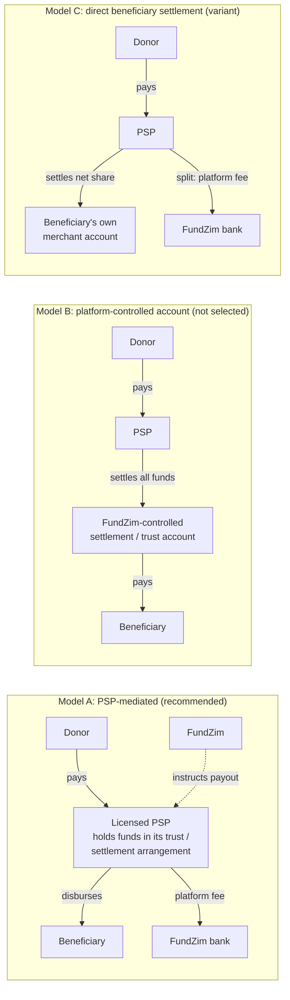

# Operating Model Decision

**Stage 1. Status: PROVISIONAL RECOMMENDATION, not legal advice and not regulatory approval.** Decision
record: [ADR-013](../adr/ADR-013-regulatory-operating-model.md). Research inputs are cited by finding ID (R1-xx
= payments/currency/tax research; R3 = provider research), with their sources, dates and confidence as recorded
in [regulatory-requirements-register.md](regulatory-requirements-register.md) and
[provider-capability-matrix.md](../payments/provider-capability-matrix.md). All sources were accessed on
2026-10-08.

Every interpretation in this document is a working hypothesis for Zimbabwean counsel. It is marked
**LEGAL_REVIEW_REQUIRED**, and nothing here may be presented as a legal conclusion.

Related: [funds-flow-architecture.md](../payments/funds-flow-architecture.md),
[financial-responsibility-matrix.md](financial-responsibility-matrix.md),
[settlement-and-custody-model.md](../ledger/settlement-and-custody-model.md),
[licensing-assessment.md](licensing-assessment.md), [open-legal-questions.md](open-legal-questions.md).

---

## 1. Decision summary

| Item | Decision |
|---|---|
| **Recommended MVP model** | **Model A: PSP-mediated crowdfunding.** A licensed PSP collects, holds and safeguards, settles and disburses. FundZim orchestrates and instructs, and never receives donor money into its own accounts. |
| Variant kept open | **Model C: direct beneficiary settlement**, for verified organisations (KYB) only, as a later or pilot option where a provider's split/sub-merchant product supports it. |
| Not selected | **Model B: platform-controlled settlement account.** |
| If neither A nor C is available from any provider on acceptable contract terms | **Launch is BLOCKED.** FundZim does not drift into Model B. Model B would require a superseding ADR plus written legal sign-off. |
| Conditions that must be met before Model A is final | §6 (C-1 … C-9) |

## 2. The three models

### 2.1 Model A — PSP-mediated crowdfunding

FundZim provides campaign management, payment initiation (through the PSP's checkout/API), transaction records,
the ledger, risk, KYC workflow, payout **instructions**, reconciliation and reporting. The PSP performs the
regulated functions: acceptance of funds, safeguarding in its trust/settlement arrangement, settlement, and
disbursement to beneficiaries on FundZim's authenticated instruction.

**The honest caveat.** Most gateway products R3 examined settle collected funds to the **merchant's own
bank account**:
- Paynow settles "directly into the merchant's ZIG and USD bank accounts" (R3 §1 row 8, P15).
- Pesepay settles T+2 to the merchant's "approved payout account" (R3 §2 row 15, S16).

If FundZim were simply the merchant and all donations settled to FundZim's bank account, that would be **Model B
in substance**, whatever the contract is called. Model A is therefore only real if a provider offers one of:

| Required capability | Evidence found (R3) | Status |
|---|---|---|
| (a) Funds held by the PSP and disbursed on platform instruction (balance + payout API) | **Payonify:** Relay balances "available/pending/reserved", payouts to EcoCash B2C only, "requires prior approval" (Y4, Y5). Its Terms say it "does not hold… funds", which contradicts this (Y11). **Linkwa:** platform balance + `POST /payouts` to SmileCash wallets only (L1). | Partial; REQUIRES_PROVIDER_CONFIRMATION |
| (b) Sub-merchant / marketplace accounts per beneficiary | **Pesepay:** beneficiary must be "an approved Pesepay merchant account", invited manually (S7). **Linkwa:** users + SmileCash wallet KYC by API (L1). | Exists, but manual or wallet-only |
| (c) Split settlement (beneficiary share + platform fee at source) | **Pesepay:** native split, one beneficiary per transaction (S7). **Payonify:** Relay `application_fee_amount`, EcoCash only (Y4). | Exists, with limits |

(b) and (c) are really Model C mechanics. **No provider has yet been verified to offer a full Model A
(multi-rail collection + PSP-held pool + multi-rail payout API + licence evidence).** This is the central
provider question (PCR-003 — custody & disbursement model, in [provider-questions.md](../payments/provider-questions.md)).

### 2.2 Model B — platform-controlled settlement account

Donations settle into an account FundZim controls (its own account or a trust account in its name), and FundZim
pays beneficiaries from it.

### 2.3 Model C — direct beneficiary settlement

Each payment settles directly to the verified beneficiary's own account through the provider's split or
sub-merchant product. FundZim's fee is split off at source. There is no FundZim-instructed payout.

## 3. Regulatory exposure (all LEGAL_REVIEW_REQUIRED)

| Instrument (research finding) | What the source says (summary) | Model A | Model B | Model C |
|---|---|---|---|---|
| **National Payment Systems Act [Ch. 24:23] s18** (R1-02; Veritas consolidation to S.I. 262/2006; HIGH for text) | No person other than a participant in a recognised payment system, or a person introduced by a participant, shall "as a regular feature of his business, accept money… for the purpose of making a payment on behalf of that other person to a third person to whom the payment is due". Exemptions include a "duly appointed agent of the person to whom the payment is due" and Ministerial exemptions. | FundZim does not accept the money; the PSP (a participant, or a person introduced by one) does. **Hypothesis:** s18 is not engaged for FundZim. Whether FundZim's payout *instructions* change this is LR-075 (→ LR-036). | FundZim accepts donor money to pay it on. **Hypothesis:** s18(1) is likely engaged unless an exemption applies (agency appointment, Ministerial exemption) or a donation is not a payment "due" (open point in R1-02). **High exposure.** | Like A. The PSP accepts and pays the beneficiary directly. |
| **Banking (Money Transmission, Mobile Banking and Mobile Money Interoperability) Regulations, S.I. 80 of 2020** (R1-04; gazette 27 Mar 2020; HIGH for text, MEDIUM currency) | A "money transmission provider" is "any person who owns a payment system that facilitates the transmission of monies from one person to another". It needs recognition. Requirements include a dedicated bank account, no value on the system without a matching bank balance, returns kept 7 years, and RBZ approval of charges. | Low, provided FundZim's ledger is a record and not a system that transmits value (no wallets, no internal transfers). LR-075 (→ LR-036). | Medium–high: FundZim's ledger plus account would look like a system that moves money between persons. | Low. |
| **S.I. 17 of 2025** (R1-05; Afriwise law-firm blog 18 Mar 2025; MEDIUM, secondary) | Reportedly: USD 5,000 application fee, annual 2% of gross turnover capped at USD 50,000, and a non-bank must partner a local authorised financial institution. | Not applicable if FundZim needs no licence. | Indicates the cost of a licence if one is needed. | Not applicable. |
| **RBZ Guidelines for Retail Payment Systems and Instruments (effective 1 Jul 2017)** (R1-06; rbz.co.zw PDF; HIGH for text, MEDIUM currency) | Operators and issuers need RBZ authorisation (3.1). E-money issuers: USD 1m capital (6.1), user funds segregated (16.3), e-money fully backed by escrow/trust deposits (16.4), trust account administered by RBZ-approved trustees (17.1–17.3), weekly/monthly reconciliation (18.1(c)), no interest (20.1). Records kept 10 years (9.2). "Merchant" is defined as one who accepts payment instruments (2.8). | FundZim is plausibly a "merchant"/platform user of an authorised PSP. **No campaign wallets or spendable balances** (LR-003). | Holding donor money for later distribution could look like operating a system or issuing e-money, bringing capital, trust-account and trustee requirements. **High exposure.** | FundZim is plausibly a merchant/platform. |
| **No RBZ instrument specific to crowdfunding or aggregators found** (R1-08; LOW) | The searches found no definition of payment aggregator, facilitator or crowdfunding. A 2022 press report mentions RBZ "crowdfunding licences" without naming the framework. | Seek counsel's view on a no-objection / comfort letter, or the fintech sandbox (LR-004). | Same, more urgently. | Same. |
| **Exchange control: RBZ FX Guideline FXD 2/2025** (R1-13, R1-14; April 2025; HIGH) | Only Authorised Dealers / ADLAs may deal in foreign currency. Individual FCAs may receive donations as free funds. Corporate outbound donations need prior RBZ approval. | FundZim never converts currency. Provider/bank handles FX if any. | FundZim would hold foreign currency, so more exposure. | As A. |
| **IMTT, Finance Act 2025** (R1-16; HIGH for 1.5% ZWG, MEDIUM for 2% USD) | IMTT is charged per electronic transaction, collected by financial institutions; no donation exemption found. | Possibly charged on collection and disbursement legs (LR-077 (→ LR-059)). | Possibly an extra leg (in to FundZim, out to beneficiary). | Possibly one leg fewer. |

## 4. Evaluation against the master-prompt criteria

### 4.1 Comparison

| Criterion | Model A | Model B | Model C |
|---|---|---|---|
| Licensing exposure for FundZim | **Lowest** (if FundZim stays a record-keeper + instructor) | **Highest** (s18, e-money/trust rules, possible licence) | Low |
| Safeguarding of donor funds | PSP's trust/settlement arrangement (to be evidenced by contract, PCR) | FundZim would have to safeguard: trust deed, trustees, segregation, reconciliation | Beneficiary receives funds directly; nothing to safeguard after settlement |
| Banking relationship | FundZim needs only an operating account for fee income | Needs a bank willing to host a third-party funds/trust account, with ongoing AML scrutiny | Operating account only |
| Operational burden on FundZim | Medium: instructions, reconciliation of a provider-held pool | High: treasury, payouts, safeguarding reconciliations, audits | Low for payouts; high onboarding burden (each beneficiary becomes a provider merchant) |
| Provider availability today (R3) | **Not yet confirmed** for multi-rail; partial (Payonify EcoCash, Linkwa SmileCash) | Technically available from any gateway (they settle to merchant accounts) | Pesepay split exists (manual onboarding, one beneficiary per transaction) |
| Platform fee collection | Split at source or remittance from pool (PD-19) | FundZim deducts before paying out | Native split (Pesepay `PERCENTAGE`/`FIXED_AMOUNT`) |
| Refunds | From the pool, while funds are unpaid. After payout, recovery is needed (LR-080). | From FundZim's account | Funds are already with the beneficiary, so every refund needs recovery or FundZim funding |
| Disputes / chargebacks | Pool + reserve + recoverable ([refund-and-reversal-flows.md](../payments/refund-and-reversal-flows.md) §6) | From FundZim's account | Hardest: no pool, no reserve unless the provider supports it |
| Reconciliation | Three-way match against provider pool statements ([settlement-and-custody-model.md](../ledger/settlement-and-custody-model.md) §7) | FundZim bank statement + ledger | Per-beneficiary settlement reports (if the provider exposes them) |
| Donor protection | **Strongest practical**: funds stay in the pool until eligibility checks pass; freeze actually stops money | Strong technically, but FundZim's own solvency is now a donor risk | **Weakest**: money reaches the beneficiary at settlement, before FundZim's payout controls can act |
| Control over payouts (eligibility engine, maker-checker, holds) | Full ([payout-eligibility-and-controls.md](../payments/payout-eligibility-and-controls.md)) | Full | **None after settlement**; control only at onboarding |
| Fit for individuals (most campaigns) | Good | Good | **Poor**: individuals would need to become provider merchants (Pesepay merchant KYC asks for CR14, proof of address, bank proof — S20) |
| Fit for verified organisations | Good | Good | **Good** |

### 4.2 Why Model B is not selected

1. **Legal exposure.** FundZim would accept donor money in order to pay third parties. On the text of NPS Act
   s18(1) (R1-02) that is the restricted activity, unless an exemption applies. The 2017 Guidelines' e-money
   and trust-account regime (R1-06) and S.I. 80 of 2020 (R1-04) may also be engaged. All of this is
   LEGAL_REVIEW_REQUIRED (LR-001, LR-003, LR-004, LR-075 (→ LR-036)).
2. **Safeguarding cost.** It would need a trust deed, RBZ-approved trustees, segregation, frequent
   reconciliation and audits (R1-06 paras 16–18), plus licence fees if licensable (R1-05).
3. **Banking.** A bank must agree to host and monitor third-party funds.
4. **Concentration of risk.** Donor funds would depend on FundZim's own solvency and controls.
5. **It is the easy drift.** Because gateways settle to merchant accounts, a naive integration *becomes* Model
   B. This document exists partly to prevent that.

### 4.3 Why Model C is not the initial default

1. **It removes FundZim's payout controls.** Money reaches the beneficiary at settlement, so freezes,
   eligibility checks, reserves and maker-checker cannot act on it.
2. **Refunds and chargebacks** after direct settlement always require recovery from the beneficiary or FundZim
   funding (LR-080, PD-34).
3. **Onboarding friction for individuals.** In the only verified split product, each beneficiary must be an
   approved Pesepay merchant, invited from the dashboard. There is no onboarding API, one beneficiary per
   transaction, and nothing about the split appears on the callback (R3 §2 rows 16–17, S7).
4. **It suits verified organisations** (schools, hospitals, registered PVOs) that are already merchants and
   whose identity is already evidenced through KYB. It is kept as a variant for them, behind ADR-013 and
   provider confirmation.

## 5. Decision criteria and weights

These weights were chosen by the architecture team in Stage 1; the founders must confirm them (PD-17). A score is
5 (best) to 1 (worst), and every score is provisional pending legal and provider confirmation.

| Criterion | Weight | A | B | C |
|---|---|---|---|---|
| Regulatory/licensing exposure for FundZim | 30% | 4 | 1 | 4 |
| Donor protection & control over payouts | 20% | 5 | 4 | 2 |
| Provider availability (verified today) | 15% | 2 | 5 | 3 |
| Operational burden / cost | 10% | 3 | 1 | 3 |
| Fit for individual campaigns | 10% | 5 | 5 | 1 |
| Refund / dispute handling | 10% | 4 | 4 | 2 |
| Reconciliation clarity | 5% | 3 | 4 | 3 |
| **Weighted score** | 100% | **3.85** | **3.05** | **2.80** |

Arithmetic (Σ weight × score):
- A: 0.30·4 + 0.20·5 + 0.15·2 + 0.10·3 + 0.10·5 + 0.10·4 + 0.05·3 = 3.85
- B: 0.30·1 + 0.20·4 + 0.15·5 + 0.10·1 + 0.10·5 + 0.10·4 + 0.05·4 = 3.05
- C: 0.30·4 + 0.20·2 + 0.15·3 + 0.10·3 + 0.10·1 + 0.10·2 + 0.05·3 = 2.80

Model B scores well only on provider availability. It is "available" there only because it is the default
drift: gateways settle to merchant accounts. That is why the regulatory weight dominates.

## 6. Conditions for confirming Model A

Model A becomes the confirmed operating model only when **all** of the following are evidenced. Each is tracked in
[regulatory-readiness-checklist.md](regulatory-readiness-checklist.md).

| # | Condition | Evidence required | Owner |
|---|---|---|---|
| C-1 | Counsel's written view that FundZim, in Model A, is not carrying on the activity restricted by NPS Act s18 and is not a money transmission provider or e-money issuer | Legal opinion (LR-001, LR-003, LR-004, LR-075 (→ LR-036)) | Founders + counsel |
| C-2 | The PSP's RBZ authorisation is evidenced (licence category, number, date, sponsoring bank) | Licence/approval letter (PCR-001 — licensing) | FINANCE + COMPLIANCE |
| C-3 | The PSP contract states that donor funds are held in the PSP's trust/settlement arrangement and disbursed on FundZim's authenticated instruction | Signed agreement clause (PCR-003 — custody & disbursement) | Founders + counsel |
| C-4 | The PSP permits donation crowdfunding on behalf of third-party beneficiaries (e.g. Paynow's "undisclosed principal / third party beneficiary" warranty is resolved — R3 §1 row 16) | Written provider confirmation | Founders |
| C-5 | Payout capability to the rails FundZim launches with (at minimum the launch wallet + bank), via API with idempotent references, status query and signed callbacks | Provider docs + sandbox test (Stage 9) | Engineering |
| C-6 | Settlement and pool-balance reporting sufficient for the three-way match (statement API or file) | Sample reports | FINANCE |
| C-7 | Refund mechanism (API or documented manual path) and dispute notifications | Provider docs | Engineering + FINANCE |
| C-8 | Pool funding (fee true-ups, shortfall funding) is permitted, or the PSP absorbs/handles shortfalls by contract | Legal view (LR-076) + contract | Counsel + FINANCE |
| C-9 | Fee and tax treatment (VAT on platform fee, IMTT legs) understood and disclosed | Tax adviser view (LR-016, LR-077 (→ LR-059)) | Founders |

## 7. What evidence would change the decision

| Evidence | Effect |
|---|---|
| Counsel advises that FundZim's instruction-giving under Model A is itself licensable | Reassess: pursue a licence/partnership (sponsor bank, RBZ sandbox), or move toward Model C for all campaigns |
| Counsel advises a donation is not a payment "due" under s18 **and** no e-money/trust regime applies to holding donations | Model B becomes legally *possible*. It is still not preferred, for safeguarding and solvency reasons. A new ADR is needed. |
| No provider offers a PSP-held pool with payouts, but split/sub-merchant onboarding is available by API | Model C for verified organisations only, with individuals waiting. Launch scope narrows. |
| A provider offers a full Model A product with licence evidence | Confirm Model A; select primary provider ([provider-comparison.md](../payments/provider-comparison.md)) |
| A provider requires FundZim to prefund a payout float | `asset:psp_payout_float` would be used. That is FundZim funds at a provider, which needs LR-003/LR-076 review. |
| RBZ issues an aggregator/crowdfunding framework | Re-run this assessment against it |

## 8. Fallback: launch blocked

If C-1 to C-9 cannot be satisfied for Model A, and Model C cannot be offered at least to verified organisations,
the platform does **not** go live with real money (ROADMAP Gate C). Engineering may continue against the sandbox
provider (Stage 8). Under no circumstances may an integration be configured so that donor funds settle into a
FundZim account (Model B in substance) without a superseding ADR and written legal sign-off.

## 9. Implementation implications (for Stage 2)

- Provider capability flags must include: `custody_model` (`PSP_POOL` | `MERCHANT_SETTLEMENT` | `SPLIT_DIRECT`),
  `payout_api`, `payout_rails`, `split_settlement`, `pool_balance_api` and `statement_format`. Routing must refuse a
  provider whose `custody_model = MERCHANT_SETTLEMENT` for campaign donations (this guard prevents the drift
  into Model B).
- The campaign carries `settlement_model` (`MODEL_A` | `MODEL_C`), fixed at approval and changed only via
  re-review.
- The ledger account model follows [settlement-and-custody-model.md](../ledger/settlement-and-custody-model.md).

## New legal questions

| ID | Area | Question | Why it matters / what is blocked |
|---|---|---|---|
| LR-075 (→ LR-036) | FundZim as instructing party | Under Model A, FundZim instructs a PSP to disburse PSP-held donor funds to beneficiaries and keeps a ledger of campaign entitlements. Does this make FundZim (a) a person who "accepts money… for the purpose of making a payment" under NPS Act s18, (b) a "money transmission provider" under S.I. 80 of 2020, or (c) an operator/issuer under the 2017 Retail Payment Guidelines? Should FundZim obtain an agency appointment from campaign owners (s18(3)(c)), a no-objection letter from RBZ NPS, or a sandbox admission? | Determines whether Model A is viable without a licence. Blocks C-1 and therefore launch (Stage 20). |

## New business decisions

| ID | Decision | Default proposed |
|---|---|---|
| PD-17 | Confirm the operating-model criteria weights and the launch provider strategy (single PSP vs separate collection and payout providers) | Weights as in §5; single provider preferred if it satisfies C-2…C-7, otherwise collection + payout split across two providers, both under Model A terms |
