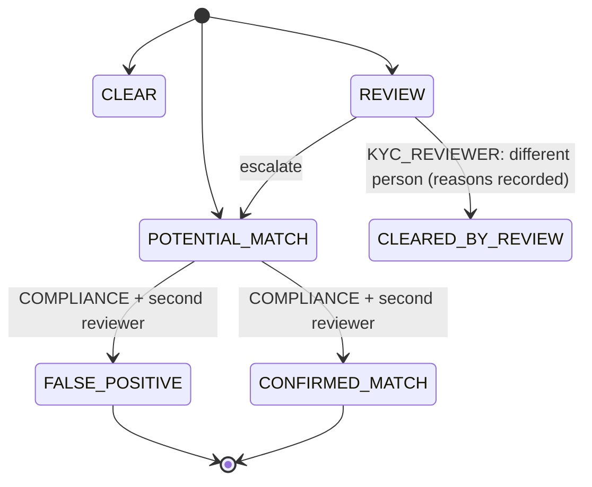

# FundZim Sanctions and PEP Screening (Stage 1 design)

> **Status:** Stage 1 design; Stage 5 implements it (onboarding), and Stage 11 adds the payout check
> (EC-15). No screening vendor or list provider has been chosen (**PD-29**). Whether FundZim is legally bound
> by the screening duty is conditional on **LR-060** (→ LR-051) (MLPC status) and **LR-065** (→ LR-053)/**LR-066**. FundZim screens
> regardless, as internal policy and because PSPs and banks will require it.
>
> **Related:** [kyc-architecture.md](kyc-architecture.md) (`SANCTIONS_PEP_SCREEN`, PEP handling §7),
> [kyb-architecture.md](kyb-architecture.md), [beneficiary-verification.md](beneficiary-verification.md),
> [aml-risk-framework.md](aml-risk-framework.md), [transaction-monitoring.md](transaction-monitoring.md)
> (TM-19), [compliance-case-management.md](compliance-case-management.md),
> [payout-eligibility-and-controls.md](../payments/payout-eligibility-and-controls.md) (EC-15),
> [campaign-approval-policy.md](campaign-approval-policy.md) (`SANCTIONS_SCREEN`).

---

## 1. Legal background (what the sources say)

The main source is S.I. 76 of 2014, the Suppression of Foreign and International Terrorism (Application of
UNSCR 1267 of 1999, UNSCR 1373 of 2001 and Successor UNSCRs) Regulations, 2014. It was made under the
Suppression of Foreign and International Terrorism Act [Chapter 11:21]. Source: FIU-hosted copy, accessed
2026-10-08, HIGH (research R2-16a). It provides that:

- **Implementing agency.** The FIU is the national implementing agency and circulates the lists.
- **Timing.** "Immediately" means "without delay but not later than 24 hours".
- **Freezing.** Reg 9: assets of UN-listed persons are frozen immediately after the Minister disseminates
  the list.
- **Screening.** Reg 10(1): every financial institution and DNFBP "shall review the UN Consolidated List and
  the Zimbabwean List prior to conducting any transaction, undertaking any financial services or entering
  into any relationship".
- **On a match.** Reg 10(2): the institution must block the funds and file an STR describing the freezing
  action.
- **Dealing offence.** Reg 11: dealing with a designated person's funds is an offence, with a fine up to
  USD 20,000 or twice the property value.

Other instruments:

- S.I. 56 of 2019 (UNSCR 1540, DPRK and Iran) and S.I.s 110 of 2021 (TF) and 164 of 2023 (PF) are listed or
  cited by the FIU. **They were not read** (research checklist U3, U4).
- Where the domestic "Zimbabwean List" of designated persons is published was **not found** (U5).
- For PVOs, S.I. 98 of 2026 makes any attempted transaction with a UN-listed party a mandatory report
  (R2-38, HIGH). S.I. 98 s 26 requires a competent authority that becomes aware PVO funds are for a
  designated person to freeze them immediately (R2-36, HIGH).

**Interpretation, not a conclusion.** Reg 10 binds financial institutions and DNFBPs, so whether it binds
FundZim depends on LR-060 (→ LR-051). Separately, dealing with a designated person's funds is an offence for **anyone**
under reg 11, so FundZim must never knowingly facilitate it. Under Model A, FundZim does not hold funds, so
it cannot itself "freeze" them. Its equivalent is to stop all instructions (payouts, refunds) and ask the
PSP to block the funds. Whether that satisfies any duty is **LR-066**.

## 2. Lists

| List | Source | Mandatory for FundZim? | How obtained |
|---|---|---|---|
| UN Security Council Consolidated List | UN (circulated by the FIU per S.I. 76/2014) | Conditional on LR-060 (→ LR-051); adopted as **internal policy: always screened** | Official UN consolidated list feed, or the screening vendor's ingestion of it |
| Zimbabwean domestic list | FIU / Ministry (location not found, U5) | Conditional on LR-060 (→ LR-051); **internal policy: screened once obtainable** | **LR-065** (→ LR-053): obtain from the FIU |
| PSP- or bank-imposed lists (e.g. OFAC SDN, UK HMT/OFSI, EU consolidated) | Contractual, via the PSP, card schemes or correspondent banks | **PCR**: which lists each provider requires FundZim to screen against, if any | Vendor |
| PEP data | Commercial PEP databases (domestic and foreign PEPs and relatives/close associates, per the MLPC s 13 definition, R2-04) | Conditional on LR-060 (→ LR-051) / LR-064; **internal policy** | Vendor |
| Internal watchlist | FundZim confirmed-fraud subjects, offboarded users, blocked destinations | Internal | `risk` schema; maker-checker additions |

Each list source is recorded in `screening.list_sources` with:

- `source_id` and `name`;
- `authority` and `type` (`SANCTIONS` | `PEP` | `INTERNAL`);
- `mandatory_basis` (`REGULATORY` with LR ref | `PROVIDER` with PCR ref | `INTERNAL_RISK`);
- `update_frequency`, `last_ingested_at` and `version_hash`;
- `approved_by`.

A list whose `last_ingested_at` is older than `<screening.list_staleness_max>` raises an S1 operational alert.
Payouts requiring screening (EC-15) then **fail closed**.

## 3. Who and what is screened, and when

| Subject | Trigger | Lists | Blocking point |
|---|---|---|---|
| Campaign owner (individual) | IDENTITY_VERIFIED attempt; rescreen on every list update (§5); periodic | Sanctions + PEP + internal | Level grant; campaign submission; every payout (freshness, EC-15) |
| Organisation (entity) | ORG_REGISTERED_VERIFIED; list updates | Sanctions + internal | Org level; submission; payouts |
| Directors, trustees, beneficial owners, controllers, representatives | ORG_KYB_VERIFIED; on change; list updates | Sanctions + PEP + internal | Org level; payouts |
| Beneficiary (individual) | Beneficiary verification; list updates | Sanctions + PEP + internal | `VERIFIED`; payouts |
| Institution payee | Registration; list updates | Sanctions + internal | Payee verification; payouts |
| Payout destination holder name (as returned by provider name enquiry) | Destination add/change; before submission | Sanctions + internal | EC-05/EC-15 |
| Donors | Configurable. Default: donors identified at or above `donor.identity_required_min` (PD-26), all donors to PVO campaigns where donor identity is collected (LR-069 (→ LR-049)), and any donor flagged by monitoring | Sanctions + internal | Donation acceptance (pre-payment where identity is known); otherwise post-payment, and a hit triggers refund-or-hold handling via a case |
| Guest donors (no identity) | Not screened by name; PSP-side screening is assumed per contract (PCR) | — | — |

Notes:

- Reg 10 asks for review "prior to" transactions and relationships (R2-16a). Pre-transaction screening
  covers every subject whose identity FundZim holds **before** money moves to them:
  - payouts;
  - refunds to an identified person;
  - relationship creation.

  Small anonymous donations cannot be screened by name. If the LR-060 (→ LR-051) answer makes FundZim bound, the policy
  on unscreened donors must be revisited (LR-065 (→ LR-053)).
- Screening results are stored as evidence records (C3, because they contain potential-match details).
  User-facing messages never reveal a screening hit.

## 4. Matching

- **Inputs.** Normalised full name (and aliases), date of birth, nationality, and ID number where the list
  carries one. For entities: name, registration number and country.
- **Normalisation.** Case and diacritics folding; transliteration variants; token reordering; removal of
  honorifics; handling of Shona and Ndebele name patterns and common spelling variants (vendor capability:
  PD-29).
- **Fuzzy matching.** Vendor or internal similarity score from 0 to 1000. Three thresholds, all INTERNAL_RISK
  limits:

  | Score | Classification |
  |---|---|
  | ≥ `screening.match.auto_potential` | `POTENTIAL_MATCH` |
  | Between `screening.match.review_min` and the auto threshold | `REVIEW` |
  | Below `review_min` | `CLEAR` |

  Thresholds are tuned to favour recall. A missed true match is the worst outcome.
- **Secondary identifiers.** A DOB or nationality mismatch can downgrade a `POTENTIAL_MATCH` to a
  `FALSE_POSITIVE` only through human review, never automatically. A **strong match** (exact name + DOB + ID)
  becomes `CONFIRMED_MATCH_PENDING_REVIEW` and immediately triggers protective holds (§6).

Result states: `CLEAR`, `REVIEW`, `POTENTIAL_MATCH`, `CONFIRMED_MATCH`, `FALSE_POSITIVE`, `CLEARED_BY_REVIEW`.
EC-15 passes only on `CLEAR` or `CLEARED_BY_REVIEW`, and only within the freshness window.

## 5. Rescreening

- **On list update.** Delta screening of all active subjects (owners, organisation persons, beneficiaries,
  payees, identified donors from the last `<screening.donor_lookback>`) against changed entries. Target
  completion is within `<screening.delta_sla>`. If LR-060 (→ LR-051) makes reg 9's "immediately … not later than
  24 hours" binding, this target must be ≤ 24 hours end-to-end, including human review of hits. That is the
  design target regardless.
- **Periodic full rescreen.** Every `<screening.full_rescreen_interval>` per risk rating (shorter for HIGH).
- **Event-driven.** Name change, new beneficiary or destination, new organisation person, before every
  payout submission if the last result is older than `screening.freshness`.

## 6. Handling potential and confirmed matches



| Step | Action | Who | Target time |
|---|---|---|---|
| 1 | On `POTENTIAL_MATCH`: place blocking holds on everything involving the subject: `COMPLIANCE_HOLD` on payouts, refunds to the subject, and campaign submission or publication. If the subject is an active campaign owner or beneficiary, the campaign moves to `SUSPENDED` (donations paused). | System (automatic) | Immediate |
| 2 | Open a `SANCTIONS` case (S1), assigned to COMPLIANCE | System | Immediate |
| 3 | Review: compare identifiers, request additional information **without tipping off** (generic "we need to verify your details") | COMPLIANCE | Within `<screening.review_sla>`; ≤ 24 h design target |
| 4a | `FALSE_POSITIVE`: record reasons, add a suppression for the exact list-entry + subject pair (re-evaluated if either changes), release holds | COMPLIANCE + second reviewer | — |
| 4b | `CONFIRMED_MATCH`: campaign → `FROZEN` (ledger moves payable → held, [LEDGER.md §6.8](../LEDGER.md)); instruct the PSP to block any funds it holds for the campaign or subject (PCR-027 — provider freeze capability); no payouts, no refunds to the subject; offboard (status `SUSPENDED` → `REJECTED`); STR consideration (§7) | COMPLIANCE + second approver | Within 24 h of match confirmation (design target; LR-066) |
| 5 | Donor confirmed match (post-payment): the donation's funds are held in `campaign_held`; refund is **not** automatic (refunding a designated person's funds is itself dealing); counsel decides (LR-066) | COMPLIANCE + FINANCE | — |
| 6 | Record evidence and decision; never delete | System | — |

Only a confirmed-match decision reached by COMPLIANCE plus a second approver can unwind a freeze, and it
does so through the standard unfreeze maker-checker process
([operational-controls.md §3](operational-controls.md)).

## 7. STR linkage

- A `CONFIRMED_MATCH` always creates an **STR consideration task** in the case.
- S.I. 76/2014 reg 10(2) requires an STR describing the freezing action from bound institutions (R2-16a). The
  MLPC Act s 30 sets the deadline: "promptly, but not later than three working days" after forming the
  suspicion (R2-06).
- Whether FundZim files, or only escalates to the PSP, depends on LR-060 (→ LR-051).
- Drafting and filing follow [compliance-case-management.md §6](compliance-case-management.md), including
  tipping-off controls (MLPC s 31, R2-07).

## 8. Vendor-agnostic interface

```go
// Illustrative (Stage 5). internal/compliance/screening — no other module imports vendor SDKs.
type Screener interface {
    ListSources(ctx context.Context) ([]ListSource, error)
    ScreenPerson(ctx context.Context, p PersonQuery) (ScreeningResult, error)   // name variants, DOB, nationality, id
    ScreenEntity(ctx context.Context, e EntityQuery) (ScreeningResult, error)
    Subscribe(ctx context.Context, subjectRef string) error                   // vendor-side ongoing monitoring, if supported
    VerifyCallback(ctx context.Context, h http.Header, body []byte) (DeltaEvent, error)
}
type ScreeningResult struct {
    QueryRef      string
    ListVersions  map[string]string // source_id -> version_hash used
    Hits          []Hit             // list entry ref, score 0..1000, matched fields
    Outcome       Outcome           // CLEAR | REVIEW | POTENTIAL_MATCH
}
```

- Results are idempotent per (`subject`, `list_versions`). Re-running the same versions returns the cached
  result.
- If the vendor is unavailable, screening-dependent actions **defer**: EC-15 → `DEFER`. They never pass by
  default.
- Data minimisation toward the vendor: names, DOB and nationality only. ID numbers are sent only if the
  vendor's matching needs them, and only under contract (LR-033, cross-border LR-011).

## 9. Data model (conceptual; `compliance` schema)

```sql
-- compliance.screening_list_sources (see §2)
-- compliance.screening_requests — id, subject_type, subject_id, trigger, list_versions jsonb, requested_at, outcome, result_evidence_id
-- compliance.screening_hits — id, request_id, list_source_id, entry_ref, score int, matched_fields text[], state, decided_by, second_reviewer_id, decided_at, reason
-- compliance.screening_suppressions — subject_id, list_source_id, entry_ref, entry_version_hash, created_by, approved_by, created_at
--      (a suppression lapses automatically if the entry_version_hash or the subject's identity data changes)
```

## 10. New legal questions and decisions

Register: [open-legal-questions.md](open-legal-questions.md).

| ID | Question / decision | Blocks |
|---|---|---|
| **LR-065** (→ LR-053) | Which lists must FundZim screen against: the UN Consolidated List and the domestic "Zimbabwean List" (where published, and how obtained from the FIU), plus any lists required by PSPs, card schemes or banks? If FundZim is not a financial institution or DNFBP, does the reg 10 pre-transaction screening duty still apply in any form? Is post-payment screening of identified donors acceptable? | Screening scope; donor screening policy |
| **LR-066** | If FundZim does not hold funds (Model A), what does "freeze immediately (≤ 24 h)" require of it? What must it instruct the PSP to do, and within what time? How should a donation already received from a confirmed designated person be handled (hold vs refund)? | Confirmed-match playbook; PSP contract terms |
| **PD-29** | Screening vendor and list-provider selection, rescreen frequency per risk rating, and match thresholds. Approver: COMPLIANCE lead + founders (cost). | Stage 5 implementation |

## 11. Sources cited (accessed 2026-10-08; research file R2)

| Ref | Source | URL | Confidence |
|---|---|---|---|
| R2-16a | S.I. 76 of 2014 | `https://www.fiu.co.zw/wp-content/uploads/2025/05/S.I.-76-of-2014-Suppression-of-Foreign-International-Terrorism.pdf` | HIGH |
| R2-04, R2-06, R2-07 | MLPC Act s 13 (PEP), s 30 (STR), s 31 (tipping-off) | `https://www.fiu.co.zw/wp-content/uploads/2025/05/MLPCAct0924updated.pdf` | HIGH |
| R2-36, R2-38 | S.I. 98 of 2026 (s 26 freezing by competent authorities; mandatory report of attempted transactions with UN-listed parties) | `https://www.fiu.co.zw/wp-content/uploads/2025/05/SI-98of2026-PVO-Risk-Based-Supervision.pdf` | HIGH |
