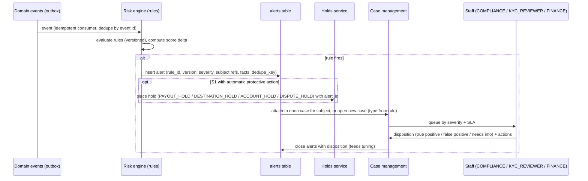

# FundZim Transaction Monitoring (Stage 1 design)

> **Status:** Stage 1 design. Stage 11 builds the minimal rule-based hook ([payout-eligibility-and-controls.md](../payments/payout-eligibility-and-controls.md)
> EC-16), and Stage 13 builds the full risk engine. All thresholds are INTERNAL_RISK limit records with
> placeholder values (`<TBD>`). Approved values are set by the process in
> [aml-risk-framework.md §5](aml-risk-framework.md). No legal threshold is hard-coded.
>
> **Related:** [aml-risk-framework.md](aml-risk-framework.md), [compliance-case-management.md](compliance-case-management.md),
> [sanctions-screening.md](sanctions-screening.md), [transaction-lifecycle.md](../payments/transaction-lifecycle.md),
> [payout-lifecycle.md](../payments/payout-lifecycle.md), [refund-and-dispute-architecture.md](../payments/refund-and-dispute-architecture.md),
> [THREAT-MODEL.md](../THREAT-MODEL.md), [OBSERVABILITY.md](../OBSERVABILITY.md).

---

## 1. Purpose and principles

Monitoring detects patterns that single checks miss. Examples:

- a fake campaign funded by its own linked accounts to look credible;
- card testing through small donations;
- a payout destination changed just before a large withdrawal;
- money moved through a campaign and refunded to a different instrument.

Principles:

1. **Event-driven and explainable.** Each rule evaluates domain events and emits an alert with the triggering
   facts. Alerts never contain raw C3 data; they reference subject ids.
2. **Severity drives action.** Low-severity alerts add to a risk score or queue. High-severity alerts can
   **automatically place protective holds**: a payout hold, or a donation step-up. They never automatically
   reject or close an account. Final adverse decisions are human (LR-071; CDPA s 25 per R2-23).
3. **Distinguish virality from abuse.** S.I. 98 of 2026 lists "sudden, unexplained spikes in funding" as a
   terrorist-financing red flag for PVOs (R2-38, HIGH). Legitimate campaigns also spike when shared on
   WhatsApp. Spike rules therefore combine volume with **composition**: new or linked donors, anonymity, card
   origin, refund behaviour. They never use volume alone.
4. **Currency-separated.** Amount rules evaluate per currency. USD and ZWG figures are never summed.
5. **Tunable without deploys.** Rule parameters are limit records. Rule logic is versioned code with feature
   flags.

## 2. Event inputs

| Event (domain) | Key attributes used |
|---|---|
| `payment.status.changed` (CREATED → … → SUCCEEDED / FAILED / CHARGED_BACK) | amount_minor, currency, method, card BIN or issuer country (PSP-reported), donor user id or guest token, device fingerprint, IP, campaign id, anonymity flag |
| `refund.requested` / `refund.completed` | refund amount, time since donation, requester |
| `dispute.opened` / `dispute.closed` | reason code, amount, `reversal_kind` |
| `payout.requested` / `payout.status.changed` | amount, destination id, destination age, approval tier |
| `payout_destination.added` / `.changed` | rail, account fingerprint (HMAC of account number), holder name-match score |
| `user.registered`, `auth.login`, `auth.otp.failed`, `auth.phone.changed` | device, IP, SIM-swap signal (PCR), country |
| `campaign.state.changed`, `campaign.edited` (material) | category, goal, beneficiary, owner |
| `kyc.level.granted` / `kyc.status.changed` | level, PEP status, risk rating |
| `report.submitted` (public "report this campaign") | reporter type, reason |

**Linkage graph.** Stage 13 maintains a graph whose nodes are users, devices, IPs (coarse, /24), payment
instrument fingerprints, payout destination fingerprints and blind-indexed ID numbers. Edges record shared
use. Rules query this graph to detect related accounts. The graph stores fingerprints, never raw instrument
or ID numbers.

## 3. Rule catalogue

Severity: `S1` (hold and urgent review), `S2` (review within SLA), `S3` (score only and aggregate review).
Every parameter in `<…>` is an INTERNAL_RISK limit key.

| ID | Rule | Logic (simplified) | Default severity → automatic action | Typical disposition |
|---|---|---|---|---|
| TM-01 | **Donation velocity: campaign** | Successful donations to campaign in window `<tm.velocity.window>` exceed `<tm.velocity.count>` **and** share from accounts created within `<tm.new_account_age>` exceeds `<tm.new_donor_share_bp>` | S2 → none; S1 if combined with TM-05/TM-07 → `PAYOUT_HOLD` | Viral vs seeded |
| TM-02 | **Donor velocity** | One donor (user, device or instrument fingerprint) makes more than `<tm.donor.count>` donations or more than `<tm.donor.amount_minor>` per currency in the window, across campaigns | S2 → step-up for further donations | Card testing, laundering, or a genuine philanthropist |
| TM-03 | **Card testing** | More than `<tm.cardtest.failures>` failed card attempts per device, IP or BIN range in the window, or many small successful amounts ≤ `<tm.cardtest.small_minor>` | S1 → block device/IP for card method; require login | Fraud ring |
| TM-04 | **Unusual donation size** | Donation exceeds `<tm.large.multiple>` × campaign median **or** exceeds `<tm.large.absolute_minor>` (per currency) | S2 → none (donation already succeeded); flag payout EDD | Large gift vs layering |
| TM-05 | **Round-tripping (donor = owner or beneficiary)** | Donation instrument, device or blind-indexed identity links to the campaign owner, beneficiary or payout destination | S1 → `PAYOUT_HOLD` | Self-funding to fake traction, or laundering through refunds |
| TM-06 | **Multiple accounts / linkage** | Owner is linked (device, ID blind index, payout destination fingerprint) to other owners with rejected, frozen or charged-back campaigns, or more than `<tm.linked_accounts.max>` accounts share a device or destination | S1 for a link to a frozen or fraudulent campaign → `PAYOUT_HOLD` + KYC review; S2 otherwise | Fraud ring vs family sharing a phone |
| TM-07 | **Rapid withdrawal after donations** | Payout requested within `<tm.rapid_payout.after_first_donation>` of campaign start, or within `<tm.rapid_payout.after_spike>` of a TM-01 spike, or the payout amount exceeds `<tm.rapid_payout.share_bp>` of total raised in its first payout | S2 → DUAL approval tier | Normal for funerals (consider the category); suspicious otherwise |
| TM-08 | **Payout destination change** | Destination added or changed within `<tm.dest_change.window>` before a payout request, or after a phone change, password reset or SIM-swap signal | S1 → `DESTINATION_HOLD` (already standard) + manual re-verification | Account takeover |
| TM-09 | **High-risk category, weak evidence** | Category tier HIGH (e.g. medical) and the beneficiary is not `VERIFIED` by the time donations exceed `<tm.unverified_raise.max_minor>` | S2 → none (payout already blocked by EC-04); review prioritised | Pre-empts fake medical appeals |
| TM-10 | **Large or unusual campaign** | Goal or raised amount exceeds `<tm.campaign.large_minor>` per currency, or more than `<tm.campaign.zscore>` standard deviations above category norms | S2 → EDD on the owner; DUAL payouts | Legitimate large appeal vs abuse |
| TM-11 | **Foreign / high-risk jurisdiction exposure** | Donations from cards or donors in countries on the active `jurisdiction_risk` list ([aml-risk-framework.md §3.3](aml-risk-framework.md)) exceed `<tm.hrj.amount_minor>`; for PVO campaigns, approaching the owner-side SI 98 aggregates | S2 → EDD; notify PVO owner via report | PVO foreign-funding duties (owner-side) |
| TM-12 | **Refund abuse** | Refunds requested within `<tm.refund.fast_window>` of donation exceed `<tm.refund.share_bp>` of a campaign's donations, or refunds are requested to a different instrument (LR-081) | S1 → hold refunds pending review | Laundering through refunds |
| TM-13 | **Chargeback / reversal pattern** | Disputes or reversals for a campaign exceed `<tm.dispute.share_bp>` or `<tm.dispute.count>` | S1 → `DISPUTE_HOLD` | Stolen cards |
| TM-14 | **Anonymous concentration** | Anonymous donations exceed `<tm.anon.share_bp>` of a campaign's raised amount, or one anonymous donor exceeds `<tm.anon.single_minor>` | S2 → EDD; for PVO campaigns see LR-069 (→ LR-049)/PD-26 | Obscured donors (an SI 98 red flag for PVOs) |
| TM-15 | **Fraud reports** | Public or donor reports exceed `<tm.reports.count>`, or any report from a verified institution says "we have no such patient/student" | S1 for an institution denial → campaign `SUSPENDED` request to REVIEWER + `PAYOUT_HOLD`; S2 otherwise | Fake campaign |
| TM-16 | **Account takeover signals** | New device + new country + password reset or phone change + payout destination change within `<tm.ato.window>` | S1 → `ACCOUNT_HOLD` | ATO |
| TM-17 | **Dormant-then-active** | Campaign inactive for more than `<tm.dormant.days>` then receives a spike followed by a payout request | S2 | Recycled campaign used for laundering |
| TM-18 | **Structuring** | Multiple donations from linked donors just below `<tm.structuring.reference_minor>`. The reference is the step-up or identity threshold, or a confirmed REGULATORY CDD threshold if LR-060 (→ LR-051) applies. | S2 | Avoiding identification |
| TM-19 | **Sanctions or PEP list update hit** | Rescreening finds a new potential match on an active subject ([sanctions-screening.md](sanctions-screening.md)) | S1 → blocking hold on payouts for the subject | Designation |

Rules TM-05, TM-08, TM-12, TM-15 and TM-16 are part of the **Stage 11 minimal hook**, because they protect
payouts. The rest are Stage 13.

## 4. Alert → case flow



Details:

- **Dedupe.** `alerts.dedupe_key = (rule_id, subject, window_bucket)`. Repeated firings within an open
  alert append facts rather than creating new alerts.
- **Case linkage.** Alerts on the same subject (user, organisation or campaign) roll up into the subject's
  open case of a compatible type ([compliance-case-management.md §3](compliance-case-management.md)).
- **Automatic holds.** These are recorded with `placed_by = system` and the `alert_id`. They are released
  only by a human disposition (EC-12/EC-13).
- **Dispositions.** `TRUE_POSITIVE_FRAUD`, `TRUE_POSITIVE_AML_CONCERN`, `FALSE_POSITIVE`,
  `EXPECTED_BEHAVIOUR` (e.g. viral), and `INSUFFICIENT_INFO`. Each disposition requires a reason code. A
  false-positive disposition on an S1 alert requires a second reviewer.

## 5. Tuning and governance

- **Rule lifecycle:** `DRAFT → SHADOW (alerts recorded, no actions) → ACTIVE → RETIRED`. New rules run in
  shadow mode for `<tm.shadow_days>`, or until COMPLIANCE approves activation. Activation and parameter
  changes go through limit-record maker-checker ([aml-risk-framework.md §5](aml-risk-framework.md)).
- **Back-testing.** Before activation, a rule is replayed over the last `<tm.backtest_days>` of events
  (Stage 13 tooling) to estimate alert volume.
- **Monthly review.** COMPLIANCE reviews these per rule:
  - alert volume;
  - true-positive rate;
  - mean time to disposition;
  - holds caused and their average age;
  - losses that occurred without a prior alert (missed detection).

  Rules whose precision falls below `<tm.min_precision_bp>` for two consecutive months must be retuned or
  justified.
- **Missed-detection learning.** Every confirmed fraud loss gets a post-incident note asking which rule
  should have fired. Rule changes are linked to the incident.
- **Category calibration.** Funeral and emergency campaigns legitimately raise and withdraw fast. Rules
  TM-01 and TM-07 take category-specific parameters (`scope_type = category`) so that urgent needs are
  not penalised.

## 6. Metrics and dashboards (Stage 13/14)

| Metric | Purpose |
|---|---|
| Alerts per rule per day (by severity) | Load, drift |
| Precision per rule (true-positive dispositions ÷ dispositions) | Tuning |
| Time to triage / time to disposition vs SLA (PD-28) | Operations |
| Automatic holds placed / released / average age | Customer impact |
| Fraud losses (`expense:refund_losses`, `expense:chargeback_losses`) per currency | Outcome |
| Share of confirmed fraudulent campaigns detected **before** first payout | Effectiveness north-star |
| Card-testing blocks | Fraud pressure |

Metrics carry no amounts or IDs as metric labels ([OBSERVABILITY.md](../OBSERVABILITY.md)). Amounts come
from ledger reports.

## 7. Data model (conceptual; `risk` schema)

```sql
-- risk.rules — rule_id, version, state DRAFT|SHADOW|ACTIVE|RETIRED, severity_default, action_default, params jsonb (limit_key refs), created_by, approved_by
-- risk.alerts — id, rule_id, rule_version, severity, subject_type, subject_id, related_refs jsonb, facts jsonb (no C3),
--               dedupe_key UNIQUE (partial: open), state OPEN|CLOSED, case_id, disposition, disposition_reason, closed_by, closed_at
-- risk.scores — subject_type, subject_id, score int, rating, contributing_rules text[], computed_at (append history)
-- risk.linkage_edges — node_a, node_b, edge_type (DEVICE|IP24|INSTRUMENT_FP|DESTINATION_FP|ID_BIDX), first_seen, last_seen
```

Alerts and dispositions are append-only in substance. A disposition is set once, and corrections are a new
note linked to the case.

## 8. Open items

- LR-071 (automated decisions), LR-073 (→ LR-052) (reporting duties), LR-081 (refund to a different instrument),
  LR-069 (→ LR-049) (PVO donor data).
- PCR-028 — PSP-reported card issuer country, BIN and device data availability; SIM-swap or number-porting signals from mobile operators or PSPs.
- PD-26 (donor caps), PD-28 (SLAs).

## 9. Sources cited (accessed 2026-10-08; research file R2)

| Ref | Source | URL | Confidence |
|---|---|---|---|
| R2-38 | S.I. 98 of 2026, Second Schedule TF red flags ("sudden, unexplained spikes in funding", obscured donor identity) | `https://www.fiu.co.zw/wp-content/uploads/2025/05/SI-98of2026-PVO-Risk-Based-Supervision.pdf` | HIGH |
| R2-23 | CDPA s 25 (automated decisions), Veritas | `https://www.veritaszim.net/sites/veritas_d/files/Cyber%20%26%20Data%20Protection%20Act%20Cap1207%20No%205%20of%202021%20gaz%202022-03-11.pdf` | HIGH |
