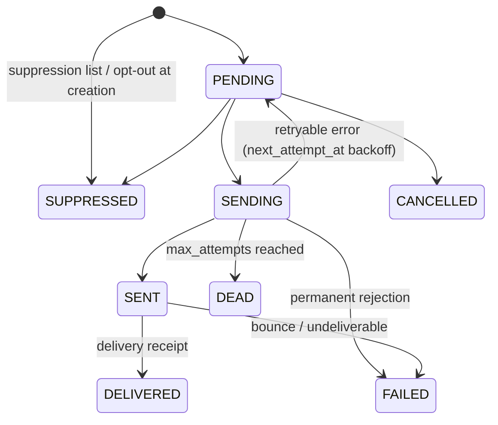

# Audit, Evidence, Outbox/Inbox and Notification Schema

**Stage 2 — design only.** Draft SQL: [`0003_audit.sql`](../../design/sql/0003_audit.sql) (owner `audit`,
schema `audit`), [`0002_platform.sql`](../../design/sql/0002_platform.sql) (outbox/inbox, owner `platform`),
[`0011_notifications.sql`](../../design/sql/0011_notifications.sql) (owner `notifications`, schema `app`).
Tests: [`core_platform_test.sql`](../../design/sql/tests/core_platform_test.sql).

Normative inputs: [AUDIT.md](../AUDIT.md), [audit-evidence-model.md](../compliance/audit-evidence-model.md),
[ADR-019](../adr/ADR-019-regulatory-evidence-management.md), [ADR-025](../adr/ADR-025-outbox-inbox-job-queue.md),
[background-processing.md](../architecture/background-processing.md) (detailed job, retry, dead-letter
behaviour — this document only covers the tables), [PRIVACY.md](../PRIVACY.md), [SECURITY.md §15](../SECURITY.md).

---

## 1. Audit events

### 1.1 `audit.audit_events`

Columns follow AUDIT.md §3: `id`, `seq`, `occurred_at`, `recorded_at`, `actor_type` (`user`, `staff`,
`system`, `provider`, `vendor`), `actor_id`, `actor_role`, `on_behalf_of`, `action`
(`<domain>.<object>.<verb>`), `target_type`, `target_id`, `outcome` (`success`, `denied`, `failed`),
`request_id`, `correlation_id`, `ip`, `user_agent`, `reason`, `justification`, `metadata` (jsonb object),
`break_glass`, `chain_version`, `prev_hash`, `hash`.

| Rule | Enforcement |
|---|---|
| Append-only | `app.forbid_mutation()` row + truncate triggers; grants INSERT/SELECT (0018) |
| User/staff actor has an id | `ck_audit_events_actor_id` |
| Break-glass actions are justified | `ck_audit_events_break_glass_justified` |
| Action naming | `CHECK (action ~ '^[a-z_]+(\.[a-z_*]+)+$')`; the closed catalogue is a Go constant set (unknown actions fail tests) |
| J-actions need justification | Go catalogue (the DB cannot know which actions are J) |
| No C3/C4 in metadata | Redaction allow-list + sentinel tests (AUDIT §6); `metadata.evidence_record_ids[]` references evidence |

Indexes: `(target_type, target_id, occurred_at)`, `(actor_id, occurred_at)`, `(action, occurred_at)`,
`correlation_id`. Monthly partitioning when volume requires (Stage 17/18); a partitioned table needs the chain
per partition with a daily anchor (AUDIT §4.3).

Classification C2; retention class AUDIT, period **LEGAL_REVIEW_REQUIRED (LR-012)**. IP and user agent are
inside the hash; if counsel later permits pseudonymising them, the Stage 3 design must move them to a linked
table or hash a commitment instead (AUDIT §8) — decide before the first production row.

### 1.2 Hash chain

```sql
-- BEFORE INSERT, per table: audit.chain_append()
PERFORM pg_advisory_xact_lock(hashtextextended('audit.audit_events', 0));
NEW.seq       := (SELECT seq FROM audit.audit_events ORDER BY seq DESC LIMIT 1) + 1;   -- 1 for genesis
NEW.prev_hash := hash of that row;
NEW.hash      := sha256(convert_to(jsonb_strip_nulls(to_jsonb(NEW) - 'hash')::text, 'UTF8'));
```

- `seq` is assigned **under the lock**, not from an identity column. With an identity, two concurrent writers
  could take `seq` 10 and 11 but commit 11 first, breaking "chain order = seq order". The transaction-scoped
  advisory lock serialises writers per chain; caller-supplied `seq`/`hash` are overwritten
  (`audit_events_insert_chain_ok`).
- The canonical form is PostgreSQL's jsonb text with `TimeZone = UTC` and `bytea_output = hex` pinned on the
  function, NULL-valued keys stripped (so adding a nullable column does not alter old rows' canonical form).
  `chain_version` identifies the canonicalisation; a new algorithm starts a new version.
- `audit.verify_chain(regclass)` recomputes and reports `seq gap`, `prev_hash` mismatch and `hash mismatch`
  rows (empty result = intact). The Stage 3 verification job calls it (and AUDIT §4.5 SEV1 on any row), and the
  daily anchor (latest `hash`) is exported to write-once storage from Stage 18.
- Throughput: one writer at a time per chain. Audit inserts are short and in the business transaction; the
  lock is held until that transaction commits, so long business transactions serialise audit writers. Keep
  transactions short; if this becomes a bottleneck, shard the chain (per partition/day) under a new
  `chain_version`.
- Tests: tamper (update with the guard disabled) and deletion are both detected.

### 1.3 `audit.security_audit_events`

Same shape minus `on_behalf_of`, **separate chain** (role grants, break-glass, key rotation, MFA changes, KYC
document views, staff session revocation). `SECURITY_ADMIN` reads it via `security_audit.read` without access
to financial audit events.

## 2. Evidence

### 2.1 `audit.evidence_records`

audit-evidence-model §2 columns: `evidence_type` (controlled list), `subject_type`/`subject_id`,
`related_refs` (ids only), `collected_at`, `collected_by_type`/`_id`, `source`, `storage_ref` (random private
key) or `related_refs` (DB row as evidence), `content_sha256` (32 bytes), `size_bytes`, `media_type`,
`classification` (C2/C3), `retention_class` (KYC, FINANCIAL, AUDIT, CASE, CONSENT, OPERATIONAL), `legal_hold`,
`supersedes_id` (re-submission; unique), `audit_event_id` (FK, same transaction).

- Append-only except `legal_hold` (`evidence_records_legal_hold_only`): any other column change is rejected,
  and `legal_hold` must equal "this record has a HOLD row not released". New records cannot start on hold.
- No DELETE/TRUNCATE. The retention job (Stage 17/18) deletes or crypto-shreds the **object** only when the
  class period has elapsed (none is set: LR-012) and `legal_hold = false`, then writes `evidence.purged`; the
  row stays as proof of existence.
- Objects: KYC evidence in the `private-kyc` bucket via `kyc`; other evidence through `storage`
  (`PRIVATE_EVIDENCE` class). Hash verified on every read; mismatch is SEV1.

### 2.2 `audit.evidence_holds`

Append-only HOLD/RELEASE rows: `reason`, `case_id` (no FK, compliance schema), `requested_by`, `approved_by`
with `CHECK (approved_by <> requested_by)`. A RELEASE names the HOLD it releases (`released_hold_id`, composite FK
to the same evidence record, unique — one release per hold; trigger: must reference a HOLD). Legal-hold changes
are therefore always two-person and fully reconstructible.

```sql
BEGIN;
INSERT INTO audit.evidence_holds (id, evidence_record_id, action, reason, requested_by, approved_by, occurred_at) VALUES (...,'HOLD',...);
UPDATE audit.evidence_records SET legal_hold = true WHERE id = $1;   -- rejected unless the HOLD row exists
INSERT INTO audit.audit_events (...) -- evidence.hold.placed
COMMIT;
```

## 3. Outbox and inbox (tables only)

Semantics, dispatcher, ordering and poison handling: [background-processing.md §4](../architecture/background-processing.md).

| Table | Key facts |
|---|---|
| `app.outbox_events` | Written in the business transaction. `event_type` `a.b` naming, `event_version`, `payload` jsonb object (ids + enums; no PII/KYC/secrets), `occurred_at`, `available_at` (backoff), `dispatched_at`, `attempts`, `last_error` (redacted), `dead_lettered_at` (dispatcher gave up). Content immutable (`allow_only_column_changes`), undispatched rows undeletable, dispatched and dead-lettered are mutually exclusive. Hot index `ix_outbox_events_undispatched (available_at, id) WHERE dispatched_at IS NULL AND dead_lettered_at IS NULL`. |
| `app.inbox_events` | `UNIQUE (consumer, event_id)`; inserted in the consumer's effect transaction (`ON CONFLICT DO NOTHING`) so a redelivery is a no-op; never updated; purged only after the redelivery window. |

**Retry / dedupe / dead letter summary.** Dispatcher retries with backoff via `available_at` and dead-letters
after a bounded number of attempts (`dead_lettered_at`, alert). Consumer jobs retry in River and are
discarded after `MaxAttempts` (alert); replay is safe because of `inbox_events`. No financial transition depends
on the outbox alone.

`app.idempotency_keys` (client → API idempotency) is described in [design-principles.md](design-principles.md):
`UNIQUE (scope, key)`, `request_hash` (a reused key with a different body → `409 IDEMPOTENCY_KEY_REUSED`),
`locked_until` lease for an in-flight request, stored response replayed once `COMPLETED` (row frozen),
`expires_at` purge.

## 4. Notifications

### 4.1 Tables

| Table | Purpose | Key rules |
|---|---|---|
| `notification_templates` | Versioned per (key, channel, locale) | One ACTIVE per (key, channel, locale); content immutable once not DRAFT; `approved_by <> created_by`; `is_mandatory` only for SECURITY/TRANSACTIONAL; `subject_template` iff EMAIL; `allowed_variables` allow-list |
| `notification_jobs` | One message to one recipient | `dedupe_key` UNIQUE (e.g. `receipt:payment:<id>:EMAIL` → exactly one receipt); pinned template version; recipient user (contact resolved at send time) or explicit `destination` (guests), redacted later; `destination_hmac` for suppression; `variables` jsonb with no secret-looking keys (`ck_notification_jobs_no_secret_variables`) |
| `notification_attempts` | One row per provider call | Append-only; `(provider_code, provider_message_id)` unique; outcome ACCEPTED / REJECTED / RETRYABLE_ERROR / TIMEOUT |
| `notification_preferences` | Opt-outs for CAMPAIGN_ACTIVITY, CAMPAIGN_UPDATE, MARKETING | SECURITY and TRANSACTIONAL are not preference-controlled; MARKETING opt-in needs recorded consent (LR-035) |
| `notification_suppressions` | Bounces, complaints, STOP, invalid destinations, SMS pumping | Keyed by `destination_hmac` (works for guests); one active per (channel, destination); scope `ALL` (also blocks mandatory) or `ALL_NON_MANDATORY`; lifting is an update with reason, never a delete |

### 4.2 Job state machine (`notification_job`)



- Record intent → call → record result: `PENDING → SENDING` committed before the provider call; the attempt row
  and the resulting state in a second transaction. A crash in `SENDING` is retried by a sweeper (the provider
  idempotency key is the job id where supported, otherwise a duplicate SMS is an accepted low-impact risk for
  non-financial messages; receipts rely on `dedupe_key` to avoid duplicate *jobs*).
- `SUPPRESSED` requires `suppressed_reason` (SUPPRESSION_LIST with `suppression_id`, or PREFERENCE_OPT_OUT).
- **OTP delivery** (baseline: `auth` imports `notifications`): `auth` calls the notifications service
  synchronously, passing the code in memory; the job row records template, recipient and outcome without the
  code. The only persisted form of an OTP is `otp_challenges.code_hmac`.
- No C3/C4 in any message or stored variable (DATA-CLASSIFICATION; AUDIT §6). Masked values only.
- Retention: OPERATIONAL; `destination`/`variables` redacted (`redacted_at`) after the operational window;
  periods pending LR-012.

## 5. Classification summary

| Table | Class | Notes |
|---|---|---|
| audit_events, security_audit_events | C2 | No C3/C4 content; IP/UA are C2 |
| evidence_records | C2 metadata | Referenced object may be C3 |
| evidence_holds | C2 | |
| outbox_events | C2 | Payload minimal |
| inbox_events | C1 | |
| notification_templates | C1 | |
| notification_jobs / attempts | C2 | Contact data, redacted later |
| notification_preferences / suppressions | C2 | HMAC destinations |

## 6. Test requirements

Stage 2 in-memory: audit UPDATE/DELETE/TRUNCATE rejected; chain links and verifies; caller-supplied seq/hash
ignored; tamper and deletion detected; separate security chain; evidence: non-`legal_hold` update rejected,
hold flag without HOLD row rejected, cannot start on hold, hold self-approval rejected, hold/release flow,
double release rejected, holds append-only; outbox content immutable, undispatched delete rejected, terminal
exclusivity; inbox duplicate rejected; notification dedupe, illegal transition, secret variables rejected,
attempts append-only, active template immutable, marketing consent, SECURITY not preference-controlled, one
active suppression.

Stage 3+ (real PostgreSQL): concurrent audit writers keep a contiguous chain; verifier job and alert; every
service method writes its audit event in the same transaction (and none on rollback); redaction sentinel
tests; outbox crash/replay tests; notification idempotent sends and retry tests (Stage 15).
