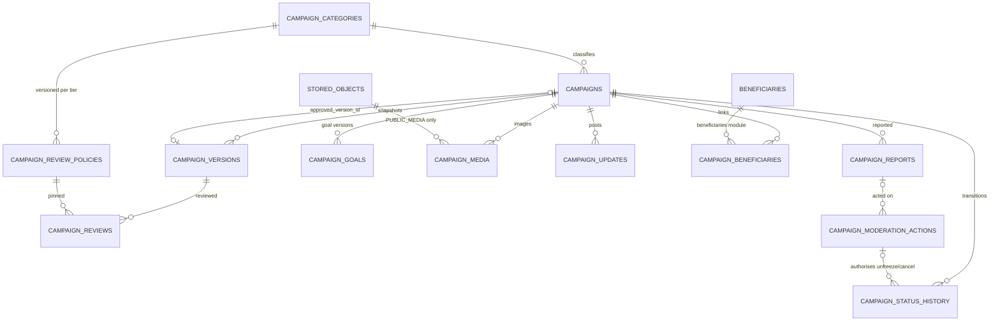
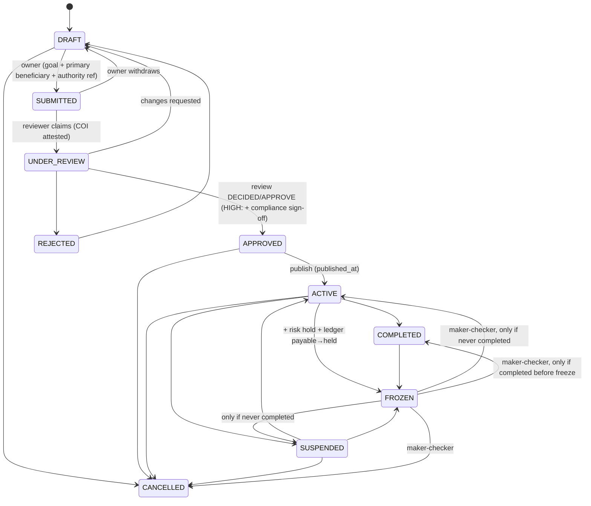

# Campaign Schema

**Stage 2 — design only.** Draft SQL: [`design/sql/0014_campaigns.sql`](../../design/sql/0014_campaigns.sql)
(owner `campaigns`, schema `app`); tests: [`design/sql/tests/campaigns_test.sql`](../../design/sql/tests/campaigns_test.sql).
Executable migrations: Stage 6 ([migration-plan.md](migration-plan.md)).

Normative inputs: [PRODUCT.md §5, §6, §9](../PRODUCT.md), [campaign-approval-policy.md](../compliance/campaign-approval-policy.md),
[beneficiary-verification.md](../compliance/beneficiary-verification.md), [MONEY.md](../MONEY.md),
[currency-and-fx-policy.md](../payments/currency-and-fx-policy.md), [ADR-010](../adr/ADR-010-multi-currency.md),
[ADR-013](../adr/ADR-013-regulatory-operating-model.md), [operational-controls.md](../compliance/operational-controls.md),
[design-baseline.md §5.15, §8, §12 (I-9)](../stage-2/design-baseline.md).

---

## 1. Tables

| Table | Purpose | Mutability | Class | Retention |
|---|---|---|---|---|
| `campaign_categories` | Categories + provisional default risk tier | Config (no delete) | C0 | Reference |
| `campaign_review_policies` | Versioned review policies (checks, documents, escalation, payout controls) | Immutable once PUBLISHED | C1 | AUDIT |
| `campaigns` | The aggregate: owner, status, visibility, settlement model, goal currency, working copy | Mutable, `version` | C1/C2 → C0 published | FINANCIAL |
| `campaign_versions` | Content snapshots at submission and material edits | Append-only | C1/C2 → C0 approved | FINANCIAL |
| `campaign_goals` | Goal versions (amount + currency) | Append-only | C0 published | FINANCIAL |
| `campaign_media` | Images (public media only) | Mutable (soft-remove) | C1 → C0 | OPERATIONAL |
| `campaign_updates` | Owner updates to donors | Mutable, `version` | C0 published | OPERATIONAL |
| `campaign_beneficiaries` | Link to `app.beneficiaries` (one primary) | Append-only + unlink | C2 | FINANCIAL |
| `campaign_reviews` | One review per (re)submission | Mutable until DECIDED | C2 | AUDIT |
| `campaign_status_history` | Every lifecycle transition | Append-only | C2 | FINANCIAL/AUDIT |
| `campaign_reports` | Public abuse reports | Mutable triage, content immutable | C2 | CASE |
| `campaign_moderation_actions` | Staff content actions + unfreeze/cancel-from-FROZEN maker-checker | Append-only | C2 | AUDIT |



## 2. `app.campaigns`

| Column group | Columns |
|---|---|
| Identity | `id`, `public_code` (10 chars Crockford base32, unique), `slug` (URL `/c/{slug}-{public_code}`), `market_code` |
| Ownership | exactly one of `owner_user_id` (USER account only, composite FK) / `owner_organisation_id` (`ck_campaigns_exactly_one_owner`); `created_by_user_id` (the person, e.g. org representative). All immutable. |
| Content (working copy) | `category_id`, `title`, `summary`, `story`. The public page renders `approved_version_id`, never the working copy. |
| Lifecycle | `status`, `submitted_at`, `approved_at`, `published_at`, `completed_at`, `cancelled_at`, `re_review_required` + `re_review_reason`, `risk_tier` (set at submission), `version` |
| Publication | `visibility` (`PUBLIC`, `UNLISTED`, `HIDDEN`) |
| Money configuration | `goal_currency` (FK `currencies`), `accepted_currencies char(3)[]` (PD-02; MVP = `{goal_currency}`), `settlement_model` (`MODEL_A`, `MODEL_C`) |
| Legal gate | `fundraising_authority_ref` (→ `kyc.fundraising_authorities`, **no FK**), required once submitted |
| Dates | `ends_at` + `ends_at_time_zone` (Harare calendar date as an instant); must not exceed the fundraising authority's validity (checked by the service through `kyc`) |

**There is no raised, balance or total column** (test `no_raised_or_balance_column_on_campaign_tables`).

Selected constraints:

```sql
CONSTRAINT ck_campaigns_visibility_published CHECK (
  visibility = 'HIDDEN' OR status IN ('ACTIVE', 'COMPLETED', 'SUSPENDED', 'FROZEN', 'CANCELLED')),
CONSTRAINT ck_campaigns_model_c_org_only CHECK (settlement_model = 'MODEL_A' OR owner_organisation_id IS NOT NULL),
CONSTRAINT ck_campaigns_accepted_currencies CHECK (
  cardinality(accepted_currencies) BETWEEN 1 AND 4 AND goal_currency = ANY (accepted_currencies)),
CONSTRAINT ck_campaigns_fundraising_authority CHECK (fundraising_authority_ref IS NOT NULL OR status IN ('DRAFT', 'CANCELLED')),
CONSTRAINT ck_campaigns_approved CHECK (
  status IN ('DRAFT','SUBMITTED','UNDER_REVIEW','REJECTED','CANCELLED') OR (approved_at IS NOT NULL AND approved_version_id IS NOT NULL)),
```

- Model C (direct beneficiary settlement) is only for organisations (ADR-013); routing still refuses
  `MERCHANT_SETTLEMENT` providers ([provider-capability-abstraction](../adr/ADR-029-provider-capability-abstraction.md)).
- The individual-for-others policy switch (`campaign.individual_for_others.enabled`, seeded `false` in
  `app.feature_flags`) is checked by the submission service against the beneficiary type
  (LR-046 – LR-048, PD-27).
- Indexes: owner lookups, `(status, submitted_at)` for queues and lifecycle jobs,
  `(category_id, published_at) WHERE visibility = 'PUBLIC'` for listing, `ends_at WHERE status = 'ACTIVE'` for
  the completion job.

## 3. Lifecycle



Enforcement layers:

1. **Edge list** — all 22 PRODUCT §6.2 transitions plus `'' → DRAFT` in `app.status_transitions`
   (machine `campaign`), guarded by `app.guard_transition('campaign')`.
2. **Rules the edge list cannot express** — `campaigns_lifecycle_rules` (BEFORE INSERT/UPDATE):
   - `FROZEN → COMPLETED` only if `completed_at` was already set (completed before the freeze);
     `FROZEN → ACTIVE|SUSPENDED` only if it was **not** (a completed campaign never reopens through a freeze);
   - `→ SUBMITTED` requires at least one goal row and a linked primary beneficiary (`BENEFICIARY_DECLARED` gate);
   - `goal_currency` may change only in a DRAFT that was never submitted;
   - every accepted currency must exist in `app.currencies`.
3. **History** — a deferred constraint trigger requires, for every insert and every status change, a
   `campaign_status_history` row with `campaign_version = campaigns.version` (after the bump) and the exact
   `from_status`/`to_status`. One row per version (`uq_campaign_status_history_version`).
4. **Who** — history rows: `actor_type` (user/staff/system), staff rows need `justification`,
   `approved_by <> actor_id`.
5. **Maker-checker for leaving FROZEN** (operational-controls §3, baseline I-9) — see §6.
6. **Timestamps** — CHECKs tie `submitted_at`, `approved_at`, `published_at`, `completed_at`, `cancelled_at`
   to the states that need them.

A transition in Go is therefore: lock the campaign row (`FOR UPDATE`), validate in the state machine, insert
the history row with `version + 1`, update the campaign (`WHERE id = $1 AND version = $2`), write the audit
event and outbox event — one transaction.

**Re-review on material edits (campaign-approval-policy §7.1).** Material edits on an ACTIVE campaign create a
`campaign_versions` row (`change_kind = 'MATERIAL_EDIT'`, `material_change_types`), set `re_review_required`,
and open a `RE_REVIEW` review. The public page keeps showing the previously approved version until the new one
is approved. Payouts pause if the risk policy says so (a `risk.holds` row, not a campaign state).

## 4. Publication vs financial restriction

| Concern | Where | Example |
|---|---|---|
| Is it visible? | `campaigns.visibility` | `PUBLIC`, `UNLISTED` (link only), `HIDDEN` |
| Where is it in its lifecycle? | `campaigns.status` | `ACTIVE`, `SUSPENDED`, `FROZEN` … |
| Can its money move? | `risk.holds` rows (`PAYOUT_HOLD`, `DESTINATION_HOLD`, `COMPLIANCE_HOLD`, dispute holds) | `ACTIVE` + `PUBLIC` while a destination-change hold blocks payouts |
| Where is its money? | Ledger accounts (`campaign_payable`, `campaign_held`, reserves …) | `FROZEN` moves available to `campaign_held` |

`FROZEN` is the one state with a financial side effect: the freeze transaction (owned by `campaigns`, which
imports `ledger` and `risk` for this purpose — baseline §3) inserts the history row, places the risk hold and
posts the payable → held journal; the history row records `risk_hold_id` and `ledger_transaction_id`.
Unfreeze posts the inverse journal and releases the hold.

## 5. How "raised" is derived (never stored)

The campaign page shows **per currency**, never a single total (MONEY §8, PRODUCT §9):

- *Raised*: sum of donation captures posted to the campaign's ledger accounts, `GROUP BY currency`, from
  `ledger.ledger_entries` / `ledger.ledger_balances` (projection updated in the posting transaction and
  verifiable by recompute). Only authoritatively confirmed payments are posted.
- *Progress bar*: goal-currency amount only, against the current `campaign_goals` row.
- *Available / reserved / paid out*: separate ledger account balances, shown only to the owner and staff,
  never merged into one "balance".
- For listing performance a read-model may cache per-currency raised amounts (outbox consumer), labelled as a
  cache and rebuildable from the ledger; it is never an input to payouts or fees.

## 6. Goals and currency

- `campaign_goals` is append-only: `goal_version` unique per campaign, `amount_minor bigint CHECK (> 0)`,
  `currency` FK. A trigger rejects a goal whose currency differs from `campaigns.goal_currency`.
- `goal_currency` is fixed after submission (`goal_currency_change_after_submission_rejected`); before any
  submission a DRAFT may switch currency (older draft goal rows stay as history; the current goal is the
  highest `goal_version`, always in the current goal currency).
- Goal increases above a configured ratio on an ACTIVE campaign are material edits (re-review).

## 7. Reviews

`campaign_reviews` pins `campaign_version_id` (composite FK: version of the same campaign) and a
`review_policy_id` that must be `PUBLISHED` at insert. Rules:

| Rule | Enforcement |
|---|---|
| One open review per campaign | `uq_campaign_reviews_open … WHERE status IN ('QUEUED','CLAIMED','ESCALATED')` |
| Claim requires conflict-of-interest attestation | `ck_campaign_reviews_claim` (`coi_attested_at`) |
| Decision completeness (outcome, reason, justification, decider) | `ck_campaign_reviews_decided` |
| HIGH tier APPROVE needs COMPLIANCE sign-off by a different person | `ck_campaign_reviews_high_four_eyes` |
| No APPROVE with a FAIL check | `ck_campaign_reviews_no_failed_check_approval` (jsonpath over `check_results`) |
| Escalation links a compliance case | `ck_campaign_reviews_escalated` |
| Decided/cancelled reviews are final | trigger |

Review policies: maker-checker (`approved_by <> proposed_by`; BUSINESS_APPROVER or designated officer
approves, baseline I-4), immutable once PUBLISHED, one current per (category, tier), and an ELEVATED/HIGH policy
must contain at least one MANUAL check (`ck_campaign_review_policies_human_review`, "no auto-approve on
verified identity"). Category tiers seeded here are the provisional values of campaign-approval-policy §4;
assignment is configuration approved by the business owner.

`check_results` is a jsonb array on the review rather than a separate table, because the baseline catalogue has
no check-result table; see the open question in §11.

## 8. Unfreeze and cancel-from-FROZEN maker-checker (baseline I-9)

`campaign_moderation_actions` is the home for these pending objects:

| Row | Columns | Rules |
|---|---|---|
| `UNFREEZE_REQUEST` / `CANCEL_FROM_FROZEN_REQUEST` | `requested_by = actor_id`, `expires_at` (72 h) | maker |
| `UNFREEZE_APPROVE` / `CANCEL_FROM_FROZEN_APPROVE` | `request_action_id`, `requested_by` (copied), `approved_by = actor_id` | `CHECK (approved_by <> requested_by)`; must match a request of the same kind and maker, before expiry; one decision per request (`uq_campaign_moderation_actions_request`) |

The `FROZEN → ACTIVE | COMPLETED` (UNFREEZE) and `FROZEN → CANCELLED` (CANCEL_FROM_FROZEN) history rows must
carry `moderation_action_id` of a matching APPROVE row whose maker is the history `actor_id` and checker is
`approved_by`; each approval can authorise one transition only (trigger
`campaign_status_history_check_unfreeze`). `ck_campaign_status_history_unfreeze_checker` and
`ck_campaign_status_history_distinct` remain as a second layer. `FROZEN → SUSPENDED` (de-escalation) needs no
checker. Whoever froze the campaign cannot approve its unfreeze: that object-level rule is checked in the
service (operational-controls §2 "Unfreeze approve").

## 9. Media, updates, reports, moderation

- `campaign_media` references `stored_objects` through `(stored_object_id, 'PUBLIC_MEDIA')`, so a private
  KYC/evidence object can never become campaign media (`private_object_cannot_be_campaign_media`). A media row
  that depicts a minor needs `guardian_consent_ref` before it is `READY` (beneficiary-verification §4 rule 3).
  One cover image per campaign. Supporting documents (medical letters, invoices) are **evidence**, never media.
- `campaign_updates`: DRAFT → PUBLISHED → HIDDEN (staff, reason) / DELETED (soft).
- `campaign_reports`: guests allowed (`reporter_contact_hmac` blind index for rate limiting and follow-up);
  reporter identity is never shown to the owner; reason and details immutable; resolution CHECKs; duplicates
  point at the original.
- `campaign_moderation_actions`: append-only staff content actions with justification and redacted
  `details`; they never change lifecycle state (that is `campaign_status_history`).

## 10. Failure handling and concurrency

| Situation | Behaviour |
|---|---|
| Two staff transition the same campaign | Both lock `FOR UPDATE`; the second re-reads status and fails the guard or the optimistic `version` check (`CONFLICT`) |
| Owner edits while a reviewer approves | Optimistic `version`; the review is pinned to the submitted version, so later edits are a new version |
| Freeze transaction fails mid-way (ledger post fails) | One transaction: nothing commits; the campaign stays ACTIVE and an alert fires |
| Fundraising authority expires while ACTIVE | `kyc` emits an event; campaigns sets `re_review_required`, risk places a payout hold; payouts fail closed |
| Completion job and owner close race | Same lock; second transition `COMPLETED → COMPLETED` is a no-op update without status change |

## 11. Open questions

- `check_results` jsonb vs a `campaign_review_check_results` table (per-check evidence links, acknowledgement
  and querying would be cleaner as rows). Needs a baseline amendment if adopted.
- Multi-beneficiary campaigns are disabled by `CHECK (is_primary)`; relaxing it needs a policy decision.
- Whether a DRAFT may switch goal currency at all, or must be re-created, is a product choice (currently allowed
  until first submission).

## 12. Test requirements

Stage 2 in-memory (`campaigns_test.sql`, 79 cases): ownership (both/neither/staff owner), creation state and
history, visibility before publication, Model C restriction, public code alphabet, accepted currencies,
negative/zero/decimal/currency-less/other-currency goals, goal append-only, submission gates (beneficiary,
fundraising authority, history), illegal `DRAFT → ACTIVE`, legal `DRAFT → SUBMITTED`, goal currency lock,
review policy rules, review claim/decision rules, HIGH four eyes, failed-check approval, approved version
ownership, freeze, unfreeze maker-checker (missing approval, self-approval, wrong kind, reuse), completed-campaign
freeze rules, `COMPLETED → ACTIVE` rejected, 22 edges registered, media bucket and minor consent, report
immutability, moderation append-only, no raised column.

Stage 6 (real PostgreSQL): exhaustive allowed/forbidden transition matrix generated from the Go state machine
and compared with `app.status_transitions`; concurrent transitions; IDOR tests; freeze/unfreeze with ledger and
risk in one transaction (Stage 10+).
