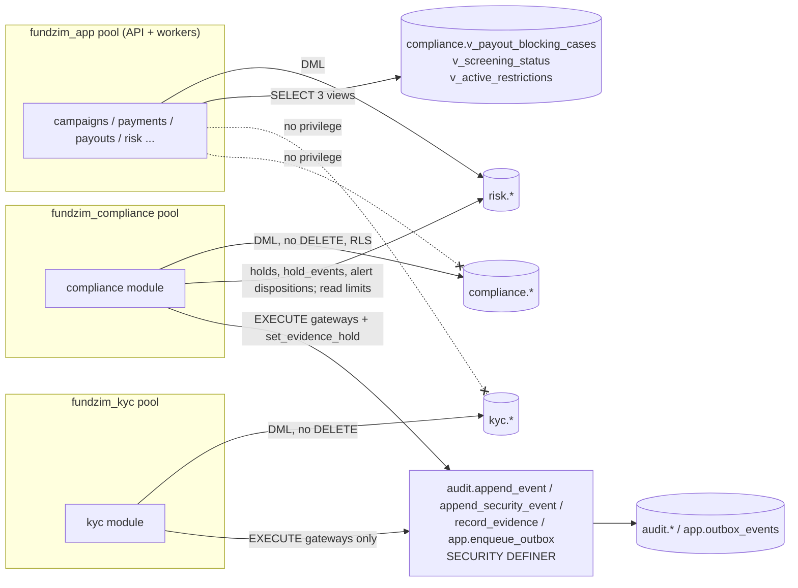

# Compliance-domain schemas: `kyc`, `risk`, `compliance` (Stage 2 design)

> **Status:** Stage 2 design. The SQL is a **non-executable draft** validated only in an in-memory PGlite
> database: [`design/sql/0008_risk.sql`](../../design/sql/0008_risk.sql),
> [`0010_kyc.sql`](../../design/sql/0010_kyc.sql), [`0013_compliance.sql`](../../design/sql/0013_compliance.sql),
> grants and RLS in [`0018_grants.sql`](../../design/sql/0018_grants.sql), tests in
> [`tests/risk_compliance_test.sql`](../../design/sql/tests/risk_compliance_test.sql) and
> [`tests/grants_test.sql`](../../design/sql/tests/grants_test.sql). Executable migrations start in Stage 3.
> Nothing here is a legal conclusion and nothing here claims compliance with any law. Every legal value
> (threshold, period, deadline) is a `risk.limits` record or is marked `LEGAL_REVIEW_REQUIRED`.
>
> **Contract:** [design-baseline.md](../stage-2/design-baseline.md) §4, §5.9, §5.11, §5.14, §6, §10
> (ADR-021, ADR-022). **Sources:** [kyc-architecture.md](../compliance/kyc-architecture.md),
> [kyb-architecture.md](../compliance/kyb-architecture.md), [beneficiary-verification.md](../compliance/beneficiary-verification.md),
> [aml-risk-framework.md](../compliance/aml-risk-framework.md), [transaction-monitoring.md](../compliance/transaction-monitoring.md),
> [sanctions-screening.md](../compliance/sanctions-screening.md), [compliance-case-management.md](../compliance/compliance-case-management.md),
> [operational-controls.md](../compliance/operational-controls.md), [payout-eligibility-and-controls.md](../payments/payout-eligibility-and-controls.md) §4–§5,
> [identity-data-protection.md](../security/identity-data-protection.md), ADR-009.

---

## 1. Boundaries at a glance

| Schema | Owner module | Runtime role with access | Data class | What it holds |
|---|---|---|---|---|
| `kyc` | `kyc` | `fundzim_kyc` **only** | C3 RESTRICTED | Identity attributes (encrypted), KYC/KYB cases, checks, decisions, document metadata, consents, organisation persons, fundraising authorities, beneficiary evidence links, gate policies, vendor callback inbox |
| `risk` | `risk` | `fundzim_app`; narrow grants to `fundzim_compliance` | C1/C2 (no C3) | Limits registry, holds (all types), signals, assessments, monitoring rules and alerts |
| `compliance` | `compliance` | `fundzim_compliance` (RLS on STR-restricted rows); `fundzim_app` reads three views only | C3 | Cases, events, links, screening list sources, requests/results/hits, suppressions, STR preparation, capability restrictions, screening callback inbox |

Rules:

- Nothing in `app` references `kyc` (baseline §10). Other modules learn KYC level/status from events
  (`app.users.kyc_level`/`kyc_status` mirror, `app.organisation_verifications` projection) or by calling
  the `kyc` service. They receive decisions and opaque evidence IDs, never identity values.
- `risk` is a leaf: it references only `app.users` and `app.currencies`. Case, ledger, campaign and
  provider IDs in `risk` are plain `uuid`s (owners in higher layers or domain-agnostic ledger).
- `compliance` may import `storage` (baseline §3 amendment): evidence and STR objects are written by the
  storage module with the `private-evidence` credential (`compliance/` and `reports/` prefixes only; I-19).
  KYC objects are written only by the kyc module with the `private-kyc` credential (`kyc/` prefix); neither
  credential reads the other's prefix. `compliance` references `app.users` and `audit.evidence_records`. Hold, limit and subject IDs are plain
  `uuid`s; where integrity matters they are validated by trigger (restriction → hold, restriction → limit).

## 2. Brief name → final name

| Brief / Stage 1 name | Final table | Notes |
|---|---|---|
| `transaction_limits`, Stage 1 `risk.limits` | `risk.limits` | + `risk.limit_change_requests` (maker-checker object) |
| hold release approvals | `risk.hold_release_requests` | baseline §12 I-3 |
| Stage 1 `holds` / `payout_holds` | `risk.holds` | baseline §6 resolution 1 (risk owns all hold types) |
| Stage 1 `hold_events` | `risk.hold_events` | |
| Stage 1 `risk.scores` | `risk.risk_assessments` | append-only scores with contributing rules |
| Stage 1 `risk.rules` | `risk.monitoring_rules` | versioned |
| Stage 1 `risk.alerts` | `risk.monitoring_alerts` | |
| Stage 1 signals / linkage inputs | `risk.risk_signals` | linkage graph edges deferred to Stage 13 (C-7) |
| `verification_profiles` | `kyc.verification_profiles` | columns `level`/`status` = Stage 1 `verification_level`/`verification_status` |
| `profile_events` | `kyc.profile_events` | also carries KYB organisation level/status history |
| `verification_attempts` + `reviews` / `kyc_cases` | `kyc.kyc_cases` | `origin` distinguishes attempts from re-verification reviews |
| `check_results` / `kyc_checks` | `kyc.kyc_checks` | |
| document metadata / `kyc_documents` | `kyc.kyc_documents` | |
| review decisions / `kyc_decisions` | `kyc.kyc_decisions` | also used for KYB case decisions |
| `identities` | `kyc.identities` | |
| `consents` | `kyc.consents` | append-only (withdrawal = new row) |
| `kyc.organisations` | `kyc.kyb_organisations` | |
| org attempts/reviews / `kyb_cases` | `kyc.kyb_cases` | |
| `org_check_results` | `kyc.kyb_checks` | |
| `org_persons` | `kyc.organisation_persons` | |
| BO subset / `beneficial_owners` | `kyc.beneficial_owners` | per-case determinations |
| `org_representative_authorities` | `kyc.representative_authorities` | |
| `fundraising_authorities` | `kyc.fundraising_authorities` | |
| `beneficiary_evidence` | `kyc.beneficiary_evidence` | |
| `kyc_gate_policy` | `kyc.gate_policies` | baseline amendment |
| KYC vendor inbox | `kyc.vendor_callback_inbox` | baseline amendment |
| `compliance.cases` | `compliance.compliance_cases` | |
| `case_events` | `compliance.compliance_case_events` | |
| `case_subjects` + `case_links` | `compliance.compliance_case_links` | one table, `role` separates subjects from objects |
| `case_notes` | — (evidence records `REVIEW_NOTE`, C3) | notes are never free text in case rows |
| `screening_requests` | `compliance.screening_requests` | |
| `screening_results` | `compliance.sanctions_screening_results` | |
| `screening_hits` | `compliance.screening_hits` | |
| STR record / `str_record` | `compliance.str_reports` | |
| overrides / exemptions / restrictions | `compliance.compliance_restrictions` | capability restrictions; payout blocking via `risk.holds` |
| screening vendor inbox | `compliance.screening_callback_inbox` | baseline amendment |
| `screening_list_sources`, `screening_suppressions` | `compliance.screening_list_sources`, `compliance.screening_suppressions` | added (lead decision C-2) |

## 3. `risk` schema

### 3.1 `risk.limits` and `risk.limit_change_requests`

| Column group | Columns | Constraint |
|---|---|---|
| Identity | `limit_key`, `version`, `limit_type`, `scope_type`, `scope_value`, `currency` | `UNIQUE NULLS NOT DISTINCT (limit_key, limit_type, scope_type, scope_value, currency, version)`; `version = 1` ⇔ `supersedes_id IS NULL`; `supersedes_id` must be the previous version of the same identity (trigger) |
| Value | `value_kind` (`MONEY`/`COUNT`/`DURATION`/`BASIS_POINTS`), `value_minor` bigint, `value_count`, `value_seconds`, `value_bp` | exactly one value column, matching the kind; `currency` **iff** `MONEY`; non-negative |
| Source | `source_type`, `source_ref`, `source_citation`, `legal_review_ref`, `counsel_ref` | REGULATORY ⇒ statute/regulation/directive/guideline, `source_ref` = `REQ-nnn`, citation present, and `LR-nnn` or counsel ref; PROVIDER ⇒ `PCR-nnn` / `CONTRACT:` / `PROVIDER_DOC:`; INTERNAL_RISK ⇒ `DEC-…` or `PD-nn` |
| Governance | `approval_owner_role` (COMPLIANCE for REGULATORY), `status`, `made_by`, `approved_by`, `approved_at`, `approval_request_id`, `retired_*` | `approved_by <> made_by`; REGULATORY approval needs `counsel_ref` |
| Validity | `effective_from`, `effective_to`, `review_by` (NOT NULL) | |

Lifecycle (machine `risk_limit`): `PROPOSED → APPROVED | REJECTED`, `APPROVED → RETIRED`. A row is inserted
only as `PROPOSED` (seeds with citations included). Approval may change only the approval columns and must
match an `APPROVED` `ACTIVATE` request decided by the same checker. Every value column is immutable in every
state: a change is a new version. `DELETE`/`TRUNCATE` raise.

`risk.limit_change_requests` is the pending maker-checker object: `action` (`ACTIVATE`/`RETIRE`),
`payload_sha256` of the snapshot the checker saw, `expires_at` (from limit `approval.limit_change.validity`),
`checker_step_up_at` required on approval, `decided_by <> requested_by`, one pending request per
(limit, action), frozen after decision.

Engine resolution (Go): APPROVED version with the highest `version` whose window contains now, per type;
the most restrictive type wins; no effective record ⇒ fail closed (EC-21). `risk.ro_limits_review_status`
lists past-`review_by` records for the reporting role.

### 3.2 `risk.holds` and `risk.hold_events`

| Hold type | Allowed `scope_type` | Placed by (DB) | Release (DB) |
|---|---|---|---|
| `CAMPAIGN_FREEZE` | CAMPAIGN | staff | APPROVED `hold_release_requests` row (maker = releaser, checker ≠ maker ≠ placer); journal + inverse journal required |
| `COMPLIANCE_HOLD` | CAMPAIGN, USER, ORGANISATION, BENEFICIARY, PAYOUT_DESTINATION | staff; `case_id` required | APPROVED `hold_release_requests` row (as above) |
| `PAYOUT_HOLD` | CAMPAIGN, USER | staff or system | staff |
| `DISPUTE_HOLD` | CAMPAIGN | system | system or staff |
| `DESTINATION_HOLD` | PAYOUT_DESTINATION | system | system (after cooling-off + re-verification, service) or staff |
| `RECOVERY_HOLD` | CAMPAIGN, USER | staff | staff |
| `ACCOUNT_HOLD` | USER | staff or system | staff |
| `PROVIDER_HOLD` | PROVIDER_CURRENCY (`scope_id` = provider, `scope_currency`) | staff or system | system or staff |

`risk.hold_release_requests` (baseline §12 I-3) is the pending maker-checker object for a release:
`requested_by`, `decided_by` (CHECK ≠, and ≠ whoever placed the hold — trigger), `payload_sha256`,
`expires_at` (limit `approval.hold_release.validity`), `checker_step_up_at`, one PENDING request per hold,
frozen after decision. `risk.holds_guard` refuses to release a freeze or compliance hold unless
`release_request_id` names an APPROVED request whose maker is the releaser and whose checker is
`release_approved_by`. The service may route other hold types through a request too.

Columns follow payout-eligibility-and-controls §5: `reason_code`, `reason_text` (no C3), `confidential`
(tipping-off; owner sees neutral text), `origin_type`/`origin_id`/`alert_id`, `case_id`, `placed_*`,
`review_by` (LR-084), `ledger_transaction_id`, `released_*`, `release_approved_by`,
`release_ledger_transaction_id`, `version`.

Immutability (trigger `risk.holds_guard`): only the release columns (once) and a first `case_id` may
change; once `released_at` is set, any change — including clearing — raises; `version` increases by one per
change; `DELETE`/`TRUNCATE` raise. A deferred constraint trigger requires a `hold_events` row for every
hold version and a `RELEASED` event for a released hold. `hold_events` is append-only.

### 3.3 Signals, assessments, rules, alerts

| Table | Key constraints |
|---|---|
| `risk_signals` | append-only; `UNIQUE (source_event_id, signal_type)` (idempotent consumer); facts = codes and HMAC fingerprints only |
| `risk_assessments` | append-only; `score` 0–1000; `rating` LOW/STANDARD/HIGH; `contributing_rules[]`; `rating_limit_ids[]` |
| `monitoring_rules` | versioned (`UNIQUE (rule_code, version)`); machine `DRAFT→SHADOW→ACTIVE→RETIRED`; leaving DRAFT needs `approved_by ≠ created_by`; content frozen after DRAFT; one SHADOW/ACTIVE version per rule; parameters are limit keys |
| `monitoring_alerts` | `UNIQUE (dedupe_key) WHERE status='OPEN'`; `mode` SHADOW/ACTIVE; disposition set once at close; S1 false positive needs a different second reviewer; only counters, case link (once) and closure change |

## 4. `kyc` schema

### 4.1 Tables

| Table | Purpose | Mutability | Key constraints |
|---|---|---|---|
| `verification_profiles` | One per user: `level`, `status`, `risk_rating`, `pep_status`, `paused_scope`, `policy_version` | versioned (`version`+1 per change) | `UNIQUE (user_id)`; status machine `kyc_verification_status`; PEP ⇒ HIGH; paused scope only while PENDING_REVIEW; every version has a matching `profile_events` row (deferred) |
| `profile_events` | Level/status history (individuals **and** KYB organisations) | append-only | exactly one subject; `UNIQUE (subject, aggregate_version)` |
| `kyb_organisations` | KYB record per `app.organisations` row; registered address encrypted | versioned | same overlay machine; same event requirement |
| `kyc_cases`, `kyb_cases` | Attempts and reviews | status only | machine `kyc_case`: `OPEN→IN_REVIEW→(AWAITING_SUBMISSION↔IN_REVIEW)→ESCALATED→DECIDED`, `OPEN→DECIDED` (automated PASS only), `→ABANDONED` |
| `kyc_checks`, `kyb_checks` | Check results | **append-only** | result `PASS/FAIL/REVIEW/N_A`; `valid_until`; `evidence_record_ids[]`; non-PASS needs `reason_code`; `MANUAL_IDENTITY_REVIEW` only by staff; case/profile must match |
| `kyc_decisions` | Human decisions | append-only | `second_approver_id <> decided_by`; second approver required when flagged and always for `REJECT` with `FRAUD_*`; reviewer cannot decide own verification; organisation representative cannot decide own KYB |
| `identities` | C3 attributes | content immutable; lifecycle `ACTIVE → SUPERSEDED/INACTIVE → SHREDDED` | see §4.2 |
| `consents` | Consent facts | append-only | withdrawal = new `WITHDRAWN` row referencing the `GIVEN` row (same type and subject; one withdrawal per consent); sensitive types need OTP e-consent or signed form; view `v_consents_current` |
| `kyc_documents` | Document metadata | append-only (re-submission = new row) | composite FK `(stored_object_id, 'PRIVATE_KYC') → app.stored_objects(id, bucket_class)`; sha256 32 bytes; JPEG/PNG/PDF; `SELFIE_LIVENESS` ⇔ biometric ⇒ current BIOMETRIC consent of the same person |
| `organisation_persons` | Directors, trustees, BOs, controllers, settlors, representatives | end date set once | `roles` ⊆ catalogue; `ownership_bp` 0..10000 |
| `beneficial_owners` | BO determination per KYB case | append-only | person must carry `BENEFICIAL_OWNER` (or SMO fallback); threshold = `kyb.bo_threshold.*` limit key + limit version id (LR-067) |
| `representative_authorities` | Who acts for the organisation | revocation set once | `valid_to` NOT NULL; evidence record required; verifier ≠ representative |
| `fundraising_authorities` | PVO Act authority per organisation/individual campaign | supersede, never edit | `num_nonnulls(kyb_organisation_id, user_id) = 1`; `SECTION_8_AUTHORITY` ⇒ `valid_to` + reference + `valid_to − valid_from ≤ 180` (C-4); `NOT_REQUIRED_OTHER` ⇒ COMPLIANCE approver ≠ verifier; one ACTIVE per campaign |
| `beneficiary_evidence` | Links from a beneficiary to C3 evidence | append-only | health evidence ⇒ current `HEALTH_DATA` consent for that beneficiary |
| `gate_policies` | Versioned `kyc_gate_policy` (action → minimum level) | immutable once decided | maker-checker; floors = Stage 0 defaults (lowering needs ADR + migration); `UNIQUE (policy_version, subject_kind, action)` |
| `vendor_callback_inbox` | Verified vendor callbacks | raw columns append-only | `UNIQUE (vendor_code, vendor_event_id)`; `signature_verified` must be true; raw body encrypted + sha256 |

### 4.2 C3 encryption columns (`kyc.identities`)

| Attribute | Columns | Notes |
|---|---|---|
| Legal name | `legal_name_ciphertext`, `legal_name_key_id`, `legal_name_bidx` | bidx = HMAC of normalised name (exact-match aid only; fuzzy matching is done in memory after decryption by the kyc module) |
| Date of birth | `dob_ciphertext`, `dob_key_id` | never plaintext |
| ID number | `id_number_ciphertext`, `id_number_key_id`, `id_number_bidx`, `bidx_key_version`, `id_number_masked` | masked display form is C2 (`*******12`) |
| Address | `address_ciphertext`, `address_key_id` | only where required |
| Crypto-shred unit | `subject_data_key_ref` | per-subject DEK; destroying it is deletion by crypto-shredding (LR-074) |

DB-level guards: ciphertext ≥ 28 bytes (AEAD nonce + tag; rejects accidental short plaintext), blind
indexes exactly 32 bytes, all-or-nothing ID number columns. Duplicate detection:
`UNIQUE (id_type, id_number_bidx) WHERE status='ACTIVE' AND subject_kind='ACCOUNT_HOLDER'`; KYB persons
and beneficiaries may share a bidx with an account holder (linkage index `ix_identities_bidx_any`).

### 4.3 Consents: why append-only

A withdrawal is a new row, not `withdrawn_at` on the original. Consent is evidence of a lawful basis at a
point in time (PRIVACY §3: who, which text version, when, how withdrawn). Updating in place would lose the
proof of what was valid before the withdrawal, and would make `consents` the only mutable C3 evidence table.
The current state is a view; the original remains provable. Withdrawal of beneficiary or minor consent
triggers the material-change path (beneficiary-verification §4.5) in the service.

## 5. `compliance` schema

| Table | Key constraints |
|---|---|
| `compliance_cases` | `case_number` `CMP-YYYY-NNNNNN`; machine `compliance_case` (`OPEN→IN_PROGRESS⇄AWAITING_INFO`, `IN_PROGRESS⇄PENDING_APPROVAL→DECIDED`, `IN_PROGRESS→DECIDED` only without checker, `DECIDED→CLOSED→REOPENED→IN_PROGRESS`); `confidentiality` NORMAL/RESTRICTED_STR (only rises; RESTRICTED ⇒ `suspicion_formed_at`, set once); `SANCTIONS` ⇒ `blocks_payouts`; checker-required decisions (FROZEN, UNFROZEN, OFFBOARDED, REJECTED_FRAUD, CONFIRMED_MATCH, STR_FILED/NOT_FILED, money dispositions, regulator responses, sanctions false positives) need `second_approver_id ≠ decided_by`; closure needs memo evidence; `sla_due_at` + `sla_policy_ref` (PD-28); every version has an event (deferred) |
| `compliance_case_events` | append-only; payload codes/ids only |
| `compliance_case_links` | append-only; `UNLINKED` rows reverse a link; parties are subjects, objects are `RELATED_OBJECT` |
| `screening_requests` | idempotent `UNIQUE (subject_type, subject_id, list_versions_sha256)`; `DEFERRED` when the vendor is down (EC-15 → DEFER, never pass) |
| `sanctions_screening_results` | append-only; vendor rows CLEAR/REVIEW/POTENTIAL_MATCH; human rows CLEARED_BY_REVIEW/CONFIRMED_MATCH supersede them (one supersession each); resolving a POTENTIAL_MATCH needs a second reviewer; `valid_until` from limit `screening.freshness_seconds` (version id stored) |
| `screening_hits` | per list entry: score 0–1000, `matched_fields[]`; disposition once; FALSE_POSITIVE/CONFIRMED need second reviewer |
| `str_reports` | only for a RESTRICTED_STR case with the same suspicion clock; maker ≠ checker; draft, rationale and FIU acknowledgement are evidence objects (no content in rows); `deadline_at` from limit `str.deadline` + working-day calendar (LR-060); filing needs channel + legal basis ref; RLS hides every row without the STR flag |
| `compliance_restrictions` | capability ⊆ catalogue and compatible with subject type; `expires_at` NOT NULL; `approved_by ≠ requested_by`; activation needs an approved effective `compliance.restriction.max_duration` limit and duration ≤ it (fail closed); `RECEIVE_PAYOUT` needs an active `COMPLIANCE_HOLD` on the same subject and case; scope and expiry immutable (extension = new restriction); lifting needs a checker |
| `screening_callback_inbox` | as `kyc.vendor_callback_inbox` |
| `screening_list_sources` | `source_code` UNIQUE; `list_type` SANCTIONS/PEP/INTERNAL; `mandatory_basis` + `basis_ref` consistent (REGULATORY ⇒ `LR-nnn`, PROVIDER ⇒ `PCR-nnn`/contract, INTERNAL_RISK ⇒ `DEC-`/`PD-`); maker-checker activation; basis immutable; `last_ingested_at`/`version_hash` only move forward; staleness vs limit `screening.list_staleness_max` makes EC-15 fail closed; `screening_hits.list_source_code` FK |
| `screening_suppressions` | exact (subject, list source, entry) false-positive suppression; requires a CLEARED_BY_REVIEW determination of the same subject; `approved_by ≠ created_by`; one active per pair; `subject_fingerprint` (HMAC, 32 bytes) + `entry_version_hash` — lapses (set once) when either changes |

Views for `fundzim_app` (the only compliance objects it can read):

| View | Columns | Used by |
|---|---|---|
| `v_payout_blocking_cases` | `subject_type`, `subject_id`, `case_id`, `blocks_payouts` | EC-13. Includes STR-restricted cases (view owner bypasses RLS) without type, reason or narrative. The app cannot dereference `case_id`. |
| `v_screening_status` | `subject_type`, `subject_id`, `latest_result`, `screened_at`, `valid_until`, `list_version`, `passes` | EC-15. No hits, scores or reviewers. |
| `v_active_restrictions` | `subject_type`, `subject_id`, `capability`, `expires_at` | `campaigns`/`payments` restriction checks in their own transaction. Active-now rows only. |

## 6. Role-restricted access

| Object | `fundzim_app` | `fundzim_kyc` | `fundzim_compliance` | `fundzim_readonly` |
|---|---|---|---|---|
| `kyc.*` | none (no schema USAGE) | SELECT, INSERT; UPDATE only where no `forbid_mutation` UPDATE trigger; never DELETE | none | none |
| `risk.*` tables | SELECT, INSERT, UPDATE unless append-only; no DELETE | none | SELECT `limits`; SELECT/INSERT `holds`, `hold_events`, `hold_release_requests`; column UPDATE only on hold release columns, request decision columns and alert closure columns; SELECT `monitoring_alerts` | none |
| `risk.ro_*` views | none | none | none | SELECT |
| `compliance.*` tables | none | none | SELECT, INSERT, UPDATE unless append-only; RLS | none |
| 3 compliance views | SELECT | none | SELECT | none |
| `audit.*` tables | SELECT, INSERT (+ UPDATE `legal_hold`) | **none** — EXECUTE `audit.append_event`, `append_security_event`, `record_evidence` | **none** — same gateways + `audit.set_evidence_hold` | none |
| `app.outbox_events` | per app rules | none — EXECUTE `app.enqueue_outbox` | none — EXECUTE `app.enqueue_outbox` | none |
| `app.status_transitions` | SELECT | SELECT (read by the guard trigger) | SELECT | none |

The full matrix and its derivation rules are in
[data-protection-architecture.md §6](../security/data-protection-architecture.md).

**RLS on restricted STR data.** `compliance_cases`, `compliance_case_events`, `compliance_case_links` and
`str_reports` have RLS. A RESTRICTED_STR case (and its events/links) is visible to `fundzim_compliance` only
when the transaction has `SET LOCAL fundzim.str_access = 'on'`, which the compliance module sets only after
checking `str.prepare`/`str.approve`; `str_reports` needs the flag for every operation. Integrity triggers
that must see hidden rows (`cases_require_event`, `str_reports_guard`) run as `SECURITY DEFINER` with a
pinned `search_path`. Limits of this approach: data-protection-architecture.md §6.4.

## 7. Audit requirements for C3 reads

Every read of C3 data by a human is an audit event written by the reading module **in the same
transaction** as the read authorisation (AUDIT §3; audit-evidence-model §4.2):

| Read | Audit action | Required fields | Gate |
|---|---|---|---|
| Document view (stream or presign ≤ 5 min, `private-kyc` credential, `kyc/` prefix) | `kyc.document.viewed` (J) | staff id, `evidence_record_id`, `kyc_documents.id`, case/review id, justification, request id, IP | `kyc.document.view`, case-bound, fresh step-up |
| Full identity number reveal | `kyc.identity_number.revealed` (J) | as above + identity id | `kyc.identity_number.reveal`, case-bound, daily limit `kyc.reveal_daily_max` |
| KYC status view in staff tooling | `kyc.status.viewed` (sampled) | staff id, subject | `kyc.status.view` |
| Restricted case read with STR flag | `compliance.str.accessed` (J) | staff id, case id, justification | `str.prepare`/`str.approve` |
| Screening hit detail view | `sanctions.screening.viewed` (J) | staff id, result id | `case.manage` |
| Evidence export | `evidence.exported` (J, maker-checker) | recipient, legal basis (LR-032), manifest hash | maker-checker |

Audit metadata never contains the value read. A view without a case id is rejected (`CASE_REQUIRED`) and is
a SEV2 control failure if it ever appears (identity-data-protection §5). `compliance.str.accessed` and
`sanctions.screening.viewed` are proposed additions to the action catalogue (C-6).

## 8. Retention (configurable, `LEGAL_REVIEW_REQUIRED`)

No retention period is set in these schemas. Rows carry or inherit a retention class; periods are
configuration approved against **LR-012** (periods), **LR-074** (identity data, crypto-shredding),
**LR-034** (erasure) and **LR-072** (STR subjects). Until approved, the rule is **retain**.

| Data | Retention class | Trigger (configurable) | Deletion mechanism |
|---|---|---|---|
| `kyc.identities`, `kyc_checks`, `kyc_decisions`, `kyc_documents` (+ objects) | `KYC` | relationship end | object deletion + destroy `subject_data_key_ref` (crypto-shred); metadata rows retained as proof (`evidence.purged`) |
| `kyc.consents` | `CONSENT` | withdrawal / relationship end | as KYC |
| `compliance.*`, `str_reports` objects | `CASE` | case closed | object deletion when no legal hold; rows retained (no C3 in rows) |
| `risk.*` | `FINANCIAL` / `AUDIT` | transaction date | not deleted until LR-012 |
| `*_callback_inbox` raw bodies | `KYC` / `CASE` | processed | crypto-shred raw body after the configured window |

Legal holds (`audit.evidence_holds`, maker-checker) override every retention rule. The append-only
triggers mean a retention job cannot `DELETE` rows: purging is object deletion plus key destruction, run
by an audited system job (Stage 17/18).

## 9. Deviations and concerns

| # | Concern | Proposed resolution |
|---|---|---|
| C-1 | `kyc.*.campaign_id`, `beneficiary_id`, `subject_beneficiary_id` have no FK: `app.campaigns` (0014) and `app.beneficiaries` (0012) load after `0010_kyc.sql`, and both belong to higher layers. | Keep plain uuids; Stage 3 reconciliation check finds orphans. Alternatively add the FKs in a later migration. |
| C-2 | Stage 1 `screening_list_sources` and `screening_suppressions` were missing from baseline §5.14. | **Resolved:** added to 0013; lead adds them to the baseline catalogue. |
| C-3 | KYC/compliance audit and outbox writes must be atomic with their domain writes without giving those roles read access to all audit events. | **Resolved in the draft (0018 §0):** `SECURITY DEFINER` gateways `audit.append_event`, `audit.append_security_event`, `audit.record_evidence`, `audit.set_evidence_hold`, `app.enqueue_outbox` (owner `fundzim_migrator`, `search_path = pg_catalog, pg_temp`, fully qualified, input validation: action/event-type domain allow-list, metadata object ≤ 16 KiB, never-embed key deny-list, private storage prefixes). Restricted roles hold EXECUTE only and no privilege on `audit.*` / `app.outbox_events` (tests). |
| C-4 (accepted as documented) | `fundraising_authorities` keeps the Stage 1 structural bound `valid_to − valid_from ≤ 180` days as a CHECK: a legal figure (PVO Act s 8, 90 + 90 days, LR-068) in SQL, against the "no hard-coded thresholds" rule. The operative value is the limit `pvo.s8_max_days`, checked in the service. | Accept as an outer sanity bound (documented in Stage 1), or drop the CHECK if counsel's reading differs. |
| C-5 | Holds, hold events, release requests and alert dispositions are written on the compliance transaction (same-transaction requirement for RECEIVE_PAYOUT). | **Accepted:** risk module code executing on the caller's (compliance) transaction; ownership is module code, not role. Privileges minimal: INSERT/SELECT plus column-level UPDATE of the set-once release/decision/closure columns only. |
| C-6 | Permission catalogue (0004) lacks `str.approve`, `limit.change.request/approve`, `gate_policy.change.*`, `screening.decide`; action catalogue lacks `compliance.str.accessed`, `sanctions.screening.viewed`. | Add in Stage 3/4. |
| C-7 | Stage 1 linkage graph (`risk.linkage_edges`) is not in the baseline. Fingerprint signals are in `risk_signals`. | Stage 13 ADR when the graph is built. |
| C-8 | Staff columns (`decided_by`, `approved_by`, `placed_by`…) reference `app.users(id)` without forcing `account_kind = 'STAFF'`. | **Stage 4 technical debt:** composite FKs onto `app.users (id, account_kind)` as 0004 does for sessions. |
| C-10 | Worker-only routines must not be executable by the API pool. | **Resolved:** role `fundzim_worker` (created in 0018) inherits `fundzim_app` and alone has EXECUTE on `ledger.fold_deferred_balances()` and `audit.verify_chain()`. |
| C-9 | `v_payout_blocking_cases` exposes `case_id` (baseline amendment). For STR cases this tells the app role that *a* case exists; it reveals nothing else and the app cannot read it. Owner-facing errors must still be neutral. | Accepted; API error codes stay generic (`PAYOUT_UNDER_REVIEW`). |

## 10. Open legal and business items referenced

LR-008, LR-012, LR-032, LR-034, LR-060 (→ LR-051), LR-063, LR-066, LR-067 (→ LR-054), LR-068 (→ LR-046–LR-048),
LR-070, LR-071, LR-072, LR-074, LR-084; PD-25 (KYC vendor), PD-28 (case SLAs, compliance officer),
PD-29 (screening vendor). All remain OPEN; none blocks this design.
