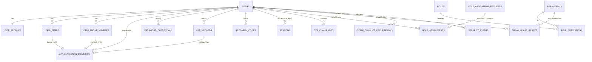
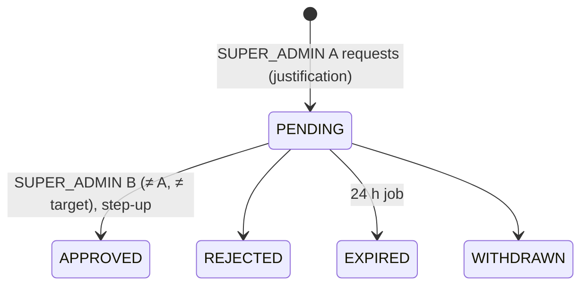

# Identity Schema (users + auth)

**Stage 2 — design only.** Draft SQL: [`design/sql/0004_users_auth.sql`](../../design/sql/0004_users_auth.sql);
tests: [`design/sql/tests/identity_test.sql`](../../design/sql/tests/identity_test.sql). Executable migrations:
Stage 3 (users subset) and Stage 4 (auth), see [migration-plan.md](migration-plan.md).

Normative inputs: [SECURITY.md §4–§6](../SECURITY.md), [ADR-027](../adr/ADR-027-authentication-session-strategy.md),
[operational-controls.md](../compliance/operational-controls.md), [PRODUCT.md §4](../PRODUCT.md),
[DATA-CLASSIFICATION.md](../DATA-CLASSIFICATION.md), [design-baseline.md §5.3, §5.4, §12](../stage-2/design-baseline.md).
Principles: [design-principles.md](design-principles.md).

Owners: `users` module owns `users`, `user_profiles`, `user_emails`, `user_phone_numbers`. `auth` owns every
other table here. `auth` imports `users` (and `notifications` for synchronous OTP delivery); nothing in `users`
reads `auth` tables.

---

## 1. ERD



## 2. users module

### 2.1 `app.users`

| Column group | Columns | Class |
|---|---|---|
| Identity | `id`, `account_kind` (`USER` \| `STAFF`, immutable), `market_code` | C1 |
| Lifecycle | `status`, `suspended_at`, `deletion_requested_at`, `closed_at`, `anonymised_at`, `version` | C1 |
| Staff link | `staff_personal_user_id` (STAFF only; the same person's personal account, unique) | C2 |
| KYC mirror | `kyc_level`, `kyc_status`, `kyc_mirror_updated_at` — written only by the `kyc` service | C2 |

- **Account status machine** `user_account`: `'' → ACTIVE`, `ACTIVE ↔ SUSPENDED`, `ACTIVE → PENDING_DELETION`,
  `PENDING_DELETION → ACTIVE` (grace-period cancel), `PENDING_DELETION → CLOSED`, `SUSPENDED → CLOSED`.
  `CLOSED` is terminal; anonymisation (`anonymised_at`) is allowed only when `CLOSED`.
- `UNIQUE (id, account_kind)` is the target of kind-restricted composite FKs: sessions, role assignments,
  break-glass grants, conflict declarations (STAFF) and org members, campaign owners (USER).
- `DELETE`/`TRUNCATE` are blocked: accounts are anonymised, never deleted (PRIVACY §8).
- **KYC mirror.** Display and coarse gating only (ADR-015). Decisions that need the live value (submission,
  payout eligibility) call `kyc`. Staff accounts keep the defaults (`UNVERIFIED`/`ACTIVE`); they are never
  KYC subjects through this account.
- **Staff vs personal.** A staff member who also uses FundZim personally has two accounts. The link lets the
  object-level SoD check refuse staff actions on records connected to the personal account
  (operational-controls §1–§2).

### 2.2 `app.user_profiles`

`display_name` (C2; C0 only where published), `preferred_locale` (`en-ZW`), `time_zone` (`Africa/Harare`),
`country_code`, `avatar_object_id` (+ constant `avatar_bucket_class = 'PUBLIC_MEDIA'`, composite FK to
`stored_objects`, added in 0005). `display_name` becomes NULL on anonymisation.

### 2.3 `app.user_emails`, `app.user_phone_numbers`

| Rule | Constraint |
|---|---|
| One verified owner per address/number | `uq_user_emails_verified_email (email_normalized) WHERE verified_at IS NOT NULL AND deleted_at IS NULL`; `uq_user_phone_numbers_verified_e164 (e164) WHERE …` |
| Unverified duplicates allowed | So nobody can squat an address or number without proving control |
| One primary per user; primary must be verified | `uq_*_primary`, `ck_*_primary_verified` |
| Normalised form | `email_normalized = lower(…)` + shape check; `e164 ~ '^\+[1-9][0-9]{6,14}$'` |
| Anonymisation | value NULL only with `deleted_at` set |

**Phone recycling** (THREAT-MODEL T-05): when a new account verifies a number that another account holds
verified, the unique index rejects it. The auth service then runs the recycle flow: confirm control of the
number, soft-delete the old record (`deleted_at`), revoke the old account's sessions, place a payout hold on the
old account through `risk`, and notify the old account's other channel. Only then is the new row verified.

Classification: C2 (masked in logs as `+26377****123`). Retention: account lifetime, then anonymised.

## 3. auth module

### 3.1 Authentication factors

| Account kind | First factor | Second factor | Source |
|---|---|---|---|
| USER | OTP to a verified phone (SMS) or email; optional password | Optional | SECURITY §4.1 |
| STAFF | **Password (Argon2id)** | **Mandatory WebAuthn, TOTP fallback.** No SMS or email OTP for staff | SECURITY §4.2, baseline I-6 |

DB enforcement of I-6:

```sql
-- authentication_identities: staff may only have PASSWORD or WEBAUTHN identities
CONSTRAINT ck_authentication_identities_staff_no_otp CHECK (user_account_kind = 'USER' OR identity_type IN ('PASSWORD', 'WEBAUTHN'))
-- sessions: a staff session exists only after MFA, and never from an OTP first factor
CONSTRAINT ck_sessions_staff_mfa           CHECK (kind <> 'STAFF' OR mfa_verified_at IS NOT NULL)
CONSTRAINT ck_sessions_staff_first_factor  CHECK (kind <> 'STAFF' OR auth_method IN ('PASSWORD', 'WEBAUTHN'))
```

### 3.2 `app.authentication_identities`

One row per primary factor: `PHONE_OTP` → `user_phone_number_id`; `EMAIL_OTP` → `user_email_id`;
`PASSWORD` → none (hash in `password_credentials`); `WEBAUTHN` → `mfa_method_id` (passkey). Exactly the right
reference per type (`ck_authentication_identities_refs`). At most one active identity per phone/email and one
PASSWORD identity per user. Only `disabled_at` may change.

### 3.3 `app.password_credentials`

Argon2id PHC string, enforced by
`CHECK (password_hash ~ '^\$argon2id\$v=[0-9]+\$m=[0-9]+,t=[0-9]+,p=[0-9]+\$…')`. Parameters (memory ≥ 64 MiB,
t ≥ 3, p 1–4) are tuned in Stage 4 and recorded in the PHC string, so rehash-on-login is possible. History is
kept (`superseded_at`) for reuse checks; one current row per user (`uq_password_credentials_current`); the
hash never changes (only `must_change`, `compromised_at`, `superseded_at`). Class C3 (DATA-CLASSIFICATION §1).

### 3.4 `app.otp_challenges`

| Column | Meaning |
|---|---|
| `purpose` | `LOGIN`, `VERIFY_PHONE`, `VERIFY_EMAIL`, `PAYOUT_DESTINATION_CHANGE`, `STEP_UP`, `ACCOUNT_RECOVERY`, `CONTACT_CHANGE`, `BENEFICIARY_CONSENT` (SECURITY §4.1 lower-case names in upper snake) |
| `channel` | `SMS`, `EMAIL`, `WHATSAPP` (WhatsApp only if a provider is selected later) |
| `destination_hmac` | HMAC blind index of the normalised destination: binding, rate limits, resend invalidation; no contact data stored here |
| `code_hmac`, `hmac_key_id` | HMAC-SHA-256(server key, code ‖ challenge id). The code itself is never stored |
| `flow_id` | Binds the code to the browser flow that requested it |
| `attempts` | `CHECK (attempts BETWEEN 0 AND 5)`; monotonic (trigger) |
| `expires_at` | `CHECK (expires_at <= created_at + interval '5 minutes')` |
| `consumed_at`, `invalidated_at` | Single use; a consumed or invalidated challenge is frozen |

- `uq_otp_challenges_live (destination_hmac, purpose) WHERE consumed_at IS NULL AND invalidated_at IS NULL`:
  a resend must invalidate the previous challenge in the same transaction.
- Purposes other than `LOGIN`, `VERIFY_*`, `BENEFICIARY_CONSENT` require `user_id` (`ck_otp_challenges_user_bound`).
- **Delivery.** `auth` calls the `notifications` service synchronously and passes the code in memory only. The
  `notification_jobs` row records the send without the code (`ck_notification_jobs_no_secret_variables`). The
  only persisted form is `code_hmac`.
- **Verification flow** (one transaction): `SELECT … FOR UPDATE` the live challenge by `(destination_hmac,
  purpose)`; if expired → invalidate; compare HMAC in constant time; on mismatch `attempts + 1` (at 5 →
  `invalidated_at`, `security_events OTP_MAX_ATTEMPTS`); on match set `consumed_at` and create/rotate the session.
- Retention: OPERATIONAL (purged shortly after expiry; `ix_otp_challenges_expires_at`).

### 3.5 `app.sessions`

- Opaque token ≥ 256 bits; only `token_hash = SHA-256(token)` is stored (`UNIQUE`, `octet_length = 32`).
- `(user_id, kind)` → `users (id, account_kind)`: a USER session can never be created for a STAFF account
  and vice versa.
- `idle_expires_at` (sliding, updated with `last_seen_at`) ≤ `absolute_expires_at` (immutable). Timeouts are
  configuration (users 7 d / 30 d; staff 15 min / 12 h as starting points).
- `step_up_at`: last fresh factor; sensitive actions require it within `STEP_UP_MAX_AGE`.
- Revocation: `revoked_at` + `revoked_reason` (`LOGOUT`, `ROTATED`, `USER_REVOKED`, `STAFF_REVOKED`,
  `PRIMARY_FACTOR_CHANGED`, `ATO_SIGNAL`, `PRIVILEGE_CHANGE`, `ACCOUNT_SUSPENDED`, `ACCOUNT_CLOSED`); a revoked
  session is never revived. Logout revokes server-side (the cookie is not trusted); a purge job deletes
  expired/revoked rows after the user-visible session-list window.
- Rotation on login, privilege change and contact change: new row with `rotated_from_id`, old row revoked
  `ROTATED`, in one transaction.
- Classification: C2 (IP, user agent ≤ 512 chars, device label).

### 3.6 `app.mfa_methods`, `app.recovery_codes`

- WebAuthn: `webauthn_credential_id` (unique), COSE public key (C2), `webauthn_sign_count` (clone detection),
  AAGUID, transports. Identity columns immutable.
- TOTP: `totp_secret_ciphertext` + `totp_secret_key_id` (key class `mfa-secret`); `totp_last_used_step` stops
  replay within a step.
- Recovery codes: keyed SHA-256 only (`code_hash`, 32 bytes), batch-superseded on regeneration, single use.

### 3.7 RBAC: `roles`, `permissions`, `role_permissions`

Reference data, changed only by reviewed migrations (`role_permissions` UPDATE blocked; roles/permissions not
deletable). Seeded staff roles (9):

| Role | Conflicting roles (cannot be held together, `conflicting_role_codes`) |
|---|---|
| `REVIEWER` | SECURITY_ADMIN |
| `KYC_REVIEWER` | SECURITY_ADMIN, SUPER_ADMIN |
| `SUPPORT` | SECURITY_ADMIN |
| `COMPLIANCE` | SECURITY_ADMIN, SUPER_ADMIN, BUSINESS_APPROVER |
| `FINANCE` | SECURITY_ADMIN, SUPER_ADMIN, BUSINESS_APPROVER |
| `ADMIN` | — |
| `SECURITY_ADMIN` | REVIEWER, KYC_REVIEWER, SUPPORT, COMPLIANCE, FINANCE, BUSINESS_APPROVER |
| `SUPER_ADMIN` | KYC_REVIEWER, COMPLIANCE, FINANCE |
| `BUSINESS_APPROVER` (baseline I-4) | FINANCE, COMPLIANCE, SECURITY_ADMIN |

The conflicts encode the role-level ("R") cells of operational-controls §2: security admin vs every
operational and financial function; role-grant approver vs payout/ledger approver and KYC decider; business
approver vs the makers whose requests it approves. Conflicts are checked symmetrically on grant
(`role_assignments_check_grant`).

A representative permission set is seeded (55 permissions; full matrix Stage 4/14), including the
sensitive permissions with `is_sensitive` (justification + audit) and `requires_step_up`. Seeded guarantees,
tested in `roles_and_least_privilege_seeded`:

- ADMIN and SUPER_ADMIN hold none of `kyc.document.view`, `kyc.identity_number.reveal`,
  `ledger.adjustment.create`, `payout.approve` (SECURITY §5.2), and not `kyc.status.view` (baseline I-5).
- SECURITY_ADMIN holds no `kyc.*`, `payout.*`, `ledger.*` or `refund.*` permission.
- BUSINESS_APPROVER holds only `*.approve` permissions (`fee.config.approve`, `recovery.write_off.approve`,
  `refund.bulk.approve`, `campaign.review_policy.approve`, `limit.change.approve`).
- `payout.approve` is held by FINANCE only (baseline I-20); COMPLIANCE never approves payouts.
- Bulk refunds (I-24): COMPLIANCE `refund.bulk.request` (maker), FINANCE `refund.approve` (checker), plus
  BUSINESS_APPROVER `refund.bulk.approve` above the configured batch limit.
- The security audit chain needs its own `security_audit.read` (I-23), held by SECURITY_ADMIN and SUPER_ADMIN.

### 3.8 Role grants: `role_assignment_requests` → `role_assignments`



| Rule | Enforcement |
|---|---|
| Target is a STAFF account | composite FK `(target_user_id, 'STAFF')` |
| No self-request | `CHECK (requested_by <> target_user_id)` |
| No self-approval; target cannot approve | `CHECK (decided_by <> requested_by AND decided_by <> target_user_id)` |
| Approval needs step-up and must be before expiry | `ck_role_assignment_requests_approved` |
| One pending request per (target, role, action) | `uq_role_assignment_requests_pending` |
| Assignment only from an APPROVED GRANT request, with the same maker/checker | trigger + composite FK `(request_id, user_id, role_id, granted_by, approved_by)` |
| No SoD-conflicting role combination | trigger on `roles.conflicting_role_codes` |
| One active assignment per (user, role) | `uq_role_assignments_active` |
| Assignment immutable except revocation | `allow_only_column_changes('revoked_at', 'revoked_by', 'revoke_request_id', 'revoke_reason')` |

Permission *use* checks (does the approver hold `role.assign.approve`?) are in the service layer. **Bootstrap:**
the first two SUPER_ADMIN assignments are created by a reviewed, one-off migration ceremony run by
`fundzim_migrator` with two named people, recorded in the security audit chain; the DB rules above still apply
(different maker and checker).

Every grant/revoke also writes `audit.security_audit_events` (`role.grant.requested/approved`, `role.revoked`).

### 3.9 `app.break_glass_grants` (baseline §5.4)

One named permission for one staff account, for a bounded window (SECURITY §5.5, operational-controls §5):

| Column | Rule |
|---|---|
| `staff_user_id` (+ `staff_account_kind = 'STAFF'`) | STAFF only (composite FK) |
| `permission_id` | Never `role.*` or `ledger.adjustment.*` (trigger); bulk KYC access is not a permission at all |
| `justification`, `incident_ref` | Required (length checks) |
| `requested_by`, `approved_by` | `CHECK (approved_by <> requested_by AND approved_by <> staff_user_id)`; the grantee may be the requester (on-call self-invocation) |
| `starts_at`, `expires_at` | `CHECK (expires_at > starts_at AND expires_at - starts_at <= interval '1 hour')` — the default bound from SECURITY §5.5. A different bound is a reviewed migration, not a runtime setting |
| `revoked_at`, `revoked_by`, `revoke_reason` | Set once (`app.set_once_columns`); nothing else changes |

Authorisation checks `role permissions ∪ active break-glass grants (now() between starts_at and expires_at,
revoked_at IS NULL)`. Every action taken under a grant is an audit event with `break_glass = true` (which the
audit table requires to carry a justification). Use alerts the security owner and a second senior staff
member; post-review within 2 business days.

### 3.10 `app.staff_conflict_declarations` (baseline §5.4)

`staff_user_id` (STAFF), `subject_type` (`user`, `organisation`, `campaign`, `beneficiary`,
`institution_payee`, `payout_destination`), `subject_id`, `relationship` (`FAMILY`, `FRIEND`, `BUSINESS`,
`EMPLOYER`, `DONOR`, `BENEFICIARY`, `OTHER`), `details`, `declared_at`, `withdrawn_at` + `withdrawn_reason`
(set once). One active declaration per (staff, subject). The object-level SoD check (claiming a review,
deciding KYC, approving a payout) refuses an action when an active declaration matches the object or its
owner, or when `users.staff_personal_user_id` matches. Reviewer conflict attestation on claim is recorded on
`campaign_reviews.coi_attested_at`.

### 3.11 `app.security_events`

Authentication telemetry (`LOGIN_*`, `OTP_*`, `SESSION_*`, `STEP_UP_*`, `MFA_*`, `RECOVERY_CODE_USED`,
`PASSWORD_*`, `RATE_LIMITED`, `SUSPICIOUS_LOGIN`, `CONTACT_CHANGED`). Append-only, high volume, shorter
retention by monthly partition drop (period LR-012). It feeds rate limiting and ATO signals; it is **not** the
audit log — decisions go to `audit.security_audit_events`.

## 4. Data classification summary

| Table | C0 | C1 | C2 | C3 / C4 handling |
|---|---|---|---|---|
| users | — | ids, status | KYC mirror, staff link | — |
| user_profiles | display name if published | locale, tz | display name | — |
| user_emails / user_phone_numbers | — | flags | email, phone | — |
| password_credentials | — | — | — | hash (C3) |
| otp_challenges | — | purpose, times | IP | HMACs (C3-handled), code never stored (C4) |
| sessions | — | times | IP, UA, device | token hash (C3-handled) |
| mfa_methods | — | type, label | WebAuthn public key | TOTP seed ciphertext (C4 encrypted) |
| recovery_codes | — | — | — | hashes |
| roles / permissions / role_* | — | all | — | — |
| break_glass_grants, staff_conflict_declarations | — | ids, times | justification, relationship | — |
| security_events | — | type | IP, UA, details | destination HMAC |

## 5. Failure handling

| Failure | Behaviour |
|---|---|
| Two devices verify the same OTP concurrently | Row lock on the challenge; the second sees `consumed_at` and fails |
| Resend without invalidating the previous code | `uq_otp_challenges_live` violation → service bug, 500, alert |
| Same phone verified by two accounts | Unique violation → recycle flow (§2.3) |
| Role approval races (two checkers) | `status` guard: second update sees `APPROVED → APPROVED` (no-op) and the insert of a second assignment fails on `uq_role_assignments_request_id` |
| Session token collision | Practically impossible; `uq_sessions_token_hash` makes it a retryable error |
| Expired break-glass grant still cached | Authorisation re-reads grants per request (no cache for break-glass) |

## 6. Test requirements

In-memory (Stage 2, `identity_test.sql`, 84 cases): duplicate verified phone/email, unverified duplicates
allowed, E.164 shape, Argon2id-only hashes, OTP TTL/attempts/replay/purpose/one-live rules, raw token rejected,
staff session needs MFA and a non-OTP first factor, staff cannot have OTP identities, kind-mismatched session,
revoked session frozen, role self-request/self-approval, assignment only from an approved matching request,
SoD conflicts (SECURITY_ADMIN + FINANCE, BUSINESS_APPROVER + FINANCE), least-privilege seed, break-glass window,
maker-checker, forbidden permission and set-once revocation, conflict declarations, organisation rules
([organisation-beneficiary-schema.md](organisation-beneficiary-schema.md)).

Stage 4 (real PostgreSQL): concurrent OTP verification, concurrent role approvals, session rotation under
load, rate limits, grants as `fundzim_app` (no DELETE on `users`, no UPDATE on `security_events`), the full
role × permission matrix test, and Go/SQL state-machine parity for `user_account` and
`role_assignment_request`.
