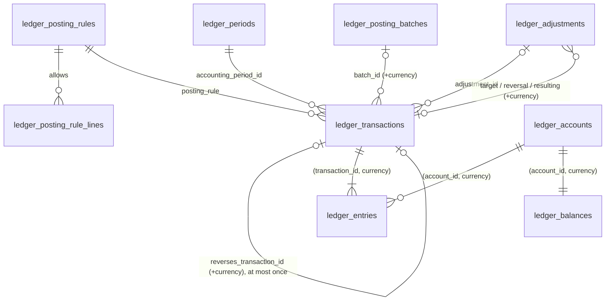
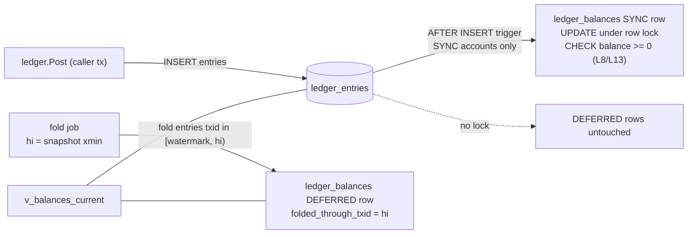

# Ledger Schema (`ledger`)

**Stage 2 — design only.** The SQL is a non-executable draft: [`design/sql/0006_ledger.sql`](../../design/sql/0006_ledger.sql),
validated in an in-memory PGlite by [`design/sql/tests/ledger_test.sql`](../../design/sql/tests/ledger_test.sql).
Executable migrations are written in Stage 10 under `/migrations` (goose, ADR-028). Nothing here posts money.

Normative inputs: [LEDGER.md](../LEDGER.md) (L1–L10), [settlement-and-custody-model.md](../ledger/settlement-and-custody-model.md)
(chart of accounts, SC-1 – SC-6; supersedes LEDGER §3.2), [ADR-006](../adr/ADR-006-double-entry-ledger.md),
[ADR-014](../adr/ADR-014-accounting-separated-from-custody.md), [ADR-018](../adr/ADR-018-currency-isolation-and-fx.md),
[ADR-023](../adr/ADR-023-ledger-posting-architecture.md), [design-baseline.md §5.6](../stage-2/design-baseline.md).
Related: [ledger-posting-model.md](../architecture/ledger-posting-model.md) (rules, API, examples),
[ledger-invariants.md](../architecture/ledger-invariants.md) (every invariant and its enforcement),
[reconciliation-schema.md](reconciliation-schema.md).

> **Custody caveat (LR-001, LR-002, LR-003).** The ledger is FundZim's *record* of claims and obligations for
> money that a licensed PSP collects, holds and disburses (Model A). It is not a statement of FundZim-owned
> cash and creates no spendable balance.

---

## 1. Overview

| Table | Purpose | Mutability |
|---|---|---|
| `ledger_accounts` | One row per account code per currency | Immutable (append-only) |
| `ledger_transactions` | Journal header: one balanced, single-currency journal per business event | Append-only |
| `ledger_entries` | Debit/credit lines | Append-only |
| `ledger_balances` | Projection, one row per account | Updated only by the posting trigger (SYNC), the fold job (DEFERRED) or the break-glass rebuild |
| `ledger_posting_rules` | Registry of named rules | Reference data (migrations only) |
| `ledger_posting_rule_lines` | Allowed (direction, account class) per rule | Reference data (migrations only) |
| `ledger_posting_batches` | Optional grouping (e.g. one provider settlement batch) | Append-only |
| `ledger_adjustments` | Maker-checker requests for manual adjustments, reversals and corrections | Status machine; request fields immutable |
| `ledger_periods` | Accounting periods `OPEN` → `CLOSING` → `CLOSED` | Status machine; boundaries immutable |
| `ledger_invariant_runs` | One row per finished verification run | Append-only |

Views (not tables): `v_trial_balance` (L9), `v_balances_current` (exact balance incl. unfolded DEFERRED tail),
`v_balance_drift` (L10), `v_pool_integrity` (SC-2, aggregate form).

The only foreign key leaving the schema is to `app.currencies(code)`. Accounts carry `(owner_type, owner_id)`
and journals `(source_type, source_id)` **without** foreign keys: the ledger is domain-agnostic (baseline §10)
and is written only by the `ledger` module.

## 2. Chart of accounts in the schema

`account_class` is the code without its owner suffix. The closed list is the IMMUTABLE function
`ledger.account_class_signature(class)`, which returns `TYPE|NORMAL_BALANCE|KIND|OWNER_TYPE`;
`ck_ledger_accounts_class_spec` requires every account to match it, so an account cannot be mistyped and no
class outside the chart (for example a "wallet") can exist. Adding a class is a migration plus an ADR-014
amendment.

| Class | Type | Normal | Kind (custody model §3.1) | Owner | `non_negative` | `projection_mode` |
|---|---|---|---|---|---|---|
| `asset:psp_clearing` | ASSET | DEBIT | CLAIM_ON_PROVIDER | PROVIDER | no | DEFERRED |
| `asset:psp_settled` | ASSET | DEBIT | PROVIDER_POOL | PROVIDER | no | DEFERRED |
| `asset:fundzim_operating_bank` | ASSET | DEBIT | FUNDZIM_CASH | PLATFORM | no | DEFERRED |
| `asset:chargeback_recoverable` | ASSET | DEBIT | RECOVERABLE | PLATFORM | yes | SYNC |
| `asset:refund_recoverable` | ASSET | DEBIT | RECOVERABLE | CAMPAIGN | yes | SYNC |
| `asset:psp_payout_float` | ASSET | DEBIT | PROVIDER_POOL | PROVIDER | no | DEFERRED — no rule may use it (Model A) |
| `liability:campaign_unsettled` | LIABILITY | CREDIT | OBLIGATION | CAMPAIGN | yes | SYNC |
| `liability:campaign_payable` | LIABILITY | CREDIT | OBLIGATION | CAMPAIGN | yes (**L8**) | SYNC |
| `liability:campaign_reserve` | LIABILITY | CREDIT | OBLIGATION | CAMPAIGN | yes | SYNC |
| `liability:campaign_payout_pending` | LIABILITY | CREDIT | OBLIGATION | CAMPAIGN | yes | SYNC |
| `liability:payout_in_transit` | LIABILITY | CREDIT | OBLIGATION | PROVIDER | yes | SYNC |
| `liability:campaign_held` | LIABILITY | CREDIT | OBLIGATION | CAMPAIGN | yes | SYNC |
| `liability:refund_payable` | LIABILITY | CREDIT | OBLIGATION | PLATFORM | yes | SYNC |
| `revenue:platform_fees` | REVENUE | CREDIT | RESULT | PLATFORM | no | DEFERRED |
| `expense:psp_processing_fees` / `chargeback_losses` / `refund_losses` | EXPENSE | DEBIT | RESULT | PLATFORM | no | DEFERRED |
| `equity:platform` | EQUITY | CREDIT | RESULT | PLATFORM | no | DEFERRED |
| `suspense:settlement_discrepancy` | SUSPENSE | DEBIT | SUSPENSE | PROVIDER | no (either sign) | DEFERRED |

`code = account_class` for platform accounts and `account_class || ':' || owner_id` otherwise
(`ck_ledger_accounts_code`), e.g. `liability:campaign_payable:0192…`. `owner_id` is the campaign id or the
`psp` provider id (uuid, no FK). `equity:platform` is classified RESULT (FundZim's own position) because the
settlement model's kind list has no separate equity kind.

## 3. Tables

Conventions: UUIDv7 ids generated in Go; money is `amount_minor bigint` + `currency char(3)`; time is
`timestamptz` UTC; constraint names follow DATABASE §10.

### 3.1 `ledger_accounts`

| Column | Type | Notes |
|---|---|---|
| `id` | uuid PK | |
| `code` | text | Deterministic from class + owner |
| `account_class` | text | Must be in the chart (§2) |
| `type`, `normal_balance`, `kind` | text | Must equal the class signature; `ck_ledger_accounts_normal_balance` also ties normal balance to type (ASSET/EXPENSE/SUSPENSE → DEBIT; LIABILITY/EQUITY/REVENUE → CREDIT) |
| `currency` | char(3) FK `app.currencies` | **Immutable** (row is append-only) |
| `owner_type`, `owner_id` | text, uuid | `PLATFORM` ⇔ `owner_id IS NULL` |
| `non_negative` | boolean GENERATED | `kind IN (OBLIGATION, RECOVERABLE)` |
| `projection_mode` | text GENERATED | `SYNC` for non-negative kinds, else `DEFERRED`; `ck_ledger_accounts_guarded_is_sync` |
| `created_at` | timestamptz | |

Keys: `uq_ledger_accounts_code_currency (code, currency)` (lazy idempotent creation via
`INSERT … ON CONFLICT ON CONSTRAINT uq_ledger_accounts_code_currency DO NOTHING`), `uq_ledger_accounts_id_currency (id, currency)`
(target of the L4 composite FK). Index `ix_ledger_accounts_owner (owner_type, owner_id)`.
Trigger `trg_ledger_accounts_create_balance` creates the projection row in the same transaction.

### 3.2 `ledger_transactions` (journal header)

| Column | Type | Notes |
|---|---|---|
| `id` | uuid PK | |
| `posting_rule` | text FK `ledger_posting_rules(code)` | NOT NULL |
| `idempotency_key` | text | `uq_ledger_transactions_idempotency_key`; format `^[a-z_]+:[A-Za-z0-9:_.-]{1,250}$` (e.g. `payment:{id}:capture`) |
| `currency` | char(3) FK | Single-currency journal (SC-6). `uq_ledger_transactions_id_currency` is the target of the entries' composite FK |
| `description` | text | No personal data |
| `source_type`, `source_id` | text, uuid | Must be in the rule's `allowed_source_types`; no FK |
| `provider_code`, `provider_reference` | text | Informational |
| `fee_schedule_version_id` | uuid | Fee version applied (no FK) |
| `occurred_at` | timestamptz | Business time; may not be > `posted_at` + 15 min |
| `posted_at` | timestamptz | **Forced to `now()`** by trigger (cannot be back- or forward-dated) |
| `accounting_period_id` | uuid FK `ledger_periods` | Set by trigger (§5) |
| `is_prior_period` | boolean | Set by trigger |
| `reverses_transaction_id` | uuid | Composite FK `(reverses_transaction_id, currency)`; partial unique `uq_ledger_transactions_reverses` (L7); `ck_ledger_transactions_reversal_rule`: set ⇔ rule `REVERSAL` |
| `adjustment_id` | uuid FK `ledger_adjustments` | Required for `requires_approval` rules; partial uniques allow at most one reversal journal and one non-reversal journal per adjustment |
| `batch_id` | uuid | Composite FK `(batch_id, currency)` → `ledger_posting_batches` |
| `created_by_type`, `created_by_id` | text | `SYSTEM` (component name) or `STAFF` (user id) |
| `reason` | text | ≥ 10 chars when reversing or adjustment-backed |
| `request_id`, `correlation_id` | text | Tracing |
| `created_txid` | xid8 | **Forced** to `pg_current_xact_id()`; seals the journal (L11) |

Indexes: `(source_type, source_id)`, `(posting_rule, occurred_at)`, `(accounting_period_id)`, `(posted_at)`,
`(batch_id)` partial.

### 3.3 `ledger_entries`

| Column | Type | Notes |
|---|---|---|
| `id` | uuid PK | |
| `transaction_id` | uuid | Composite FK `fk_ledger_entries_transaction_currency (transaction_id, currency)` → entry currency = journal currency |
| `line_no` | smallint | `uq_ledger_entries_line (transaction_id, line_no)`; serves journal lookups |
| `account_id` | uuid | Composite FK `fk_ledger_entries_account_currency (account_id, currency)` → **L4** |
| `direction` | text | `DEBIT` / `CREDIT` |
| `amount_minor` | bigint | `ck_ledger_entries_amount_positive (> 0)` → **L3** |
| `currency` | char(3) | |
| `created_txid` | xid8 | Forced; must equal the header's (L11). Drives the DEFERRED fold |

Index `ix_ledger_entries_account_txid (account_id, created_txid)`: account statements, recompute and the fold.
It replaces LEDGER §3.3's `(account_id, transaction_id)`.

### 3.4 `ledger_balances` (projection)

| Column | Notes |
|---|---|
| `account_id` PK | 1:1 with the account; composite FK `(account_id, currency)` |
| `currency`, `normal_balance`, `non_negative`, `projection_mode` | Copied from the account; immutable |
| `debit_total_minor`, `credit_total_minor`, `entry_count` | Running totals |
| `balance_minor` | **Normal-balance terms**: DEBIT-normal = Dr − Cr; CREDIT-normal = Cr − Dr (`ck_ledger_balances_consistent`) |
| `folded_through_txid` | DEFERRED only: entries with `created_txid` below this are included |
| `last_entry_id`, `last_transaction_id`, `version`, `updated_at` | |

`ck_ledger_balances_non_negative CHECK (NOT non_negative OR balance_minor >= 0)` is the database backstop for
**L8** (`campaign_payable`) and **L13** (every OBLIGATION/RECOVERABLE account). Direct `UPDATE` is rejected by
`trg_ledger_balances_guard_update`; `DELETE`/`TRUNCATE` by `app.forbid_mutation()`.

#### Projection modes (SYNC / DEFERRED)

| Mode | Accounts | Maintained by | Read path |
|---|---|---|---|
| `SYNC` | Every account whose non-negativity guards a decision (campaign obligations, payout in transit, refund payable, recoverables) | AFTER INSERT trigger on `ledger_entries`, in the posting transaction, under the projection row lock | `ledger_balances` directly (exact) |
| `DEFERRED` | Platform-wide hot rows: `revenue:platform_fees`, `asset:psp_clearing:{p}`, `asset:psp_settled:{p}`, suspense, operating bank, expenses, equity | `ledger.fold_deferred_balances()` job every few seconds (one runner) | `ledger.v_balances_current` (projection + unfolded tail) |

Every donation touches `revenue:platform_fees` and `psp_clearing:{p}`: updating their rows synchronously would
serialise all donations platform-wide on two row locks. DEFERRED rows take no lock in the posting path.
**L8/L13 depend only on SYNC rows** (`ck_ledger_accounts_guarded_is_sync`, `ck_ledger_balances_mode`).

The fold is exact without a queue table: it reads `hi = pg_snapshot_xmin(pg_current_snapshot())`, folds every
entry with `folded_through_txid ≤ created_txid < hi` and sets the watermark to `hi`. Every transaction below the
snapshot xmin has already committed or aborted, so no entry can later appear below the watermark — nothing is
lost or counted twice, and the fold is idempotent. The watermark starts at the account's creating transaction.

### 3.5 `ledger_posting_rules` and `ledger_posting_rule_lines`

Rules: `code` (unique, `UPPER_SNAKE`), `description`, `idempotency_key_format` (documentation),
`allowed_source_types text[]`, `line_check` (`RULE_LINES` | `MIRROR_OF_REVERSED`, the latter only for
`REVERSAL`), `requires_approval`, `allows_prior_period`, `single_owner_per_type`, `doc_ref`.

Rule lines: `(rule_code, direction, account_class, is_required)`, unique per triple. Table-level guards:
`ck_ledger_posting_rule_lines_sc1` (a `PAYOUT_RESERVED` debit line can only be `campaign_payable`),
`ck_ledger_posting_rule_lines_sc5` (only the allow-listed rules may name `asset:fundzim_operating_bank`),
`ck_ledger_posting_rule_lines_no_float` (no rule may use the Model-A-unused float). Even a migration that widens
a rule therefore has to edit a visibly named constraint. The full registry is in
[ledger-posting-model.md §4](../architecture/ledger-posting-model.md).

### 3.6 `ledger_posting_batches`

`batch_kind` (`SETTLEMENT`, `FEE_REMITTANCE`, `BULK_REFUND`, `OTHER`), `currency`, `idempotency_key` (unique, e.g.
`settlement_batch:{id}`), `source_type`/`source_id`, `description`, creator. Append-only. Journals reference it
with `(batch_id, currency)`, so a batch is single-currency.

### 3.7 `ledger_adjustments` (maker-checker)

| Column | Notes |
|---|---|
| `kind` | `REVERSAL` (mirror one journal), `CORRECTION` (reversal + replacement under `posting_rule`), `MANUAL` (one journal under `posting_rule`, e.g. `ADJUSTMENT`, `WRITE_OFF`, `DISPUTE_FUNDING`) |
| `posting_rule`, `currency`, `target_transaction_id` | `REVERSAL` ⇔ rule `REVERSAL`; target required for REVERSAL/CORRECTION (composite FK with currency) |
| `proposed_lines` jsonb | `[{"account_code","direction","amount_minor":"<digits>"}]`; `[]` for REVERSAL, ≥ 2 lines otherwise |
| `proposed_lines_sha256` | `CHECK = sha256(proposed_lines::text)` |
| `reason_code`, `reason`, `linked_subject_type/id`, `evidence_record_ids` | Reason code, linked mismatch/case, `ADJUSTMENT_SUPPORT` evidence (operational-controls §3) |
| `status` | `PENDING_APPROVAL` → `APPROVED` → `POSTED`; or `REJECTED` / `WITHDRAWN` / `EXPIRED` (guarded by `app.guard_transition('ledger_adjustment')`) |
| `requested_by`, `requested_at`, `expires_at` | Maker; default expiry 24 h (operational-controls §3) |
| `approved_by`, `approved_at`, `approved_lines_sha256`, `approval_justification` | `ck_ledger_adjustments_maker_checker (approved_by <> requested_by)`; approval must carry the **same hash** the maker proposed and happen before expiry |
| `rejected_by`, `rejected_at`, `rejection_reason` | Rejecter ≠ maker |
| `reversal_transaction_id`, `resulting_transaction_id`, `posted_at` | Required at `POSTED` per kind |

The request (everything the checker saw) is immutable after creation (`trg_ledger_adjustments_guard_update`);
final statuses are frozen. At COMMIT the journal's lines must equal `proposed_lines` exactly (L14).

### 3.8 `ledger_periods`

`code`, `starts_at`, `ends_at` (exclusive), `status` (`OPEN` → `CLOSING` → `CLOSED`; `CLOSING` → `OPEN` aborts a
close; `CLOSED` is terminal), `close_requested_by/at` (maker), `closed_by/at` (checker,
`ck_ledger_periods_maker_checker`), `close_evidence_record_id` (trial balance + invariant run snapshot).
`ex_ledger_periods_no_overlap` (GiST exclusion on `tstzrange`). Boundaries are immutable.

### 3.9 `ledger_invariant_runs`

One append-only row per finished run: `invariant_code` (`L9`, `L10`, `SC-2`, …), `scope` jsonb, `currency`,
`status` (`PASSED` / `FAILED` / `ERROR`), `started_at`, `finished_at`, `snapshot_posted_through`, `checked_count`,
`violation_count`, `violations_sample` (ids and amounts only), `evidence_record_id` (required when `FAILED`),
`triggered_by_*`, `job_id`, `error_message`. Written by the jobs in
[background-processing.md §6.6](../architecture/background-processing.md).

## 4. Triggers (summary)

| Trigger | When | Enforces |
|---|---|---|
| `trg_ledger_transactions_before_insert` | BEFORE INSERT header | `posted_at`/`created_txid` forced; rule exists; source type allowed; approval (adjustment APPROVED, unexpired, same currency, kind/rule/target consistent); period resolution |
| `trg_ledger_entries_before_insert` | BEFORE INSERT entry | L11 seal: header created in this DB transaction |
| `trg_ledger_entries_apply_balance` | AFTER INSERT entry | SYNC projection update (L8/L13 CHECK) |
| `trg_ledger_transactions_check` | **Deferred constraint trigger**, AFTER INSERT header, once per journal at COMMIT | L1, L2, L12 (rule lines, SC-1, SC-5), single owner per type, L7 mirror, L14 approved lines |
| `*_no_mutation`, `*_no_truncate` | BEFORE UPDATE/DELETE/TRUNCATE | L5 (`app.forbid_mutation()`) |
| `trg_ledger_balances_guard_update` | BEFORE UPDATE projection | Only the entry trigger, fold or rebuild may update |
| `*_guard_status` | Status machines | `ledger_adjustment`, `ledger_period` edges in `app.status_transitions` |

**Why the deferred check runs once per journal and is still complete.** It is attached to the header, not the
entries, so a 5 000-line settlement journal is validated once. It cannot miss entries added later, because
L11 rejects any entry whose header was created in another DB transaction. If a caller runs
`SET CONSTRAINTS ALL IMMEDIATE`, the check fires right after the header insert with zero entries and fails
(fails closed).

## 5. Periods and prior-period postings

`occurred_at` selects the period. If that period is `OPEN` or `CLOSING`, the journal belongs to it. If it is
`CLOSED`:

- rules with `allows_prior_period = true` post into the period containing `posted_at` (which must not be
  `CLOSED`) with `is_prior_period = true`. These are provider facts that FundZim must record whenever they arrive
  (late captures, settlements, refund/payout outcomes, disputes) plus approved adjustments and reversals;
- all other rules (FundZim decisions such as `RELEASE`, `PAYOUT_RESERVED`, `CAMPAIGN_FROZEN`) are rejected.
  Their `occurred_at` is the decision time, so this happens only on a bug.

The header trigger reads the period row `FOR SHARE`, so a close (`UPDATE … SET status = 'CLOSED'`) waits for
in-flight postings, and postings started after the close see `CLOSED`. Whether accountants want late provider
facts in the current period or a reopened one is an open decision (G-5, Stage 17).

## 6. Concurrency and locking

- `ledger.Post` runs inside the caller's transaction (`READ COMMITTED`).
- For postings that **decrease** a SYNC account (payout and refund reservations, freeze, dispute recovery),
  Post first locks the SYNC projection rows it will touch with `SELECT … FOR UPDATE` **in ascending
  `account_id` order**, checks sufficiency (for a clear error), then inserts the entries **sorted by
  `account_id`**. The entry trigger's `UPDATE` then re-reads the latest committed row; the CHECK is the
  backstop if any check was skipped.
- Increase-only postings (captures) touch one SYNC row per campaign (`campaign_unsettled:{c}`). That row is the
  remaining hot spot, for a viral campaign only; mitigations stay as LEDGER §9 (short transactions; possibly
  sub-account sharding of `campaign_unsettled` later — its decreasing paths would then have to lock every
  shard, see open question LQ-3 in [ledger-posting-model.md §8](../architecture/ledger-posting-model.md)).
- DEFERRED accounts are never locked in the posting path.
- Verification jobs use `REPEATABLE READ` snapshots.

## 7. Grants (written in `0018_grants.sql`; documented here)

| Role | `ledger` privileges |
|---|---|
| `fundzim_migrator` | Owner of schema, tables, functions (DDL only, migration pipeline) |
| `fundzim_app` | `USAGE`; `SELECT, INSERT` on accounts, transactions, entries, posting batches, invariant runs; `SELECT, INSERT, UPDATE` on adjustments, periods; `SELECT` on rules, rule lines; `SELECT` (+ `UPDATE` per baseline §4, inert because of the guard trigger) on `ledger_balances`; `SELECT` on views. **No** `DELETE`/`TRUNCATE` anywhere |
| `fundzim_readonly` | `SELECT` on approved reporting views only |
| break-glass | `EXECUTE` on `ledger.rebuild_balance()` (maker-checker, incident) |

`ledger.apply_entry_to_balance`, `ledger.create_balance_row`, `ledger.fold_deferred_balances` and
`ledger.rebuild_balance` are `SECURITY DEFINER` (owner `fundzim_migrator`, fixed `search_path`), so the app role
needs no write privilege on the projection. Recommendation for 0018: do not grant `EXECUTE` on
`ledger.rebuild_balance()` to `fundzim_app`, and grant `ledger.fold_deferred_balances()` only to the worker
connection. Rebuild can only move a projection towards the truth (it recomputes from entries), so this is
defence in depth, not a hole. Only the `ledger` Go module issues ledger SQL (sqlc query-ownership test, Stage 3).

## 8. Data classification

Ledger data is **C2 CONFIDENTIAL** (ADR-006). It holds ids, amounts and codes only: no names, phone numbers,
payout account numbers or KYC values (LEDGER §11). `description`, `reason` and `violations_sample` must never
contain personal data (code review + redaction allow-list).

## 9. Partitioning and growth outlook

- Volumes at pilot scale (≈ 4–8 entries per donation) fit in unpartitioned tables for years. No partitioning in
  Stage 10.
- If needed later: range-partition `ledger_entries` and `ledger_transactions` by `posted_at` (monthly), aligned
  with closed periods. Constraints to keep: the global `UNIQUE (idempotency_key)` cannot be enforced across
  partitions unless the key includes the partition column, so idempotency would move to a small unpartitioned
  `ledger_idempotency_keys(key PRIMARY KEY, transaction_id)` table written in the same transaction (ADR
  needed). Composite FKs into a partitioned `ledger_transactions` need the partition key in the referenced
  unique key.
- `v_balances_current` stays cheap while the fold job keeps up (tail read uses `ix_ledger_entries_account_txid`).
- Closed periods can be summarised into per-period opening balances to speed point-in-time queries; entries are
  never deleted (retention LR-012).

## 10. Validation

`design/sql/tests/ledger_test.sql` (59 cases) covers L1–L8, L11–L14, SC-1, SC-5, SC-6, periods, maker-checker,
projection modes and the canonical worked example (T1–T4, fee remittance, payout reserve → submit → complete)
with balance assertions, plus the refund, failed-payout, chargeback, pool-funding, write-off and correction
examples. PGlite is single-connection: true concurrency tests are Stage 10 work against real PostgreSQL.
