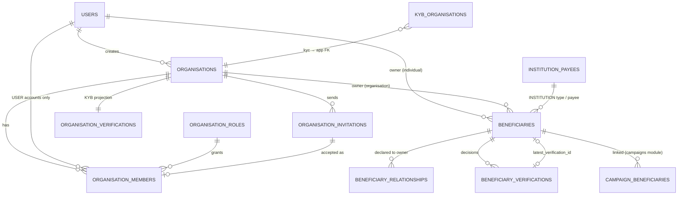
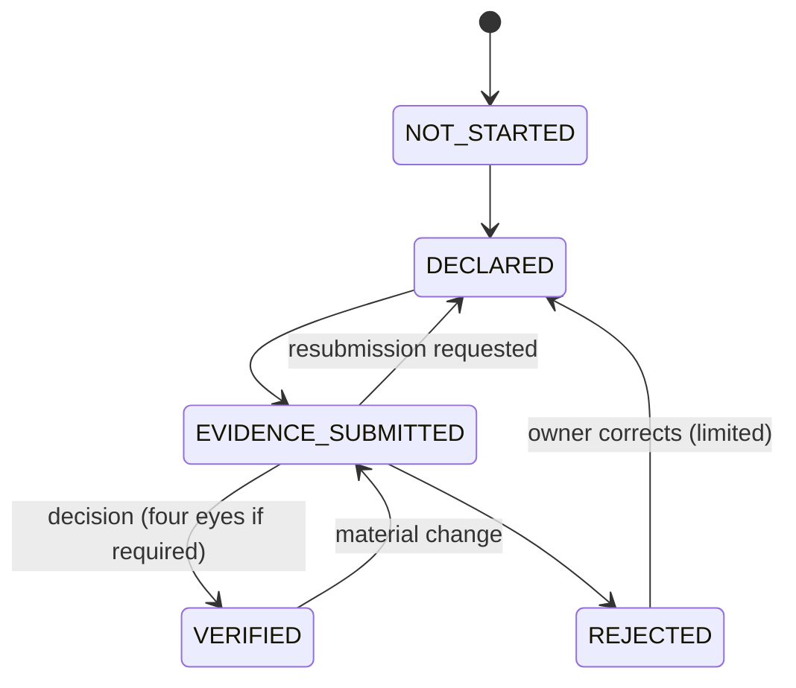

# Organisation and Beneficiary Schema

**Stage 2 — design only.** Draft SQL: [`0009_organisations.sql`](../../design/sql/0009_organisations.sql) (owner
`organisations`) and [`0012_beneficiaries.sql`](../../design/sql/0012_beneficiaries.sql) (owner `beneficiaries`),
schema `app`. Tests: `identity_test.sql` (organisations) and `campaigns_test.sql` (beneficiaries).

Normative inputs: [kyb-architecture.md](../compliance/kyb-architecture.md), [beneficiary-verification.md](../compliance/beneficiary-verification.md),
[ADR-016](../adr/ADR-016-beneficiary-verification-before-payout.md), [ADR-021](../adr/ADR-021-module-boundaries-and-ownership.md),
[PRODUCT.md §4, §7](../PRODUCT.md), [design-baseline.md §5.10, §5.13, §12 (I-1)](../stage-2/design-baseline.md).

**Boundary.** Neither module stores C3 data. The authoritative KYB record (legal name, registration,
directors, beneficial owners, representative authorities, fundraising authorities) and the beneficiary's C3
identity, consents and evidence live in `kyc` (`kyc.kyb_organisations`, `kyc.identities`, `kyc.consents`,
`kyc.beneficiary_evidence`, `kyc.fundraising_authorities`). `kyc` references `app` by FK; `app` refers to `kyc`
rows only through opaque `*_ref uuid` columns **without FKs** (`kyc_person_ref`, `consent_ref`,
`guardian_consent_ref`, `fundraising_authority_ref`).

---

## 1. ERD

## 2. organisations module

| Table | Key columns | Class | Retention |
|---|---|---|---|
| `organisations` | `display_name`, `slug` (unique), `org_type` (COMPANY, TRUST, PVO, FAITH_BASED, SCHOOL, HEALTH_INSTITUTION, COMMUNITY_BASED, SPORTS_CLUB, OTHER — kyb-architecture §1), `status` (ACTIVE, SUSPENDED, CLOSED: account status only), `logo_object_id` (public media), `created_by_user_id`, `version` | C0 once verified and published; C2 before | Account lifetime; never deleted |
| `organisation_roles` | `code`, `permissions text[]` (closed catalogue CHECK) | C1 | Reference |
| `organisation_members` | `organisation_id`, `user_id` + `user_account_kind = 'USER'`, `organisation_role_id`, `status` (ACTIVE, SUSPENDED, REMOVED), `invitation_id` | C2 | Lifetime |
| `organisation_invitations` | exactly one of `invited_email_normalized` / `invited_phone_e164`, `token_hash` (SHA-256, unique), `status`, `expires_at` | C2 | OPERATIONAL |
| `organisation_verifications` | `kyb_level` (ORG_UNVERIFIED … ORG_PAYOUT_VERIFIED), `kyb_status` (ACTIVE, PENDING_REVIEW, REJECTED, SUSPENDED), `source_event_id`, `source_occurred_at` | C1 (badge C0) | Lifetime |

### 2.1 Organisation roles (baseline I-1)

MVP seeds two roles:

| Role | Permissions |
|---|---|
| `ORG_ADMIN` | `org.view`, `org.settings.manage`, `org.member.manage`, `org.campaign.create/edit/submit`, `org.payout.request`, `org.payout_destination.manage`, `org.statement.view` |
| `ORG_MEMBER` | `org.view`, `org.campaign.create`, `org.campaign.edit` |

Financial actions (payout request, destination change) are `ORG_ADMIN` only (PRODUCT §4: members cannot change
payout accounts). A finance-only role can later be added as a data row (the permission catalogue already has
`org.payout.request` separately). Payout requests additionally need the representative's own
`PAYOUT_VERIFIED` level and a valid `kyc.representative_authorities` row (kyb-architecture §2), checked by
`payouts` through `kyc`.

### 2.2 Invariants

| Invariant | Enforcement |
|---|---|
| Staff accounts are never org members | composite FK `(user_id, 'USER')` → `users (id, account_kind)` |
| One active membership per (org, user) | `uq_organisation_members_active … WHERE status <> 'REMOVED'` |
| An ACTIVE organisation always has ≥ 1 active ORG_ADMIN | deferred constraint triggers on `organisations` and `organisation_members` |
| Removal is final (re-joining is a new row) | `organisation_members_removed_final` trigger |
| Invitation token never stored | `token_hash` 32 bytes, unique |
| KYB projection never moves backwards | `organisation_verifications_forward_only` rejects older `source_occurred_at` (out-of-order events) |

The projection is display and filtering only. Campaign submission (`KYB_COMPLETE`) and payout eligibility
(EC-03) call `kyc` for the live level and status.

## 3. beneficiaries module

### 3.1 `app.beneficiaries`

| Column group | Columns | Class |
|---|---|---|
| Ownership | exactly one of `owner_user_id` / `owner_organisation_id` (immutable) | C1 |
| Type | `beneficiary_type` (immutable): `SELF`, `INDIVIDUAL_OTHER`, `MINOR`, `INCAPACITATED_ADULT`, `DECEASED_ESTATE_OR_FAMILY`, `INSTITUTION`, `ORGANISATION`, `COMMUNITY_GROUP` (beneficiary-verification §2) | C1 |
| Identity (non-C3) | `display_name` (public, minimised: first or chosen name for minors), `full_name` (C2; NULL only after anonymisation or for SELF/INSTITUTION/ORGANISATION) | C0 / C2 |
| Links | `beneficiary_user_id`, `beneficiary_organisation_id`, `institution_payee_id`, `kyc_person_ref` (no FK) | C1 |
| Verification | `status` (`NOT_STARTED`, `DECLARED`, `EVIDENCE_SUBMITTED`, `VERIFIED`, `REJECTED`), `risk_tier`, `requires_second_verifier`, `latest_verification_id` | C2 |

**Owner ≠ beneficiary.** `SELF` requires `beneficiary_user_id = owner_user_id` and an individual owner. Every
other type requires the beneficiary user/organisation to differ from the owner, except `ORGANISATION`, where a
charity may be the beneficiary of its own programme campaign. `ORGANISATION` needs
`beneficiary_organisation_id`; `INSTITUTION` needs `institution_payee_id`.

**Verification machine** `beneficiary_verification` (beneficiary-verification §2):

- `VERIFIED`/`REJECTED` require `latest_verification_id` pointing at a decision of this beneficiary with the
  same `to_status` (trigger `beneficiaries_require_decision`; composite FK `(latest_verification_id, id)`).
- `MINOR` and `HIGH`-tier beneficiaries require four eyes (`ck_beneficiaries_minor_second_verifier`,
  `ck_beneficiaries_high_second_verifier`).
- **Payouts require `VERIFIED`** (EC-04): `payouts` checks it through the `beneficiaries` service at request
  and again before submission. A campaign may be published while `EVIDENCE_SUBMITTED` where the category
  policy allows (urgent funeral/medical).

### 3.2 `app.beneficiary_relationships`

Relationship of the beneficiary to the owner and the **authority basis** for raising on their behalf
(`relationship_code`: SELF, PARENT, GUARDIAN, CHILD, SPOUSE, SIBLING, OTHER_RELATIVE, FRIEND, NEIGHBOUR,
LEGAL_REPRESENTATIVE, TREASURER, INSTITUTION_REPRESENTATIVE, ORGANISATION_REPRESENTATIVE, OTHER;
`authority_basis`: NOT_REQUIRED, BENEFICIARY_CONSENT, GUARDIANSHIP, PARENTAL_CONSENT, LEGAL_REPRESENTATION,
NEXT_OF_KIN_DECLARATION, INSTITUTION_CONFIRMATION, ORGANISATION_AUTHORITY, GROUP_MANDATE). Consent-based bases
require `consent_ref` (→ `kyc.consents`). Append-only with supersession (`superseded_at`, `superseded_by_id`).
Whether OTP e-consent counts as written consent is **LEGAL_REVIEW_REQUIRED (LR-063, LR-070)**; the schema
records the method in `kyc.consents` and does not decide it.

### 3.3 `app.beneficiary_verifications` (append-only)

`decision` ∈ VERIFIED, REJECTED, RESUBMISSION_REQUESTED, REVERIFICATION_REQUIRED (system), mapped by CHECK to
`to_status`; `decided_by` (staff, required except system re-verification) + `justification`;
`second_verifier_id` (distinct from `decided_by`); `requires_second_verifier` must equal the beneficiary's flag
(trigger, so a decision cannot quietly drop four eyes); verifiers can never be the beneficiary owner;
`evidence_record_ids uuid[]` (→ `audit.evidence_records`); `policy_version`; `audit_event_id` (same
transaction). Class C2, retention FINANCIAL.

### 3.4 `app.institution_payees`

Hospitals, clinics, schools, universities, funeral parlours, pharmacies: `legal_name`, `institution_type`,
`registration_authority`/`registration_ref` (unique per type), `physical_address`, **independent** contact
phone/email with `contact_source` (obtained from a public source, never from the campaign owner —
beneficiary-verification §6), optional `organisation_id`, `status` (PENDING, VERIFIED, REJECTED, SUSPENDED).
The bank account (C3) is a `payout_destinations` row owned by `payouts` (`institution_payee_id`). Paying a
third-party institution is **LEGAL_REVIEW_REQUIRED (LR-024)**.

## 4. Data classification

| Table | C0 | C2 | C3 (elsewhere) |
|---|---|---|---|
| organisations | display name, type, description once published | before publication | registration docs, persons → `kyc` |
| organisation_members / invitations | — | membership, invitee contact | — |
| beneficiaries | display name (published) | full name, links | ID numbers, DOB, documents → `kyc` |
| beneficiary_relationships | — | relationship, authority basis | consent records → `kyc.consents` |
| beneficiary_verifications | — | decisions, reasons | evidence objects → private bucket |
| institution_payees | name, type | contacts | account number → `payout_destinations` (encrypted) |

## 5. Failure handling

| Situation | Behaviour |
|---|---|
| Last admin leaves | Commit fails (deferred check); the service first promotes another member or closes the organisation |
| Two admins remove each other concurrently | The deferred check alone is write-skew-prone under READ COMMITTED: membership changes first take `SELECT … FOR UPDATE` on the `organisations` row (lock ordering: organisation, then members) |
| KYB event arrives late | Projection update rejected as stale; consumer treats it as already applied |
| Beneficiary changed on an ACTIVE campaign | New link row, old link unlinked, campaign `re_review_required`; verification `VERIFIED → EVIDENCE_SUBMITTED`; payouts held until re-verified |
| Consent withdrawn | `kyc` emits an event; beneficiaries applies `REVERIFICATION_REQUIRED`; campaigns moves the campaign to `SUSPENDED` (beneficiary-verification §4 rule 5) |
| Verifier is the owner (staff with a personal account) | Trigger rejects; service also checks `staff_personal_user_id` and conflict declarations |

## 6. Test requirements

Stage 2 in-memory: two owners rejected; owner as non-SELF beneficiary rejected; SELF must be the owner; MINOR
four eyes; INSTITUTION needs payee; no skipping to VERIFIED; VERIFIED needs a decision; decision cannot drop the
four-eyes flag; owner cannot verify; decisions append-only; type immutable; org without admin; staff as member;
duplicate membership; last admin removal; permission catalogue; invitation contact rule; stale KYB projection.
Stage 5/6 (real PostgreSQL): concurrent admin removal (two admins removing each other), concurrent
verification decisions, service-level checks against `kyc` refs, and the payout eligibility check EC-04.
