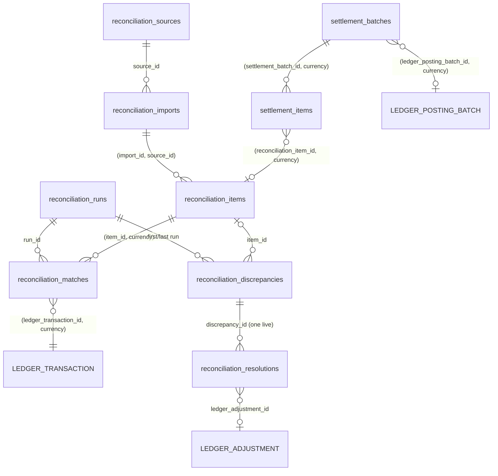
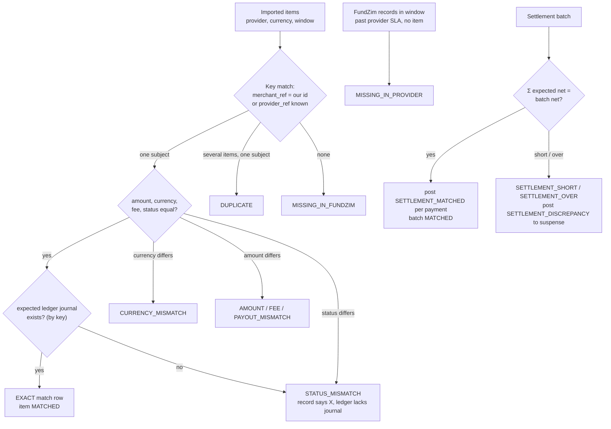

# Reconciliation Schema (`recon`)

**Stage 2 — design only.** Draft SQL: [`design/sql/0017_reconciliation.sql`](../../design/sql/0017_reconciliation.sql),
tests [`design/sql/tests/reconciliation_test.sql`](../../design/sql/tests/reconciliation_test.sql) (in-memory PGlite
only). Settlement matching is built with the ledger (Stage 10/11); full reconciliation in Stage 17
([ADR-030](../adr/ADR-030-reconciliation-architecture.md)).

Inputs: [LEDGER.md §10](../LEDGER.md), [settlement-and-custody-model.md §5.3–§5.4, §7](../ledger/settlement-and-custody-model.md),
[refund-and-reversal-flows.md §3.8](../payments/refund-and-reversal-flows.md),
[audit-evidence-model.md §4.9](../compliance/audit-evidence-model.md),
[operational-controls.md §3](../compliance/operational-controls.md), [design-baseline.md §5.18](../stage-2/design-baseline.md).
Related: [ledger-schema.md](ledger-schema.md), [ledger-posting-model.md](../architecture/ledger-posting-model.md),
[ledger-invariants.md](../architecture/ledger-invariants.md), [background-processing.md §6.7](../architecture/background-processing.md).

---

## 1. Purpose

Under Model A the PSP holds the money. The ledger is credible only because every provider-side fact is matched
three ways — **FundZim record ↔ provider line ↔ ledger journal** — and every difference becomes a tracked,
evidenced, approved case (custody model §7). Reconciliation also gates fund release: no settlement match, no
`RELEASE` (ADR-014).

## 2. Tables

| Table | Purpose | Mutability |
|---|---|---|
| `reconciliation_sources` | Where statements come from: provider statement / settlement report / provider API / FundZim bank statement | Config; only `enabled`, `parser_version` change |
| `reconciliation_imports` | One ingested file or API pull: hash, period, row counts, statement balances, evidence | Status machine; identity and hash immutable |
| `reconciliation_runs` | One matching pass for (provider, currency, window) | Status machine; frozen when final |
| `reconciliation_items` | Normalised statement lines | Immutable except `match_status` |
| `reconciliation_matches` | Item ↔ subject ↔ ledger journal | Append-only except `ACTIVE → REVOKED` |
| `reconciliation_discrepancies` | Mismatch cases (deduplicated across runs) | Status machine; evidence columns immutable |
| `reconciliation_resolutions` | Maker-checker resolution of a discrepancy | Status machine; proposal immutable |
| `settlement_batches` | Provider settlement batch header and totals | Status machine; amounts immutable |
| `settlement_items` | Lines of a settlement batch | Amounts immutable; match columns mutable |

No row is ever deleted (`app.forbid_mutation()` on DELETE/TRUNCATE). Column-level immutability uses
`recon.guard_mutable_columns(<allowed columns>)`; final states use `recon.freeze_terminal(<states>)`.



### 2.1 Key constraints

| Constraint | Guarantee |
|---|---|
| `uq_reconciliation_imports_content_sha256` | The same file / API payload is never imported twice (also across sources) |
| `uq_reconciliation_imports_statement (source_id, statement_ref)` where not superseding | A re-issued statement must explicitly supersede the old import |
| `ck_reconciliation_imports_parsed` | At `PARSED`, `rows_parsed + rows_rejected = rows_declared` (file trailer) |
| `uq_reconciliation_items_source_line (source_id, external_line_id)`, `uq_reconciliation_items_import_line` | A statement line is ingested once even if periods overlap |
| `ck_reconciliation_items_net` | `net = amount − fee` when the provider reports both |
| `trg_reconciliation_items_import_open` | Lines are added only while the import is `PARSING` |
| `uq_reconciliation_runs_one_active (provider_code, currency)` | No overlapping runs for one scope |
| `fk_reconciliation_matches_item_currency`, `fk_reconciliation_matches_ledger_transaction (…, currency)` | Match, item and journal share one currency |
| `ck_reconciliation_matches_manual` | Manual match: staff maker ≠ checker, ≥ 1 evidence record |
| `uq_reconciliation_discrepancies_dedupe` | One case per distinct problem; later runs bump `occurrences`, `last_seen_run_id` |
| `ck_reconciliation_discrepancies_shape` | Each type carries its evidence (see §3) |
| `ck_reconciliation_resolutions_maker_checker`, `…_approval`, `…_ledger`, `…_applied` | Checker ≠ proposer; evidence required; money-moving resolutions need a ledger adjustment and a resulting journal |
| `uq_reconciliation_resolutions_live` | One live resolution per discrepancy |
| `fk_settlement_items_batch_currency` | Settlement item currency = batch currency |
| `ck_settlement_batches_net`, `trg_settlement_batches_totals` | `net = credits − debits − fees`; the batch can become `MATCHED` only when its items sum to the header and all are matched |

### 2.2 Foreign-key policy

- To `app.currencies`: reference data.
- To `ledger.ledger_transactions`, `ledger_adjustments`, `ledger_posting_batches`: `reconciliation` may import
  `ledger` (baseline §3); ledger rows are immutable and never deleted, so these FKs cost nothing and make
  "matched to journal X" impossible to dangle. **This is the one cross-schema FK into a non-`app` schema; it
  needs the lead's confirmation against baseline §10** (which lists FKs to `app` reference tables only).
- To payments/payouts tables: **none**. Those tables belong to other modules (baseline §5.16/§5.17). Matches
  and discrepancies carry `(subject_type, subject_id)`; the matcher reads subjects through the `payments` and
  `payouts` public services. A subject that does not exist is itself a finding.
- To `audit.evidence_records`: none (audit module); evidence ids are verified by hash on read.
- Providers are identified by `provider_code` (the `psp` registry's stable code).

### 2.3 State machines (guarded by `app.guard_transition`)

| Machine | Edges |
|---|---|
| `reconciliation_import` | '' → RECEIVED → PARSING → PARSED → SUPERSEDED; RECEIVED/PARSING → FAILED |
| `reconciliation_run` | '' → QUEUED → RUNNING → COMPLETED / FAILED; QUEUED → CANCELLED |
| `reconciliation_match` | '' → ACTIVE → REVOKED |
| `reconciliation_discrepancy` | '' → OPEN → INVESTIGATING → RESOLUTION_PROPOSED → RESOLVED; RESOLUTION_PROPOSED → INVESTIGATING (rejected); OPEN/INVESTIGATING → AUTO_CLOSED |
| `reconciliation_resolution` | '' → PROPOSED → APPROVED → APPLIED; PROPOSED → REJECTED / WITHDRAWN / EXPIRED; APPROVED → EXPIRED |
| `settlement_batch` | '' → RECEIVED → MATCHING → MATCHED → CLOSED; MATCHING ⇄ DISCREPANCY |

## 3. Matching algorithm (outline)

A run takes the imports for (provider, currency, window), the FundZim records for the window plus a lookback,
and the ledger journals by `source_id` / idempotency key. All comparisons are per currency.



| Type | Detection | Default severity | Ledger effect | Payout effect |
|---|---|---|---|---|
| `MISSING_IN_PROVIDER` | FundZim `SUCCEEDED` payment / `COMPLETED` payout / `SUCCEEDED` refund has no provider line after the provider's settlement window | SEV1 for payments and payouts (critical, LEDGER §10) | None until resolved | Payout hold on the campaign (`risk`) |
| `MISSING_IN_FUNDZIM` | Provider line with no FundZim subject (unknown funds; portal-initiated payout — operational-controls §4.2) | SEV1 for outgoing lines, SEV2 for incoming | Unknown incoming funds: `SETTLEMENT_DISCREPANCY` Dr `psp_settled` · Cr suspense (never released) | Outgoing unknown: `PROVIDER_HOLD` |
| `DUPLICATE` | Two lines (or two subjects) for one reference/amount | SEV2 | None (duplicate import is impossible by constraint; this is a provider-side duplicate) | — |
| `AMOUNT_MISMATCH` | Gross differs | SEV2 (SEV1 above threshold) | None until resolved | Hold on the campaign until resolved |
| `CURRENCY_MISMATCH` | Provider currency ≠ expected (after code normalisation, e.g. `ZiG`→`ZWG`); raw code kept | SEV1 (ADR-018: possible manipulation) | Difference in the **reported** currency to suspense | `PROVIDER_HOLD` for the pair |
| `FEE_MISMATCH` | Fee ≠ recorded schedule / T2 | SEV3 | Resolution: correction of T2 (reversal + replacement) or `SETTLEMENT_DISCREPANCY_RESOLVED` | — |
| `PAYOUT_MISMATCH` | Payout amount/destination ref/status differs from the provider line | SEV1 | None until resolved | `PROVIDER_HOLD` |
| `STATUS_MISMATCH` | e.g. provider refunded but FundZim has no refund; provider failed a payment FundZim has `SUCCEEDED`; record without its journal | SEV2 (SEV1 for payout) | Via the owning module's state machine, then its named rule | Hold if money-affecting |
| `SETTLEMENT_SHORT` / `SETTLEMENT_OVER` | Batch net ≠ Σ expected (captures − PSP fees − refunds − chargebacks ± adjustments, refund flows §3.8) | SEV2 (SEV1 above threshold) | `SETTLEMENT_DISCREPANCY` to suspense; the release uses only what is confirmed; surplus never released | — |

Matching is never inferred at query time: every decision is a stored `reconciliation_matches` or
`reconciliation_discrepancies` row tied to the run. A later run that finds the missing counterpart sets the
discrepancy to `AUTO_CLOSED` (only for timing types with no ledger effect: `MISSING_IN_PROVIDER` arriving late).
Rule matches (`match_type = RULE`) record the matcher rule code (for example batch netting). **Reconciliation
never edits payments, payouts or ledger rows**; it posts only through named rules and resolutions.

## 4. Relation to ledger postings

| Event | Rule | Key | Posted by |
|---|---|---|---|
| Settlement line matches a capture | `SETTLEMENT_MATCHED` (T3) | `settlement:{batch}:{payment}` | match run, in the same tx as the match row; grouped by `ledger_posting_batches` (`settlement_batch:{id}`) |
| Settlement differs / unknown funds | `SETTLEMENT_DISCREPANCY` (T3′) | `settlement:{batch}:{payment}` / `…:unmatched:{item}` | match run; `reconciliation_discrepancies.suspense_transaction_id` points at it |
| PSP fee first known at settlement | `PSP_FEE` (T2) | `payment:{id}:psp_fee` | match run (same key as at capture → posted once) |
| Fee remittance line | `FEE_REMITTANCE` | `fee_remittance:{p}:{batch}` | match run |
| Approved resolution moving money | `SETTLEMENT_DISCREPANCY_RESOLVED`, `ADJUSTMENT`, `REVERSAL`, `WRITE_OFF` | `discrepancy:{id}:resolved`, `adjustment:{id}` … | resolution approval tx, via `ledger_adjustments` |

Release (`RELEASE`, T4) is posted by the release job only after the T3 journal exists (PD-14).

## 5. Manual resolution with approval

```mermaid
sequenceDiagram
    autonumber
    actor M as FINANCE (maker)
    actor C as FINANCE (checker, != maker)
    participant R as reconciliation
    participant L as ledger
    participant DB as PostgreSQL
    M->>R: propose resolution (type, justification, evidence ids, balanced preview lines)
    R->>L: CreateAdjustment(kind MANUAL/CORRECTION, rule, lines, reason_code=RECON_DISCREPANCY, link)
    R->>DB: resolution PROPOSED; adjustment PENDING_APPROVAL; discrepancy RESOLUTION_PROPOSED; audit ledger.adjustment.requested
    C->>R: approve (step-up MFA, justification) — sees same lines hash
    R->>DB: BEGIN; adjustment APPROVED (hash), resolution APPROVED;<br/>ledger.Post (journal = approved lines);<br/>adjustment POSTED; resolution APPLIED; discrepancy RESOLVED;<br/>audit ledger.adjustment.approved + reconciliation.mismatch.resolved; COMMIT
```

- Both records enforce maker ≠ checker (`ck_reconciliation_resolutions_maker_checker`,
  `ck_ledger_adjustments_maker_checker`); the ledger additionally checks that the journal equals the approved
  lines (L14).
- Non-money resolutions (`EXPLAINED_NO_ACTION`, `PROVIDER_CORRECTION_CONFIRMED`, `ESCALATED_TO_CASE`,
  `MANUAL_MATCH`) still need a checker and evidence.
- Requests expire (24 h for ledger adjustments, operational-controls §3) and are never auto-approved.

## 6. Audit evidence

| Artefact | Evidence (audit-evidence-model §2, §4.9) |
|---|---|
| Imported file / API payload | `evidence_records` `PSP_SETTLEMENT_REPORT` / bank statement, C2, `content_sha256` = `reconciliation_imports.content_sha256` |
| Each line | `raw_line_sha256` + `raw_line_locator` inside the evidence object |
| Run report | `report_evidence_record_id` (required at `COMPLETED`); audit `reconciliation.run.completed` with counts |
| Mismatch | audit `reconciliation.mismatch.detected` (category) |
| Resolution / adjustment | `ADJUSTMENT_SUPPORT` evidence ids; audit `ledger.adjustment.requested/approved`, `reconciliation.mismatch.resolved` |

Statement files may contain personal data (payer names, MSISDNs). They stay in the private bucket as evidence;
`recon` tables keep only references and amounts.

## 7. Scheduling

Jobs and retry policy are specified in [background-processing.md §6.7](../architecture/background-processing.md):
`reconciliation.import` (per source, scheduled fetch or staff upload), `reconciliation.match_run` (after import +
daily 03:00 UTC; one active run per provider/currency, enforced by `uq_reconciliation_runs_one_active`),
`reconciliation.discrepancy_ageing` (SC-4, daily 06:00 UTC, escalates rows past `sla_due_at`) and
`reconciliation.daily_report`. SC-3 compares `psp_settled:{p}` (read via `ledger.v_balances_current`) with the
import's `closing_balance_minor` after each run.

Alignment notes with background-processing.md §6.7 (to be reconciled by the lead): that document names the
dedupe `UNIQUE(source_id, file_sha256)`, `UNIQUE(import_id, line_no)` and status `FAILED_PARSE`; this schema uses
the stricter global `UNIQUE(content_sha256)`, `UNIQUE(import_id, line_number)` plus `UNIQUE(source_id,
external_line_id)`, and status `FAILED` with `failure_reason`.

## 8. Open items

- Statement formats, timing and balance APIs per provider: PCR-007 (settlement reports), PCR-016 (fee netting).
- Severity thresholds and SLA ages are configuration (`risk.limits`, INTERNAL_RISK), not constants.
- FK from `recon` into `ledger` (§2.2) needs confirmation against baseline §10.
