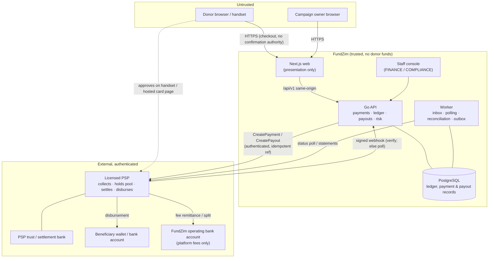
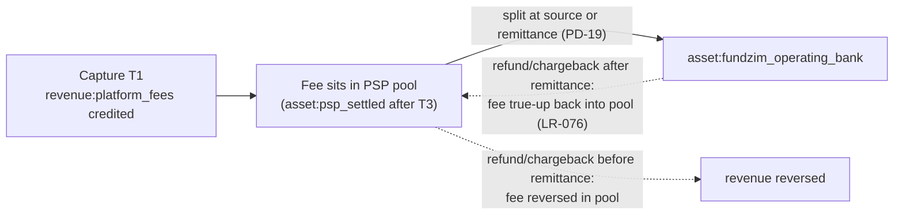

# Funds-Flow Architecture

**Stage 1 — design only.** This document describes how money moves under the provisional **Model A
(PSP-mediated)** operating model ([operating-model-decision.md](../compliance/operating-model-decision.md),
[ADR-013](../adr/ADR-013-regulatory-operating-model.md)). No provider has been selected, and nothing here is
integrated. Provider behaviours are cited from provider research (R3, accessed 2026-10-08) only where
VERIFIED; everything else is **PROVIDER_CONFIRMATION_REQUIRED** (PCR — [provider-questions.md](provider-questions.md)).

Companion documents:
- states: [transaction-lifecycle.md](transaction-lifecycle.md), [payout-lifecycle.md](payout-lifecycle.md);
- refunds/disputes: [refund-and-reversal-flows.md](refund-and-reversal-flows.md);
- accounts and journals: [settlement-and-custody-model.md](../ledger/settlement-and-custody-model.md);
- currency: [currency-and-fx-policy.md](currency-and-fx-policy.md);
- responsibilities: [financial-responsibility-matrix.md](../compliance/financial-responsibility-matrix.md).

---

## 1. Trust boundaries



Boundaries that matter:

| Boundary | Rule |
|---|---|
| Browser → FundZim | Nothing the browser says about payment status is trusted. Redirect/return URLs only trigger a status check. |
| PSP → FundZim | Callbacks are verified (signature/hash) and **confirmed by a server-to-server status query** before money states change, wherever the provider's callback is unsigned or not replay-protected (Paynow's SHA512 hash has no timestamp; Pesepay callbacks are unsigned and not retried — R3 §1 row 13, §2 row 13). |
| FundZim → PSP | Every instruction carries FundZim's own idempotent reference (`payment_id` / `payout_id` / `refund_id`) (PAYMENTS §10.2). Calls are made outside DB transactions, after the intent row is committed. |
| Money | Donor funds never cross into FundZim's operating account. Only platform-fee revenue does (and FundZim's own funding movements — LR-076). |

## 2. Flow 1 — successful local donation (mobile money)

Methods: EcoCash, OneMoney, InnBucks, O'Mari, ZimSwitch/bank cards, wherever the selected provider supports the
method × currency pair (capability matrix: [provider-capability-matrix.md](provider-capability-matrix.md)).

```mermaid
sequenceDiagram
    autonumber
    actor D as Donor
    participant W as Web (Next.js)
    participant A as API
    participant DB as PostgreSQL
    participant P as PSP
    participant J as Worker

    D->>W: choose campaign, amount, method (e.g. EcoCash), phone
    W->>A: POST /api/v1/donations (Idempotency-Key)
    A->>A: validate campaign ACTIVE, method×currency capability, risk pre-checks
    A->>DB: INSERT payment CREATED (payment_id); COMMIT
    A->>P: CreatePayment(ref = payment_id, amount_minor, currency, method, phone)
    alt provider accepts
        P-->>A: accepted (provider_reference, poll handle)
        A->>DB: CREATED → PENDING / REQUIRES_ACTION (handset prompt)
        A-->>W: 202 {status: "processing", next_action: "approve on phone"}
    else timeout / indeterminate
        A->>DB: CREATED → UNKNOWN
        A-->>W: 202 {status: "processing"}
        Note over A,J: never FAILED on timeout — resolution by poll (transaction-lifecycle §7.3)
    end
    D->>P: approves on handset (PIN / OTP)
    P->>A: callback (signed or unsigned per provider)
    A->>DB: store raw event in webhook_inbox (UNIQUE provider_event_id); 200 OK
    J->>P: GetPayment(payment_id) — authoritative status query
    P-->>J: paid / success
    J->>DB: BEGIN; → SUCCEEDED; post T1 capture + T2 PSP fee;<br/>update projections; outbox: receipt notification; COMMIT
    J-->>D: confirmation (SMS / email via outbox)
    W->>A: GET /api/v1/donations/{id} (polling the result page)
    A-->>W: SUCCEEDED
```

Afterwards, money states advance without further donor involvement:

```mermaid
sequenceDiagram
    autonumber
    participant P as PSP
    participant J as Worker (reconciliation)
    participant DB as PostgreSQL
    P-->>J: settlement report / statement (API, export or file — PCR)
    J->>DB: match line ↔ payment ↔ capture journal (three-way)
    alt matched
        J->>DB: post T3 settlement (psp_clearing → psp_settled)
        J->>DB: evaluate release rules (PD-14); post T4 release (unsettled → payable)
    else amount differs / unknown payment
        J->>DB: post to suspense:settlement_discrepancy; open FINANCE case
    end
```

Notes per verified provider behaviour (R3):

| Provider | Relevant verified behaviour | Design consequence |
|---|---|---|
| Paynow | Callback `hash` = SHA512 over the values + integration key, with no timestamp. Resent up to 10 times. Paynow recommends polling `pollurl` for important updates (R3 §1 row 13). Statuses include Paid, Awaiting Delivery, Delivered, Cancelled, Disputed, Refunded. | Verify the hash, then confirm by poll before SUCCEEDED. Escrow ("Buysafe"/Awaiting Delivery) must be disabled for donations or mapped explicitly (PCR). |
| Pesepay | "Does not currently sign callback payloads", and there is "no retry" (R3 §2 row 13). Polling is "a required part of a correct integration". | The callback is only a hint. Polling is mandatory and is the source of truth. |
| Payonify | HMAC-SHA256 over `{t}.{raw_body}`, 5-min tolerance, 10 retries, `Idempotency-Key` header (R3 §3) | Signature + replay window verified directly; still dedupe on event id |
| Linkwa | `X-Linkwa-Signature` HMAC-SHA256 over the raw body; retries (R3 §4 row 13; the page was read via summarised rendering) | Verify; confirm via status endpoint |

## 3. Flow 2 — international donation (card)

```mermaid
sequenceDiagram
    autonumber
    actor D as Donor (abroad)
    participant W as Web
    participant A as API
    participant P as PSP (hosted card page)
    participant I as Card scheme / issuer

    D->>W: choose campaign, USD amount, "Card"
    W->>A: POST /api/v1/donations (Idempotency-Key)
    A->>A: capability check: method=CARD, currency=USD, foreign_cards=VERIFIED?
    A->>P: CreatePayment(ref = payment_id, USD, return_url)
    P-->>A: redirect URL
    A-->>W: redirect to PSP hosted page
    D->>P: card details (FundZim never sees PAN/CVV)
    P->>I: authorisation (3-D Secure where applied)
    I-->>P: approved
    P-->>D: redirect back to FundZim return_url
    Note over D,A: the return redirect is NOT confirmation
    W->>A: GET status → API queries PSP
    P->>A: callback / poll result: success
    A->>A: → (AUTHORISED if separate) → SUCCEEDED; post T1/T2
```

Considerations (no provider capability is assumed):

| Topic | What we know | Status |
|---|---|---|
| Foreign-issued cards accepted | Paynow: "Both locally and internationally issued Visa / Mastercard cards will work" (R3 §1 row 10). Linkwa: VERIFIED (R3 §4 row 10). Pesepay: UNVERIFIED. Payonify: RPC. | Per-provider capability flag `foreign_cards` |
| Transaction / settlement currency | Paynow foreign Visa/MC settles T+3; "Visa funds settle to a NOSTRO account" (R3 §1 rows 8, 20). Pesepay cards are USD only (R3 §2 row 7). | The donation is in USD. Where settled funds sit under Model A is PCR-003 (custody). |
| Donor's home-currency conversion | Performed by the card scheme/issuer, outside FundZim's ledger | [currency-and-fx-policy.md](currency-and-fx-policy.md) §5 |
| Card fees | Published examples: Paynow Visa/MC 3.5% + 50c; Pesepay 3%; Payonify 2.9% + 59c (R3 rows 19) | The fee is recorded as reported by the provider (T2). Fee bearer is PD-01. |
| Authorisation vs capture | Not documented as separable for any candidate | `AUTHORISED` used only if a provider exposes it (PCR) |
| Chargebacks | Card disputes can arrive weeks later, after payout | Reserve policy (PD-33), dispute flows ([refund-and-reversal-flows.md](refund-and-reversal-flows.md) §5–6), recovery (LR-080). Card-heavy campaigns may get a longer release hold (PD-14). |
| Legal characterisation | Merchant payment vs cross-border remittance | **LR-078** (→ LR-044); international cards are off at pilot by default (PD-18) |
| Fraud | Card testing on low-value donations | Rate limits + velocity checks ([transaction-monitoring.md](../compliance/transaction-monitoring.md)) |

## 4. Flow 3 — beneficiary payout

Eligibility checks are catalogued in [payout-eligibility-and-controls.md](payout-eligibility-and-controls.md)
(EC-01 … EC-22). States and journals are in [payout-lifecycle.md](payout-lifecycle.md).

```mermaid
sequenceDiagram
    autonumber
    actor O as Owner (PAYOUT_VERIFIED)
    participant A as API
    participant E as Eligibility engine
    participant DB as PostgreSQL
    actor F as FINANCE approver(s)
    participant J as Worker
    participant P as PSP

    O->>A: POST /api/v1/campaigns/{id}/payouts (amount, currency, destination_id, Idempotency-Key)
    A->>E: evaluate at request time
    Note right of E: campaign payout-eligible (not FROZEN/SUSPENDED)<br/>KYC/KYB + beneficiary verified<br/>destination ownership verified, cooling-off elapsed<br/>available = campaign_payable ≥ amount<br/>no conflicting in-flight payout<br/>reserves respected · no blocking case/hold<br/>fraud flags · limits (REGULATORY/PROVIDER/INTERNAL, fail-closed)<br/>provider supports rail+currency
    E-->>A: PASS (decision record) / FAIL (reasons)
    A->>DB: BEGIN; lock payable; payout PAYOUT_REQUESTED; post payout reserve; COMMIT
    alt approval tier AUTO and no flags
        A->>DB: → APPROVED
    else SINGLE / DUAL
        A->>DB: → PENDING_REVIEW
        F->>A: approve (approver ≠ requester; DUAL: two distinct)
        A->>DB: → APPROVED
    end
    J->>E: re-check immediately before submission (TOCTOU)
    E-->>J: PASS
    J->>DB: → SUBMITTED; post payout submit (pending → in transit); COMMIT
    J->>P: CreatePayout(ref = payout_id, destination, amount, currency)
    alt accepted
        P-->>J: accepted → PROCESSING
    else timeout
        J->>DB: → UNKNOWN (never resubmitted; resolve by status query)
    end
    P->>A: callback (verify) / J polls GetPayoutStatus(payout_id)
    A->>DB: → COMPLETED; post payout complete (in transit → out of pool)
    A-->>O: payout completed notification
```

Provider reality: payout APIs were verified only for Payonify (EcoCash B2C, prior approval needed) and Linkwa
(SmileCash wallets only) (R3 §3 row 15, §4 row 15). Paynow and Pesepay document none. The payout rails at launch
depend entirely on provider confirmation (PCR-013 — payout API & rails). This is a Model A condition (C-5 in the
operating-model decision).

## 5. Flows 4–6 — summary

| Flow | Summary | Detail |
|---|---|---|
| **4 — Refund** | Requested by donor/SUPPORT/COMPLIANCE/system. Approved by FINANCE (≠ requester). A reservation journal posts on approval, the provider executes, and settlement posts on authoritative confirmation. Before settlement it nets against clearing; after settlement it draws from the pool; after payout, recovery is needed (never auto-approved). | [refund-and-reversal-flows.md](refund-and-reversal-flows.md) §3; [refund-and-dispute-architecture.md](refund-and-dispute-architecture.md) |
| **5 — Chargeback / reversal** | Provider debits the pool on dispute open or loss. The campaign's share is recovered in order (held → payable → reserve → unsettled), with any shortfall going to `chargeback_recoverable` and a pool-integrity funding journal. A dispute hold blocks payouts. | [refund-and-reversal-flows.md](refund-and-reversal-flows.md) §5–7 |
| **6 — Failed / unknown payment** | FAILED only on authoritative provider failure. A timeout means UNKNOWN, resolved by polling, then reconciliation, then FINANCE review with provider evidence. Late success is accepted. | [transaction-lifecycle.md](transaction-lifecycle.md) §7 |

## 6. Platform fee flow



FundZim may receive only platform-fee revenue into its operating account. The fee is revenue at capture (T1)
but physically remains in the pool until remitted ([settlement-and-custody-model.md](../ledger/settlement-and-custody-model.md) §5.7).

## 7. Flow 7 — frozen campaign

A FROZEN campaign (PRODUCT §6: compliance/finance freeze; donations stopped; all payouts frozen) has its money
moved so that payouts are structurally impossible ([settlement-and-custody-model.md](../ledger/settlement-and-custody-model.md) §5.12).

| Item | Treatment while FROZEN | Ledger | Who can change it |
|---|---|---|---|
| **Incoming donations (new)** | Refused: the donate button is disabled and the API rejects with `CAMPAIGN_NOT_ACCEPTING_DONATIONS`. The public page shows a neutral notice (wording reviewed for defamation/tipping-off risk, LR-088). | — | — |
| **Pending transactions** (CREATED/PENDING/REQUIRES_ACTION/UNKNOWN at freeze time) | Allowed to resolve normally (cannot be recalled from the donor's handset); CANCEL is attempted where the provider supports it. If they succeed, capture posts normally, and **release** later credits `campaign_held` instead of `campaign_payable`. They are flagged for COMPLIANCE review and may be refunded. | T1/T2 normal; T4 → `campaign_held` | System |
| **Captured, unsettled** | Stays in `campaign_unsettled`; settles normally; release goes to `campaign_held` | T3 normal; T4 → held | System |
| **Settled & available balance** | Moved `campaign_payable` → `campaign_held` by the freeze journal | `campaign:{id}:freeze:{n}` | COMPLIANCE / FINANCE (freeze); unfreeze needs a second approver (PRODUCT §6) |
| **Reserve** | Stays in `campaign_reserve` (already non-withdrawable); its reserve release is suspended | — | — |
| **Withdrawal requests not yet submitted** (PAYOUT_REQUESTED / PENDING_REVIEW / APPROVED) | Moved to CANCELLED automatically. The reservation is released into `campaign_held`, not `payable`. The owner is notified neutrally. | `payout:{id}:released` → held | System |
| **Active payouts** (SUBMITTED / PROCESSING / UNKNOWN) | Cannot be recalled unless the provider supports cancel (PCR-014 — payout cancel). Cancel is attempted if supported; otherwise the outcome is awaited. COMPLETED: funds have left; recovery is only considered if fraud is confirmed (LR-080). FAILED/REVERSED: the return credits `campaign_held`. | Y10/Y11/Y14 credit held | System + FINANCE |
| **Refunds in flight** | Continue (they return money to donors, which is consistent with the freeze's purpose). New refunds may be approved by FINANCE from `campaign_held` with COMPLIANCE consent. | `refund:*` journals, source `campaign_held` | FINANCE + COMPLIANCE |
| **Compliance investigation** | A case is opened ([compliance-case-management.md](../compliance/compliance-case-management.md)). Evidence is preserved (legal hold on evidence records). The outcome decides: unfreeze → ACTIVE/SUSPENDED/COMPLETED, or CANCELLED with fund disposition (refund / pay out / other) per LR-019 and PD-04. | Disposition journals | COMPLIANCE (decision) + FINANCE (execution), maker-checker |
| **Reporting obligations** | Suspicious-activity reporting, and what may be told to the owner and donors, are LR-008 (tipping-off) and LR-088 | — | COMPLIANCE |

```mermaid
sequenceDiagram
    autonumber
    actor C as COMPLIANCE
    participant A as API
    participant DB as PostgreSQL
    participant P as PSP
    C->>A: freeze campaign (reason, case_id)
    A->>DB: BEGIN; campaign → FROZEN; post freeze (payable → held);<br/>cancel unsubmitted payouts (reservations → held);<br/>place CAMPAIGN_FROZEN payout hold; audit; COMMIT
    A->>P: cancel in-flight payouts where supported (PCR)
    Note over A,DB: donations disabled; pending payments resolve, releases go to held
    C->>A: decision after investigation (second approver required to unfreeze)
    alt cleared
        A->>DB: unfreeze (held → payable); campaign → previous state
    else cancelled with refunds
        A->>DB: bulk refund requests (CAMPAIGN_CANCELLED) funded from held
    end
```

## 8. End-to-end money state summary

| Step | Payment status | Money state | Account |
|---|---|---|---|
| Intent created | CREATED | initiated | — |
| Handset prompt / card page | PENDING / REQUIRES_ACTION / AUTHORISED | initiated / authorised | — |
| Timeout | UNKNOWN | unknown | — |
| Confirmed | SUCCEEDED | captured | `psp_clearing` / `campaign_unsettled` |
| Settlement matched | SUCCEEDED | settled | `psp_settled` / `campaign_unsettled` |
| Released | SUCCEEDED | eligible | `campaign_payable` (or `campaign_reserve` portion) |
| Payout requested | — | reserved | `campaign_payout_pending` |
| Payout submitted | — | in transit | `payout_in_transit` |
| Payout completed | — | paid out | out of pool |
| Refund settled | REFUNDED / PARTIALLY_REFUNDED | refunded | out of pool |
| Chargeback | DISPUTED / CHARGED_BACK | reversed | campaign accounts debited; shortfall recoverable |

## New business decisions

| ID | Decision | Default proposed |
|---|---|---|
| PD-15 | Settlement SLA: how long a capture may remain unsettled before automatic FINANCE escalation, per provider and method | Provider's published timeline + 2 business days (e.g. Paynow T+1–T+3, Pesepay T+2 — R3), configured per provider |
