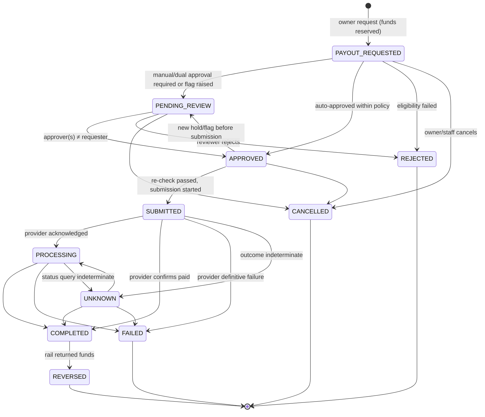

# Payout Lifecycle (Flow 3)

> **Stage 1 — design specification.** Nothing here is implemented, and no live payout functionality may be
> enabled before Stage 20 (ROADMAP Gate C). This document **supersedes** the payout state names and diagram
> in [PAYMENTS.md](../PAYMENTS.md) §13 (`REQUESTED → PAYOUT_REQUESTED`, `UNDER_REVIEW → PENDING_REVIEW`,
> `PAID → COMPLETED`, `RETURNED → REVERSED`; new `SUBMITTED`, `UNKNOWN`, `REJECTED`) — recorded in
> [ADR-020](../adr/ADR-020-payment-payout-state-model-revision.md). Ledger journals use
> [settlement-and-custody-model.md](../ledger/settlement-and-custody-model.md) and supersede
> [LEDGER.md](../LEDGER.md) §6.5–6.7 where they differ.
>
> Eligibility checks, holds, limits and approval policy: [payout-eligibility-and-controls.md](payout-eligibility-and-controls.md).
> End-to-end context: [funds-flow-architecture.md](funds-flow-architecture.md).

## 1. What a payout is

A **payout** is an instruction from FundZim to a provider to disburse an amount, in one currency, from funds
the provider holds for a campaign (Model A, [ADR-013](../adr/ADR-013-regulatory-operating-model.md)) to one
**verified payout destination** belonging to the campaign owner, the verified beneficiary, or a verified
institution payee ([beneficiary-verification.md](../compliance/beneficiary-verification.md)). Payouts are
always:

- **per campaign, per currency** — a USD payout comes only from the campaign's USD available balance; USD and
  ZiG are never combined ([currency-and-fx-policy.md](currency-and-fx-policy.md));
- **backed by the ledger** — the amount must be ≤ `liability:campaign_payable:{c}` (available) at request time
  and is reserved immediately;
- **identified by `payout_id`** (UUIDv7), which is also the provider reference and idempotency key for every
  submission attempt, forever.

## 2. States



### 2.1 State definitions

| State | Meaning | Money location (ledger) | Owner sees |
|---|---|---|---|
| `PAYOUT_REQUESTED` | Owner asked for a payout; automated eligibility evaluated at request; funds reserved | `campaign_payout_pending` | "Requested" |
| `PENDING_REVIEW` | Waiting for human approval (single or dual) or for a flag/hold to be resolved | `campaign_payout_pending` | "Under review" |
| `APPROVED` | Approval policy satisfied; waiting for submission (scheduler / immediate) | `campaign_payout_pending` | "Approved" |
| `SUBMITTED` | FundZim has committed to sending the instruction; the call is in progress or has just been made | `payout_in_transit:{p}` | "Processing" |
| `PROCESSING` | Provider acknowledged and is executing | `payout_in_transit:{p}` | "Processing" |
| `UNKNOWN` | FundZim cannot determine whether the provider received or executed the instruction | `payout_in_transit:{p}` | "Processing — we're confirming with the provider" |
| `COMPLETED` | Provider authoritatively confirms the disbursement | out of the pool (`psp_settled` reduced) | "Paid" |
| `FAILED` | Provider authoritatively confirms the disbursement did **not** and **will not** happen | back to `campaign_payable` | "Failed — funds returned to your balance" |
| `REJECTED` | FundZim refused the payout (eligibility or reviewer decision) | back to `campaign_payable` | "Rejected" + reason category |
| `CANCELLED` | Withdrawn before submission (owner or staff) | back to `campaign_payable` | "Cancelled" |
| `REVERSED` | Completed payout returned by the rail (e.g. destination closed after acceptance) | back to `campaign_payable` (+ case) | "Returned — please update your payout details" |

If the campaign is `FROZEN` (or a COMPLIANCE hold moved its funds to `campaign_held`) when a release happens,
the funds go to `campaign_held` instead of `campaign_payable` — they must not become withdrawable during a
freeze.

## 3. Transition table and ledger effects

Sources: `OWNER`, `STAFF` (audited, reason required), `SYSTEM`, `SYNC` (provider response), `WEBHOOK`,
`POLL`, `RECON`. Example amounts: US$4,000.00 = `400000`.

| # | From → To | Trigger / guard | Source | Ledger journal (key) | Lines |
|---|---|---|---|---|---|
| Y1 | — → PAYOUT_REQUESTED | Request passes request-time eligibility (all blocking checks pass) | OWNER | `payout:{id}:reserved` | Dr `campaign_payable:{c}` 400000 · Cr `campaign_payout_pending:{c}` 400000 ✔ |
| Y2 | PAYOUT_REQUESTED → PENDING_REVIEW | Approval policy = SINGLE or DUAL, or a soft check flagged | SYSTEM | none | — |
| Y3 | PAYOUT_REQUESTED → APPROVED | Approval policy = AUTO and no flags | SYSTEM | none | — |
| Y4 | PAYOUT_REQUESTED / PENDING_REVIEW → REJECTED | Blocking check failed after request, or reviewer rejects (reason required) | SYSTEM / STAFF | `payout:{id}:released` | Dr `campaign_payout_pending:{c}` · Cr `campaign_payable:{c}` (or `campaign_held:{c}`) ✔ |
| Y5 | PAYOUT_REQUESTED / PENDING_REVIEW / APPROVED → CANCELLED | Owner cancels, or staff cancels with reason | OWNER / STAFF | `payout:{id}:released` | as Y4 ✔ |
| Y6 | PENDING_REVIEW → APPROVED | Required approvals recorded; each approver ≠ requester; for DUAL, approvers distinct | STAFF | none | — |
| Y7 | APPROVED → PENDING_REVIEW | A hold, flag or destination change appeared after approval; approvals are invalidated | SYSTEM | none | — |
| Y8 | APPROVED → SUBMITTED | Pre-submission re-check passed ([payout-eligibility-and-controls.md](payout-eligibility-and-controls.md) §3.2) | SYSTEM | `payout:{id}:submitted` | Dr `campaign_payout_pending:{c}` 400000 · Cr `payout_in_transit:{p}` 400000 ✔ |
| Y9 | SUBMITTED → PROCESSING | Provider acknowledged | SYNC / WEBHOOK / POLL | none | — |
| Y10 | SUBMITTED / PROCESSING / UNKNOWN → COMPLETED | Authoritative confirmation | WEBHOOK / POLL / RECON | `payout:{id}:completed` | Dr `payout_in_transit:{p}` 400000 · Cr `asset:psp_settled:{p}` 400000 ✔ |
| Y11 | SUBMITTED / PROCESSING / UNKNOWN → FAILED | Authoritative, **final** failure (§5.3) | SYNC / WEBHOOK / POLL / RECON / STAFF (with provider evidence) | `payout:{id}:failed` | Dr `payout_in_transit:{p}` 400000 · Cr `campaign_payable:{c}` (or `campaign_held`) 400000 ✔ |
| Y12 | SUBMITTED / PROCESSING → UNKNOWN | Call or status query indeterminate | SYSTEM | none (money stays in transit) | — |
| Y13 | UNKNOWN → PROCESSING | Status query shows provider has it in progress | POLL / WEBHOOK | none | — |
| Y14 | COMPLETED → REVERSED | Provider reports the disbursement returned to the pool | WEBHOOK / POLL / RECON | `payout:{id}:reversed` | Dr `asset:psp_settled:{p}` 400000 · Cr `campaign_payable:{c}` (or `campaign_held`) 400000 ✔ |

**Payout fees** (if the provider charges per disbursement — PCR-013 — payout fees). The fee is recorded on the
payout (`provider_fee_minor`, `beneficiary_received_minor`). If the campaign bears it (PD-23), the beneficiary
receives `amount − fee` and the completion journal is unchanged (the full reserved amount leaves the pool). If
FundZim bears it, an extra journal `payout:{id}:fee`: Dr `expense:psp_processing_fees` · Cr `psp_settled:{p}`.

**Not allowed:** any transition out of FAILED, REJECTED, CANCELLED or REVERSED; COMPLETED → anything except
REVERSED; any status change driven by the owner's browser after submission; FAILED from a timeout.

Every transition appends to `payout_events` (append-only, same shape as `payment_events`) and an audit event.
Staff transitions require `reason` and, where relevant, an evidence record id.

## 4. Sequence — request to completion

```mermaid
sequenceDiagram
    autonumber
    actor O as Campaign owner
    participant API as FundZim API
    participant E as Eligibility engine
    participant DB as PostgreSQL
    actor A as FINANCE approver
    participant S as Submission worker
    participant P as PSP (disbursement)
    participant J as Poll job

    O->>API: POST /api/v1/campaigns/{c}/payouts (amount, currency, destination_id, Idempotency-Key)
    API->>DB: BEGIN; lock campaign projections (account-id order)
    API->>E: evaluate(request-time checks)
    E-->>API: decision {eligible, approval_policy=SINGLE, flags=[]}
    API->>DB: insert payout PAYOUT_REQUESTED; post payout:{id}:reserved;<br/>insert eligibility_decision; → PENDING_REVIEW; COMMIT
    API-->>O: 202 {payout_id, status: PENDING_REVIEW}
    A->>API: POST /api/v1/admin/payouts/{id}/approve (reason)
    API->>DB: check approver ≠ requester; PENDING_REVIEW → APPROVED; audit
    S->>DB: BEGIN; lock payout + campaign; re-evaluate submit-time checks
    alt re-check fails
        S->>DB: APPROVED → PENDING_REVIEW (or REJECTED + payout:{id}:released)
    else re-check passes
        S->>DB: APPROVED → SUBMITTED; post payout:{id}:submitted; COMMIT
        S->>P: CreatePayout(ref=payout_id, destination, amount, currency)
        alt acknowledged
            S->>DB: SUBMITTED → PROCESSING (provider_payout_ref)
        else timeout / reset after send / 5xx
            S->>DB: SUBMITTED → UNKNOWN; schedule poll (never resubmit)
        else definitely not sent (connection refused before write)
            S->>P: CreatePayout(ref=payout_id) retry — same reference
        end
        P->>API: webhook payout.completed (verified, inbox, dedupe)
        API->>DB: BEGIN; lock payout; → COMPLETED; post payout:{id}:completed; COMMIT
        J->>P: GetPayoutStatus(ref=payout_id) (backstop if no webhook)
    end
    API-->>O: "Paid" notification (amount, currency, masked destination)
```

The provider call is **never** made inside a DB transaction. The `SUBMITTED` state and the in-transit journal
commit **before** the call, so a crash after the request leaves a durable record that the instruction may have
been sent; recovery then polls rather than resubmitting.

## 5. Unknown outcomes, retries and duplicates

### 5.1 Classification of a submission attempt

| Adapter result | Action |
|---|---|
| `Accepted(provider_ref, state)` | → PROCESSING (or COMPLETED/FAILED if the provider's synchronous answer is final and authenticated) |
| `ErrDefinitelyNotSent` (nothing written to the provider) | Stay SUBMITTED; retry with the **same** `payout_id` with backoff; after N attempts alert FINANCE. Safe because nothing reached the provider. |
| `Rejected(code)` with documented "not created" semantics (e.g. invalid destination) | → FAILED (`payout:{id}:failed`), destination flagged for re-verification |
| `ErrOutcomeUnknown` (timeout after write, reset, 5xx, malformed) | → **UNKNOWN** |

### 5.2 Resolving UNKNOWN

1. Poll `GetPayoutStatus(payout_id)` with backoff up to the provider's documented completion horizon (PCR-026 — payout completion window).
2. A payout in UNKNOWN is **never resubmitted** — not with the same reference unless the provider documents
   idempotent payout creation keyed by our reference (PCR-013 — idempotent payouts), and **never** with a new
   reference.
3. If the horizon passes: `needs_reconciliation = true`; match against the provider's disbursement statement
   (Stage 17).
4. Still unresolved: FINANCE ops case; FundZim obtains written provider confirmation (stored as an evidence
   record) before any staff transition to FAILED.
5. While UNKNOWN, funds stay in `payout_in_transit` — neither available to the campaign nor considered paid.
   A further payout for the same campaign and currency is blocked by the single in-flight rule (§5.4).

### 5.3 When FAILED is allowed

FAILED requires evidence that the disbursement **did not and will not** execute:

- an authoritative provider failure status or webhook; or
- the provider's "reference not found" **after** its documented propagation window **and** a documented
  finality guarantee (PCR-026 — finality of "not found"); or
- written provider confirmation recorded by FINANCE (STAFF transition, evidence record, maker-checker above
  threshold).

If an authoritative **completion** later arrives for a payout already marked FAILED (provider error), the
payout's state is not changed (FAILED is terminal), but a **SEV1 incident** is raised: the funds released by
Y11 may have been paid out again. FINANCE posts a correcting journal referencing the payout
(`payout:{id}:late_completion`: Dr `campaign_payable:{c}` (or `chargeback_recoverable`-style recovery account
if the balance has been spent) · Cr `psp_settled:{p}`), places a payout hold, and handles recovery under the
incident workflow ([incident-response-workflows.md](../compliance/incident-response-workflows.md), unauthorised /
duplicate payout). This scenario is why FAILED demands strong evidence.

### 5.4 Duplicate payout prevention (defence in depth)

| Layer | Mechanism |
|---|---|
| API | `Idempotency-Key` required on `POST …/payouts`; stored per Stage 0 idempotency design; same key + same body → same payout; different body → `409 IDEMPOTENCY_KEY_REUSED`. |
| Domain | **At most one non-terminal payout per (campaign, currency)**: partial unique index `UNIQUE (campaign_id, currency) WHERE status IN ('PAYOUT_REQUESTED','PENDING_REVIEW','APPROVED','SUBMITTED','PROCESSING','UNKNOWN')`. (Multiple concurrent payouts are an open decision, PD-23; the index is the default.) |
| Balance | The reservation journal Y1 runs under row locks on the campaign's balance projections; L8 (no negative available balance) is enforced by the ledger. Two concurrent requests cannot both reserve the same money. |
| Ledger | Idempotency keys `payout:{id}:reserved`, `:submitted`, `:completed`, `:failed`, `:released`, `:reversed` are UNIQUE; replays are no-ops. |
| Provider | `payout_id` is the provider reference on every attempt; `UNIQUE (provider, provider_payout_ref)`. |
| State machine | Only APPROVED → SUBMITTED triggers a provider call, under a row lock, and only once (the transition itself is the claim; a second worker sees SUBMITTED and stops). |
| Reconciliation | Every disbursement on the provider statement must match exactly one COMPLETED payout; unmatched or double-matched lines → SEV1 case. |

### 5.5 Retries after failure

A retry after an authoritative FAILED is a **new payout request** with a new `payout_id`, re-evaluated from
scratch (including destination re-verification if the failure code suggests a bad destination). The failed
payout and its journals remain as history.

## 6. Reversal after completion

- Trigger: provider reports that a completed disbursement came back (closed wallet, account mismatch, bank
  return) — PCR-015 — payout return events.
- Effects: `COMPLETED → REVERSED`, journal Y14, destination marked `NEEDS_REVERIFICATION`, payout hold
  `DESTINATION_HOLD` until a verified destination exists, owner notified, ops case opened.
- A partial return (provider returns less than the full amount) is not modelled as a state; it is recorded as
  `REVERSED` with `reversed_amount_minor` and the journal uses that amount, with any difference investigated as a
  reconciliation discrepancy (PCR-015 — partial payout returns).

## 7. Interactions with campaign and compliance actions

| Event during payout | PAYOUT_REQUESTED / PENDING_REVIEW / APPROVED | SUBMITTED / PROCESSING / UNKNOWN | COMPLETED |
|---|---|---|---|
| Campaign SUSPENDED | → PENDING_REVIEW (hold); not submitted | Cannot be recalled unless the provider supports cancellation (PCR-014 — payout cancellation); outcome recorded when known | No change; investigation may open a recovery case |
| Campaign FROZEN | → PENDING_REVIEW with COMPLIANCE hold; if later REJECTED/CANCELLED funds go to `campaign_held` | As above; on FAILED funds go to `campaign_held` | As above |
| Payout destination changed | Approvals invalidated → PENDING_REVIEW; destination cooling-off applies | No effect on the in-flight instruction (destination snapshot) | — |
| Dispute opened on a donation | DISPUTE_HOLD → PENDING_REVIEW | Continues | — |
| Owner account SUSPENDED (verification status) | → PENDING_REVIEW, then REJECTED if not resolved | Continues | — |

Each payout stores a **destination snapshot** at request time (`destination_id`, `destination_version`,
masked identifier, `destination_hash`). The submission uses the snapshot; if the live destination differs at
re-check, Y7 applies.

## 8. Data implied for Stage 2

`payouts` (id, campaign_id, currency, amount_minor, status, status_rank, requested_by, destination_id,
destination_version, destination_hash, approval_policy, provider, provider_payout_ref, provider_fee_minor,
beneficiary_received_minor, unknown_since, next_poll_at, needs_reconciliation, idempotency_key UNIQUE,
created_at, updated_at); `payout_approvals` (payout_id, approver_id, role, decision, reason, decided_at;
UNIQUE(payout_id, approver_id); CHECK approver ≠ requester enforced by trigger); `payout_events`
(append-only); `eligibility_decisions` ([payout-eligibility-and-controls.md](payout-eligibility-and-controls.md) §8).

## 9. Tests (Stage 11 / Stage 19)

- every allowed transition and every disallowed transition;
- concurrent payout requests exceeding available balance → exactly the affordable number reserve;
- second request while one is non-terminal → rejected by the partial unique index;
- timeout on submission → UNKNOWN, no second `CreatePayout` with a new reference, resolved by poll and by
  reconciliation;
- `ErrDefinitelyNotSent` → same-reference retry only;
- freeze during PENDING_REVIEW → release goes to `campaign_held`;
- reversal after completion → funds back, destination hold;
- late completion after FAILED → SEV1 alert and correcting journal;
- all journals balance per currency; L8 holds throughout.
