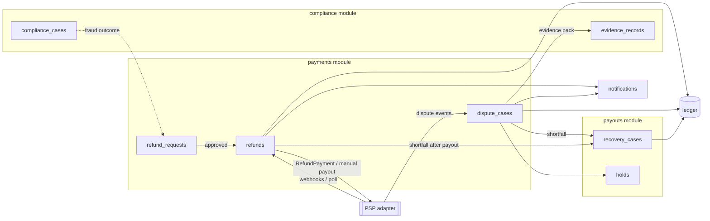
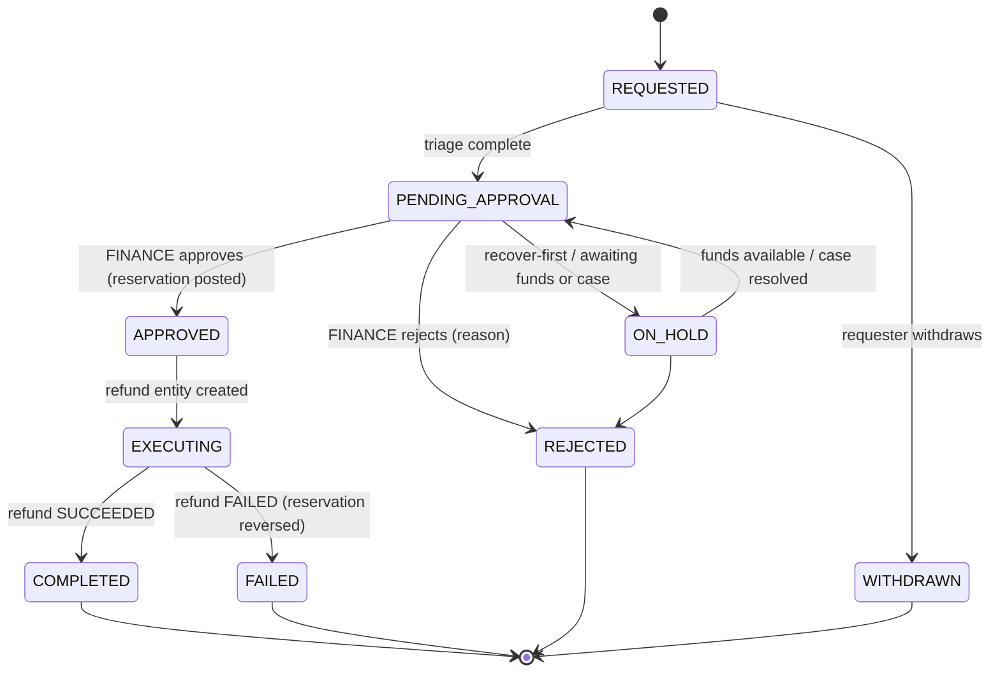
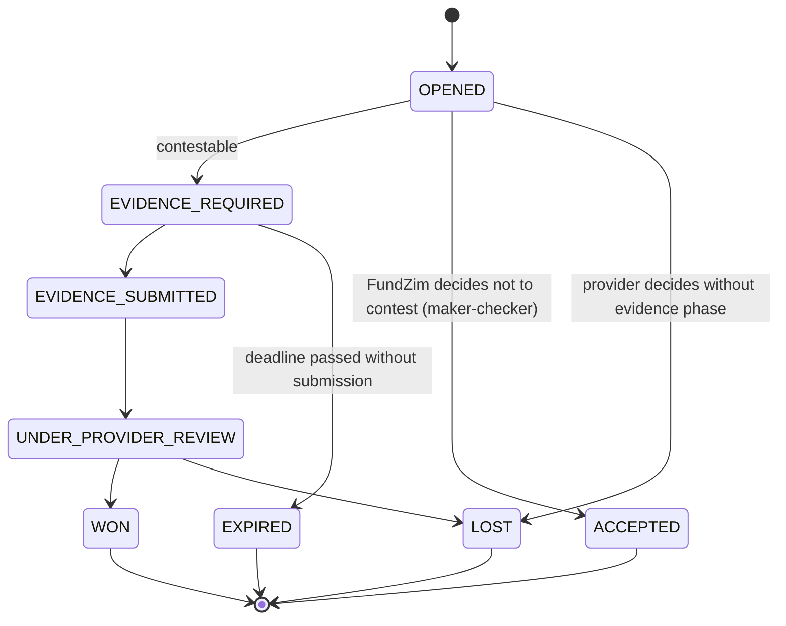

# Refund and Dispute Architecture

> **Stage 1 — design specification** for the system that implements refunds, disputes/chargebacks and
> recovery. Money movements and journals: [refund-and-reversal-flows.md](refund-and-reversal-flows.md). Payment
> states: [transaction-lifecycle.md](transaction-lifecycle.md). Donor-facing policy:
> [donor-protection-policy.md](../compliance/donor-protection-policy.md). Evidence:
> [audit-evidence-model.md](../compliance/audit-evidence-model.md),
> [ADR-019](../adr/ADR-019-regulatory-evidence-management.md). Built in Stages 8 (abstraction), 11
> (payout-path refunds), 14 (ops portal), 17 (reconciliation).

## 1. Components

Ownership (Stage 0 module rules): `payments` owns refund requests, refunds and dispute cases; `payouts` owns
holds and recovery cases (they gate payouts); `compliance` owns compliance cases and evidence records; only
`ledger` writes journals, through named posting rules (`refund.reserve`, `refund.settle`, `refund.release`,
`refund.fund_shortfall`, `dispute.open`, `dispute.hold`, `dispute.won`, `dispute.lost`, `dispute.fund_shortfall`,
`recovery.receive`, `recovery.setoff`, `recovery.write_off`).

## 2. Refund request and refund entities

A **refund request** is the business ask; a **refund** is the provider-facing execution. They are one-to-one
in the normal case; separating them keeps rejected/withdrawn requests out of the provider-facing table.

### 2.1 `refund_requests`

| Field | Notes |
|---|---|
| `id` | UUIDv7 |
| `payment_id`, `campaign_id`, `currency`, `amount_minor` | Amount > 0 and ≤ refundable remaining at approval |
| `reason_code` | `DONOR_REQUEST`, `DUPLICATE_PAYMENT`, `PAYMENT_ERROR`, `CAMPAIGN_CANCELLED`, `CAMPAIGN_FRAUD`, `COMPLIANCE_ORDER`, `OTHER` |
| `reason_text` | Free text (staff); donor text stored separately with C2 classification |
| `channel` | `DONOR`, `SUPPORT`, `COMPLIANCE`, `SYSTEM` |
| `requested_by`, `requested_at` | Actor (user/staff/system) |
| `status` | §2.2 |
| `decided_by`, `decided_at`, `decision_reason` | Approval/rejection (approver ≠ requester, DB-enforced) |
| `funding_plan` | `CAMPAIGN`, `CAMPAIGN_PLUS_RESERVE`, `PLATFORM_FUNDED_WITH_RECOVERY` (C2), `RECOVER_FIRST` |
| `execution_method` | `PROVIDER_REFUND` or `MANUAL_PAYOUT` |
| `compliance_case_id` | Optional link |
| `idempotency_key` | UNIQUE (client `Idempotency-Key`) |

### 2.2 Refund request states

### 2.3 `refunds` (execution)

| Field | Notes |
|---|---|
| `id` (= `refund_id`) | **Provider reference and idempotency key** for every attempt |
| `refund_request_id`, `payment_id`, `provider`, `amount_minor`, `currency` | |
| `status` | `APPROVED`, `SUBMITTED`, `PROCESSING`, `UNKNOWN`, `SUCCEEDED`, `FAILED`, `CANCELLED` — same submission and UNKNOWN rules as payouts ([payout-lifecycle.md](payout-lifecycle.md) §5) |
| `provider_refund_ref` | `UNIQUE (provider, provider_refund_ref)` |
| `unknown_since`, `next_poll_at`, `needs_reconciliation` | |
| `ledger_reservation_txn`, `ledger_settlement_txn`, `ledger_release_txn` | Journal links |

Constraints (illustrative): `CHECK (amount_minor > 0)`; a trigger rejects approval when Σ amounts of
non-failed refunds + chargebacks for the payment would exceed the captured amount; `refund_events`
append-only.

## 3. Dispute / chargeback case entity

### 3.1 `dispute_cases`

| Field | Notes |
|---|---|
| `id` | UUIDv7 |
| `payment_id`, `campaign_id`, `provider`, `provider_dispute_ref` | `UNIQUE (provider, provider_dispute_ref)` |
| `kind` | `INQUIRY`, `CHARGEBACK`, `PROVIDER_REVERSAL` |
| `reason_code_provider`, `reason_category` | Provider/scheme reason as received; normalised category (`FRAUD_CLAIMED`, `NOT_RECOGNISED`, `DUPLICATE`, `NOT_AS_DESCRIBED`, `PROCESSING_ERROR`, `OTHER`) |
| `amount_minor`, `currency` | Disputed amount; same currency as payment |
| `debit_timing` | `ON_OPEN` or `ON_LOSS` (from provider capability) |
| `evidence_due_at` | Provider deadline, stored exactly as received (UTC). Never computed by FundZim from assumptions (PCR-012 — dispute timelines) |
| `status` | §3.2 |
| `assigned_to` | COMPLIANCE or FINANCE staff |
| `outcome_at`, `outcome` | |
| `hold_id`, `recovery_case_id` | Links |

### 3.2 Dispute states

`ACCEPTED`, `EXPIRED` and `LOST` all move the payment to `CHARGED_BACK`; `WON` moves it back to `SUCCEEDED`.
`INQUIRY` cases (no funds moved) can escalate to a chargeback, creating a linked case.

Deadline management: a scheduler raises reminders at configured offsets before `evidence_due_at`; a case
approaching its deadline without an assigned owner is a SEV3 alert, and an `EXPIRED` case is reviewed in the
weekly operations review.

### 3.3 Recovery cases (`recovery_cases`)

Opened when a refund (option C2) or a reversal leaves a shortfall in `refund_recoverable` /
`chargeback_recoverable`. States: `OPEN → PARTIALLY_RECOVERED → RECOVERED` or `→ WRITE_OFF_PENDING →
WRITTEN_OFF` (maker-checker). Fields: subject (owner/organisation/beneficiary), amount and currency, source
(refund/dispute id), recovery routes attempted, `RECOVERY_HOLD` id, linked compliance case, communication log.
Whether recovery is enforceable at all is LR-080; set-off against later donations is LR-082.

## 4. Evidence submission to providers

- An **evidence pack** is assembled from: payment record and events, donor-facing confirmation, campaign
  snapshot at donation time (title, story hash, beneficiary type — **no KYC documents**), donor communication
  log, delivery/usage evidence from the campaign owner (receipts, invoices from hospitals/schools), and
  refund-policy terms version accepted by the donor.
- Each item is an `evidence_record` (private bucket, SHA-256, classification, retention class). The pack is a
  manifest listing evidence ids + hashes, itself an evidence record.
- Submission: through the provider API if supported (`SubmitDisputeEvidence` capability), otherwise through the
  provider portal by authorised staff, with the submission confirmation captured as an evidence record (PCR-012 — dispute evidence submission method and format).
- Data minimisation: only what is needed to contest the dispute is sent. Medical details of beneficiaries are
  not sent unless the beneficiary's consent covers it (see [data-protection-assessment.md](../compliance/data-protection-assessment.md)).

## 5. Donor communication events

Emitted through the outbox (Stage 0 pattern) to `notifications`; templates in Stage 15. Never include fraud
indicators or investigation details that could tip off a subject (LR-008).

| Event | Recipient | Content |
|---|---|---|
| `refund.requested` | Donor | Request received, reference, expected review time |
| `refund.approved` | Donor | Amount, currency, method (original instrument), expected arrival per provider |
| `refund.rejected` | Donor | Decision, reason category, how to escalate / complain |
| `refund.on_hold` | Donor | Under review; next update by date |
| `refund.completed` | Donor | Confirmation with provider reference |
| `refund.failed` | Donor + SUPPORT | Problem with returning funds; support will contact |
| `payment.duplicate_detected` | Donor | Both payments went through; one is being returned |
| `payment.late_success` | Donor | Earlier payment did go through |
| `campaign.cancelled.refunds` | Donors of campaign | Campaign cancelled; what happens to their donation (per LR-019 outcome) |
| `dispute.opened` | Campaign owner (not donor) | A donation is disputed; payouts may pause; evidence requested |
| `recovery.notice` | Campaign owner | Amount to recover, basis in terms, how to repay (LR-080) |

## 6. Roles

| Action | Allowed | Maker-checker |
|---|---|---|
| Create refund request | Donor (own payment), SUPPORT, COMPLIANCE, system | — |
| Approve/reject refund request | FINANCE | Approver ≠ requester |
| Choose funding plan C2 (platform-funded) | FINANCE | DUAL (FINANCE + COMPLIANCE or second FINANCE) |
| Accept a dispute without contest | FINANCE | Yes |
| Submit dispute evidence | COMPLIANCE or FINANCE | No (audited) |
| Write off recoverable | FINANCE | DUAL |
| Release DISPUTE_HOLD / RECOVERY_HOLD manually | COMPLIANCE / FINANCE | Yes |

## 7. APIs implied (Stage 2 input)

Public (donor), all mutating calls require `Idempotency-Key`:

| Method & path | Purpose |
|---|---|
| `POST /api/v1/donations/{payment_id}/refund-requests` | Donor requests a refund of their own donation |
| `GET /api/v1/refund-requests/{id}` | Donor views status (IDOR check: own requests only) |
| `DELETE /api/v1/refund-requests/{id}` | Withdraw while `REQUESTED` |

Staff (`/api/v1/admin/…`, staff session + MFA; step-up for approvals):

| Method & path | Purpose | Permission |
|---|---|---|
| `POST /admin/refund-requests` | Create on behalf of donor / compliance | `refund.request` |
| `POST /admin/refund-requests/{id}/approve` · `/reject` · `/hold` | Decide | `refund.approve` |
| `GET /admin/disputes?status=` · `GET /admin/disputes/{id}` | Work queue | `dispute.view` |
| `POST /admin/disputes/{id}/evidence-packs` | Assemble/submit evidence | `dispute.evidence.submit` |
| `POST /admin/disputes/{id}/accept` | Accept without contest | `dispute.accept` (maker-checker) |
| `POST /admin/recovery-cases/{id}/write-off` | Write off | `recovery.write_off` (DUAL) |

Webhooks: provider `refund.*`, `dispute.*`, `reversal.*` events through `/api/v1/webhooks/{provider}` and the
Stage 0 inbox (verification, dedupe, parking).

## 8. Policy, provider rules and law — kept separate

| Topic | Platform policy (FundZim decides; PD) | Provider rule (PCR) | Legal requirement (LR) |
|---|---|---|---|
| Who may request a refund, and until when | PD-21 | Refund window per method | Donor statutory rights — LR-018 |
| Fee treatment on refunds/chargebacks | PD-20 | Whether PSP fees are returned on refund; dispute fees | Tax treatment — LR-016 |
| Duplicate-payment auto-refunds | PD-21 | Partial/multiple refunds supported | — |
| Refund to another instrument | Not allowed by default | Manual payout capability | LR-081 |
| Disputes: contest or accept | FundZim decision per case | Deadlines, evidence format, debit timing | Liability allocation — LR-020 |
| Recovery from beneficiaries | PD-22 recovery order | — | Enforceability — LR-080; set-off — LR-082 |
| Cancelled campaign funds | PD-04 | — | LR-019 |
| Undeliverable refunds | Holding + escalation | Return handling | LR-083 |
| Communication during investigations | Templates | — | Tipping-off — LR-008 |

The system stores the **source** of each rule in configuration (policy id / provider doc reference / register
id), so an auditor can see why a refund window or a deadline applied.

## 9. Data entities implied for Stage 2

`refund_requests`, `refunds`, `refund_events`, `dispute_cases`, `dispute_events`, `recovery_cases`,
`recovery_events`, `holds`, `hold_events`, `evidence_records` (compliance module), notification outbox rows.
New ledger accounts proposed: `asset:refund_recoverable:{c}`, `expense:refund_losses` (see
[refund-and-reversal-flows.md](refund-and-reversal-flows.md) §3.5).

New legal questions and business decisions used here are defined in
[refund-and-reversal-flows.md](refund-and-reversal-flows.md) (LR-080 – LR-083, PD-20 – PD-22) and
[payout-eligibility-and-controls.md](payout-eligibility-and-controls.md) (LR-084, PD-23 – PD-24).
