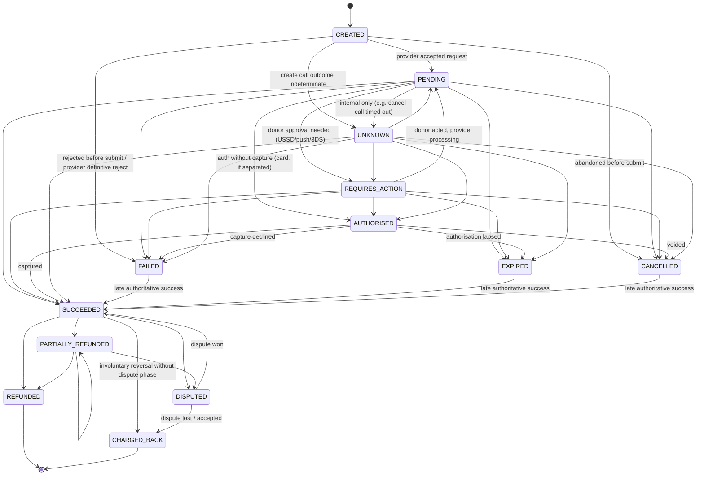
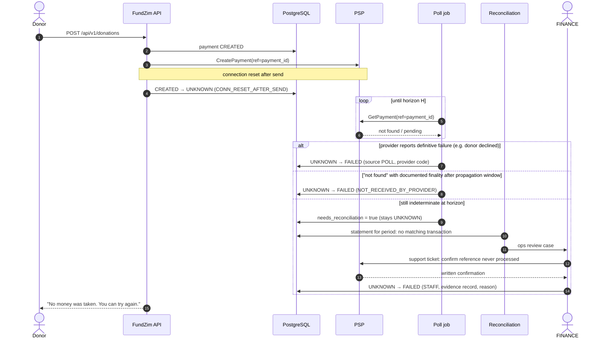

# Payment Transaction Lifecycle

> **Stage 1 — design specification.** Nothing here is implemented. This document **supersedes**
> [PAYMENTS.md](../PAYMENTS.md) §6 (state machine), §6.1 (precedence table) and §8 (timeouts) where they
> differ; the change is recorded in [ADR-020](../adr/ADR-020-payment-payout-state-model-revision.md). Everything
> else in PAYMENTS.md (webhook pipeline, idempotency, provider interface) still applies.
>
> Related: [funds-flow-architecture.md](funds-flow-architecture.md) (end-to-end flows),
> [refund-and-reversal-flows.md](refund-and-reversal-flows.md), [payout-lifecycle.md](payout-lifecycle.md),
> [currency-and-fx-policy.md](currency-and-fx-policy.md),
> [settlement-and-custody-model.md](../ledger/settlement-and-custody-model.md) (ledger accounts).

## 1. Scope

This document defines the lifecycle of a **payment** (one donor's attempt to pay one donation through one
provider) from creation to its final collection outcome, plus the post-success states (refund, dispute,
chargeback). It defines:

- every status, what it means, and the evidence required to enter it;
- every allowed transition, its trigger, source and actor;
- out-of-order and late-event handling (rank, edges, parking);
- the treatment of timeouts and unknown outcomes (Flow 6);
- which ledger posting, if any, each transition causes.

**Settlement is not a payment status.** Whether the provider has settled the captured funds is tracked on
settlement/reconciliation records (`settlement_status ∈ {UNSETTLED, SETTLED, DISCREPANCY}`) and in the ledger
(`psp_clearing` → `psp_settled`). A payment is SUCCEEDED long before it is settled. See
[settlement-and-custody-model.md](../ledger/settlement-and-custody-model.md).

## 2. The rule that governs everything here

> **A timeout never means FAILED.**
>
> FundZim marks a payment FAILED only when the provider **authoritatively** reports failure or decline. A
> timeout, a dropped connection, a 5xx response, a malformed response, silence, or a donor closing the browser
> is **not** evidence of failure. Those cases put the payment into `UNKNOWN` (or keep it `PENDING`) until an
> authoritative status query, a verified webhook, or reconciliation resolves it.

The reason is financial: if FundZim marks a payment FAILED and the provider later completes it, the donor has
paid and the campaign is not credited. Worse, the donor may pay again. Treating unknown as unknown costs a
delay; treating unknown as failed costs money and trust.

## 3. States



### 3.1 State definitions

| Status | Meaning | Entry evidence required | Donor-facing message |
|---|---|---|---|
| `CREATED` | FundZim has persisted the payment intent (amount, currency, method, campaign, provider, our reference = `payment_id`). Nothing has been sent to the provider yet, or sending has not started. | Row committed. | — (in progress) |
| `PENDING` | The provider has **acknowledged** the request (returned a provider reference / accepted status) and the outcome is not final: waiting for the donor or the provider. | Synchronous provider acknowledgement, verified webhook, or status query reporting a pending/initiated state. | "Waiting for confirmation from your provider." |
| `REQUIRES_ACTION` | The provider needs the donor to do something: approve a USSD/push prompt on their handset, complete 3-D Secure, finish a hosted page. | Provider response or webhook indicating donor action required. | Specific instruction (e.g. "Approve the prompt on your phone"). |
| `AUTHORISED` | Funds are authorised but not captured. Used **only** for providers/methods that separate authorisation from capture (typically cards). Mobile-money rails are usually single-step and never use this state. | Provider capability `separate_capture = true` **and** provider reports authorised. | "Processing." |
| `UNKNOWN` | FundZim **cannot determine** whether the provider received or processed a request. Replaces the Stage 0 `outcome_unknown` flag. | Our own call ended without a determinate answer: timeout, connection reset after the request was written, 5xx, malformed or unverifiable response. | "We're confirming your payment. **Don't pay again** — we'll update you." |
| `SUCCEEDED` | Funds are **captured/confirmed** by the provider. This is the point at which the ledger records the donation. | Authoritative source only: verified webhook, authenticated status API, or reconciliation match. **Never** a redirect or client claim. | "Thank you — your donation was received." |
| `FAILED` | The provider **authoritatively** reports failure or decline (insufficient funds, wrong PIN, declined by issuer, rejected request), or FundZim rejected the payment **before** sending it (validation, risk). | Provider failure code via webhook/status API, or internal pre-submit rejection with reason. | Reason-specific, with option to retry. |
| `EXPIRED` | The provider confirms the payment expired, **or** the provider documents a hard expiry window and that window has elapsed (with the documented guarantee that the request can no longer complete). | Provider expiry event/status, or documented hard expiry (PCR-010 — payment expiry semantics). | "This payment request expired. No money was taken." |
| `CANCELLED` | Cancelled by the donor or FundZim **before** success, confirmed by the provider where the provider supports cancellation; or abandoned before anything was sent. | Provider cancel confirmation, or `CREATED` never submitted. | "Payment cancelled." |
| `PARTIALLY_REFUNDED` | One or more refunds confirmed; refunded total < captured amount. | Authoritative refund confirmation. | Refund notice. |
| `REFUNDED` | Refunds confirmed equal to the captured amount. Terminal. | Authoritative refund confirmation. | Refund notice. |
| `DISPUTED` | A card dispute/chargeback or an equivalent provider-initiated investigation is open. | Provider dispute notification. | — (not shown to the public; donor communication per [refund-and-dispute-architecture.md](refund-and-dispute-architecture.md)) |
| `CHARGED_BACK` | Funds were **involuntarily** reversed by the provider/scheme: a lost or accepted dispute, or a provider-initiated reversal of a completed collection (e.g. a mobile-money reversal, where the provider supports it — PCR-011 — collection reversal events). Attribute `reversal_kind ∈ {CARD_CHARGEBACK, PROVIDER_REVERSAL}`. Terminal. Never recorded as REFUNDED. | Provider dispute outcome / reversal notification. | Per policy. |

### 3.2 Payment attributes needed by this lifecycle

| Field | Purpose |
|---|---|
| `payment_id` (UUIDv7) | Our reference. Sent to the provider as merchant reference and idempotency key; **never changes**, including on retries. |
| `status`, `status_rank` | Current status and its rank (§5). |
| `provider`, `method`, `currency`, `amount_minor` | Fixed at creation. Currency rules: [currency-and-fx-policy.md](currency-and-fx-policy.md). |
| `provider_payment_ref` | Provider's reference; `UNIQUE (provider, provider_payment_ref)` once known. |
| `unknown_since`, `unknown_reason` | Set on entry to UNKNOWN (`TIMEOUT`, `CONN_RESET_AFTER_SEND`, `HTTP_5XX`, `MALFORMED_RESPONSE`, `SIGNATURE_INVALID_RESPONSE`). |
| `next_poll_at`, `poll_attempts`, `poll_horizon_at` | Status-poll schedule (§7.3). |
| `needs_reconciliation` | Set when the poll horizon passes without resolution; cleared by a reconciliation match or ops decision. |
| `reversal_kind` | For CHARGED_BACK. |
| `last_authoritative_source` | `WEBHOOK`, `POLL`, `RECON`, `INTERNAL`, `STAFF`. |

Every transition is appended to `payment_events` (append-only): `payment_id`, `from_status`, `to_status`,
`source`, `provider_event_id` (nullable), `raw_event_ref` (inbox row), `actor` (system/staff id),
`reason`, `occurred_at` (provider time, if given), `recorded_at` (our time, UTC).

## 4. Transition table

Sources: `SYNC` = synchronous provider response to our call; `WEBHOOK` = verified webhook via the inbox;
`POLL` = authenticated status query; `RECON` = reconciliation match against provider statement;
`INTERNAL` = our own system logic; `STAFF` = staff action (always audited, with reason; maker-checker where
noted).

| # | From | To | Trigger | Allowed sources | Actor | Ledger posting |
|---|---|---|---|---|---|---|
| P1 | — | CREATED | Donor submits donation form (API `POST /api/v1/donations` with `Idempotency-Key`) | INTERNAL | donor | none |
| P2 | CREATED | PENDING | Provider acknowledges `CreatePayment` | SYNC, WEBHOOK, POLL | system | none |
| P3 | CREATED | UNKNOWN | `CreatePayment` timed out / reset after send / 5xx / malformed response | INTERNAL | system | none |
| P4 | CREATED | FAILED | Pre-submit rejection (validation, risk block, method unavailable) **or** provider definitive synchronous rejection (4xx with documented "not created" semantics) | INTERNAL, SYNC | system | none |
| P5 | CREATED | CANCELLED | Donor abandons before submission; intent TTL elapsed while still CREATED and **never sent** | INTERNAL | donor/system | none |
| P6 | PENDING | REQUIRES_ACTION | Provider says donor action needed | SYNC, WEBHOOK, POLL | system | none |
| P7 | REQUIRES_ACTION | PENDING | Donor acted; provider processing | WEBHOOK, POLL | system | none |
| P8 | PENDING / REQUIRES_ACTION / UNKNOWN | AUTHORISED | Provider reports authorisation (separate-capture providers only) | WEBHOOK, POLL, SYNC | system | none |
| P9 | PENDING / REQUIRES_ACTION / AUTHORISED / UNKNOWN | SUCCEEDED | Provider confirms capture | WEBHOOK, POLL, RECON | system | **T1 capture + T2 PSP fee** (§6) |
| P10 | PENDING / REQUIRES_ACTION / AUTHORISED / UNKNOWN | FAILED | Provider authoritative failure/decline | WEBHOOK, POLL, RECON | system | none |
| P11 | PENDING / REQUIRES_ACTION / AUTHORISED / UNKNOWN | EXPIRED | Provider expiry, or documented hard expiry elapsed | WEBHOOK, POLL, INTERNAL (documented expiry only) | system | none |
| P12 | PENDING / REQUIRES_ACTION / AUTHORISED / UNKNOWN | CANCELLED | Provider confirms cancel/void | SYNC, WEBHOOK, POLL | donor/system/staff | none |
| P13 | PENDING | UNKNOWN | An **internal** follow-up call whose outcome matters (e.g. `CancelPayment`, `Capture`) became indeterminate | INTERNAL | system | none |
| P14 | UNKNOWN | PENDING / REQUIRES_ACTION | Status query/webhook shows the provider has the payment and it is in progress | WEBHOOK, POLL | system | none |
| P15 | FAILED / EXPIRED / CANCELLED | SUCCEEDED | **Late authoritative success** ("money arrived after we gave up") | WEBHOOK, POLL, RECON | system | **T1 + T2**; raises ops/risk signal |
| P16 | SUCCEEDED / PARTIALLY_REFUNDED | PARTIALLY_REFUNDED / REFUNDED | Refund confirmed by provider | WEBHOOK, POLL, RECON | system | Refund settlement journal ([refund-and-reversal-flows.md](refund-and-reversal-flows.md) §4) |
| P17 | SUCCEEDED / PARTIALLY_REFUNDED | DISPUTED | Dispute notification | WEBHOOK, POLL, RECON | system | Dispute-opened journal (provider debits at open) **or** hold move (provider debits on loss) |
| P18 | DISPUTED | SUCCEEDED | Dispute won | WEBHOOK, POLL, RECON | system | Exact inverse of dispute-opened journal |
| P19 | DISPUTED | CHARGED_BACK | Dispute lost or accepted by FundZim | WEBHOOK, POLL, RECON, STAFF (accept: maker-checker) | system/FINANCE | none if debited at open; otherwise settle held amount |
| P20 | SUCCEEDED / PARTIALLY_REFUNDED | CHARGED_BACK | Provider-initiated reversal without a dispute phase | WEBHOOK, POLL, RECON | system | Reversal journal (same shape as dispute-opened) |

**Not allowed, ever:** any move out of `REFUNDED` or `CHARGED_BACK`; `SUCCEEDED → FAILED`; any transition to
SUCCEEDED from `SYNC` browser-originated data (redirect query strings, client callbacks); any transition to
`FAILED` caused by a timeout.

## 5. Precedence and out-of-order events

Rank table (supersedes [PAYMENTS.md](../PAYMENTS.md) §6.1):

| Rank | Status | Class |
|---|---|---|
| 0 | CREATED | pre-submit |
| 5 | UNKNOWN | indeterminate |
| 10 | PENDING | in progress |
| 20 | REQUIRES_ACTION | in progress |
| 30 | AUTHORISED | in progress |
| 50 | FAILED / CANCELLED / EXPIRED | collection-terminal (but see P15) |
| 60 | SUCCEEDED | collected |
| 70 | PARTIALLY_REFUNDED | post-success |
| 80 | DISPUTED | post-success |
| 90 | REFUNDED | post-success, terminal |
| 95 | CHARGED_BACK | post-success, terminal |

Rules, applied by one function (`payments.applyEvent`) to every source:

1. **Rank AND edge.** An event moves a payment only if the target rank is higher **and** the move is an edge
   in §3. Rank alone is never enough.
2. **Explicit exceptions** (the only lower-or-equal-rank moves):
   - `PENDING → UNKNOWN` (P13), source `INTERNAL` only — an external event can never push a payment back into
     UNKNOWN;
   - `REQUIRES_ACTION → PENDING` (P7);
   - `DISPUTED → SUCCEEDED` (P18);
   - `PARTIALLY_REFUNDED → PARTIALLY_REFUNDED` (further partial refunds).
3. **Lower-rank events** that are not exceptions are recorded in `payment_events` with `applied = false` and
   otherwise ignored. Example: a delayed `pending` webhook arriving after SUCCEEDED.
4. **Parking.** A higher-rank event whose prerequisite state has not been reached (e.g. `refunded` or
   `disputed` while the payment is PENDING or UNKNOWN) is stored in the webhook inbox with status `PARKED`
   and `parked_until_status = SUCCEEDED`. When the payment reaches the prerequisite state, parked events for
   that payment are re-applied in provider-timestamp order (ties broken by `provider_event_id`, then receipt
   order). Events still parked after the configured parking window (per provider, default 72h — internal
   risk limit, configurable) raise a SEV2 reconciliation case; they are **never** discarded.
5. **Anomalies.** `SUCCEEDED → FAILED` (and any other non-edge from a higher state) is recorded, not applied,
   and alerted as a reconciliation anomaly.
6. **Late success** (P15) is applied, posts the ledger, notifies the donor ("your earlier payment did go
   through"), and raises a risk signal so that a possible duplicate second payment by the same donor is
   reviewed under the duplicate-payment refund rule
   ([refund-and-reversal-flows.md](refund-and-reversal-flows.md) §3.1).
7. **Atomicity.** The status update, the `payment_events` row and any ledger posting commit in **one** DB
   transaction. A SUCCEEDED transition without its ledger posting cannot commit (until Stage 10 the posting
   goes to the test-only `ledger.Post` stub; see [PAYMENTS.md](../PAYMENTS.md) §6.1).
8. **Row lock.** `applyEvent` takes `SELECT … FOR UPDATE` on the payment row so concurrent webhook and poll
   workers serialise. Ledger idempotency keys (`payment:{id}:capture`, `payment:{id}:psp_fee`) make a
   duplicate application a no-op even if the lock were bypassed.

## 6. Ledger effects of payment transitions

Account model: [settlement-and-custody-model.md](../ledger/settlement-and-custody-model.md). Canonical
example: US$50.00 donation, platform fee 5% (250), PSP fee 175, campaign bears the PSP fee (open decision
PD-01 / LR-028).

| Transition | Journal | Lines | Balanced? |
|---|---|---|---|
| CREATED, PENDING, REQUIRES_ACTION, AUTHORISED, UNKNOWN, FAILED, EXPIRED, CANCELLED | **none** | Initiation and authorisation are not financial events in the ledger. | — |
| → SUCCEEDED (P9, P15) | T1 `payment:{id}:capture` | Dr `asset:psp_clearing:{p}` 5000 · Cr `liability:campaign_unsettled:{c}` 4750 · Cr `revenue:platform_fees` 250 | 5000 = 5000 ✔ |
| → SUCCEEDED (P9, P15) | T2 `payment:{id}:psp_fee` | Dr `liability:campaign_unsettled:{c}` 175 · Cr `asset:psp_clearing:{p}` 175 | 175 = 175 ✔ |
| (not a payment transition) settlement matched | T3 `settlement:{batch}:{payment_id}` | Dr `asset:psp_settled:{p}` 4825 · Cr `asset:psp_clearing:{p}` 4825 | ✔ |
| (not a payment transition) release | T4 `payment:{id}:release` | Dr `liability:campaign_unsettled:{c}` 4575 · Cr `liability:campaign_payable:{c}` 4575 (or `campaign_held` if the campaign is FROZEN; or split with `campaign_reserve` under a reserve policy) | ✔ |
| → PARTIALLY_REFUNDED / REFUNDED | refund settlement | See [refund-and-reversal-flows.md](refund-and-reversal-flows.md) §4 | ✔ |
| → DISPUTED, → CHARGED_BACK, DISPUTED → SUCCEEDED | dispute journals | See [refund-and-reversal-flows.md](refund-and-reversal-flows.md) §6 | ✔ |

Notes:

- If a provider reports the PSP fee only at settlement (PCR-016 — fee reporting timing), T2 is posted at
  settlement instead of capture, with the same key. Until then the unsettled balance overstates the
  campaign's eventual net by the fee; this is why `campaign_unsettled` is never withdrawable.
- The **gross** amount is always posted (Stage 0 rule), so donated totals reconcile from the ledger alone.
- Currency: every line is in the payment's currency. There is no FX at any step
  ([currency-and-fx-policy.md](currency-and-fx-policy.md)).

## 7. Flow 6 — failed, pending, unknown, expired and cancelled

### 7.1 How the five outcomes differ

| | FAILED | PENDING | UNKNOWN | EXPIRED | CANCELLED |
|---|---|---|---|---|---|
| Did the provider receive the request? | Yes (or never sent: pre-submit rejection) | Yes | **We don't know** | Yes | Yes, or never sent |
| Can money still move? | No (except provider error → late success P15) | Yes | **Possibly** | No, if expiry is provider-confirmed/documented | No, once provider confirms |
| Evidence to enter | Authoritative failure code | Provider acknowledgement | Indeterminate outcome of **our** call | Provider expiry / documented hard expiry | Provider cancel confirmation / never sent |
| What FundZim does | Show reason, allow retry (new payment) | Wait for webhook; poll as backstop | Poll; reconcile; ops review; **block retry warnings** | Allow new attempt | Allow new attempt |
| Donor may retry immediately? | Yes | No — warn | **No — warn strongly** | Yes | Yes |
| Ledger | none | none | none | none | none |
| Terminal? | Collection-terminal (late success possible) | No | No | Collection-terminal (late success possible) | Collection-terminal (late success possible) |

### 7.2 Classifying a provider call result

Each adapter maps every outcome of a provider call into exactly one class. Unmappable outcomes default to
`OUTCOME_UNKNOWN`.

| Adapter result | Meaning | Resulting status |
|---|---|---|
| `Accepted(provider_ref, state)` | Provider acknowledged | PENDING / REQUIRES_ACTION / AUTHORISED / SUCCEEDED per `state` (SUCCEEDED only if the synchronous response is itself authenticated server-to-server provider state — never the browser) |
| `Rejected(code)` with provider-documented "not created" semantics | Definitive | FAILED |
| `ErrDefinitelyNotSent` (DNS failure, connection refused, TLS failure **before** the request body was written) | Nothing reached the provider | stays CREATED; safe to retry with the **same** `payment_id`, or fail over to another provider (payment not yet bound) |
| `ErrOutcomeUnknown` (timeout after write, connection reset, 5xx, malformed/unsigned response) | Indeterminate | **UNKNOWN** |

The adapter, not the caller, makes this classification, because only the adapter knows the provider's
documented error semantics (PCR-009, PCR-010 — error code semantics and idempotent creation).

### 7.3 Resolution procedure for UNKNOWN (and long-running PENDING)

1. **Immediately:** enqueue a status-poll job for the payment (`GetPayment(payment_id)` by our reference).
   Webhooks continue to be accepted in parallel; whichever authoritative answer arrives first wins through
   `applyEvent`.
2. **Re-creation rule.** Re-sending `CreatePayment` is allowed **only** if the provider documents idempotent
   creation keyed by our reference (PCR-009 — idempotent payment creation). Otherwise FundZim **only polls**.
3. **Poll schedule:** exponential backoff with jitter, e.g. 15s, 30s, 1m, 2m, 5m, 10m, 30m, then hourly, until
   the **poll horizon** `H_provider_method`. `H` is configuration with `limit_type = PROVIDER`, sourced from the
   provider's documented maximum completion window for that method (PCR-010 — expected completion and expiry windows). Unconfigured `H` → a conservative internal default (e.g. 72h) flagged for review; the payment
   is never auto-failed because `H` is unconfigured.
4. **Status-query answers:**
   - provider reports a definitive state → apply it via `applyEvent` (source `POLL`);
   - provider reports **"reference not found"**:
     - before the provider's documented propagation window → keep polling;
     - after it, **and** the provider documents that an unfound reference can never be executed later
       (PCR-010 — finality of "not found") → FAILED with reason `NOT_RECEIVED_BY_PROVIDER`;
     - otherwise → keep UNKNOWN and continue to step 5.
5. **Horizon passed:** set `needs_reconciliation = true`; the payment stays UNKNOWN (or PENDING). It appears
   on the reconciliation work queue. When the provider's statement/settlement report covering the period
   arrives (Stage 17), the matcher either:
   - finds the payment → apply SUCCEEDED (source `RECON`) and post T1/T2 (and T3 from the same statement);
   - confirms absence across the statement **and** the provider's documented settlement window has closed →
     ops review (step 6).
6. **Ops review (FINANCE):** with provider written confirmation (support ticket reference stored as an
   evidence record), FINANCE may classify the payment FAILED (`NOT_RECEIVED_CONFIRMED_BY_PROVIDER`). This is a
   STAFF transition: reason required, audited, evidence attached; maker-checker if the amount exceeds the
   configured threshold. If a later authoritative success still arrives, P15 applies.
7. **Donor messaging** throughout: "We're confirming your payment. Please don't pay again." The confirmation
   page polls our API (never the provider) and shows the final state when known. Notifications are sent on
   resolution.
8. **Alerting:** count of UNKNOWN payments older than `H` per provider is a metric; growth beyond threshold
   is a SEV2 alert ([OBSERVABILITY.md](../OBSERVABILITY.md)). A spike in UNKNOWN on one provider is a
   provider-outage signal (incident workflow: provider outage).

### 7.4 Sequence — timeout, then resolved as success

```mermaid
sequenceDiagram
    autonumber
    actor D as Donor
    participant W as Web (Next.js)
    participant API as FundZim API
    participant DB as PostgreSQL
    participant P as PSP
    participant J as Poll job

    D->>W: Donate US$50 via mobile money
    W->>API: POST /api/v1/donations (Idempotency-Key)
    API->>DB: INSERT payment CREATED (payment_id)
    API->>P: CreatePayment(ref=payment_id)
    Note over API,P: request written, no response within timeout
    API->>DB: CREATED → UNKNOWN (reason TIMEOUT), schedule poll
    API-->>W: 202 {status: UNKNOWN, "confirming — don't pay again"}
    P-->>D: USSD/push prompt (provider did receive it)
    D->>P: Approves
    J->>P: GetPayment(ref=payment_id)
    P-->>J: status=PAID, provider_ref=X
    J->>DB: BEGIN; lock payment; UNKNOWN → SUCCEEDED; post T1 + T2; payment_events; COMMIT
    P->>API: Webhook "paid" (arrives later)
    API->>DB: inbox dedupe → event recorded, applied=false (already SUCCEEDED)
    W->>API: GET /api/v1/donations/{id}
    API-->>W: SUCCEEDED
    W-->>D: "Thank you — donation received"
```

### 7.5 Sequence — timeout, then resolved as failure



## 8. Donor retries and duplicates

- A new attempt is a **new payment** with a new `payment_id`. The previous payment is never "re-used" for a
  different attempt.
- While a donor has a payment in `UNKNOWN`, `PENDING` or `REQUIRES_ACTION` for the same campaign, the
  donation UI warns before allowing another attempt. The API does not hard-block (the first attempt may
  genuinely have failed at the handset), but records `possible_duplicate_of = <payment_id>` on the new
  payment.
- If both succeed, the duplicate-payment refund rule applies
  ([refund-and-reversal-flows.md](refund-and-reversal-flows.md) §3.1).

## 9. Campaign state interactions

| Campaign state at capture time | Effect on payment | Ledger |
|---|---|---|
| ACTIVE | normal | T1, T2; T4 releases to `campaign_payable` |
| SUSPENDED / FROZEN / CANCELLED / COMPLETED (donation was in flight before the change) | The payment is still applied — the donor's money moved and must be accounted for | T1, T2 normally; T4 releases to `campaign_held` (FROZEN, or SUSPENDED/CANCELLED pending decision). Disposition per [funds-flow-architecture.md](funds-flow-architecture.md) Flow 7 and LR-019 |

New payments cannot be **created** for a campaign that is not ACTIVE (P4 pre-submit rejection with
`CAMPAIGN_NOT_ACCEPTING_DONATIONS`).

## 10. Test obligations

These extend [TESTING.md](../TESTING.md) F1–F16 and are implemented against the sandbox provider (Stage 8)
and the real ledger (Stage 10):

- every edge in §3 is reachable, and every non-edge is rejected;
- timeout on create → UNKNOWN, never FAILED (property: no code path maps a timeout to FAILED);
- UNKNOWN → SUCCEEDED via poll, via webhook, via reconciliation; each posts T1/T2 exactly once;
- webhook and poll racing for the same SUCCEEDED → one posting;
- parked `refunded` before `paid` → applied after SUCCEEDED, in order;
- late success after FAILED/EXPIRED/CANCELLED → SUCCEEDED + posting + risk signal;
- `SUCCEEDED → FAILED` event → not applied, anomaly alert;
- "not found" handling with and without documented finality.
