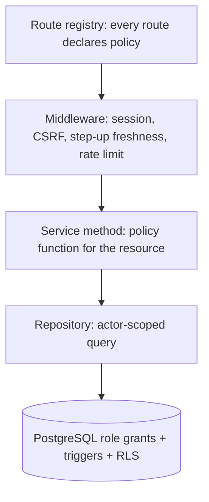

# Authentication and Authorization Architecture (Stage 2 design)

> **Status:** Stage 2 design; implemented in Stage 4 (authentication, authorization framework) and Stage 14
> (admin portal). Nothing here is implemented. FundZim makes no claim of conformance with any standard.
> **Decisions:** ADR-027 (sessions), ADR-017 (segregation of duties), baseline
> [§12](../stage-2/design-baseline.md) I-1, I-2, I-4, I-5, I-6.
> **Builds on:** [SECURITY.md](../SECURITY.md) §4–§6, §9–§10, §16; [operational-controls.md](../compliance/operational-controls.md);
> [identity-data-protection.md](identity-data-protection.md) §4.
> **Data model:** [docs/database/identity-schema.md](../database/identity-schema.md) and
> [`design/sql/0004_users_auth.sql`](../../design/sql/0004_users_auth.sql) (tables of baseline §5.4).
> **Per-endpoint matrix:** [docs/api/authorization-matrix.md](../api/authorization-matrix.md) (this document
> defines the model; the matrix assigns it to each route).

---

## 1. Principals

| Principal | Account | How it authenticates | Session |
|---|---|---|---|
| Guest donor | none | per-donation **access token** (I-2) | **none** |
| Donor / campaign owner / organisation member | `app.users.account_kind = 'USER'` | phone or email OTP; optional password | `app.sessions.kind = 'USER'` |
| Staff | `account_kind = 'STAFF'` (separate from any personal account; `staff_personal_user_id` links them for conflict checks) | password (Argon2id) **+** WebAuthn or TOTP (I-6) | `kind = 'STAFF'`, `mfa_verified_at` NOT NULL (DB CHECK) |
| Background job | none | in-process; actor `system` + job name | none |
| Provider / vendor | none | signature on raw body (+ authenticated status query where signing is weak) | none |

## 2. Sessions

### 2.1 Token and cookie

- Token: 256 bits from a CSPRNG, base64url. Only `SHA-256(token)` is stored (`app.sessions.token_hash`,
  `UNIQUE`, 32 bytes). A database dump yields no usable session.
- Cookie: `__Host-fz_session`; `HttpOnly`; `Secure`; `SameSite=Lax`; `Path=/`; no `Domain`; no `Expires`
  beyond the absolute lifetime. Local development uses `fz_session` (no HTTPS) — boot refuses that name in
  production.
- No JWTs for browsers. Short-lived signed tokens are used only for narrow purposes (presigned object URLs,
  donation access tokens are opaque and hashed).
- CSRF: SameSite + `Origin`/`Sec-Fetch-Site` check + session-bound `X-CSRF-Token` on every state-changing
  request (SECURITY §7.1).

### 2.2 Timeouts (configuration, not code)

| Setting | Users | Staff | Source |
|---|---|---|---|
| Idle timeout | `SESSION_IDLE_TIMEOUT` (starting point 7 d) | `STAFF_SESSION_IDLE_TIMEOUT` (15 min) | `.env.example`, SECURITY §6 |
| Absolute timeout | `SESSION_ABSOLUTE_TIMEOUT` (30 d) | `STAFF_SESSION_ABSOLUTE_TIMEOUT` (12 h) | |
| Step-up freshness | `STEP_UP_MAX_AGE` (10 min) | same | |
| OTP TTL / attempts | `OTP_TTL` ≤ 5 min / `OTP_MAX_ATTEMPTS` 5 | n/a | SECURITY §4.1 |

Sliding idle expiry updates `idle_expires_at` (never past `absolute_expires_at`; DB CHECK). Updates of
`last_seen_at` are throttled (e.g. once per minute) to avoid write amplification.

### 2.3 Rotation and revocation

| Event | Action | `revoked_reason` |
|---|---|---|
| Login | new session; pre-auth state discarded; client-supplied ids never accepted | — |
| Step-up, role grant/revoke, MFA change | rotate (new row, `rotated_from_id`; old row revoked) | `ROTATED`, `PRIVILEGE_CHANGE` |
| Phone/email (primary factor) change, password reset | revoke **all** sessions of the user | `PRIMARY_FACTOR_CHANGED` |
| ATO signal (TM-16), SIM-swap signal | revoke all; `ACCOUNT_HOLD` | `ATO_SIGNAL` |
| Logout | server-side revoke (cookie deletion is not enough) | `LOGOUT` |
| User revokes a device | revoke that session | `USER_REVOKED` |
| Staff/SECURITY_ADMIN revokes (`session.revoke`) | revoke | `STAFF_REVOKED` |
| Account suspended / closed | revoke all | `ACCOUNT_SUSPENDED` / `ACCOUNT_CLOSED` |

A revoked session can never be revived (trigger in 0004). Every request resolves the session by hash and
checks `revoked_at IS NULL`, both expiries and `users.status = 'ACTIVE'`.

### 2.4 Device / session list

`GET /api/v1/me/sessions` lists the caller's active sessions: `device_label`, coarse location from IP (not
the raw IP), `created_at`, `last_seen_at`, `auth_method`, `current: true|false`. `DELETE
/api/v1/me/sessions/{id}` revokes one (`404` if not the caller's). "Sign out everywhere" revokes all but the
current one.

## 3. Authentication flows

### 3.1 Users

```mermaid
sequenceDiagram
  participant B as Browser
  participant API as auth service
  participant DB as PostgreSQL
  participant SMS as SMS/email provider
  B->>API: POST /auth/otp {destination, purpose=LOGIN} (+ CAPTCHA after threshold)
  API->>DB: rate-limit check; insert otp_challenges (code_hmac, destination_hmac, purpose, expires_at)
  API->>SMS: send code (no PII in body)
  API-->>B: 202 (same response whether or not the account exists)
  B->>API: POST /auth/otp/verify {challenge_id, code}
  API->>DB: constant-time HMAC compare; attempts+1; single use
  API->>DB: insert sessions (token_hash, kind=USER, auth_method=PHONE_OTP)
  API-->>B: Set-Cookie __Host-fz_session
```

- **Primary factor:** OTP to a verified phone or email; codes are HMAC-stored, single-use, purpose-bound
  (`LOGIN`, `VERIFY_PHONE`, `VERIFY_EMAIL`, `PAYOUT_DESTINATION_CHANGE`, `BENEFICIARY_CONSENT`, …), one live
  challenge per destination and purpose.
- **Optional password:** Argon2id (parameters tuned in Stage 4; starting point m ≥ 64 MiB, t ≥ 3, p 1–4),
  breached-password check, minimum length 12, no composition rules. Stored as a PHC string in
  `app.password_credentials` (C3). A password never replaces OTP for recovery.
- **Optional passkey** for users (WebAuthn) reduces SIM-swap exposure (R-01); offered from Stage 4.
- **Enumeration resistance:** identical responses and timing for known/unknown identifiers.
- **Abuse:** per-phone/IP/global OTP budgets, +263 allow-list default, challenge after threshold
  (SECURITY §10.3). Rate limiter failure ⇒ fail closed on OTP send and login.

### 3.2 Email and phone verification

Adding a contact creates an unverified `user_emails`/`user_phone_numbers` row; a `VERIFY_*` OTP marks it
verified. A verified normalised email/phone belongs to at most one account (partial unique index in 0004).
Changing the **primary** contact needs step-up with the old factor, notifies old and new channels, revokes
all sessions and starts the payout cooling-off (`DESTINATION_HOLD` logic, EC-06).

### 3.3 Staff (I-6)

1. Username + **password** (Argon2id) — first factor.
2. **Mandatory** second factor: WebAuthn (preferred, phishing-resistant) or TOTP (seed encrypted with key
   class `mfa-secrets`). **No SMS or email OTP for staff** (SIM-swap).
3. Session created with `mfa_verified_at` set (DB CHECK `ck_sessions_staff_mfa`).
4. Optional IP/device restrictions for FINANCE and SUPER_ADMIN (Stage 14).
5. Recovery codes (`app.recovery_codes`, keyed hash) restore MFA; using one forces MFA re-enrolment and
   alerts the security owner.

### 3.4 Step-up

Required within `STEP_UP_MAX_AGE` for: adding/changing payout destinations, requesting a payout, changing
phone/email/password, closing a campaign with funds, exporting personal data, and — for staff — every
permission marked `requires_step_up` in `app.permissions` (approvals, KYC document view, reveals, holds,
freezes, role grants). Users step up with a fresh OTP (purpose-bound) or passkey; staff with WebAuthn/TOTP.
Success sets `sessions.step_up_at` and rotates the session. Checker approvals also store
`checker_step_up_at` on the request row (DB CHECK on `limit_change_requests`, `hold_release_requests`,
`role_assignment_requests`).

### 3.5 Password reset and account recovery (privileged)

| Case | Flow | Effects |
|---|---|---|
| User forgot password | OTP to verified primary contact → new password | revoke all sessions; `auth.recovery.completed`; payout hold + cooling-off |
| User lost phone (primary factor) | old factor if available; otherwise support-mediated (`account.recovery.assist`, step-up) with **identity re-verification** (`FACE_MATCH_LIVENESS` or `MANUAL_IDENTITY_REVIEW`, kyc §6) | `ACCOUNT_HOLD` until re-verified; all sessions revoked; payout `DESTINATION_HOLD`/cooling-off; notify all known channels |
| Staff lost MFA | recovery code, or SECURITY_ADMIN re-enrolment after identity check by a second staff member | session revoked; alert; audit `auth.mfa.*` |

SUPPORT never sees KYC documents during recovery: the KYC module returns pass/fail of the re-verification.

### 3.6 Guest donors (I-2)

Guest checkout creates **no session**. The donation response returns a **donation access token** once
(256-bit random); only `SHA-256` is stored in `app.donations.access_token_hash`. Presented as a bearer value
on `/api/v1/donations/{id}/receipt` and the guest refund-request route, it grants read access to that one
donation and receipt and the right to request a refund (refund still goes to the original instrument and
through maker-checker). It cannot be used for any other object; a wrong token gives `404`.

### 3.7 Machine and provider authentication

| Caller | Mechanism |
|---|---|
| PSP webhooks `/api/v1/webhooks/{provider}` | signature over the raw body with a secret/key from the secret manager (key class `webhook-secrets`), constant-time compare, timestamp window, `UNIQUE (provider, provider_event_id)` in `app.provider_webhook_inbox`, verify before parse; weak signing ⇒ authenticated status query before any state change (ADR-029). No session, exempt from CSRF. |
| KYC vendor callbacks | same rules; inbox `kyc.vendor_callback_inbox` (only verified rows; dedup). |
| Screening vendor callbacks | same; `compliance.screening_callback_inbox`. |
| Outbound calls to providers | mTLS or API keys per provider and environment from the secret manager; no `InsecureSkipVerify`. |
| Jobs | in-process; `actor_type = system` + job name in audit; the same service-layer authorization (system policies) applies. |
| Future machine API keys | need an ADR (ADR-027 §4): scoped, hashed, rotatable, audited. |

Rotation of webhook secrets supports an overlap window (accept old and new); the key reference used is
stored on the inbox row (`signing_key_ref`), never the secret.

## 4. Authorization model

### 4.1 Layers



1. **Route registry (deny by default).** Each route registers `{permission | ownership policy, step_up,
   maker_checker, audience}`. A test enumerates `ServeMux` routes and fails for any route without a
   declaration; the OpenAPI `x-fundzim-permission` extension is diffed against the registry.
2. **Service-layer policy functions** (jobs and internal calls go through them too).
3. **Repository-scoped queries** — the object is loaded *with* the actor predicate.
4. **Database** — role grants, append-only triggers, maker-checker CHECKs, RLS (data-protection-architecture §6).

### 4.2 RBAC: staff roles and permission catalogue

Permissions are rows in `app.permissions` (`is_sensitive`, `requires_step_up`); roles map to permissions in
`app.role_permissions`; assignments come only from an APPROVED `role_assignment_requests` row
(maker ≠ checker, no self-grant, role-level SoD conflicts in `roles.conflicting_role_codes`). Full catalogue
and role columns: [authorization-matrix.md §2](../api/authorization-matrix.md).

| Role | Purpose | Never holds by default |
|---|---|---|
| `REVIEWER` | campaign review, suspend/unsuspend | KYC documents, money, freeze |
| `KYC_REVIEWER` | KYC/KYB/beneficiary decisions, case-bound document view | payouts, refunds, ledger, campaign decisions |
| `SUPPORT` | masked user view, refund request, recovery assist | KYC documents, donor unmasking, approvals, destination changes |
| `COMPLIANCE` | cases, holds, freeze, STR (named staff), overrides, document view/reveal (justified) | payout approval (**never**, I-20), ledger adjustment, role grants |
| `FINANCE` | reconciliation, refunds approval, ledger adjustments (maker or checker, different person), payout approval with `payout.approve` (the **only** payout approvers; DUAL = two distinct FINANCE approvers, neither the requester — I-20) | KYC documents, campaign decisions, role grants |
| `BUSINESS_APPROVER` (I-4) | **approval-only**: fee schedule changes, write-offs above threshold, campaign review policy changes, business-owned limit changes | every operational permission; cannot be a maker |
| `SECURITY_ADMIN` | access reviews, session revoke, staff suspend, security kill switches, key rotation, `security_audit.read` (security audit chain only, I-23) | any KYC, financial or campaign data; `audit.read` of financial events |
| `ADMIN` | config change requests, content moderation | KYC documents **and KYC status** (I-5), ledger, payout approval, role grants |
| `SUPER_ADMIN` | role grant requests/approvals (different SUPER_ADMIN) | sensitive permissions, **KYC status** (I-5), self-grants |

Seed gap: `app.permissions` (0004) must gain `str.approve`, `limit.change.request`/`.approve`,
`gate_policy.change.request`/`.approve`, `hold.release.request`/`.approve`, `screening.decide`,
`fee.config.approve`, `recovery.write_off.approve` (I-23), `review_policy.approve`, and the `BUSINESS_APPROVER` role
(compliance-schema.md C-6).

### 4.3 ABAC: ownership and organisation roles

| Predicate | Definition | Used for |
|---|---|---|
| `isSelf(user)` | `actor.user_id = resource.user_id` | `/me/*`, own donations, own sessions |
| `ownsCampaign` | `campaigns.owner_user_id = actor` (individual campaigns) | edit, submit, updates, beneficiaries, payouts |
| `orgRole(org, role)` | active `organisation_members` row with that role for the campaign's/resource's organisation | organisation campaigns |
| `isGuestTokenFor(donation)` | `sha256(token) = donations.access_token_hash` | guest receipt/refund request (I-2) |
| `notConflicted(staff, object)` | no declared relationship, not owner/beneficiary/large donor, not the staff member's own personal account | every staff decision |

Organisation roles (I-1): **`ORG_ADMIN`** — members, settings, payout destinations (step-up), payout
requests, statements, campaigns; **`ORG_MEMBER`** — create/edit the organisation's campaigns; no payout,
member or destination rights. An `ORG_FINANCE` role can be added later as data (`organisation_roles`).
Organisation representatives also need an unrevoked, unexpired `kyc.representative_authorities` grant for
`org.payout.request` / `org.campaign.submit` (checked through the kyc service).

### 4.4 Object-level authorization (IDOR prevention)

| Rule | Design |
|---|---|
| Repository-scoped queries | Repositories expose `GetCampaignForOwner(ctx, actor, id)`, `ListDonationsForOwner(...)` etc. The SQL contains the actor predicate (`WHERE c.id = $1 AND (c.owner_user_id = $2 OR EXISTS (org membership))`). There is no unscoped `GetByID` reachable from user-facing handlers; staff repositories take a `StaffActor` and add the permission/conflict predicate. sqlc query names encode the audience. |
| Policy function per resource | `policy.Campaign.CanEdit(actor, campaign)`, `policy.Payout.CanRequest(...)`, … pure functions with table-driven tests; one per action, mirrored by the route registry. |
| 404 vs 403 | User-facing resource the actor has no relationship with ⇒ **404** (do not confirm existence). Actor is related but lacks the specific right (e.g. `ORG_MEMBER` requesting a payout) ⇒ **403** `FORBIDDEN`. Staff routes ⇒ 403 with the permission code. Hold/STR reasons never leak: payout blocked by a confidential hold ⇒ neutral `PAYOUT_UNDER_REVIEW`. |
| Per-audience DTOs | `PublicCampaign`, `OwnerCampaign`, `OrgCampaign`, `StaffCampaign`, `PublicDonation`, `OwnerDonation` (anonymous donor identity absent), `GuestDonation`; domain structs are never serialised. A DTO test feeds sentinel C2/C3 values and asserts they do not appear in lower audiences. |
| Input DTOs | unknown JSON fields rejected; `status`, `owner_user_id`, `amount_minor` of existing objects, `role` are never bindable. |
| IDs | UUIDv7 are not secrets; every route has a "different user's id ⇒ 404" integration test (SECURITY §9.2). |
| Deny-by-default test | route enumeration test (§4.1) + OpenAPI diff; a route without policy fails CI. |

### 4.5 Access by actor (summary)

| Actor | Can | Cannot |
|---|---|---|
| Guest donor | browse public pages; donate; view own donation/receipt and request refund via access token | any account data; any other donation |
| Donor (user) | own profile, sessions, donations, receipts; donate; report campaigns | other users' data; anonymous donor identities |
| Campaign owner | own campaigns (draft→submit at level gates), updates, beneficiaries, destinations (step-up), payouts (PAYOUT_VERIFIED, step-up), donor list minus anonymous donors | approve anything; see hold/STR reasons |
| `ORG_ADMIN` | organisation settings, members, destinations, payouts, campaigns, statements | KYC data of other persons |
| `ORG_MEMBER` | organisation campaigns (create/edit) | payouts, destinations, members |
| Reviewer | review queue, campaign decisions, suspend | KYC documents, money |
| KYC reviewer | case-bound KYC/KYB/beneficiary review and document view (justified, step-up, audited) | money, campaign decisions on the same HIGH-tier subject |
| Compliance officer | cases, holds, freezes, restrictions, screening decisions, STR (named), document view/reveal (justified) | approve payouts or ledger adjustments, grant roles |
| Finance operator | reconciliation, refunds approval, ledger adjustments (maker or checker), payouts with `payout.approve` | KYC documents; approve own requests |
| Business approver | approve fee, write-off, review-policy and business limit changes | initiate anything; operational actions |
| Support | masked user view, refund request, case creation, recovery assist | KYC documents/status detail beyond level, donor unmasking, approvals |
| Security admin | access reviews, session revoke, staff suspend, security kill switches, security audit | KYC, financial, campaign data |
| Administrator | config change requests, content moderation | KYC status/documents (I-5), ledger, payouts, roles |
| Super administrator | role grant requests/approvals (another SUPER_ADMIN approves) | self-grant, sensitive permissions, KYC status (I-5) |

## 5. Administrative segregation of duties

Maker-checker items (operational-controls §3) and their database home:

| Action | Maker | Checker | Pending object (DB) | DB enforcement |
|---|---|---|---|---|
| Payout above threshold / flagged | system or FINANCE | FINANCE `payout.approve` only (COMPLIANCE never approves payouts, I-20); DUAL = two distinct FINANCE | `app.payout_approvals` | approver ≠ requester, DUAL distinctness (0016) |
| Staff payout-destination override | SUPPORT/COMPLIANCE | FINANCE | `app.payout_destination_override_requests` | CHECK ≠ (I-3) |
| Refund | SUPPORT/COMPLIANCE | FINANCE `refund.approve` | `app.refund_requests` | CHECK ≠ (0015) |
| Dispute acceptance | FINANCE | FINANCE | `app.payment_disputes.accept_*` | CHECK ≠ |
| Ledger adjustment / reversal | FINANCE | different FINANCE | `ledger.ledger_adjustments` | CHECK ≠ (0006) |
| Write-off above threshold | FINANCE | BUSINESS_APPROVER (`recovery.write_off.approve`) | recovery case / adjustment | CHECK ≠ |
| Campaign unfreeze / compliance-hold release | COMPLIANCE | different COMPLIANCE (≠ placer) | `risk.hold_release_requests` | CHECK ≠ + trigger (0008) |
| Compliance restriction / override | COMPLIANCE | different COMPLIANCE | `compliance.compliance_restrictions` | CHECK ≠, mandatory expiry (0013) |
| Limit change | COMPLIANCE/FINANCE | approval owner (BUSINESS_APPROVER for business-owned) | `risk.limit_change_requests` | CHECK ≠ + trigger |
| KYC gate policy change | COMPLIANCE | different COMPLIANCE / BUSINESS_APPROVER | `kyc.gate_policies` | CHECK ≠ |
| Fee configuration | FINANCE | BUSINESS_APPROVER | `app.fee_schedule_change_requests` | CHECK ≠ (0007) |
| Campaign review policy | COMPLIANCE | BUSINESS_APPROVER | `app.campaign_review_policies` | CHECK ≠ (0014) |
| Role / permission grant | SUPER_ADMIN | different SUPER_ADMIN | `app.role_assignment_requests` | CHECK ≠, no self-grant, SoD conflicts (0004) |
| Kill switch / flagged feature change | SECURITY_ADMIN/FINANCE | different senior staff | `app.feature_flag_changes` | CHECK ≠ (I-3) |
| STR filing decision | named COMPLIANCE | second named COMPLIANCE | `compliance.str_reports` | CHECK ≠ + RLS |
| Evidence legal hold place/release | COMPLIANCE | second COMPLIANCE | `audit.evidence_holds` | CHECK ≠ (0003) |

Common rules: pending objects expire (never auto-approve); the checker sees the full diff/payload hash;
approval needs step-up; denied self-approval attempts are audited (`outcome = denied`) and alerted on
repetition; staff identity is bound to a person, so two accounts of one person are an access-review finding.

## 6. Account suspension and access revocation

| Trigger | Effect |
|---|---|
| User suspended (`user.suspended`, J) | `users.status = SUSPENDED`; all sessions revoked; `ACCOUNT_HOLD`; public campaigns per campaign lifecycle |
| Staff suspended (`staff.suspend`) | sessions revoked; active `role_assignments` revoked through a REVOKE request; pending approvals reassigned |
| Leaver | same business day: role revocation, sessions, provider-portal access, pending approvals reassigned |
| Role revoked | sessions rotated (`PRIVILEGE_CHANGE`); permission cache invalidated (cache TTL ≤ 60 s; permission checks for sensitive actions re-read the DB) |

## 7. Break-glass

`app.break_glass_grants`: one named permission, ≤ 1 hour, justification + incident reference, approver ≠
requester ≠ grantee, never role administration or ledger write, revocation set once. Every action under the
grant is tagged `break_glass = true` in audit events and alerts the security owner and a second senior
staff member; post-review within 2 business days. Database break-glass (named, time-boxed DBA login,
read-only by default) is in [data-protection-architecture.md §6.5](data-protection-architecture.md).

## 8. Audit events (auth/authz)

`auth.login.succeeded|failed`, `auth.otp.sent`, `auth.otp.failed_max_attempts`, `auth.session.revoked`,
`auth.mfa.enrolled|removed`, `auth.step_up.succeeded`, `auth.recovery.started|completed`,
`role.grant.requested|approved`, `role.revoked`, `breakglass.started|ended`, `*.approval.denied_self`.
Authentication telemetry (every attempt) goes to `app.security_events`; security-relevant actions to the
`audit.security_audit_events` chain, readable with `security_audit.read` (SECURITY_ADMIN; I-23) and never via `audit.read`.

## 9. Open items

| Item | Reference |
|---|---|
| SMS provider terms, prefix allow-list | LR-031 |
| Staff vetting before sensitive roles | LR-089 |
| CAPTCHA / proof-of-work choice | Stage 4 |
| Argon2id parameters on target hardware | Stage 4 |
| IP/device restrictions for FINANCE and SUPER_ADMIN | Stage 14 |
| Permission seed gaps (§4.2) | Stage 3/4 |
