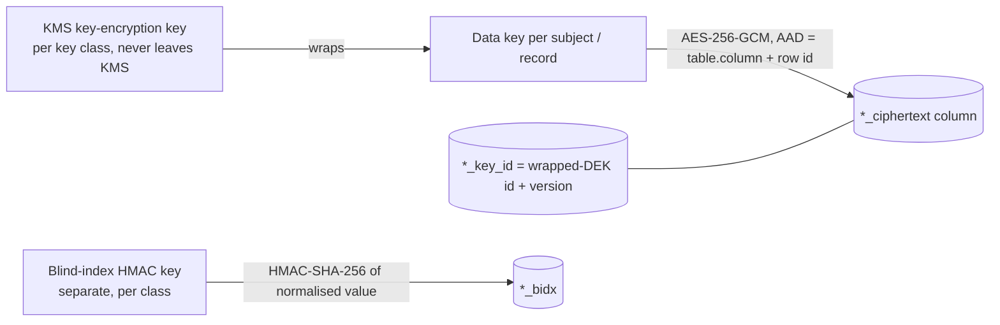
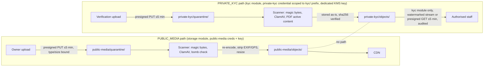

# Data Protection Architecture (Stage 2 design)

> **Status:** Stage 2 design; implemented across Stages 3, 5, 17 and 18. Nothing is implemented. FundZim
> makes **no** claim of compliance with the Cyber and Data Protection Act, PCI DSS or any other law or
> standard; legal points are `LEGAL_REVIEW_REQUIRED` with their LR id.
> **Builds on:** [SECURITY.md](../SECURITY.md) §11–§15, §17–§21; [DATA-CLASSIFICATION.md](../DATA-CLASSIFICATION.md);
> [PRIVACY.md](../PRIVACY.md); [identity-data-protection.md](identity-data-protection.md);
> [data-protection-assessment.md](../compliance/data-protection-assessment.md); ADR-008, ADR-009, ADR-022.
> **Schema:** [compliance-schema.md](../database/compliance-schema.md); grants
> [`design/sql/0018_grants.sql`](../../design/sql/0018_grants.sql) (tests: `design/sql/tests/grants_test.sql`).
> Trust boundaries diagram: [docs/architecture/trust-boundaries.md](../architecture/trust-boundaries.md).

---

## 1. Transport security

| Hop | Requirement |
|---|---|
| Internet → edge (web, API, webhooks) | TLS 1.2 minimum, **TLS 1.3 preferred**; TLS 1.2 limited to AEAD ECDHE suites; no TLS 1.0/1.1, no RSA key exchange, no CBC suites. Certificates via ACME/managed certs, expiry monitored. |
| HSTS | `Strict-Transport-Security: max-age=63072000; includeSubDomains` (+ `preload` once the domain is stable). `__Host-` cookies require HTTPS. |
| Edge → API / Next.js | TLS (re-encrypted) in production; plaintext only inside a single host's loopback. |
| API/worker → PostgreSQL | TLS with **`sslmode=verify-full`** (CA pinned per environment); boot refuses any other mode in production (SECURITY §14). Three pools (`fundzim_app`, `fundzim_kyc`, `fundzim_compliance`) each verify the server. |
| API → Redis | TLS + AUTH in production. Redis never holds C3/C4. |
| API → object storage, KMS, secret manager | HTTPS with certificate verification; provider SDK defaults, no custom transports. Three separate object-storage credentials (baseline §12 I-19): `public-media` (storage module, public bucket), `private-kyc` (kyc module only, `kyc/` prefix), `private-evidence` (storage module only, `compliance/` + `reports/` prefixes); neither private credential can read the other's prefix. |
| API → PSPs / KYC vendor / screening vendor / SMS / email | HTTPS, certificate verification (lint forbids `InsecureSkipVerify`); mTLS where the provider offers it. |
| Internal stance | Encrypt every hop that leaves a process, including inside a private network ("assume the network is hostile"); no service listens on plaintext ports in production except health probes bound to localhost. |

## 2. Encryption at rest

| Layer | Control | Key |
|---|---|---|
| DB volumes, WAL, snapshots | provider disk encryption | provider-managed or `db-volume` KMS key |
| `public-media` bucket | SSE | `public-media` key |
| private bucket: `kyc/` prefix (`PRIVATE_KYC` class) and `compliance/` + `reports/` prefixes (`PRIVATE_EVIDENCE` class) | SSE-KMS, bucket policy denies unencrypted PUT; per-prefix IAM policies bind each prefix to exactly one credential (I-19) | **dedicated** `private-kyc` KMS key (`stored_objects.encryption_key_id` NOT NULL for private classes, CHECK in 0005) |
| C3 fields | application envelope encryption (AES-256-GCM AEAD), per-subject data keys | key classes §3 |
| Backups | encrypted with a backup key ≠ live keys; stored in a separate account with object lock | `backup` key |

Disk/SSE encryption protects against media loss only; it does not protect against a compromised role.
That is what field encryption, role separation and audit are for (ADR-009 alternatives).

## 3. Key management

### 3.1 Envelope encryption

- The AEAD associated data binds a ciphertext to its table, column and row id, so a ciphertext copied to
  another row fails to decrypt.
- Wrapped DEKs live in a key store table owned by the module that uses the class (kyc: per-subject DEK
  referenced by `kyc.identities.subject_data_key_ref`); unwrapping is a KMS call logged by KMS.
- Decryption of C3 identity data by a human-initiated request emits an audit event (§9).

### 3.2 Key classes

| Key class | Protects | Holder (module / role) | Rotation | Shredding unit |
|---|---|---|---|---|
| `kyc-identity` | `kyc.identities.*_ciphertext`, `kyb_organisations.registered_address_ciphertext`, `*_callback_inbox.raw_payload_ciphertext` | kyc (`fundzim_kyc` pool) and compliance for screening inbox | KEK yearly or on incident (Stage 18 sets the period); re-wrap DEKs, no data re-encryption | per subject DEK |
| `kyc-blind-index` | `id_number_bidx`, `legal_name_bidx` | kyc | versioned (`bidx_key_version`); rotation = re-index job + dual lookup during migration | — |
| `payout-destination` | `app.payout_destinations` account-number ciphertext (baseline §5.17) | payouts | as above | per destination DEK |
| `payout-destination-bidx` | destination fingerprint / blind index (TM-06/TM-08 linkage) | payouts, risk reads fingerprints only | re-index | — |
| `mfa-secrets` | TOTP seeds (`app.mfa_methods`) | auth | re-wrap | per method |
| `otp-hmac`, `session-hash` pepper | OTP `code_hmac`, `destination_hmac`; recovery-code hashes | auth | overlap window; old codes expire naturally | — |
| `webhook-secrets` | PSP/vendor signing secrets and verification keys (secret manager, not DB) | psp, kyc, compliance | provider-driven, accept old + new during overlap | — |
| `private-kyc` (SSE) | objects in the private bucket (`kyc/`, `compliance/`, `reports/` prefixes) | KMS key usable by the `private-kyc` credential (kyc module) and the `private-evidence` credential (storage module), each limited to its own prefixes by IAM (I-19) | KMS automatic rotation | object deletion |
| `backup` | DB and bucket backups | ops | yearly | — |

All keys are C4: in KMS or the secret manager only, never in the repository, images, logs, tickets or the
database in usable form. Local development uses clearly-named local keys; boot refuses them in production.

### 3.3 Crypto-shredding

Deleting a subject's C3 data = delete objects + destroy the subject's DEK (`subject_data_key_ref`). Ciphertext
in rows and backups becomes undecryptable; rows themselves stay (append-only tables, proof of existence via
`evidence.purged`). Whether this counts as deletion is **LR-074**. Shredding runs only when the retention
class period has elapsed **and** no legal hold exists (§7).

## 4. Secrets management

- Runtime secrets come from the managed secret store (choice Stage 18), injected per container; the web
  container gets none of DB, PSP, KMS or HMAC secrets.
- Separate DB credentials per role/pool: `fundzim_app`, `fundzim_worker`, `fundzim_kyc`,
  `fundzim_compliance`, `fundzim_readonly`; `fundzim_migrator` credentials exist only in the migration pipeline.
- **Three** object-storage credentials (baseline §12 I-19): `public-media` (storage module; whole public
  bucket), `private-kyc` (kyc module only; `kyc/` prefix of the private bucket), `private-evidence` (storage
  module only; `compliance/` and `reports/` prefixes, for evidence and statement files). Neither private
  credential can read the other's prefix (bucket-policy test in Stage 5/18). The scanner has its own
  quarantine-read / promote-write role per bucket.
- Per-environment PSP credentials; sandbox credentials cannot reach production and vice versa.
- Rotation runbooks: DB passwords, PSP keys and webhook secrets, KMS keys, HMAC keys, session pepper.
  A leaked secret is rotated first, then purged from history. `scripts/check-secrets.sh` + gitleaks in CI.

## 5. Sensitive field encryption catalogue

| Column(s) | Class | Encryption | Blind index | Masked display |
|---|---|---|---|---|
| `kyc.identities.legal_name_*` | C3 | `kyc-identity` | `legal_name_bidx` | — |
| `kyc.identities.dob_*` | C3 | `kyc-identity` | — | age band only |
| `kyc.identities.id_number_*` | C3 | `kyc-identity` | `id_number_bidx` (`kyc-blind-index`) | `id_number_masked` (C2) |
| `kyc.identities.address_*` | C3 | `kyc-identity` | — | — |
| `kyc.kyb_organisations.registered_address_*` | C3 | `kyc-identity` | — | — |
| `kyc.vendor_callback_inbox.raw_payload_*` | C3 | `kyc-identity` | — | — |
| `compliance.screening_callback_inbox.raw_payload_*` | C3 | `kyc-identity` | — | — |
| `app.payout_destinations` account number | C3 | `payout-destination` | HMAC fingerprint | last 4 (C2) |
| `app.mfa_methods` TOTP seed | C4 | `mfa-secrets` | — | — |
| `app.password_credentials` hash | C3 | Argon2id (hash, not encryption) | — | — |
| `app.sessions.token_hash`, `otp_challenges.code_hmac`, `recovery_codes` hash | C3-handled | SHA-256 / HMAC | — | — |
| `app.donations.access_token_hash` | C3-handled | SHA-256 (I-2) | — | — |
| KYC/beneficiary documents, liveness media, STR drafts, case notes | C3 | SSE-KMS `private-kyc` + object never public | — | watermarked viewer |

DB guards: ciphertext ≥ 28 bytes and blind index = 32 bytes (CHECK in 0010), private objects require
`encryption_key_id` (CHECK in 0005), KYC documents can only reference `PRIVATE_KYC` objects (composite FK).

## 6. Database role separation

### 6.1 Roles

| Role | Used by | Owns objects? | Login in production |
|---|---|---|---|
| `fundzim_migrator` | goose migration pipeline | **all** schemas, tables, views, routines (0018 step 1) | pipeline only |
| `fundzim_app` | API pool | no | yes |
| `fundzim_worker` | worker pool (jobs); member of `fundzim_app` + worker-only routines (`ledger.fold_deferred_balances`, `audit.verify_chain`) | no | yes |
| `fundzim_kyc` | kyc module pool | no | yes |
| `fundzim_compliance` | compliance module pool | no | yes |
| `fundzim_readonly` | reporting/analytics (read replica where available) | no | yes |
| break-glass logins | named DBA per incident | no | time-boxed, alerted, session-recorded |

No runtime role owns anything, so none can `ALTER`, `DISABLE TRIGGER` or bypass RLS (test
`kyc_cannot_alter_its_tables`). No service uses a superuser.

### 6.2 Derivation rules (0018 `app.apply_runtime_grants()`)

1. Reset: revoke everything in the eight FundZim schemas from PUBLIC and the runtime roles.
2. `fundzim_app` on `app`, `risk`, `recon`: SELECT, INSERT; UPDATE unless the table has an
   `app.forbid_mutation()` UPDATE trigger; DELETE only on the ephemeral allow-list (`sessions`,
   `otp_challenges`, `idempotency_keys`, `upload_sessions`, `inbox_events`, `outbox_events`). Reference
   data (`status_transitions`, `currencies`, `permissions`, posting rules) is SELECT only.
3. `fundzim_app` on `ledger`: SELECT, INSERT; UPDATE only on non-append-only workflow tables
   (`ledger_adjustments`, `ledger_periods`, `ledger_balances` — the last is inert: a guard trigger rejects
   direct updates; the projection moves only via SECURITY DEFINER ledger routines).
4. `fundzim_app` on `audit`: SELECT, INSERT; column UPDATE of `evidence_records.legal_hold`.
5. `fundzim_app` on `queue`: full DML (River); default privileges cover future River tables.
6. `fundzim_app` on `compliance`: SELECT on `v_payout_blocking_cases`, `v_screening_status`,
   `v_active_restrictions` only. On `kyc`: nothing (no schema USAGE).
7. `fundzim_kyc`: `kyc` SELECT/INSERT (+UPDATE where not append-only), never DELETE; SELECT on
   `app.status_transitions` (read by the shared guard trigger); **no** privilege on `audit.*` or
   `app.outbox_events` — EXECUTE on the SECURITY DEFINER gateways `audit.append_event`,
   `audit.append_security_event`, `audit.record_evidence`, `app.enqueue_outbox` (validated input,
   pinned `search_path`, owner `fundzim_migrator`).
8. `fundzim_compliance`: same pattern on `compliance`, plus gateway `audit.set_evidence_hold`; in `risk`
   (risk module code on the compliance transaction): SELECT `limits`; SELECT/INSERT `holds`,
   `hold_events`, `hold_release_requests`; column UPDATE only on hold release columns, request decision
   columns and alert closure columns; SELECT `monitoring_alerts`.
9. `fundzim_readonly`: SELECT on `ro_*` views and the approved list (`ledger.v_trial_balance`,
   `ledger.v_pool_integrity`); never `kyc`/`compliance` (the procedure raises if an `ro_*` view appears there).
10. Routines: EXECUTE only on an explicit (routine, role) allow-list: CHECK helpers → `fundzim_app`
    (inherited by worker); `ledger.fold_deferred_balances`, `audit.verify_chain` → `fundzim_worker` only;
    gateways → `fundzim_kyc`/`fundzim_compliance`. Never `ledger.rebuild_balance` (break-glass) or the grant
    procedure. A test fails if any routine is executable outside the list or keeps default PUBLIC EXECUTE.
12. `fundzim_worker` = `GRANT fundzim_app TO fundzim_worker` (inherits) + worker routines.
11. Never: TRUNCATE, TRIGGER, REFERENCES for any runtime role (test).

### 6.3 Matrix (summary)

| | app/risk/recon tables | ledger | audit | queue | kyc | compliance tables | compliance views | ro_* views |
|---|---|---|---|---|---|---|---|---|
| `fundzim_app` | S I (U) (D allow-list) | S I (U workflow) | S I + U(legal_hold) | S I U D | — | — | S (3 views) | — |
| `fundzim_worker` | as `fundzim_app` (inherited) | as app + fold routine | as app + verify_chain | as app | — | — | as app | — |
| `fundzim_kyc` | status_transitions S; outbox via gateway | — | gateways only | — | S I (U) | — | — | — |
| `fundzim_compliance` | status_transitions S; outbox via gateway; risk subset (column UPDATEs) | — | gateways only (+ set_evidence_hold) | — | — | S I (U), RLS | S | — |
| `fundzim_readonly` | — | approved views | — | — | — | — | — | S |

`(U)` = only tables without an append-only UPDATE trigger. Append-only enforcement is **both** grants and
triggers (a mistaken grant still meets the trigger).

### 6.4 Row-level security for STR-restricted data — and its limits

RLS on `compliance_cases`, `compliance_case_events`, `compliance_case_links`, `str_reports`: restricted rows
are visible only when the transaction set `SET LOCAL fundzim.str_access = 'on'`, which the compliance
module does after checking `str.prepare`/`str.approve` and writing `compliance.str.accessed` to audit.

Limits (accepted, documented):

1. **Not a boundary against the compliance module itself.** Any code holding a `fundzim_compliance`
   connection can set the flag. RLS prevents *accidental* exposure (list views, forgotten filters, ad hoc
   queries, support tooling built on the compliance pool), not a compromised compliance module.
2. **Must be `SET LOCAL`.** A session-level `SET` would leak through the connection pool to the next
   borrower. The Go helper only exposes `WithSTRAccess(ctx, tx, …)` which issues `SET LOCAL` inside the tx;
   a lint rule bans plain `SET fundzim.`; a test proves the flag does not survive the transaction.
3. **Owner bypass is deliberate.** Tables are not `FORCE ROW LEVEL SECURITY`, so the view owner
   (`fundzim_migrator`) sees restricted cases and `v_payout_blocking_cases` keeps blocking STR subjects. The
   migrator is never a runtime login.
4. **Integrity triggers run as owner** (`SECURITY DEFINER`, pinned `search_path`) so constraint checks do not
   depend on caller visibility.
5. Stronger alternative if risk assessment requires it: a separate `fundzim_compliance_str` login used only
   by the STR sub-module, with policies keyed on `current_user` (one more pool). Deferred; ADR if adopted.

### 6.5 Break-glass database access

Named, individual login created for the incident (never shared), read-only by default, time-boxed (expiry
on the role), session-recorded via bastion, alerted to the security owner and a second senior person;
write access needs incident-commander approval; reviewed within 2 business days. Break-glass never grants
bulk KYC access, ledger write or role administration (operational-controls §5).

## 7. Data retention

Periods are **not set** in code or schema. Each record carries/inherits a retention class with a configured
trigger and period; an unset period means **retain** (identity-data-protection §7).

| Class | Applies to | Trigger (configurable) | Period | Deletion mechanism |
|---|---|---|---|---|
| `FINANCIAL` | payments, ledger, payouts, refunds, recon | transaction date | **LEGAL_REVIEW_REQUIRED (LR-012)** | not deleted; personal links pseudonymised where permitted |
| `KYC` | `kyc.*`, private-kyc documents | relationship end | LR-012, LR-074 | object deletion + crypto-shred |
| `CASE` | compliance cases, STR, screening | case closed | LR-012, LR-072 | object deletion; rows retained |
| `AUDIT` | audit and security audit events, evidence metadata | related record's class | LR-012 | never within retention; IP/UA pseudonymisation (AUDIT §8) |
| `CONSENT` | `kyc.consents`, terms acceptance | withdrawal / relationship end | LR-012, LR-035 | crypto-shred of linked C3 |
| `OPERATIONAL` | sessions, OTP challenges, security_events, idempotency keys, logs | creation | operations decision (not a legal claim) | row DELETE (allow-listed) |

Legal holds (`audit.evidence_holds`, maker-checker) override retention and erasure. Retention jobs (Stage
17/18) are audited system actions producing `evidence.purged` with counts and hashes, never content.

## 8. Secure backups

- PITR + daily encrypted base backups; backup key separate from backup storage credentials.
- Separate account/project with object lock (write-once retention) so app credentials cannot delete them.
- `private-kyc` replication/backups inherit C3 handling and the dedicated key; never copied to laptops.
- Restore tests (frequency Stage 18) into an isolated environment, followed by: ledger invariant check,
  audit chain verification (`audit.verify_chain`), grant-matrix diff, RLS test, and destruction of the
  restored copy.
- Production data never enters development or staging; fixtures are synthetic.
- Crypto-shredded subjects stay unreadable in backups because their DEKs are gone (LR-074 for adequacy).

## 9. Log redaction

- **Allow-list logging:** structured fields are logged only if declared loggable; bodies are never logged.
- Never logged (SECURITY §15): passwords, OTPs, tokens (session, CSRF, donation access token), keys,
  secrets, card data, PINs, full ID numbers, document content, liveness media, full account numbers,
  raw webhook/vendor payloads, medical text, STR or case content.
- Allowed: internal UUIDs, provider name and reference, masked phone `+26377****123`, masked account
  `****1234`, request/correlation ids, error codes.
- Error reporting: server-side scrubber + client `beforeSend`; DLP canary test seeds synthetic ID numbers
  and asserts absence in logs, traces and error reports (identity-data-protection §9).
- Audit events reference evidence ids; KYC values never appear in audit metadata (redaction test).

## 10. Administrative access controls

- Staff authenticate with password + WebAuthn/TOTP (authentication-authorization.md §3.3); sensitive actions
  need step-up and are maker-checker (§5 there).
- Masked-by-default staff UI; reveal of ID number, account number or anonymous donor identity is a separate,
  justified, audited, rate-limited action.
- KYC document access: `kyc.document.view`, case-bound, justification, watermarked streaming viewer,
  presigned GET ≤ 5 min only where needed, every issuance audited (`kyc.document.viewed`).
- ADMIN and SUPER_ADMIN have no KYC access and no KYC status by default (baseline I-5).
- Quarterly access reviews; monthly review of sensitive-access logs (operational-controls §6).
- Production DB access by humans only through break-glass (§6.5).

## 11. Trust boundary: public campaign media vs identity documents

| Control | Public media | Identity documents |
|---|---|---|
| Bucket class (DB) | `PUBLIC_MEDIA` | `PRIVATE_KYC` (`PRIVATE_EVIDENCE` for compliance evidence) |
| Credentials | storage module `public-media` credential | kyc module `private-kyc` credential (`kyc/` prefix only); compliance evidence and statements use the storage module's `private-evidence` credential (`compliance/` + `reports/` only). Neither private credential reads the other's prefix; the public-media credential reads neither (bucket policy tests) |
| Encryption | SSE | SSE-KMS dedicated key; `encryption_key_id` required |
| Pipeline | quarantine → scan → transform (re-encode, **EXIF/GPS strip**) → promote | quarantine → scan → promote unchanged (evidentiary); no derivatives on the public path |
| Allowed types | JPEG, PNG, WebP (no SVG) | JPEG, PNG, PDF |
| Filenames | server keys; original name as escaped metadata | server keys; **no original filename** (CHECK in 0005) |
| Serving | CDN after promotion | never public; ≤ 5-min presigned GET or streamed viewer, audited |
| DB references | `app.campaign_media` etc. FK to `(id, 'PUBLIC_MEDIA')` | `kyc.kyc_documents` composite FK to `(id, 'PRIVATE_KYC')`: a public object can never be a KYC document, and a KYC object can never be campaign media |
| Cross-promotion | **none**: no code path copies objects between buckets; the public media processor never receives private objects; the scanner has per-bucket roles | — |

## 12. Cross-border processing and hosting

Hosting region is **undecided (PD-38)** and depends on **LR-011** (cross-border transfer, localisation) and
LR-057/LR-058. Design constraints until decided:

- nothing precludes in-country hosting of the `kyc` schema and `private-kyc` bucket: they are separable
  (own role, pool, credentials, key) and could move to a separate database/bucket without schema change;
- every vendor receiving personal data (KYC, screening, SMS, email, error reporting) is recorded with data
  categories, location and transfer basis before go-live (CDPA s 28–29; SI 155 s 10(2)(c) notification);
- minors' data via foreign vendors/CDN needs the LR-070 position;
- vendor-side retention and deletion: LR-033, LR-074.

## 13. Threat model addendum (Stage 2)

New or changed threats introduced by Stage 2 decisions. THREAT-MODEL.md is updated from this list at the end
of the stage (not edited here); trust boundaries are drawn in docs/architecture/trust-boundaries.md.

| ID | STRIDE | Threat (Stage 2 cause) | Mitigation | Residual |
|---|---|---|---|---|
| T2-01 | I | RLS session flag misuse: code on the compliance pool sets `fundzim.str_access` without permission, or a session-level `SET` leaks through pooling | permission check + audit before `SET LOCAL`; lint bans plain `SET`; transaction-scope test; restricted rows only via compliance role | compromised compliance module can read STR data (§6.4) |
| T2-02 | E/I | New `fundzim_compliance` role: credential theft exposes cases and screening | separate secret, pool and credentials; no kyc/ledger access; RLS; rotation runbook | equal to compromise of a C3 store |
| T2-13 | I | One private-bucket credential reads both identity documents and compliance evidence (review H4) | three credentials with per-prefix scope (I-19): `private-kyc` (kyc only, `kyc/`) vs `private-evidence` (storage only, `compliance/`, `reports/`); cross-prefix read denied by policy test | shared KMS key: a KMS-level compromise still affects both prefixes |
| T2-03 | E/T | SECURITY DEFINER gateways (`audit.append_*`, `record_evidence`, `set_evidence_hold`, `app.enqueue_outbox`) misused to forge events in other domains or to smuggle C3 into audit metadata | owner `fundzim_migrator`, `search_path = pg_catalog, pg_temp`, fully qualified names; action/event-type domain allow-list; metadata size cap and never-embed key deny-list; EXECUTE only for kyc/compliance; tests | a compromised kyc/compliance module can still write misleading events within its own domains (the hash chain records them; it does not prevent them) |
| T2-04 | T | Evidence store: object overwritten or swapped after hashing | `content_sha256` verified on every read; write-once prefix with object lock (Stage 18); mismatch = SEV1 | none known |
| T2-05 | S/T | PSP webhook inbox and vendor callback inboxes: forged or replayed callbacks | verify-before-store (only verified rows, CHECK), dedup UNIQUE, timestamp window, status query where signing is weak, raw body encrypted | provider-side compromise (R-05) |
| T2-06 | I | Callback inbox raw bodies contain C3 (vendor extractions, match details) | ciphertext with `kyc-identity` key, retention + crypto-shred, no logging | — |
| T2-07 | E | Grant drift: a migration adds a table and forgets grants, or grants too much | fail-closed default privileges; re-run `apply_runtime_grants()` per migration; grant-matrix tests (no TRUNCATE, kyc unreachable, routine allow-list) | review of new allow-list entries |
| T2-08 | I | `v_payout_blocking_cases` reveals that a case exists for an STR subject (case id) | no type/reason/narrative; app cannot dereference; neutral owner errors (`PAYOUT_UNDER_REVIEW`) | existence inferable by app-role holders only |
| T2-09 | T | Compliance pool writes `risk.holds` directly (same-transaction requirement) | risk module code on the caller transaction; INSERT/SELECT + column-level UPDATE of set-once release columns only; release guard + `hold_release_requests` maker-checker; no DELETE | ownership enforced by code review/test (C-5) |
| T2-10 | E | Guest donation access token leaked (e.g. shared receipt link) | SHA-256 stored, scoped to one donation, read + refund request only, refund to original instrument via maker-checker | receipt data visible to the token holder |
| T2-11 | T | Limit or gate-policy tampering to loosen controls | versioned, maker-checker, immutable once approved, floors as CHECK, REGULATORY needs counsel ref | colluding maker + checker (access review) |
| T2-12 | D | Deferred constraint triggers (event-per-version) make bulk operations fail at COMMIT | intended fail-closed behaviour; bulk jobs write events in the same transaction | — |

## 14. Open items

LR-011, LR-012, LR-033, LR-034, LR-035, LR-057, LR-058, LR-070, LR-072, LR-074 (all OPEN); PD-38 (hosting
region); Stage 18: KEK rotation period, TLS cipher list review, backup restore frequency.
