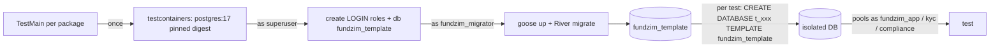
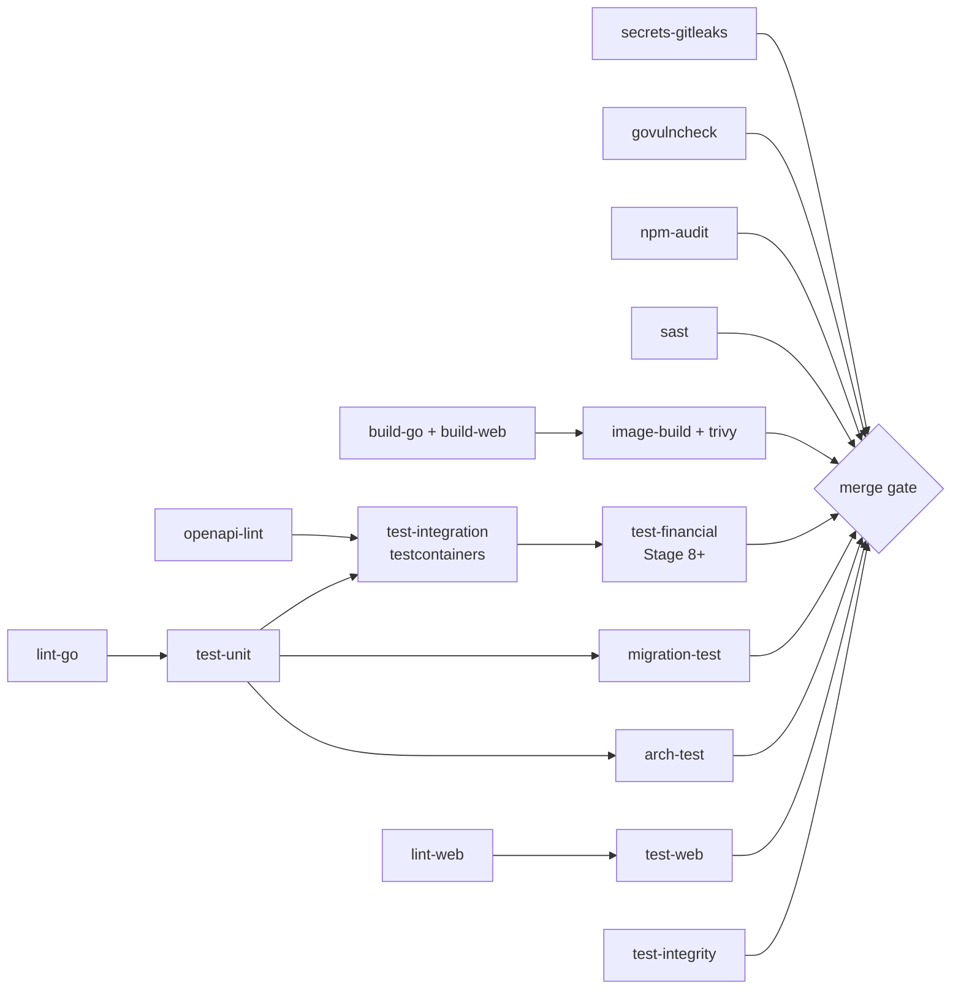

# Test Architecture

> **Status:** Stage 2 design. **No tests exist yet.** [TESTING.md](../TESTING.md) (Stage 0 strategy) still
> applies: principles, coverage floors, failure scenarios F1–F16, test-data rules. This document turns it into
> a concrete architecture: tooling, harnesses, ownership, a **minimum gate per stage** and the CI pipeline.
> Library choices are pinned at Stage 3. Where a library is named, verify the pinned version supports the
> required feature before relying on it.

Related: [TESTING.md](../TESTING.md) · [ROADMAP.md](../ROADMAP.md) ·
[background-processing.md](../architecture/background-processing.md) ·
[observability.md](../architecture/observability.md) ·
[performance-capacity.md](../architecture/performance-capacity.md) ·
[local-environment-design.md](../development/local-environment-design.md) ·
[design-baseline.md](../stage-2/design-baseline.md) · [design/sql/README.md](../../design/sql/README.md) ·
[dependency-rules.md](../architecture/dependency-rules.md) · [ledger-invariants.md](../architecture/ledger-invariants.md) ·
[payment-state-machine.md](../architecture/payment-state-machine.md) ·
[payout-state-machine.md](../architecture/payout-state-machine.md) ·
[payment-provider-interfaces.md](../architecture/payment-provider-interfaces.md) ·
[api/openapi/fundzim-v1.yaml](../../api/openapi/fundzim-v1.yaml) · [docs/api/](../api/) · [docs/security/](../security/)

---

## 1. Rules that shape the architecture

1. **Real PostgreSQL for anything that depends on PostgreSQL semantics:** constraints, triggers, grants,
   locking, isolation, `SKIP LOCKED`, River. Never SQLite, mocks or PGlite in the Go suites. PGlite remains
   only the Stage 2 draft validator, because it is single-connection and **cannot** test concurrency
   ([design/sql/README.md](../../design/sql/README.md)).
2. **Tests connect as the role production uses** (`fundzim_app`, `fundzim_worker`, `fundzim_kyc`, `fundzim_compliance`), never
   as a superuser. A test that passes only as superuser hides a grant bug.
3. **Deterministic inputs:** injected `clock.Clock`, `ids.Generator` and seeded randomness. Property tests
   print their seed on failure.
4. **Never skip, delete or weaken a test to go green** (CLAUDE.md). The CI job `test-integrity` (§7) fails if
   `t.Skip`, `.skip`, `test.fixme` or `//go:build ignore` appears in a diff without a linked approval label.
5. **Report honestly:** stage reports list the suites that ran, using the CI job names in §7.

## 2. Testing matrix

| Type | Scope | Tooling (pin at Stage 3) | DB | Location | Runs | First stage |
|---|---|---|---|---|---|---|
| Unit | Pure logic: money, state-machine edge tables, fee maths, envelope, config parsing, redaction | Go `testing`, table-driven; Vitest for web | none | beside code `*_test.go` | every push | 3 |
| Property / fuzz | Money, allocation, parsers, ledger rule balancing, webhook payload parsing | `pgregory.net/rapid`, `go test -fuzz`; `fast-check` (web money formatting) | none / real PG for ledger | beside code | push (bounded: 100 cases / 10 s fuzz); nightly (10k cases / 10 min fuzz per target) | 3 |
| Integration | Module service + DB + outbox/jobs | testcontainers-go (PostgreSQL 17, MinIO, Redis when needed) | real PG | `internal/<module>/…_integration_test.go` (build tag `integration`) | every push | 3 |
| **DB constraint** | Every DB-enforced invariant attacked directly in SQL as the app role | Go runner over SQL case files (§3.3) | real PG | `migrations/tests/*.sql` + `internal/platform/testkit` | every push | 3 |
| **Migration** | Apply from empty, roundtrip locally, grants, River schema | Go + testcontainers + `fundzimctl migrate` | real PG | `migrations/migrate_test.go` | every push | 3 |
| **Architecture** | Import graph (baseline §3), query ownership (baseline §5), no floats in money paths, route policies, event contracts | `go list -deps -json`, `pg_query_go`, custom analyzers ([dependency-rules.md §5](../architecture/dependency-rules.md)) | none | `tests/architecture` | every push | 3 |
| **API contract** | Responses conform to OpenAPI; every route is in the spec and vice versa; route registry deny-by-default | `httptest` + real router + an OpenAPI 3.1 validator (§3.4) | real PG | `tests/api` | every push | 3 (skeleton), grows each stage |
| **Authorization** | Endpoint × actor × ownership matrix, IDOR | Generated table tests from `authz_matrix.yaml` (§3.5) | real PG | `tests/api/authz` | every push | 4 |
| **Ledger invariant** | Random postings preserve L1–L10 / SC-1–SC-6 | rapid state machine + real PG + invariant checker | real PG | `internal/ledger/…`, `tests/financial` | push (bounded), nightly (extended) | 10 |
| **Concurrency** | Races on payouts, donations, webhooks, idempotency, transitions | Goroutines + barriers + `-race` | real PG (multi-connection) | `tests/financial`, module tests | push (bounded N), nightly (large N, many iterations) | 3 (idempotency), 8, 10, 11 |
| **Webhook idempotency** | Duplicate, out-of-order, replay window, signature failures | Sandbox provider + integration harness | real PG | `internal/payments`, `internal/psp`, `tests/financial` | every push | 8 |
| **Provider failure** | Sandbox fault scenarios (F1–F16) | Sandbox provider remote side (§3.9) | real PG | `tests/financial/failures` | push (core set), nightly (full) | 8 |
| E2E | Web journeys against api + sandbox | Playwright (mobile viewport first) + axe | compose stack | `tests/e2e` | PR to `main`, nightly | 4 (foundation), 7+ |
| Component | React components, a11y | Vitest + React Testing Library + axe | none | `apps/web/src/**` | every push | 3 (setup), 7+ |
| Security | Authn/z, CSRF, headers, uploads, webhook auth, redaction + scanners | Go tests, Playwright, gitleaks, govulncheck, `npm audit`, gosec (via golangci-lint) / semgrep, Trivy, ZAP baseline (later) | mixed | `tests/security` + CI jobs | push (fast), nightly (scans) | 3 (scanners, redaction, headers) |
| Performance | §15 of performance-capacity | k6, Lighthouse CI | staging-like | `tests/perf` | nightly / pre-release | 7 (web), 8 (donation), 19 (full) |

## 3. Test types in detail

### 3.1 Unit

- State machines: generate the full `state × state` matrix from the **same edge list** that seeds
  `app.status_transitions` (single source: `internal/<module>/statemachine/edges.go`, with the migration
  asserted equal to it by an integration test). Every allowed edge passes and every other edge fails
  (TESTING §3.1).
- Money: TESTING §4 properties. `amount_minor` JSON round-trip up to `math.MaxInt64`.
- Config: every unsafe production combination in SECURITY §14 plus the new rules in
  [local-environment-design.md §5.2](../development/local-environment-design.md) is refused (a table test per rule).
- Job registry: every kind declares queue, max attempts, timeout ≤ 10 min, and a `financial` flag
  ([background-processing.md §9.2](../architecture/background-processing.md)).

### 3.2 Integration harness

- **Per-test database cloned from a migrated template.** Schema names are fixed (`app`, `ledger` …), so
  per-test schemas are not possible, and transaction-rollback isolation would break the commit-time deferred
  triggers that the tests need. Cloning a template is fast (tens to hundreds of ms) and fully parallel-safe.
- One container per `go test` process, reused across packages through testcontainers' reuse feature when
  enabled locally. CI uses a fresh container per job.
- Fallback when testcontainers is unavailable: `FUNDZIM_TEST_DATABASE_URL` pointing at the compose
  `fundzim_test` database. The same template procedure applies.
- Helpers in `internal/platform/testkit`: `testkit.NewDB(t)` (pools per role, cleanup), `clocktest.Fixed`, `idstest.Sequence`,
  `jobtest.RunUntilIdle(ctx, client)` (works River queues synchronously in tests), `outboxtest.Drain`.

### 3.3 Database constraint tests (porting `design/sql/tests`)

The Stage 2 case files (`design/sql/tests/*.sql`, format `-- @case <name> expect=ok|error:<text>`) are
**ported, not reused in place**: `design/sql/` is non-executable by rule (baseline §10). Stage 3 copies the
cases for the tables it migrates into `migrations/tests/` and adapts them to goose-applied schemas. Later
stages port the rest as their tables are migrated.

Runner `internal/platform/testkit/sqlcases`:

- each case runs in its own transaction **on a connection authenticated as `fundzim_app`** (or the role named
  by an `-- @role` directive), so grants are tested for real rather than through `SET ROLE` from a superuser;
- `COMMIT` is issued explicitly so deferred triggers fire, and the expected error substring and SQLSTATE are
  asserted;
- **a case file must contain at least one `expect=error` case per invariant it claims to cover.** A meta-test
  fails if a design invariant ID (L1…L10, SC-1…SC-6, EC-…) listed in
  [ledger-invariants.md](../architecture/ledger-invariants.md) has no case.

Mandatory classes (DATABASE §15): unbalanced journal, single-entry journal, mixed currency, entry currency ≠
account currency, `UPDATE`/`DELETE`/`TRUNCATE` on ledger/audit/history tables, negative or zero amount,
unknown currency, duplicate idempotency key, illegal state transition (every guarded machine), second in-flight
payout per (campaign, currency), requester = approver, app role reading `kyc.*`, app role reading restricted
`compliance.*` rows, kyc role reading `app` tables it should not.

### 3.4 API contract tests

| Check | How |
|---|---|
| Response conformance | Every API test response passes through a validator against `api/openapi/fundzim-v1.yaml`: status code declared, body schema, envelope, `meta.request_id`, error `code` from the declared enum. **OpenAPI 3.1 support is required.** Candidate: `pb33f/libopenapi-validator` (supports 3.1). `kin-openapi`'s 3.1 support is partial, so verify before choosing. |
| Spec ↔ router parity | A test enumerates the route registry (§3.4.1) and the spec's operations. It fails on any route not in the spec, any spec operation without a route, or a method mismatch. |
| Deny-by-default | The route registry requires an explicit policy per route: `Public`, `Authenticated`, `Permission("x.y")` + ownership resolver, `Webhook(provider)` or `Internal`. A route registered without a policy **panics at startup**, and a test asserts that the panic happens. A test calls every non-public route anonymously and expects `401`, with `404` for routes where existence is sensitive. |
| Money fields | Every schema property named `amount_minor` is `type: string, pattern: ^[0-9]+$` (spec lint rule). Requests with JSON numbers for amounts are rejected (`422`). |
| Idempotency | Every operation tagged `x-idempotency: required` is tested for missing key (`400 IDEMPOTENCY_KEY_REQUIRED`), replay (identical response, no second side effect), key reuse with a different body (`409 IDEMPOTENCY_KEY_REUSED`), and concurrent same key (one execution) (TESTING §3.3). |
| Spec lint | Redocly CLI (`npx @redocly/cli@<pinned> lint`) in CI with the project ruleset ([docs/api/](../api/)) |

#### 3.4.1 Route registry

Each module's `http/` package registers its routes with a policy, through the `platform/httpx` route-policy helper, and `internal/app/router.go` mounts them on `http.ServeMux` ([go-module-design.md §1](../architecture/go-module-design.md)). The registry is data, so the tests above and the authz matrix can enumerate it.

### 3.5 Authorization matrix and IDOR

- `tests/api/authz/authz_matrix.yaml` (consistent with [docs/api/authorization-matrix.md](../api/authorization-matrix.md)) has one row per operation, with columns for actors:
  `anonymous`, `user_owner`, `user_other`, `org_member(role)`, `org_non_member`, and `staff(role)` for every
  staff role (SUPPORT, REVIEWER, COMPLIANCE, FINANCE, ADMIN, SECURITY_ADMIN, SUPER_ADMIN, per
  [SECURITY.md §5](../SECURITY.md) and [docs/security/](../security/)). Each cell holds an expected outcome
  (`allow`, `401`, `403`, `404`).
- The generator creates the fixtures (two users, two orgs, a resource owned by each) and runs every cell. A
  meta-test fails if an operation in the spec has no matrix row (**no endpoint without an explicit
  authorisation decision**, Stage 4 acceptance).
- **IDOR:** for every operation with a path ID, `user_other`/`org_non_member` must receive `404` (not `403`)
  where existence is sensitive, and **must not cause side effects** (row counts unchanged, no audit or outbox
  events).
- Staff special rules: ADMIN cannot view KYC documents without `kyc.document.view`. No role approves its own
  maker-checker request. Break-glass is audited.

### 3.6 Ledger invariant (property-based) tests

- **Model:** a `rapid` state machine whose actions are named posting rules (capture, PSP fee, settlement match,
  discrepancy, release, release with reserve, refund reserve/settle, chargeback, payout reserve, submit,
  complete, fail, reverse, freeze, unfreeze), with generated amounts (1 minor unit … near max), currencies
  (USD, ZWG) and campaigns/providers.
- **Executed against real PostgreSQL** through `ledger.Post`, so the deferred trigger, grants and projection
  updates run for real.
- After **every** action: L1 per transaction, L2, L3, L4, L8 (no negative `campaign_payable`), and SC-1. After
  every N actions and at the end: L9 global, L10 projection = recompute, SC-2 per provider and currency.
- Negative properties: every attempt to post a rule outside its allowed account patterns fails. A replay of
  any idempotency key returns the original transaction (L6). A second reversal of the same transaction fails
  (L7).
- Seeds are logged. Failures shrink to a minimal sequence, which is committed as a regression case.

### 3.7 Concurrency tests (real PostgreSQL only)

All use a `sync.WaitGroup` start barrier (TESTING §3.7: force interleavings, do not rely on luck), run under
`-race`, with N = 20 per push and N = 200 × 50 iterations nightly.

| Test | Setup | Assertion |
|---|---|---|
| **Concurrent payout requests, same campaign and currency** | Campaign with `campaign_payable` = B. N goroutines each `POST …/payouts` with distinct idempotency keys for amount a ≤ B. | **Exactly one** request succeeds (unique in-flight index, [payout-eligibility-and-controls.md §8](../payments/payout-eligibility-and-controls.md)). N−1 receive `409` with the in-flight error code. Exactly one `payout:{id}:reserved` journal. `campaign_payable` = B − a. L8 holds. |
| Same, amounts exceeding the balance | a > B | Zero succeed. No journals. |
| Multi-in-flight variant (PD-23, only if the index is ever relaxed) | k·a > B | Σ reserved ≤ B. The number of successes = ⌊B/a⌋. |
| Concurrent submit workers | One `APPROVED` payout, N workers run `payouts.submit` | Exactly **one** sandbox `CreatePayout` call (the sandbox counts calls per reference). One `SUBMITTED` transition. |
| Payout vs freeze race | Payout reserve and campaign freeze at once | Either the payout reserves before the freeze moves the remainder to `campaign_held`, or the reserve fails. Never both spending the same money. L8 and SC-1 hold. |
| Concurrent donations, one campaign | N captures | All posted exactly once. The projection equals the sum (L10). |
| Duplicate webhook, parallel workers | Same event delivered N times concurrently | One state change, one ledger posting (F1) |
| Same `Idempotency-Key`, concurrent | N identical requests | One execution. The others get the stored response or `409 IDEMPOTENCY_REQUEST_IN_PROGRESS`. |
| Same ledger idempotency key from two workers | Two posts | One transaction stored. Both callers get its ID (LEDGER §9). |
| Concurrent state transitions | Two workers move one intent | The transition guard + row count gives one winner. Precedence rules hold. |

### 3.8 Webhook idempotency tests

| Case | Expectation |
|---|---|
| Same event twice (sequential) | Second: `200`, `duplicate` metric, no new inbox row, no state change |
| Same event N× concurrently | One inbox row, one apply |
| Out-of-order (`succeeded` before `pending`; `refunded` before `succeeded`) | Precedence prevents regression. The early event is deferred and applied once the prerequisite exists, never lost (F3) |
| Replay outside the window (timestamp older than `PAYMENTS_WEBHOOK_TOLERANCE`) | `401`, nothing stored, `reason=timestamp` |
| Replay inside the window, same event id | Dedupe |
| New event id carrying an old state | Precedence no-op (`applied=false`) |
| Invalid signature / wrong secret / rotated secret overlap | `401` for invalid. Both active secrets accepted during rotation. |
| Unsigned provider mode (`WEBHOOK_UNSIGNED_VERIFY_BY_API`) | The payload is not trusted. The status API decides. |
| Crash after apply commit, before River completes | Retry is a no-op |
| Unknown provider event type | Stored as `OTHER` → `IGNORED`, ALR-W03 fires, nothing silently lost |

### 3.9 Provider failure tests (sandbox scenarios)

The sandbox remote side ([local-environment-design.md §2.1](../development/local-environment-design.md)) exposes
a test-only control API to script a scenario per provider reference. Every scenario asserts the final state,
the posting requests or ledger entries, audit and outbox events, metrics, and that the invariant checker
passes (from Stage 10).

| Scenario id | Sandbox behaviour | Expected | Maps to |
|---|---|---|---|
| SBX-01 | Accept → webhook `succeeded` | `SUCCEEDED`, one capture posting | baseline |
| SBX-02 | Decline (documented "not created") | `FAILED`, no posting | — |
| SBX-03 | **Timeout after request written** on create | `UNKNOWN`, poll scheduled, never `FAILED`. No re-create unless the capability says idempotent. | F4 |
| SBX-04 | Timeout, then status `PAID` on poll | `UNKNOWN → SUCCEEDED` (source `POLL`) | F4, F6 |
| SBX-05 | Timeout, then a late webhook success after hours | `SUCCEEDED` | F6 |
| SBX-06 | Connection refused before write | `ErrDefinitelyNotSent` → same-reference retry → success | §7.2 |
| SBX-07 | 5xx / malformed / unsigned response on create | `UNKNOWN` | F4 |
| SBX-08 | Status query 5xx/timeouts | Backoff. No state change. Alert after threshold. | F5 |
| SBX-09 | "Not found" within the propagation window, then found | Keeps polling, then resolves | §7.3 |
| SBX-10 | "Not found" past the window, provider documents finality | `FAILED (NOT_RECEIVED_BY_PROVIDER)` | §7.3 |
| SBX-11 | Never resolves | Horizon → `needs_reconciliation`, alert ALR-P02 | §7.3 |
| SBX-12 | Redirect claims success, provider says failed | Not `SUCCEEDED` | F13 |
| SBX-13 | Duplicate and out-of-order webhooks | As §3.8 | F1–F3 |
| SBX-14 | Payout timeout after write | Payout `UNKNOWN`, **zero resubmissions** (sandbox call count = 1), poll | F11 |
| SBX-15 | Payout rejected (invalid destination) | `FAILED`, release journal, destination flagged | F11 |
| SBX-16 | Payout completed, then returned | `REVERSED`, reversal journal | F11 |
| SBX-17 | Payout `FAILED`, then late completion | State unchanged. SEV1 event raised. | payout-lifecycle §5.3 |
| SBX-18 | Worker killed between provider call and Tx2 | Retry → `UNKNOWN`, no second call | F16 |
| SBX-19 | DB error injected after the state update, before the posting | Whole tx rolls back. Retry yields one effect. | F7 |
| SBX-20 | Refund timeout | Refund `UNKNOWN`, never re-created with a new `refund_id` | BP-5 |
| SBX-21 | Redis down during the donation flow | No financial effect. Rate limiter in local fallback. | F15 |
| SBX-22 | Provider outage (all calls fail) | Circuit opens. Collections refused. Polls continue. Payouts held. | incident §9 |

**Guard against BP-3 (no provider call inside a tx):** `platform/db` marks the context when a transaction
is open, and `platform/httpclient` (the tx-open guard in [go-module-design.md §3.1](../architecture/go-module-design.md)) **panics in test builds** (and logs an error plus a metric in production)
if it is invoked with such a context. Every integration test therefore enforces the rule.

### 3.10 Migration tests

| Test | Assertion |
|---|---|
| Apply from empty | `fundzimctl migrate up` as `fundzim_migrator` on an empty DB succeeds. The goose version equals the binary's expected version. River migrations apply in `queue`. |
| Re-run | A second `up` is a no-op |
| Local roundtrip | `up → down-to 0 → up` succeeds (verifies local-dev down migrations only; production is forward-only, ADR-028) |
| Previous-release upgrade (from Stage 4 on) | Migrate to the previous release's version, load fixtures, migrate to head. Data is intact (TESTING §5 gate 9). |
| Ownership | Every object in the FundZim schemas is owned by `fundzim_migrator`. `public` has no `CREATE` for `PUBLIC`. |
| Grants matrix | For each role × schema × table: the expected privileges equal `information_schema.role_table_grants` (golden file reviewed in PRs) |
| Append-only triggers | Every table on the append-only list has both `forbid_mutation` triggers |
| Transition guard parity | `app.status_transitions` edges equal the Go edge lists |
| Schema snapshot | `pg_dump --schema-only` (normalised) equals the committed snapshot, so review sees the effective schema diff |
| `CONCURRENTLY` migrations | Marked `-- +goose NO TRANSACTION` (lint check over migration files) |

### 3.11 E2E (Playwright)

Stack: compose `app` profile plus the sandbox. A mobile viewport (360×800) first, then desktop, with a
throttled network profile. Each run starts from `make db-reset`-equivalent fixtures and ends with the
invariant checker (TESTING §3.5). Journeys are added per stage (§6).

### 3.12 Performance (k6)

Scenarios from [performance-capacity.md §15](../architecture/performance-capacity.md): `campaign_page_viral`,
`donation_spike_one_campaign`, `webhook_burst`, `payout_queue_staff`, `soak_24h`. Thresholds are the latency
budgets in performance-capacity §4, encoded as k6 `thresholds`. Synthetic data volumes match the tier under
test. Results are stored as CI artefacts. A budget breach fails the nightly job but does not block PRs before
Stage 19.

### 3.13 Security tests

| Area | Tests | Stage |
|---|---|---|
| Secrets | `gitleaks detect` on every push (full history nightly) + `scripts/check-secrets.sh` | 3 |
| Go vulns | `govulncheck ./...` (fails on reachable vulns) | 3 |
| npm | `npm audit --audit-level=high` with a documented, time-limited exception file (the current `eslint-config-next` chain, DEVELOPMENT §9) | 3 |
| SAST | `gosec` via golangci-lint. `semgrep` with a pinned ruleset (SQL string building, `math/rand` for security, `InsecureSkipVerify`, floats in money packages). | 3 |
| Containers | Trivy image scan (high/critical gate) | 3 |
| Redaction | [observability.md §2.4](../architecture/observability.md) | 3 |
| Headers | HSTS, CSP, frame-ancestors, nosniff, Referrer-Policy on API and web responses | 3 |
| Auth, CSRF, sessions, OTP abuse | TESTING §3.6 | 4 |
| Uploads | Magic bytes, size, EICAR, EXIF stripped, KYC bucket not publicly reachable, credentials cannot cross buckets | 3 (three-credential bucket/prefix separation), 5/6 |
| Webhook auth | §3.8 | 8 |
| DAST | OWASP ZAP baseline against staging | 18 |

### 3.14 Architecture tests

| Test | Mechanism |
|---|---|
| Import graph | `go list -deps -json` over `./internal/...` and `./apps/...`, checked against `tests/architecture/modules.yaml`, which mirrors baseline §3 and is itself checked against the baseline tables ([dependency-rules.md §5.1](../architecture/dependency-rules.md)). Sub-package imports across modules are forbidden. Cycles fail. `internal/app` is imported by nothing. |
| Query ownership | Parses each module's sqlc query files (`internal/<m>/store/queries/*.sql`) with `pg_query_go` and fails on any table reference outside the module's owned set (baseline §5, [dependency-rules.md §5.2](../architecture/dependency-rules.md)) |
| No floats in money paths | A custom `go/analysis` analyzer forbids `float32`/`float64` in `internal/platform/money`, `ledger`, `fees`, `payments`, `payouts`, `reconciliation` and in any struct field named `*amount*` |
| Module public surface | Other modules may import only the root package of a module |
| Job registry | Every River kind is registered by exactly one module, with the queue from background-processing §3 |

## 4. Test ownership by domain module

"Owner" means the module's maintainers write and keep these tests green. Cross-cutting suites have a named
owner as well.

| Module | Unit | Integration / DB cases | Concurrency | Property | API/authz rows | Special |
|---|---|---|---|---|---|---|
| `platform` | money, ids, clock, envelope, config, logging redaction, mask | outbox, inbox, idempotency store, tx helper, job client | idempotency key race | money, allocation, parsers | health/readyz | BP-3 guard, job registry |
| `audit` | event builders | append-only, hash chain, grants | concurrent append chain order | chain verification | audit viewer (14) | — |
| `users` | validation | uniqueness (email/phone) | — | — | profile endpoints | — |
| `auth` | OTP, session policy | sessions, role assignments, maker-checker on grants | session rotation races | — | **owns `authz_matrix.yaml` framework** | brute force, CSRF, SMS pumping |
| `storage` | content sniffing | quarantine → scan → promote, bucket credential separation | — | — | upload sessions | EICAR, EXIF |
| `ledger` | rule definitions | **all ledger DB cases** (L1–L7), projections | donations and payout reservation races | **ledger state machine (§3.6)** | adjustments (maker-checker) | invariant checker (used by every suite after Stage 10) |
| `fees` | rounding, allocation | versioned schedules | — | fee allocation sums exactly | fee config | historical version stability |
| `psp` | adapter classification tables | webhook inbox, classification, capability registry | concurrent duplicate ingest | webhook payload fuzz | webhook endpoint | **sandbox provider + conformance suite** every adapter must pass (Stage 9) |
| `risk` | rule evaluation | holds, limits (fail closed on unconfigured) | hold vs payout race | — | — | — |
| `organisations` | roles | membership | — | — | org endpoints (IDOR) | — |
| `kyc` | level logic | `kyc` schema as `fundzim_kyc`, encryption round-trip, key rotation | — | — | KYC endpoints | audit on every access, presigned TTL |
| `notifications` | templates | send idempotency, suppression | duplicate receipt race | — | preferences | exactly-one receipt |
| `beneficiaries` | verification rules | — | — | — | — | — |
| `compliance` | screening matching | RLS on STR rows, `fundzim_compliance` grants | — | — | compliance endpoints | tipping-off controls |
| `campaigns` | state machine | transitions, freeze orchestration | simultaneous transitions | — | campaign endpoints (IDOR) | end-date job |
| `payments` | state machine + precedence | intents, events, refunds, disputes | webhooks/transitions | precedence (random event orders converge) | donation endpoints, idempotency | **SBX-01…13, 19–21** |
| `payouts` | state machine, eligibility | in-flight index, approvals SoD | **§3.7 payout tests** | — | payout endpoints | **SBX-14…18**, SC-2 gate |
| `reconciliation` | parsers, matching | idempotent import | concurrent match runs | matcher (any permutation of lines gives the same matches) | recon endpoints | F12 fixtures per mismatch type |
| `admin` | — | — | — | — | staff matrix rows | maker-checker via UI (14) |
| Cross-cutting: `tests/e2e` | — | — | — | — | — | Owner: web lead |
| Cross-cutting: `tests/financial` | — | — | — | — | — | Owner: tech lead (2 reviewers, DEVELOPMENT §5) |
| Cross-cutting: `tests/perf`, `tests/security` | — | — | — | — | — | Owner: platform/SRE, security owner |

## 5. Test infrastructure decisions

| Decision | Choice | Reason |
|---|---|---|
| PostgreSQL in tests | testcontainers-go with `postgres:17` (same digest as compose) | Same major version as production (TESTING §2) |
| Isolation | Per-test DB from a migrated template (§3.2) | Fixed schema names; deferred triggers need real commits |
| Build tags | `integration` for container-backed tests. `-short` skips them. CI always runs them. | Fast inner loop without Docker |
| Parallelism | `t.Parallel()` by default. Each test owns its DB. | |
| Time | `clock.Clock` injected. Jobs scheduled with `ScheduledAt` from the clock. `jobtest` can advance time. | Poll schedules and horizons are testable |
| Sandbox control | HTTP control API on the sandbox listener, test builds only | Scripted faults (§3.9) |
| Fixtures | Builders per module (`testfixtures`), synthetic data only (TESTING §6) | |
| Invariant checker | `ledger/invariantcheck` package callable from any test (`invariantcheck.MustPass(t, db)`), Stage 10 | Ends every integration/E2E suite |
| Docker access | **Blocked on the current machine** until the owner fixes socket permission ([local-environment-design.md §9](../development/local-environment-design.md)). CI is unaffected. | |

## 6. Minimum test gate per stage

A stage cannot be accepted unless its row passes in CI **and** every earlier row still passes. "New" lists
what the stage must add. Everything here is a floor: TESTING §5.1 coverage floors also apply from the stage
that introduces each module.

| Stage | Scope (ROADMAP) | New mandatory suites (must exist and pass) |
|---|---|---|
| **3** Core platform | Skeleton, config, logging, health, migrations, outbox/jobs, compose, CI | Unit: money (+ property + fuzz), ids, envelope, config refusal table, redaction. Migration tests (§3.10: empty, re-run, roundtrip, ownership, grants golden, append-only triggers). DB cases for the Stage 3 tables only (baseline §12 I-18): platform tables, `audit.audit_events` and `audit.security_audit_events` (they reject `UPDATE`/`DELETE`/`TRUNCATE` as `fundzim_app` and `fundzim_worker`, Stage 3 acceptance). `fundzim_worker` privilege parity, and the api role denied on worker-only routines. Outbox → dispatch → consumer once (incl. duplicate delivery). River job in schema `queue` as the app role. Idempotency store concurrency (same key race). Architecture tests (import graph, query ownership, no-float analyzer, BP-3 guard). API: route registry deny-by-default, spec ↔ router parity, envelope conformance for health/readyz/error paths. Three-credential storage separation (bucket and prefix, I-19). Security scanners (gitleaks, govulncheck, npm audit, gosec/semgrep, Trivy). Web: Vitest + RTL harness with ≥ 1 real component test (no empty-harness claims). |
| **4** Auth & identity | OTP, sessions, MFA, RBAC | Auth flow integration. OTP expiry/reuse/attempts. Rate limit incl. Redis-down fallback (F15). CSRF. Session fixation/rotation/timeouts. **Authz matrix framework + rows for every endpoint**, with a meta-test that no endpoint is missing. Role grant maker-checker. SMS pumping budget. Playwright foundation + axe (sign-up/OTP journey). |
| **5** KYC | Levels, `kyc` schema, encryption, uploads, vendor fake | `fundzim_kyc` isolation (app role denied). Encryption round-trip + key rotation. Blind index. EICAR blocked. Presigned TTL ≤ 5 min. **Audit-on-every-document-access** test. Access denied without `kyc.document.view` (ADMIN included). No KYC values in logs/audit (redaction). |
| **6** Campaigns | Lifecycle, review, media pipeline | Exhaustive campaign transition matrix (Go + DB guard). Concurrent transitions. IDOR on every campaign endpoint. Media pipeline (scan → re-encode → promote, EXIF stripped). Fundraising authority caps the end date. `campaigns.end_date_complete` job. Freeze orchestration (ledger stub until Stage 10). |
| **7** Public experience | Pages, donation UI (mocks) | Playwright mobile journeys. axe WCAG 2.2 AA checks. Lighthouse budget. "Never confirmed without server confirmation" UI test. OG/preview metadata tests. |
| **8** Payment abstraction | Payments, sandbox, inbox, idempotency | Payment state machine + precedence (property: random event orders converge). **Webhook idempotency suite (§3.8)**. **SBX-01…13, 19–21** with assertions against the `ledger.Post` stub (one posting request per key). F1–F7, F13, F14. Concurrency: duplicate webhooks, same idempotency key, concurrent transitions. Donation E2E against the sandbox. BP-3 guard active. Routing refuses `MERCHANT_SETTLEMENT`. ZWG sandbox-only gate. |
| **9** ZW integrations | Real adapters (sandbox envs) | **Provider conformance suite** (the same suite the sandbox passes) per adapter. Recorded-fixture tests. Webhook verification per provider incl. secret rotation. Classification tables (every documented error code → class; unmapped → `OUTCOME_UNKNOWN`). Config refuses LIVE endpoints outside production. |
| **10** Ledger | Ledger, postings, projections, invariants | **Ledger property state machine (§3.6)**. All ledger DB cases (L1–L7). L9/L10 jobs. Concurrent donations. Same-key concurrent post. **Invariant checker wired into every integration and E2E suite.** Ledger-level assertions added to F1, F6, F7 (TESTING §3.9). Projection rebuild requires maker-checker. Bulk-journal trigger performance test. |
| **11** Payouts | Requests, eligibility, approvals, execution | **Concurrent payout tests (§3.7)**. Duplicate payout (same/different keys, F10). **SBX-14…18** (UNKNOWN never resubmitted; sandbox call count = 1). F9–F11. Approval segregation (requester ≠ approver, DB trigger + API). Eligibility fail-closed on unconfigured limits. SC-2 gate blocks submission when stale/failed. Kill switches. |
| **12** Fees | Schedules, postings | Exhaustive rounding. Allocation sums exactly (property). Historical schedule version retained. Fee config maker-checker. Disclosure equals ledger. |
| **13** Risk | Rules, holds, screening | Scenario tests per monitoring rule (TM-01…19 as implemented). Automatic holds block payouts (integration with payouts). Explainability record present. Screening fail-closed. False-positive fixture review recorded. |
| **14** Admin portal | Staff UI | Permission-matrix E2E for every staff screen. Maker-checker via UI. Audit coverage test (every staff mutation produces an audit event). Break-glass flow. Masked PII in search. |
| **15** Notifications | Email/SMS adapters | Template rendering. **Exactly-one receipt** per financial event under duplicate events and retries. Opt-out honoured, except for mandatory messages. Provider failure/retry. |
| **16** Discovery | Search, sharing | OG validators. Search relevance fixtures. Ranking-abuse controls. Attribution reveals no individual donor paths. |
| **17** Reconciliation | Import, matching, reports | Fixture statements for **every mismatch type** (F12). Idempotent re-import (same file hash). Matcher permutation property. Discrepancy → case, never an automatic ledger fix. SC-3/SC-4 jobs. Trial balance per currency. |
| **18** Security hardening | Hardening, IaC, DR | ZAP baseline. Container and dependency scans clean or risk-accepted. Audit hash-chain verification job. Backup restore drill **followed by the invariant checker**. Secret rotation runbook tests. Pen-test findings tracked. |
| **19** Financial validation | Full failure/load testing | **Full SBX/F1–F16 matrix, repeated** (≥ 100 iterations each, zero invariant violations). Extended concurrency (N=200). k6 tier scenarios at target load with measured capacity limits documented. Chaos: DB failover, Redis loss, worker kills. Alert firing verified for every ALR-* financial alert. |
| **20** Pilot certification | Go/no-go | Evidence pack: all suites green on the release candidate, coverage report, scan reports, DR drill record, alert verification. Production smoke tests with controlled small-value transactions (only after legal gates, ROADMAP Gate C). |

## 7. CI pipeline (GitHub Actions)

Workflow files are created in Stage 3 ([STAGE-2-TO-STAGE-3.md §10](../stage-handover/STAGE-2-TO-STAGE-3.md)).
All actions are pinned by commit SHA, and the `GITHUB_TOKEN` defaults to `contents: read`.

| Job | Runs | Content | Gate |
|---|---|---|---|
| `lint-go` | push/PR | `gofmt -l`, `go vet`, `golangci-lint` (incl. gosec, forbidigo), `go mod tidy` diff empty, `sqlc generate` diff empty | required |
| `lint-web` | push/PR | ESLint, `tsc --noEmit` | required |
| `openapi-lint` | push/PR | Redocly lint with the project ruleset | required |
| `test-unit` | push/PR | `go test -race -short ./...` with coverage | required |
| `test-web` | push/PR | Vitest | required (Stage 3+) |
| `test-integration` | push/PR | `go test -race -tags integration ./...` (Docker available on GitHub-hosted runners) | required |
| `migration-test` | push/PR | §3.10 | required |
| `arch-test` | push/PR | §3.14 | required |
| `test-financial` | push/PR (bounded), nightly (extended) | `tests/financial`: concurrency, SBX scenarios, ledger property | required from Stage 8 |
| `secrets-gitleaks` | push/PR, nightly full history | gitleaks | required |
| `govulncheck` | push/PR | | required |
| `npm-audit` | push/PR | high/critical gate with an exception file (expiry dates enforced) | required |
| `sast` | push/PR | semgrep pinned rules | required |
| `build` | push/PR | Go binaries (`-trimpath`), Next build | required |
| `image-build` + `trivy` | PR to `main`, nightly | Distroless/non-root images, Trivy high/critical | required for `main` |
| `test-integrity` | PR | Fails if the diff adds skips/fixme/deleted tests or weakened assertions without the `test-change-approved` label + reviewer | required |
| `e2e` | PR to `main`, nightly | Compose `app` profile + Playwright | required from Stage 7 for `main` |
| `perf` | nightly | k6 + Lighthouse CI | informational until Stage 19 |
| `zap-baseline` | nightly vs staging | ZAP | from Stage 18 |

Nightly also runs: extended fuzz/property runs, the full SBX matrix, concurrency N=200, E2E on all viewports,
full-history gitleaks, and (Stage 18+) audit hash-chain verification.

## 8. Flaky tests

Quarantine requires an issue, an owner and a deadline (TESTING §1), and is **forbidden** for financial
invariant, idempotency, concurrency, authorisation and security tests. A flaky concurrency test is treated as a
**potential race in production code** until proven otherwise.

## 9. Concerns

| # | Concern | Handling |
|---|---|---|
| TAC-1 | Docker socket permission blocks testcontainers locally | Owner action ([local-environment-design.md §9](../development/local-environment-design.md)). CI is unaffected. Stage 3 acceptance needs local or CI evidence. |
| TAC-2 | The OpenAPI 3.1 validator library choice is unverified | Spike at the start of Stage 3. The fallback is to validate responses with a JSON Schema 2020-12 validator against component schemas extracted from the spec. |
| TAC-3 | The `design/sql/tests` case format must stay portable to the Go runner | Keep the `-- @case` / `expect=` format. Add `-- @role`. |
| TAC-4 | The SBX scenarios rely on PCR-documented behaviours (idempotent creation, "not found" finality) that are unknown per provider | The sandbox implements both variants behind capability flags. Tests cover both. |
| TAC-5 | Per-test template cloning requires `CREATEDB` for the test bootstrap role | Only in the test container (superuser bootstrap). Never granted to app roles. |
